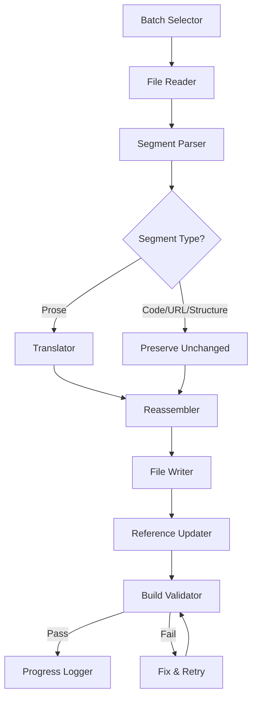

# Design Document: Chinese-to-English Translation

## Overview

This design covers the systematic translation of the AI Engineering Learning Framework from Simplified Chinese to English. The system processes ~510 markdown files (8 top-level documents, ~500 lesson documents, and 2 glossary files), translating all Chinese prose while preserving code, URLs, structural markers, and the site build pipeline.

The translation is a batch-oriented, file-by-file transformation that:
1. Parses each markdown file into translatable (prose) and non-translatable (code, URLs, structure) segments
2. Translates prose segments from Chinese to English
3. Reassembles the file preserving all non-translatable segments byte-identical
4. Renames lesson files from `zh.md` to `en.md` and updates references across the codebase
5. Validates each batch by running `node site/build.js` to confirm structural integrity

### Key Design Decisions

- **No separate translation engine**: Translation is performed inline by the AI assistant processing files in batches, not by a standalone automated tool.
- **Preservation-first approach**: The parser identifies and locks non-translatable segments before translation begins, eliminating accidental corruption.
- **Batch verification**: Each phase batch is validated against the build pipeline before proceeding, catching structural regressions immediately.
- **Terminology consistency**: A fixed terminology mapping (from TRANSLATION.md) is applied across all documents to ensure uniform vocabulary.

## Architecture

The translation workflow operates as a sequential pipeline with verification gates:



### Batch Processing Order

| Batch | Contents | Files |
|-------|----------|-------|
| 0 | Top-level documents (README, ROADMAP, CONTRIBUTING, etc.) | 8 |
| 1 | Phase 0 lessons | 12 |
| 2 | Phase 1 lessons | 22 |
| 3–20 | Phases 2–19 lessons | ~25 avg |
| Final | Glossary files + reference cleanup | 2+ |

## Components and Interfaces

### 1. Segment Parser

Responsibility: Split a markdown file into an ordered list of segments, each tagged as translatable or non-translatable.

**Non-translatable segment types:**
- Fenced code blocks (` ``` ` to ` ``` `)
- Mermaid diagram blocks (` ```mermaid ` to ` ``` `)
- Inline code spans (single backtick)
- URLs (http/https links including query params and fragments)
- File paths (relative paths like `phases/00-.../docs/zh.md`)
- Product/library names (from a known list: PyTorch, NumPy, uv, pnpm, etc.)
- HTML tags and alignment blocks
- Badge image URLs
- ASCII art dividers (░▒ lines)
- Emoji status characters (✅, 🚧, ⬚)
- Table delimiter rows (pipe-and-dash lines)
- Frontmatter blocks (--- delimiters)
- Image references (``)

**Translatable segment types:**
- Prose paragraphs
- Heading text (excluding structural markers)
- Blockquote text
- List item text
- Table cell text (prose portions only)
- Code block comments containing Chinese text

### 2. Translator

Responsibility: Convert Chinese prose segments to English following quality standards.

**Rules:**
- Use the fixed terminology table from TRANSLATION.md (reversed — Chinese → English)
- Apply standard section heading mappings (学习目标 → Learning Objectives, etc.)
- Apply standard metadata label mappings (类型 → Type, 语言 → Languages, etc.)
- Produce direct, concise English — no filler, no padding phrases
- Preserve paragraph count, bullet order, and section order

### 3. Reference Updater

Responsibility: After translating and renaming lesson files, update all `docs/zh.md` references to `docs/en.md`.

**Scope of reference scan:**
- All `.md` files in the repository
- `site/build.js` (hardcoded path in `extractLessonMeta`)
- Any `.py`, `.js`, `.html` files that reference lesson docs

### 4. Build Validator

Responsibility: Run `node site/build.js` after each batch and verify:
- Exit code is 0
- `site/data.js` is non-empty
- No error output on stderr
- Phase count in `site/data.js` matches ROADMAP phase headers
- Glossary term count matches `### Term` headings in `glossary/terms.md`

### 5. Progress Logger

Responsibility: Record completed batches with:
- Batch identifier (e.g., "batch-0-top-level", "batch-1-phase-00")
- File count translated
- Build validation result (pass/fail)
- Timestamp

## Data Models

### Segment

```typescript
interface Segment {
  type: 'prose' | 'code_block' | 'mermaid' | 'inline_code' | 'url' | 
        'file_path' | 'product_name' | 'html' | 'ascii_art' | 'emoji' |
        'table_delimiter' | 'frontmatter' | 'image_ref' | 'code_comment';
  content: string;          // Original content
  translatable: boolean;    // Whether this segment should be translated
  line: number;             // Starting line number in source file
}
```

### TranslationResult

```typescript
interface TranslationResult {
  sourcePath: string;       // Original file path (e.g., docs/zh.md)
  targetPath: string;       // Output file path (e.g., docs/en.md)
  segments: Segment[];      // Ordered segments after translation
  codeBlockCount: number;   // Count of fenced code blocks (for validation)
  metadata: {
    headingsPreserved: boolean;
    cjkFreeInProse: boolean;
    structureIntact: boolean;
  };
}
```

### BatchResult

```typescript
interface BatchResult {
  batchId: string;          // e.g., "batch-03-phase-02"
  filesProcessed: number;
  filesSkipped: number;     // Directories without zh.md
  buildExitCode: number;
  buildValid: boolean;
  timestamp: string;        // ISO 8601
}
```

### TerminologyMapping

```typescript
interface TermMapping {
  chinese: string;          // e.g., "反向传播"
  english: string;          // e.g., "Backpropagation"
  context?: string;         // When to use this specific mapping
}
```

## Correctness Properties

*A property is a characteristic or behavior that should hold true across all valid executions of a system — essentially, a formal statement about what the system should do. Properties serve as the bridge between human-readable specifications and machine-verifiable correctness guarantees.*

### Property 1: Non-translatable element preservation

*For any* markdown document processed by the Translation_System, all non-translatable elements (fenced code blocks, inline code spans, URLs, file paths, product/library names, mermaid diagram blocks, HTML tags, emoji status characters, table delimiter rows, ASCII art, image references, and frontmatter blocks) SHALL be byte-identical in the translated output compared to the original source.

**Validates: Requirements 1.2, 2.3, 2.6, 8.1, 8.2, 8.3, 8.4, 8.5, 8.6, 8.7, 8.8**

### Property 2: No residual CJK in prose sections

*For any* translated document (top-level or lesson), scanning all prose segments (text outside of fenced code blocks, inline code spans, URLs, and product names) SHALL find zero characters in the CJK Unified Ideographs range (U+4E00–U+9FFF).

**Validates: Requirements 1.7, 2.7**

### Property 3: Code comment translation preserves code syntax

*For any* fenced code block containing Chinese comments, translating the comments to English SHALL preserve all non-comment code tokens (variable names, function names, imports, commands, operators, and indentation) byte-identical to the original.

**Validates: Requirements 1.3, 2.4**

### Property 4: Lesson document standard structure

*For any* translated lesson document, all `##` section headings SHALL be members of the approved set {"Learning Objectives", "The Problem", "The Concept", "Build It", "Use It", "Ship It", "Exercises", "Key Terms", "Further Reading", "Pitfalls", "Connections"}, and all metadata field labels SHALL exactly match {"**Type:**", "**Languages:**", "**Prerequisites:**", "**Time:**"}.

**Validates: Requirements 2.2, 2.5**

### Property 5: Glossary structural integrity

*For any* term entry in the translated glossary/terms.md, the entry SHALL consist of a `### Term` heading (unchanged from original), followed by lines matching `**What people say:**` and `**What it actually means:**`, with the "Why it's called that" field present only if it existed in the original. All alphabetical letter headings (`## A`, `## B`, etc.), bullet-point structure, and horizontal rule separators SHALL be preserved.

**Validates: Requirements 4.1, 4.2, 4.3, 4.5, 6.4**

### Property 6: ROADMAP structural integrity

*For any* phase header in the translated ROADMAP.md, the line SHALL match the regex `^##\s+Phase\s+(\d+).*?—\s*(✅|🚧|⬚)`. *For any* lesson row, the line SHALL match `^\|\s*\d+\s*\|.+\|\s*(✅|🚧|⬚)\s*\|`. All estimated time values (e.g., `~75 min`) SHALL be identical to the original.

**Validates: Requirements 5.3, 5.4, 6.2**

### Property 7: Reference update completeness

*For any* file in the repository after translation completes, scanning all file contents SHALL find zero occurrences of the string `docs/zh.md` (except within explicitly preserved historical references or quotations if any).

**Validates: Requirements 3.3**

### Property 8: Document structure count invariant

*For any* translated document, the count of fenced code blocks (``` pairs), the count of paragraphs, the count of headings at each level, and the count of bullet list items SHALL equal the corresponding counts in the original source document.

**Validates: Requirements 9.4, 10.2**

### Property 9: Terminology consistency

*For any* technical term that has a standard English equivalent in the project terminology table (backpropagation, gradient descent, attention mechanism, tokenizer, embedding, fine-tuning, etc.), all occurrences across all translated documents SHALL use the same English term consistently.

**Validates: Requirements 9.3**

## Error Handling

### File Not Found
- If a lesson directory lacks `docs/zh.md`, skip and log. Do not halt batch processing.
- If a referenced file in the reference updater scan does not exist, skip it.

### Build Pipeline Failure
- If `node site/build.js` exits non-zero after a batch:
  1. Capture stderr output for diagnosis
  2. Identify the structural issue (likely a broken regex pattern in ROADMAP or README)
  3. Fix the structural issue in the offending file
  4. Re-run build validation
  5. Repeat until exit code 0
  6. Maximum 3 retry attempts before escalating for manual review

### Translation Ambiguity
- When Chinese text has multiple valid English interpretations, choose the interpretation most consistent with the lesson's technical domain.
- If a domain term has no standard English equivalent, include the original Chinese in parentheses on first occurrence.

### Encoding Issues
- All files are UTF-8. If a file cannot be read as UTF-8, log an error and skip.
- Preserve BOM markers if present (unlikely but defensive).

### Partial Batch Failure
- If a single file in a batch fails, log the error, skip the file, and continue with remaining files.
- The skipped file is retried in a subsequent pass.

## Testing Strategy

### Property-Based Tests (via fast-check)

Property-based testing is appropriate for this feature because the core operations (segment parsing, preservation, structural validation) are pure functions with clear input/output behavior over a large input space (arbitrary markdown content).

**Configuration:**
- Library: `fast-check` (JavaScript/TypeScript)
- Minimum iterations: 100 per property
- Each test tagged with: `Feature: chinese-to-english-translation, Property {N}: {title}`

**Properties to test:**
1. **Preservation round-trip**: Generate random markdown with code blocks, URLs, and inline code. Run segment parser + reassembler. Verify non-translatable segments are unchanged.
2. **CJK-free prose**: Generate translated documents. Verify no CJK in prose segments.
3. **Code comment isolation**: Generate code blocks with comments. Verify non-comment tokens are unchanged after comment translation.
4. **Heading standardization**: Generate lesson documents. Verify all ## headings are in the approved set.
5. **Glossary structure**: Generate glossary entries. Verify structural patterns match.
6. **ROADMAP regex compliance**: Generate ROADMAP lines. Verify regex patterns match.
7. **Reference elimination**: After full translation, scan all files for `docs/zh.md` — expect zero.
8. **Structure count invariant**: Compare code block counts, heading counts, paragraph counts before/after.
9. **Terminology consistency**: Scan all documents for terminology table terms — verify uniform usage.

### Unit Tests (Example-Based)

- README.md mermaid blocks preserved byte-for-byte
- README.md badge URLs preserved
- site/build.js references `docs/en.md` not `docs/zh.md`
- ROADMAP.md preamble is in English
- TRANSLATION.md has credit note and terminology table
- Specific glossary entries (e.g., "Agent") have correct structure
- Build produces valid `site/data.js` with correct phase and term counts

### Integration Tests

- Run `node site/build.js` after full translation — exit code 0, non-empty `site/data.js`
- Verify phase count in `site/data.js` matches ROADMAP `## Phase` headers
- Verify glossary count in `site/data.js` matches `### Term` headings
- Verify no file path references to `docs/zh.md` remain anywhere in repository

### Smoke Tests

- All 8 top-level documents exist and are non-empty after translation
- All lesson directories that had `docs/zh.md` now have `docs/en.md`
- No `docs/zh.md` files remain in any lesson directory
- Batch progress log contains entries for all 21 batches
