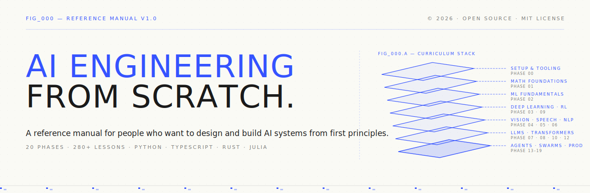
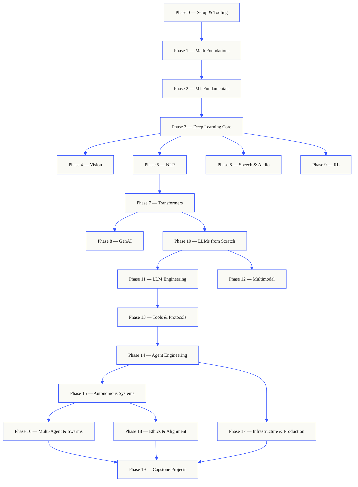
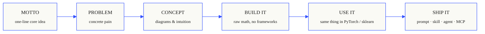
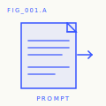
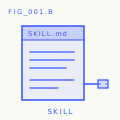
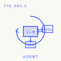
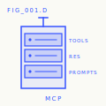

<p align="center">
  
</p>

<p align="center">
  <a href="LICENSE"></a>
  <a href="ROADMAP.md"></a>
  <a href="#contents"></a>
  <a href="https://github.com/rohitg00/ai-engineering-from-scratch/stargazers"></a>
  <a href="https://aieng.dev"></a>
</p>

```
░░░▒▒▒░░░▒▒▒░░░▒▒▒░░░▒▒▒░░░▒▒▒░░░▒▒▒░░░▒▒▒░░░▒▒▒░░░▒▒▒░░░▒▒▒░░░▒▒▒░░░▒▒▒░░░▒▒▒░░░▒▒▒░░░▒▒▒
```

> **84% of students already use AI tools, but only 18% feel confident using them in professional settings.**
> This curriculum bridges that gap.
>
> 435 lessons, 20 phases, ~320 hours. Python, TypeScript, Rust, Julia. Every lesson
> ships a reusable artifact: a prompt, a skill, an agent, an MCP server. Free, open-source, MIT.
>
> You don't just learn AI — you build it from scratch. End to end, by hand.

> **Credits:** Forked from [ai-engineering-from-scratch-zh](https://github.com/M4xwell-fish/ai-engineering-from-scratch-zh) (Simplified Chinese translation), itself based on [AI Engineering from Scratch](https://github.com/rohitg00/ai-engineering-from-scratch) by [Rohit Ghumare](https://github.com/rohitg00).

## How this works

Most AI curricula teach in fragments. A paper here, a fine-tuning walkthrough there, a flashy agent
demo somewhere else. These pieces rarely connect. You build a chatbot but can't explain its loss
curve; you wire a function into an agent but can't describe what attention is actually doing inside
the model that calls it.

This curriculum is the spine. 20 phases, 435 lessons, four languages: Python, TypeScript, Rust, Julia.
Linear algebra on one end, autonomous agent swarms on the other. Every algorithm is first written
from raw math. Backpropagation, tokenizers, attention, agent loops — by the time PyTorch appears,
you already know what it does under the hood.

Every lesson runs the same loop: understand the problem, derive the math, write code, run tests,
ship an artifact. No five-minute shortcut videos, no copy-paste deployments, no hand-holding.
Free, open-source, runs on your own laptop.

```
░░░▒▒▒░░░▒▒▒░░░▒▒▒░░░▒▒▒░░░▒▒▒░░░▒▒▒░░░▒▒▒░░░▒▒▒░░░▒▒▒░░░▒▒▒░░░▒▒▒░░░▒▒▒░░░▒▒▒░░░▒▒▒░░░▒▒▒
```

## The shape of the curriculum

Twenty phases stack on top of each other. Math is the foundation, agents and production deployment
are the roof. Skip ahead if you already know the lower layers — but don't be surprised when the
upper ones collapse if you did.



```
░░░▒▒▒░░░▒▒▒░░░▒▒▒░░░▒▒▒░░░▒▒▒░░░▒▒▒░░░▒▒▒░░░▒▒▒░░░▒▒▒░░░▒▒▒░░░▒▒▒░░░▒▒▒░░░▒▒▒░░░▒▒▒░░░▒▒▒
```

## The shape of a lesson

Every lesson lives in its own folder with a uniform structure:

```
phases/<NN>-<phase-name>/<NN>-<lesson-name>/
├── code/      runnable implementations (Python, TypeScript, Rust, Julia)
├── docs/
│   └── en.md  lesson content
└── outputs/   prompts, skills, agents, or MCP servers produced by the lesson
```

Every lesson follows six beats. The *Build It / Use It* split is the spine of each lesson —
you implement the algorithm from scratch first, then run the same thing with a production library.
You understand what the framework does because you wrote the smaller version yourself.



## Getting started

Three ways in. Pick one.

**Option A — Read.** Open any completed lesson on
[aieng.dev](https://aieng.dev),
or expand a phase in the [Contents](#contents) below. No setup, no clone needed.

**Option B — Clone and run.**

```bash
git clone https://github.com/rohitg00/ai-engineering-from-scratch.git
cd ai-engineering-from-scratch
python phases/01-math-foundations/01-linear-algebra-intuition/code/vectors.py
```

**Option C — Find your level *(recommended)*.** Skip smartly. In Claude, Cursor, Codex, OpenClaw, Hermes, or any agent with this curriculum's skills installed:

```bash
/find-your-level
```

Ten questions. Maps your knowledge to a starting phase and generates a personalized path with time estimates. After completing each phase:

```bash
/check-understanding 3        # quiz yourself on Phase 3
ls phases/03-deep-learning-core/05-loss-functions/outputs/
# ├── prompt-loss-function-selector.md
# └── prompt-loss-debugger.md
```

### Prerequisites

- You can write code (any language works, Python preferred).
- You want to understand how AI **actually works**, not just call APIs.

### Built-in agent skills (Claude, Cursor, Codex, OpenClaw, Hermes)

| Skill | Purpose |
|---|---|
| [`/find-your-level`](.claude/skills/find-your-level/SKILL.md) | Ten-question placement test. Maps your knowledge to a starting phase and generates a personalized path with time estimates. |
| [`/check-understanding <phase>`](.claude/skills/check-understanding/SKILL.md) | Per-phase quiz, eight questions, with feedback and specific lessons to review. |

```
░░░▒▒▒░░░▒▒▒░░░▒▒▒░░░▒▒▒░░░▒▒▒░░░▒▒▒░░░▒▒▒░░░▒▒▒░░░▒▒▒░░░▒▒▒░░░▒▒▒░░░▒▒▒░░░▒▒▒░░░▒▒▒░░░▒▒▒
```

## Every lesson ships something

Other courses end with *"Congratulations, you learned X."* Here, every lesson ends with a
**reusable tool** you can install or paste into your daily workflow.

<table>
<tr>
<th align="left" width="25%"><br/><sub>FIG_001 · A</sub><br/><b>PROMPTS</b></th>
<th align="left" width="25%"><br/><sub>FIG_001 · B</sub><br/><b>SKILLS</b></th>
<th align="left" width="25%"><br/><sub>FIG_001 · C</sub><br/><b>AGENTS</b></th>
<th align="left" width="25%"><br/><sub>FIG_001 · D</sub><br/><b>MCP SERVERS</b></th>
</tr>
<tr>
<td valign="top">Paste into any AI assistant for expert-level help on a specific task.</td>
<td valign="top">Drop into Claude, Cursor, Codex, OpenClaw, Hermes, or any agent that reads <code>SKILL.md</code>.</td>
<td valign="top">Deploy as an autonomous worker — you built that loop yourself in Phase 14.</td>
<td valign="top">Connect to any MCP-compatible client. Built end-to-end in Phase 13.</td>
</tr>
</table>

> Install all at once with `python3 scripts/install_skills.py`. Real tools, not homework.
> By the end of the curriculum you'll have 435 artifacts — and you truly understand them, because you built every one.

### FIG_002 · An example

Phase 14, Lesson 1: the agent loop. ~120 lines of pure Python, zero dependencies.

<table>
<tr>
<td valign="top" width="50%">

**`code/agent_loop.py`** &nbsp; <sub><i>Build It</i></sub>

```python
def run(query, tools):
    history = [user(query)]
    for step in range(MAX_STEPS):
        msg = llm(history)
        if msg.tool_calls:
            for call in msg.tool_calls:
                result = tools[call.name](**call.args)
                history.append(tool_result(call.id, result))
            continue
        return msg.content
    raise StepLimitExceeded
```

</td>
<td valign="top" width="50%">

**`outputs/skill-agent-loop.md`** &nbsp; <sub><i>Ship It</i></sub>

```markdown
---
name: agent-loop
description: ReAct-style loop for any tool list
phase: 14
lesson: 01
---

Implement a minimal agent loop that...
```

**`outputs/prompt-debug-agent.md`**

```markdown
You are an agent debugger. Given the trace
of an agent run, identify the step where
the agent went wrong and explain why...
```

</td>
</tr>
</table>

```
░░░▒▒▒░░░▒▒▒░░░▒▒▒░░░▒▒▒░░░▒▒▒░░░▒▒▒░░░▒▒▒░░░▒▒▒░░░▒▒▒░░░▒▒▒░░░▒▒▒░░░▒▒▒░░░▒▒▒░░░▒▒▒░░░▒▒▒
```

<a id="contents"></a>

## Contents

Twenty phases. Click any phase to expand its lesson list.

<a id="phase-0"></a>
### Phase 0: Setup & Tooling `12 lessons`
> Get your environment ready for everything that follows.

| # | Lesson | Type | Lang |
|:---:|--------|:----:|------|
| 01 | [Dev Environment](phases/00-setup-and-tooling/01-dev-environment/) | Build | Python |
| 02 | [Git & Collaboration](phases/00-setup-and-tooling/02-git-and-collaboration/) | Learn | — |
| 03 | [GPU Setup & Cloud](phases/00-setup-and-tooling/03-gpu-setup-and-cloud/) | Build | Python |
| 04 | [APIs & Keys](phases/00-setup-and-tooling/04-apis-and-keys/) | Build | Python |
| 05 | [Jupyter Notebooks](phases/00-setup-and-tooling/05-jupyter-notebooks/) | Build | Python |
| 06 | [Python Environments](phases/00-setup-and-tooling/06-python-environments/) | Build | Shell |
| 07 | [Docker for AI](phases/00-setup-and-tooling/07-docker-for-ai/) | Build | Docker |
| 08 | [Editor Setup](phases/00-setup-and-tooling/08-editor-setup/) | Build | — |
| 09 | [Data Management](phases/00-setup-and-tooling/09-data-management/) | Build | Python |
| 10 | [Terminal & Shell](phases/00-setup-and-tooling/10-terminal-and-shell/) | Learn | — |
| 11 | [Linux for AI](phases/00-setup-and-tooling/11-linux-for-ai/) | Learn | — |
| 12 | [Debugging & Profiling](phases/00-setup-and-tooling/12-debugging-and-profiling/) | Build | Python |

<details id="phase-1">
<summary><b>Phase 1 — Math Foundations</b> &nbsp;<code>22 lessons</code>&nbsp; <em>The intuition behind every AI algorithm, explained in code.</em></summary>
<br/>

| # | Lesson | Type | Lang |
|:---:|--------|:----:|------|
| 01 | [Linear Algebra Intuition](phases/01-math-foundations/01-linear-algebra-intuition/) | Learn | Python, Julia |
| 02 | [Vectors, Matrices & Operations](phases/01-math-foundations/02-vectors-matrices-operations/) | Build | Python, Julia |
| 03 | [Matrix Transformations & Eigenvalues](phases/01-math-foundations/03-matrix-transformations/) | Build | Python, Julia |
| 04 | [Calculus for ML: Derivatives & Gradients](phases/01-math-foundations/04-calculus-for-ml/) | Learn | Python |
| 05 | [Chain Rule & Automatic Differentiation](phases/01-math-foundations/05-chain-rule-and-autodiff/) | Build | Python |
| 06 | [Probability & Distributions](phases/01-math-foundations/06-probability-and-distributions/) | Learn | Python |
| 07 | [Bayes' Theorem & Statistical Thinking](phases/01-math-foundations/07-bayes-theorem/) | Build | Python |
| 08 | [Optimization: The Gradient Descent Family](phases/01-math-foundations/08-optimization/) | Build | Python |
| 09 | [Information Theory: Entropy & KL Divergence](phases/01-math-foundations/09-information-theory/) | Learn | Python |
| 10 | [Dimensionality Reduction: PCA, t-SNE, UMAP](phases/01-math-foundations/10-dimensionality-reduction/) | Build | Python |
| 11 | [Singular Value Decomposition](phases/01-math-foundations/11-singular-value-decomposition/) | Build | Python, Julia |
| 12 | [Tensor Operations](phases/01-math-foundations/12-tensor-operations/) | Build | Python |
| 13 | [Numerical Stability](phases/01-math-foundations/13-numerical-stability/) | Build | Python |
| 14 | [Norms & Distances](phases/01-math-foundations/14-norms-and-distances/) | Build | Python |
| 15 | [Statistics for ML](phases/01-math-foundations/15-statistics-for-ml/) | Build | Python |
| 16 | [Sampling Methods](phases/01-math-foundations/16-sampling-methods/) | Build | Python |
| 17 | [Linear Systems](phases/01-math-foundations/17-linear-systems/) | Build | Python |
| 18 | [Convex Optimization](phases/01-math-foundations/18-convex-optimization/) | Build | Python |
| 19 | [Complex Numbers for AI](phases/01-math-foundations/19-complex-numbers/) | Learn | Python |
| 20 | [Fourier Transform](phases/01-math-foundations/20-fourier-transform/) | Build | Python |
| 21 | [Graph Theory for ML](phases/01-math-foundations/21-graph-theory/) | Build | Python |
| 22 | [Stochastic Processes](phases/01-math-foundations/22-stochastic-processes/) | Learn | Python |

</details>

<details id="phase-2">
<summary><b>Phase 2 — ML Fundamentals</b> &nbsp;<code>18 lessons</code>&nbsp; <em>Classical machine learning — still the backbone of most production AI.</em></summary>
<br/>

| # | Lesson | Type | Lang |
|:---:|--------|:----:|------|
| 01 | [What Is Machine Learning](phases/02-ml-fundamentals/01-what-is-machine-learning/) | Learn | Python |
| 02 | [Linear Regression from Scratch](phases/02-ml-fundamentals/02-linear-regression/) | Build | Python |
| 03 | [Logistic Regression & Classification](phases/02-ml-fundamentals/03-logistic-regression/) | Build | Python |
| 04 | [Decision Trees & Random Forests](phases/02-ml-fundamentals/04-decision-trees/) | Build | Python |
| 05 | [Support Vector Machines](phases/02-ml-fundamentals/05-support-vector-machines/) | Build | Python |
| 06 | [KNN & Distance Metrics](phases/02-ml-fundamentals/06-knn-and-distances/) | Build | Python |
| 07 | [Unsupervised Learning: K-Means, DBSCAN](phases/02-ml-fundamentals/07-unsupervised-learning/) | Build | Python |
| 08 | [Feature Engineering & Selection](phases/02-ml-fundamentals/08-feature-engineering/) | Build | Python |
| 09 | [Model Evaluation: Metrics & Cross-Validation](phases/02-ml-fundamentals/09-model-evaluation/) | Build | Python |
| 10 | [Bias, Variance & Learning Curves](phases/02-ml-fundamentals/10-bias-variance/) | Learn | Python |
| 11 | [Ensemble Methods: Boosting, Bagging, Stacking](phases/02-ml-fundamentals/11-ensemble-methods/) | Build | Python |
| 12 | [Hyperparameter Tuning](phases/02-ml-fundamentals/12-hyperparameter-tuning/) | Build | Python |
| 13 | [ML Pipelines & Experiment Tracking](phases/02-ml-fundamentals/13-ml-pipelines/) | Build | Python |
| 14 | [Naive Bayes](phases/02-ml-fundamentals/14-naive-bayes/) | Build | Python |
| 15 | [Time Series Fundamentals](phases/02-ml-fundamentals/15-time-series/) | Build | Python |
| 16 | [Anomaly Detection](phases/02-ml-fundamentals/16-anomaly-detection/) | Build | Python |
| 17 | [Handling Imbalanced Data](phases/02-ml-fundamentals/17-imbalanced-data/) | Build | Python |
| 18 | [Feature Selection](phases/02-ml-fundamentals/18-feature-selection/) | Build | Python |

</details>

<details id="phase-3">
<summary><b>Phase 3 — Deep Learning Core</b> &nbsp;<code>13 lessons</code>&nbsp; <em>Neural networks from first principles. Build one before you touch a framework.</em></summary>
<br/>

| # | Lesson | Type | Lang |
|:---:|--------|:----:|------|
| 01 | [The Perceptron: Where It All Begins](phases/03-deep-learning-core/01-the-perceptron/) | Build | Python |
| 02 | [Multi-Layer Networks & Forward Propagation](phases/03-deep-learning-core/02-multi-layer-networks/) | Build | Python |
| 03 | [Backpropagation from Scratch](phases/03-deep-learning-core/03-backpropagation/) | Build | Python |
| 04 | [Activation Functions: ReLU, Sigmoid, GELU & Why](phases/03-deep-learning-core/04-activation-functions/) | Build | Python |
| 05 | [Loss Functions: MSE, Cross-Entropy, Contrastive Loss](phases/03-deep-learning-core/05-loss-functions/) | Build | Python |
| 06 | [Optimizers: SGD, Momentum, Adam, AdamW](phases/03-deep-learning-core/06-optimizers/) | Build | Python |
| 07 | [Regularization: Dropout, Weight Decay, BatchNorm](phases/03-deep-learning-core/07-regularization/) | Build | Python |
| 08 | [Weight Initialization & Training Stability](phases/03-deep-learning-core/08-weight-initialization/) | Build | Python |
| 09 | [Learning Rate Schedules & Warmup](phases/03-deep-learning-core/09-learning-rate-schedules/) | Build | Python |
| 10 | [Build Your Own Mini Framework](phases/03-deep-learning-core/10-mini-framework/) | Build | Python |
| 11 | [Intro to PyTorch](phases/03-deep-learning-core/11-intro-to-pytorch/) | Build | Python |
| 12 | [Intro to JAX](phases/03-deep-learning-core/12-intro-to-jax/) | Build | Python |
| 13 | [Debugging Neural Networks](phases/03-deep-learning-core/13-debugging-neural-networks/) | Build | Python |

</details>

<details id="phase-4">
<summary><b>Phase 4 — Computer Vision</b> &nbsp;<code>28 lessons</code>&nbsp; <em>From pixels to understanding — images, video, 3D, VLMs, and world models.</em></summary>
<br/>

| # | Lesson | Type | Lang |
|:---:|--------|:----:|------|
| 01 | [Image Fundamentals: Pixels, Channels, Color Spaces](phases/04-computer-vision/01-image-fundamentals/) | Learn | Python |
| 02 | [Convolutions from Scratch](phases/04-computer-vision/02-convolutions-from-scratch/) | Build | Python |
| 03 | [CNNs: From LeNet to ResNet](phases/04-computer-vision/03-cnns-lenet-to-resnet/) | Build | Python |
| 04 | [Image Classification](phases/04-computer-vision/04-image-classification/) | Build | Python |
| 05 | [Transfer Learning & Fine-Tuning](phases/04-computer-vision/05-transfer-learning/) | Build | Python |
| 06 | [Object Detection — YOLO from Scratch](phases/04-computer-vision/06-object-detection-yolo/) | Build | Python |
| 07 | [Semantic Segmentation — U-Net](phases/04-computer-vision/07-semantic-segmentation-unet/) | Build | Python |
| 08 | [Instance Segmentation — Mask R-CNN](phases/04-computer-vision/08-instance-segmentation-mask-rcnn/) | Build | Python |
| 09 | [Image Generation — GANs](phases/04-computer-vision/09-image-generation-gans/) | Build | Python |
| 10 | [Image Generation — Diffusion Models](phases/04-computer-vision/10-image-generation-diffusion/) | Build | Python |
| 11 | [Stable Diffusion — Architecture & Fine-Tuning](phases/04-computer-vision/11-stable-diffusion/) | Build | Python |
| 12 | [Video Understanding — Temporal Modeling](phases/04-computer-vision/12-video-understanding/) | Build | Python |
| 13 | [3D Vision: Point Clouds, NeRF](phases/04-computer-vision/13-3d-vision-nerf/) | Build | Python |
| 14 | [Vision Transformer (ViT)](phases/04-computer-vision/14-vision-transformers/) | Build | Python |
| 15 | [Real-Time Vision: Edge Deployment](phases/04-computer-vision/15-real-time-edge/) | Build | Python |
| 16 | [Building a Complete Vision Pipeline](phases/04-computer-vision/16-vision-pipeline-capstone/) | Build | Python |
| 17 | [Self-Supervised Vision — SimCLR, DINO, MAE](phases/04-computer-vision/17-self-supervised-vision/) | Build | Python |
| 18 | [Open-Vocabulary Vision — CLIP](phases/04-computer-vision/18-open-vocab-clip/) | Build | Python |
| 19 | [OCR & Document Understanding](phases/04-computer-vision/19-ocr-document-understanding/) | Build | Python |
| 20 | [Image Retrieval & Metric Learning](phases/04-computer-vision/20-image-retrieval-metric/) | Build | Python |
| 21 | [Keypoint Detection & Pose Estimation](phases/04-computer-vision/21-keypoint-pose/) | Build | Python |
| 22 | [3D Gaussian Splatting from Scratch](phases/04-computer-vision/22-3d-gaussian-splatting/) | Build | Python |
| 23 | [Diffusion Transformers & Rectified Flow](phases/04-computer-vision/23-diffusion-transformers-rectified-flow/) | Build | Python |
| 24 | [SAM 3 & Open-Vocabulary Segmentation](phases/04-computer-vision/24-sam3-open-vocab-segmentation/) | Build | Python |
| 25 | [Vision-Language Models (ViT-MLP-LLM)](phases/04-computer-vision/25-vision-language-models/) | Build | Python |
| 26 | [Monocular Depth & Geometry Estimation](phases/04-computer-vision/26-monocular-depth/) | Build | Python |
| 27 | [Multi-Object Tracking & Video Memory](phases/04-computer-vision/27-multi-object-tracking/) | Build | Python |
| 28 | [World Models & Video Diffusion](phases/04-computer-vision/28-world-models-video-diffusion/) | Build | Python |

</details>

<details id="phase-5">
<summary><b>Phase 5 — NLP: Foundations to Advanced</b> &nbsp;<code>29 lessons</code>&nbsp; <em>Language is the interface to intelligence.</em></summary>
<br/>

| # | Lesson | Type | Lang |
|:---:|--------|:----:|------|
| 01 | [Text Processing: Tokenization, Stemming, Lemmatization](phases/05-nlp-foundations-to-advanced/01-text-processing/) | Build | Python |
| 02 | [Bag of Words, TF-IDF & Text Representation](phases/05-nlp-foundations-to-advanced/02-bag-of-words-tfidf/) | Build | Python |
| 03 | [Word Embeddings: Word2Vec from Scratch](phases/05-nlp-foundations-to-advanced/03-word-embeddings-word2vec/) | Build | Python |
| 04 | [GloVe, FastText & Subword Embeddings](phases/05-nlp-foundations-to-advanced/04-glove-fasttext-subword/) | Build | Python |
| 05 | [Sentiment Analysis](phases/05-nlp-foundations-to-advanced/05-sentiment-analysis/) | Build | Python |
| 06 | [Named Entity Recognition (NER)](phases/05-nlp-foundations-to-advanced/06-named-entity-recognition/) | Build | Python |
| 07 | [POS Tagging & Parsing](phases/05-nlp-foundations-to-advanced/07-pos-tagging-parsing/) | Build | Python |
| 08 | [Text Classification — CNNs & RNNs for Text](phases/05-nlp-foundations-to-advanced/08-cnns-rnns-for-text/) | Build | Python |
| 09 | [Sequence-to-Sequence Models](phases/05-nlp-foundations-to-advanced/09-sequence-to-sequence/) | Build | Python |
| 10 | [The Attention Mechanism — The Breakthrough](phases/05-nlp-foundations-to-advanced/10-attention-mechanism/) | Build | Python |
| 11 | [Machine Translation](phases/05-nlp-foundations-to-advanced/11-machine-translation/) | Build | Python |
| 12 | [Text Summarization](phases/05-nlp-foundations-to-advanced/12-text-summarization/) | Build | Python |
| 13 | [Question Answering](phases/05-nlp-foundations-to-advanced/13-question-answering/) | Build | Python |
| 14 | [Information Retrieval & Search](phases/05-nlp-foundations-to-advanced/14-information-retrieval-search/) | Build | Python |
| 15 | [Topic Modeling: LDA, BERTopic](phases/05-nlp-foundations-to-advanced/15-topic-modeling/) | Build | Python |
| 16 | [Text Generation](phases/05-nlp-foundations-to-advanced/16-text-generation-pre-transformer/) | Build | Python |
| 17 | [Chatbots: From Rules to Neural](phases/05-nlp-foundations-to-advanced/17-chatbots-rule-to-neural/) | Build | Python |
| 18 | [Multilingual NLP](phases/05-nlp-foundations-to-advanced/18-multilingual-nlp/) | Build | Python |
| 19 | [Subword Tokenization: BPE, WordPiece, Unigram, SentencePiece](phases/05-nlp-foundations-to-advanced/19-subword-tokenization/) | Learn | Python |
| 20 | [Structured Outputs & Constrained Decoding](phases/05-nlp-foundations-to-advanced/20-structured-outputs-constrained-decoding/) | Build | Python |
| 21 | [Natural Language Inference & Textual Entailment](phases/05-nlp-foundations-to-advanced/21-nli-textual-entailment/) | Learn | Python |
| 22 | [Embedding Models Deep Dive](phases/05-nlp-foundations-to-advanced/22-embedding-models-deep-dive/) | Learn | Python |
| 23 | [Chunking Strategies for RAG](phases/05-nlp-foundations-to-advanced/23-chunking-strategies-rag/) | Build | Python |
| 24 | [Coreference Resolution](phases/05-nlp-foundations-to-advanced/24-coreference-resolution/) | Learn | Python |
| 25 | [Entity Linking & Disambiguation](phases/05-nlp-foundations-to-advanced/25-entity-linking/) | Build | Python |
| 26 | [Relation Extraction & Knowledge Graph Construction](phases/05-nlp-foundations-to-advanced/26-relation-extraction-kg/) | Build | Python |
| 27 | [LLM Evaluation: RAGAS, DeepEval, G-Eval](phases/05-nlp-foundations-to-advanced/27-llm-evaluation-frameworks/) | Build | Python |
| 28 | [Long-Context Evaluation: NIAH, RULER, LongBench, MRCR](phases/05-nlp-foundations-to-advanced/28-long-context-evaluation/) | Learn | Python |
| 29 | [Dialogue State Tracking](phases/05-nlp-foundations-to-advanced/29-dialogue-state-tracking/) | Build | Python |

</details>

<details id="phase-6">
<summary><b>Phase 6 — Speech & Audio</b> &nbsp;<code>17 lessons</code>&nbsp; <em>Hear, understand, speak.</em></summary>
<br/>

| # | Lesson | Type | Lang |
|:---:|--------|:----:|------|
| 01 | [Audio Fundamentals: Waveforms, Sampling, FFT](phases/06-speech-and-audio/01-audio-fundamentals) | Learn | Python |
| 02 | [Spectrograms, Mel Scale & Audio Features](phases/06-speech-and-audio/02-spectrograms-mel-features) | Build | Python |
| 03 | [Audio Classification](phases/06-speech-and-audio/03-audio-classification) | Build | Python |
| 04 | [Speech Recognition (ASR)](phases/06-speech-and-audio/04-speech-recognition-asr) | Build | Python |
| 05 | [Whisper: Architecture & Fine-Tuning](phases/06-speech-and-audio/05-whisper-architecture-finetuning) | Build | Python |
| 06 | [Speaker Recognition & Verification](phases/06-speech-and-audio/06-speaker-recognition-verification) | Build | Python |
| 07 | [Text-to-Speech (TTS)](phases/06-speech-and-audio/07-text-to-speech) | Build | Python |
| 08 | [Voice Cloning & Conversion](phases/06-speech-and-audio/08-voice-cloning-conversion) | Build | Python |
| 09 | [Music Generation](phases/06-speech-and-audio/09-music-generation) | Build | Python |
| 10 | [Audio Language Models](phases/06-speech-and-audio/10-audio-language-models) | Build | Python |
| 11 | [Real-Time Audio Processing](phases/06-speech-and-audio/11-real-time-audio-processing) | Build | Python |
| 12 | [Building a Voice Assistant Pipeline](phases/06-speech-and-audio/12-voice-assistant-pipeline) | Build | Python |
| 13 | [Neural Audio Codecs — EnCodec, SNAC, Mimi, DAC](phases/06-speech-and-audio/13-neural-audio-codecs) | Learn | Python |
| 14 | [Voice Activity Detection & Turn-Taking](phases/06-speech-and-audio/14-voice-activity-detection-turn-taking) | Build | Python |
| 15 | [Streaming Speech-to-Speech — Moshi, Hibiki](phases/06-speech-and-audio/15-streaming-speech-to-speech-moshi-hibiki) | Learn | Python |
| 16 | [Anti-Spoofing & Audio Watermarking](phases/06-speech-and-audio/16-anti-spoofing-audio-watermarking) | Build | Python |
| 17 | [Audio Evaluation — WER, MOS, MMAU, Leaderboards](phases/06-speech-and-audio/17-audio-evaluation-metrics) | Learn | Python |

</details>

<details id="phase-7">
<summary><b>Phase 7 — Transformers Deep Dive</b> &nbsp;<code>14 lessons</code>&nbsp; <em>The architecture that changed everything.</em></summary>
<br/>

| # | Lesson | Type | Lang |
|:---:|--------|:----:|------|
| 01 | [Why Transformers: The RNN Problem](phases/07-transformers-deep-dive/01-why-transformers/) | Learn | Python |
| 02 | [Self-Attention from Scratch](phases/07-transformers-deep-dive/02-self-attention-from-scratch/) | Build | Python |
| 03 | [Multi-Head Attention](phases/07-transformers-deep-dive/03-multi-head-attention/) | Build | Python |
| 04 | [Positional Encoding: Sinusoidal, RoPE, ALiBi](phases/07-transformers-deep-dive/04-positional-encoding/) | Build | Python |
| 05 | [The Full Transformer: Encoder + Decoder](phases/07-transformers-deep-dive/05-full-transformer/) | Build | Python |
| 06 | [BERT — Masked Language Modeling](phases/07-transformers-deep-dive/06-bert-masked-language-modeling/) | Build | Python |
| 07 | [GPT — Causal Language Modeling](phases/07-transformers-deep-dive/07-gpt-causal-language-modeling/) | Build | Python |
| 08 | [T5, BART — Encoder-Decoder Models](phases/07-transformers-deep-dive/08-t5-bart-encoder-decoder/) | Learn | Python |
| 09 | [Vision Transformer (ViT)](phases/07-transformers-deep-dive/09-vision-transformers/) | Build | Python |
| 10 | [Audio Transformers — Whisper Architecture](phases/07-transformers-deep-dive/10-audio-transformers-whisper/) | Learn | Python |
| 11 | [Mixture of Experts (MoE)](phases/07-transformers-deep-dive/11-mixture-of-experts/) | Build | Python |
| 12 | [KV Cache, Flash Attention & Inference Optimization](phases/07-transformers-deep-dive/12-kv-cache-flash-attention/) | Build | Python |
| 13 | [Scaling Laws](phases/07-transformers-deep-dive/13-scaling-laws/) | Learn | Python |
| 14 | [Build a Transformer from Scratch](phases/07-transformers-deep-dive/14-build-a-transformer-capstone/) | Build | Python |
| 15 | [Attention Variants — Sliding Window, Sparse, Differential](phases/07-transformers-deep-dive/15-attention-variants/) | Build | Python |
| 16 | [Speculative Decoding — Draft, Verify, Repeat](phases/07-transformers-deep-dive/16-speculative-decoding/) | Build | Python |

</details>

<details id="phase-8">
<summary><b>Phase 8 — Generative AI</b> &nbsp;<code>14 lessons</code>&nbsp; <em>Generate images, video, audio, 3D, and more.</em></summary>
<br/>

| # | Lesson | Type | Lang |
|:---:|--------|:----:|------|
| 01 | [Generative Models: Taxonomy & History](phases/08-generative-ai/01-generative-models-taxonomy-history/) | Learn | Python |
| 02 | [Autoencoders & VAE](phases/08-generative-ai/02-autoencoders-vae/) | Build | Python |
| 03 | [GANs: Generator vs Discriminator](phases/08-generative-ai/03-gans-generator-discriminator/) | Build | Python |
| 04 | [Conditional GANs & Pix2Pix](phases/08-generative-ai/04-conditional-gans-pix2pix/) | Build | Python |
| 05 | [StyleGAN](phases/08-generative-ai/05-stylegan/) | Build | Python |
| 06 | [Diffusion Models — DDPM from Scratch](phases/08-generative-ai/06-diffusion-ddpm-from-scratch/) | Build | Python |
| 07 | [Latent Diffusion & Stable Diffusion](phases/08-generative-ai/07-latent-diffusion-stable-diffusion/) | Build | Python |
| 08 | [ControlNet, LoRA & Conditioning](phases/08-generative-ai/08-controlnet-lora-conditioning/) | Build | Python |
| 09 | [Inpainting, Outpainting & Editing](phases/08-generative-ai/09-inpainting-outpainting-editing/) | Build | Python |
| 10 | [Video Generation](phases/08-generative-ai/10-video-generation/) | Build | Python |
| 11 | [Audio Generation](phases/08-generative-ai/11-audio-generation/) | Build | Python |
| 12 | [3D Generation](phases/08-generative-ai/12-3d-generation/) | Build | Python |
| 13 | [Flow Matching & Rectified Flows](phases/08-generative-ai/13-flow-matching-rectified-flows/) | Build | Python |
| 14 | [Evaluation: FID, CLIP Score](phases/08-generative-ai/14-evaluation-fid-clip-score/) | Build | Python |
| 19 | [Visual Autoregressive Modeling (VAR): Next-Scale Prediction](phases/08-generative-ai/19-visual-autoregressive-var/) | Build | Python |

</details>

<details id="phase-9">
<summary><b>Phase 9 — Reinforcement Learning</b> &nbsp;<code>12 lessons</code>&nbsp; <em>The foundation of RLHF and game-playing AI.</em></summary>
<br/>

| # | Lesson | Type | Lang |
|:---:|--------|:----:|------|
| 01 | [MDPs, States, Actions & Rewards](phases/09-reinforcement-learning/01-mdps-states-actions-rewards/) | Learn | Python |
| 02 | [Dynamic Programming](phases/09-reinforcement-learning/02-dynamic-programming/) | Build | Python |
| 03 | [Monte Carlo Methods](phases/09-reinforcement-learning/03-monte-carlo-methods/) | Build | Python |
| 04 | [Q-Learning, SARSA](phases/09-reinforcement-learning/04-q-learning-sarsa/) | Build | Python |
| 05 | [Deep Q-Networks (DQN)](phases/09-reinforcement-learning/05-dqn/) | Build | Python |
| 06 | [Policy Gradients — REINFORCE](phases/09-reinforcement-learning/06-policy-gradients-reinforce/) | Build | Python |
| 07 | [Actor-Critic — A2C, A3C](phases/09-reinforcement-learning/07-actor-critic-a2c-a3c/) | Build | Python |
| 08 | [PPO](phases/09-reinforcement-learning/08-ppo/) | Build | Python |
| 09 | [Reward Modeling & RLHF](phases/09-reinforcement-learning/09-reward-modeling-rlhf/) | Build | Python |
| 10 | [Multi-Agent Reinforcement Learning](phases/09-reinforcement-learning/10-multi-agent-rl/) | Build | Python |
| 11 | [Sim-to-Real Transfer](phases/09-reinforcement-learning/11-sim-to-real-transfer/) | Build | Python |
| 12 | [RL for Games](phases/09-reinforcement-learning/12-rl-for-games/) | Build | Python |

</details>

<details id="phase-10">
<summary><b>Phase 10 — LLMs from Scratch</b> &nbsp;<code>24 lessons</code>&nbsp; <em>Build a language model end to end — tokenizer, data pipeline, training loop, scaling.</em></summary>
<br/>

| # | Lesson | Type | Lang |
|:---:|--------|:----:|------|
| 01 | [Tokenizers: BPE, WordPiece, SentencePiece](phases/10-llms-from-scratch/01-tokenizers/) | Build | Python |
| 02 | [Building a Tokenizer from Scratch](phases/10-llms-from-scratch/02-building-a-tokenizer/) | Build | Python |
| 03 | [Data Pipelines for Pre-training](phases/10-llms-from-scratch/03-data-pipelines/) | Build | Python |
| 04 | [Pre-training a Mini GPT (124M Parameters)](phases/10-llms-from-scratch/04-pre-training-mini-gpt/) | Build | Python (with numpy) |
| 05 | [Scaling: Distributed Training, FSDP, DeepSpeed](phases/10-llms-from-scratch/05-scaling-distributed/) | Build | Python |
| 06 | [Instruction Tuning (SFT)](phases/10-llms-from-scratch/06-instruction-tuning-sft/) | Build | Python (with numpy) |
| 07 | [RLHF: Reward Model + PPO](phases/10-llms-from-scratch/07-rlhf/) | Build | Python (with numpy) |
| 08 | [DPO: Direct Preference Optimization](phases/10-llms-from-scratch/08-dpo/) | Build | Python (with numpy) |
| 09 | [Constitutional AI and Self-Improvement](phases/10-llms-from-scratch/09-constitutional-ai-self-improvement/) | Build | Python (stdlib + numpy) |
| 10 | [Evaluation: Benchmarks, Evals, LM Harness](phases/10-llms-from-scratch/10-evaluation/) | Build | Python |
| 11 | [Quantization: Making Models Fit](phases/10-llms-from-scratch/11-quantization/) | Build | Python (with numpy) |
| 12 | [Inference Optimization](phases/10-llms-from-scratch/12-inference-optimization/) | Build | Python |
| 13 | [Building a Complete LLM Pipeline](phases/10-llms-from-scratch/13-building-complete-llm-pipeline/) | Build | Python (stdlib) |
| 14 | [Open Models: Architecture Walkthroughs](phases/10-llms-from-scratch/14-open-models-architecture-walkthroughs/) | Learn | Python (stdlib) |
| 15 | [Speculative Decoding and EAGLE-3](phases/10-llms-from-scratch/15-speculative-decoding-eagle3/) | Build | Python (stdlib) |
| 16 | [Differential Attention (V2)](phases/10-llms-from-scratch/16-differential-attention-v2/) | Build | Python (stdlib) |
| 17 | [Native Sparse Attention (DeepSeek NSA)](phases/10-llms-from-scratch/17-native-sparse-attention/) | Build | Python (stdlib) |
| 18 | [Multi-Token Prediction (MTP)](phases/10-llms-from-scratch/18-multi-token-prediction/) | Build | Python (stdlib) |
| 19 | [DualPipe Parallelism](phases/10-llms-from-scratch/19-dualpipe-parallelism/) | Learn | Python (stdlib, schedule simulator) |
| 20 | [DeepSeek-V3 Architecture Walkthrough](phases/10-llms-from-scratch/20-deepseek-v3-walkthrough/) | Learn | Python (stdlib, parameter calculator) |
| 21 | [Jamba — Hybrid SSM-Transformer](phases/10-llms-from-scratch/21-jamba-hybrid-ssm-transformer/) | Learn | Python (stdlib, layer-mix calculator) |
| 22 | [Asynchronous & Hogwild! Inference](phases/10-llms-from-scratch/22-async-hogwild-inference/) | Build | Python (stdlib) |
| 25 | [Speculative Decoding and EAGLE](phases/10-llms-from-scratch/25-speculative-decoding/) | Build | Python (with numpy) |
| 34 | [Gradient Checkpointing and Activation Recomputation](phases/10-llms-from-scratch/34-gradient-checkpointing/) | Build | Python (with numpy, optional torch) |

</details>

<details id="phase-11">
<summary><b>Phase 11 — LLM Engineering</b> &nbsp;<code>17 lessons</code>&nbsp; <em>Prompt engineering, RAG, fine-tuning, evaluation — the daily tools of LLM work.</em></summary>
<br/>

| # | Lesson | Type | Lang |
|:---:|--------|:----:|------|
| 01 | [Prompt Engineering: Techniques and Patterns](phases/11-llm-engineering/01-prompt-engineering/) | Build | Python |
| 02 | [Few-Shot, Chain-of-Thought, Tree-of-Thought](phases/11-llm-engineering/02-few-shot-cot/) | Build | Python |
| 03 | [Structured Outputs: JSON, Schema Validation, Constrained Decoding](phases/11-llm-engineering/03-structured-outputs/) | Build | Python |
| 04 | [Embeddings and Vector Representations](phases/11-llm-engineering/04-embeddings/) | Build | Python |
| 05 | [Context Engineering: Windows, Budgets, Memory, and Retrieval](phases/11-llm-engineering/05-context-engineering/) | Build | Python |
| 06 | [RAG (Retrieval-Augmented Generation)](phases/11-llm-engineering/06-rag/) | Build | Python |
| 07 | [Advanced RAG (Chunking, Reranking, Hybrid Search)](phases/11-llm-engineering/07-advanced-rag/) | Build | Python |
| 08 | [Fine-Tuning with LoRA and QLoRA](phases/11-llm-engineering/08-fine-tuning-lora/) | Build | Python |
| 09 | [Function Calling & Tool Use](phases/11-llm-engineering/09-function-calling/) | Build | Python |
| 10 | [Evaluation & Testing LLM Applications](phases/11-llm-engineering/10-evaluation/) | Build | Python |
| 11 | [Caching, Rate Limiting & Cost Optimization](phases/11-llm-engineering/11-caching-cost/) | Build | Python |
| 12 | [Guardrails, Safety & Content Filtering](phases/11-llm-engineering/12-guardrails/) | Build | Python |
| 13 | [Building a Production-Grade LLM Application](phases/11-llm-engineering/13-production-app/) | Build (Capstone) | Python |
| 14 | [Model Context Protocol (MCP)](phases/11-llm-engineering/14-model-context-protocol/) | Build | Python |
| 15 | [Prompt Caching and Context Caching](phases/11-llm-engineering/15-prompt-caching/) | Build | Python |
| 16 | [LangGraph — State Machines for Agents](phases/11-llm-engineering/16-langgraph-state-machines/) | Build | Python |
| 17 | [Agent Framework Tradeoffs — LangGraph vs CrewAI vs AutoGen vs Agno](phases/11-llm-engineering/17-agent-framework-tradeoffs/) | Learn | Python |

</details>

<details id="phase-12">
<summary><b>Phase 12 — Multimodal AI</b> &nbsp;<code>25 lessons</code>&nbsp; <em>Vision-language models, audio-language models, and unified architectures.</em></summary>
<br/>

| # | Lesson | Type | Lang |
|:---:|--------|:----:|------|
| 01 | [Vision Transformer and the Patch-Token Primitive](phases/12-multimodal-ai/01-vision-transformer-patch-tokens/) | Learn | Python (standard library, patch tokenizer + geometry calculator) |
| 02 | [CLIP and Contrastive Vision-Language Pretraining](phases/12-multimodal-ai/02-clip-contrastive-pretraining/) | Build | Python (standard library, InfoNCE + sigmoid loss implementation) |
| 03 | [From CLIP to BLIP-2 — Q-Former as a Modality Bridge](phases/12-multimodal-ai/03-blip2-qformer-bridge/) | Build | Python (stdlib, cross-attention + learnable query demo) |
| 04 | [Flamingo and Gated Cross-Attention for Few-Shot VLMs](phases/12-multimodal-ai/04-flamingo-gated-cross-attention/) | Learn | Python (stdlib, gated cross-attention + Perceiver resampler demo) |
| 05 | [LLaVA and Visual Instruction Tuning](phases/12-multimodal-ai/05-llava-visual-instruction-tuning/) | Build | Python (stdlib, projector + instruction template builder) |
| 06 | [Any-Resolution Vision: Patch-n'-Pack and NaFlex](phases/12-multimodal-ai/06-any-resolution-patch-n-pack/) | Build | Python (stdlib, patch packer + block-diagonal mask) |
| 07 | [Open-Weight VLM Recipes: What Actually Matters](phases/12-multimodal-ai/07-open-weight-vlm-recipes/) | Learn + lab | Python (stdlib, ablation table parser + recipe picker) |
| 08 | [LLaVA-OneVision: Single-Image, Multi-Image, and Video in One Model](phases/12-multimodal-ai/08-llava-onevision-single-multi-video/) | Build | Python (standard library, token budget solver + curriculum planner) |
| 09 | [The Qwen-VL Family and Dynamic FPS Video](phases/12-multimodal-ai/09-qwen-vl-family-dynamic-fps/) | Learn | Python (standard library, M-RoPE encoder + dynamic FPS sampler) |
| 10 | [InternVL3: Native Multimodal Pretraining](phases/12-multimodal-ai/10-internvl3-native-multimodal/) | Learn | Python (standard library, training corpus mixer) |
| 11 | [Chameleon and Early-Fusion Token-Only Multimodal Models](phases/12-multimodal-ai/11-chameleon-early-fusion-tokens/) | Build | Python (standard library, VQ-VAE tokenizer + interleaved decoder) |
| 12 | [Emu3: Next-Token Prediction for Image and Video Generation](phases/12-multimodal-ai/12-emu3-next-token-for-generation/) | Learn | Python (standard library, 3D video tokenizer math + autoregressive sampler skeleton) |
| 13 | [Transfusion: Autoregressive Text + Diffusion Images in One Transformer](phases/12-multimodal-ai/13-transfusion-autoregressive-diffusion/) | Build | Python (standard library, dual-loss trainer on MNIST-scale toy) |
| 14 | [Show-o and Discrete Diffusion Unified Models](phases/12-multimodal-ai/14-show-o-discrete-diffusion-unified/) | Learn | Python (standard library, masked discrete diffusion sampler) |
| 15 | [Janus-Pro: Decoupled Encoders for Unified Multimodal Models](phases/12-multimodal-ai/15-janus-pro-decoupled-encoders/) | Build | Python (standard library, dual-encoder routing + shared-body signals) |
| 16 | [MIO and Any-to-Any Streaming Multimodal Models](phases/12-multimodal-ai/16-mio-any-to-any-streaming/) | Learn | Python (standard library, four-modality token allocator + streaming decode loop) |
| 17 | [Video-Language Models: Temporal Tokens and Grounding](phases/12-multimodal-ai/17-video-language-temporal-grounding/) | Build | Python (standard library, frame sampler + temporal grounding evaluator) |
| 18 | [Long Video Understanding at Million-Token Context](phases/12-multimodal-ai/18-long-video-million-token/) | Build | Python (stdlib, needle-in-a-haystack simulator + agentic retrieval router) |
| 19 | [Audio-Language Models: The Arc from Whisper to Audio Flamingo 3](phases/12-multimodal-ai/19-audio-language-whisper-to-af3/) | Build | Python (stdlib, log-Mel spectrogram + audio Q-former skeleton) |
| 20 | [Omni Models: Qwen2.5-Omni and the Thinker-Talker Split](phases/12-multimodal-ai/20-omni-models-thinker-talker/) | Build | Python (stdlib, streaming pipeline latency simulator + VAD loop) |
| 21 | [Embodied VLAs: RT-2, OpenVLA, π0, GR00T](phases/12-multimodal-ai/21-embodied-vlas-openvla-pi0-groot/) | Learn | Python (stdlib, action tokenizer + VLA inference skeleton) |
| 22 | [Document and Diagram Understanding](phases/12-multimodal-ai/22-document-diagram-understanding/) | Build | Python (stdlib, layout-aware document parser skeleton) |
| 23 | [ColPali & Vision-Native Document RAG](phases/12-multimodal-ai/23-colpali-vision-native-rag/) | Build | Python (stdlib, multi-vector indexer + MaxSim scorer) |
| 24 | [Multimodal RAG & Cross-Modal Retrieval](phases/12-multimodal-ai/24-multimodal-rag-cross-modal/) | Build | Python (stdlib, cross-modal retriever with fusion + grounded generator) |
| 25 | [Multimodal Agents & Computer Use (Capstone)](phases/12-multimodal-ai/25-multimodal-agents-computer-use/) | Capstone | Python (stdlib, action schema + agent loop skeleton) |

</details>

<details id="phase-13">
<summary><b>Phase 13 — Tools & Protocols</b> &nbsp;<code>23 lessons</code>&nbsp; <em>Function calling, MCP servers, and the protocol layer that connects agents to the world.</em></summary>
<br/>

| # | Lesson | Type | Lang |
|:---:|--------|:----:|------|
| 01 | [The Tool Interface — Why Agents Need Structured I/O](phases/13-tools-and-protocols/01-the-tool-interface/) | Learn | Python (standard library, no LLM calls) |
| 02 | [Function Calling Deep Dive — OpenAI, Anthropic, Gemini](phases/13-tools-and-protocols/02-function-calling-deep-dive/) | Build | Python (standard library, schema translator) |
| 03 | [Parallel Tool Calls & Streaming with Tools](phases/13-tools-and-protocols/03-parallel-and-streaming-tool-calls/) | Build | Python (standard library, thread pool + streaming scaffolding) |
| 04 | [Structured Output — JSON Schema, Pydantic, Zod, Constrained Decoding](phases/13-tools-and-protocols/04-structured-output/) | Build | Python (standard library, JSON Schema 2020-12 subset) |
| 05 | [Tool Schema Design — Naming, Descriptions, Parameter Constraints](phases/13-tools-and-protocols/05-tool-schema-design/) | Learn | Python (standard library, tool schema linter) |
| 06 | [MCP Fundamentals — Primitives, Lifecycle, JSON-RPC Foundation](phases/13-tools-and-protocols/06-mcp-fundamentals/) | Learn | Python (standard library, JSON-RPC parser) |
| 07 | [Building an MCP Server — Python + TypeScript SDK](phases/13-tools-and-protocols/07-building-an-mcp-server/) | Build | Python (standard library, stdio MCP server) |
| 08 | [Building an MCP Client — Discovery, Invocation, Session Management](phases/13-tools-and-protocols/08-building-an-mcp-client/) | Build | Python (standard library, multi-server MCP client) |
| 09 | [MCP Transports — stdio vs Streamable HTTP vs SSE Migration](phases/13-tools-and-protocols/09-mcp-transports/) | Learn | Python (standard library, Streamable HTTP endpoint skeleton) |
| 10 | [MCP Resources and Prompts — Context Exposure Beyond Tools](phases/13-tools-and-protocols/10-mcp-resources-and-prompts/) | Build | Python (stdlib, resource + prompt handlers) |
| 11 | [MCP Sampling — Server-Requested LLM Completions and Agent Loops](phases/13-tools-and-protocols/11-mcp-sampling/) | Build | Python (stdlib, sampling scaffolding) |
| 12 | [Roots and Elicitation — Scope Limiting and Mid-Call User Input](phases/13-tools-and-protocols/12-mcp-roots-and-elicitation/) | Build | Python (stdlib, roots + elicitation demo) |
| 13 | [Async Tasks (SEP-1686) — Call Now, Get Results Later for Long-Running Work](phases/13-tools-and-protocols/13-mcp-async-tasks/) | Build | Python (stdlib, async task state machine) |
| 14 | [MCP Apps — Interactive UI Resources via `ui://`](phases/13-tools-and-protocols/14-mcp-apps/) | Build | Python (stdlib, UI resource emitter), HTML (example app) |
| 15 | [MCP Security I — Tool Poisoning, Rug Pulls, Cross-Server Shadowing](phases/13-tools-and-protocols/15-mcp-security-tool-poisoning/) | Learn | Python (stdlib, hash-pin + poisoning detector) |
| 16 | [MCP Security II — OAuth 2.1, Resource Indicators, Incremental Scopes](phases/13-tools-and-protocols/16-mcp-security-oauth-2-1/) | Build | Python (stdlib, OAuth state-machine simulator) |
| 17 | [MCP Gateways and Registries — The Enterprise Control Plane](phases/13-tools-and-protocols/17-mcp-gateways-and-registries/) | Learn | Python (standard library, minimal gateway) |
| 18 | [Production MCP Auth — Registration, JWKS Refresh, Audience-Pinned Tokens](phases/13-tools-and-protocols/18-mcp-auth-production/) | Build | Python (standard library) |
| 19 | [A2A — Agent-to-Agent Protocol](phases/13-tools-and-protocols/19-a2a-protocol/) | Build | Python (standard library, Agent Card + Task scaffolding) |
| 20 | [OpenTelemetry GenAI — End-to-End Tracing of Tool Calls](phases/13-tools-and-protocols/20-opentelemetry-genai/) | Build | Python (standard library, OTel span emitter) |
| 21 | [LLM Routing Layer — LiteLLM, OpenRouter, Portkey](phases/13-tools-and-protocols/21-llm-routing-layer/) | Learn | Python (standard library, routing + failover + cost tracker) |
| 22 | [Skills and Agent SDKs — Anthropic Skills, AGENTS.md, OpenAI Apps SDK](phases/13-tools-and-protocols/22-skills-and-agent-sdks/) | Learn | Python (standard library, SKILL.md parser and loader) |
| 23 | [Capstone — Building a Complete Tool Ecosystem](phases/13-tools-and-protocols/23-capstone-tool-ecosystem/) | Build | Python (standard library, end-to-end ecosystem scaffolding) |

</details>

<details id="phase-14">
<summary><b>Phase 14 — Agent Engineering</b> &nbsp;<code>42 lessons</code>&nbsp; <em>From simple loops to production agent systems — planning, memory, tools, evaluation.</em></summary>
<br/>

| # | Lesson | Type | Lang |
|:---:|--------|:----:|------|
| 01 | [The Agent Loop: Observe, Think, Act](phases/14-agent-engineering/01-the-agent-loop/) | Build | Python (standard library) |
| 02 | [ReWOO and Plan-and-Execute: Decoupled Planning](phases/14-agent-engineering/02-rewoo-plan-and-execute/) | Build | Python (standard library) |
| 03 | [Reflexion: Verbal Reinforcement Learning](phases/14-agent-engineering/03-reflexion-verbal-rl/) | Build | Python (standard library) |
| 04 | [Tree of Thoughts and LATS: Deliberate Search](phases/14-agent-engineering/04-tree-of-thoughts-lats/) | Build | Python (standard library) |
| 05 | [Self-Refine and CRITIC: Iterative Output Improvement](phases/14-agent-engineering/05-self-refine-and-critic/) | Build | Python (standard library) |
| 06 | [Tool Use and Function Calling](phases/14-agent-engineering/06-tool-use-and-function-calling/) | Build | Python (standard library) |
| 07 | [Memory: Virtual Context and MemGPT](phases/14-agent-engineering/07-memory-virtual-context-memgpt/) | Build | Python (standard library) |
| 08 | [Memory Blocks and Sleep-Time Compute (Letta)](phases/14-agent-engineering/08-memory-blocks-sleep-time-compute/) | Build | Python (standard library) |
| 09 | [Hybrid Memory: Vector + Graph + KV (Mem0)](phases/14-agent-engineering/09-hybrid-memory-mem0/) | Build | Python (standard library) |
| 10 | [Skill Libraries and Lifelong Learning (Voyager)](phases/14-agent-engineering/10-skill-libraries-voyager/) | Build | Python (standard library) |
| 11 | [Planning with HTN and Evolutionary Search](phases/14-agent-engineering/11-planning-htn-and-evolutionary/) | Build | Python (standard library) |
| 12 | [Anthropic's Workflow Patterns: Simple Beats Complex](phases/14-agent-engineering/12-anthropic-workflow-patterns/) | Learn + Build | Python (standard library) |
| 13 | [LangGraph: Stateful Graphs and Durable Execution](phases/14-agent-engineering/13-langgraph-stateful-graphs/) | Learn + Build | Python (standard library) |
| 14 | [AutoGen v0.4: The Actor Model and Agent Frameworks](phases/14-agent-engineering/14-autogen-actor-model/) | Learn + Build | Python (standard library) |
| 15 | [CrewAI: Role-Based Crews and Flows](phases/14-agent-engineering/15-crewai-role-based-crews/) | Learn + Build | Python (standard library) |
| 16 | [OpenAI Agents SDK: Handoffs, Guardrails, Tracing](phases/14-agent-engineering/16-openai-agents-sdk/) | Learn + Build | Python (standard library) |
| 17 | [Claude Agent SDK: Subagents and Session Storage](phases/14-agent-engineering/17-claude-agent-sdk/) | Learn + Build | Python (standard library) |
| 18 | [Agno and Mastra: Production Runtimes](phases/14-agent-engineering/18-agno-and-mastra-runtimes/) | Learn | Python, TypeScript |
| 19 | [Benchmarks: SWE-bench, GAIA, AgentBench](phases/14-agent-engineering/19-benchmarks-swebench-gaia/) | Learn | Python (standard library) |
| 20 | [Benchmarks: WebArena and OSWorld](phases/14-agent-engineering/20-benchmarks-webarena-osworld/) | Learn | Python (standard library) |
| 21 | [Computer Use: Claude, OpenAI CUA, Gemini](phases/14-agent-engineering/21-computer-use-agents/) | Learn | Python (standard library) |
| 22 | [Voice Agents: Pipecat and LiveKit](phases/14-agent-engineering/22-voice-agents-pipecat-livekit/) | Learn | Python (standard library) |
| 23 | [OpenTelemetry GenAI Semantic Conventions](phases/14-agent-engineering/23-otel-genai-conventions/) | Learn + Build | Python (standard library) |
| 24 | [Agent Observability: Langfuse, Phoenix, Opik](phases/14-agent-engineering/24-agent-observability-platforms/) | Learn | Python (standard library) |
| 25 | [Multi-Agent Debate and Collaboration](phases/14-agent-engineering/25-multi-agent-debate/) | Learn + Build | Python (standard library) |
| 26 | [Failure Modes: Why Agents Break](phases/14-agent-engineering/26-failure-modes-agentic/) | Learn + Build | Python (standard library) |
| 27 | [Prompt Injection & PVE Defense](phases/14-agent-engineering/27-prompt-injection-defense/) | Build | Python (standard library) |
| 28 | [Orchestration Patterns: Supervisor, Swarm, Hierarchical](phases/14-agent-engineering/28-orchestration-patterns/) | Learn + Build | Python (standard library) |
| 29 | [Production Runtimes: Queue, Event, Cron](phases/14-agent-engineering/29-production-runtimes/) | Learn | Python (standard library) |
| 30 | [Eval-Driven Agent Development](phases/14-agent-engineering/30-eval-driven-agent-development/) | Learn + Build | Python (standard library) |
| 31 | [Agent Workbench Engineering: Why Capable Models Still Fail](phases/14-agent-engineering/31-agent-workbench-why-models-fail/) | Learn + Build | Python (standard library) |
| 32 | [Minimal Agent Workbench](phases/14-agent-engineering/32-minimal-agent-workbench/) | Build | Python (standard library) |
| 33 | [Agent Instructions as Executable Constraints](phases/14-agent-engineering/33-instructions-as-executable-constraints/) | Build | Python (standard library) |
| 34 | [Repo Memory and Persistent State](phases/14-agent-engineering/34-repo-memory-and-state/) | Build | Python (standard library + optional `jsonschema`) |
| 35 | [Agent Initialization Scripts](phases/14-agent-engineering/35-initialization-scripts/) | Build | Python (standard library) |
| 36 | [Scope Contracts and Task Boundaries](phases/14-agent-engineering/36-scope-contracts/) | Build | Python (standard library) |
| 37 | [Runtime Feedback Loops](phases/14-agent-engineering/37-runtime-feedback-loops/) | Build | Python (standard library) |
| 38 | [Verification Gates](phases/14-agent-engineering/38-verification-gates/) | Build | Python (standard library) |
| 39 | [Reviewer Agent: Separating the Builder from the Scorer](phases/14-agent-engineering/39-reviewer-agent/) | Build | Python (standard library) |
| 40 | [Multi-Session Handoff](phases/14-agent-engineering/40-multi-session-handoff/) | Build | Python (standard library) |
| 41 | [Workbench on Real Repos](phases/14-agent-engineering/41-workbench-for-real-repos/) | Build | Python (standard library) |
| 42 | [Capstone: Delivering a Reusable Agent Workbench Pack](phases/14-agent-engineering/42-agent-workbench-capstone/) | Build | Python (standard library) |

</details>

<details id="phase-15">
<summary><b>Phase 15 — Autonomous Systems</b> &nbsp;<code>22 lessons</code>&nbsp; <em>Self-improving agents, web agents, code agents, and long-horizon autonomy.</em></summary>
<br/>

| # | Lesson | Type | Lang |
|:---:|--------|:----:|------|
| 01 | [The Shift from Chatbots to Long-Horizon Agents](phases/15-autonomous-systems/01-long-horizon-agents/) | Learn | Python (standard library, horizon curve simulator) |
| 02 | [STaR, V-STaR, Quiet-STaR — Self-Taught Reasoning](phases/15-autonomous-systems/02-star-family-reasoning/) | Learn | Python (standard library, bootstrap loop simulator) |
| 03 | [AlphaEvolve — Evolutionary Coding Agent](phases/15-autonomous-systems/03-alphaevolve-evolutionary-coding/) | Learn | Python (standard library, evolutionary loop toy) |
| 04 | [Darwin Godel Machine — Open-Ended Self-Modifying Agents](phases/15-autonomous-systems/04-darwin-godel-machine/) | Learn | Python (standard library, archive-based self-modification toy) |
| 05 | [AI Scientist v2 — Workshop-Level Autonomous Research](phases/15-autonomous-systems/05-ai-scientist-v2/) | Learn | Python (standard library, research loop state machine toy) |
| 06 | [Automated Alignment Research (Anthropic AAR)](phases/15-autonomous-systems/06-automated-alignment-research/) | Learn | Python (standard library, parallel research forum simulator) |
| 07 | [Recursive Self-Improvement — Capability vs. Alignment](phases/15-autonomous-systems/07-recursive-self-improvement/) | Learn | Python (standard library, capability vs. alignment race simulator) |
| 08 | [Bounded Self-Improvement Design](phases/15-autonomous-systems/08-bounded-self-improvement/) | Learn | Python (standard library, bounded loop with invariant checks) |
| 09 | [Autonomous Coding Agent Landscape (2026)](phases/15-autonomous-systems/09-coding-agent-landscape/) | Learn | Python (standard library, CodeAct vs JSON tool call comparison) |
| 10 | [Claude Code as Autonomous Agent: Permission Modes & Auto Mode](phases/15-autonomous-systems/10-claude-code-permission-modes/) | Learn | Python (standard library, two-stage classifier simulator) |
| 11 | [Browser Agents and Long-Horizon Web Tasks](phases/15-autonomous-systems/11-browser-agents/) | Learn | Python (standard library, indirect prompt injection attack surface model) |
| 12 | [Long-Running Background Agents: Durable Execution](phases/15-autonomous-systems/12-durable-execution/) | Learn | Python (standard library, minimal durable execution state machine) |
| 13 | [Action Budgets, Iteration Caps & Cost Governors](phases/15-autonomous-systems/13-cost-governors/) | Learn | Python (standard library, tiered cost governor simulator) |
| 14 | [Kill Switches, Circuit Breakers & Canary Tokens](phases/15-autonomous-systems/14-kill-switches-canaries/) | Learn | Python (standard library, three-detector simulator: kill switch, circuit breaker, canary) |
| 15 | [Human in the Loop: Propose-Then-Commit](phases/15-autonomous-systems/15-propose-then-commit/) | Learn | Python (standard library, propose-then-commit state machine with idempotency) |
| 16 | [Checkpoints & Rollback](phases/15-autonomous-systems/16-checkpoints-rollback/) | Learn | Python (stdlib, checkpoint-and-rollback state machine) |
| 17 | [Constitutional AI & Rule Overrides](phases/15-autonomous-systems/17-constitutional-ai/) | Learn | Python (stdlib, four-tier priority resolver) |
| 18 | [Llama Guard & Input/Output Classification](phases/15-autonomous-systems/18-llama-guard/) | Learn | Python (stdlib, classifier simulator with category labels) |
| 19 | [Anthropic Responsible Scaling Policy v3.0](phases/15-autonomous-systems/19-anthropic-rsp/) | Learn | Python (stdlib, RSP threshold decision engine) |
| 20 | [OpenAI Preparedness Framework & DeepMind Frontier Safety Framework](phases/15-autonomous-systems/20-openai-preparedness-deepmind-fsf/) | Learn | Python (stdlib, three-framework decision-table diff tool) |
| 21 | [METR Time Horizons & External Capability Evaluation](phases/15-autonomous-systems/21-metr-external-evaluation/) | Learn | Python (stdlib, logistic-fit horizon estimator) |
| 22 | [CAIS, CAISI & Societal-Scale Risk](phases/15-autonomous-systems/22-cais-caisi-societal-risk/) | Learn | Python (stdlib, four-risk checklist and mitigation matcher) |

</details>

<details id="phase-16">
<summary><b>Phase 16 — Multi-Agent & Swarms</b> &nbsp;<code>25 lessons</code>&nbsp; <em>Coordination, delegation, debate, and emergent behavior in agent collectives.</em></summary>
<br/>

| # | Lesson | Type | Lang |
|:---:|--------|:----:|------|
| 01 | [Why Multi-Agent?](phases/16-multi-agent-and-swarms/01-why-multi-agent/) | Learn | TypeScript |
| 02 | [The FIPA-ACL and Speech Act Theory Heritage](phases/16-multi-agent-and-swarms/02-fipa-acl-heritage/) | Learn | Python (standard library) |
| 03 | [Communication Protocols](phases/16-multi-agent-and-swarms/03-communication-protocols/) | Build | TypeScript |
| 04 | [The Multi-Agent Primitive Model](phases/16-multi-agent-and-swarms/04-primitive-model/) | Learn | Python (standard library) |
| 05 | [Supervisor / Orchestrator-Worker Pattern](phases/16-multi-agent-and-swarms/05-supervisor-orchestrator-pattern/) | Learn + Build | Python (standard library, `threading`) |
| 06 | [Hierarchical Architecture and Its Failure Modes](phases/16-multi-agent-and-swarms/06-hierarchical-architecture/) | Learn + Build | Python (standard library) |
| 07 | [Society of Mind and Multi-Agent Debate](phases/16-multi-agent-and-swarms/07-society-of-mind-debate/) | Learn + Build | Python (standard library) |
| 08 | [Role Specialization — Planner, Critic, Executor, Verifier](phases/16-multi-agent-and-swarms/08-role-specialization/) | Learn + Build | Python (standard library) |
| 09 | [Parallel / Swarm / Networked Architecture](phases/16-multi-agent-and-swarms/09-parallel-swarm-networks/) | Learn + Build | Python (standard library, `threading`, `queue`) |
| 10 | [Group Chat and Speaker Selection](phases/16-multi-agent-and-swarms/10-group-chat-speaker-selection/) | Learn + Build | Python (standard library) |
| 11 | [Handoffs and Routines — Stateless Orchestration](phases/16-multi-agent-and-swarms/11-handoffs-and-routines/) | Learn + Build | Python (standard library) |
| 12 | [A2A — Agent-to-Agent Protocol](phases/16-multi-agent-and-swarms/12-a2a-protocol/) | Learn + Build | Python (standard library, `http.server`, `json`) |
| 13 | [Shared Memory and the Blackboard Pattern](phases/16-multi-agent-and-swarms/13-shared-memory-blackboard/) | Learn + Build | Python (standard library, `threading`) |
| 14 | [Agent Consensus and Byzantine Fault Tolerance](phases/16-multi-agent-and-swarms/14-consensus-and-bft/) | Learn + Build | Python (standard library) |
| 15 | [Voting, Self-Consistency, and Debate Topologies](phases/16-multi-agent-and-swarms/15-voting-debate-topology/) | Learn + Build | Python (standard library) |
| 16 | [Negotiation and Bargaining](phases/16-multi-agent-and-swarms/16-negotiation-bargaining/) | Learn + Build | Python (standard library) |
| 17 | [Generative Agents and Emergent Simulation](phases/16-multi-agent-and-swarms/17-generative-agents-simulation/) | Learn + Build | Python (standard library) |
| 18 | [Theory of Mind and Emergent Coordination](phases/16-multi-agent-and-swarms/18-theory-of-mind-coordination/) | Learn + Build | Python (standard library) |
| 19 | [Swarm Optimization for LLMs (PSO, ACO)](phases/16-multi-agent-and-swarms/19-swarm-optimization-pso-aco/) | Learn + Build | Python (standard library) |
| 20 | [MARL — MADDPG, QMIX, MAPPO](phases/16-multi-agent-and-swarms/20-marl-maddpg-qmix-mappo/) | Learn | Python (standard library, small implementations without NumPy) |
| 21 | [Agent Economies, Token Incentives, Reputation](phases/16-multi-agent-and-swarms/21-agent-economies/) | Learn | Python (standard library) |
| 22 | [Production Scaling — Queues, Checkpoints, Persistence](phases/16-multi-agent-and-swarms/22-production-scaling-queues-checkpoints/) | Learn + Build | Python (standard library, `asyncio`, `sqlite3`) |
| 23 | [Failure Modes — MAST, Groupthink, Monoculture, Cascading Errors](phases/16-multi-agent-and-swarms/23-failure-modes-mast-groupthink/) | Learn | Python (stdlib) |
| 24 | [Evaluation & Coordination Benchmarks](phases/16-multi-agent-and-swarms/24-evaluation-coordination-benchmarks/) | Learn | Python (stdlib) |
| 25 | [Case Studies & 2026 State of the Art](phases/16-multi-agent-and-swarms/25-case-studies-2026-sota/) | Learn (capstone) | — |

</details>

<details id="phase-17">
<summary><b>Phase 17 — Infrastructure & Production</b> &nbsp;<code>28 lessons</code>&nbsp; <em>Serving, scaling, observability, and cost control for LLM-powered systems.</em></summary>
<br/>

| # | Lesson | Type | Lang |
|:---:|--------|:----:|------|
| 01 | [Managed LLM Platforms — Bedrock, Vertex AI, Azure OpenAI](phases/17-infrastructure-and-production/01-managed-llm-platforms/) | Learn | Python (standard library, a toy-level cost-vs-latency comparator) |
| 02 | [Inference Platform Economics — Fireworks, Together, Baseten, Modal, Replicate, Anyscale](phases/17-infrastructure-and-production/02-inference-platform-economics/) | Learn | Python (standard library, a toy-level per-call economics comparator) |
| 03 | [GPU Autoscaling on Kubernetes — Karpenter, KAI Scheduler, Gang Scheduling](phases/17-infrastructure-and-production/03-gpu-autoscaling-kubernetes/) | Learn | Python (standard library, a toy-level queue-depth autoscaler simulator) |
| 04 | [vLLM Serving Internals: PagedAttention, Continuous Batching, Chunked Prefill](phases/17-infrastructure-and-production/04-vllm-serving-internals/) | Learn | Python (standard library, a toy-level continuous batching scheduler) |
| 05 | [EAGLE-3 Speculative Decoding in Production](phases/17-infrastructure-and-production/05-eagle3-speculative-decoding/) | Learn | Python (standard library, a toy-level acceptance rate simulator) |
| 06 | [SGLang and RadixAttention for Prefix-Heavy Workloads](phases/17-infrastructure-and-production/06-sglang-radixattention/) | Learn | Python (standard library, a toy radix tree cache + cache-aware scheduler) |
| 07 | [TensorRT-LLM on Blackwell with FP8 and NVFP4](phases/17-infrastructure-and-production/07-tensorrt-llm-blackwell/) | Learn | Python (standard library, a toy FP8/NVFP4 memory and cost calculator) |
| 08 | [Inference Metrics — TTFT, TPOT, ITL, Goodput, P99](phases/17-infrastructure-and-production/08-inference-metrics-goodput/) | Learn | Python (standard library, a toy percentile calculator and goodput reporter) |
| 09 | [Production Quantization — AWQ, GPTQ, GGUF K-quant, FP8, MXFP4/NVFP4](phases/17-infrastructure-and-production/09-production-quantization/) | Learn | Python (standard library, toy cross-format memory and throughput comparison) |
| 10 | [Cold Start Mitigation for Serverless LLMs](phases/17-infrastructure-and-production/10-cold-start-mitigation/) | Learn | Python (standard library, a toy cold-start path simulator) |
| 11 | [Multi-Region LLM Serving and KV Cache Locality](phases/17-infrastructure-and-production/11-multi-region-kv-locality/) | Learn | Python (standard library, a toy prefix-cache-aware router simulator) |
| 12 | [Edge Inference — Apple Neural Engine, Qualcomm Hexagon, WebGPU/WebLLM, Jetson](phases/17-infrastructure-and-production/12-edge-inference/) | Learn | Python (standard library, a toy bandwidth-bound decode simulator) |
| 13 | [LLM Observability Stack Selection](phases/17-infrastructure-and-production/13-llm-observability/) | Learn | Python (standard library, a toy trace sampling simulator) |
| 14 | [Prompt Caching and Semantic Caching Economics](phases/17-infrastructure-and-production/14-prompt-semantic-caching/) | Learn | Python (standard library, a toy two-layer cache simulator) |
| 15 | [Batch APIs — 50% Off Becomes Industry Standard](phases/17-infrastructure-and-production/15-batch-apis/) | Learn | Python (standard library, a toy batch vs synchronous cost simulator) |
| 16 | [Model Routing as a Cost Primitive](phases/17-infrastructure-and-production/16-model-routing/) | Learn | Python (stdlib, a toy cascade router simulator) |
| 17 | [Disaggregated Prefill/Decode — NVIDIA Dynamo and llm-d](phases/17-infrastructure-and-production/17-disaggregated-prefill-decode/) | Learn | Python (stdlib, a toy disaggregated vs colocated simulator) |
| 18 | [vLLM Production Stack with LMCache KV Offloading](phases/17-infrastructure-and-production/18-vllm-production-stack-lmcache/) | Learn | Python (stdlib, a toy KV spill simulator) |
| 19 | [AI Gateways — LiteLLM, Portkey, Kong AI Gateway, Bifrost](phases/17-infrastructure-and-production/19-ai-gateways/) | Learn | Python (stdlib, a toy gateway routing simulator) |
| 20 | [Shadow Traffic, Canary Rollouts, and Progressive Deployment for LLMs](phases/17-infrastructure-and-production/20-shadow-canary-progressive/) | Learn | Python (stdlib, a toy canary progression simulator) |
| 21 | [A/B Testing LLM Features — GrowthBook, Statsig, and the "Ship by Gut" Problem](phases/17-infrastructure-and-production/21-ab-testing-llm-features/) | Learn | Python (standard library, a toy sequential-test simulator) |
| 22 | [Load Testing LLM APIs — Why k6 and Locust Will Lie to You](phases/17-infrastructure-and-production/22-load-testing-llm-apis/) | Build | Python (standard library, a toy realistic-prompt generator + latency collector) |
| 23 | [SRE for AI — Multi-Agent Incident Response, Runbooks, Predictive Detection](phases/17-infrastructure-and-production/23-sre-for-ai/) | Learn | Python (standard library, a toy multi-agent incident-triage simulator) |
| 24 | [Chaos Engineering for LLM Production](phases/17-infrastructure-and-production/24-chaos-engineering-llm/) | Learn | Python (standard library, a toy chaos-experiment executor) |
| 25 | [Security — Secrets, API Key Rotation, Audit Logs, Guardrails](phases/17-infrastructure-and-production/25-security-secrets-audit/) | Learn | Python (standard library, a toy PII scrubber + audit-log writer) |
| 26 | [Compliance — SOC 2, HIPAA, GDPR, PCI-DSS, EU AI Act, ISO 42001](phases/17-infrastructure-and-production/26-compliance-frameworks/) | Learn | (Python optional — compliance is policy + process, not code) |
| 27 | [FinOps for LLMs — Unit Economics and Multi-Tenant Attribution](phases/17-infrastructure-and-production/27-finops-llms/) | Learn | Python (stdlib, a toy cost-attribution simulator with kill switch) |
| 28 | [Self-Hosted Serving Selection — llama.cpp, Ollama, TGI, vLLM, SGLang](phases/17-infrastructure-and-production/28-self-hosted-serving-selection/) | Learn | Python (stdlib, engine decision tree traverser) |

</details>

<details id="phase-18">
<summary><b>Phase 18 — Ethics, Safety & Alignment</b> &nbsp;<code>30 lessons</code>&nbsp; <em>Alignment, red-teaming, safety frameworks, and responsible deployment.</em></summary>
<br/>

| # | Lesson | Type | Lang |
|:---:|--------|:----:|------|
| 01 | [Instruction Following as the Alignment Signal](phases/18-ethics-safety-alignment/01-instruction-following-alignment-signal/) | Learn | Python (standard library, toy three-stage pipeline) |
| 02 | [Reward Hacking and Goodhart's Law](phases/18-ethics-safety-alignment/02-reward-hacking-goodhart/) | Learn | Python (standard library, proxy-vs-gold reward simulator) |
| 03 | [The Direct Preference Optimization Family](phases/18-ethics-safety-alignment/03-direct-preference-optimization-family/) | Learn | Python (standard library, six-variant preference loss comparator) |
| 04 | [Sycophancy: The RLHF Amplification Effect](phases/18-ethics-safety-alignment/04-sycophancy-rlhf-amplification/) | Learn | Python (standard library, toy sycophancy-amplification simulator) |
| 05 | [Constitutional AI and RLAIF](phases/18-ethics-safety-alignment/05-constitutional-ai-rlaif/) | Learn | Python (standard library, toy "critique-and-revise" loop) |
| 06 | [Mesa-Optimization and Deceptive Alignment](phases/18-ethics-safety-alignment/06-mesa-optimization-deceptive-alignment/) | Learn | Python (standard library, toy mesa-optimizer simulator) |
| 07 | [Sleeper Agents — Persistent Deception](phases/18-ethics-safety-alignment/07-sleeper-agents-persistent-deception/) | Learn | Python (standard library, toy backdoored classifier) |
| 08 | [In-Context Scheming in Frontier Models](phases/18-ethics-safety-alignment/08-in-context-scheming-frontier-models/) | Learn | Python (standard library, toy multi-objective agent testbed) |
| 09 | [Alignment Faking](phases/18-ethics-safety-alignment/09-alignment-faking/) | Learn | Python (standard library, compliance gap metric calculator) |
| 10 | [AI Control — Safety Even Under Subversion](phases/18-ethics-safety-alignment/10-ai-control-subversion/) | Learn | Python (standard library, safety-vs-usefulness frontier on code backdoor task) |
| 11 | [Scalable Oversight and Weak-to-Strong Generalization](phases/18-ethics-safety-alignment/11-scalable-oversight-weak-to-strong/) | Learn | Python (standard library, W2SG gap simulator) |
| 12 | [Red Teaming: PAIR and Automated Attacks](phases/18-ethics-safety-alignment/12-red-teaming-pair-automated-attacks/) | Build | Python (standard library, simulated PAIR loop against a toy target) |
| 13 | [Many-Shot Jailbreaking](phases/18-ethics-safety-alignment/13-many-shot-jailbreaking/) | Learn | Python (standard library, in-context learning vs MSJ simulator) |
| 14 | [ASCII Art and Visual Jailbreaks](phases/18-ethics-safety-alignment/14-ascii-art-visual-jailbreaks/) | Build | Python (standard library, ArtPrompt token-cloaking testbed) |
| 15 | [Indirect Prompt Injection — The Production Attack Surface](phases/18-ethics-safety-alignment/15-indirect-prompt-injection/) | Build | Python (standard library, IPI attack + defense testbed) |
| 16 | [Red Team Tooling — Garak, Llama Guard, PyRIT](phases/18-ethics-safety-alignment/16-red-team-tooling-garak-llamaguard-pyrit/) | Build | Python (standard library, tool architecture simulators and mock Llama Guard-style classifier) |
| 17 | [WMDP and Dual-Use Capability Evaluation](phases/18-ethics-safety-alignment/17-wmdp-dual-use-evaluation/) | Learn | Python (standard library, WMDP-style uplift evaluation harness) |
| 18 | [Frontier Safety Frameworks — RSP, PF, FSF](phases/18-ethics-safety-alignment/18-frontier-safety-frameworks-rsp-pf-fsf/) | Learn | None |
| 19 | [Anthropic's Model Welfare Program](phases/18-ethics-safety-alignment/19-model-welfare-research/) | Learn | None |
| 20 | [Bias and Representational Harm in LLMs](phases/18-ethics-safety-alignment/20-bias-representational-harm/) | Build | Python (standard library, toy embedding-based bias probe) |
| 21 | [Fairness Criteria — Group, Individual, Counterfactual](phases/18-ethics-safety-alignment/21-fairness-criteria-group-individual-counterfactual/) | Learn | Python (standard library, three-criteria comparison) |
| 22 | [Differential Privacy for LLMs](phases/18-ethics-safety-alignment/22-differential-privacy-for-llms/) | Build | Python (standard library, DP-SGD noise injection and ε-δ accountant demo) |
| 23 | [Watermarking — SynthID, Stable Signature, C2PA](phases/18-ethics-safety-alignment/23-watermarking-synthid-stable-signature-c2pa/) | Build | Python (standard library, token watermark embedding + detection) |
| 24 | [Regulatory Frameworks — EU, US, UK, Korea](phases/18-ethics-safety-alignment/24-regulatory-frameworks-eu-us-uk-korea/) | Learn | None |
| 25 | [EchoLeak and the Emergence of CVEs for AI](phases/18-ethics-safety-alignment/25-echoleak-cves-for-ai/) | Learn | Python (standard library, scope violation trace reconstruction) |
| 26 | [Model Cards, System Cards & Dataset Cards](phases/18-ethics-safety-alignment/26-model-system-dataset-cards/) | Build | Python (standard library, model card + datasheet + system card generator) |
| 27 | [Data Provenance & Training Data Governance](phases/18-ethics-safety-alignment/27-data-provenance-training-governance/) | Learn | Python (standard library, California AB 2013 12-field scaffold generator) |
| 28 | [Alignment Research Ecosystem — MATS, Redwood, Apollo, METR](phases/18-ethics-safety-alignment/28-alignment-research-ecosystem/) | Learn | None |
| 29 | [Moderation Systems — OpenAI, Perspective, Llama Guard](phases/18-ethics-safety-alignment/29-moderation-systems-openai-perspective-llamaguard/) | Build | Python (standard library, three-layer moderation test harness) |
| 30 | [Dual-Use Risk — Cyber, Bio, Chem, Nuclear Capability Uplift](phases/18-ethics-safety-alignment/30-dual-use-risk-cyber-bio-chem-nuclear/) | Learn | None |

</details>

<details id="phase-19">
<summary><b>Phase 19 — Capstone Projects</b> &nbsp;<code>85 lessons</code>&nbsp; <em>Integrate everything you've built into full-scale projects.</em></summary>
<br/>

| # | Project | Type | Lang |
|:---:|--------|:----:|------|
| 01 | [Capstone Project 01 — Terminal-Native Coding Agent](phases/19-capstone-projects/01-terminal-native-coding-agent/) | Capstone | TypeScript / Bun (harness), Python (evaluation scripts) |
| 02 | [Capstone Project 02 — RAG Over Codebase (Cross-Repository Semantic Search)](phases/19-capstone-projects/02-rag-over-codebase/) | Capstone | Python (ingestion), TypeScript (API + UI) |
| 03 | [Capstone Project 03 — Real-Time Voice Assistant (ASR to LLM to TTS)](phases/19-capstone-projects/03-realtime-voice-assistant/) | Capstone | Python (agent + pipeline), TypeScript (web client) |
| 04 | [Capstone Project 04 — Multimodal Document QA (Vision-First PDF, Tables, Charts)](phases/19-capstone-projects/04-multimodal-document-qa/) | Capstone | Python (pipeline), TypeScript (viewer UI) |
| 05 | [Capstone Project 05 — Autonomous Research Agent (AI-Scientist Grade)](phases/19-capstone-projects/05-autonomous-research-agent/) | Capstone | Python (agent + sandbox), LaTeX (output) |
| 06 | [Capstone Project 06 — Kubernetes DevOps Troubleshooting Agent](phases/19-capstone-projects/06-devops-troubleshooting-agent/) | Capstone | Python (agent), TypeScript (Slack integration) |
| 07 | [Capstone Project 07 — End-to-End Fine-Tuning Pipeline (Data to SFT to DPO to Serving)](phases/19-capstone-projects/07-end-to-end-fine-tuning-pipeline/) | Capstone | Python (pipeline), YAML (config), Bash (scripts) |
| 08 | [Capstone Project 08 — Production RAG Chatbot for a Regulated Vertical](phases/19-capstone-projects/08-production-rag-chatbot/) | Capstone | Python (pipeline + API), TypeScript (chat UI) |
| 09 | [Capstone Project 09 — Code Migration Agent (Repo-Level Language / Runtime Upgrade)](phases/19-capstone-projects/09-code-migration-agent/) | Capstone | Python (agent), Java / Python (targets), TypeScript (dashboard) |
| 10 | [Capstone Project 10 — Multi-Agent Software Engineering Team](phases/19-capstone-projects/10-multi-agent-software-team/) | Capstone | Python / TypeScript (agents), Shell (worktree scripts) |
| 11 | [Capstone Project 11 — LLM Observability & Evaluation Dashboard](phases/19-capstone-projects/11-llm-observability-dashboard/) | Capstone | TypeScript (UI), Python / TypeScript (ingestion + evals), SQL (ClickHouse) |
| 12 | [Capstone Project 12 — Video Understanding Pipeline (Scenes, QA, Search)](phases/19-capstone-projects/12-video-understanding-pipeline/) | Capstone | Python (pipeline), TypeScript (UI) |
| 13 | [Capstone Project 13 — MCP Server with Registry and Governance](phases/19-capstone-projects/13-mcp-server-with-registry/) | Capstone | Python (server, via FastMCP) or TypeScript (@modelcontextprotocol/sdk), Go (registry service) |
| 14 | [Capstone Project 14 — Speculative Decoding Inference Server](phases/19-capstone-projects/14-speculative-decoding-server/) | Capstone | Python (serving), C++ / CUDA (kernel inspection), YAML (configuration) |
| 15 | [Capstone Project 15 — Constitutional Safety Harness + Red-Team Range](phases/19-capstone-projects/15-constitutional-safety-harness/) | Capstone | Python (safety pipeline, red team), YAML (policy configuration) |
| 16 | [Capstone Project 16 — GitHub Issue-to-PR Autonomous Agent](phases/19-capstone-projects/16-github-issue-to-pr-agent/) | Capstone | Python (agent), TypeScript (GitHub App), YAML (Actions) |
| 17 | [Capstone Project 17 — Personal AI Tutor (Adaptive, Multimodal, with Memory)](phases/19-capstone-projects/17-personal-ai-tutor/) | Capstone | Python (backend, learner model), TypeScript (web app), SQL (curriculum graph via Postgres + Neo4j) |
| 20 | [Agent Harness Loop Contract](phases/19-capstone-projects/20-agent-harness-loop-contract/) | Build | Python |
| 21 | [Tool Registry with Schema Validation](phases/19-capstone-projects/21-tool-registry-schema-validation/) | Build | Python |
| 22 | [JSON-RPC 2.0 over Newline-Delimited stdio](phases/19-capstone-projects/22-jsonrpc-stdio-transport/) | Build | Python |
| 23 | [Function Call Dispatcher](phases/19-capstone-projects/23-function-call-dispatcher/) | Build | Python |
| 24 | [Plan-Execute Control Flow](phases/19-capstone-projects/24-plan-execute-control-flow/) | Build | Python |
| 25 | [Capstone 25: Verification Gates and Observation Budget](phases/19-capstone-projects/25-verification-gates-observation-budget/) | Build | Python (stdlib) |
| 26 | [Capstone 26: Sandbox Runner with Denylist and Path Jail](phases/19-capstone-projects/26-sandbox-runner-denylist/) | Build | Python (stdlib) |
| 27 | [Capstone 27: Eval Harness with Fixture Tasks](phases/19-capstone-projects/27-eval-harness-fixture-tasks/) | Build | Python (stdlib) |
| 28 | [Capstone 28: Observability with OTel GenAI Spans and Prometheus Metrics](phases/19-capstone-projects/28-observability-otel-traces/) | Build | Python (stdlib) |
| 29 | [Capstone 29: Running an End-to-End Coding Agent on the Harness](phases/19-capstone-projects/29-end-to-end-coding-task-demo/) | Build | Python (stdlib) |
| 30 | [BPE Tokenizer from Scratch](phases/19-capstone-projects/30-bpe-tokenizer-from-scratch/) | Build | Python |
| 31 | [Tokenized Dataset with Sliding Window](phases/19-capstone-projects/31-tokenized-dataset-sliding-window/) | Build | Python |
| 32 | [Token Embedding and Positional Embedding](phases/19-capstone-projects/32-token-positional-embeddings/) | Build | Python |
| 33 | [Multi-Head Self-Attention](phases/19-capstone-projects/33-multihead-self-attention/) | Build | Python |
| 34 | [Implementing a Transformer Block from Scratch](phases/19-capstone-projects/34-transformer-block/) | Build | Python |
| 35 | [GPT Model Assembly](phases/19-capstone-projects/35-gpt-model-assembly/) | Build | Python |
| 36 | [Training Loop and Evaluation](phases/19-capstone-projects/36-training-loop-eval/) | Build | Python |
| 37 | [Loading Pretrained Weights](phases/19-capstone-projects/37-loading-pretrained-weights/) | Build | Python |
| 38 | [Capstone 38: Classification Fine-Tuning by Swapping the Head](phases/19-capstone-projects/38-classifier-finetuning/) | Build | Python (torch, numpy) |
| 39 | [Capstone 39: Instruction Tuning via Supervised Fine-Tuning](phases/19-capstone-projects/39-instruction-tuning-sft/) | Build | Python (torch, numpy) |
| 40 | [Capstone 40: DPO (Direct Preference Optimization) from Scratch](phases/19-capstone-projects/40-dpo-from-scratch/) | Build | Python (torch, numpy) |
| 41 | [Capstone 41: Complete Evaluation Pipeline](phases/19-capstone-projects/41-eval-pipeline/) | Build | Python (torch, numpy) |
| 42 | [Large Corpus Downloader](phases/19-capstone-projects/42-large-corpus-downloader/) | Build | Python |
| 43 | [HDF5 Tokenized Corpus](phases/19-capstone-projects/43-hdf5-tokenized-corpus/) | Build | Python |
| 44 | [Cosine Learning Rate + Linear Warmup](phases/19-capstone-projects/44-cosine-lr-warmup/) | Build | Python |
| 45 | [Gradient Clipping and Mixed-Precision Training](phases/19-capstone-projects/45-gradient-clipping-amp/) | Build | Python |
| 46 | [Gradient Accumulation](phases/19-capstone-projects/46-gradient-accumulation/) | Build | Python |
| 47 | [Checkpoint Save and Resume](phases/19-capstone-projects/47-checkpoint-save-resume/) | Build | Python |
| 48 | [Implementing Distributed Data Parallelism and FSDP from Scratch](phases/19-capstone-projects/48-distributed-fsdp-ddp/) | Build | Python |
| 49 | [Language Model Evaluation Harness](phases/19-capstone-projects/49-lm-eval-harness/) | Build | Python |
| 50 | [Hypothesis Generator](phases/19-capstone-projects/50-hypothesis-generator/) | Build | Python |
| 51 | [Literature Retrieval](phases/19-capstone-projects/51-literature-retrieval/) | Build | Python |
| 52 | [Experiment Runner](phases/19-capstone-projects/52-experiment-runner/) | Build | Python |
| 53 | [Result Evaluator](phases/19-capstone-projects/53-result-evaluator/) | Build | Python |
| 54 | [Paper Writer](phases/19-capstone-projects/54-paper-writer/) | Build | Python |
| 55 | [Critic Loop](phases/19-capstone-projects/55-critic-loop/) | Build | Python |
| 56 | [Iteration Scheduler](phases/19-capstone-projects/56-iteration-scheduler/) | Build | Python |
| 57 | [End-to-End Research Demo](phases/19-capstone-projects/57-end-to-end-research-demo/) | Build | Python |
| 58 | [Vision Encoder Patch Splitting](phases/19-capstone-projects/58-vision-encoder-patches/) | Build | Python |
| 59 | [Vision Transformer Encoder (ViT)](phases/19-capstone-projects/59-vit-transformer/) | Build | Python |
| 60 | [Modality Alignment with a Projection Layer](phases/19-capstone-projects/60-projection-layer-modality-align/) | Build | Python |
| 61 | [Cross-Attention Fusion](phases/19-capstone-projects/61-cross-attention-fusion/) | Build | Python |
| 62 | [Vision-Language Pretraining](phases/19-capstone-projects/62-vision-language-pretraining/) | Build | Python |
| 63 | [Multimodal Evaluation](phases/19-capstone-projects/63-multimodal-eval/) | Build | Python |
| 64 | [Chunking Strategies: Head-to-Head Comparison](phases/19-capstone-projects/64-chunking-strategies-advanced/) | Build | Python |
| 65 | [Hybrid Retrieval with BM25 and Dense Embeddings](phases/19-capstone-projects/65-hybrid-retrieval-bm25-dense/) | Build | Python |
| 66 | [Cross-Encoder Reranker](phases/19-capstone-projects/66-reranker-cross-encoder/) | Build | Python |
| 67 | [Query Rewriting: HyDE, Multi-Query, and Decomposition](phases/19-capstone-projects/67-query-rewriting-hyde/) | Build | Python |
| 68 | [RAG Evaluation: Precision, Recall, MRR, nDCG, Faithfulness, Answer Relevance](phases/19-capstone-projects/68-rag-eval-precision-recall/) | Build | Python |
| 69 | [End-to-End RAG System](phases/19-capstone-projects/69-end-to-end-rag-system/) | Build | Python |
| 70 | [Task Spec Format](phases/19-capstone-projects/70-task-spec-format/) | Build | Python |
| 71 | [Classical Evaluation Metrics](phases/19-capstone-projects/71-classical-metrics/) | Build | Python |
| 72 | [Code Execution Evaluation Metric](phases/19-capstone-projects/72-code-exec-metric/) | Build | Python |
| 73 | [Perplexity and Calibration](phases/19-capstone-projects/73-perplexity-calibration/) | Build | Python |
| 74 | [Leaderboard Aggregation](phases/19-capstone-projects/74-leaderboard-aggregation/) | Build | Python |
| 75 | [End-to-End Eval Runner](phases/19-capstone-projects/75-end-to-end-eval-runner/) | Build | Python |
| 76 | [Collective Operations from Scratch](phases/19-capstone-projects/76-collective-ops-from-scratch/) | Build | Python |
| 77 | [Data Parallel DDP](phases/19-capstone-projects/77-data-parallel-ddp/) | Build | Python |
| 78 | [ZeRO Optimizer State Sharding](phases/19-capstone-projects/78-zero-parameter-sharding/) | Build | Python |
| 79 | [Pipeline Parallel and Bubble Analysis](phases/19-capstone-projects/79-pipeline-parallel/) | Build | Python |
| 80 | [Sharded Checkpoint and Atomic Resume](phases/19-capstone-projects/80-checkpoint-sharded-resume/) | Build | Python |
| 81 | [End-to-End Distributed Training](phases/19-capstone-projects/81-end-to-end-distributed-train/) | Build | Python |
| 82 | [Jailbreak Taxonomy](phases/19-capstone-projects/82-jailbreak-taxonomy/) | Build | Python |
| 83 | [Prompt Injection Detector](phases/19-capstone-projects/83-prompt-injection-detector/) | Build | Python |
| 84 | [Refusal Evaluation](phases/19-capstone-projects/84-refusal-evaluation/) | Build | Python |
| 85 | [Content Classifier Integration](phases/19-capstone-projects/85-content-classifier-integration/) | Build | Python |
| 86 | [Constitutional Rules Engine](phases/19-capstone-projects/86-constitutional-rules-engine/) | Build | Python, YAML |
| 87 | [End-to-End Safety Gate](phases/19-capstone-projects/87-end-to-end-safety-gate/) | Build | Python |

</details>

