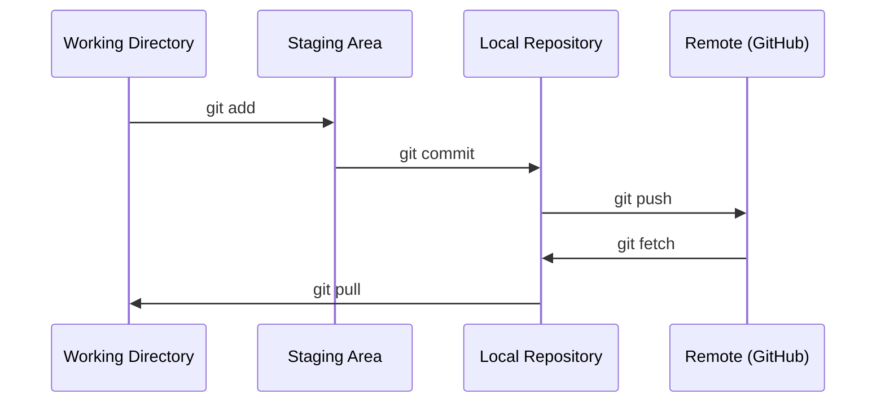

# Git and Collaboration

> Version control is not optional. Every experiment, every model, every lesson you work through here gets tracked.

**Type:** Learn
**Languages:** --
**Prerequisites:** Phase 0, Lesson 01
**Time:** ~30 min

## Learning Objectives

- Configure git identity and master the daily add, commit, push workflow
- Create and merge branches to isolate experiments without breaking main
- Write a `.gitignore` to exclude model checkpoints and large binary files
- Browse commit history with `git log` to see how a project evolved

## The Problem

You'll write hundreds of code files across 20 phases. Without version control, you'll lose work, break things you can't undo, and have no way to collaborate.

Git is the tool, GitHub is where the code lives. This lesson covers only what you need for this course — nothing more.

## The Concept



Remember three things:
1. Save often (`git commit`)
2. Push to remote (`git push`)
3. Branch for experiments (`git checkout -b experiment`)

## Build It

### Step 1: Configure git

```bash
git config --global user.name "Your Name"
git config --global user.email "you@example.com"
```

### Step 2: Daily workflow

```bash
git status
git add file.py
git commit -m "Add perceptron implementation"
git push origin main
```

### Step 3: Branch for experiments

```bash
git checkout -b experiment/new-optimizer

# ...make changes, commit...

git checkout main
git merge experiment/new-optimizer
```

### Step 4: Work in this course repo

```bash
git clone https://github.com/rohitg00/ai-engineering-from-scratch.git
cd ai-engineering-from-scratch

git checkout -b my-progress
# Follow along, commit your work
git push origin my-progress
```

## Use It

These are the only commands you need for this course:

| Command | When to use |
|---------|------|
| `git clone` | Get the course repo |
| `git add` + `git commit` | Save your work |
| `git push` | Back up to GitHub |
| `git checkout -b` | Try something without breaking main |
| `git log --oneline` | See what you've done |

That's it. No rebase, no cherry-pick, no submodules needed for this course.

## Exercises

1. Clone this repo, create a branch called `my-progress`, make a file, commit and push
2. Write a `.gitignore` that excludes model checkpoint files (`.pt`, `.pth`, `.safetensors`)
3. Run `git log --oneline` on this repo and read through how lessons were added over time

## Key Terms

| Term | What people say | What it actually is |
|------|----------------|----------------------|
| Commit | "save" | A snapshot of the entire project at a point in time |
| Branch | "a copy" | A pointer to a commit that moves forward as you work |
| Merge | "combine code" | Taking changes from one branch and applying them to another |
| Remote | "the cloud" | A copy of the repository hosted elsewhere (GitHub, GitLab) |
