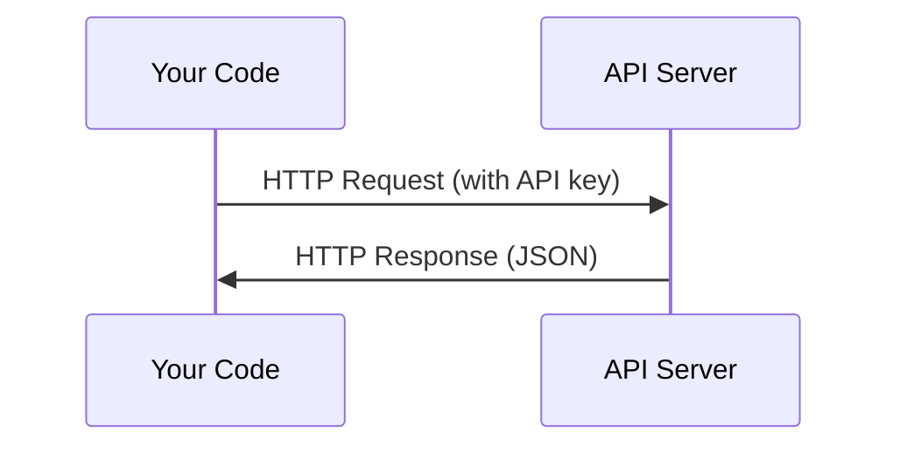

# APIs and Keys

> All AI APIs work the same way: send a request, get a response. The details change, the pattern doesn't.

**Type:** Build
**Languages:** Python, TypeScript
**Prerequisites:** Phase 0, Lesson 01
**Time:** ~30 min

## Learning Objectives

- Store API keys securely using environment variables and `.env` files
- Make an LLM API call using both the Anthropic Python SDK and raw HTTP
- Compare SDK vs raw HTTP request/response formats for debugging
- Identify and handle common API errors including auth failures and rate limiting

## The Problem

Starting from Phase 11, you'll call various LLM APIs (Anthropic, OpenAI, Google). In Phases 13-16, you'll build agents that use these APIs in loops. You need to understand how API keys work, how to store them safely, and how to make your first API call.

## The Concept



Every API call has:
1. An endpoint (URL)
2. An API key (authentication)
3. A request body (what you want)
4. A response body (what you get back)

## Build It

### Step 1: Store API Keys Safely

Never hardcode API keys. Use environment variables.

```bash
export ANTHROPIC_API_KEY="sk-ant-..."
export OPENAI_API_KEY="sk-..."
```

Or use a `.env` file (add it to `.gitignore`):

```
ANTHROPIC_API_KEY=sk-ant-...
OPENAI_API_KEY=sk-...
```

### Step 2: First API Call (Python)

```python
import anthropic

client = anthropic.Anthropic()

response = client.messages.create(
    model="claude-sonnet-4-20250514",
    max_tokens=256,
    messages=[{"role": "user", "content": "What is a neural network in one sentence?"}]
)

print(response.content[0].text)
```

### Step 3: First API Call (TypeScript)

```typescript
import Anthropic from "@anthropic-ai/sdk";

const client = new Anthropic();

const response = await client.messages.create({
  model: "claude-sonnet-4-20250514",
  max_tokens: 256,
  messages: [{ role: "user", content: "What is a neural network in one sentence?" }],
});

console.log(response.content[0].text);
```

### Step 4: Raw HTTP (No SDK)

```python
import os
import urllib.request
import json

url = "https://api.anthropic.com/v1/messages"
headers = {
    "Content-Type": "application/json",
    "x-api-key": os.environ["ANTHROPIC_API_KEY"],
    "anthropic-version": "2023-06-01",
}
body = json.dumps({
    "model": "claude-sonnet-4-20250514",
    "max_tokens": 256,
    "messages": [{"role": "user", "content": "What is a neural network in one sentence?"}],
}).encode()

req = urllib.request.Request(url, data=body, headers=headers, method="POST")
with urllib.request.urlopen(req) as resp:
    result = json.loads(resp.read())
    print(result["content"][0]["text"])
```

The SDK does exactly this under the hood. Understanding raw HTTP calls makes debugging easier.

## Use It

This course uses:

| API | When needed | Free tier |
|-----|-----------------|-----------|
| Anthropic (Claude) | Phases 11-16 (agents, tools) | $5 credit on signup |
| OpenAI | Phase 11 (comparison) | $5 credit on signup |
| Hugging Face | Phases 4-10 (models, datasets) | Free |

You don't need all of these now. Set each one up when the relevant lesson requires it.

## Ship It

This lesson produces:
- `outputs/prompt-api-troubleshooter.md` — diagnosing common API errors

## Exercises

1. Get an Anthropic API key and make your first API call
2. Try the raw HTTP version and compare its response format to the SDK version
3. Intentionally use a wrong API key and read the error message

## Key Terms

| Term | What people say | What it actually is |
|------|----------------|----------------------|
| API key | "password for the API" | A unique string identifying your account and authorizing requests |
| Rate limit | "it's throttling me" | Maximum requests per minute/hour to prevent abuse and ensure fairness |
| Token | "a word" (in API context) | Billing unit: input tokens and output tokens are counted and billed separately |
| Streaming | "real-time response" | Receiving the response word by word instead of waiting for the entire output |
