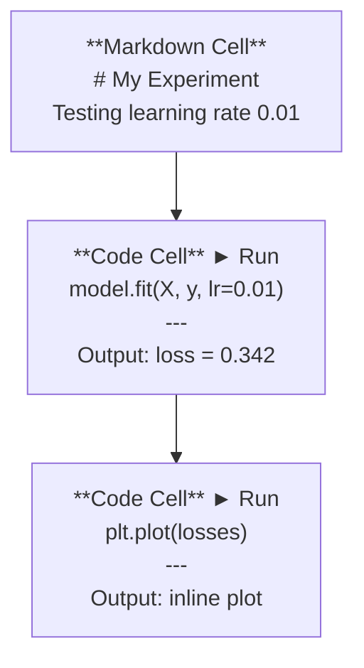
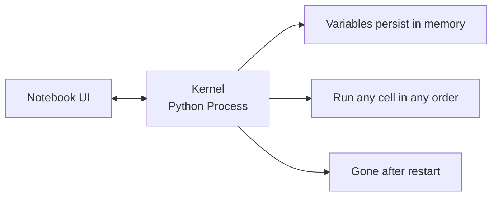

# Jupyter Notebooks

> Notebooks are the lab bench of AI engineering. Prototype here first, then move what works into production.

**Type:** Build
**Languages:** Python
**Prerequisites:** Phase 0, Lesson 1
**Time:** ~30 min

## Learning Objectives

- Install and launch JupyterLab, Jupyter Notebook, or VS Code with the Jupyter extension
- Use magic commands (`%timeit`, `%%time`, `%matplotlib inline`) for benchmarking and inline visualization
- Distinguish when to use notebooks vs scripts, and practice the "explore in notebooks, ship with scripts" workflow
- Identify and avoid common notebook pitfalls: out-of-order execution, hidden state, memory leaks

## The Problem

Every AI paper, tutorial, and Kaggle competition uses Jupyter notebooks. They let you run code in chunks, see output inline, mix code with explanations, and iterate quickly. Learning AI without notebooks is like doing math without scratch paper.

But notebooks have real pitfalls. People use them for everything, including things they're bad at. Knowing when to use notebooks vs scripts saves countless debugging nightmares later.

## The Concept

A notebook is a sequence of cells. Each cell is either code or text.



The kernel is a Python process running in the background. You run a cell, it sends the code to the kernel, the kernel executes it and sends the result back. All cells share the same kernel, so variables persist between cells.



The "run any cell in any order" feature is both a superpower and a landmine.

## Build It

### Step 1: Choose Your Interface

Three choices, one format:

| Interface | Install | Best for |
|-----------|---------|----------|
| JupyterLab | `pip install jupyterlab` then `jupyter lab` | Full IDE experience, multiple tabs, file browser, terminal |
| Jupyter Notebook | `pip install notebook` then `jupyter notebook` | Simple, lightweight, one notebook at a time |
| VS Code | Install "Jupyter" extension | Inside your editor, git integration, debugging |

All three read and write the same `.ipynb` files. Pick whichever you prefer. JupyterLab is most common in AI work.

```bash
pip install jupyterlab
jupyter lab
```

### Step 2: Keyboard Shortcuts That Matter

You operate in two modes. Press `Escape` to enter command mode (blue sidebar), press `Enter` for edit mode (green sidebar).

**Command mode (most used):**

| Key | Action |
|-----|--------|
| `Shift+Enter` | Run cell, move to next |
| `A` | Insert cell above |
| `B` | Insert cell below |
| `DD` | Delete cell |
| `M` | Convert to markdown |
| `Y` | Convert to code |
| `Z` | Undo cell operation |
| `Ctrl+Shift+H` | Show all shortcuts |

**Edit mode:**

| Key | Action |
|-----|--------|
| `Tab` | Autocomplete |
| `Shift+Tab` | Show function signature |
| `Ctrl+/` | Toggle comment |

`Shift+Enter` is the one you'll use a thousand times a day. Learn it first.

### Step 3: Cell Types

**Code cells** run Python and display output:

```python
import numpy as np
data = np.random.randn(1000)
data.mean(), data.std()
```

Output: `(0.0032, 0.9987)`

**Markdown cells** render formatted text. Use them to document what you're doing and why. Supports headings, bold, italics, LaTeX math (`$E = mc^2$`), tables, and images.

### Step 4: Magic Commands

These aren't Python. They're Jupyter-specific commands prefixed with `%` (line magic) or `%%` (cell magic).

**Timing code:**

```python
%timeit np.random.randn(10000)
```

Output: `45.2 us +/- 1.3 us per loop`

```python
%%time
model.fit(X_train, y_train, epochs=10)
```

Output: `Wall time: 2.34 s`

`%timeit` runs code many times and averages. `%%time` runs once. Use `%timeit` for microbenchmarks, `%%time` for training jobs.

**Enable inline plots:**

```python
%matplotlib inline
```

Now every `plt.plot()` or `plt.show()` renders directly in the notebook.

**Install packages without leaving the notebook:**

```python
!pip install scikit-learn
```

The `!` prefix runs any shell command.

**Check environment variables:**

```python
%env CUDA_VISIBLE_DEVICES
```

### Step 5: Rich Output Display

Notebooks auto-display the last expression in a cell. But you can control it:

```python
import pandas as pd

df = pd.DataFrame({
    "model": ["Linear", "Random Forest", "Neural Net"],
    "accuracy": [0.72, 0.89, 0.94],
    "training_time": [0.1, 2.3, 45.6]
})
df
```

This renders as a formatted HTML table, not a blob of text. Same for plots:

```python
import matplotlib.pyplot as plt

plt.figure(figsize=(8, 4))
plt.plot([1, 2, 3, 4], [1, 4, 2, 3])
plt.title("Inline Plot")
plt.show()
```

The plot appears directly below the cell. This is why notebooks dominate AI work: you see data, plots, and code together.

Display images:

```python
from IPython.display import Image, display
display(Image(filename="architecture.png"))
```

### Step 6: Google Colab

Colab is free Jupyter notebooks in the cloud. It gives you a GPU, pre-installed libraries, and Google Drive integration. Zero setup.

1. Open [colab.research.google.com](https://colab.research.google.com)
2. Upload any `.ipynb` file from this course
3. Runtime > Change runtime type > T4 GPU (free)

Differences from local Jupyter:
- Files don't persist between sessions (save to Drive or download)
- Pre-installed: numpy, pandas, matplotlib, torch, tensorflow, sklearn
- `from google.colab import files` for upload/download
- `from google.colab import drive; drive.mount('/content/drive')` for persistent storage
- Session times out after 90 minutes idle (free tier)

## Use It

### Notebook vs Script: When to Use Which

| Use notebooks for | Use scripts for |
|-------------------|-----------------|
| Exploring datasets | Training pipelines |
| Prototyping models | Reusable utilities |
| Visualizing results | Anything with `if __name__` |
| Explaining your work | Scheduled jobs |
| Quick experiments | Production code |
| Course exercises | Packages and libraries |

The rule: **Explore in notebooks, ship with scripts.**

A common AI workflow:
1. Explore data in a notebook
2. Prototype a model in a notebook
3. Once it works, move code to `.py` files
4. Import those `.py` files back into notebooks for further experiments

### Pitfalls

**Out-of-order execution.** You run cell 5, then cell 2, then cell 7. The notebook works on your machine but crashes when someone else runs it top-to-bottom. Fix: Kernel > Restart & Run All before sharing.

**Hidden state.** You deleted a cell, but the variable it created still lives in memory. The notebook looks clean but depends on a ghost cell. Fix: restart the kernel periodically.

**Memory leaks.** Load a 4 GB dataset, train a model, load another dataset. Nothing gets freed. Fix: `del variable_name` plus `gc.collect()`, or restart the kernel.

## Ship It

This lesson produces:
- `outputs/prompt-notebook-helper.md` for debugging notebook issues

## Exercises

1. Open JupyterLab, create a notebook, and use `%timeit` to compare list comprehension vs numpy for creating 100,000 random arrays
2. Create a notebook with both markdown and code cells that loads a CSV, displays a dataframe, and plots a chart. Run Kernel > Restart & Run All and verify it runs top-to-bottom
3. Paste the code from `code/notebook_tips.py` into a Colab notebook and run it with the free GPU

## Key Terms

| Term | What people say | What it actually is |
|------|----------------|----------------------|
| Kernel | "the thing running my code" | A separate Python process that executes cells and keeps variables in memory |
| Cell | "a code block" | An independently runnable unit in a notebook, either code or markdown |
| Magic command | "Jupyter tricks" | Special commands prefixed with `%` or `%%` that control the notebook environment |
| `.ipynb` | "notebook file" | A JSON file containing cells, outputs, and metadata. Stands for IPython Notebook |

## Further Reading

- [JupyterLab Docs](https://jupyterlab.readthedocs.io/) for the full feature set
- [Google Colab FAQ](https://research.google.com/colaboratory/faq.html) for Colab-specific limits and features
- [28 Jupyter Notebook Tips](https://www.dataquest.io/blog/jupyter-notebook-tips-tricks-shortcuts/) for power-user shortcuts
