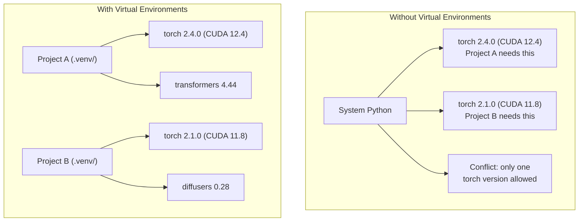

# Python Environments

> Dependency hell is real. Virtual environments are the cure.

**Type:** Build
**Languages:** Shell
**Prerequisites:** Phase 0, Lesson 1
**Time:** ~30 min

## Learning Objectives

- Create isolated virtual environments with `uv`, `venv`, or `conda`
- Write a `pyproject.toml` with optional dependency groups and generate a lockfile for reproducibility
- Diagnose and fix common pitfalls: global installs, pip/conda mixing, CUDA version mismatches
- Implement a per-phase environment strategy for projects with conflicting dependencies

## The Problem

You install PyTorch 2.4 for a fine-tuning project. Next week, another project needs PyTorch 2.1 because its CUDA build is pinned. You upgrade globally, the first project breaks. You downgrade, the second breaks.

This is dependency hell. It happens constantly in AI/ML work because:

- PyTorch, JAX, TensorFlow each ship their own CUDA bindings
- Model libraries pin specific framework versions
- A single global `pip install` overwrites what was there before
- CUDA 11.8 builds won't run on CUDA 12.x drivers (and vice versa)

The fix: every project gets its own isolated environment with its own packages.

## The Concept



## Build It

### Option 1: uv venv (Recommended)

`uv` is the fastest Python package manager (10-100x faster than pip). It handles virtual environments, Python versions, and dependency solving in one tool.

```bash
curl -LsSf https://astral.sh/uv/install.sh | sh

uv python install 3.12

cd your-project
uv venv
source .venv/bin/activate
```

Install packages:

```bash
uv pip install torch numpy
```

Create a project with `pyproject.toml` in one step:

```bash
uv init my-ai-project
cd my-ai-project
uv add torch numpy matplotlib
```

### Option 2: venv (Built-in)

If you can't install `uv`, Python ships with `venv`:

```bash
python3 -m venv .venv
source .venv/bin/activate  # Linux/macOS
.venv\Scripts\activate     # Windows

pip install torch numpy
```

Slower than `uv`, but works anywhere Python is installed.

### Option 3: conda (When You Need It)

Conda manages non-Python dependencies like CUDA toolkit, cuDNN, and C libraries. Use it when:

- You need a specific CUDA toolkit version without a system-wide install
- You're on a shared cluster without system package access
- A library's install docs say "use conda"

```bash
# Install miniconda (not full Anaconda)
curl -LsSf https://repo.anaconda.com/miniconda/Miniconda3-latest-Linux-x86_64.sh -o miniconda.sh
bash miniconda.sh -b

conda create -n myproject python=3.12
conda activate myproject

conda install pytorch torchvision torchaudio pytorch-cuda=12.4 -c pytorch -c nvidia
```

One rule: if an environment uses conda, install everything in that environment with conda. Mixing `pip install` into a conda environment causes extremely hard-to-debug dependency conflicts.

### This Course: Per-Phase Strategy

You could create one environment for the whole course. Don't. Different phases need different (sometimes conflicting) dependencies.

Strategy:

```
ai-engineering-from-scratch/
├── .venv/                    <-- Shared lightweight env for Phases 0-3
├── phases/
│   ├── 04-neural-networks/
│   │   └── .venv/            <-- PyTorch environment
│   ├── 05-cnns/
│   │   └── .venv/            <-- Same PyTorch env (symlink or shared)
│   ├── 08-transformers/
│   │   └── .venv/            <-- May need different transformer versions
│   └── 11-llm-apis/
│       └── .venv/            <-- API SDKs, no torch needed
```

The script in `code/env_setup.sh` creates the base environment for this course.

## pyproject.toml Basics

Every Python project should have a `pyproject.toml`. It replaces `setup.py`, `setup.cfg`, and `requirements.txt` in a single file.

```toml
[project]
name = "ai-engineering-from-scratch"
version = "0.1.0"
requires-python = ">=3.11"
dependencies = [
    "numpy>=1.26",
    "matplotlib>=3.8",
    "jupyter>=1.0",
    "scikit-learn>=1.4",
]

[project.optional-dependencies]
torch = ["torch>=2.3", "torchvision>=0.18"]
llm = ["anthropic>=0.39", "openai>=1.50"]
```

Then install:

```bash
uv pip install -e ".[torch]"    # Base + PyTorch
uv pip install -e ".[llm]"     # Base + LLM SDKs
uv pip install -e ".[torch,llm]" # Everything
```

## Lockfile

A lockfile pins every dependency (including transitive ones) to an exact version. This guarantees reproducibility: anyone installing from the lockfile gets identical packages.

```bash
# uv auto-generates uv.lock when you use uv add
uv add numpy

# pip-tools approach
uv pip compile pyproject.toml -o requirements.lock
uv pip install -r requirements.lock
```

Commit the lockfile to git. Others clone and install from the lockfile to get the exact same versions.

## Pitfalls

### 1. Installing Globally

```bash
pip install torch  # Bad: installs into system Python

source .venv/bin/activate
pip install torch  # Good: installs into virtual environment
```

Check where your packages go:

```bash
which python       # Should show .venv/bin/python, not /usr/bin/python
which pip           # Should show .venv/bin/pip
```

### 2. Mixing pip and conda

```bash
conda create -n myenv python=3.12
conda activate myenv
conda install pytorch -c pytorch
pip install some-other-package   # Bad: may break conda's dependency tracking
conda install some-other-package # Good: let conda manage everything
```

If you must use pip inside conda (some packages are pip-only), install all conda packages first, then pip packages last.

### 3. Forgetting to Activate

```bash
python train.py           # Uses system Python, missing packages
source .venv/bin/activate
python train.py           # Uses project Python, packages available
```

Your shell prompt should show the environment name:

```
(.venv) $ python train.py
```

### 4. Committing .venv to git

```bash
echo ".venv/" >> .gitignore
```

Virtual environments are 200MB-2GB. They're local and not portable between machines. Commit `pyproject.toml` and the lockfile instead.

### 5. CUDA Version Mismatch

```bash
nvidia-smi                # Shows driver CUDA version (e.g., 12.4)
python -c "import torch; print(torch.version.cuda)"  # Shows PyTorch CUDA version

# These must be compatible.
# PyTorch's CUDA version must be <= driver CUDA version.
```

## Use It

Run the setup script to create your course environment:

```bash
bash phases/00-setup-and-tooling/06-python-environments/code/env_setup.sh
```

This creates a `.venv` at the repo root with core dependencies installed and verified.

## Exercises

1. Run `env_setup.sh` and confirm all checks pass
2. Create a second virtual environment, install a different numpy version in it, and confirm the two environments are isolated
3. Write a `pyproject.toml` for a project that needs both PyTorch and Anthropic SDK
4. Intentionally install a package globally (without activating venv), see where it goes, then uninstall it

## Key Terms

| Term | What people say | What it actually is |
|------|----------------|----------------------|
| Virtual environment | "a venv" | An isolated directory containing a Python interpreter and packages, separate from system Python |
| Lockfile | "pinned dependencies" | A file listing every package with its exact version, ensuring identical installs across machines |
| pyproject.toml | "the new setup.py" | Standard Python project configuration replacing setup.py/setup.cfg/requirements.txt |
| Transitive dependency | "dependency of a dependency" | Package B depends on C; you install A which depends on B, so C is a transitive dependency of A |
| CUDA mismatch | "my GPU doesn't work" | PyTorch was compiled for a different CUDA version than your GPU driver supports |
