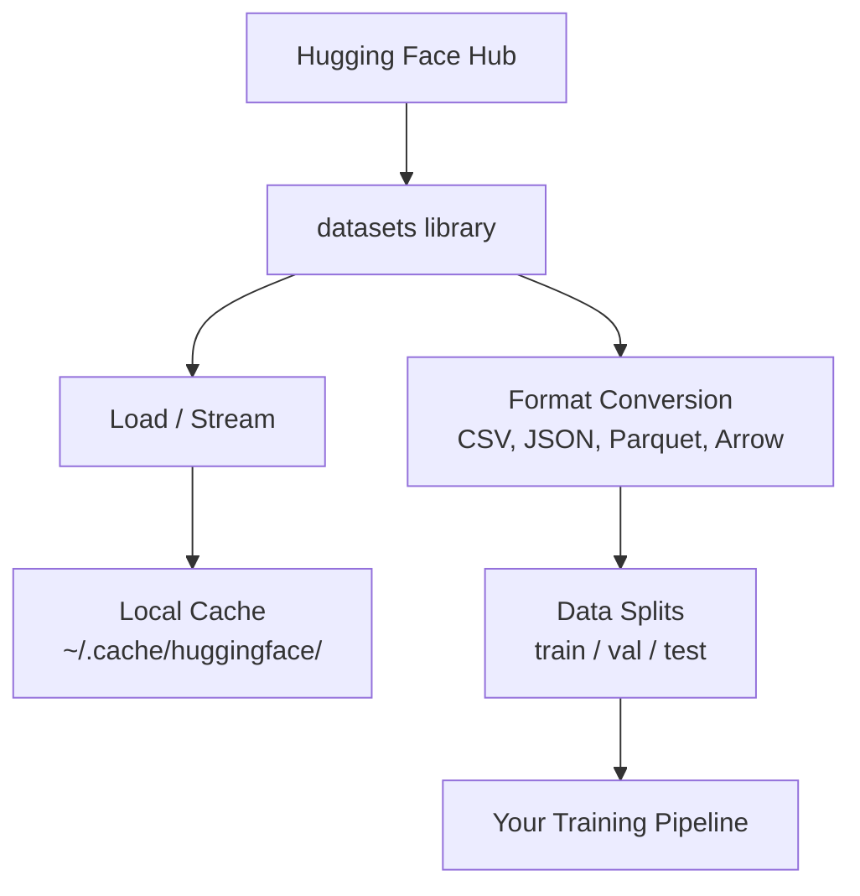

# Data Management

> Data is the fuel. How you manage it determines how fast you can go.

**Type:** Build
**Languages:** Python
**Prerequisites:** Phase 0, Lesson 1
**Time:** ~45 min

## Learning Objectives

- Load, stream, and cache datasets with the Hugging Face `datasets` library
- Convert between CSV, JSON, Parquet, and Arrow formats and explain their tradeoffs
- Create reproducible train/validation/test splits with fixed random seeds
- Manage large model and dataset files with `.gitignore`, Git LFS, or DVC

## The Problem

Every AI project starts with data. You need to find datasets, download them, convert between formats, split them for training and evaluation, and version them so experiments are reproducible. Doing this manually every time is slow and error-prone. You need a repeatable workflow.

## The Concept



The Hugging Face `datasets` library is the standard way to load data in AI work. It handles downloading, caching, format conversion, and streaming out of the box.

## Build It

### Step 1: Install the datasets library

```bash
pip install datasets huggingface_hub
```

### Step 2: Load a dataset

```python
from datasets import load_dataset

dataset = load_dataset("imdb")
print(dataset)
print(dataset["train"][0])
```

This downloads the IMDB movie review dataset. After the first download, it loads from the cache at `~/.cache/huggingface/datasets/`.

### Step 3: Stream large datasets

Some datasets are too large for disk. Streaming loads them row by row without downloading the whole thing.

```python
dataset = load_dataset("wikimedia/wikipedia", "20220301.en", split="train", streaming=True)

for i, example in enumerate(dataset):
    print(example["title"])
    if i >= 4:
        break
```

Streaming gives you an `IterableDataset`. You process data as it arrives. Memory usage stays constant regardless of dataset size.

### Step 4: Dataset formats

The `datasets` library uses Apache Arrow under the hood. You can convert to other formats depending on your pipeline needs.

```python
dataset = load_dataset("imdb", split="train")

dataset.to_csv("imdb_train.csv")
dataset.to_json("imdb_train.json")
dataset.to_parquet("imdb_train.parquet")
```

Format comparison:

| Format | Size | Read Speed | Best For |
|--------|------|-----------|----------|
| CSV | Large | Slow | Human-readable, spreadsheets |
| JSON | Large | Slow | APIs, nested data |
| Parquet | Small | Fast | Analytics, columnar queries |
| Arrow | Small | Fastest | In-memory processing (what `datasets` uses internally) |

For AI work, Parquet is the best storage format. Arrow is what you interact with in memory. CSV and JSON are for interchange.

### Step 5: Data splits

Every ML project needs three splits:

- **Train**: the model learns from this (typically 80%)
- **Validation**: you check progress during training (typically 10%)
- **Test**: final evaluation after training completes (typically 10%)

Some datasets come pre-split. When they don't, create your own:

```python
dataset = load_dataset("imdb", split="train")

split = dataset.train_test_split(test_size=0.2, seed=42)
train_val = split["train"].train_test_split(test_size=0.125, seed=42)

train_ds = train_val["train"]
val_ds = train_val["test"]
test_ds = split["test"]

print(f"Train: {len(train_ds)}, Val: {len(val_ds)}, Test: {len(test_ds)}")
```

Always set a seed for reproducibility. The same seed produces the same splits every time.

### Step 6: Downloading and caching models

Models are large files. The `huggingface_hub` library handles downloading and caching.

```python
from huggingface_hub import hf_hub_download, snapshot_download

model_path = hf_hub_download(
    repo_id="sentence-transformers/all-MiniLM-L6-v2",
    filename="config.json"
)
print(f"Cached at: {model_path}")

model_dir = snapshot_download("sentence-transformers/all-MiniLM-L6-v2")
print(f"Full model at: {model_dir}")
```

Models cache to `~/.cache/huggingface/hub/`. After one download, subsequent runs load instantly.

### Step 7: Handling large files

Model weights and large datasets shouldn't go in git. Three options:

**Option A: .gitignore (simplest)**

```
*.bin
*.safetensors
*.pt
*.onnx
data/*.parquet
data/*.csv
models/
```

**Option B: Git LFS (track large files with git)**

```bash
git lfs install
git lfs track "*.bin"
git lfs track "*.safetensors"
git add .gitattributes
```

Git LFS stores pointers in your repo; actual files live on a separate server. GitHub gives you 1 GB free.

**Option C: DVC (Data Version Control)**

```bash
pip install dvc
dvc init
dvc add data/training_set.parquet
git add data/training_set.parquet.dvc data/.gitignore
git commit -m "Track training data with DVC"
```

DVC creates small `.dvc` files pointing to your data. The data itself lives on S3, GCS, or another remote storage backend.

| Approach | Complexity | Best For |
|----------|-----------|----------|
| .gitignore | Low | Personal projects, re-downloadable data |
| Git LFS | Medium | Teams sharing model weights via git |
| DVC | High | Reproducible experiments, large datasets, teams |

For this course, `.gitignore` is sufficient. Use DVC when you need to reproduce exact experiments across multiple machines.

### Step 8: Storage patterns

**Local storage** works for datasets under ~10 GB. The HF cache handles this automatically.

**Cloud storage** for larger or shared data across multiple machines:

```python
import os

local_path = os.path.expanduser("~/.cache/huggingface/datasets/")

# s3_path = "s3://my-bucket/datasets/"
# gcs_path = "gs://my-bucket/datasets/"
```

DVC integrates directly with S3, GCS:

```bash
dvc remote add -d myremote s3://my-bucket/dvc-store
dvc push
```

Local storage works for this course. Cloud storage becomes relevant when you fine-tune on remote GPU instances.

## Datasets Used in This Course

| Dataset | Lessons | Size | Teaches |
|---------|---------|------|----------------|
| IMDB | Tokenization, classification | 84 MB | Text classification basics |
| WikiText | Language modeling | 181 MB | Next-token prediction |
| SQuAD | Question answering | 35 MB | QA, spans |
| Common Crawl (subset) | Embeddings | Varies | Large-scale text processing |
| MNIST | Vision basics | 21 MB | Image classification fundamentals |
| COCO (subset) | Multimodal | Varies | Image-text pairs |

You don't need to download all of these now. Each lesson specifies what it needs.

## Use It

Run the utility script to verify everything works:

```bash
python code/data_utils.py
```

This downloads a small dataset, converts it, splits it, and prints a summary.

## Ship It

This lesson produces:
- `code/data_utils.py` — reusable data loading and caching utilities
- `outputs/prompt-data-helper.md` — a prompt to find the right dataset for a task

## Exercises

1. Load the `glue` dataset with the `mrpc` config and inspect the first 5 samples
2. Stream the `c4` dataset and count how many samples you can process in 10 seconds
3. Convert a dataset to Parquet and compare its file size to CSV
4. Create a 70/15/15 train/val/test split with a fixed seed and verify the sizes

## Key Terms

| Term | What people say | What it actually is |
|------|----------------|----------------------|
| Split | "training data" | A named subset (train/val/test) used at different stages of the ML lifecycle |
| Streaming | "lazy loading" | Processing data row by row from a remote source without downloading the full dataset |
| Parquet | "compressed CSV" | A columnar file format optimized for analytics queries and storage efficiency |
| Arrow | "fast dataframe" | An in-memory columnar format used by the datasets library for zero-copy reads |
| Git LFS | "git for big files" | An extension storing large files outside the git repo while keeping pointers in version control |
| DVC | "git for data" | A version control system for datasets and models, integrating with cloud storage |
| Cache | "already downloaded" | A local copy of previously fetched data, stored by default at ~/.cache/huggingface/ |
