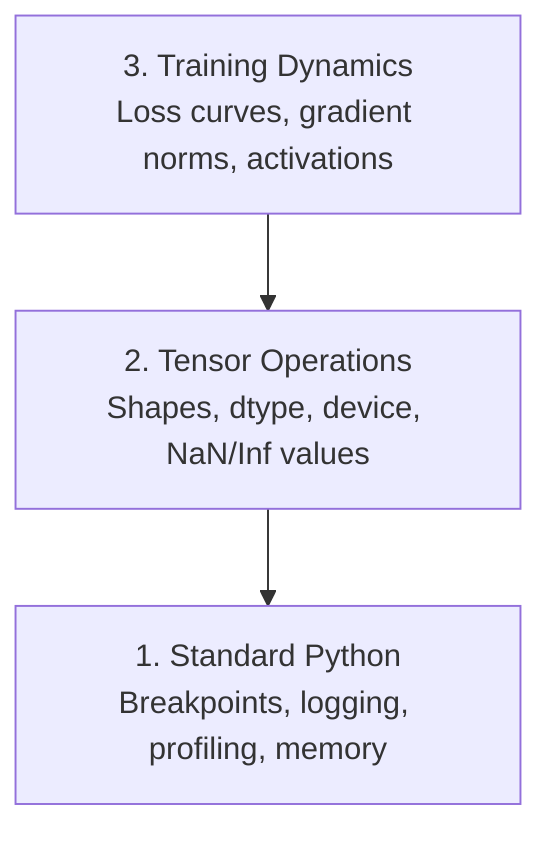

# Debugging and Profiling

> The worst AI bugs don't crash. They silently train on garbage data and give you a beautiful loss curve.

**Type:** Build
**Languages:** Python
**Prerequisites:** Lesson 1 (Dev Environment), basic PyTorch familiarity
**Time:** ~60 min

## Learning Objectives

- Inspect tensor shapes, dtypes, and NaN values mid-training with conditional `breakpoint()` and `debug_print`
- Profile training loops with `cProfile`, `line_profiler`, and `tracemalloc` to find bottlenecks
- Detect common AI bugs: shape mismatches, NaN loss, data leakage, tensors on the wrong device
- Set up TensorBoard to visualize loss curves, weight histograms, and gradient distributions

## The Problem

AI code fails differently from regular code. A web app crashes with a stack trace. A misconfigured training loop runs for 8 hours, burns $200 of GPU time, and produces a model that predicts the mean for every input. The code never errors. The bug is a tensor on the wrong device, a forgotten `.detach()`, or labels leaking into features.

You need debugging tools that catch these silent failures before they waste your time and compute.

## The Concept

AI debugging operates at three levels:



Most people jump straight to level 3 (staring at TensorBoard). But 80% of AI bugs live at levels 1 and 2.

## Build It

### Part 1: Print Debugging (Yes, It Works)

Print debugging gets dismissed. It shouldn't be. For tensor code, a targeted print beats stepping through a debugger because you need to see shapes, dtypes, and value ranges all at once.

```python
def debug_print(name, tensor):
    print(f"{name}: shape={tensor.shape}, dtype={tensor.dtype}, "
          f"device={tensor.device}, "
          f"min={tensor.min().item():.4f}, max={tensor.max().item():.4f}, "
          f"mean={tensor.mean().item():.4f}, "
          f"has_nan={tensor.isnan().any().item()}")
```

Call it after every suspicious operation. Remove the prints once you find the bug. Simple.

### Part 2: Python Debugger (pdb and breakpoint)

The built-in debugger is underused in AI work. Drop a `breakpoint()` into your training loop and inspect tensors interactively.

```python
def training_step(model, batch, criterion, optimizer):
    inputs, labels = batch
    outputs = model(inputs)
    loss = criterion(outputs, labels)

    if loss.item() > 100 or torch.isnan(loss):
        breakpoint()

    loss.backward()
    optimizer.step()
```

Once the debugger drops you in, useful commands:

- `p outputs.shape` to check shapes
- `p loss.item()` to see the loss value
- `p torch.isnan(outputs).sum()` to count NaNs
- `p model.fc1.weight.grad` to inspect gradients
- `c` to continue, `q` to quit

This is conditional debugging. It only stops when something looks wrong. That matters for a 10,000-step training job.

### Part 3: Python Logging

When your debugging extends beyond a quick check, replace prints with logging.

```python
import logging

logging.basicConfig(
    level=logging.INFO,
    format="%(asctime)s [%(levelname)s] %(message)s",
    handlers=[
        logging.FileHandler("training.log"),
        logging.StreamHandler()
    ]
)
logger = logging.getLogger(__name__)

logger.info("Starting training: lr=%.4f, batch_size=%d", lr, batch_size)
logger.warning("Loss spike detected: %.4f at step %d", loss.item(), step)
logger.error("NaN loss at step %d, stopping", step)
```

Logging gives you timestamps, severity levels, and file output. When a training job fails at 3 AM, you want a log file — not terminal output that scrolled away.

### Part 4: Timing Code Sections

Knowing where time goes is the first step to optimization.

```python
import time

class Timer:
    def __init__(self, name=""):
        self.name = name

    def __enter__(self):
        self.start = time.perf_counter()
        return self

    def __exit__(self, *args):
        elapsed = time.perf_counter() - self.start
        print(f"[{self.name}] {elapsed:.4f}s")

with Timer("data loading"):
    batch = next(dataloader_iter)

with Timer("forward pass"):
    outputs = model(batch)

with Timer("backward pass"):
    loss.backward()
```

Common finding: data loading accounts for 60% of training time. The fix is `num_workers > 0` on your DataLoader, not a faster GPU.

### Part 5: cProfile and line_profiler

When you need more than manual timers:

```bash
python -m cProfile -s cumtime train.py
```

This shows every function call sorted by cumulative time. For line-by-line profiling:

```bash
pip install line_profiler
```

```python
@profile
def train_step(model, data, target):
    output = model(data)
    loss = F.cross_entropy(output, target)
    loss.backward()
    return loss

# Run with: kernprof -l -v train.py
```

### Part 6: Memory Profiling

#### CPU Memory with tracemalloc

```python
import tracemalloc

tracemalloc.start()

# Your code here
model = build_model()
data = load_dataset()

snapshot = tracemalloc.take_snapshot()
top_stats = snapshot.statistics("lineno")
for stat in top_stats[:10]:
    print(stat)
```

#### CPU Memory with memory_profiler

```bash
pip install memory_profiler
```

```python
from memory_profiler import profile

@profile
def load_data():
    raw = read_csv("data.csv")       # Watch memory jump here
    processed = preprocess(raw)       # And here
    return processed
```

Run with `python -m memory_profiler your_script.py` to see line-by-line memory usage.

#### GPU Memory with PyTorch

```python
import torch

if torch.cuda.is_available():
    print(torch.cuda.memory_summary())

    print(f"Allocated: {torch.cuda.memory_allocated() / 1e9:.2f} GB")
    print(f"Cached: {torch.cuda.memory_reserved() / 1e9:.2f} GB")
```

When you hit OOM (Out of Memory):

1. Reduce batch size (always try first)
2. Use `torch.cuda.empty_cache()` to free cached memory
3. Use `del tensor` followed by `torch.cuda.empty_cache()` for large intermediates
4. Use mixed precision (`torch.cuda.amp`) to halve memory usage
5. Use gradient checkpointing for very deep models

### Part 7: Common AI Bugs and How to Catch Them

#### Shape Mismatches

The most frequent bug. A tensor is `[batch, features]` but the model expects `[batch, channels, height, width]`.

```python
def check_shapes(model, sample_input):
    print(f"Input: {sample_input.shape}")
    hooks = []

    def make_hook(name):
        def hook(module, inp, out):
            in_shape = inp[0].shape if isinstance(inp, tuple) else inp.shape
            out_shape = out.shape if hasattr(out, "shape") else type(out)
            print(f"  {name}: {in_shape} -> {out_shape}")
        return hook

    for name, module in model.named_modules():
        hooks.append(module.register_forward_hook(make_hook(name)))

    with torch.no_grad():
        model(sample_input)

    for h in hooks:
        h.remove()
```

Run this with a sample batch. It prints every shape transformation through your model.

#### NaN Loss

NaN loss means something exploded. Common causes:

- Learning rate too high
- Division by zero in a custom loss
- Log of zero or negative numbers
- Gradient explosion in RNNs

```python
def detect_nan(model, loss, step):
    if torch.isnan(loss):
        print(f"NaN loss at step {step}")
        for name, param in model.named_parameters():
            if param.grad is not None:
                if torch.isnan(param.grad).any():
                    print(f"  NaN gradient in {name}")
                if torch.isinf(param.grad).any():
                    print(f"  Inf gradient in {name}")
        return True
    return False
```

#### Data Leakage

Your model gets 99% accuracy on the test set. Sounds great. It's a bug.

```python
def check_data_leakage(train_set, test_set, id_column="id"):
    train_ids = set(train_set[id_column].tolist())
    test_ids = set(test_set[id_column].tolist())
    overlap = train_ids & test_ids
    if overlap:
        print(f"DATA LEAKAGE: {len(overlap)} samples in both train and test")
        return True
    return False
```

Also check for temporal leakage: using future data to predict the past. Sort by timestamp before splitting.

#### Device Errors

Tensors on different devices (CPU vs GPU) raise runtime errors. But sometimes a tensor silently stays on CPU while everything else is on GPU, and training just gets slow.

```python
def check_devices(model, *tensors):
    model_device = next(model.parameters()).device
    print(f"Model device: {model_device}")
    for i, t in enumerate(tensors):
        if t.device != model_device:
            print(f"  WARNING: tensor {i} on {t.device}, model on {model_device}")
```

### Part 8: TensorBoard Basics

TensorBoard visualizes what's happening inside training over time.

```bash
pip install tensorboard
```

```python
from torch.utils.tensorboard import SummaryWriter

writer = SummaryWriter("runs/experiment_1")

for step in range(num_steps):
    loss = train_step(model, batch)

    writer.add_scalar("loss/train", loss.item(), step)
    writer.add_scalar("lr", optimizer.param_groups[0]["lr"], step)

    if step % 100 == 0:
        for name, param in model.named_parameters():
            writer.add_histogram(f"weights/{name}", param, step)
            if param.grad is not None:
                writer.add_histogram(f"grads/{name}", param.grad, step)

writer.close()
```

Launch it:

```bash
tensorboard --logdir=runs
```

What to look for:

- **Loss not decreasing**: learning rate too low, or model architecture issue
- **Loss oscillating wildly**: learning rate too high
- **Loss becomes NaN**: numerical instability (see NaN section above)
- **Train loss drops, val loss rises**: overfitting
- **Weight histograms collapse to zero**: vanishing gradients
- **Gradient histograms explode**: need gradient clipping

### Part 9: VS Code Debugger

For interactive debugging, configure VS Code with a `launch.json`:

```json
{
    "version": "0.2.0",
    "configurations": [
        {
            "name": "Debug Training",
            "type": "debugpy",
            "request": "launch",
            "program": "${file}",
            "console": "integratedTerminal",
            "justMyCode": false
        }
    ]
}
```

Click the gutter to set breakpoints. Use the Variables panel to inspect tensor properties. The Debug Console lets you run arbitrary Python expressions mid-execution.

Useful when debugging data preprocessing pipelines where you want to see each transformation step.

## Use It

This debugging workflow catches most AI bugs:

1. **Before training**: run `check_shapes` with a sample batch. Verify input and output dimensions match expectations.
2. **First 10 steps**: `debug_print` on loss, outputs, and gradients. Confirm no NaNs, values in reasonable range.
3. **During training**: log loss, learning rate, and gradient norms. Visualize with TensorBoard.
4. **When things break**: drop a `breakpoint()` at the failure point. Inspect tensors interactively.
5. **Performance**: time data loading, forward, and backward separately. Profile memory if you're near OOM.

## Ship It

Run the debugging toolkit script:

```bash
python phases/00-setup-and-tooling/12-debugging-and-profiling/code/debug_tools.py
```

`outputs/prompt-debug-ai-code.md` has a prompt for diagnosing AI-specific bugs.

## Exercises

1. Run `debug_tools.py` and read through each section's output. Modify the toy model to introduce a NaN (hint: divide by zero in the forward pass) and watch the detector catch it.
2. Profile a training loop with `cProfile` and find the slowest function.
3. Use `tracemalloc` to find which line in your data loading pipeline allocates the most memory.
4. Set up TensorBoard for a simple training job and determine whether the model is overfitting.
5. Use `breakpoint()` inside a training loop. Practice inspecting tensor shapes, devices, and gradient values from the debugger prompt.
