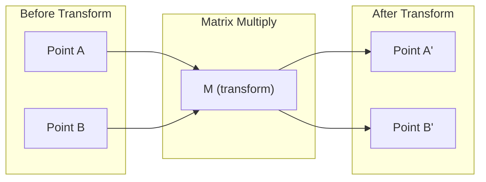
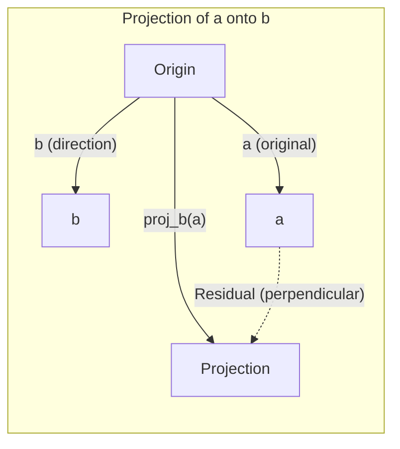

# Linear Algebra Intuition

> Every AI model is just matrix operations wearing a fancy hat.

**Type:** Learn
**Languages:** Python, Julia
**Prerequisites:** Phase 0
**Time:** ~60 min

## Learning Objectives

- Implement vector and matrix operations from scratch in Python (addition, dot product, matrix multiplication)
- Explain geometrically what dot products, projections, and Gram-Schmidt do
- Use row reduction to determine linear independence, rank, and basis
- Map linear algebra concepts to their AI applications: embeddings, attention scores, LoRA

## The Problem

Open any ML paper. Within the first page you'll see vectors, matrices, dot products, and transformations. Without linear algebra intuition, these are just symbols. With it, you can see what neural networks actually do — move points around in space.

You don't need to become a mathematician. You need to see what these operations mean geometrically, then build them yourself.

## The Concept

### Vectors Are Points (and Directions)

A vector is just a list of numbers. But those numbers mean something — they're coordinates in space.

**2D vector [3, 2]:**

| x | y | Point |
|---|---|-------|
| 3 | 2 | This vector points from the origin (0,0) to (3, 2) in the plane |

This vector has magnitude sqrt(3^2 + 2^2) = sqrt(13), pointing up and to the right.

In AI, vectors represent everything:
- A word → a 768-dimensional number vector (its "meaning" in embedding space)
- An image → a vector of millions of pixel values
- A user → a preference vector

### Matrices Are Transformations

A matrix turns one vector into another. It can rotate, scale, stretch, or project.



In AI, matrices are the model itself:
- Neural network weights → matrices that transform inputs into outputs
- Attention scores → matrices that decide what to focus on
- Embeddings → matrices that map words into vectors

### Dot Product Measures Similarity

The dot product of two vectors tells you how similar they are.

```
a · b = a₁×b₁ + a₂×b₂ + ... + aₙ×bₙ

Same direction:      a · b > 0  (similar)
Perpendicular:       a · b = 0  (unrelated)
Opposite direction:  a · b < 0  (dissimilar)
```

This is how search engines, recommendation systems, and RAG work — finding vectors with high dot products.

### Linear Independence

A set of vectors is linearly independent if none can be expressed as a combination of the others. If v1, v2, v3 are independent, they span a 3D space. If one is a combination of the rest, they only span a plane.

Why it matters for AI: your feature matrix should have linearly independent columns. If two features are perfectly correlated (linearly dependent), the model can't distinguish their individual effects. This causes multicollinearity in regression — the weight matrix becomes unstable and small input changes cause wild output swings.

**Concrete example:**

```
v1 = [1, 0, 0]
v2 = [0, 1, 0]
v3 = [2, 1, 0]   # v3 = 2*v1 + v2
```

v1 and v2 are linearly independent — neither is a scalar multiple or combination of the other. But v3 = 2*v1 + v2, so {v1, v2, v3} is a linearly dependent set. All three vectors lie in the xy-plane. No combination of them can reach [0, 0, 1]. You have three vectors but only two dimensions of freedom.

In a dataset: if feature_3 = 2*feature_1 + feature_2, adding feature_3 provides zero new information to the model. Worse, it makes the normal equations singular — the weights have no unique solution.

### Basis and Rank

A basis is the smallest set of linearly independent vectors that spans the entire space. The number of basis vectors equals the dimension of the space.

The standard basis for 3D is {[1,0,0], [0,1,0], [0,0,1]}. But any three independent vectors in 3D form a valid basis. Choosing a basis means choosing a coordinate system.

Matrix rank = number of linearly independent columns = number of linearly independent rows. If rank < min(rows, cols), the matrix is rank-deficient. This means:
- The system of equations has infinitely many solutions (or none)
- Information is lost during the transformation
- The matrix is not invertible

| Situation | Rank | What it means for ML |
|-----------|------|---------------------|
| Full rank (rank = min(m, n)) | Maximum possible | Unique least-squares solution exists. Model is well-conditioned. |
| Rank-deficient (rank < min(m, n)) | Below maximum | Redundant features. Infinitely many weight solutions. Needs regularization. |
| Rank 1 | 1 | Every column is a scaled copy of the same vector. All data lies on a line. |
| Near rank-deficient (tiny singular values) | Numerically low | Matrix is ill-conditioned. Small input noise causes large output changes. Use SVD truncation or ridge regression. |

### Projection

Projecting vector **a** onto vector **b** gives the component of **a** in the direction of **b**:

```
proj_b(a) = (a dot b / b dot b) * b
```

The residual (a - proj_b(a)) is perpendicular to b. This orthogonal decomposition is the foundation of least-squares fitting.

Projections are everywhere in ML:
- Linear regression minimizes distance from observations to the column space — its solution is a projection
- PCA projects data onto the directions of maximum variance
- Attention in transformers computes projections of queries onto keys



**Example:** a = [3, 4], b = [1, 0]

proj_b(a) = (3*1 + 4*0) / (1*1 + 0*0) * [1, 0] = 3 * [1, 0] = [3, 0]

The projection drops the y-component. This is dimensionality reduction in its simplest form — throwing away directions you don't care about.

### Gram-Schmidt Process

Converts any set of independent vectors into an orthonormal basis. Orthonormal means: each vector has length 1, and any two are perpendicular.

Algorithm:
1. Take the first vector, normalize it
2. Take the second vector, subtract its projection onto the first, normalize
3. Take the third vector, subtract its projections onto all previous vectors, normalize
4. Repeat for remaining vectors

```
Input:  v1, v2, v3, ... (linearly independent)

u1 = v1 / |v1|

w2 = v2 - (v2 dot u1) * u1
u2 = w2 / |w2|

w3 = v3 - (v3 dot u1) * u1 - (v3 dot u2) * u2
u3 = w3 / |w3|

Output: u1, u2, u3, ... (orthonormal basis)
```

QR decomposition does this internally. Q is the orthonormal basis, R records the projection coefficients. QR is used in:
- Solving linear systems (more stable than Gaussian elimination)
- Computing eigenvalues (QR algorithm)
- Least-squares regression (the standard numerical method)

## Build It

### Step 1: Vectors from Scratch (Python)

```python
class Vector:
    def __init__(self, components):
        self.components = list(components)
        self.dim = len(self.components)

    def __add__(self, other):
        return Vector([a + b for a, b in zip(self.components, other.components)])

    def __sub__(self, other):
        return Vector([a - b for a, b in zip(self.components, other.components)])

    def dot(self, other):
        return sum(a * b for a, b in zip(self.components, other.components))

    def magnitude(self):
        return sum(x**2 for x in self.components) ** 0.5

    def normalize(self):
        mag = self.magnitude()
        return Vector([x / mag for x in self.components])

    def cosine_similarity(self, other):
        return self.dot(other) / (self.magnitude() * other.magnitude())

    def __repr__(self):
        return f"Vector({self.components})"


a = Vector([1, 2, 3])
b = Vector([4, 5, 6])

print(f"a + b = {a + b}")
print(f"a · b = {a.dot(b)}")
print(f"|a| = {a.magnitude():.4f}")
print(f"cosine similarity = {a.cosine_similarity(b):.4f}")
```

### Step 2: Matrices from Scratch (Python)

```python
class Matrix:
    def __init__(self, rows):
        self.rows = [list(row) for row in rows]
        self.shape = (len(self.rows), len(self.rows[0]))

    def __matmul__(self, other):
        if isinstance(other, Vector):
            return Vector([
                sum(self.rows[i][j] * other.components[j] for j in range(self.shape[1]))
                for i in range(self.shape[0])
            ])
        rows = []
        for i in range(self.shape[0]):
            row = []
            for j in range(other.shape[1]):
                row.append(sum(
                    self.rows[i][k] * other.rows[k][j]
                    for k in range(self.shape[1])
                ))
            rows.append(row)
        return Matrix(rows)

    def transpose(self):
        return Matrix([
            [self.rows[j][i] for j in range(self.shape[0])]
            for i in range(self.shape[1])
        ])

    def __repr__(self):
        return f"Matrix({self.rows})"


rotation_90 = Matrix([[0, -1], [1, 0]])
point = Vector([3, 1])

rotated = rotation_90 @ point
print(f"Original: {point}")
print(f"Rotated 90°: {rotated}")
```

### Step 3: Why This Matters for AI

```python
import random

random.seed(42)
weights = Matrix([[random.gauss(0, 0.1) for _ in range(3)] for _ in range(2)])
input_vector = Vector([1.0, 0.5, -0.3])

output = weights @ input_vector
print(f"Input (3D): {input_vector}")
print(f"Output (2D): {output}")
print("This is what a neural network layer does -- matrix multiplication.")
```

### Step 4: Julia Version

```julia
a = [1.0, 2.0, 3.0]
b = [4.0, 5.0, 6.0]

println("a + b = ", a + b)
println("a · b = ", a ⋅ b)       # Julia supports unicode operators
println("|a| = ", √(a ⋅ a))
println("cosine = ", (a ⋅ b) / (√(a ⋅ a) * √(b ⋅ b)))

# Matrix-vector multiplication
W = [0.1 -0.2 0.3; 0.4 0.5 -0.1]
x = [1.0, 0.5, -0.3]
println("Wx = ", W * x)
println("This is a neural network layer.")
```

### Step 5: Linear Independence and Projection from Scratch (Python)

```python
def is_linearly_independent(vectors):
    n = len(vectors)
    dim = len(vectors[0].components)
    mat = Matrix([v.components[:] for v in vectors])
    rows = [row[:] for row in mat.rows]
    rank = 0
    for col in range(dim):
        pivot = None
        for row in range(rank, len(rows)):
            if abs(rows[row][col]) > 1e-10:
                pivot = row
                break
        if pivot is None:
            continue
        rows[rank], rows[pivot] = rows[pivot], rows[rank]
        scale = rows[rank][col]
        rows[rank] = [x / scale for x in rows[rank]]
        for row in range(len(rows)):
            if row != rank and abs(rows[row][col]) > 1e-10:
                factor = rows[row][col]
                rows[row] = [rows[row][j] - factor * rows[rank][j] for j in range(dim)]
        rank += 1
    return rank == n


def project(a, b):
    scalar = a.dot(b) / b.dot(b)
    return Vector([scalar * x for x in b.components])


def gram_schmidt(vectors):
    orthonormal = []
    for v in vectors:
        w = v
        for u in orthonormal:
            proj = project(w, u)
            w = w - proj
        if w.magnitude() < 1e-10:
            continue
        orthonormal.append(w.normalize())
    return orthonormal


v1 = Vector([1, 0, 0])
v2 = Vector([1, 1, 0])
v3 = Vector([1, 1, 1])
basis = gram_schmidt([v1, v2, v3])
for i, u in enumerate(basis):
    print(f"u{i+1} = {u}")
    print(f"  |u{i+1}| = {u.magnitude():.6f}")

print(f"u1 · u2 = {basis[0].dot(basis[1]):.6f}")
print(f"u1 · u3 = {basis[0].dot(basis[2]):.6f}")
print(f"u2 · u3 = {basis[1].dot(basis[2]):.6f}")
```

## Use It

Now do the same with NumPy — what you'll actually use in practice:

```python
import numpy as np

a = np.array([1, 2, 3], dtype=float)
b = np.array([4, 5, 6], dtype=float)

print(f"a + b = {a + b}")
print(f"a · b = {np.dot(a, b)}")
print(f"|a| = {np.linalg.norm(a):.4f}")
print(f"cosine = {np.dot(a, b) / (np.linalg.norm(a) * np.linalg.norm(b)):.4f}")

W = np.random.randn(2, 3) * 0.1
x = np.array([1.0, 0.5, -0.3])
print(f"Wx = {W @ x}")
```

### Rank, Projection, and QR with NumPy

```python
import numpy as np

A = np.array([[1, 2], [2, 4]])
print(f"Rank: {np.linalg.matrix_rank(A)}")

a = np.array([3, 4])
b = np.array([1, 0])
proj = (np.dot(a, b) / np.dot(b, b)) * b
print(f"Projection of {a} onto {b}: {proj}")

Q, R = np.linalg.qr(np.random.randn(3, 3))
print(f"Q is orthogonal: {np.allclose(Q @ Q.T, np.eye(3))}")
print(f"R is upper triangular: {np.allclose(R, np.triu(R))}")
```

### PyTorch — Tensors Are Vectors with Autodiff

```python
import torch

x = torch.randn(3, requires_grad=True)
y = torch.tensor([1.0, 0.0, 0.0])

similarity = torch.dot(x, y)
similarity.backward()

print(f"x = {x.data}")
print(f"y = {y.data}")
print(f"dot product = {similarity.item():.4f}")
print(f"d(dot)/dx = {x.grad}")
```

The gradient of the dot product with respect to x is just y. PyTorch computed this automatically. Every operation in a neural network is built from operations like these — matrix multiplications, dot products, projections — and autodiff tracks gradients through all of them.

You just implemented from scratch what NumPy does in one line. Now you know what's under the hood.

## Ship It

This lesson produces:
- `outputs/prompt-linear-algebra-tutor.md` — a prompt that teaches linear algebra through geometric intuition using an AI assistant

## Connections

Every concept in this lesson maps to a concrete part of modern AI:

| Concept | Where it shows up |
|---------|------------------|
| Dot product | Attention scores in transformers, cosine similarity in RAG |
| Matrix multiplication | Every neural network layer, every linear transformation |
| Linear independence | Feature selection, avoiding multicollinearity |
| Rank | Determining if systems are solvable, LoRA (low-rank adaptation) |
| Projection | Linear regression (projecting onto column space), PCA |
| Gram-Schmidt / QR | Numerical solvers, eigenvalue computation |
| Orthonormal basis | Stable numerical computation, whitening transforms |

LoRA deserves special mention. It fine-tunes LLMs by factoring weight updates into low-rank matrices. Instead of updating a 4096x4096 weight matrix (16M parameters), LoRA updates two matrices of size 4096x16 and 16x4096 (131K parameters). The rank-16 constraint means LoRA assumes weight updates live in a 16-dimensional subspace of the full 4096-dimensional space. This is linear algebra doing real work.

## Exercises

1. Implement `Vector.angle_between(other)` that returns the angle in degrees between two vectors
2. Construct a 2D scaling matrix that doubles x and triples y, then apply it to vector [1, 1]
3. Given 5 random word-like vectors (dimension 50), use cosine similarity to find the most similar pair
4. Verify Gram-Schmidt output is orthonormal: check all pairwise dot products are 0 and all magnitudes are 1
5. Construct a 3x3 matrix with rank 2. Verify with a `rank()` method. Explain what geometric object its columns span.
6. Project vector [1, 2, 3] onto [1, 1, 1]. What does the result represent geometrically?

## Key Terms

| Term | What people say | What it actually means |
|------|----------------|----------------------|
| Vector | "An arrow" | A list of numbers representing a point or direction in n-dimensional space |
| Matrix | "A table of numbers" | A transformation that maps vectors from one space to another |
| Dot product | "Multiply and sum" | A measure of how aligned two vectors are — the core of similarity search |
| Embedding | "Some AI magic" | A vector representing the meaning of something (word, image, user) |
| Linear independence | "They don't overlap" | No vector in the set can be written as a combination of the others |
| Rank | "How many dimensions" | The number of linearly independent columns (or rows) in a matrix |
| Projection | "A shadow" | The component of one vector in the direction of another |
| Basis | "Coordinate axes" | The smallest set of independent vectors that spans a space |
| Orthonormal | "Perpendicular unit vectors" | Vectors that are mutually perpendicular and each have length 1 |
