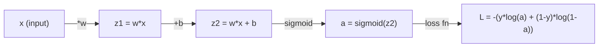
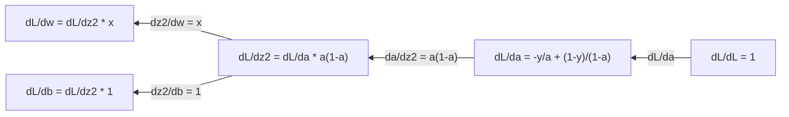
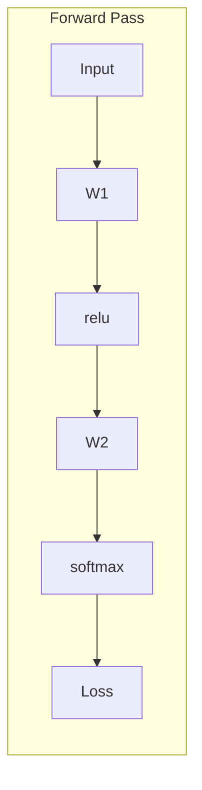
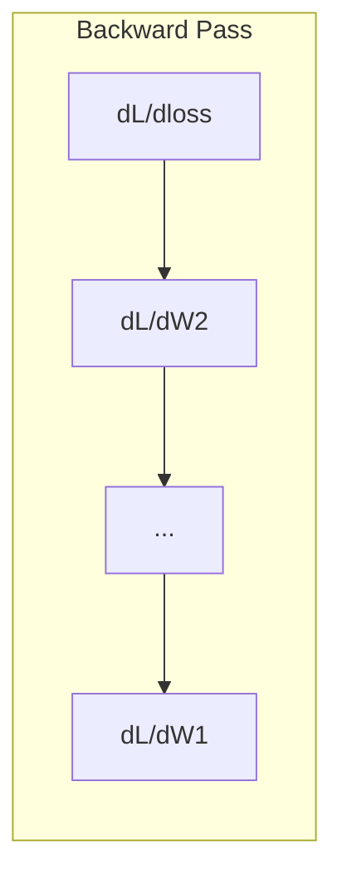

# Calculus for Machine Learning

> The derivative tells you which way is downhill. That's all a neural network needs to learn.

**Type:** Learn
**Languages:** Python
**Prerequisites:** Phase 1, Lessons 01-03
**Time:** ~60 min

## Learning Objectives

- Compute numerical and analytical derivatives of common ML functions (x^2, sigmoid, cross-entropy)
- Implement gradient descent from scratch to minimize a loss function in 1D and 2D
- Derive the gradients of a linear regression model and train it through manual weight updates
- Explain the Hessian matrix, Taylor series approximation, and their connection to optimization methods

## The Problem

You have a neural network with millions of weights. Each weight is a knob. You need to figure out which direction to turn every knob to make the model slightly less wrong. Calculus gives you that direction.

Without calculus, training a neural network means randomly changing things and hoping for improvement. With derivatives, you know exactly how each weight affects the error. You can turn every knob the right way, every time.

## The Concept

### What Is a Derivative?

A derivative measures the rate of change. For a function y = f(x), the derivative f'(x) tells you: if you nudge x a tiny bit, how much does y change?

Geometrically, the derivative is the slope of the tangent line at a point.

**f(x) = x^2:**

| x | f(x) | f'(x) (slope) |
|---|------|---------------|
| 0 | 0    | 0 (flat, at the bottom) |
| 1 | 1    | 2 |
| 2 | 4    | 4 (slope of tangent at this point) |
| 3 | 9    | 6 |

At x=2, the slope is 4. If you move x slightly to the right, y increases by about 4 times that movement. At x=0, the slope is 0. You're at the bottom of the bowl.

Formal definition:

```
f'(x) = lim   f(x + h) - f(x)
        h->0  -----------------
                     h
```

In code, you skip the limit and use a very small h. This is the numerical derivative.

### Partial Derivatives: One Variable at a Time

Real functions have many inputs. A neural network's loss depends on thousands of weights. The partial derivative holds all variables fixed except one, then differentiates with respect to that one.

```
f(x, y) = x^2 + 3xy + y^2

df/dx = 2x + 3y     (treat y as a constant)
df/dy = 3x + 2y     (treat x as a constant)
```

Each partial derivative answers: if I nudge just this one weight, how does the loss change?

### Gradient: The Vector of All Partial Derivatives

The gradient collects every partial derivative into a vector. For f(x, y, z), the gradient is:

```
grad f = [ df/dx, df/dy, df/dz ]
```

The gradient points in the direction of steepest ascent. To minimize a function, go the opposite way.

**Contour plot of f(x,y) = x^2 + y^2:**

This function forms a bowl with concentric circular contours. Minimum at (0, 0).

| Point | grad f | -grad f (descent direction) |
|-------|--------|----------------------------|
| (1, 1) | [2, 2] (points uphill, away from minimum) | [-2, -2] (points downhill, toward minimum) |
| (0, 0) | [0, 0] (flat, at minimum) | [0, 0] |

Gradient descent in one picture. Compute gradient, negate it, take a step.

### Connection to Optimization

Training a neural network is optimization. You have a loss function L(w1, w2, ..., wn) that measures how wrong the model is. You want to minimize it.

```
Gradient descent update rule:

  w_new = w_old - learning_rate * dL/dw

For every weight:
  1. Compute the partial derivative of loss with respect to that weight
  2. Subtract a small multiple of it from the weight
  3. Repeat
```

The learning rate controls step size. Too large and you overshoot. Too small and you crawl.

**Loss surface (1D slice):**

As weight w varies, the loss function L(w) forms a curve with peaks and valleys.

| Feature | Description |
|---------|-------------|
| Global minimum | Lowest point on the entire curve — the optimal solution |
| Local minimum | A valley lower than nearby points but not the global lowest |
| Slope | Gradient descent walks downhill from any starting point |

Gradient descent walks downhill. It might get stuck in local minima, but in high dimensions (millions of weights) this is rarely a problem in practice.

### Numerical vs Analytical Derivatives

There are two ways to compute a derivative.

Analytical: apply calculus rules by hand. For f(x) = x^2, the derivative is f'(x) = 2x. Exact. Fast.

Numerical: approximate using the definition. Evaluate f(x+h) and f(x-h) for a very small h and use the difference.

```
Numerical (central difference):

f'(x) ~= f(x + h) - f(x - h)
          -----------------------
                  2h

h = 0.0001 works well in practice
```

Numerical derivatives are slower but work for any function. Analytical derivatives are fast but require deriving formulas yourself. Neural network frameworks use a third approach: automatic differentiation, which mechanically computes exact derivatives. You'll see that in Phase 3.

### Derivatives of Common Functions

These are the derivatives you'll see over and over in ML.

```
Function        Derivative       Used in
--------        ----------       -------
f(x) = x^2     f'(x) = 2x      Loss functions (MSE)
f(x) = wx + b  f'(w) = x        Linear layer (gradient w.r.t. weight)
                f'(b) = 1        Linear layer (gradient w.r.t. bias)
                f'(x) = w        Linear layer (gradient w.r.t. input)
f(x) = e^x     f'(x) = e^x     Softmax, attention
f(x) = ln(x)   f'(x) = 1/x     Cross-entropy loss
f(x) = 1/(1+e^-x)  f'(x) = f(x)(1-f(x))   Sigmoid activation
```

For f(x) = x^2:

```
f(x) = x^2    f'(x) = 2x

  x    f(x)   f'(x)   meaning
  -2    4      -4      slope tilts left (decreasing)
  -1    1      -2      slope tilts left (decreasing)
   0    0       0      flat (minimum!)
   1    1       2      slope tilts right (increasing)
   2    4       4      slope tilts right (increasing)
```

For f(w) = wx + b, with x=3, b=1:

```
f(w) = 3w + 1    f'(w) = 3

The derivative with respect to w is just x.
If x is big, a small change in w causes a big change in output.
```

### Chain Rule

When functions are composed together, the chain rule tells you how to differentiate.

```
If y = f(g(x)), then dy/dx = f'(g(x)) * g'(x)

Example: y = (3x + 1)^2
  outer: f(u) = u^2       f'(u) = 2u
  inner: g(x) = 3x + 1    g'(x) = 3
  dy/dx = 2(3x + 1) * 3 = 6(3x + 1)
```

A neural network is a chain of functions: input -> linear -> activation -> linear -> activation -> loss. Backpropagation is the chain rule applied repeatedly from output to input. That's the entire algorithm.

### The Hessian Matrix

The gradient tells you slope. The Hessian tells you curvature.

The Hessian is the matrix of second-order partial derivatives. For f(x1, x2, ..., xn), entry (i, j) of the Hessian is:

```
H[i][j] = d^2f / (dx_i * dx_j)
```

For a two-variable function f(x, y):

```
H = | d^2f/dx^2    d^2f/dxdy |
    | d^2f/dydx    d^2f/dy^2 |
```

**What the Hessian tells you at critical points (where gradient = 0):**

| Hessian property | Meaning | Surface shape |
|-----------------|---------|-----------------|
| Positive definite (all eigenvalues > 0) | Local minimum | Bowl facing up |
| Negative definite (all eigenvalues < 0) | Local maximum | Bowl facing down |
| Indefinite (mixed eigenvalue signs) | Saddle point | Saddle shape |

**Example:** f(x, y) = x^2 - y^2 (a saddle function)

```
df/dx = 2x       df/dy = -2y
d^2f/dx^2 = 2    d^2f/dy^2 = -2    d^2f/dxdy = 0

H = | 2   0 |
    | 0  -2 |

Eigenvalues: 2 and -2 (one positive, one negative)
--> Saddle point at (0, 0)
```

Compare with f(x, y) = x^2 + y^2 (a bowl):

```
H = | 2  0 |
    | 0  2 |

Eigenvalues: 2 and 2 (both positive)
--> Local minimum at (0, 0)
```

**Why the Hessian matters in ML:**

Newton's method uses the Hessian to take better optimization steps. Instead of just following the slope, it accounts for curvature:

```
Newton's update:    w_new = w_old - H^(-1) * gradient
Gradient descent:   w_new = w_old - lr * gradient
```

Newton's method converges faster because the Hessian "rescales" the gradient — taking small steps in steep directions and large steps in flat directions.

The cost: for a neural network with N parameters, the Hessian is N x N. A million-parameter model would need a matrix with a trillion entries. This is why we use approximations.

| Method | What it uses | Cost | Convergence |
|--------|-------------|------|-------------|
| Gradient descent | First derivatives only | O(N) per step | Slow (linear) |
| Newton's method | Full Hessian | O(N^3) per step | Fast (quadratic) |
| L-BFGS | Approximate Hessian from gradient history | O(N) per step | Medium (superlinear) |
| Adam | Per-parameter adaptive learning rate (diagonal Hessian approximation) | O(N) per step | Medium |
| Natural gradient | Fisher information matrix (statistical Hessian) | O(N^2) per step | Fast |

In practice, Adam is the default optimizer for deep learning. It cheaply approximates second-order information by tracking running mean and variance of each parameter's gradient.

### Taylor Series Approximation

Any smooth function can be locally approximated by a polynomial:

```
f(x + h) = f(x) + f'(x)*h + (1/2)*f''(x)*h^2 + (1/6)*f'''(x)*h^3 + ...
```

The more terms you include, the better the approximation — but only near point x.

**Why Taylor series matters for ML:**

- **First-order Taylor = gradient descent.** When you use f(x + h) ~ f(x) + f'(x)*h, you're making a linear approximation. Gradient descent minimizes this linear model, choosing h = -lr * f'(x).

- **Second-order Taylor = Newton's method.** Using f(x + h) ~ f(x) + f'(x)*h + (1/2)*f''(x)*h^2 gives a quadratic model. Minimizing it yields h = -f'(x)/f''(x) — the Newton step.

- **Loss function design.** MSE and cross-entropy are smooth, meaning their Taylor expansions are well-behaved. This isn't a coincidence. Smooth losses make optimization predictable.

```
Approximation order    What it captures    Optimization method
-------------------    -----------------   -------------------
0th order (constant)   Just the value      Random search
1st order (linear)     Slope               Gradient descent
2nd order (quadratic)  Curvature           Newton's method
Higher orders          Finer structure     Rarely used in ML
```

Key insight: all gradient-based optimization is fundamentally about locally approximating the loss function, then stepping toward the minimum of that approximation.

### Integration in ML

Derivatives tell you rates of change. Integrals compute accumulations — area under curves.

In ML, you rarely compute integrals by hand, but the concept is everywhere:

**Probability.** For a continuous random variable with density p(x):
```
P(a < X < b) = integral from a to b of p(x) dx
```
The area under the density curve between a and b is the probability of falling in that interval.

**Expected value.** The probability-weighted average outcome:
```
E[f(X)] = integral of f(x) * p(x) dx
```
Expected loss over a data distribution is an integral. Training minimizes its empirical approximation.

**KL divergence.** Measures how different two distributions are:
```
KL(p || q) = integral of p(x) * log(p(x) / q(x)) dx
```
Used in VAEs, knowledge distillation, and Bayesian inference.

**Normalization constants.** In Bayesian inference:
```
p(w | data) = p(data | w) * p(w) / integral of p(data | w) * p(w) dw
```
The denominator is an integral over all possible parameter values. It's often intractable, so we use approximations like MCMC and variational inference.

| Integration concept | Where it appears in ML |
|-----------------|----------------------|
| Area under curve | Probabilities from density functions |
| Expected value | Loss functions, risk minimization |
| KL divergence | VAEs, policy optimization, distillation |
| Normalization | Bayesian posteriors, softmax denominator |
| Marginal likelihood | Model comparison, evidence lower bound (ELBO) |

### Multivariable Chain Rule in Computation Graphs

The chain rule doesn't just apply to scalar functions in a straight line. In neural networks, variables branch and merge. Here's how derivatives flow through a simple forward pass:



Backpropagation computes gradients from right to left:



Each arrow multiplies by the local derivative. The gradient of any parameter is the product of all local derivatives along the path from loss to that parameter. When paths branch and merge, you sum contributions (multivariable chain rule).

Backpropagation is just this: systematically applying the chain rule from output to input through the computation graph.

### The Jacobian Matrix

When a function maps vectors to vectors (like a neural network layer), its derivative is a matrix. The Jacobian contains all partial derivatives of every output with respect to every input.

For f: R^n -> R^m, the Jacobian J is an m x n matrix:

| | x1 | x2 | ... | xn |
|---|---|---|---|---|
| f1 | df1/dx1 | df1/dx2 | ... | df1/dxn |
| f2 | df2/dx1 | df2/dx2 | ... | df2/dxn |
| ... | ... | ... | ... | ... |
| fm | dfm/dx1 | dfm/dx2 | ... | dfm/dxn |

You don't compute Jacobians by hand for neural networks. PyTorch does it for you. But knowing it exists helps you understand shapes in backpropagation: if a layer maps R^n to R^m, its Jacobian is m x n. Gradients flow back through the transpose of this matrix.

### Why This Matters for Neural Networks

Every weight in a neural network gets a gradient. The gradient tells you how to adjust that weight to reduce the loss.





Each weight update:
- `W1 = W1 - lr * dL/dW1`
- `W2 = W2 - lr * dL/dW2`

The forward pass computes predictions and loss. The backward pass computes gradients of loss with respect to every weight. Then each weight takes a small step downhill. Repeat millions of times. That's deep learning.

## Build It

### Step 1: Numerical Derivative from Scratch

```python
def numerical_derivative(f, x, h=1e-7):
    return (f(x + h) - f(x - h)) / (2 * h)

def f(x):
    return x ** 2

for x in [-2, -1, 0, 1, 2]:
    numerical = numerical_derivative(f, x)
    analytical = 2 * x
    print(f"x={x:2d}  f'(x) numerical={numerical:.6f}  analytical={analytical:.1f}")
```

Numerical and analytical derivatives agree to several decimal places.

### Step 2: Partial Derivatives and Gradient

```python
def numerical_gradient(f, point, h=1e-7):
    gradient = []
    for i in range(len(point)):
        point_plus = list(point)
        point_minus = list(point)
        point_plus[i] += h
        point_minus[i] -= h
        partial = (f(point_plus) - f(point_minus)) / (2 * h)
        gradient.append(partial)
    return gradient

def f_multi(point):
    x, y = point
    return x**2 + 3*x*y + y**2

grad = numerical_gradient(f_multi, [1.0, 2.0])
print(f"Numerical gradient at (1,2): {[f'{g:.4f}' for g in grad]}")
print(f"Analytical gradient at (1,2): [2*1+3*2, 3*1+2*2] = [{2*1+3*2}, {3*1+2*2}]")
```

### Step 3: Gradient Descent on f(x) = x^2

```python
x = 5.0
lr = 0.1
for step in range(20):
    grad = 2 * x
    x = x - lr * grad
    print(f"step {step:2d}  x={x:8.4f}  f(x)={x**2:10.6f}")
```

Starting from x=5, each step moves closer to x=0 (the minimum).

### Step 4: Gradient Descent on a 2D Function

```python
def f_2d(point):
    x, y = point
    return x**2 + y**2

point = [4.0, 3.0]
lr = 0.1
for step in range(30):
    grad = numerical_gradient(f_2d, point)
    point = [p - lr * g for p, g in zip(point, grad)]
    loss = f_2d(point)
    if step % 5 == 0 or step == 29:
        print(f"step {step:2d}  point=({point[0]:7.4f}, {point[1]:7.4f})  f={loss:.6f}")
```

### Step 5: Comparing Numerical and Analytical Derivatives

```python
import math

test_functions = [
    ("x^2",      lambda x: x**2,          lambda x: 2*x),
    ("x^3",      lambda x: x**3,          lambda x: 3*x**2),
    ("sin(x)",   lambda x: math.sin(x),   lambda x: math.cos(x)),
    ("e^x",      lambda x: math.exp(x),   lambda x: math.exp(x)),
    ("1/x",      lambda x: 1/x,           lambda x: -1/x**2),
]

x = 2.0
print(f"{'Function':<12} {'Numerical':>12} {'Analytical':>12} {'Error':>12}")
print("-" * 50)
for name, f, df in test_functions:
    num = numerical_derivative(f, x)
    ana = df(x)
    err = abs(num - ana)
    print(f"{name:<12} {num:12.6f} {ana:12.6f} {err:12.2e}")
```

### Step 6: Computing the Hessian Numerically

```python
def hessian_2d(f, x, y, h=1e-5):
    fxx = (f(x + h, y) - 2 * f(x, y) + f(x - h, y)) / (h ** 2)
    fyy = (f(x, y + h) - 2 * f(x, y) + f(x, y - h)) / (h ** 2)
    fxy = (f(x + h, y + h) - f(x + h, y - h) - f(x - h, y + h) + f(x - h, y - h)) / (4 * h ** 2)
    return [[fxx, fxy], [fxy, fyy]]

def saddle(x, y):
    return x ** 2 - y ** 2

def bowl(x, y):
    return x ** 2 + y ** 2

H_saddle = hessian_2d(saddle, 0.0, 0.0)
H_bowl = hessian_2d(bowl, 0.0, 0.0)
print(f"Saddle Hessian: {H_saddle}")  # [[2, 0], [0, -2]] -- mixed signs
print(f"Bowl Hessian:   {H_bowl}")    # [[2, 0], [0, 2]]  -- both positive
```

The saddle Hessian has eigenvalues 2 and -2 (mixed signs, confirming saddle point). The bowl has eigenvalues 2 and 2 (both positive, confirming minimum).

### Step 7: Taylor Approximation in Practice

```python
import math

def taylor_approx(f, f_prime, f_double_prime, x0, h, order=2):
    result = f(x0)
    if order >= 1:
        result += f_prime(x0) * h
    if order >= 2:
        result += 0.5 * f_double_prime(x0) * h ** 2
    return result

x0 = 0.0
for h in [0.1, 0.5, 1.0, 2.0]:
    true_val = math.sin(h)
    t1 = taylor_approx(math.sin, math.cos, lambda x: -math.sin(x), x0, h, order=1)
    t2 = taylor_approx(math.sin, math.cos, lambda x: -math.sin(x), x0, h, order=2)
    print(f"h={h:.1f}  sin(h)={true_val:.4f}  order1={t1:.4f}  order2={t2:.4f}")
```

Near x0=0, sin(x) ~ x (first-order Taylor). The approximation is excellent for small h but breaks down for large h. This is why gradient descent works best with small learning rates — each step assumes the linear approximation holds.

### Step 8: Why This Matters for Neural Networks

```python
import random

random.seed(42)

w = random.gauss(0, 1)
b = random.gauss(0, 1)
lr = 0.01

xs = [1.0, 2.0, 3.0, 4.0, 5.0]
ys = [3.0, 5.0, 7.0, 9.0, 11.0]

for epoch in range(200):
    total_loss = 0
    dw = 0
    db = 0
    for x, y in zip(xs, ys):
        pred = w * x + b
        error = pred - y
        total_loss += error ** 2
        dw += 2 * error * x
        db += 2 * error
    dw /= len(xs)
    db /= len(xs)
    total_loss /= len(xs)
    w -= lr * dw
    b -= lr * db
    if epoch % 40 == 0 or epoch == 199:
        print(f"epoch {epoch:3d}  w={w:.4f}  b={b:.4f}  loss={total_loss:.6f}")

print(f"\nLearned: y = {w:.2f}x + {b:.2f}")
print(f"Actual:  y = 2x + 1")
```

Every gradient-based training loop follows this pattern: predict, compute loss, compute gradients, update weights.

## Use It

With NumPy, the same operations are faster and cleaner:

```python
import numpy as np

x = np.array([1, 2, 3, 4, 5], dtype=float)
y = np.array([3, 5, 7, 9, 11], dtype=float)

w, b = np.random.randn(), np.random.randn()
lr = 0.01

for epoch in range(200):
    pred = w * x + b
    error = pred - y
    loss = np.mean(error ** 2)
    dw = np.mean(2 * error * x)
    db = np.mean(2 * error)
    w -= lr * dw
    b -= lr * db

print(f"Learned: y = {w:.2f}x + {b:.2f}")
```

You just built gradient descent from scratch. PyTorch automates gradient computation, but the update loop is identical.

## Exercises

1. Implement `numerical_second_derivative(f, x)` by calling `numerical_derivative` twice. Verify the second derivative of x^3 at x=2 is 12.
2. Use gradient descent to find the minimum of f(x, y) = (x - 3)^2 + (y + 1)^2. Start from (0, 0). The answer should converge to (3, -1).
3. Add momentum to the gradient descent loop: maintain a velocity vector that accumulates past gradients. Compare convergence speed with and without momentum on f(x) = x^4 - 3x^2.

## Key Terms

| Term | What people say | What it actually means |
|------|----------------|----------------------|
| Derivative | "Slope" | The rate of change of a function at a point. Tells you how much output changes per unit change in input. |
| Partial derivative | "Derivative with respect to one variable" | Differentiating with respect to one variable while holding all others fixed. |
| Gradient | "Steepest ascent direction" | The vector of all partial derivatives. Points in the direction that increases the function fastest. |
| Gradient descent | "Walk downhill" | Subtract the gradient (times learning rate) from parameters to reduce loss. The core of neural network training. |
| Learning rate | "Step size" | Scalar controlling how large each gradient descent step is. Too big: diverge. Too small: slow convergence. |
| Chain rule | "Multiply derivatives together" | Rule for differentiating composed functions: df/dx = df/dg * dg/dx. The math behind backpropagation. |
| Jacobian | "Derivative matrix" | When a function maps vectors to vectors, the Jacobian is the matrix of all output-to-input partial derivatives. |
| Numerical derivative | "Finite difference" | Approximating a derivative by evaluating at two nearby points and computing the slope between them. |
| Backpropagation | "Reverse-mode autodiff" | Computing gradients layer by layer from output to input using the chain rule. How neural networks learn. |
| Hessian | "Second derivative matrix" | The matrix of all second-order partial derivatives. Describes curvature. Positive definite at a critical point means local minimum. |
| Taylor series | "Polynomial approximation" | Approximating a function near a point using its derivatives: f(x+h) ~ f(x) + f'(x)h + (1/2)f''(x)h^2 + .... Foundation for understanding why gradient descent and Newton's method work. |
| Integral | "Area under curve" | Accumulation of a quantity over an interval. In ML, integrals define probabilities, expected values, and KL divergence. |

## Further Reading

- [3Blue1Brown: Essence of Calculus](https://www.3blue1brown.com/topics/calculus) - Visual intuition for derivatives, integrals, and the chain rule
- [Stanford CS231n: Backpropagation](https://cs231n.github.io/optimization-2/) - How gradients flow through neural network layers
