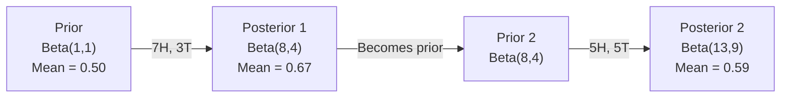

# Bayes' Theorem

> Probability is about what you expect. Bayes' theorem is about what you learn.

**Type:** Build
**Languages:** Python
**Prerequisites:** Phase 1, Lesson 06 (Probability Fundamentals)
**Time:** ~75 minutes

## Learning Objectives

- Apply Bayes' theorem to compute posterior probabilities from priors, likelihoods, and evidence
- Build a Naive Bayes text classifier from scratch with Laplace smoothing and log-space computation
- Compare MLE and MAP estimation, explain how MAP corresponds to L2 regularization
- Implement sequential Bayesian updating for A/B testing using Beta-Binomial conjugate priors

## The Problem

A medical test is 99% accurate. You test positive. What's the probability you actually have the disease?

Most people say 99%. The real answer depends on how rare the disease is. If one in ten thousand people have it, then a positive result gives you only about a 1% chance of being sick. The other 99% of positives are false alarms from healthy people.

This isn't a trick question. This is Bayes' theorem. Every spam filter, every medical diagnosis, every ML model that quantifies uncertainty uses this reasoning. You start with a belief. You see evidence. You update.

If you build ML systems without understanding this, you'll misread model outputs, set wrong thresholds, and ship overconfident predictions.

## The Concept

### From Joint Probability to Bayes

You already know from Lesson 06 that conditional probability is:

```
P(A|B) = P(A and B) / P(B)
```

Symmetrically:

```
P(B|A) = P(A and B) / P(A)
```

Both formulas share the same numerator: P(A and B). Set them equal and rearrange:

```
P(A and B) = P(A|B) * P(B) = P(B|A) * P(A)

Therefore:

P(A|B) = P(B|A) * P(A) / P(B)
```

That's Bayes' theorem. Four quantities, one equation.

### The Four Parts

| Part | Name | Meaning |
|------|------|---------------|
| P(A\|B) | Posterior | Your updated belief about A after seeing evidence B |
| P(B\|A) | Likelihood | How probable the evidence B is if A is true |
| P(A) | Prior | Your belief about A before seeing any evidence |
| P(B) | Evidence | The total probability of seeing B under all possibilities |

The evidence term P(B) acts as a normalizer. You can expand it using the law of total probability:

```
P(B) = P(B|A) * P(A) + P(B|not A) * P(not A)
```

### Medical Test Example

A disease affects one in ten thousand people. The test is 99% accurate (catches 99% of sick people, gives false positives 1% of the time).

```
P(sick)          = 0.0001     (prior: disease is rare)
P(positive|sick) = 0.99       (likelihood: test catches it)
P(positive|healthy) = 0.01    (false positive rate)

P(positive) = P(positive|sick) * P(sick) + P(positive|healthy) * P(healthy)
            = 0.99 * 0.0001 + 0.01 * 0.9999
            = 0.000099 + 0.009999
            = 0.010098

P(sick|positive) = P(positive|sick) * P(sick) / P(positive)
                 = 0.99 * 0.0001 / 0.010098
                 = 0.0098
                 = 0.98%
```

Less than 1%. The prior dominates. When a condition is rare, even an accurate test produces mostly false positives. That's why doctors order follow-up tests.

### Spam Filter Example

You receive an email containing the word "lottery." Is it spam?

```
P(spam)                = 0.3      (30% of email is spam)
P("lottery"|spam)      = 0.05     (5% of spam emails contain "lottery")
P("lottery"|not spam)  = 0.001    (0.1% of legitimate emails contain "lottery")

P("lottery") = 0.05 * 0.3 + 0.001 * 0.7
             = 0.015 + 0.0007
             = 0.0157

P(spam|"lottery") = 0.05 * 0.3 / 0.0157
                  = 0.955
                  = 95.5%
```

A single word pushed the probability from 30% to 95.5%. Real spam filters apply Bayes across hundreds of words simultaneously.

### Naive Bayes: The Independence Assumption

Naive Bayes extends this to multiple features by assuming all features are conditionally independent given the class:

```
P(class | feature_1, feature_2, ..., feature_n)
  = P(class) * P(feature_1|class) * P(feature_2|class) * ... * P(feature_n|class)
    / P(feature_1, feature_2, ..., feature_n)
```

"Naive" refers to this independence assumption. In text, word occurrences aren't independent ("New" and "York" are correlated). But the assumption works surprisingly well in practice because the classifier only needs to rank classes, not produce calibrated probabilities.

Since the denominator is the same for all classes, you can skip it and just compare numerators:

```
score(class) = P(class) * product of P(feature_i | class)
```

Pick the class with the highest score.

### Maximum Likelihood Estimation (MLE)

How do you get P(feature|class) from training data? Count.

```
P("free"|spam) = (number of spam emails containing "free") / (total spam emails)
```

This is MLE: choose the parameter values that make the observed data most probable. You're maximizing the likelihood function, which for discrete counts reduces to relative frequencies.

Problem: if a word never appeared in spam during training, MLE gives it zero probability. A single unseen word zeros out the entire product. Fix it with Laplace smoothing:

```
P(word|class) = (count(word, class) + 1) / (total_words_in_class + vocabulary_size)
```

Add 1 to every count, ensuring no probability is ever zero.

### Maximum A Posteriori (MAP)

MLE asks: what parameters maximize P(data|parameters)?

MAP asks: what parameters maximize P(parameters|data)?

By Bayes' theorem:

```
P(parameters|data) proportional to P(data|parameters) * P(parameters)
```

MAP adds a prior over the parameters themselves. If you believe parameters should be small, encode that as a prior that penalizes large values. This is the same thing as L2 regularization in ML. The "ridge" penalty in ridge regression is literally a Gaussian prior on the weights.

| Estimator | Optimizes | ML Equivalent |
|------------|-----------|---------------|
| MLE | P(data\|params) | Training without regularization |
| MAP | P(data\|params) * P(params) | L2 / L1 regularization |

### Bayesian vs Frequentist: The Practical Difference

Frequentists treat parameters as fixed unknowns. They ask: "If I repeated this experiment many times, what would happen?"

Bayesians treat parameters as distributions. They ask: "Given what I observed, what do I believe about the parameters?"

For building ML systems, the practical differences:

| Aspect | Frequentist | Bayesian |
|--------|-------------|----------|
| Output | Point estimates | Distributions over values |
| Uncertainty | Confidence intervals (about the process) | Credible intervals (about parameters) |
| Small data | Can overfit | Prior acts as regularization |
| Computation | Usually faster | Often requires sampling (MCMC) |

Most production ML is frequentist (SGD, point estimates). Bayesian methods shine when you need calibrated uncertainty (medical decisions, safety-critical systems) or when data is scarce (few-shot learning, cold start).

### Why Bayesian Thinking Matters for ML

The connection runs deeper than analogy:

**Priors are regularization.** A Gaussian prior on weights is L2 regularization. A Laplace prior is L1. Every time you add a regularization term, you're making a Bayesian statement about what values you expect parameters to take.

**Posteriors are uncertainty.** A single predicted probability can't tell you how confident the model is in that estimate. Bayesian methods give you a distribution: "I think P(spam) is between 0.8 and 0.95."

**Bayesian updating is online learning.** Today's posterior becomes tomorrow's prior. When your model sees new data, it incrementally updates beliefs rather than retraining from scratch.

**Model comparison is Bayesian.** The Bayesian Information Criterion (BIC), marginal likelihoods, and Bayes factors all use Bayesian reasoning to choose between models without overfitting.

## Build It

### Step 1: Bayes' Theorem Function

```python
def bayes(prior, likelihood, false_positive_rate):
    evidence = likelihood * prior + false_positive_rate * (1 - prior)
    posterior = likelihood * prior / evidence
    return posterior

result = bayes(prior=0.0001, likelihood=0.99, false_positive_rate=0.01)
print(f"P(sick|positive) = {result:.4f}")
```

### Step 2: Naive Bayes Classifier

```python
import math
from collections import defaultdict

class NaiveBayes:
    def __init__(self, smoothing=1.0):
        self.smoothing = smoothing
        self.class_counts = defaultdict(int)
        self.word_counts = defaultdict(lambda: defaultdict(int))
        self.class_word_totals = defaultdict(int)
        self.vocab = set()

    def train(self, documents, labels):
        for doc, label in zip(documents, labels):
            self.class_counts[label] += 1
            words = doc.lower().split()
            for word in words:
                self.word_counts[label][word] += 1
                self.class_word_totals[label] += 1
                self.vocab.add(word)

    def predict(self, document):
        words = document.lower().split()
        total_docs = sum(self.class_counts.values())
        vocab_size = len(self.vocab)
        best_class = None
        best_score = float("-inf")
        for cls in self.class_counts:
            score = math.log(self.class_counts[cls] / total_docs)
            for word in words:
                count = self.word_counts[cls].get(word, 0)
                total = self.class_word_totals[cls]
                score += math.log((count + self.smoothing) / (total + self.smoothing * vocab_size))
            if score > best_score:
                best_score = score
                best_class = cls
        return best_class
```

Log probabilities prevent underflow. Multiplying many small probabilities produces numbers too tiny for floating point. Summing log probabilities is numerically stable and mathematically equivalent.

### Step 3: Train on Spam Data

```python
train_docs = [
    "win free money now",
    "free lottery ticket winner",
    "claim your prize today free",
    "urgent offer free cash",
    "congratulations you won free",
    "meeting tomorrow at noon",
    "project update attached",
    "can we schedule a call",
    "quarterly report review",
    "lunch on thursday sounds good",
    "team standup notes attached",
    "please review the pull request",
]

train_labels = [
    "spam", "spam", "spam", "spam", "spam",
    "ham", "ham", "ham", "ham", "ham", "ham", "ham",
]

classifier = NaiveBayes()
classifier.train(train_docs, train_labels)

test_messages = [
    "free money waiting for you",
    "meeting rescheduled to friday",
    "you won a free prize",
    "please review the attached report",
]

for msg in test_messages:
    print(f"  '{msg}' -> {classifier.predict(msg)}")
```

### Step 4: Inspect Learned Probabilities

```python
def show_top_words(classifier, cls, n=5):
    vocab_size = len(classifier.vocab)
    total = classifier.class_word_totals[cls]
    probs = {}
    for word in classifier.vocab:
        count = classifier.word_counts[cls].get(word, 0)
        probs[word] = (count + classifier.smoothing) / (total + classifier.smoothing * vocab_size)
    sorted_words = sorted(probs.items(), key=lambda x: x[1], reverse=True)
    for word, prob in sorted_words[:n]:
        print(f"    {word}: {prob:.4f}")

print("\nTop spam words:")
show_top_words(classifier, "spam")
print("\nTop ham words:")
show_top_words(classifier, "ham")
```

## Use It

scikit-learn ships production-grade Naive Bayes implementations:

```python
from sklearn.feature_extraction.text import CountVectorizer
from sklearn.naive_bayes import MultinomialNB
from sklearn.metrics import classification_report

vectorizer = CountVectorizer()
X_train = vectorizer.fit_transform(train_docs)
clf = MultinomialNB()
clf.fit(X_train, train_labels)

X_test = vectorizer.transform(test_messages)
predictions = clf.predict(X_test)
for msg, pred in zip(test_messages, predictions):
    print(f"  '{msg}' -> {pred}")
```

Same algorithm. CountVectorizer handles tokenization and vocabulary building. MultinomialNB handles smoothing and log probabilities internally. Your from-scratch version did the same thing in 40 lines.

## Ship It

The NaiveBayes class built here demonstrates the full pipeline: tokenization, probability estimation with Laplace smoothing, log-space prediction. The code in `code/bayes.py` runs end-to-end with no dependencies beyond the Python standard library.

### Conjugate Priors

When the prior and posterior belong to the same distribution family, the prior is called "conjugate." This makes Bayesian updating algebraically clean — you get a closed-form posterior without numerical integration.

| Likelihood | Conjugate Prior | Posterior | Example |
|-----------|----------------|-----------|---------|
| Bernoulli | Beta(a, b) | Beta(a + successes, b + failures) | Estimating coin bias |
| Normal (known variance) | Normal(mu_0, sigma_0) | Normal(weighted mean, smaller variance) | Sensor calibration |
| Poisson | Gamma(a, b) | Gamma(a + sum of counts, b + n) | Modeling arrival rates |
| Multinomial | Dirichlet(alpha) | Dirichlet(alpha + counts) | Topic modeling, language models |

Why it matters: without conjugate priors, you need Monte Carlo sampling or variational inference to approximate the posterior. With conjugate priors, you just update two numbers.

The Beta distribution is the most common conjugate prior in practice. Beta(a, b) represents your belief about a probability parameter. The mean is a/(a+b). The larger a+b, the more concentrated (confident) the distribution.

Special cases of Beta priors:
- Beta(1, 1) = Uniform. You have no opinion about the parameter.
- Beta(10, 10) = Peaked at 0.5. You strongly believe the parameter is near 0.5.
- Beta(1, 10) = Skewed toward 0. You believe the parameter is small.

The update rule is dead simple:

```
Prior:     Beta(a, b)
Data:      s successes, f failures
Posterior: Beta(a + s, b + f)
```

No integration. No sampling. Just addition.

### Sequential Bayesian Updating

Bayesian inference is inherently sequential. Today's posterior becomes tomorrow's prior. This is how real systems learn incrementally without reprocessing all historical data.

Concrete example: estimating whether a coin is fair.

**Day 1: No data yet.**
Start with Beta(1, 1) — a uniform prior. You have no opinion.
- Prior mean: 0.5
- Prior is flat over [0, 1]

**Day 2: Observe 7 heads, 3 tails.**
Posterior = Beta(1 + 7, 1 + 3) = Beta(8, 4)
- Posterior mean: 8/12 = 0.667
- Evidence suggests the coin is biased toward heads

**Day 3: Observe 5 more heads, 5 more tails.**
Use yesterday's posterior as today's prior.
Posterior = Beta(8 + 5, 4 + 5) = Beta(13, 9)
- Posterior mean: 13/22 = 0.591
- Balanced new data pulls the estimate back toward 0.5



The order of observations doesn't matter. Updating Beta(1,1) with all 12 heads and 8 tails at once gives Beta(13, 9) — the same result. Sequential updating and batch updating are mathematically equivalent. But sequential updating lets you make decisions at each step without storing raw data.

This is the foundation of online learning in production ML systems. Thompson sampling for bandits, incremental recommender systems, streaming anomaly detectors — all use this pattern.

### Connection to A/B Testing

A/B testing is Bayesian inference in disguise.

Setup: you're testing two button colors. Variant A (blue) and Variant B (green). You want to know which gets more clicks.

Bayesian A/B testing:

1. **Prior.** Both variants start at Beta(1, 1). No preconceived preference.
2. **Data.** Variant A: 50 clicks in 1000 views. Variant B: 65 clicks in 1000 views.
3. **Posterior.**
   - A: Beta(1 + 50, 1 + 950) = Beta(51, 951). Mean = 0.051
   - B: Beta(1 + 65, 1 + 935) = Beta(66, 936). Mean = 0.066
4. **Decision.** Compute P(B > A) — the probability that B's true conversion rate exceeds A's.

Computing P(B > A) analytically is hard. But Monte Carlo makes it trivial:

```
1. Draw 100,000 samples from Beta(51, 951)  -> samples_A
2. Draw 100,000 samples from Beta(66, 936)  -> samples_B
3. P(B > A) = fraction of samples where B > A
```

If P(B > A) > 0.95, ship Variant B. If between 0.05 and 0.95, keep collecting data. If P(B > A) < 0.05, ship Variant A.

Advantages over frequentist A/B testing:
- You get a direct probability statement: "There's a 97% chance B is better"
- No p-value confusion. No "failed to reject the null hypothesis" hedging.
- You can check results at any time without inflating false positive rates (no "peeking problem")
- You can incorporate prior knowledge (e.g., previous tests suggest conversion rates are typically 3-8%)

| Aspect | Frequentist A/B | Bayesian A/B |
|--------|----------------|--------------|
| Output | p-value | P(B > A) |
| Interpretation | "How surprising is this data if A=B?" | "How likely is it that B beats A?" |
| Early stopping | Inflates false positives | Safe at any point (given proper priors and model specification) |
| Prior knowledge | Not used | Encoded as Beta prior |
| Decision rule | p < 0.05 | P(B > A) > threshold |

## Exercises

1. **Multiple tests.** A patient tests positive on two independent tests (both 99% accurate, prevalence 1 in 10,000). What is P(sick) after two tests? Use the posterior from the first test as the prior for the second.

2. **Smoothing impact.** Run the spam classifier with smoothing values of 0.01, 0.1, 1.0, and 10.0. How do the top word probabilities change? What happens when smoothing=0 and a word appears only in ham?

3. **Add a feature.** Extend the NaiveBayes class to use message length (short/long) as a feature alongside word counts. Estimate P(short|spam) and P(short|ham) from training data and fold it into the prediction score.

4. **MAP by hand.** Given observed data (7 heads in 10 coin flips), compute the MAP estimate of the bias using a Beta(2,2) prior. Compare it with the MLE estimate (7/10).

## Key Terms

| Term | What people say | What it actually means |
|------|----------------|----------------------|
| Prior | "My initial guess" | P(hypothesis) before observing evidence. In ML: the regularization term. |
| Likelihood | "How well the data fits" | P(evidence\|hypothesis). How probable the observed data is under a specific hypothesis. |
| Posterior | "My updated belief" | P(hypothesis\|evidence). Prior times likelihood, normalized. |
| Evidence | "The normalizing constant" | P(data) summed over all hypotheses. Ensures the posterior sums to 1. |
| Naive Bayes | "That simple text classifier" | A classifier that assumes features are independent given the class. Works well despite the assumption being wrong. |
| Laplace smoothing | "Add-one smoothing" | Adding a small count to every feature to prevent zero probabilities from unseen data. |
| MLE | "Just use the frequencies" | Choose parameters that maximize P(data\|parameters). No prior. Can overfit on small data. |
| MAP | "MLE with a prior" | Choose parameters that maximize P(data\|parameters) * P(parameters). Equivalent to MLE with regularization. |
| Log probability | "Work in log space" | Use log(P) instead of P to avoid floating-point underflow when multiplying many small numbers. |
| False positive | "A false alarm" | The test says positive but the true state is negative. The root of base-rate fallacy. |

## Further Reading

- [3Blue1Brown: Bayes' theorem](https://www.youtube.com/watch?v=HZGCoVF3YvM) - Visual explanation using the medical test example
- [Stanford CS229: Generative Learning Algorithms](https://cs229.stanford.edu/notes2022fall/cs229-notes2.pdf) - Naive Bayes and its connection to discriminative models
- [Think Bayes](https://greenteapress.com/wp/think-bayes/) - Free book on Bayesian statistics with Python code
- [scikit-learn Naive Bayes](https://scikit-learn.org/stable/modules/naive_bayes.html) - Production implementations and when to use each variant
