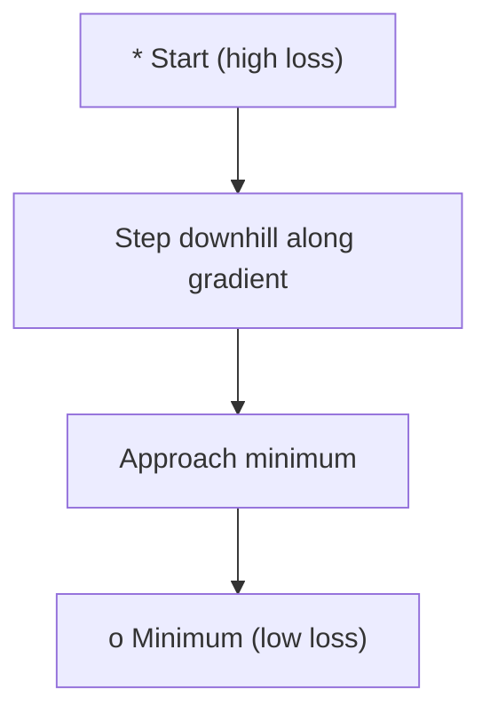
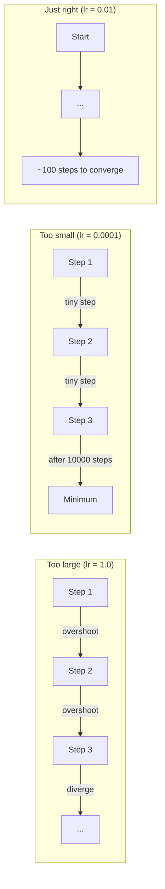
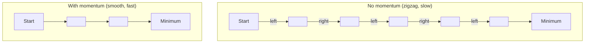
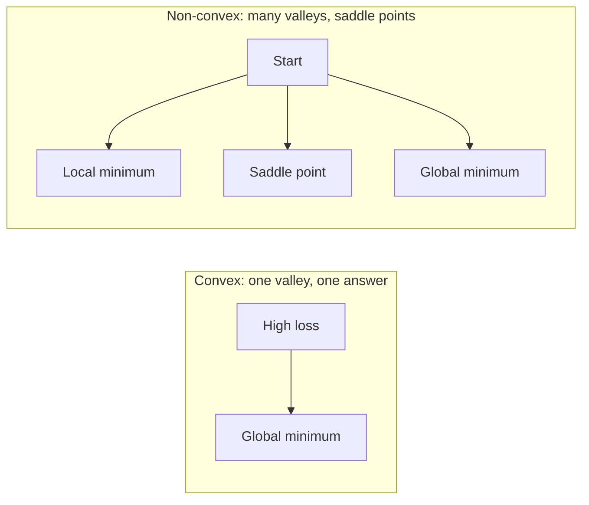
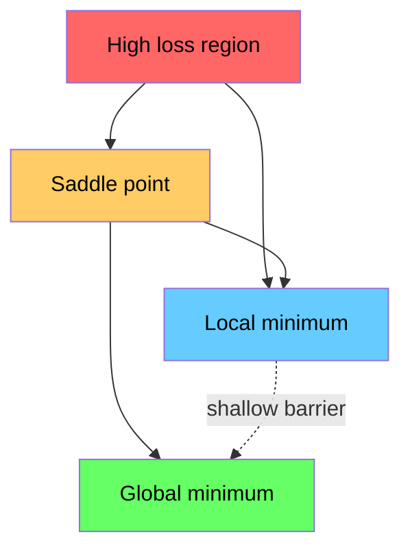

# Optimization

> Training a neural network is just finding the bottom of a valley.

**Type:** Build
**Languages:** Python
**Prerequisites:** Phase 1, Lessons 04-05 (derivatives, gradients)
**Time:** ~75 minutes

## Learning Objectives

- Implement vanilla gradient descent, SGD with momentum, and Adam from scratch
- Compare optimizer convergence on the Rosenbrock function and explain why Adam adapts the learning rate per weight
- Distinguish convex and non-convex loss surfaces and explain the role of saddle points in high dimensions
- Configure learning rate schedules (step decay, cosine annealing, warmup) for stable training

## The Problem

You have a loss function. It tells you how wrong your model is. You have gradients. They tell you which direction makes the loss worse. Now you need a strategy for walking downhill.

The naive approach is simple: step opposite to the gradient. Multiply by a number called the learning rate. Repeat. This is gradient descent, and it works. But "works" comes with caveats. Learning rate too large and you overshoot the valley, bouncing between walls. Too small and you crawl toward the answer over thousands of unnecessary steps. Hit a saddle point and you stall before reaching the minimum.

Every optimizer in deep learning answers the same question: how do you reach the bottom faster and more reliably?

## The Concept

### What optimization means

Optimization finds the input values that minimize (or maximize) a function. In machine learning, that function is the loss. The inputs are the model's weights. Training is optimization.

```
minimize L(w) where:
  L = loss function
  w = model weights (could be millions of parameters)
```

### Gradient descent (vanilla)

The simplest optimizer. Compute the gradient of the loss with respect to each weight. Move each weight opposite to its gradient. Scale by the learning rate.

```
w = w - lr * gradient
```

The entire algorithm. One line.



### Learning rate: the most important hyperparameter

The learning rate controls step size. It determines everything about convergence.



No formula gives you the right learning rate. You find it by experiment. Common starting points: 0.001 for Adam, 0.01 for SGD with momentum.

### SGD vs batch vs mini-batch

Vanilla gradient descent computes the gradient over the entire dataset before taking a step. This is batch gradient descent. Stable but slow.

Stochastic gradient descent (SGD) computes the gradient on a single random sample and steps immediately. Noisy but fast.

Mini-batch gradient descent is the compromise. Compute the gradient on a small batch (32, 64, 128, 256 samples), then step. This is what everyone actually uses.

| Variant | Batch size | Gradient quality | Speed per step | Noise |
|---------|-----------|-----------------|---------------|-------|
| Batch GD | Entire dataset | Exact | Slow | None |
| SGD | 1 sample | Very noisy | Fast | High |
| Mini-batch | 32-256 | Good estimate | Balanced | Moderate |

The noise in SGD and mini-batch is not a bug. It helps escape shallow local minima and saddle points.

### Momentum: a ball rolling downhill

Vanilla gradient descent only looks at the current gradient. If the gradient zigzags (common in narrow valleys), progress is slow. Momentum fixes this by accumulating past gradients into a velocity term.

```
v = beta * v + gradient
w = w - lr * v
```

Analogy: a ball rolling downhill. It does not stop and restart at every bump. It builds speed in consistent directions and dampens oscillation.



`beta` (typically 0.9) controls how much history to retain. Higher beta means more momentum, smoother paths, but slower response to direction changes.

### Adam: adaptive learning rates

Different weights need different learning rates. A weight that rarely gets large gradients should take a bigger step when it finally does. A weight that consistently gets huge gradients should take smaller steps.

Adam (Adaptive Moment Estimation) tracks two things per weight:

1. First moment (m): running average of gradients (like momentum)
2. Second moment (v): running average of squared gradients (gradient magnitude)

```
m = beta1 * m + (1 - beta1) * gradient
v = beta2 * v + (1 - beta2) * gradient^2

m_hat = m / (1 - beta1^t)    bias correction
v_hat = v / (1 - beta2^t)    bias correction

w = w - lr * m_hat / (sqrt(v_hat) + epsilon)
```

Dividing by `sqrt(v_hat)` is the key insight. Weights with large gradients get divided by a large number (effective step is small). Weights with small gradients get divided by a small number (effective step is large). Each weight gets its own adaptive learning rate.

Default hyperparameters: `lr=0.001, beta1=0.9, beta2=0.999, epsilon=1e-8`. These defaults work well for most problems.

### Learning rate schedules

A fixed learning rate is a compromise. Early in training, you want large steps for fast progress. Late in training, you want small steps to fine-tune around the minimum.

Common schedules:

| Schedule | Formula | Use case |
|----------|---------|----------|
| Step decay | lr = lr * factor every N epochs | Simple, manual control |
| Exponential decay | lr = lr_0 * decay^t | Smooth decrease |
| Cosine annealing | lr = lr_min + 0.5 * (lr_max - lr_min) * (1 + cos(pi * t / T)) | Transformers, modern training |
| Warmup + decay | Linear ramp-up, then decay | Large models, prevents early instability |

### Convex vs non-convex

A convex function has only one minimum. Gradient descent always finds it. Quadratics like `f(x) = x^2` are convex.

Neural network loss functions are non-convex. They have many local minima, saddle points, and flat regions.



In practice, local minima are rarely a problem in high-dimensional neural networks. Most local minima have loss values close to the global minimum. Saddle points (flat in some directions, curved in others) are the real obstacle. Momentum and mini-batch noise help escape them.

### Loss surface visualization

Loss is a function of all weights. For a model with 1 million weights, the loss surface lives in 1,000,001-dimensional space. To visualize it: pick two random directions in weight space, plot loss along those two directions, and get a 2D surface.



Sharp minima generalize poorly. Flat minima generalize well. This is one reason SGD with momentum often beats Adam in final test accuracy: its noise prevents settling into sharp minima.

## Build It

### Step 1: Define a test function

The Rosenbrock function is a classic optimization benchmark. Its minimum is at (1, 1), inside a narrow curved valley — easy to find, hard to follow.

```
f(x, y) = (1 - x)^2 + 100 * (y - x^2)^2
```

```python
def rosenbrock(params):
    x, y = params
    return (1 - x) ** 2 + 100 * (y - x ** 2) ** 2

def rosenbrock_gradient(params):
    x, y = params
    df_dx = -2 * (1 - x) + 200 * (y - x ** 2) * (-2 * x)
    df_dy = 200 * (y - x ** 2)
    return [df_dx, df_dy]
```

### Step 2: Vanilla gradient descent

```python
class GradientDescent:
    def __init__(self, lr=0.001):
        self.lr = lr

    def step(self, params, grads):
        return [p - self.lr * g for p, g in zip(params, grads)]
```

### Step 3: SGD with momentum

```python
class SGDMomentum:
    def __init__(self, lr=0.001, momentum=0.9):
        self.lr = lr
        self.momentum = momentum
        self.velocity = None

    def step(self, params, grads):
        if self.velocity is None:
            self.velocity = [0.0] * len(params)
        self.velocity = [
            self.momentum * v + g
            for v, g in zip(self.velocity, grads)
        ]
        return [p - self.lr * v for p, v in zip(params, self.velocity)]
```

### Step 4: Adam

```python
class Adam:
    def __init__(self, lr=0.001, beta1=0.9, beta2=0.999, epsilon=1e-8):
        self.lr = lr
        self.beta1 = beta1
        self.beta2 = beta2
        self.epsilon = epsilon
        self.m = None
        self.v = None
        self.t = 0

    def step(self, params, grads):
        if self.m is None:
            self.m = [0.0] * len(params)
            self.v = [0.0] * len(params)

        self.t += 1

        self.m = [
            self.beta1 * m + (1 - self.beta1) * g
            for m, g in zip(self.m, grads)
        ]
        self.v = [
            self.beta2 * v + (1 - self.beta2) * g ** 2
            for v, g in zip(self.v, grads)
        ]

        m_hat = [m / (1 - self.beta1 ** self.t) for m in self.m]
        v_hat = [v / (1 - self.beta2 ** self.t) for v in self.v]

        return [
            p - self.lr * mh / (vh ** 0.5 + self.epsilon)
            for p, mh, vh in zip(params, m_hat, v_hat)
        ]
```

### Step 5: Run and compare

```python
def optimize(optimizer, func, grad_func, start, steps=5000):
    params = list(start)
    history = [params[:]]
    for _ in range(steps):
        grads = grad_func(params)
        params = optimizer.step(params, grads)
        history.append(params[:])
    return history

start = [-1.0, 1.0]

gd_history = optimize(GradientDescent(lr=0.0005), rosenbrock, rosenbrock_gradient, start)
sgd_history = optimize(SGDMomentum(lr=0.0001, momentum=0.9), rosenbrock, rosenbrock_gradient, start)
adam_history = optimize(Adam(lr=0.01), rosenbrock, rosenbrock_gradient, start)

for name, history in [("GD", gd_history), ("SGD+M", sgd_history), ("Adam", adam_history)]:
    final = history[-1]
    loss = rosenbrock(final)
    print(f"{name:6s} -> x={final[0]:.6f}, y={final[1]:.6f}, loss={loss:.8f}")
```

Expected output: Adam converges fastest. SGD with momentum takes a smoother path. Vanilla GD progresses slowly along the narrow valley.

## Use It

In practice, use PyTorch or JAX optimizers. They handle parameter groups, weight decay, gradient clipping, and GPU acceleration.

```python
import torch

model = torch.nn.Linear(784, 10)

sgd = torch.optim.SGD(model.parameters(), lr=0.01, momentum=0.9)
adam = torch.optim.Adam(model.parameters(), lr=0.001)
adamw = torch.optim.AdamW(model.parameters(), lr=0.001, weight_decay=0.01)

scheduler = torch.optim.lr_scheduler.CosineAnnealingLR(adam, T_max=100)
```

Rules of thumb:

- Start with Adam (lr=0.001). It handles most problems without tuning.
- Switch to SGD with momentum (lr=0.01, momentum=0.9) when you need the best final accuracy and have budget to tune.
- Use AdamW (Adam with decoupled weight decay) for transformers.
- Always use a learning rate schedule for training beyond a few epochs.
- If training is unstable, lower the learning rate. If training is too slow, raise it.

## Ship It

This lesson produces a prompt for choosing the right optimizer. See `outputs/prompt-optimizer-guide.md`.

The optimizer classes built here will reappear in Phase 3 when we train a neural network from scratch.

## Exercises

1. **Learning rate sweep.** Run vanilla gradient descent on the Rosenbrock function with learning rates [0.0001, 0.0005, 0.001, 0.005, 0.01]. Plot or print the final loss after 5000 steps for each. Find the largest learning rate that still converges.

2. **Momentum comparison.** Run SGD on the Rosenbrock function with momentum values [0.0, 0.5, 0.9, 0.99]. Track loss at each step. Which momentum converges fastest? Which overshoots?

3. **Escaping a saddle point.** Define `f(x, y) = x^2 - y^2` (saddle point at the origin). Start from (0.01, 0.01). Compare vanilla GD, SGD with momentum, and Adam. Which escapes the saddle point?

4. **Implement learning rate decay.** Add exponential decay scheduling to the GradientDescent class: `lr = lr_0 * 0.999^step`. Compare convergence with and without decay on the Rosenbrock function.

## Key Terms

| Term | What people say | What it actually means |
|------|----------------|----------------------|
| Gradient descent | "Walk downhill" | Update weights by subtracting the gradient scaled by the learning rate. The most basic optimizer. |
| Learning rate | "Step size" | A scalar controlling how far each update moves the weights. Too large causes divergence. Too small wastes compute. |
| Momentum | "Keep rolling" | Accumulates past gradients into a velocity vector. Dampens oscillation and accelerates in consistent directions. |
| SGD | "Random sampling" | Stochastic gradient descent. Computes the gradient on a random subset rather than the full dataset. In practice almost always means mini-batch SGD. |
| Mini-batch | "A chunk of data" | A small subset of training data (32-256 samples) used to estimate the gradient. Balances speed and gradient accuracy. |
| Adam | "The default optimizer" | Adaptive Moment Estimation. Tracks running averages of gradients and squared gradients per weight, giving each weight its own learning rate. |
| Bias correction | "Fix the cold start" | Adam's first and second moments are initialized to zero. Bias correction divides by (1 - beta^t) to compensate in early steps. |
| Learning rate schedule | "Change lr over time" | A function that adjusts the learning rate during training. Large steps early, small steps late. |
| Convex function | "One valley" | A function where any local minimum is the global minimum. Gradient descent always finds it. Neural network losses are not convex. |
| Saddle point | "Flat but not a minimum" | A point where the gradient is zero but is a minimum in some directions and a maximum in others. Common in high dimensions. |
| Loss surface | "The terrain" | The loss function plotted over weight space. Visualized by slicing along two random directions. |
| Convergence | "It's done" | The optimizer has reached a point where further steps do not meaningfully reduce the loss. |

## Further Reading

- [Sebastian Ruder: An overview of gradient descent optimization algorithms](https://ruder.io/optimizing-gradient-descent/) - Comprehensive survey of all major optimizers
- [Why Momentum Really Works (Distill)](https://distill.pub/2017/momentum/) - Interactive visualization of momentum dynamics
- [Adam: A Method for Stochastic Optimization (Kingma & Ba, 2014)](https://arxiv.org/abs/1412.6980) - The original Adam paper, readable and short
- [Visualizing the Loss Landscape of Neural Nets (Li et al., 2018)](https://arxiv.org/abs/1712.09913) - Paper showing sharp vs flat minima
