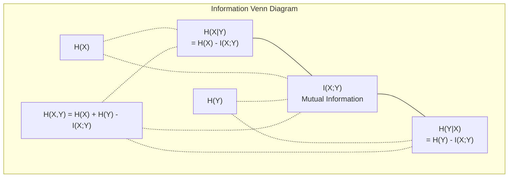

# Information Theory

> Information theory measures surprise. Loss functions are built on top of it.

**Type:** Learn
**Languages:** Python
**Prerequisites:** Phase 1, Lesson 06 (Probability)
**Time:** ~60 minutes

## Learning Objectives

- Calculate entropy, cross-entropy, and KL divergence from scratch and explain the relationships between them
- Derive why minimizing cross-entropy loss is equivalent to maximizing log-likelihood
- Compute mutual information between features and targets to rank feature importance
- Interpret perplexity as the effective vocabulary size a language model chooses from

## The Problem

Every classification model you train calls `CrossEntropyLoss()`. You see "perplexity" in every language model paper. You read about KL divergence in VAEs, distillation, and RLHF. These aren't unrelated concepts. They're the same idea wearing different hats.

Information theory gives you a language to reason about uncertainty, compression, and prediction. Claude Shannon invented it in 1948 to solve communication problems. It turns out that training neural networks is a communication problem: the model tries to transmit the correct label through a noisy channel made of learned weights.

This lesson builds every formula from scratch so you can see where they come from and why they work.

## The Concept

### Information Content (Surprise)

When unlikely events happen, they carry more information. A coin landing heads? Not surprising. Winning the lottery? Very surprising.

The information content of an event with probability p is:

```
I(x) = -log(p(x))
```

Using log base 2 gives you bits. Using natural log gives you nats. Same idea, different units.

```
Event              Probability    Surprise (bits)
Fair coin heads    0.5            1.0
Rolling a 6        0.167          2.58
1-in-1000 event    0.001          9.97
Certain event      1.0            0.0
```

A certain event carries zero information. You already knew it would happen.

### Entropy (Average Surprise)

Entropy is the expected surprise over all possible outcomes of a distribution.

```
H(P) = -sum( p(x) * log(p(x)) )  for all x
```

For a binary variable, a fair coin has maximum entropy: 1 bit. A biased coin (99% heads) has low entropy: 0.08 bits. You already know what will happen, so each flip tells you almost nothing.

```
Fair coin:    H = -(0.5 * log2(0.5) + 0.5 * log2(0.5)) = 1.0 bit
Biased coin:  H = -(0.99 * log2(0.99) + 0.01 * log2(0.01)) = 0.08 bits
```

Entropy measures the irreducible uncertainty in a distribution. You cannot compress below it.

### Cross-Entropy (The Loss Function You Use Every Day)

Cross-entropy measures the average surprise when you use distribution Q to encode events that actually come from distribution P.

```
H(P, Q) = -sum( p(x) * log(q(x)) )  for all x
```

P is the true distribution (labels). Q is your model's predictions. If Q perfectly matches P, cross-entropy equals entropy. Any mismatch makes it larger.

In classification, P is a one-hot vector (probability 1 for the true class, 0 for everything else). This simplifies cross-entropy to:

```
H(P, Q) = -log(q(true_class))
```

This is the complete formula for categorical cross-entropy loss. Maximize the predicted probability of the correct class.

### KL Divergence (Distance Between Distributions)

KL divergence measures how much extra surprise you get from using Q instead of P.

```
D_KL(P || Q) = sum( p(x) * log(p(x) / q(x)) )  for all x
             = H(P, Q) - H(P)
```

Cross-entropy is entropy plus KL divergence. Since the entropy of the true distribution is constant during training, minimizing cross-entropy is the same as minimizing KL divergence. You're pushing the model's distribution toward the true distribution.

KL divergence is asymmetric: D_KL(P || Q) != D_KL(Q || P). It's not a true distance metric.

### Mutual Information

Mutual information measures how much knowing one variable tells you about another.

```
I(X; Y) = H(X) - H(X|Y)
        = H(X) + H(Y) - H(X, Y)
```

If X and Y are independent, mutual information is zero. Knowing one tells you nothing about the other. If they're perfectly correlated, mutual information equals the entropy of either variable.

In feature selection, high mutual information between a feature and the target means the feature is useful. Low mutual information means it's noise.

### Conditional Entropy

H(Y|X) measures how much uncertainty about Y remains after you observe X.

```
H(Y|X) = H(X,Y) - H(X)
```

Two extremes:
- If X completely determines Y, then H(Y|X) = 0. Knowing X eliminates all uncertainty about Y. Example: X = Celsius temperature, Y = Fahrenheit temperature.
- If X says nothing about Y, then H(Y|X) = H(Y). Knowing X doesn't reduce your uncertainty at all. Example: X = coin flip, Y = tomorrow's weather.

Conditional entropy is always non-negative and never exceeds H(Y):

```
0 <= H(Y|X) <= H(Y)
```

In machine learning, conditional entropy appears in decision trees. At each split, the algorithm picks the feature X that minimizes H(Y|X) — the feature that eliminates the most uncertainty about label Y.

### Joint Entropy

H(X,Y) is the entropy of the joint distribution of X and Y together.

```
H(X,Y) = -sum sum p(x,y) * log(p(x,y))   for all x, y
```

Key property:

```
H(X,Y) <= H(X) + H(Y)
```

Equality holds when X and Y are independent. If they share information, joint entropy is less than the sum of individual entropies. The "missing" entropy is exactly the mutual information.



These relationships:
- H(X,Y) = H(X) + H(Y|X) = H(Y) + H(X|Y)
- I(X;Y) = H(X) - H(X|Y) = H(Y) - H(Y|X)
- H(X,Y) = H(X) + H(Y) - I(X;Y)

### Mutual Information (In Depth)

Mutual information I(X;Y) quantifies how much knowing one variable reduces uncertainty about the other.

```
I(X;Y) = H(X) - H(X|Y)
       = H(Y) - H(Y|X)
       = H(X) + H(Y) - H(X,Y)
       = sum sum p(x,y) * log(p(x,y) / (p(x) * p(y)))
```

Properties:
- I(X;Y) >= 0 always. Observing something never loses information.
- I(X;Y) = 0 if and only if X and Y are independent.
- I(X;Y) = I(Y;X). It's symmetric, unlike KL divergence.
- I(X;X) = H(X). A variable shares all its information with itself.

**Mutual information for feature selection.** In ML, you want features that are informative about the target. Mutual information gives you a principled way to rank features:

1. For each feature X_i, compute I(X_i; Y) where Y is the target variable.
2. Rank features by MI score.
3. Keep the top k features.

It works for any relationship between features and targets — linear, nonlinear, monotonic or not. Correlation coefficients only catch linear relationships. MI catches everything.

| Method | Detects | Computational Cost | Handles Categorical? |
|--------|---------|-------------------|---------------------|
| Pearson correlation | Linear relationships | O(n) | No |
| Spearman correlation | Monotonic relationships | O(n log n) | No |
| Mutual information | Any statistical dependency | O(n log n) after binning | Yes |

### Label Smoothing and Cross-Entropy

Standard classification uses hard targets: [0, 0, 1, 0]. The true class gets probability 1, everything else gets 0. Label smoothing replaces them with soft targets:

```
soft_target = (1 - epsilon) * hard_target + epsilon / num_classes
```

With epsilon = 0.1, 4 classes:
- Hard targets: [0, 0, 1, 0]
- Soft targets: [0.025, 0.025, 0.925, 0.025]

From an information-theoretic perspective, label smoothing increases the entropy of the target distribution. Hard one-hot targets have entropy 0 — no uncertainty. Soft targets have positive entropy.

Why it helps:
- Prevents the model from pushing logits to extreme values (perfectly matching one-hot targets under cross-entropy requires infinite logits)
- Acts as regularization: the model can't be 100% confident
- Improves calibration: predicted probabilities better reflect true uncertainty
- Reduces the gap between training and inference behavior

Cross-entropy loss with label smoothing becomes:

```
L = (1 - epsilon) * CE(hard_target, prediction) + epsilon * H_uniform(prediction)
```

The second term penalizes predictions far from uniform — direct regularization on confidence.

### Why Cross-Entropy Is the Classification Loss

Three perspectives, same conclusion.

**Information theory perspective.** Cross-entropy measures how many bits you waste using your model's distribution instead of the true distribution. Minimizing it makes your model the most efficient encoder of reality.

**Maximum likelihood perspective.** For N training samples with true class y_i:

```
Likelihood     = product( q(y_i) )
Log-likelihood = sum( log(q(y_i)) )
Negative log-likelihood = -sum( log(q(y_i)) )
```

The last line is cross-entropy loss. Minimizing cross-entropy = maximizing the likelihood of training data under your model.

**Gradient perspective.** The gradient of cross-entropy with respect to logits is simply (prediction - truth). Clean, stable, fast to compute. This is why it pairs perfectly with softmax.

### Bits vs Nats

The only difference is the base of the logarithm.

```
log base 2   -> bits      (information theory tradition)
log base e   -> nats      (machine learning convention)
log base 10  -> hartleys  (rarely used)
```

1 nat = 1/ln(2) bits = 1.4427 bits. PyTorch and TensorFlow default to natural log (nats).

### Perplexity

Perplexity is the exponential of cross-entropy. It tells you how many equally likely choices the model is confused between — the effective number of options.

```
Perplexity = 2^H(P,Q)   (if using bits)
Perplexity = e^H(P,Q)   (if using nats)
```

A language model with perplexity 50 is, on average, as confused as if it were uniformly picking from 50 possible next tokens. Lower is better.

GPT-2 achieves roughly perplexity 30 on common benchmarks. Modern models reach single digits on well-represented domains.

## Build It

### Step 1: Information Content and Entropy

```python
import math

def information_content(p, base=2):
    if p <= 0 or p > 1:
        return float('inf') if p <= 0 else 0.0
    return -math.log(p) / math.log(base)

def entropy(probs, base=2):
    return sum(
        p * information_content(p, base)
        for p in probs if p > 0
    )

fair_coin = [0.5, 0.5]
biased_coin = [0.99, 0.01]
fair_die = [1/6] * 6

print(f"Fair coin entropy:   {entropy(fair_coin):.4f} bits")
print(f"Biased coin entropy: {entropy(biased_coin):.4f} bits")
print(f"Fair die entropy:    {entropy(fair_die):.4f} bits")
```

### Step 2: Cross-Entropy and KL Divergence

```python
def cross_entropy(p, q, base=2):
    total = 0.0
    for pi, qi in zip(p, q):
        if pi > 0:
            if qi <= 0:
                return float('inf')
            total += pi * (-math.log(qi) / math.log(base))
    return total

def kl_divergence(p, q, base=2):
    return cross_entropy(p, q, base) - entropy(p, base)

true_dist = [0.7, 0.2, 0.1]
good_model = [0.6, 0.25, 0.15]
bad_model = [0.1, 0.1, 0.8]

print(f"Entropy of true dist:     {entropy(true_dist):.4f} bits")
print(f"CE (good model):          {cross_entropy(true_dist, good_model):.4f} bits")
print(f"CE (bad model):           {cross_entropy(true_dist, bad_model):.4f} bits")
print(f"KL divergence (good):     {kl_divergence(true_dist, good_model):.4f} bits")
print(f"KL divergence (bad):      {kl_divergence(true_dist, bad_model):.4f} bits")
```

### Step 3: Cross-Entropy as Classification Loss

```python
def softmax(logits):
    max_logit = max(logits)
    exps = [math.exp(z - max_logit) for z in logits]
    total = sum(exps)
    return [e / total for e in exps]

def cross_entropy_loss(true_class, logits):
    probs = softmax(logits)
    return -math.log(probs[true_class])

logits = [2.0, 1.0, 0.1]
true_class = 0

probs = softmax(logits)
loss = cross_entropy_loss(true_class, logits)

print(f"Logits:      {logits}")
print(f"Softmax:     {[f'{p:.4f}' for p in probs]}")
print(f"True class:  {true_class}")
print(f"Loss:        {loss:.4f} nats")
print(f"Perplexity:  {math.exp(loss):.2f}")
```

### Step 4: Cross-Entropy Equals Negative Log-Likelihood

```python
import random

random.seed(42)

n_samples = 1000
n_classes = 3
true_labels = [random.randint(0, n_classes - 1) for _ in range(n_samples)]
model_logits = [[random.gauss(0, 1) for _ in range(n_classes)] for _ in range(n_samples)]

ce_loss = sum(
    cross_entropy_loss(label, logits)
    for label, logits in zip(true_labels, model_logits)
) / n_samples

nll = -sum(
    math.log(softmax(logits)[label])
    for label, logits in zip(true_labels, model_logits)
) / n_samples

print(f"Cross-entropy loss:      {ce_loss:.6f}")
print(f"Negative log-likelihood: {nll:.6f}")
print(f"Difference:              {abs(ce_loss - nll):.2e}")
```

### Step 5: Mutual Information

```python
def mutual_information(joint_probs, base=2):
    rows = len(joint_probs)
    cols = len(joint_probs[0])

    margin_x = [sum(joint_probs[i][j] for j in range(cols)) for i in range(rows)]
    margin_y = [sum(joint_probs[i][j] for i in range(rows)) for j in range(cols)]

    mi = 0.0
    for i in range(rows):
        for j in range(cols):
            pxy = joint_probs[i][j]
            if pxy > 0:
                mi += pxy * math.log(pxy / (margin_x[i] * margin_y[j])) / math.log(base)
    return mi

independent = [[0.25, 0.25], [0.25, 0.25]]
dependent = [[0.45, 0.05], [0.05, 0.45]]

print(f"MI (independent): {mutual_information(independent):.4f} bits")
print(f"MI (dependent):   {mutual_information(dependent):.4f} bits")
```

## Use It

The same concepts implemented with NumPy — how you'd use them in practice:

```python
import numpy as np

def np_entropy(p):
    p = np.asarray(p, dtype=float)
    mask = p > 0
    result = np.zeros_like(p)
    result[mask] = p[mask] * np.log(p[mask])
    return -result.sum()

def np_cross_entropy(p, q):
    p, q = np.asarray(p, dtype=float), np.asarray(q, dtype=float)
    mask = p > 0
    return -(p[mask] * np.log(q[mask])).sum()

def np_kl_divergence(p, q):
    return np_cross_entropy(p, q) - np_entropy(p)

true = np.array([0.7, 0.2, 0.1])
pred = np.array([0.6, 0.25, 0.15])
print(f"Entropy:    {np_entropy(true):.4f} nats")
print(f"Cross-ent:  {np_cross_entropy(true, pred):.4f} nats")
print(f"KL div:     {np_kl_divergence(true, pred):.4f} nats")
```

You just built from scratch what `torch.nn.CrossEntropyLoss()` does internally. Now you know why the loss decreases during training: your model's predicted distribution is moving toward the true distribution, measured in wasted nats of information.

## Exercises

1. Assuming a uniform distribution (26 letters), compute the entropy of the English alphabet. Then estimate it using actual letter frequencies. Which is higher, and why?

2. A model outputs logits [5.0, 2.0, 0.5] for a sample whose true class is 1. Manually compute the cross-entropy loss, then verify with your `cross_entropy_loss` function. What logits would give zero loss?

3. Prove that KL divergence is asymmetric. Pick two distributions P and Q, compute D_KL(P || Q) and D_KL(Q || P). Explain why they differ.

4. Build a function that computes perplexity for a sequence of token predictions. Given a set of (true_token_index, predicted_logits) pairs, return the perplexity of the sequence.

## Key Terms

| Term | What people say | What it actually means |
|------|----------------|----------------------|
| Information content | "surprise" | The number of bits (or nats) needed to encode an event: -log(p) |
| Entropy | "randomness" | The average surprise over all outcomes of a distribution. Measures irreducible uncertainty. |
| Cross-entropy | "loss function" | The average surprise when using model distribution Q to encode events from true distribution P. |
| KL divergence | "distance between distributions" | The extra bits wasted by using Q instead of P. Equals cross-entropy minus entropy. Asymmetric. |
| Mutual information | "how related X and Y are" | The reduction in uncertainty about X after knowing Y. Zero means independent. |
| Softmax | "turns logits into probabilities" | Exponentiate and normalize. Maps any real-valued vector to a valid probability distribution. |
| Perplexity | "how confused the model is" | The exponential of cross-entropy. The effective vocabulary size the model picks from at each step. |
| Bit | "Shannon's unit" | Information measured in log base 2. One bit resolves a single fair coin flip. |
| Nat | "ML's unit" | Information measured in natural log. Default in PyTorch and TensorFlow. |
| Negative log-likelihood | "NLL loss" | Identical to cross-entropy loss for one-hot labels. Minimizing it maximizes the probability of correct predictions. |

## Further Reading

- [Shannon 1948: A Mathematical Theory of Communication](https://people.math.harvard.edu/~ctm/home/text/others/shannon/entropy/entropy.pdf) - The original paper, still readable today
- [Visual Information Theory (Chris Olah)](https://colah.github.io/posts/2015-09-Visual-Information/) - The best visual explanation of entropy and KL divergence
- [PyTorch CrossEntropyLoss docs](https://pytorch.org/docs/stable/generated/torch.nn.CrossEntropyLoss.html) - How the framework implements what you just built
