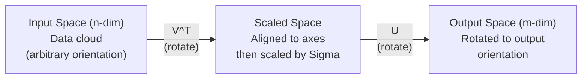
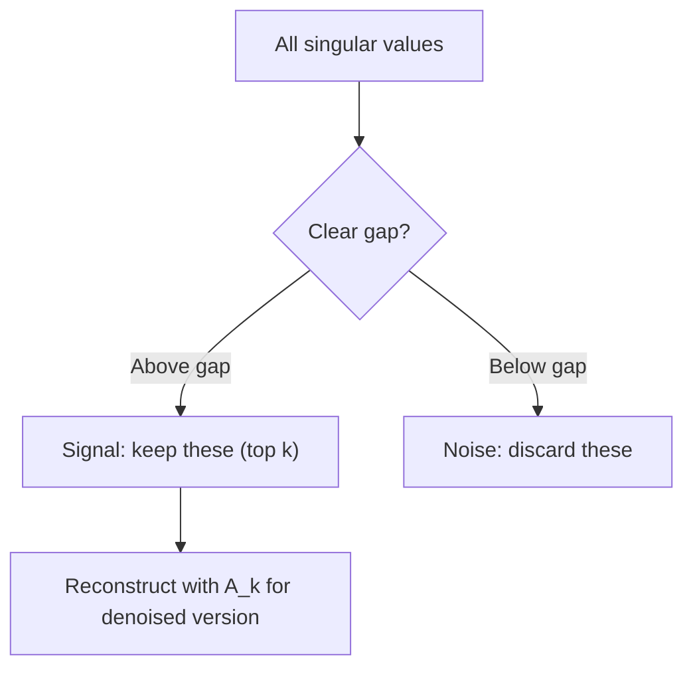

# Singular Value Decomposition

> SVD is the Swiss army knife of linear algebra. Every matrix has one. Every data scientist needs one.

**Type:** Build
**Languages:** Python, Julia
**Prerequisites:** Phase 1, Lesson 01 (Linear Algebra Intuition), 02 (Vectors and Matrix Operations), 03 (Matrix Transformations)
**Time:** ~120 minutes

## Learning Objectives

- Implement SVD using power iteration and explain the geometric meaning of U, Sigma, V^T
- Compress images with truncated SVD, measuring the tradeoff between compression ratio and reconstruction error
- Compute the Moore-Penrose pseudoinverse via SVD to solve overdetermined least-squares systems
- Connect SVD to PCA, recommender systems (latent factors), and Latent Semantic Analysis in NLP

## The Problem

You have a 1000x2000 matrix. Maybe it's user-movie ratings. Maybe it's a document-term frequency table. Maybe it's pixel values of an image. You need to compress it, denoise it, find hidden structure inside it, or solve a least-squares system with it. Eigendecomposition only works on square matrices. Even then, it requires the matrix to have a full set of linearly independent eigenvectors.

SVD works on any matrix. Any shape. Any rank. No conditions. It decomposes a matrix into three factors that reveal the geometry of what the matrix does to space. It is the most general and most useful decomposition in all of linear algebra.

## The Concept

### What SVD Does Geometrically

Every matrix, regardless of shape, performs three operations in sequence: rotate, scale, rotate. SVD writes this decomposition explicitly.

```
A = U * Sigma * V^T

      m x n     m x m    m x n    n x n
     (any)    (rotate)  (scale)  (rotate)
```

Given any matrix A, SVD decomposes it into:
- V^T rotates vectors in the input space (n-dimensional)
- Sigma scales along each axis (stretches or compresses)
- U rotates the result into the output space (m-dimensional)



Think of it this way. You hand SVD a matrix. It tells you: "This matrix takes a sphere of inputs, rotates it with V^T, stretches it into an ellipsoid with Sigma, then rotates that ellipsoid with U." The singular values are the lengths of the ellipsoid's axes.

### The Full Decomposition

For a matrix A of shape m x n:

```
A = U * Sigma * V^T

where:
  U     is m x m, orthogonal (U^T U = I)
  Sigma is m x n, diagonal (singular values on the diagonal)
  V     is n x n, orthogonal (V^T V = I)

The singular values sigma_1 >= sigma_2 >= ... >= sigma_r > 0
where r = rank(A)
```

The columns of U are called left singular vectors. The columns of V are called right singular vectors. The diagonal entries of Sigma are called singular values. They are always non-negative and sorted from largest to smallest by convention.

### Left Singular Vectors, Singular Values, Right Singular Vectors

Each part of SVD has a distinct geometric meaning.

**Right singular vectors (columns of V):** They form an orthonormal basis for the input space (R^n). They are the directions in input space that the matrix maps to orthogonal directions in output space. Think of them as the natural coordinate system for the domain.

**Singular values (diagonal of Sigma):** These are the scaling factors. The i-th singular value tells you how much the matrix stretches vectors along the i-th right singular vector. A singular value of zero means the matrix completely crushes that direction.

**Left singular vectors (columns of U):** They form an orthonormal basis for the output space (R^m). The i-th left singular vector is the output-space direction where the i-th right singular vector (after scaling) lands.

The relationship between them:

```
A * v_i = sigma_i * u_i

The matrix A takes the i-th right singular vector v_i,
scales it by sigma_i, and maps it to the i-th left singular vector u_i.
```

This gives you a coordinate-by-coordinate picture of what any matrix does.

### Outer Product Form

SVD can be written as a sum of rank-1 matrices:

```
A = sigma_1 * u_1 * v_1^T + sigma_2 * u_2 * v_2^T + ... + sigma_r * u_r * v_r^T

Each term sigma_i * u_i * v_i^T is a rank-1 matrix (an outer product).
The full matrix is the sum of r such matrices, where r is the rank.
```

This form is the basis of low-rank approximation. Each term adds one layer of structure. The first term captures the single most important pattern. The second captures the next most important. And so on. Truncating this sum gives you the best possible approximation at any given rank.

```
Rank-1 approx:    A_1 = sigma_1 * u_1 * v_1^T
                  (captures the dominant pattern)

Rank-2 approx:    A_2 = sigma_1 * u_1 * v_1^T + sigma_2 * u_2 * v_2^T
                  (captures the two most important patterns)

Rank-k approx:    A_k = sum of top k terms
                  (optimal by the Eckart-Young theorem)
```

### Relationship to Eigendecomposition

SVD and eigendecomposition are deeply connected. The singular values and singular vectors of A come directly from the eigenvalues and eigenvectors of A^T A and A A^T.

```
A^T A = V * Sigma^T * U^T * U * Sigma * V^T
      = V * Sigma^T * Sigma * V^T
      = V * D * V^T

where D = Sigma^T * Sigma is a diagonal matrix with sigma_i^2 on the diagonal.

So:
- The right singular vectors (V) are eigenvectors of A^T A
- The singular values squared (sigma_i^2) are eigenvalues of A^T A

Similarly:
A A^T = U * Sigma * V^T * V * Sigma^T * U^T
      = U * Sigma * Sigma^T * U^T

So:
- The left singular vectors (U) are eigenvectors of A A^T
- The eigenvalues of A A^T are also sigma_i^2
```

This connection tells you three things:
1. Singular values are always real and non-negative (they are square roots of eigenvalues of a positive semidefinite matrix).
2. You can compute SVD via eigendecomposition of A^T A, but this squares the condition number and loses numerical precision. Dedicated SVD algorithms avoid this.
3. When A is square and symmetric positive semidefinite, SVD and eigendecomposition are the same thing.

### Truncated SVD: Low-Rank Approximation

The Eckart-Young-Mirsky theorem states that the best rank-k approximation of A (in both Frobenius norm and spectral norm) is obtained by keeping only the top k singular values and their corresponding vectors:

```
A_k = U_k * Sigma_k * V_k^T

where:
  U_k     is m x k  (first k columns of U)
  Sigma_k is k x k  (top-left k x k block of Sigma)
  V_k     is n x k  (first k columns of V)

Approximation error = sigma_{k+1}  (in spectral norm)
                    = sqrt(sigma_{k+1}^2 + ... + sigma_r^2)  (in Frobenius norm)
```

This is not just "a good" approximation. It is proven to be the best possible approximation at rank k. No other rank-k matrix can be closer to A.

| Component | Relative Size | Kept in Rank-3 Approximation? |
|-----------|-------------------|------------------------|
| sigma_1 | Largest | Yes |
| sigma_2 | Large | Yes |
| sigma_3 | Medium-large | Yes |
| sigma_4 | Medium | No (error) |
| sigma_5 | Medium-small | No (error) |
| sigma_6 | Small | No (error) |
| sigma_7 | Very small | No (error) |
| sigma_8 | Tiny | No (error) |

Keep top 3: A_3 captures the three largest singular values. Error = remaining values (sigma_4 through sigma_8).

If singular values decay quickly, a small k captures most of the matrix. If they decay slowly, the matrix has no low-rank structure.

### Image Compression with SVD

A grayscale image is a matrix of pixel intensities. An 800x600 image has 480,000 values. SVD lets you approximate it with far fewer values.

```
Original image: 800 x 600 = 480,000 values

SVD with rank k:
  U_k:      800 x k values
  Sigma_k:  k values
  V_k:      600 x k values
  Total:    k * (800 + 600 + 1) = k * 1401 values

  k=10:   14,010 values   (2.9% of original)
  k=50:   70,050 values  (14.6% of original)
  k=100: 140,100 values  (29.2% of original)

  The compression ratio improves as k gets smaller,
  but visual quality degrades.
```

Key insight: natural images have rapidly decaying singular values. The first few singular values capture broad structure (shapes, gradients). Later ones capture detail and noise. Truncating at rank 50 often produces an image that looks nearly identical to the original while using 85% less storage.

### SVD for Recommender Systems

The Netflix Prize made it famous. You have a user-movie rating matrix where most entries are missing.

```
             Movie1  Movie2  Movie3  Movie4  Movie5
  User1      [  5      ?       3       ?       1  ]
  User2      [  ?      4       ?       2       ?  ]
  User3      [  3      ?       5       ?       ?  ]
  User4      [  ?      ?       ?       4       3  ]

  ? = unknown rating
```

The idea: this rating matrix is low-rank. User tastes are not fully independent. A few latent factors (action vs. drama, old vs. new, cerebral vs. straightforward) explain most preferences.

Applying SVD to the (filled) rating matrix decomposes it into:
- U: user profiles in latent factor space
- Sigma: importance of each latent factor
- V^T: movie profiles in latent factor space

A user's predicted rating for a movie is the dot product of their user profile and that movie's profile (weighted by singular values). The low-rank approximation fills in the missing entries.

In practice, you use variants like Simon Funk's incremental SVD or ALS (Alternating Least Squares) that handle missing data directly. But the core idea is the same: latent factor decomposition via SVD.

### SVD in NLP: Latent Semantic Analysis

Latent Semantic Analysis (LSA), also called Latent Semantic Indexing (LSI), applies SVD to a term-document matrix.

```
             Doc1   Doc2   Doc3   Doc4
  "cat"      [  3      0      1      0  ]
  "dog"      [  2      0      0      1  ]
  "fish"     [  0      4      1      0  ]
  "pet"      [  1      1      1      1  ]
  "ocean"    [  0      3      0      0  ]

After SVD with rank k=2:

  Each document becomes a point in 2D "concept space."
  Each term becomes a point in the same 2D space.
  Documents about similar topics cluster together.
  Terms with similar meanings cluster together.

  "cat" and "dog" end up near each other (land pets).
  "fish" and "ocean" end up near each other (water concepts).
  Doc1 and Doc3 cluster if they share similar topics.
```

LSA was one of the earliest successful methods for capturing semantic similarity from raw text. It works because synonyms tend to appear in similar documents, so SVD groups them into the same latent dimensions. Modern word embeddings (Word2Vec, GloVe) can be seen as descendants of this idea.

### SVD for Denoising

In noisy data, signal concentrates in the top singular values while noise spreads across all singular values. Truncation cuts away this noise floor.

**Singular values of a clean signal:**

| Component | Size | Type |
|-----------|-----------|------|
| sigma_1 | Very large | Signal |
| sigma_2 | Large | Signal |
| sigma_3 | Medium | Signal |
| sigma_4 | Near zero | Negligible |
| sigma_5 | Near zero | Negligible |

**Singular values of a noisy signal (noise added to all entries):**

| Component | Size | Type |
|-----------|-----------|------|
| sigma_1 | Very large | Signal |
| sigma_2 | Large | Signal |
| sigma_3 | Medium | Signal |
| sigma_4 | Small | Noise |
| sigma_5 | Small | Noise |
| sigma_6 | Small | Noise |
| sigma_7 | Small | Noise |



This is used in signal processing, scientific measurement, and data cleaning. Any time you have a matrix corrupted by additive noise, truncated SVD is a principled way to separate signal from noise.

### Pseudoinverse via SVD

The Moore-Penrose pseudoinverse A+ generalizes matrix inversion to non-square and singular matrices. SVD makes computing it trivial.

```
If A = U * Sigma * V^T, then:

A+ = V * Sigma+ * U^T

where Sigma+ is formed by:
  1. Transpose Sigma (swap rows and columns)
  2. Replace each non-zero diagonal entry sigma_i with 1/sigma_i
  3. Leave zeros as zeros

For A (m x n):      A+ is (n x m)
For Sigma (m x n):  Sigma+ is (n x m)
```

The pseudoinverse solves least-squares problems. If Ax = b has no exact solution (overdetermined system), then x = A+ b is the least-squares solution (minimizes ||Ax - b||).

```
Overdetermined system (more equations than unknowns):

  [1  1]         [3]
  [2  1] x   =   [5]       No exact solution exists.
  [3  1]         [6]

  x_ls = A+ b = V * Sigma+ * U^T * b

  This gives the x that minimizes the sum of squared residuals.
  Same result as the normal equations (A^T A)^(-1) A^T b,
  but numerically more stable.
```

### Numerical Stability Advantage

Computing the eigendecomposition of A^T A squares the singular values (eigenvalues of A^T A are sigma_i^2). This squares the condition number, amplifying numerical error.

```
Example:
  A has singular values [1000, 1, 0.001]
  Condition number of A: 1000 / 0.001 = 10^6

  A^T A has eigenvalues [10^6, 1, 10^{-6}]
  Condition number of A^T A: 10^6 / 10^{-6} = 10^{12}

  Computing SVD directly: works with condition number 10^6
  Computing via A^T A:     works with condition number 10^{12}
                           (6 extra digits of precision lost)
```

Modern SVD algorithms (Golub-Kahan bidiagonalization) work directly on A, never forming A^T A. This is why you should always prefer `np.linalg.svd(A)` over `np.linalg.eig(A.T @ A)`.

### Connection to PCA

PCA is SVD applied to centered data. This is not an analogy. It is literally the same computation.

```
Given data matrix X (n_samples x n_features), centered (mean subtracted):

Covariance matrix: C = (1/(n-1)) * X^T X

PCA finds eigenvectors of C. But:

  X = U * Sigma * V^T    (SVD of X)

  X^T X = V * Sigma^2 * V^T

  C = (1/(n-1)) * V * Sigma^2 * V^T

So the principal components are exactly the right singular vectors V.
The explained variance for each component is sigma_i^2 / (n-1).

In sklearn, PCA is implemented using SVD, not eigendecomposition.
It is faster and more numerically stable.
```

This means everything you learned about dimensionality reduction in Lesson 10 is SVD under the hood. PCA is the most common application of SVD in machine learning.

## Build It

### Step 1: Implement SVD from Scratch Using Power Iteration

The idea: to find the largest singular value and its vectors, apply power iteration to A^T A (or A A^T). Then deflate the matrix and repeat for the next singular value.

```python
import numpy as np

def power_iteration(M, num_iters=100):
    n = M.shape[1]
    v = np.random.randn(n)
    v = v / np.linalg.norm(v)

    for _ in range(num_iters):
        Mv = M @ v
        v = Mv / np.linalg.norm(Mv)

    eigenvalue = v @ M @ v
    return eigenvalue, v

def svd_from_scratch(A, k=None):
    m, n = A.shape
    if k is None:
        k = min(m, n)

    sigmas = []
    us = []
    vs = []

    A_residual = A.copy().astype(float)

    for _ in range(k):
        AtA = A_residual.T @ A_residual
        eigenvalue, v = power_iteration(AtA, num_iters=200)

        if eigenvalue < 1e-10:
            break

        sigma = np.sqrt(eigenvalue)
        u = A_residual @ v / sigma

        sigmas.append(sigma)
        us.append(u)
        vs.append(v)

        A_residual = A_residual - sigma * np.outer(u, v)

    U = np.column_stack(us) if us else np.empty((m, 0))
    S = np.array(sigmas)
    V = np.column_stack(vs) if vs else np.empty((n, 0))

    return U, S, V
```

### Step 2: Test and Compare Against NumPy

```python
np.random.seed(42)
A = np.random.randn(5, 4)

U_ours, S_ours, V_ours = svd_from_scratch(A)
U_np, S_np, Vt_np = np.linalg.svd(A, full_matrices=False)

print("Our singular values:", np.round(S_ours, 4))
print("NumPy singular values:", np.round(S_np, 4))

A_reconstructed = U_ours @ np.diag(S_ours) @ V_ours.T
print(f"Reconstruction error: {np.linalg.norm(A - A_reconstructed):.8f}")
```

### Step 3: Image Compression Demo

```python
def compress_image_svd(image_matrix, k):
    U, S, Vt = np.linalg.svd(image_matrix, full_matrices=False)
    compressed = U[:, :k] @ np.diag(S[:k]) @ Vt[:k, :]
    return compressed

image = np.random.seed(42)
rows, cols = 200, 300
image = np.random.randn(rows, cols)

for k in [1, 5, 10, 20, 50]:
    compressed = compress_image_svd(image, k)
    error = np.linalg.norm(image - compressed) / np.linalg.norm(image)
    original_size = rows * cols
    compressed_size = k * (rows + cols + 1)
    ratio = compressed_size / original_size
    print(f"k={k:>3d}  error={error:.4f}  storage={ratio:.1%}")
```

### Step 4: Denoising

```python
np.random.seed(42)
clean = np.outer(np.sin(np.linspace(0, 4*np.pi, 100)),
                 np.cos(np.linspace(0, 2*np.pi, 80)))
noise = 0.3 * np.random.randn(100, 80)
noisy = clean + noise

U, S, Vt = np.linalg.svd(noisy, full_matrices=False)
denoised = U[:, :5] @ np.diag(S[:5]) @ Vt[:5, :]

print(f"Noisy error:    {np.linalg.norm(noisy - clean):.4f}")
print(f"Denoised error: {np.linalg.norm(denoised - clean):.4f}")
print(f"Improvement:    {(1 - np.linalg.norm(denoised - clean) / np.linalg.norm(noisy - clean)):.1%}")
```

### Step 5: Pseudoinverse

```python
A = np.array([[1, 1], [2, 1], [3, 1]], dtype=float)
b = np.array([3, 5, 6], dtype=float)

U, S, Vt = np.linalg.svd(A, full_matrices=False)
S_inv = np.diag(1.0 / S)
A_pinv = Vt.T @ S_inv @ U.T

x_svd = A_pinv @ b
x_lstsq = np.linalg.lstsq(A, b, rcond=None)[0]
x_pinv = np.linalg.pinv(A) @ b

print(f"SVD pseudoinverse solution:  {x_svd}")
print(f"np.linalg.lstsq solution:   {x_lstsq}")
print(f"np.linalg.pinv solution:    {x_pinv}")
```

## Use It

The full runnable demo is in `code/svd.py`. Run it to see SVD applied to image compression, recommender systems, Latent Semantic Analysis, and denoising.

```bash
python svd.py
```

The Julia version in `code/svd.jl` demonstrates the same concepts using Julia's native `svd()` function and `LinearAlgebra` package.

```bash
julia svd.jl
```

## Ship It

This lesson produces:
- `outputs/skill-svd.md` - A skill to help you decide when and how to apply SVD in real projects

## Exercises

1. Implement full SVD from scratch without power iteration. Instead: compute the eigendecomposition of A^T A to get V and singular values, then compute U = A V Sigma^{-1}. Compare numerical accuracy against your power iteration version and NumPy.

2. Load a real grayscale image (or convert one to grayscale). Compress it at ranks 1, 5, 10, 25, 50, 100. For each rank, compute the compression ratio and relative error. Find the rank where the image becomes visually acceptable.

3. Build a mini recommender system. Create a 10x8 user-movie rating matrix with some known entries. Fill missing entries with row means. Compute SVD and reconstruct a rank-3 approximation. Use the reconstructed matrix to predict missing ratings. Verify the predictions are reasonable.

4. Create a 100x50 document-term matrix with 3 synthetic topics. Each topic has 5 associated words. Add noise. Apply SVD and verify that the top 3 singular values are much larger than the rest. Project documents to 3D latent space and check whether documents from the same topic cluster together.

5. Generate a clean low-rank matrix (rank 3, size 50x40) and add Gaussian noise at different levels (sigma = 0.1, 0.5, 1.0, 2.0). For each noise level, find the optimal truncation rank by sweeping k from 1 to 40 and measuring reconstruction error against the clean matrix. Plot how optimal k varies with noise level.

## Key Terms

| Term | What people say | What it actually means |
|------|----------------|----------------------|
| SVD | "Decompose any matrix" | Factors A into U Sigma V^T where U and V are orthogonal, Sigma is diagonal and non-negative. Works on any matrix of any shape. |
| Singular value | "How important this component is" | The i-th diagonal entry of Sigma. Measures how much the matrix stretches along the i-th principal direction. Always non-negative, sorted largest to smallest. |
| Left singular vector | "Output direction" | A column of U. The output-space direction where the i-th right singular vector (scaled by sigma_i) maps to. |
| Right singular vector | "Input direction" | A column of V. The input-space direction that the matrix maps (scaled by sigma_i) to the i-th left singular vector. |
| Truncated SVD | "Low-rank approximation" | Keep only the top k singular values and their vectors. Produces the provably best rank-k approximation of the original matrix (Eckart-Young theorem). |
| Rank | "True dimensionality" | The number of non-zero singular values. Tells you how many independent directions the matrix actually uses. |
| Pseudoinverse | "Generalized inverse" | V Sigma+ U^T. Inverts non-zero singular values, leaves zeros as zeros. Solves least-squares problems for non-square or singular matrices. |
| Condition number | "How sensitive to errors" | sigma_max / sigma_min. Large condition number means small input changes cause large output changes. SVD reveals it directly. |
| Latent factor | "Hidden variable" | A dimension in the low-rank space discovered by SVD. In recommendations, a latent factor might correspond to genre preference. In NLP, it might correspond to a topic. |
| Frobenius norm | "Total size of a matrix" | Square root of the sum of squared entries. Equals the square root of the sum of squared singular values. Used to measure approximation error. |
| Eckart-Young theorem | "SVD gives optimal compression" | For any target rank k, truncated SVD minimizes approximation error among all possible rank-k matrices. |
| Power iteration | "Find the largest eigenvector" | Repeatedly multiply a random vector by the matrix and normalize. Converges to the eigenvector with the largest eigenvalue. A building block for many SVD algorithms. |

## Further Reading

- [Gilbert Strang: Linear Algebra and Its Applications, Chapter 7](https://math.mit.edu/~gs/linearalgebra/) - Thorough treatment of SVD and its applications
- [3Blue1Brown: But what is the SVD?](https://www.youtube.com/watch?v=vSczTbgc8Rc) - Geometric intuition for SVD
- [We Recommend a Singular Value Decomposition](https://www.ams.org/publicoutreach/feature-column/fcarc-svd) - Accessible overview from the American Mathematical Society
- [Netflix Prize and Matrix Factorization](https://sifter.org/~simon/journal/20061211.html) - Simon Funk's original blog post on SVD for recommendations
- [Latent Semantic Analysis](https://en.wikipedia.org/wiki/Latent_semantic_analysis) - The original NLP application of SVD
- [Numerical Linear Algebra by Trefethen and Bau](https://people.maths.ox.ac.uk/trefethen/text.html) - The gold standard for understanding SVD algorithms and their numerical properties
