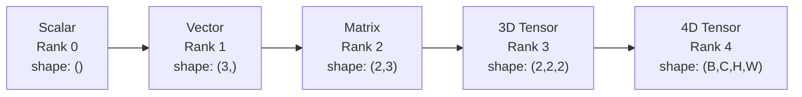
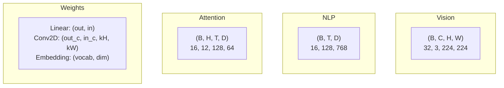
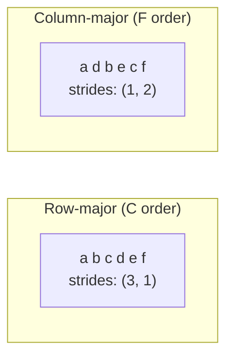
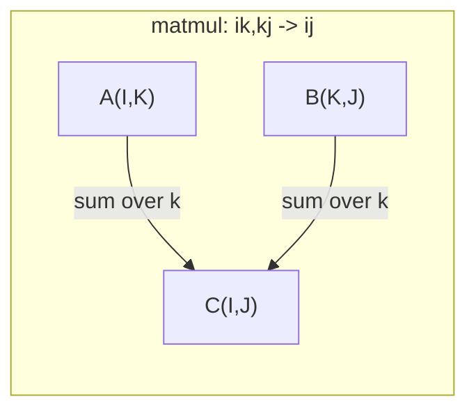

# Tensor Operations

> Tensors are the lingua franca between data and deep learning. Every image, every sentence, every gradient flows through them.

**Type:** Build
**Languages:** Python
**Prerequisites:** Phase 1, Lesson 01 (Linear Algebra Intuition), Lesson 02 (Vectors, Matrices & Operations)
**Time:** ~90 minutes

## Learning Objectives

- Implement a tensor class from scratch with shape, strides, reshape, transpose, and elementwise operations
- Apply broadcasting rules to operate on tensors of different shapes without copying data
- Write einsum expressions for dot products, matrix multiplication, outer products, and batched operations
- Trace the exact tensor shapes at every step of multi-head attention

## The Problem

You build a transformer. The forward pass looks clean. You run it and get: `RuntimeError: mat1 and mat2 shapes cannot be multiplied (32x768 and 512x768)`. You stare at the shapes. You try transposing. Now it says `Expected 4D input (got 3D input)`. You add an unsqueeze. Something else breaks.

Shape errors are the most common bugs in deep learning code. They're not conceptually hard — every operation has a shape contract — but they cascade fast. A transformer chains dozens of reshapes, transposes, and broadcasts together. One wrong axis and the error propagates. Worse, some shape errors don't throw exceptions. They broadcast along the wrong dimension or sum along the wrong axis, silently producing garbage.

Matrices handle pairwise relationships between two sets of things. Real data doesn't fit into two dimensions. A batch of 32 RGB images at 224x224 is a 4D tensor: `(32, 3, 224, 224)`. Self-attention with 12 heads is also 4D: `(batch, heads, seq_len, head_dim)`. You need a data structure that generalizes to arbitrary dimensions, with operations that compose cleanly across all of them. That structure is the tensor. Master its operations and shape errors become trivial to debug.

## The Concept

### What is a tensor

A tensor is a multidimensional array of numbers with a uniform data type. The number of dimensions is called the **rank** (or **order**). Each dimension is an **axis**. The **shape** is a tuple listing the length of each axis.



Total element count = product of all dimensions. Shape `(2, 3, 4)` holds `2 * 3 * 4 = 24` elements.

### Tensor shapes in deep learning

Different data types map to specific tensor shapes by convention.



PyTorch uses NCHW (channels first). TensorFlow defaults to NHWC (channels last). Layout mismatches cause silent slowdowns or errors.

### How memory layout works

A 2D array in memory is a flat sequence of bytes. **Strides** tell you how many elements to skip when advancing one step along each axis.



Transpose doesn't move data. It swaps strides, making the tensor **non-contiguous** — elements of a row are no longer adjacent in memory.

### Broadcasting rules

Broadcasting lets you operate on tensors of different shapes without copying data. Align shapes from right to left. Two dimensions are compatible when they're equal or one of them is 1. The shorter shape gets padded with 1s on the left.

```
Tensor A:     (8, 1, 6, 1)
Tensor B:        (7, 1, 5)
Padded B:     (1, 7, 1, 5)
Result:       (8, 7, 6, 5)
```

### Einsum: the universal tensor operation

Einstein summation labels each axis with a letter. Axes that appear in the input but not the output get summed over. Axes that appear on both sides are preserved.



Key patterns: `i,i->` (dot product), `i,j->ij` (outer product), `ii->` (trace), `ij->ji` (transpose), `bij,bjk->bik` (batched matrix multiply), `bhtd,bhsd->bhts` (attention scores).

## Build It

Code lives in `code/tensors.py`. Each step references the implementation there.

### Step 1: Tensor storage and strides

A tensor stores a flat list of numbers plus shape metadata. Strides tell the indexing logic how to map multidimensional indices to flat positions.

```python
class Tensor:
    def __init__(self, data, shape=None):
        if isinstance(data, (list, tuple)):
            self._data, self._shape = self._flatten_nested(data)
        elif isinstance(data, np.ndarray):
            self._data = data.flatten().tolist()
            self._shape = tuple(data.shape)
        else:
            self._data = [data]
            self._shape = ()

        if shape is not None:
            total = reduce(lambda a, b: a * b, shape, 1)
            if total != len(self._data):
                raise ValueError(
                    f"Cannot reshape {len(self._data)} elements into shape {shape}"
                )
            self._shape = tuple(shape)

        self._strides = self._compute_strides(self._shape)

    @staticmethod
    def _compute_strides(shape):
        if len(shape) == 0:
            return ()
        strides = [1] * len(shape)
        for i in range(len(shape) - 2, -1, -1):
            strides[i] = strides[i + 1] * shape[i + 1]
        return tuple(strides)
```

For shape `(3, 4)`, strides are `(4, 1)` — skip 4 elements to advance one row, skip 1 element to advance one column.

### Step 2: reshape, squeeze, unsqueeze

Reshape changes the shape without changing element order. Total element count must stay the same. Use `-1` for one dimension to let it infer the size automatically.

```python
t = Tensor(list(range(12)), shape=(2, 6))
r = t.reshape((3, 4))
r = t.reshape((-1, 3))
```

Squeeze removes axes of size 1. Unsqueeze inserts one. Unsqueeze is critical for broadcasting — a bias vector `(D,)` added to a batch `(B, T, D)` needs unsqueezing to `(1, 1, D)`.

```python
t = Tensor(list(range(6)), shape=(1, 3, 1, 2))
s = t.squeeze()
v = Tensor([1, 2, 3])
u = v.unsqueeze(0)
```

### Step 3: Transpose and permute

Transpose swaps two axes. Permute reorders all axes. This is how you convert between NCHW and NHWC.

```python
mat = Tensor(list(range(6)), shape=(2, 3))
tr = mat.transpose(0, 1)

t4d = Tensor(list(range(24)), shape=(1, 2, 3, 4))
perm = t4d.permute((0, 2, 3, 1))
```

After transpose or permute, the tensor is non-contiguous in memory. In PyTorch, `view` fails on non-contiguous tensors — use `reshape`, or call `.contiguous()` first.

### Step 4: Elementwise operations and reductions

Elementwise operations (add, multiply, subtract) apply independently to each element and preserve shape. Reductions (sum, mean, max) collapse one or more axes.

```python
a = Tensor([[1, 2], [3, 4]])
b = Tensor([[10, 20], [30, 40]])
c = a + b
d = a * 2
s = a.sum(axis=0)
```

Global average pooling in CNNs: `(B, C, H, W).mean(axis=[2, 3])` produces `(B, C)`. Sequence mean pooling in NLP: `(B, T, D).mean(axis=1)` produces `(B, D)`.

### Step 5: Broadcasting with NumPy

The `demo_broadcasting_numpy()` function in `tensors.py` demonstrates the core patterns.

```python
activations = np.random.randn(4, 3)
bias = np.array([0.1, 0.2, 0.3])
result = activations + bias

images = np.random.randn(2, 3, 4, 4)
scale = np.array([0.5, 1.0, 1.5]).reshape(1, 3, 1, 1)
result = images * scale

a = np.array([1, 2, 3]).reshape(-1, 1)
b = np.array([10, 20, 30, 40]).reshape(1, -1)
outer = a * b
```

Computing pairwise distances with broadcasting: reshape `(M, 2)` to `(M, 1, 2)` and `(N, 2)` to `(1, N, 2)`, subtract, square, sum along the last axis, take the square root. Result: `(M, N)`.

### Step 6: Einsum operations

The `demo_einsum()` and `demo_einsum_gallery()` functions walk through each common pattern.

```python
a = np.array([1.0, 2.0, 3.0])
b = np.array([4.0, 5.0, 6.0])
dot = np.einsum("i,i->", a, b)

A = np.array([[1, 2], [3, 4], [5, 6]], dtype=float)
B = np.array([[7, 8, 9], [10, 11, 12]], dtype=float)
matmul = np.einsum("ik,kj->ij", A, B)

batch_A = np.random.randn(4, 3, 5)
batch_B = np.random.randn(4, 5, 2)
batch_mm = np.einsum("bij,bjk->bik", batch_A, batch_B)
```

The computational cost of a single contraction is the product of all index sizes (retained and summed). For `bij,bjk->bik` with B=32, I=128, J=64, K=128: `32 * 128 * 64 * 128 = 33,554,432` multiply-adds.

### Step 7: Implementing attention with einsum

The `demo_attention_einsum()` function implements multi-head attention end-to-end.

```python
B, H, T, D = 2, 4, 8, 16
E = H * D

X = np.random.randn(B, T, E)
W_q = np.random.randn(E, E) * 0.02

Q = np.einsum("bte,ek->btk", X, W_q)
Q = Q.reshape(B, T, H, D).transpose(0, 2, 1, 3)

scores = np.einsum("bhtd,bhsd->bhts", Q, K) / np.sqrt(D)
weights = softmax(scores, axis=-1)
attn_output = np.einsum("bhts,bhsd->bhtd", weights, V)

concat = attn_output.transpose(0, 2, 1, 3).reshape(B, T, E)
output = np.einsum("bte,ek->btk", concat, W_o)
```

Every step is a tensor operation: projection (matmul via einsum), split heads (reshape + transpose), attention scores (batched matmul via einsum), weighted sum (batched matmul via einsum), merge heads (transpose + reshape), output projection (matmul via einsum).

## Use It

### From-scratch version vs NumPy

| Operation | From scratch (Tensor class) | NumPy |
|---|---|---|
| Create | `Tensor([[1,2],[3,4]])` | `np.array([[1,2],[3,4]])` |
| Reshape | `t.reshape((3,4))` | `a.reshape(3,4)` |
| Transpose | `t.transpose(0,1)` | `a.T` or `a.transpose(0,1)` |
| Squeeze | `t.squeeze(0)` | `np.squeeze(a, 0)` |
| Sum | `t.sum(axis=0)` | `a.sum(axis=0)` |
| Einsum | N/A | `np.einsum("ij,jk->ik", a, b)` |

### From-scratch version vs PyTorch

```python
import torch

t = torch.tensor([[1, 2, 3], [4, 5, 6]], dtype=torch.float32)
t.shape
t.stride()
t.is_contiguous()

t.reshape(3, 2)
t.unsqueeze(0)
t.transpose(0, 1)
t.transpose(0, 1).contiguous()

torch.einsum("ik,kj->ij", A, B)
```

PyTorch adds autograd, GPU support, and optimized BLAS kernels. Shape semantics are identical. If you understand the from-scratch version, PyTorch shape errors become readable.

### Every neural network layer as a tensor operation

| Operation | Tensor form | Einsum |
|---|---|---|
| Linear layer | `Y = X @ W.T + b` | `"bd,od->bo"` + bias |
| Attention QKV | `Q = X @ W_q` | `"btd,dh->bth"` |
| Attention scores | `Q @ K.T / sqrt(d)` | `"bhtd,bhsd->bhts"` |
| Attention output | `softmax(scores) @ V` | `"bhts,bhsd->bhtd"` |
| Batch normalization | `(X - mu) / sigma * gamma` | elementwise + broadcasting |
| Softmax | `exp(x) / sum(exp(x))` | elementwise + reduction |

## Ship It

This lesson produces two reusable prompts:

1. **`outputs/prompt-tensor-shapes.md`** — A systematic prompt for debugging tensor shape mismatches. Includes a decision table for each common operation (matmul, broadcasting, cat, Linear, Conv2d, BatchNorm, softmax) and a fix lookup table.

2. **`outputs/prompt-tensor-debugger.md`** — A step-by-step debugging prompt for when shape errors have you stuck. Paste it into any AI assistant. Feed it your error message and tensor shapes, get back a precise fix.

## Exercises

1. **Easy — Reshape round-trip.** Take a tensor with shape `(2, 3, 4)`. Reshape it to `(6, 4)`, then to `(24,)`, then back to `(2, 3, 4)`. Verify at each step that element order is preserved by printing the flat data.

2. **Medium — Implement broadcasting.** Extend the `Tensor` class with a `broadcast_to(shape)` method that expands dimensions of size 1 to match the target shape. Then modify `_elementwise_op` to auto-broadcast before operating. Test with shapes `(3, 1)` and `(1, 4)` producing `(3, 4)`.

3. **Hard — Einsum from scratch.** Implement a basic `einsum(subscripts, *tensors)` function that handles at least: dot product (`i,i->`), matrix multiply (`ij,jk->ik`), outer product (`i,j->ij`), and transpose (`ij->ji`). Parse the subscript string, identify contracted indices, iterate over all index combinations. Compare your results against `np.einsum`.

4. **Hard — Attention shape tracer.** Write a function that takes `batch_size`, `seq_len`, `embed_dim`, and `num_heads` as input and prints the exact shape at every step of multi-head attention: input, Q/K/V projections, split heads, attention scores, softmax weights, weighted sum, merge heads, output projection. Verify against the output of `demo_attention_einsum()`.

## Key Terms

| Term | What people say | What it actually means |
|---|---|---|
| Tensor | "A matrix with more dimensions" | A multidimensional array with uniform type, defined shape, strides, and operations |
| Rank | "The number of dimensions" | The number of axes. A matrix has rank 2, which is not the same as its matrix rank |
| Shape | "The size of a tensor" | A tuple listing the length of each axis. `(2, 3)` means 2 rows, 3 columns |
| Strides | "How memory is laid out" | The number of elements to skip when advancing one position along each axis |
| Broadcasting | "It just works when shapes differ" | A strict set of rules: align from the right, dimensions must be equal or one must be 1 |
| Contiguous | "The tensor is normal" | Elements are stored in memory in logical layout order with no gaps or reordering |
| Einsum | "A fancy way to write matmul" | A universal notation expressing any tensor contraction, outer product, trace, or transpose in one line |
| View | "Same as reshape" | A tensor sharing the same memory buffer but with different shape/stride metadata. Fails on non-contiguous data |
| Contraction | "Summing over an index" | The general operation where shared indices between tensors are multiplied and summed, producing a lower-rank result |
| NCHW / NHWC | "PyTorch vs TensorFlow format" | Memory layout conventions for image tensors. NCHW places channels before spatial dims, NHWC places them after |

## Further Reading

- [NumPy Broadcasting](https://numpy.org/doc/stable/user/basics.broadcasting.html) — The standard rules with visual examples
- [PyTorch Tensor Views](https://pytorch.org/docs/stable/tensor_view.html) — When view works and when it copies
- [einops](https://github.com/arogozhnikov/einops) — A library that makes tensor rearrangement readable and safe
- [The Illustrated Transformer](https://jalammar.github.io/illustrated-transformer/) — Visualizing tensor shapes flowing through attention
- [Einstein Summation in NumPy](https://numpy.org/doc/stable/reference/generated/numpy.einsum.html) — Full einsum documentation with examples
