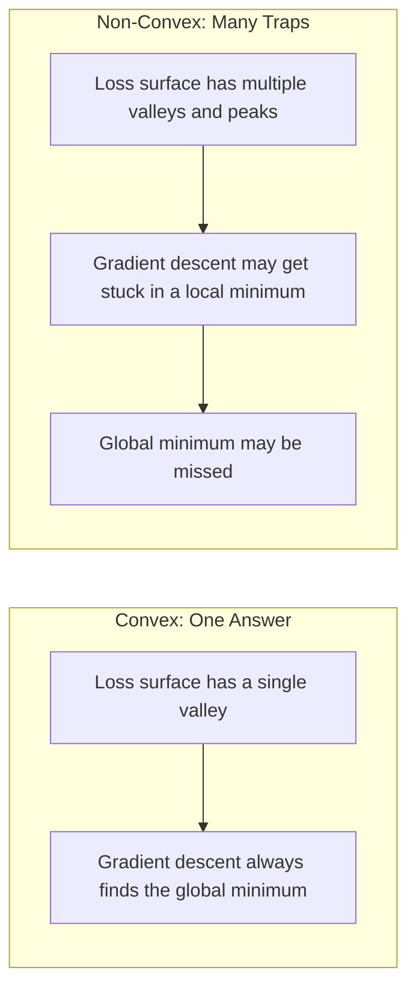
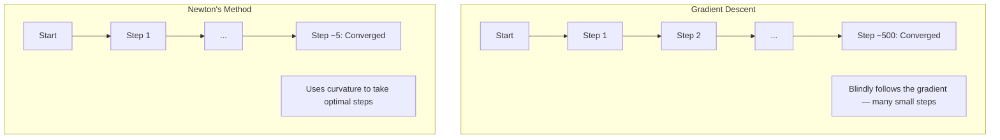
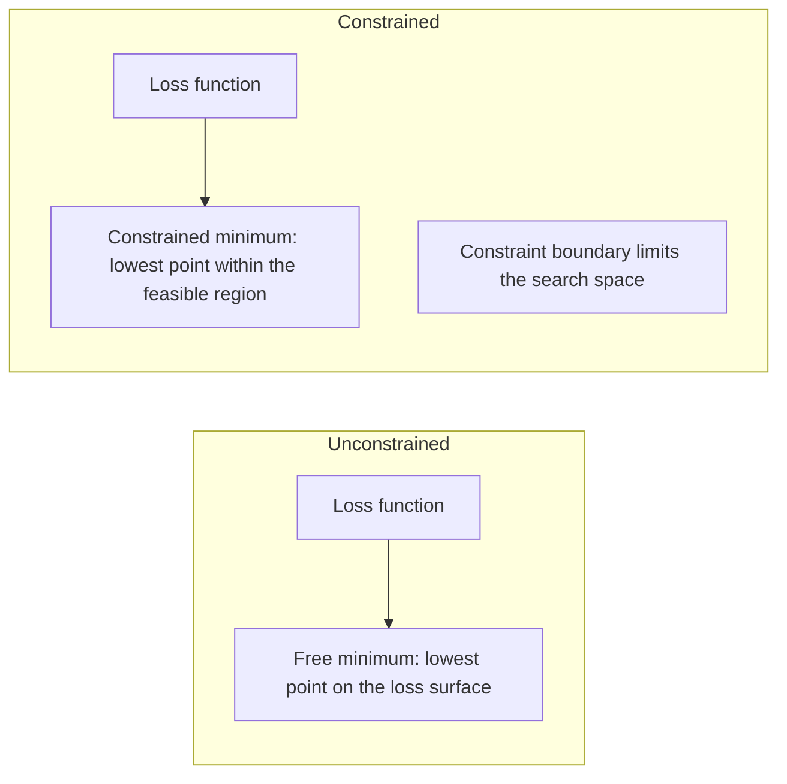
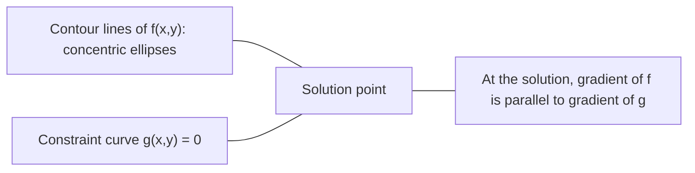

# Convex Optimization

> A convex problem has one valley. Neural networks have millions. Knowing the difference matters.

**Type:** Build
**Languages:** Python
**Prerequisites:** Phase 1, Lesson 04 (Calculus for ML), Lesson 08 (Optimization)
**Time:** ~90 minutes

## Learning Objectives

- Test whether a function is convex using the definition, second derivatives, and the Hessian criterion
- Implement Newton's method and compare its quadratic convergence to Gradient descent
- Solve constrained optimization with Lagrange multipliers and interpret KKT conditions
- Explain why Neural network Loss surfaces are non-convex yet SGD still finds good solutions

## The Problem

Lesson 08 taught you Gradient descent, momentum, and Adam. Those optimizers walk downhill on any surface. But they carry no guarantees. Gradient descent on a non-convex surface can fall into a bad local minimum, get stuck on a saddle point, or oscillate forever. You still use it because neural networks are non-convex and there's no alternative.

But many problems in ML are convex. Linear regression, logistic regression, SVM, LASSO, ridge regression. For these, something stronger exists: optimization with mathematical guarantees. A convex problem has exactly one valley. Any downhill algorithm reaches the global minimum. No restarts needed. No learning rate schedules. No praying.

Understanding convexity does three things. First, it tells you when a problem is easy (convex) vs hard (non-convex). Second, it gives you faster tools for convex problems, like Newton's method. Third, it explains concepts that run through ML: regularization as constraints, duality in SVMs, and why deep learning violates every nice property convexity gives you yet still works.

## The Concept

### Convex Sets

A set S is convex if for any two points in S, the line segment between them lies entirely within S.

| Convex Set | Non-Convex |
|---|---|
| **Rectangle**: any two interior points can be connected by a line segment that stays inside | **Star/Crescent shape**: a line between two interior points may pass outside the set |
| **Triangle**: all interior points share the same property | **Donut/Ring**: the hole means some line segments leave the set |
| The line segment between any two points stays within the set | The line segment between some pairs of points leaves the set |

Formal test: for any points x, y in S and any t in [0, 1], the point tx + (1-t)y is also in S.

Examples of convex sets:
- A line, a plane, all of R^n
- A ball (circle, sphere, hypersphere)
- A half-space: {x : a^T x <= b}
- The intersection of any number of convex sets

Examples of non-convex sets:
- A donut (ring)
- The union of two disjoint circles
- Any set with a "dent" or "hole"

### Convex Functions

A function f is convex if its domain is a convex set and for any two points x, y in its domain and any t in [0, 1]:

```
f(tx + (1-t)y) <= t*f(x) + (1-t)*f(y)
```

Geometrically: the line segment between any two points on the graph lies on or above the graph.

| Property | Convex Function | Non-Convex Function |
|---|---|---|
| **Line segment test** | The line between any two points on the graph lies **on or above** the curve | The line between some points on the graph **dips below** the curve |
| **Shape** | A single upward-curving bowl/valley | Multiple peaks and valleys with mixed curvature |
| **Local minima** | Every local minimum is a global minimum | Multiple local minima at different heights may exist |

Common convex functions:
- f(x) = x^2 (parabola)
- f(x) = |x| (absolute value)
- f(x) = e^x (exponential)
- f(x) = max(0, x) (ReLU, though piecewise linear)
- f(x) = -log(x) (negative log, for x > 0)
- Any linear function f(x) = a^T x + b (both convex and concave)

### Testing for Convexity

Three practical tests, from simplest to most rigorous.

**Test 1: Second derivative test (1D).** If f''(x) >= 0 for all x, then f is convex.

- f(x) = x^2: f''(x) = 2 >= 0. Convex.
- f(x) = x^3: f''(x) = 6x. Negative for x < 0. Not convex.
- f(x) = e^x: f''(x) = e^x > 0. Convex.

**Test 2: Hessian test (multivariate).** If the Hessian matrix H(x) is positive semidefinite for all x, then f is convex. The Hessian is the matrix of second partial derivatives.

**Test 3: Definition test.** Directly check the inequality f(tx + (1-t)y) <= t*f(x) + (1-t)*f(y). Useful for functions where derivatives are hard to compute.

### Why Convexity Matters

The central theorem of convex optimization:

**For a convex function, every local minimum is a global minimum.**

This means Gradient descent cannot get stuck. Any downhill path leads to the same answer. The algorithm is guaranteed to converge to the optimum.



Consequences:
- No random restarts needed
- No complex learning rate schedules
- Convergence proofs become possible (rate depends on function properties)
- The solution is unique (up to a flat region)

### Convex vs Non-Convex in ML

| Problem | Convex? | Why |
|---------|---------|-----|
| Linear regression (MSE) | Yes | Loss is quadratic in the weights |
| Logistic regression | Yes | Log-Loss is convex in the weights |
| SVM (hinge Loss) | Yes | Max of linear functions |
| LASSO (L1 regression) | Yes | Sum of convex functions is convex |
| Ridge regression (L2) | Yes | Quadratic + quadratic = convex |
| Neural network (any Loss) | No | Nonlinear activations create non-convex surfaces |
| k-means clustering | No | Discrete assignment step |
| Matrix factorization | No | Product of unknowns |

Linear models with convex losses are convex. Once you add hidden layers with nonlinear activations, convexity breaks.

### The Hessian Matrix

The Hessian H of a function f: R^n -> R is the n x n matrix of second partial derivatives.

```
H[i][j] = d^2 f / (dx_i dx_j)
```

For f(x, y) = x^2 + 3xy + y^2:

```
df/dx = 2x + 3y       d^2f/dx^2 = 2      d^2f/dxdy = 3
df/dy = 3x + 2y       d^2f/dydx = 3      d^2f/dy^2 = 2

H = [ 2  3 ]
    [ 3  2 ]
```

The Hessian tells you about curvature:
- All eigenvalues positive: function curves upward in every direction (convex at that point)
- All eigenvalues negative: curves downward in every direction (concave, a local maximum)
- Mixed signs: saddle point (curves up in some directions, down in others)
- Zero eigenvalues: flat in that direction (degenerate)

For convexity, the Hessian must be positive semidefinite everywhere (all eigenvalues >= 0), not just at one point.

### Newton's Method

Gradient descent uses first-order information (the Gradient). Newton's method uses second-order information (the Hessian). It fits a quadratic approximation at the current point and jumps directly to the minimum of that quadratic.

```
Update rule:
  x_new = x - H^(-1) * gradient

Compare to gradient descent:
  x_new = x - lr * gradient
```

Newton's method replaces the scalar learning rate with the inverse Hessian. This automatically scales step size and direction based on local curvature.



Advantages:
- Quadratic convergence near the minimum (error squares each step)
- No learning rate to tune
- Scale-invariant (works regardless of how you parameterize the problem)

Disadvantages:
- Computing the Hessian costs O(n^2) memory, inverting it costs O(n^3)
- For a million-weight Neural network, that's 10^12 elements and 10^18 operations
- Impractical for deep learning

### Constrained Optimization

Unconstrained optimization: minimize f(x) over all x.
Constrained optimization: minimize f(x) subject to constraints.

Real problems have constraints. You want to minimize cost but have a budget. You want to minimize error but model complexity is bounded.



### Lagrange Multipliers

The method of Lagrange multipliers converts a constrained problem into an unconstrained one.

Problem: minimize f(x) subject to g(x) = 0.

Solution: introduce a new variable (Lagrange multiplier lambda) and solve the unconstrained problem:

```
L(x, lambda) = f(x) + lambda * g(x)
```

At the solution, the Gradient of L is zero:

```
dL/dx = df/dx + lambda * dg/dx = 0
dL/dlambda = g(x) = 0
```

Geometric intuition: at the constrained minimum, the Gradient of f must be parallel to the Gradient of the constraint g. If they are not parallel, you can move along the constraint surface and further decrease f.



Example: minimize f(x,y) = x^2 + y^2 subject to x + y = 1.

```
L = x^2 + y^2 + lambda(x + y - 1)

dL/dx = 2x + lambda = 0  =>  x = -lambda/2
dL/dy = 2y + lambda = 0  =>  y = -lambda/2
dL/dlambda = x + y - 1 = 0

From first two: x = y
Substituting: 2x = 1, so x = y = 0.5, lambda = -1
```

The closest point to the origin on the line x + y = 1 is (0.5, 0.5).

### KKT Conditions

The Karush-Kuhn-Tucker conditions extend Lagrange multipliers to inequality constraints.

Problem: minimize f(x) subject to g_i(x) <= 0 for i = 1, ..., m.

KKT conditions (necessary conditions for optimality):

```
1. Stationarity:    df/dx + sum(lambda_i * dg_i/dx) = 0
2. Primal feasibility:  g_i(x) <= 0  for all i
3. Dual feasibility:    lambda_i >= 0  for all i
4. Complementary slackness:  lambda_i * g_i(x) = 0  for all i
```

Complementary slackness is the key insight: either a constraint is active (g_i = 0, the solution sits on the boundary) or its multiplier is zero (the constraint doesn't matter). A constraint that doesn't affect the solution has lambda = 0.

KKT conditions are central to SVMs. Support vectors are the data points where the constraint is active (lambda > 0). All other data points have lambda = 0 and don't affect the decision boundary.

### Regularization as Constrained Optimization

L1 and L2 regularization are not arbitrary tricks. They are constrained optimization problems in disguise.

**L2 Regularization (Ridge):**

```
minimize  Loss(w)  subject to  ||w||^2 <= t

Equivalent unconstrained form:
minimize  Loss(w) + lambda * ||w||^2
```

The constraint ||w||^2 <= t defines a ball (circle in 2D, sphere in 3D). The solution is where the Loss contours first touch this ball.

**L1 Regularization (LASSO):**

```
minimize  Loss(w)  subject to  ||w||_1 <= t

Equivalent unconstrained form:
minimize  Loss(w) + lambda * ||w||_1
```

The constraint ||w||_1 <= t defines a diamond (rotated square in 2D).

| Property | L2 Constraint (Circle) | L1 Constraint (Diamond) |
|---|---|---|
| **Constraint shape** | Circle (sphere in higher dimensions) | Diamond (rotated square in 2D) |
| **Where Loss contours touch** | Smooth boundary — anywhere on the circle | Corners — aligned with axes |
| **Solution behavior** | Weights are small but nonzero | Some weights are exactly zero (sparse) |
| **Result** | Weight shrinkage | Feature selection |

This explains why L1 produces sparse models (feature selection) while L2 only shrinks weights. The diamond has axis-aligned corners. Loss contours are more likely to touch a corner, setting one or more weights exactly to zero.

### Duality

Every constrained optimization problem (the primal) has a companion problem (the dual). For convex problems, the primal and dual have the same optimal value. This is strong duality.

The Lagrangian dual function:

```
Primal: minimize f(x) subject to g(x) <= 0
Lagrangian: L(x, lambda) = f(x) + lambda * g(x)
Dual function: d(lambda) = min_x L(x, lambda)
Dual problem: maximize d(lambda) subject to lambda >= 0
```

Why duality matters:
- The dual problem is sometimes easier to solve than the primal
- SVMs are solved in their dual form, where the problem depends on dot products between data points (enabling the kernel trick)
- The dual provides a lower bound on the primal optimum, useful for checking solution quality

For SVMs specifically:

```
Primal: find w, b that maximize the margin 2/||w|| subject to
        y_i(w^T x_i + b) >= 1 for all i

Dual:   maximize sum(alpha_i) - 0.5 * sum_ij(alpha_i * alpha_j * y_i * y_j * x_i^T x_j)
        subject to alpha_i >= 0 and sum(alpha_i * y_i) = 0

The dual only involves dot products x_i^T x_j.
Replace x_i^T x_j with K(x_i, x_j) to get the kernel trick.
```

### Why Deep Learning Is Non-Convex Yet Still Works

Neural network Loss functions are extremely non-convex. By every classical metric, optimizing them should fail. Yet stochastic Gradient descent reliably finds good solutions. Several factors explain this.

**Most local minima are already good enough.** In high-dimensional spaces, random critical points (where the Gradient is zero) are overwhelmingly saddle points, not local minima. The few local minima that exist tend to have Loss values close to the global minimum. When the parameter space has millions of dimensions, getting trapped in a bad local minimum is extremely unlikely.

**Saddle points, not local minima, are the real obstacle.** In a function with n parameters, saddle points have a mix of positive and negative curvature directions. For a random critical point in high dimensions, the probability that all n eigenvalues are positive (a local minimum) is roughly 2^(-n). Nearly all critical points are saddle points. SGD's noise helps escape them.

**Overparameterization smooths the surface.** Networks with more parameters than training samples have smoother, more connected Loss surfaces. Wider networks have fewer bad local minima. This is counterintuitive but empirically consistent.

**Loss surface structure:**

| Property | Low-Dimensional Space | High-Dimensional Space |
|---|---|---|
| **Surface** | Many isolated peaks and valleys | Smoothly connected valleys |
| **Minima** | Many isolated local minima | Few bad local minima; most are near-optimal |
| **Navigation** | Hard to find the global minimum | Many paths lead to good solutions |
| **Critical points** | Mix of local minima and saddle points | Overwhelmingly saddle points, not local minima |

**Stochastic noise acts as implicit regularization.** Mini-batch SGD's noise prevents settling into sharp minima. Sharp minima overfit; flat minima generalize. The noise biases optimization toward flat regions of the Loss surface.

### Second-Order Methods in Practice

Pure Newton's method is impractical for large models. Several approximations make second-order information usable.

**L-BFGS (Limited-memory BFGS):** Approximates the inverse Hessian using the last m Gradient differences. Requires O(mn) memory instead of O(n^2). Works well for problems up to ~10,000 parameters. Used in classical ML (logistic regression, CRFs), not in deep learning.

**Natural Gradient:** Replaces the standard Hessian with the Fisher information matrix (expected Hessian of the log-likelihood). This accounts for the geometry of probability distributions. K-FAC (Kronecker-Factored Approximate Curvature) approximates the Fisher matrix as Kronecker products, making it practical for neural networks.

**Hessian-free optimization:** Solves Hx = g using conjugate Gradients without ever constructing H. Only requires Hessian-vector products, which can be computed in O(n) time via automatic differentiation.

**Diagonal approximations:** Adam's second moment is a diagonal approximation of the Hessian diagonal. AdaHessian extends this by using actual Hessian diagonal elements via Hutchinson's estimator.

| Method | Memory | Per-step Cost | When to Use |
|--------|--------|--------------|-------------|
| Gradient descent | O(n) | O(n) | Baseline, large models |
| Newton's method | O(n^2) | O(n^3) | Small convex problems |
| L-BFGS | O(mn) | O(mn) | Medium convex problems |
| Adam | O(n) | O(n) | Deep learning default |
| K-FAC | O(n) | O(n) per layer | Research, large-batch training |

## Build It

### Step 1: Convexity Checker

Build a function that empirically tests convexity by sampling points and checking the definition.

```python
import random
import math

def check_convexity(f, dim, bounds=(-5, 5), samples=1000):
    violations = 0
    for _ in range(samples):
        x = [random.uniform(*bounds) for _ in range(dim)]
        y = [random.uniform(*bounds) for _ in range(dim)]
        t = random.uniform(0, 1)
        mid = [t * xi + (1 - t) * yi for xi, yi in zip(x, y)]
        lhs = f(mid)
        rhs = t * f(x) + (1 - t) * f(y)
        if lhs > rhs + 1e-10:
            violations += 1
    return violations == 0, violations
```

### Step 2: Newton's Method in 2D

Implement Newton's method with an explicit Hessian. Compare convergence speed against Gradient descent.

```python
def newtons_method(f, grad_f, hessian_f, x0, steps=50, tol=1e-12):
    x = list(x0)
    history = [x[:]]
    for _ in range(steps):
        g = grad_f(x)
        H = hessian_f(x)
        det = H[0][0] * H[1][1] - H[0][1] * H[1][0]
        if abs(det) < 1e-15:
            break
        H_inv = [
            [H[1][1] / det, -H[0][1] / det],
            [-H[1][0] / det, H[0][0] / det],
        ]
        dx = [
            H_inv[0][0] * g[0] + H_inv[0][1] * g[1],
            H_inv[1][0] * g[0] + H_inv[1][1] * g[1],
        ]
        x = [x[0] - dx[0], x[1] - dx[1]]
        history.append(x[:])
        if sum(gi ** 2 for gi in g) < tol:
            break
    return history
```

### Step 3: Lagrange Multiplier Solver

Solve constrained optimization by running Gradient descent on the Lagrangian.

```python
def lagrange_solve(f_grad, g_val, g_grad, x0, lr=0.01,
                   lr_lambda=0.01, steps=5000):
    x = list(x0)
    lam = 0.0
    history = []
    for _ in range(steps):
        fg = f_grad(x)
        gv = g_val(x)
        gg = g_grad(x)
        x = [
            xi - lr * (fgi + lam * ggi)
            for xi, fgi, ggi in zip(x, fg, gg)
        ]
        lam = lam + lr_lambda * gv
        history.append((x[:], lam, gv))
    return history
```

### Step 4: Comparing First-Order vs Second-Order

Run Gradient descent and Newton's method on the same quadratic. Count how many steps each takes to converge.

```python
def quadratic(x):
    return 5 * x[0] ** 2 + x[1] ** 2

def quadratic_grad(x):
    return [10 * x[0], 2 * x[1]]

def quadratic_hessian(x):
    return [[10, 0], [0, 2]]
```

Newton's method converges in 1 step (it's exact for quadratics). Gradient descent takes hundreds of steps because the Hessian eigenvalues differ by a factor of 5, creating an elongated valley.

## Use It

Convexity analysis directly applies when choosing ML models and solvers.

For convex problems (logistic regression, SVM, LASSO):
- Use specialized solvers (liblinear, CVXPY, scipy.optimize.minimize with method='L-BFGS-B')
- Expect a unique global solution
- Second-order methods are practical and fast

For non-convex problems (neural networks):
- Use first-order methods (SGD, Adam)
- Accept that solutions depend on initialization and randomness
- Use overparameterization, noise, and learning rate schedules as implicit regularization
- Don't waste time searching for the global minimum. A good local minimum suffices.

```python
from scipy.optimize import minimize

result = minimize(
    fun=lambda w: sum((y - X @ w) ** 2) + 0.1 * sum(w ** 2),
    x0=np.zeros(d),
    method='L-BFGS-B',
    jac=lambda w: -2 * X.T @ (y - X @ w) + 0.2 * w,
)
```

For SVMs, the dual form enables the kernel trick:

```python
from sklearn.svm import SVC

svm = SVC(kernel='rbf', C=1.0)
svm.fit(X_train, y_train)
print(f"Support vectors: {svm.n_support_}")
```

## Exercises

1. **Convexity gallery.** Use the checker to test these functions for convexity: f(x) = x^4, f(x) = sin(x), f(x,y) = x^2 + y^2, f(x,y) = x*y, f(x) = max(x, 0). Explain why each result makes sense.

2. **Newton vs Gradient descent race.** Run both methods on f(x,y) = 50*x^2 + y^2 from starting point (10, 10). How many steps does each need to reach Loss < 1e-10? What happens to Gradient descent as the condition number (ratio of largest to smallest Hessian eigenvalue) increases?

3. **Lagrange multiplier geometry.** Minimize f(x,y) = (x-3)^2 + (y-3)^2 subject to x + 2y = 4. Verify the solution by checking that the Gradient of f is parallel to the Gradient of g at the solution.

4. **Regularization constraints.** Implement L1-constrained optimization: minimize (x-3)^2 + (y-2)^2 subject to |x| + |y| <= 1. Show that the solution has one coordinate equal to zero (sparsity from the diamond constraint).

5. **Hessian eigenvalue analysis.** Compute the Hessian of the Rosenbrock function at (1,1) and (-1,1). Calculate the eigenvalues at both points. What do the eigenvalues tell you about curvature at the minimum vs away from it?

## Key Terms

| Term | What it means |
|------|---------------|
| Convex set | A set where the line segment between any two points in the set stays within the set |
| Convex function | A function where the line between any two points on the graph lies on or above the graph. Equivalently, the Hessian is positive semidefinite everywhere |
| Local minimum | A point lower than all nearby points. For convex functions, every local minimum is a global minimum |
| Global minimum | The lowest point of the function over its entire domain |
| Hessian matrix | The matrix of all second partial derivatives. Encodes curvature information |
| Positive semidefinite | A matrix with all non-negative eigenvalues. The multidimensional analogue of "second derivative >= 0" |
| Condition number | Ratio of the largest to smallest Hessian eigenvalue. High condition number means elongated valleys and slow Gradient descent |
| Newton's method | A second-order optimizer that uses the inverse Hessian to determine step direction and size. Quadratic convergence near the minimum |
| Lagrange multiplier | A variable introduced to convert a constrained optimization problem into an unconstrained one |
| KKT conditions | Necessary conditions for optimality with inequality constraints. Generalize Lagrange multipliers |
| Complementary slackness | At the solution, either a constraint is active or its multiplier is zero. Never both nonzero |
| Duality | Every constrained problem has a companion dual problem. For convex problems, both have the same optimal value |
| Strong duality | Primal and dual optimal values are equal. Holds for convex problems satisfying Slater's condition |
| L-BFGS | An approximate second-order method that stores the last m Gradient differences instead of the full Hessian |
| Saddle point | A point where the Gradient is zero but is a minimum in some directions and a maximum in others |
| Overparameterization | Using more parameters than training samples. Smooths the Loss surface and reduces bad local minima |

## Further Reading

- [Boyd & Vandenberghe: Convex Optimization](https://web.stanford.edu/~boyd/cvxbook/) - The standard textbook, freely available online
- [Bottou, Curtis, Nocedal: Optimization Methods for Large-Scale Machine Learning (2018)](https://arxiv.org/abs/1606.04838) - Bridges convex optimization theory and deep learning practice
- [Choromanska et al.: The Loss Surfaces of Multilayer Networks (2015)](https://arxiv.org/abs/1412.0233) - Why non-convex Neural network surfaces aren't as bad as they seem
- [Nocedal & Wright: Numerical Optimization](https://link.springer.com/book/10.1007/978-0-387-40065-5) - Comprehensive reference for Newton's method, L-BFGS, and constrained optimization
