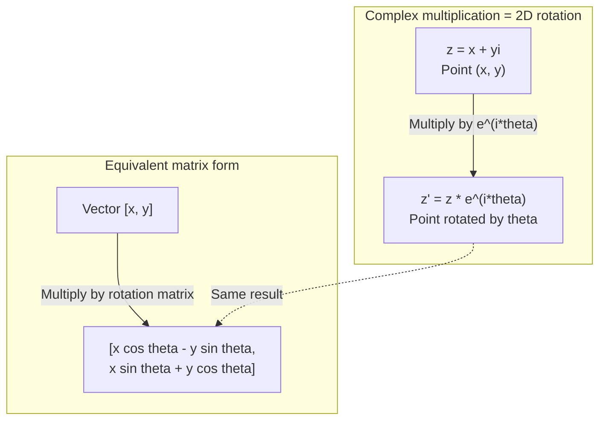
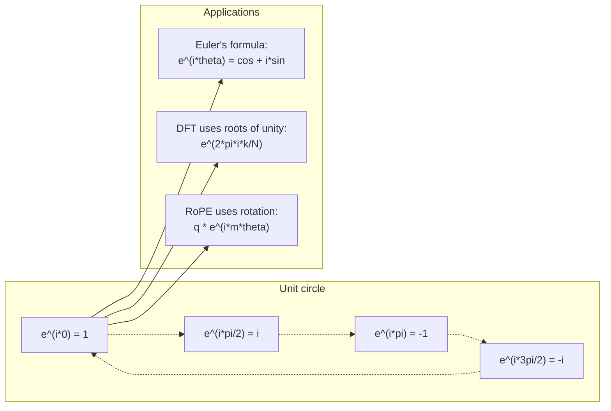

# Complex Numbers for AI

> The square root of -1 isn't imaginary. It's the key to rotation, frequency, and half of signal processing.

**Type:** Learn
**Languages:** Python
**Prerequisites:** Phase 1, Lessons 01-04 (Linear Algebra, Calculus)
**Time:** ~60 minutes

## Learning Objectives

- Perform complex arithmetic (addition, multiplication, division, conjugate) in both rectangular and polar form
- Apply Euler's formula to convert between complex exponentials and trigonometric functions
- Implement the discrete Fourier transform using roots of unity
- Explain how complex rotations underpin RoPE and sinusoidal positional encoding in transformers

## The Problem

You open a paper on Fourier transforms and `i` is everywhere. You look at transformer positional encodings and see `sin` and `cos` at different frequencies — the real and imaginary parts of complex exponentials. You read about quantum computing and everything uses complex vector spaces.

Complex numbers seem abstract. A number system built on the square root of -1 feels like a math trick. But it's not a trick. It's the natural language of rotation and oscillation. Whenever something rotates, vibrates, or oscillates, complex numbers are the right tool.

Without understanding complex numbers, you can't understand the discrete Fourier transform. Can't understand the FFT. Can't understand how RoPE (rotary positional encoding) works in modern language models. Can't understand why the sinusoidal positional encoding in the original Transformer paper uses the frequencies it uses.

This lesson builds complex arithmetic from scratch, connects it to geometry, and shows exactly where complex numbers appear in machine learning.

## The Concept

### What is a complex number?

A complex number has two parts: a real part and an imaginary part.

```
z = a + bi

where:
  a is the real part
  b is the imaginary part
  i is the imaginary unit, defined by i^2 = -1
```

That's it. You extend the number line into a plane. Real numbers live on one axis. Imaginary numbers live on the other. Every complex number is a point in this plane.

### Complex arithmetic

**Addition.** Add real parts, add imaginary parts.

```
(a + bi) + (c + di) = (a + c) + (b + d)i

Example: (3 + 2i) + (1 + 4i) = 4 + 6i
```

**Multiplication.** Distribute, and remember i^2 = -1.

```
(a + bi)(c + di) = ac + adi + bci + bdi^2
                 = ac + adi + bci - bd
                 = (ac - bd) + (ad + bc)i

Example: (3 + 2i)(1 + 4i) = 3 + 12i + 2i + 8i^2
                            = 3 + 14i - 8
                            = -5 + 14i
```

**Conjugate.** Flip the sign of the imaginary part.

```
conjugate of (a + bi) = a - bi
```

A complex number multiplied by its conjugate is always real:

```
(a + bi)(a - bi) = a^2 + b^2
```

**Division.** Multiply numerator and denominator by the conjugate of the denominator.

```
(a + bi) / (c + di) = (a + bi)(c - di) / (c^2 + d^2)
```

This eliminates the imaginary part from the denominator, giving you a clean complex number.

### The complex plane

The complex plane maps each complex number to a 2D point. The horizontal axis is the real axis; the vertical axis is the imaginary axis.

```
z = 3 + 2i  corresponds to the point (3, 2)
z = -1 + 0i corresponds to the point (-1, 0) on the real axis
z = 0 + 4i  corresponds to the point (0, 4) on the imaginary axis
```

A complex number is simultaneously a point and a vector from the origin. This dual interpretation is what makes complex numbers useful in geometry.

### Polar form

Any point in the plane can be described by its distance from the origin and its angle with the positive real axis.

```
z = r * (cos(theta) + i*sin(theta))

where:
  r = |z| = sqrt(a^2 + b^2)     (magnitude, or modulus)
  theta = atan2(b, a)             (phase, or argument)
```

Rectangular form (a + bi) is good for addition. Polar form (r, theta) is good for multiplication.

**Multiplication in polar form.** Magnitudes multiply, angles add.

```
z1 = r1 * e^(i*theta1)
z2 = r2 * e^(i*theta2)

z1 * z2 = (r1 * r2) * e^(i*(theta1 + theta2))
```

This is why complex numbers are a perfect fit for rotation. Multiplying by a complex number with magnitude 1 is a pure rotation.

### Euler's formula

The bridge between complex exponentials and trigonometry:

```
e^(i*theta) = cos(theta) + i*sin(theta)
```

This is the most important formula in this lesson. When theta = pi:

```
e^(i*pi) = cos(pi) + i*sin(pi) = -1 + 0i = -1

Therefore: e^(i*pi) + 1 = 0
```

Five fundamental constants (e, i, pi, 1, 0) connected in one equation.

### Why Euler's formula matters for ML

Euler's formula says `e^(i*theta)` traces the unit circle as theta varies. At theta = 0, you're at (1, 0). At theta = pi/2, you're at (0, 1). At theta = pi, you're at (-1, 0). At theta = 3*pi/2, you're at (0, -1). A full loop is theta = 2*pi.

This means complex exponentials are rotations. And rotations are everywhere in signal processing and ML.

### Connection to 2D rotation

Multiplying the complex number (x + yi) by e^(i*theta) rotates the point (x, y) by angle theta around the origin.

```
Rotation via complex multiplication:
  (x + yi) * (cos(theta) + i*sin(theta))
  = (x*cos(theta) - y*sin(theta)) + (x*sin(theta) + y*cos(theta))i

Rotation via matrix multiplication:
  [cos(theta)  -sin(theta)] [x]   [x*cos(theta) - y*sin(theta)]
  [sin(theta)   cos(theta)] [y] = [x*sin(theta) + y*cos(theta)]
```

They produce identical results. Complex multiplication is 2D rotation. The rotation matrix is just complex multiplication written in matrix notation.



### Phasors and rotating signals

The complex exponential e^(i*omega*t) is a point rotating around the unit circle at angular frequency omega. As t increases, the point traces out the circle.

The real part of this rotating point is cos(omega*t). The imaginary part is sin(omega*t). A sinusoidal signal is the shadow of a rotating complex number.

```
e^(i*omega*t) = cos(omega*t) + i*sin(omega*t)

Real part:      cos(omega*t)    -- a cosine wave
Imaginary part: sin(omega*t)    -- a sine wave
```

This is phasor representation. Instead of tracking a wiggling sine wave, you track a smoothly rotating arrow. Phase shifts become angular offsets. Amplitude changes become modulus changes. Adding signals becomes vector addition.

### Roots of unity

The N-th roots of unity are N equally-spaced points on the unit circle:

```
w_k = e^(2*pi*i*k/N)    for k = 0, 1, 2, ..., N-1
```

For N = 4, the roots are: 1, i, -1, -i (the four cardinal points).
For N = 8, you get the four cardinal points plus four diagonals.

Roots of unity are the foundation of the discrete Fourier transform. The DFT decomposes a signal into components at these N equally-spaced frequencies.

### Connection to the DFT

The discrete Fourier transform of a signal x[0], x[1], ..., x[N-1] is:

```
X[k] = sum_{n=0}^{N-1} x[n] * e^(-2*pi*i*k*n/N)
```

Each X[k] measures how much the signal correlates with the k-th root of unity — a complex sinusoid at frequency k. The DFT breaks a signal into N rotating phasors and tells you the amplitude and phase of each one.

### Why i isn't imaginary

The word "imaginary" is a historical accident. Descartes used it dismissively. But i is no more imaginary than negative numbers — which people also initially rejected. Negative numbers answer "subtract what from 3 to get 5?" The imaginary unit answers "what squares to -1?"

More usefully: i is a 90-degree rotation operator. Multiply a real number by i once, and you rotate 90 degrees onto the imaginary axis. Multiply by i again (i^2), and you rotate another 90 degrees — now you point in the negative real direction. That's why i^2 = -1. It's not mysterious. It's two quarter-turns making a half-turn.

This is why complex numbers are everywhere in engineering. Anything that rotates — electromagnetic waves, quantum states, signal oscillations, positional encodings — is naturally described by complex numbers.

### Complex exponentials vs trigonometric functions

Before Euler's formula, engineers wrote signals as A*cos(omega*t + phi) — amplitude A, frequency omega, phase phi. This works but makes arithmetic painful. Adding two cosines with different phases requires trig identities.

With complex exponentials, the same signal is A*e^(i*(omega*t + phi)). Adding two signals is adding two complex numbers. Multiplying (modulation) is multiplying magnitudes and adding angles. Phase shifts become angle additions. Frequency shifts become phasor multiplication.

The entire field of signal processing switched to complex exponential notation because the math is cleaner. The "real signal" is always just the real part of the complex representation. The imaginary part is carried along as bookkeeping to make all the algebra work naturally.

### Connection to transformers

**Sinusoidal positional encoding** (original Transformer paper):

```
PE(pos, 2i) = sin(pos / 10000^(2i/d))
PE(pos, 2i+1) = cos(pos / 10000^(2i/d))
```

These sin and cos pairs are the real and imaginary parts of complex exponentials at different frequencies. Each frequency provides a different "resolution" for encoding position. Low frequencies change slowly (coarse position). High frequencies change quickly (fine position). Together they give each position a unique frequency fingerprint.

**RoPE (Rotary Positional Encoding)** goes further. It explicitly multiplies query and key vectors by complex rotation matrices. The relative position between two tokens becomes a rotation angle. Attention is computed with these rotated vectors, making the model sensitive to relative position through complex multiplication.

| Operation | Algebraic form | Geometric meaning |
|-----------|---------------|-------------------|
| Addition | (a+c) + (b+d)i | Vector addition in the plane |
| Multiplication | (ac-bd) + (ad+bc)i | Rotate and scale |
| Conjugate | a - bi | Reflection across real axis |
| Magnitude | sqrt(a^2 + b^2) | Distance from origin |
| Phase | atan2(b, a) | Angle to positive real axis |
| Division | Multiply by conjugate | Reverse rotation and rescale |
| Power | r^n * e^(i*n*theta) | Rotate n times, scale by r^n |



## Build It

### Step 1: Complex class

Build a Complex number class supporting arithmetic, magnitude, phase, and conversion between rectangular and polar forms.

```python
import math

class Complex:
    def __init__(self, real, imag=0.0):
        self.real = real
        self.imag = imag

    def __add__(self, other):
        return Complex(self.real + other.real, self.imag + other.imag)

    def __mul__(self, other):
        r = self.real * other.real - self.imag * other.imag
        i = self.real * other.imag + self.imag * other.real
        return Complex(r, i)

    def __truediv__(self, other):
        denom = other.real ** 2 + other.imag ** 2
        r = (self.real * other.real + self.imag * other.imag) / denom
        i = (self.imag * other.real - self.real * other.imag) / denom
        return Complex(r, i)

    def magnitude(self):
        return math.sqrt(self.real ** 2 + self.imag ** 2)

    def phase(self):
        return math.atan2(self.imag, self.real)

    def conjugate(self):
        return Complex(self.real, -self.imag)
```

### Step 2: Polar conversion and Euler's formula

```python
def to_polar(z):
    return z.magnitude(), z.phase()

def from_polar(r, theta):
    return Complex(r * math.cos(theta), r * math.sin(theta))

def euler(theta):
    return Complex(math.cos(theta), math.sin(theta))
```

Verify: `euler(theta).magnitude()` should always be 1.0. `euler(0)` should give (1, 0). `euler(pi)` should give (-1, 0).

### Step 3: Rotation

Rotating the point (x, y) by angle theta is a complex multiplication:

```python
point = Complex(3, 4)
rotated = point * euler(math.pi / 4)
```

The magnitude stays the same. Only the angle changes.

### Step 4: DFT with complex arithmetic

```python
def dft(signal):
    N = len(signal)
    result = []
    for k in range(N):
        total = Complex(0, 0)
        for n in range(N):
            angle = -2 * math.pi * k * n / N
            total = total + Complex(signal[n], 0) * euler(angle)
        result.append(total)
    return result
```

This is the O(N^2) DFT. Each output X[k] is the sum of signal samples multiplied by roots of unity.

### Step 5: Inverse DFT

The inverse DFT reconstructs the original signal from the spectrum. The only changes from the forward DFT: flip the sign in the exponent, and divide by N.

```python
def idft(spectrum):
    N = len(spectrum)
    result = []
    for n in range(N):
        total = Complex(0, 0)
        for k in range(N):
            angle = 2 * math.pi * k * n / N
            total = total + spectrum[k] * euler(angle)
        result.append(Complex(total.real / N, total.imag / N))
    return result
```

This gives you perfect reconstruction. Apply DFT then IDFT and you get the original signal back, exact to machine precision. No information is lost.

### Step 6: Roots of unity

```python
def roots_of_unity(N):
    return [euler(2 * math.pi * k / N) for k in range(N)]
```

Verify two properties:
- Each root has magnitude exactly 1.
- All N roots sum to zero (they cancel by symmetry).

These properties are what make the DFT invertible. Roots of unity form an orthogonal basis for the frequency domain.

## Use It

Python has built-in complex number support. The literal `j` denotes the imaginary unit.

```python
z = 3 + 2j
w = 1 + 4j

print(z + w)
print(z * w)
print(abs(z))

import cmath
print(cmath.phase(z))
print(cmath.exp(1j * cmath.pi))
```

For arrays, numpy handles complex numbers natively:

```python
import numpy as np

z = np.array([1+2j, 3+4j, 5+6j])
print(np.abs(z))
print(np.angle(z))
print(np.conj(z))
print(np.real(z))
print(np.imag(z))

signal = np.sin(2 * np.pi * 5 * np.linspace(0, 1, 128))
spectrum = np.fft.fft(signal)
freqs = np.fft.fftfreq(128, d=1/128)
```

## Ship It

Run `code/complex_numbers.py` to generate `outputs/skill-complex-arithmetic.md`.

## Exercises

1. **Hand-calculate complex arithmetic.** Compute (2 + 3i) * (4 - i) and verify with code. Then compute (5 + 2i) / (1 - 3i). Plot both results on the complex plane and check whether multiplication rotated and scaled the first number.

2. **Rotation sequence.** Start at point (1, 0). Multiply by e^(i*pi/6) twelve times. Verify that after 12 multiplications you return to (1, 0). Print the coordinates at each step and confirm they trace a regular 12-gon.

3. **DFT of a known signal.** Create a signal that is sin(2*pi*3*t) + 0.5*sin(2*pi*7*t), sampled at 32 points. Run your DFT. Verify the magnitude spectrum has peaks at frequencies 3 and 7, with the peak at 7 half the height of the peak at 3.

4. **Roots of unity visualization.** Compute the 8th roots of unity. Verify they sum to zero. Verify that multiplying any root by the primitive root e^(2*pi*i/8) gives the next root.

5. **Rotation matrix equivalence.** For 10 random angles and 10 random points, verify that complex multiplication and matrix-vector multiplication with the 2x2 rotation matrix give the same result. Print the maximum numerical difference.

## Key Terms

| Term | Meaning |
|------|---------------|
| Complex number | A number a + bi where a is the real part, b is the imaginary part, and i^2 = -1 |
| Imaginary unit | The number i, defined by i^2 = -1. Not philosophically imaginary — it's a rotation operator |
| Complex plane | A 2D plane with real on x-axis and imaginary on y-axis. Also called the Argand plane |
| Magnitude | Distance from the origin: sqrt(a^2 + b^2). Written as \|z\| |
| Phase (argument) | Angle to the positive real axis: atan2(b, a). Written as arg(z) |
| Conjugate | Mirror image across the real axis: conjugate of a + bi is a - bi |
| Polar form | Expressing z as r * e^(i*theta) instead of a + bi. Makes multiplication simple |
| Euler's formula | e^(i*theta) = cos(theta) + i*sin(theta). Connects exponentials and trigonometry |
| Phasor | A rotating complex number e^(i*omega*t), representing a sinusoidal signal |
| Roots of unity | N complex numbers e^(2*pi*i*k/N) (k = 0 to N-1). N equally-spaced points on the unit circle |
| DFT | Discrete Fourier Transform. Decomposes a signal into complex sinusoidal components using roots of unity |
| RoPE | Rotary Positional Encoding. Encodes relative position in transformer attention via complex multiplication |

## Further Reading

- [Visual Introduction to Euler's Formula](https://betterexplained.com/articles/intuitive-understanding-of-eulers-formula/) - Builds geometric intuition without heavy notation
- [Su et al.: RoFormer (2021)](https://arxiv.org/abs/2104.09864) - Paper introducing rotary positional encoding via complex rotations
- [Vaswani et al.: Attention Is All You Need (2017)](https://arxiv.org/abs/1706.03762) - Original Transformer paper with sinusoidal positional encoding
- [3Blue1Brown: Euler's formula with introductory group theory](https://www.youtube.com/watch?v=mvmuCPvRoWQ) - Visual explanation of why e^(i*pi) = -1
- [Needham: Visual Complex Analysis](https://global.oup.com/academic/product/visual-complex-analysis-9780198534464) - The best visual treatment of complex numbers, full of geometric insight
- [Strang: Introduction to Linear Algebra, Ch. 10](https://math.mit.edu/~gs/linearalgebra/) - Complex numbers in the context of linear algebra and eigenvalues
