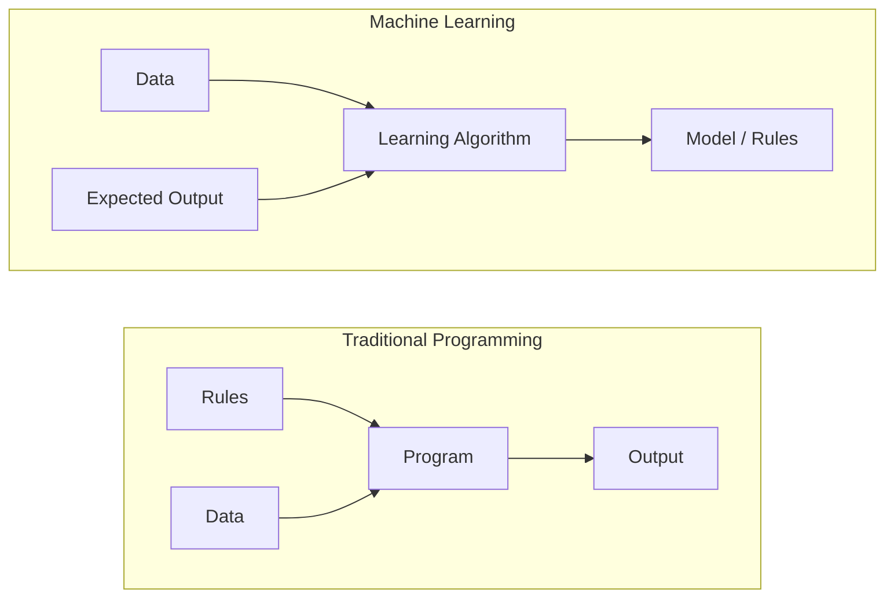
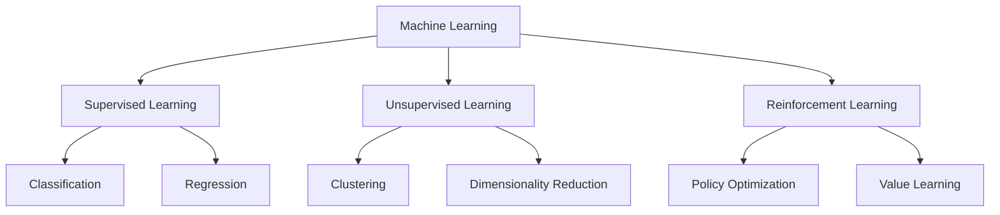
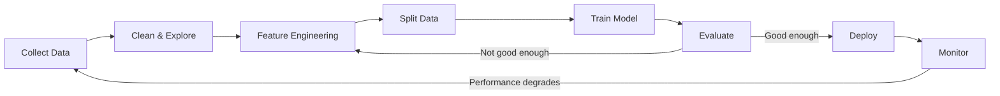
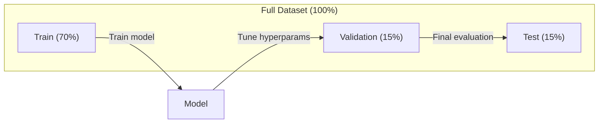
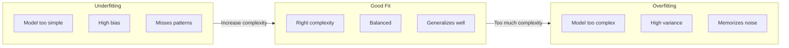
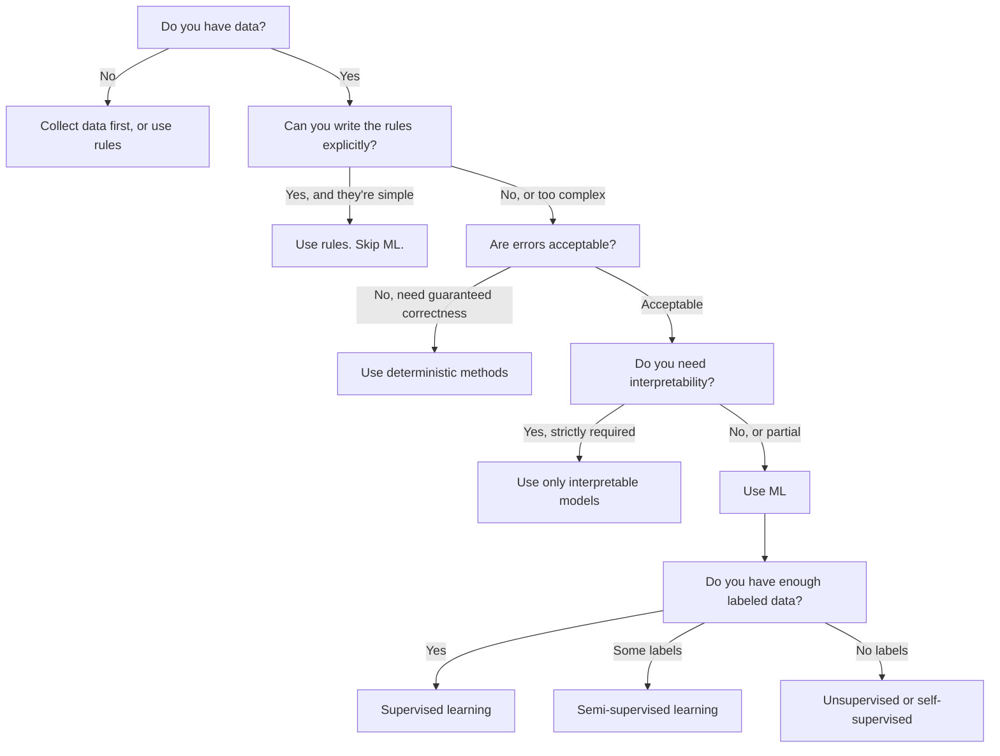

# What Is Machine Learning

> Machine learning teaches computers to find patterns in data instead of relying on hand-written rules.

**Type:** Learn
**Languages:** Python
**Prerequisites:** Phase 1 (Math Foundations)
**Time:** ~45 minutes

## Learning Objectives

- Distinguish supervised, unsupervised, and reinforcement learning, and classify a given problem into the right category
- Implement a nearest centroid classifier from scratch and evaluate it against a random baseline
- Differentiate classification from regression tasks and choose appropriate loss functions for each
- Determine whether a business problem calls for ML or is better solved with deterministic rules

## The Problem

You want to build a spam filter. The traditional approach: sit down and write hundreds of rules. "If the email contains 'FREE MONEY,' mark it spam. More than 3 exclamation marks? Spam." You spend weeks writing rules. Then spammers change their wording and your rules break. You write more rules. The cycle never ends.

Machine learning flips this around. Instead of writing rules, you feed the computer thousands of labeled emails ("spam" or "not spam") and let it figure out the rules itself. The patterns it finds are ones you'd never think of. When spammers change tactics, you retrain on new data instead of rewriting code.

This shift from "writing rules" to "learning from data" is the core of machine learning. Every recommendation engine, voice assistant, self-driving car, and language model works this way.

## The Concept

### Learning from Data, Not Rules

Traditional programming and machine learning solve problems in opposite directions.



Traditional programming: you write rules, the program applies them to data to produce output.

Machine learning: you provide data and expected output, the algorithm discovers the rules.

The trained "model" is itself the rules, encoded as numbers (weights, parameters). It generalizes from examples it has seen to make predictions on data it has never seen.

### Three Types of Machine Learning



**Supervised learning**: You have input-output pairs. The model learns to map inputs to outputs.
- "Here are 10,000 photos labeled cat or dog. Learn to tell them apart."
- "Here are house features and prices. Learn to predict prices."

**Unsupervised learning**: You have only inputs, no labels. The model finds structure on its own.
- "Here are 10,000 customer purchase records. Find natural groupings."
- "Here are 1000-dimensional data points. Reduce to 2 dimensions while preserving structure."

**Reinforcement learning**: An agent takes actions in an environment and receives rewards or penalties. It learns a policy that maximizes cumulative reward.
- "Play this game. Win +1, lose -1. Figure out the strategy."
- "Control this robotic arm. Pick up object +1, waste a second -0.01."

Most of what you build in practice uses supervised learning. Unsupervised learning is common for preprocessing and exploration. Reinforcement learning powers game AI, robotics, and RLHF for language models.

### Beyond the Three Types

The three categories above are clean, but real-world ML often blurs the boundaries.

**Semi-supervised learning** uses a small amount of labeled data plus a large amount of unlabeled data. You might have 100 labeled medical images and 100,000 unlabeled ones. Common techniques include:

- **Label propagation:** Build a graph connecting similar data points. Labels spread from labeled nodes to unlabeled neighbors along the graph.
- **Pseudo-labeling:** Train a model on labeled data, use it to predict labels for unlabeled data, then retrain on everything. The model bootstraps its own training set.
- **Consistency regularization:** For an input and its slightly perturbed version, the model should give the same prediction. This works without any labels.

**Self-supervised learning** creates supervision from the data itself, requiring no human annotation. The model creates its own prediction task from the structure of the data.

- **Masked language modeling (BERT):** Mask 15% of words in a sentence, train the model to predict masked words. "Labels" come from the original text.
- **Contrastive learning (SimCLR):** Take an image, create two augmented versions. Train the model to recognize they come from the same image while distinguishing them from augmented versions of other images.
- **Next token prediction (GPT):** Given all preceding words, predict the next word. Every text becomes a training sample.

These aren't separate categories parallel to the three types — they're strategies that combine supervised and unsupervised ideas. Self-supervised learning is technically supervised (the model predicts something), but labels are generated automatically rather than by humans.

### Classification vs Regression

These are the two main supervised learning tasks.

| Dimension | Classification | Regression |
|--------|---------------|------------|
| Output | Discrete categories | Continuous values |
| Example | "Is this email spam?" | "What will the house price be?" |
| Output space | {cat, dog, bird} | Any real number |
| Loss function | Cross-entropy, accuracy | Mean squared error, MAE |
| Decision | Boundaries between classes | A curve fitting the data |

Classification answers "which class?" Regression answers "how much?"

Some problems can be framed either way. Predicting whether a stock goes up or down is classification; predicting the exact price is regression.

### ML Workflow

Regardless of algorithm, every machine learning project follows the same pipeline.



**Collect data**: Gather raw data. More data is almost always better, but quality matters more than quantity.

**Clean & explore**: Handle missing values, remove duplicates, visualize distributions, spot anomalies. This step often consumes 60-80% of project time.

**Feature engineering**: Transform raw data into features the model can use. Convert dates to day-of-week, normalize numeric columns, encode categorical variables. Good features matter more than fancy algorithms.

**Split data**: Divide into training, validation, and test sets. The model trains on training data, you tune hyperparameters on validation data, and report final performance on test data.

**Train model**: Feed training data to the algorithm. The algorithm adjusts internal parameters to minimize a loss function.

**Evaluate**: Measure performance on validation/test data. If performance falls short, go back and try different features, algorithms, or hyperparameters.

**Deploy**: Put the model into production to make predictions on new data.

**Monitor**: Track performance over time. Data distributions shift (data drift), and models degrade. Retrain when performance drops.

### Train, Validation, and Test Sets

This is the concept beginners get wrong most often. You must evaluate the model on data it has never seen during training — otherwise you're measuring memorization, not learning.



| Split | Purpose | When used | Typical share |
|-------|---------|-----------|-------------|
| Train | Model learns from this data | During training | 60-80% |
| Validation | Tune hyperparameters, compare models | After each training run | 10-20% |
| Test | Final unbiased performance estimate | Only once at the end | 10-20% |

The test set is sacred — you look at it only once. If you keep tweaking the model based on test performance, you're effectively training on the test set, and your reported numbers become meaningless.

For small datasets, use k-fold cross-validation: split data into k parts, train on k-1, validate on the remaining one, rotate, and average results.

### Overfitting vs Underfitting



**Underfitting**: The model is too simple to capture patterns in the data. A straight line fit to a curved relationship. High training error, high test error.

**Overfitting**: The model is too complex and memorizes training data including noise. A curve that passes through every training point but fails on new data. Low training error, high test error.

**Good fit**: The model captures real patterns without memorizing noise. Both training and test error are reasonably low.

Signs of overfitting:
- Training accuracy far exceeds validation accuracy
- Model performs well on training data but poorly on new data
- Adding more training data improves performance (indicates the model was memorizing, not learning)

Fixes for overfitting:
- Get more training data
- Reduce model complexity (fewer parameters, simpler architecture)
- Regularization (penalize large weights)
- Dropout (randomly zero out neurons during training)
- Early stopping (stop training when validation error starts rising)

Fixes for underfitting:
- Use a more complex model
- Add more features
- Reduce regularization
- Train longer

### Bias-Variance Tradeoff

This is the mathematical framework behind overfitting and underfitting.

**Bias**: Error from wrong assumptions in the model. A linear model has high bias when the true relationship is nonlinear. High bias causes underfitting.

**Variance**: Error from the model being too sensitive to small fluctuations in training data. A high-variance model produces very different predictions when trained on different subsets of data. High variance causes overfitting.

| Model complexity | Bias | Variance | Result |
|-----------------|------|----------|--------|
| Too low (linear model on curved data) | High | Low | Underfitting |
| Just right | Medium | Medium | Generalizes well |
| Too high (degree-20 polynomial on 10 points) | Low | High | Overfitting |

Total error = Bias² + Variance + Irreducible noise

You can't reduce irreducible noise (it's randomness in the data itself). You're looking for the sweet spot that minimizes Bias² + Variance.

### No Free Lunch Theorem

No single algorithm is best for all problems. An algorithm that excels on one class of problems will perform poorly on another. That's why data scientists try multiple algorithms and compare results.

In practice, the choice depends on:
- How much data you have
- How many features
- Whether the relationship is linear or nonlinear
- Whether you need interpretability
- How much compute you can afford

### When Not to Use Machine Learning

ML is powerful but not always the right tool. Before reaching for a model, ask whether you actually need one.

**Don't use ML when:**

- **Rules are simple and well-defined.** Tax calculations, sorting algorithms, unit conversions. If the logic fits in a few if-statements, a model adds complexity with no benefit.
- **You have no data, or very little data.** ML needs examples to learn from. With only 10 data points, you can't train anything meaningful. Collect data first.
- **Errors are catastrophic and you need guaranteed correctness.** Medical dosage calculations, nuclear reactor control, cryptographic verification. ML models are probabilistic — they're sometimes wrong. If "sometimes wrong" is unacceptable, use deterministic methods.
- **A lookup table or heuristic solves the problem.** If a simple threshold or table covers 99% of cases, ML only adds maintenance cost with no real improvement.
- **You can't explain decisions but must.** Regulated industries (credit, insurance, criminal justice) sometimes require every decision to be fully explainable. Some ML models are interpretable (linear regression, small decision trees); most aren't.
- **The problem changes faster than you can retrain.** If rules change daily and retraining takes a week, the model is always stale.

Use this decision flowchart:



## Build It

The code in `code/ml_intro.py` implements a nearest centroid classifier from scratch — the simplest ML algorithm. It demonstrates the core idea: learn from data, then predict on new data.

### Step 1: Implement Nearest Centroid Classifier from Scratch

The nearest centroid classifier computes the center (mean) of each class in the training data. At prediction time, it assigns each new point to the class whose center is closest.

```python
class NearestCentroid:
    def fit(self, X, y):
        self.classes = np.unique(y)
        self.centroids = np.array([
            X[y == c].mean(axis=0) for c in self.classes
        ])

    def predict(self, X):
        distances = np.array([
            np.sqrt(((X - c) ** 2).sum(axis=1))
            for c in self.centroids
        ])
        return self.classes[distances.argmin(axis=0)]
```

The entire algorithm is right there. fit computes two means, predict computes distances. No gradient descent, no iteration, no hyperparameters.

### Step 2: Train on Synthetic Data

We generate a 2D classification dataset with two slightly overlapping classes. The centroid classifier draws a linear decision boundary between the two class centers.

```python
rng = np.random.RandomState(42)
X_class0 = rng.randn(100, 2) + np.array([1.0, 1.0])
X_class1 = rng.randn(100, 2) + np.array([-1.0, -1.0])
X = np.vstack([X_class0, X_class1])
y = np.array([0] * 100 + [1] * 100)
```

### Step 3: Compare Against a Baseline

Every ML model should be compared to a trivial baseline. Here the baseline predicts a random class. If your ML model can't beat random guessing, something is wrong.

```python
baseline_preds = rng.choice([0, 1], size=len(y_test))
baseline_acc = np.mean(baseline_preds == y_test)
```

On this clean dataset, the centroid classifier should achieve 90%+ accuracy. The random baseline gets around 50%.

### Why This Matters

The nearest centroid classifier is as simple as it gets. No hyperparameters, no iteration, no gradient descent. But it captures the fundamental ML pattern:

1. **Learn** a representation from training data (centroids)
2. **Predict** on new data using that representation (nearest distance)
3. **Evaluate** against a baseline (random guessing)

From logistic regression to transformers, every ML algorithm follows this same three-step pattern. The representation gets more complex, but the workflow stays the same.

### Step 4: What the Centroid Classifier Can't Do

The nearest centroid classifier assumes each class is a single blob. It draws linear decision boundaries. It fails when:

- Classes have multiple clusters (e.g., the digit "1" has several handwriting styles)
- Decision boundaries are nonlinear (e.g., one class wraps around another)
- Features have vastly different scales (distance gets dominated by the largest-scale feature)

These limitations motivate every other algorithm you'll learn. K-nearest neighbors handles multiple clusters. Decision trees handle nonlinear boundaries. Feature scaling fixes the scale problem. Each lesson builds on the limitations of the previous one.

## Use It

sklearn provides `NearestCentroid` and synthetic data generators:

```python
from sklearn.neighbors import NearestCentroid
from sklearn.datasets import make_classification
from sklearn.model_selection import train_test_split

X, y = make_classification(
    n_samples=500, n_features=2, n_redundant=0,
    n_clusters_per_class=1, random_state=42
)
X_train, X_test, y_train, y_test = train_test_split(X, y, test_size=0.3)

clf = NearestCentroid()
clf.fit(X_train, y_train)
print(f"Accuracy: {clf.score(X_test, y_test):.3f}")
```

## Ship It

This lesson produces `outputs/prompt-ml-problem-framer.md` — a prompt that turns vague business problems into concrete ML tasks. Feed it a problem description ("we want to reduce churn" or "predict next quarter demand") and it identifies the learning type, defines prediction targets, lists candidate features, picks success metrics, establishes baselines, and flags pitfalls like data leakage or class imbalance. Use it at the start of any ML project to avoid building the wrong thing.

## Key Terms

| Term | What people say | What it actually is |
|------|----------------|----------------------|
| Model | "the AI" | A mathematical function with learnable parameters that maps inputs to outputs |
| Training | "teaching the AI" | Running an optimization algorithm to adjust model parameters so predictions match known outputs |
| Feature | "an input column" | A measurable property of the data that the model uses to make predictions |
| Label | "the answer" | The known output of a training example, used to compute the error signal |
| Hyperparameter | "a knob you turn" | A parameter set before training that controls the learning process (learning rate, number of layers) |
| Loss function | "how wrong the model is" | A function measuring the gap between predictions and true outputs; training minimizes it |
| Overfitting | "it memorized the test" | The model learns noise specific to training data rather than general patterns, failing on new data |
| Underfitting | "it learned nothing" | The model is too simple to capture real patterns in the data |
| Generalization | "it works on new data" | The model's ability to make accurate predictions on data it was never trained on |
| Cross-validation | "test on different chunks" | Repeatedly splitting data into train/test folds and averaging results for more robust performance estimates |
| Regularization | "keep the weights small" | Adding a penalty term to the loss function to discourage overly complex models |
| Data drift | "the world changed" | The statistical distribution of incoming data shifts over time, causing model performance to degrade |

## Exercises

1. Take any dataset (e.g., Iris, Titanic) and split it 70/15/15 into train/validation/test. Explain why you cannot tune hyperparameters on the test set.
2. List three real-world problems. For each, determine whether it's classification, regression, or clustering, and whether it's supervised or unsupervised.
3. A model achieves 99% accuracy on training data but only 60% on test data. Diagnose the problem and list three things you'd try to fix it.

## Further Reading

- [An Introduction to Statistical Learning](https://www.statlearning.com/) - Free textbook covering all classic ML methods with practical examples
- [Google's Machine Learning Crash Course](https://developers.google.com/machine-learning/crash-course) - Concise visual introduction to ML concepts
- [Scikit-learn User Guide](https://scikit-learn.org/stable/user_guide.html) - Practical reference for implementing ML in Python
