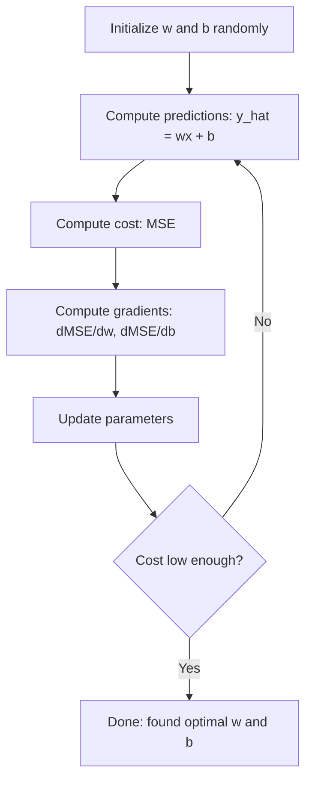

# Linear Regression

> Linear regression draws the best-fit line through your data. It's the "hello world" of machine learning.

**Type:** Build
**Languages:** Python
**Prerequisites:** Phase 1 (Linear Algebra, Calculus, Optimization), Phase 2 Lesson 1
**Time:** ~90 minutes

## Learning Objectives

- Derive the gradient descent update rule for mean squared error and implement linear regression from scratch
- Compare gradient descent and the normal equation in terms of computational complexity and use cases
- Build a multiple linear regression model with feature standardization and interpret the learned weights
- Explain how Ridge regression (L2 regularization) prevents overfitting by penalizing large weights

## The Problem

You have data: a set of houses with their square footage and sale prices. You want to predict the price of a new house given its size. You could eyeball a scatter plot, but you need a formula. You need the line that best fits the data so that plugging in any size gives a price prediction.

Linear regression gives you that line. More importantly, it introduces the entire ML training loop: define a model, define a cost function, optimize parameters. Every ML algorithm follows this same pattern. Master it here in the simplest case, and you'll recognize it everywhere.

This isn't just for simple problems. Linear regression powers production systems for demand forecasting, A/B test analysis, financial modeling, and as the baseline for every regression task.

## The Concept

### The Model

Linear regression assumes a linear relationship between input (x) and output (y):

```
y = wx + b
```

- `w` (weight/slope): how much y changes for each unit increase in x
- `b` (bias/intercept): the value of y when x = 0

For multiple inputs (features), it extends to:

```
y = w1*x1 + w2*x2 + ... + wn*xn + b
```

Or in vector form: `y = w^T * x + b`

The goal: find w and b such that predicted y is as close as possible to actual y across all training examples.

### Cost Function (Mean Squared Error)

How do you measure "as close as possible"? You need a single number that captures how wrong your predictions are. The most common choice is Mean Squared Error (MSE):

```
MSE = (1/n) * sum((y_predicted - y_actual)^2)
```

Why square? Two reasons. First, it penalizes large errors far more than small ones (an error of 10 is 100x worse than an error of 1, not 10x). Second, the squared function is smooth and differentiable everywhere, making optimization straightforward.

The cost function forms a surface. For a single weight w and bias b, the MSE surface is shaped like a bowl (convex paraboloid). The bottom of the bowl is where MSE is minimized. Training is finding that bottom.

### Gradient Descent

Gradient descent finds the bottom of the bowl by taking steps downhill.



The gradient tells you two things: which direction each parameter should move, and how much.

For MSE with y_hat = wx + b:

```
dMSE/dw = (2/n) * sum((y_hat - y) * x)
dMSE/db = (2/n) * sum(y_hat - y)
```

Update rule:

```
w = w - learning_rate * dMSE/dw
b = b - learning_rate * dMSE/db
```

The learning rate controls step size. Too large: you overshoot the minimum and diverge. Too small: training takes forever. Common starting values: 0.01, 0.001, or 0.0001.

### Normal Equation (Closed-Form Solution)

Specifically for linear regression, a direct formula gives the optimal weights without any iteration:

```
w = (X^T * X)^(-1) * X^T * y
```

It solves for w in one step by inverting a matrix. Works perfectly on small datasets. For large datasets (millions of rows or thousands of features), gradient descent is preferred because matrix inversion is O(n³) in the number of features.

### Multiple Linear Regression

With multiple features, the model becomes:

```
y = w1*x1 + w2*x2 + ... + wn*xn + b
```

Everything else stays the same: MSE is the cost function, gradient descent updates all weights simultaneously. The only difference is you're fitting a hyperplane instead of a line.

Feature scaling is critical here. If one feature ranges from 0 to 1 and another from 0 to 1,000,000, gradient descent will struggle because the cost surface is elongated. Standardize features (subtract mean, divide by standard deviation) before training.

### Polynomial Regression

What if the relationship isn't linear? You can still use linear regression by constructing polynomial features:

```
y = w1*x + w2*x^2 + w3*x^3 + b
```

This is still "linear" regression because the model is linear in the weights (w1, w2, w3). You're just using nonlinear features of x.

Higher-degree polynomials fit more complex curves but risk overfitting. A degree-10 polynomial will pass through every point in a 10-point dataset yet predict poorly on new data.

### R-Squared Score

MSE tells you how wrong you are, but the number depends on the scale of y. R-squared (R²) gives a scale-independent measure:

```
R² = 1 - (sum of squared residuals) / (sum of squared deviations from mean)
   = 1 - SS_res / SS_tot
```

- R² = 1.0: Perfect predictions
- R² = 0.0: Model is no better than always predicting the mean
- R² < 0.0: Model is worse than predicting the mean

### Regularization Preview (Ridge Regression)

When you have many features, the model can overfit by assigning large weights. Ridge regression (L2 regularization) adds a penalty term:

```
Cost = MSE + lambda * sum(w_i^2)
```

The penalty discourages large weights. The hyperparameter lambda controls the tradeoff: larger lambda means smaller weights and stronger regularization. This gets covered in depth in later lessons. For now, know it exists and why it's useful.

## Build It

### Step 1: Generate Example Data

```python
import random
import math

random.seed(42)

TRUE_W = 3.0
TRUE_B = 7.0
N_SAMPLES = 100

X = [random.uniform(0, 10) for _ in range(N_SAMPLES)]
y = [TRUE_W * x + TRUE_B + random.gauss(0, 2.0) for x in X]

print(f"Generated {N_SAMPLES} samples")
print(f"True relationship: y = {TRUE_W}x + {TRUE_B} (+ noise)")
print(f"First 5 points: {[(round(X[i], 2), round(y[i], 2)) for i in range(5)]}")
```

### Step 2: Implement Linear Regression from Scratch with Gradient Descent

```python
class LinearRegression:
    def __init__(self, learning_rate=0.01):
        self.w = 0.0
        self.b = 0.0
        self.lr = learning_rate
        self.cost_history = []

    def predict(self, X):
        return [self.w * x + self.b for x in X]

    def compute_cost(self, X, y):
        predictions = self.predict(X)
        n = len(y)
        cost = sum((pred - actual) ** 2 for pred, actual in zip(predictions, y)) / n
        return cost

    def compute_gradients(self, X, y):
        predictions = self.predict(X)
        n = len(y)
        dw = (2 / n) * sum((pred - actual) * x for pred, actual, x in zip(predictions, y, X))
        db = (2 / n) * sum(pred - actual for pred, actual in zip(predictions, y))
        return dw, db

    def fit(self, X, y, epochs=1000, print_every=200):
        for epoch in range(epochs):
            dw, db = self.compute_gradients(X, y)
            self.w -= self.lr * dw
            self.b -= self.lr * db
            cost = self.compute_cost(X, y)
            self.cost_history.append(cost)
            if epoch % print_every == 0:
                print(f"  Epoch {epoch:4d} | Cost: {cost:.4f} | w: {self.w:.4f} | b: {self.b:.4f}")
        return self

    def r_squared(self, X, y):
        predictions = self.predict(X)
        y_mean = sum(y) / len(y)
        ss_res = sum((actual - pred) ** 2 for actual, pred in zip(y, predictions))
        ss_tot = sum((actual - y_mean) ** 2 for actual in y)
        return 1 - (ss_res / ss_tot)


print("=== Training Linear Regression (Gradient Descent) ===")
model = LinearRegression(learning_rate=0.005)
model.fit(X, y, epochs=1000, print_every=200)
print(f"\nLearned: y = {model.w:.4f}x + {model.b:.4f}")
print(f"True:    y = {TRUE_W}x + {TRUE_B}")
print(f"R-squared: {model.r_squared(X, y):.4f}")
```

### Step 3: Normal Equation (Closed-Form Solution)

```python
class LinearRegressionNormal:
    def __init__(self):
        self.w = 0.0
        self.b = 0.0

    def fit(self, X, y):
        n = len(X)
        x_mean = sum(X) / n
        y_mean = sum(y) / n
        numerator = sum((X[i] - x_mean) * (y[i] - y_mean) for i in range(n))
        denominator = sum((X[i] - x_mean) ** 2 for i in range(n))
        self.w = numerator / denominator
        self.b = y_mean - self.w * x_mean
        return self

    def predict(self, X):
        return [self.w * x + self.b for x in X]

    def r_squared(self, X, y):
        predictions = self.predict(X)
        y_mean = sum(y) / len(y)
        ss_res = sum((actual - pred) ** 2 for actual, pred in zip(y, predictions))
        ss_tot = sum((actual - y_mean) ** 2 for actual in y)
        return 1 - (ss_res / ss_tot)


print("\n=== Normal Equation (Closed-Form) ===")
model_normal = LinearRegressionNormal()
model_normal.fit(X, y)
print(f"Learned: y = {model_normal.w:.4f}x + {model_normal.b:.4f}")
print(f"R-squared: {model_normal.r_squared(X, y):.4f}")
```

### Step 4: Multiple Linear Regression

```python
class MultipleLinearRegression:
    def __init__(self, n_features, learning_rate=0.01):
        self.weights = [0.0] * n_features
        self.bias = 0.0
        self.lr = learning_rate
        self.cost_history = []

    def predict_single(self, x):
        return sum(w * xi for w, xi in zip(self.weights, x)) + self.bias

    def predict(self, X):
        return [self.predict_single(x) for x in X]

    def compute_cost(self, X, y):
        predictions = self.predict(X)
        n = len(y)
        return sum((pred - actual) ** 2 for pred, actual in zip(predictions, y)) / n

    def fit(self, X, y, epochs=1000, print_every=200):
        n = len(y)
        n_features = len(X[0])
        for epoch in range(epochs):
            predictions = self.predict(X)
            errors = [pred - actual for pred, actual in zip(predictions, y)]
            for j in range(n_features):
                grad = (2 / n) * sum(errors[i] * X[i][j] for i in range(n))
                self.weights[j] -= self.lr * grad
            grad_b = (2 / n) * sum(errors)
            self.bias -= self.lr * grad_b
            cost = self.compute_cost(X, y)
            self.cost_history.append(cost)
            if epoch % print_every == 0:
                print(f"  Epoch {epoch:4d} | Cost: {cost:.4f}")
        return self

    def r_squared(self, X, y):
        predictions = self.predict(X)
        y_mean = sum(y) / len(y)
        ss_res = sum((actual - pred) ** 2 for actual, pred in zip(y, predictions))
        ss_tot = sum((actual - y_mean) ** 2 for actual in y)
        return 1 - (ss_res / ss_tot)


random.seed(42)
N = 100
X_multi = []
y_multi = []
for _ in range(N):
    size = random.uniform(500, 3000)
    bedrooms = random.randint(1, 5)
    age = random.uniform(0, 50)
    price = 50 * size + 10000 * bedrooms - 1000 * age + 50000 + random.gauss(0, 20000)
    X_multi.append([size, bedrooms, age])
    y_multi.append(price)


def standardize(X):
    n_features = len(X[0])
    means = [sum(X[i][j] for i in range(len(X))) / len(X) for j in range(n_features)]
    stds = []
    for j in range(n_features):
        variance = sum((X[i][j] - means[j]) ** 2 for i in range(len(X))) / len(X)
        stds.append(variance ** 0.5)
    X_scaled = []
    for i in range(len(X)):
        row = [(X[i][j] - means[j]) / stds[j] if stds[j] > 0 else 0 for j in range(n_features)]
        X_scaled.append(row)
    return X_scaled, means, stds


y_mean_val = sum(y_multi) / len(y_multi)
y_std_val = (sum((yi - y_mean_val) ** 2 for yi in y_multi) / len(y_multi)) ** 0.5
y_scaled = [(yi - y_mean_val) / y_std_val for yi in y_multi]

X_scaled, x_means, x_stds = standardize(X_multi)

print("\n=== Multiple Linear Regression (3 features) ===")
print("Features: house size, bedrooms, age")
multi_model = MultipleLinearRegression(n_features=3, learning_rate=0.01)
multi_model.fit(X_scaled, y_scaled, epochs=1000, print_every=200)

print(f"\nWeights (standardized): {[round(w, 4) for w in multi_model.weights]}")
print(f"Bias (standardized): {multi_model.bias:.4f}")
print(f"R-squared: {multi_model.r_squared(X_scaled, y_scaled):.4f}")
```

### Step 5: Polynomial Regression

```python
class PolynomialRegression:
    def __init__(self, degree, learning_rate=0.01):
        self.degree = degree
        self.weights = [0.0] * degree
        self.bias = 0.0
        self.lr = learning_rate

    def make_features(self, X):
        return [[x ** (d + 1) for d in range(self.degree)] for x in X]

    def predict(self, X):
        features = self.make_features(X)
        return [sum(w * f for w, f in zip(self.weights, row)) + self.bias for row in features]

    def fit(self, X, y, epochs=1000, print_every=200):
        features = self.make_features(X)
        n = len(y)
        for epoch in range(epochs):
            predictions = [sum(w * f for w, f in zip(self.weights, row)) + self.bias for row in features]
            errors = [pred - actual for pred, actual in zip(predictions, y)]
            for j in range(self.degree):
                grad = (2 / n) * sum(errors[i] * features[i][j] for i in range(n))
                self.weights[j] -= self.lr * grad
            grad_b = (2 / n) * sum(errors)
            self.bias -= self.lr * grad_b
            if epoch % print_every == 0:
                cost = sum(e ** 2 for e in errors) / n
                print(f"  Epoch {epoch:4d} | Cost: {cost:.6f}")
        return self

    def r_squared(self, X, y):
        predictions = self.predict(X)
        y_mean = sum(y) / len(y)
        ss_res = sum((actual - pred) ** 2 for actual, pred in zip(y, predictions))
        ss_tot = sum((actual - y_mean) ** 2 for actual in y)
        return 1 - (ss_res / ss_tot)


random.seed(42)
X_poly = [x / 10.0 for x in range(0, 50)]
y_poly = [0.5 * x ** 2 - 2 * x + 3 + random.gauss(0, 1.0) for x in X_poly]

x_max = max(abs(x) for x in X_poly)
X_poly_norm = [x / x_max for x in X_poly]
y_poly_mean = sum(y_poly) / len(y_poly)
y_poly_std = (sum((yi - y_poly_mean) ** 2 for yi in y_poly) / len(y_poly)) ** 0.5
y_poly_norm = [(yi - y_poly_mean) / y_poly_std for yi in y_poly]

print("\n=== Polynomial Regression (degree 2 vs degree 5) ===")
print("True relationship: y = 0.5x^2 - 2x + 3")

print("\nDegree 2:")
poly2 = PolynomialRegression(degree=2, learning_rate=0.1)
poly2.fit(X_poly_norm, y_poly_norm, epochs=2000, print_every=500)
print(f"  R-squared: {poly2.r_squared(X_poly_norm, y_poly_norm):.4f}")

print("\nDegree 5:")
poly5 = PolynomialRegression(degree=5, learning_rate=0.1)
poly5.fit(X_poly_norm, y_poly_norm, epochs=2000, print_every=500)
print(f"  R-squared: {poly5.r_squared(X_poly_norm, y_poly_norm):.4f}")

print("\nDegree 2 fits the true curve well. Degree 5 fits training data slightly better")
print("but risks overfitting on new data.")
```

### Step 6: Ridge Regression (L2 Regularization)

```python
class RidgeRegression:
    def __init__(self, n_features, learning_rate=0.01, alpha=1.0):
        self.weights = [0.0] * n_features
        self.bias = 0.0
        self.lr = learning_rate
        self.alpha = alpha

    def predict_single(self, x):
        return sum(w * xi for w, xi in zip(self.weights, x)) + self.bias

    def predict(self, X):
        return [self.predict_single(x) for x in X]

    def fit(self, X, y, epochs=1000, print_every=200):
        n = len(y)
        n_features = len(X[0])
        for epoch in range(epochs):
            predictions = self.predict(X)
            errors = [pred - actual for pred, actual in zip(predictions, y)]
            mse = sum(e ** 2 for e in errors) / n
            reg_term = self.alpha * sum(w ** 2 for w in self.weights)
            cost = mse + reg_term
            for j in range(n_features):
                grad = (2 / n) * sum(errors[i] * X[i][j] for i in range(n))
                grad += 2 * self.alpha * self.weights[j]
                self.weights[j] -= self.lr * grad
            grad_b = (2 / n) * sum(errors)
            self.bias -= self.lr * grad_b
            if epoch % print_every == 0:
                print(f"  Epoch {epoch:4d} | Cost: {cost:.4f} | L2 penalty: {reg_term:.4f}")
        return self


print("\n=== Ridge Regression (L2 Regularization) ===")
print("Same data as multiple regression, with alpha=0.1")
ridge = RidgeRegression(n_features=3, learning_rate=0.01, alpha=0.1)
ridge.fit(X_scaled, y_scaled, epochs=1000, print_every=200)
print(f"\nRidge weights: {[round(w, 4) for w in ridge.weights]}")
print(f"Plain weights: {[round(w, 4) for w in multi_model.weights]}")
print("Ridge weights are smaller (shrunk toward zero) due to the L2 penalty.")
```

## Use It

Now do the same thing with scikit-learn — what you'd actually use in production.

```python
from sklearn.linear_model import LinearRegression as SklearnLR
from sklearn.linear_model import Ridge
from sklearn.preprocessing import PolynomialFeatures, StandardScaler
from sklearn.model_selection import train_test_split
from sklearn.metrics import mean_squared_error, r2_score
import numpy as np

np.random.seed(42)
X_sk = np.random.uniform(0, 10, (100, 1))
y_sk = 3.0 * X_sk.squeeze() + 7.0 + np.random.normal(0, 2.0, 100)

X_train, X_test, y_train, y_test = train_test_split(X_sk, y_sk, test_size=0.2, random_state=42)

lr = SklearnLR()
lr.fit(X_train, y_train)
y_pred = lr.predict(X_test)

print("=== Scikit-learn Linear Regression ===")
print(f"Coefficient (w): {lr.coef_[0]:.4f}")
print(f"Intercept (b): {lr.intercept_:.4f}")
print(f"R-squared (test): {r2_score(y_test, y_pred):.4f}")
print(f"MSE (test): {mean_squared_error(y_test, y_pred):.4f}")

poly = PolynomialFeatures(degree=2, include_bias=False)
X_poly_sk = poly.fit_transform(X_train)
X_poly_test = poly.transform(X_test)

lr_poly = SklearnLR()
lr_poly.fit(X_poly_sk, y_train)
print(f"\nPolynomial degree 2 R-squared: {r2_score(y_test, lr_poly.predict(X_poly_test)):.4f}")

scaler = StandardScaler()
X_train_scaled = scaler.fit_transform(X_train)
X_test_scaled = scaler.transform(X_test)

ridge = Ridge(alpha=1.0)
ridge.fit(X_train_scaled, y_train)
print(f"Ridge R-squared: {r2_score(y_test, ridge.predict(X_test_scaled)):.4f}")
print(f"Ridge coefficient: {ridge.coef_[0]:.4f}")
```

Your from-scratch implementation produces the same results as scikit-learn. The difference: scikit-learn handles edge cases, numerical stability, and performance optimizations. Use libraries in production; use the from-scratch version to understand what's happening under the hood.

## Ship It

This lesson produces:
- `outputs/skill-regression.md` - A skill for choosing the right regression method for a given problem

## Exercises

1. Implement batch gradient descent, stochastic gradient descent (SGD), and mini-batch gradient descent. Compare convergence speed on the same dataset. Which converges fastest? Which has the smoothest cost curve?
2. Generate data from a cubic function (y = ax³ + bx² + cx + d + noise). Fit degree-1, degree-3, and degree-10 polynomials. Compare training R² and test R². At what degree does overfitting become obvious?
3. Implement Lasso regression (L1 regularization: penalty = alpha * sum(|w_i|)). Train on the multi-feature house price data. Compare which weights go to zero vs Ridge. Why does L1 produce sparse solutions while L2 doesn't?

## Key Terms

| Term | What people say | What it actually is |
|------|----------------|----------------------|
| Linear regression | "draw a line through data" | Find weights w and bias b that minimize the sum of squared differences between wx+b and true y |
| Cost function | "how bad the model is" | A function mapping model parameters to a single number measuring prediction error; optimization minimizes it |
| Mean squared error | "average of squared errors" | (1/n) * sum((prediction - actual)²); penalizes large errors disproportionately |
| Gradient descent | "walk downhill" | Iteratively adjust parameters in the direction that decreases the cost function, using partial derivatives |
| Learning rate | "step size" | A scalar controlling how much parameters change per gradient descent step |
| Normal equation | "solve it directly" | Closed-form solution w = (X^T X)^-1 X^T y that gives optimal weights without iteration |
| R-squared | "how well it fits" | The proportion of variance in y explained by the model; ranges from negative infinity to 1.0 |
| Feature scaling | "make features comparable" | Transforming features to similar ranges (e.g., zero mean, unit variance) so gradient descent converges faster |
| Regularization | "penalize complexity" | Adding a term to the cost function that shrinks weights, preventing overfitting |
| Ridge regression | "L2 regularization" | Linear regression with a lambda * sum(w_i²) penalty term added to MSE |
| Polynomial regression | "fit curves with linear math" | Linear regression on polynomial features (x, x², x³, ...); still linear in the weights |
| Overfitting | "memorizing training data" | Using a model complex enough to fit training data noise, resulting in failure on new data |

## Further Reading

- [An Introduction to Statistical Learning (ISLR)](https://www.statlearning.com/) -- Free PDF; chapters 3 and 6 cover linear regression and regularization with practical R examples
- [The Elements of Statistical Learning (ESL)](https://hastie.su.domains/ElemStatLearn/) -- Free PDF; ISLR's more mathematical sibling with deeper coverage of ridge and lasso
- [Stanford CS229 Lecture Notes on Linear Regression](https://cs229.stanford.edu/main_notes.pdf) -- Andrew Ng's notes deriving the normal equation and gradient descent from first principles
- [scikit-learn LinearRegression documentation](https://scikit-learn.org/stable/modules/linear_model.html) -- Practical reference for LinearRegression, Ridge, Lasso, and ElasticNet with code examples
