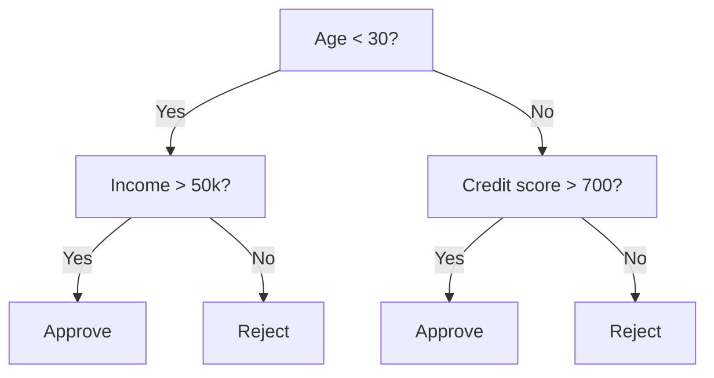
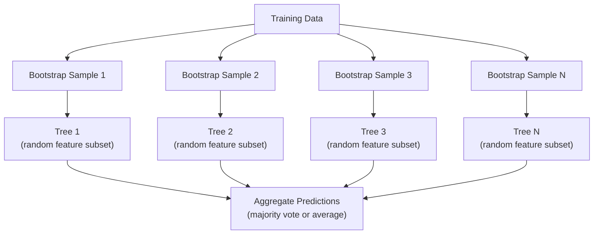

# Decision Trees and Random Forests

> A decision tree is just a flowchart. But a forest of them is one of the most powerful tools in ML.

**Type:** Build
**Languages:** Python
**Prerequisites:** Phase 1 (Lesson 09 Information Theory, Lesson 06 Probability)
**Time:** ~90 minutes

## Learning Objectives

- Implement Gini impurity, entropy, and information gain calculations to find optimal decision tree splits
- Build a decision tree classifier from scratch with pre-pruning controls (max depth, min samples)
- Construct a random forest using bootstrap sampling and feature randomization, and explain why it reduces variance
- Compare MDI feature importance with permutation importance and identify when MDI is biased

## The Problem

You have tabular data. Rows are samples, columns are features, plus a target column you want to predict. You could throw a neural network at it. But for tabular data, tree-based models (decision trees, random forests, gradient-boosted trees) consistently outperform deep learning. Structured data Kaggle competitions are dominated by XGBoost and LightGBM, not transformers.

Why? Trees handle mixed feature types (numeric and categorical) without preprocessing. They handle nonlinear relationships without feature engineering. They're interpretable: you can look at the tree and see exactly how a prediction was made. And random forests average many trees, making them extremely resistant to overfitting on medium-sized datasets.

This lesson builds a decision tree from scratch using recursive splitting, then constructs a random forest on top. You'll implement the math behind splitting criteria (Gini impurity, entropy, information gain) and understand why a collection of weak learners becomes a strong one.

## The Concept

### What a Decision Tree Does

A decision tree splits the feature space into rectangular regions by asking a sequence of yes/no questions.



Each internal node compares a feature against a threshold. Each leaf node makes a prediction. To classify a new data point, start at the root and follow branches until you reach a leaf.

Trees are built top-down: at each node, pick the feature and threshold that best separates the data. "Best" is defined by a splitting criterion.

### Splitting Criteria: Measuring Impurity

At each node, we have a set of samples. We want to split them so that the resulting child nodes are as "pure" as possible — mostly one class per child.

**Gini impurity** measures the probability of misclassifying a random sample if labeled according to the node's class distribution.

```
Gini(S) = 1 - sum(p_k^2)

where p_k is the proportion of class k in set S.
```

For a pure node (all one class), Gini = 0. For a 50/50 binary split, Gini = 0.5. Lower is better.

```
Example: 6 cats, 4 dogs

Gini = 1 - (0.6^2 + 0.4^2) = 1 - (0.36 + 0.16) = 0.48
```

**Entropy** measures the information content (disorder) in a node. Covered in Phase 1 Lesson 09.

```
Entropy(S) = -sum(p_k * log2(p_k))
```

For a pure node, entropy = 0. For a 50/50 binary split, entropy = 1.0. Lower is better.

```
Example: 6 cats, 4 dogs

Entropy = -(0.6 * log2(0.6) + 0.4 * log2(0.4))
        = -(0.6 * -0.737 + 0.4 * -1.322)
        = 0.442 + 0.529
        = 0.971 bits
```

**Information gain** is the reduction in impurity (entropy or Gini) after a split.

```
IG(S, feature, threshold) = Impurity(S) - weighted_avg(Impurity(S_left), Impurity(S_right))

where weights are the proportion of samples in each child.
```

The greedy algorithm at each node: try every feature and every possible threshold. Pick the (feature, threshold) pair that maximizes information gain.

### How Splitting Works

For a dataset at the current node with n features and m samples:

1. For each feature j (j = 1 to n):
   - Sort samples by feature j
   - Try midpoints between each pair of adjacent distinct values as thresholds
   - Compute information gain for each threshold
2. Select the feature and threshold with highest information gain
3. Split data into left (feature <= threshold) and right (feature > threshold)
4. Recurse on each child node

This greedy approach doesn't guarantee the globally optimal tree. Finding the optimal tree is NP-hard. But greedy splits work well in practice.

### Stopping Conditions

Without stopping conditions, the tree grows until every leaf is pure (one sample per leaf). This perfectly memorizes training data but generalizes terribly.

**Pre-pruning** stops growth before the tree is fully grown:
- Max depth: stop splitting once the tree reaches a set depth
- Min samples per leaf: stop if a node has fewer than k samples
- Min information gain: stop if the best split improves impurity below a threshold
- Max leaf nodes: limit the total number of leaves

**Post-pruning** grows the full tree then trims it back:
- Cost-complexity pruning (used by scikit-learn): add a penalty proportional to the number of leaves. Increase the penalty to get a smaller tree
- Reduced error pruning: remove a subtree if validation error doesn't increase

Pre-pruning is simpler and faster. Post-pruning often produces better trees because it doesn't prematurely stop splits that could lead to useful subsequent splits.

### Regression Trees

For regression, leaf predictions are the mean of target values in that leaf. The splitting criterion changes:

**Variance reduction** replaces information gain:

```
VR(S, feature, threshold) = Var(S) - weighted_avg(Var(S_left), Var(S_right))
```

Pick the split that reduces variance most. The tree partitions input space into regions and predicts a constant (the mean) in each region.

### Random Forests: The Power of Ensembles

A single decision tree has high variance. Small changes in data can produce a completely different tree. Random forests fix this by averaging many trees.



Two sources of randomness make the trees diverse:

**Bagging (Bootstrap Aggregating):** Each tree trains on a bootstrap sample — data sampled with replacement from the training set. Each bootstrap sample contains roughly 63% of original samples (the rest are out-of-bag and can be used for validation).

**Feature randomization:** At each split, only a random subset of features is considered. The default for classification is sqrt(n_features), for regression n_features/3. This prevents all trees from splitting on the same dominant feature.

Key insight: averaging many decorrelated trees reduces variance without increasing bias. Individual trees may be mediocre, but the ensemble is strong.

### Feature Importance

Random forests naturally provide feature importance scores. The most common methods:

**Mean Decrease in Impurity (MDI):** For each feature, sum the total impurity decrease it contributes across all trees and all nodes where it's used. Features that produce larger impurity decreases at earlier splits are more important.

```
importance(feature_j) = sum over all nodes where feature_j is used:
    (n_samples_at_node / n_total_samples) * impurity_decrease
```

This method is fast (computed during training) but biased toward high-cardinality features and features with many possible split points.

**Permutation importance** is an alternative: shuffle a feature's values and measure how much model accuracy drops. More reliable but slower.

### When Trees Beat Neural Networks

On tabular data, trees and forests dominate neural networks. Several reasons:

| Factor | Trees | Neural Networks |
|--------|-------|----------------|
| Mixed types (numeric + categorical) | Native support | Needs encoding |
| Small datasets (< 10k rows) | Performs well | Overfits |
| Feature interactions | Discovered by splits | Requires architecture design |
| Interpretability | Fully transparent | Black box |
| Training time | Minutes | Hours |
| Sensitivity to hyperparameters | Low | High |

Neural networks win when data has spatial or sequential structure (images, text, audio). For flat feature tables, trees are the default.

## Build It

### Step 1: Gini Impurity and Entropy

Build both splitting criteria from scratch and verify they agree on which splits are good.

```python
import math

def gini_impurity(labels):
    n = len(labels)
    if n == 0:
        return 0.0
    counts = {}
    for label in labels:
        counts[label] = counts.get(label, 0) + 1
    return 1.0 - sum((c / n) ** 2 for c in counts.values())

def entropy(labels):
    n = len(labels)
    if n == 0:
        return 0.0
    counts = {}
    for label in labels:
        counts[label] = counts.get(label, 0) + 1
    return -sum(
        (c / n) * math.log2(c / n) for c in counts.values() if c > 0
    )
```

### Step 2: Find the Best Split

Try every feature and every threshold. Return the one with highest information gain.

```python
def information_gain(parent_labels, left_labels, right_labels, criterion="gini"):
    measure = gini_impurity if criterion == "gini" else entropy
    n = len(parent_labels)
    n_left = len(left_labels)
    n_right = len(right_labels)
    if n_left == 0 or n_right == 0:
        return 0.0
    parent_impurity = measure(parent_labels)
    child_impurity = (
        (n_left / n) * measure(left_labels) +
        (n_right / n) * measure(right_labels)
    )
    return parent_impurity - child_impurity
```

### Step 3: Build the DecisionTree Class

Recursive splitting, prediction, and feature importance tracking.

```python
class DecisionTree:
    def __init__(self, max_depth=None, min_samples_split=2,
                 min_samples_leaf=1, criterion="gini",
                 max_features=None):
        self.max_depth = max_depth
        self.min_samples_split = min_samples_split
        self.min_samples_leaf = min_samples_leaf
        self.criterion = criterion
        self.max_features = max_features
        self.tree = None
        self.feature_importances_ = None

    def fit(self, X, y):
        self.n_features = len(X[0])
        self.feature_importances_ = [0.0] * self.n_features
        self.n_samples = len(X)
        self.tree = self._build(X, y, depth=0)
        total = sum(self.feature_importances_)
        if total > 0:
            self.feature_importances_ = [
                fi / total for fi in self.feature_importances_
            ]

    def predict(self, X):
        return [self._predict_one(x, self.tree) for x in X]
```

### Step 4: Build the RandomForest Class

Bootstrap sampling, feature randomization, and majority vote.

```python
class RandomForest:
    def __init__(self, n_trees=100, max_depth=None,
                 min_samples_split=2, max_features="sqrt",
                 criterion="gini"):
        self.n_trees = n_trees
        self.max_depth = max_depth
        self.min_samples_split = min_samples_split
        self.max_features = max_features
        self.criterion = criterion
        self.trees = []

    def fit(self, X, y):
        n = len(X)
        for _ in range(self.n_trees):
            indices = [random.randint(0, n - 1) for _ in range(n)]
            X_boot = [X[i] for i in indices]
            y_boot = [y[i] for i in indices]
            tree = DecisionTree(
                max_depth=self.max_depth,
                min_samples_split=self.min_samples_split,
                max_features=self.max_features,
                criterion=self.criterion,
            )
            tree.fit(X_boot, y_boot)
            self.trees.append(tree)

    def predict(self, X):
        all_preds = [tree.predict(X) for tree in self.trees]
        predictions = []
        for i in range(len(X)):
            votes = {}
            for preds in all_preds:
                v = preds[i]
                votes[v] = votes.get(v, 0) + 1
            predictions.append(max(votes, key=votes.get))
        return predictions
```

Full implementation with all helper methods is in `code/trees.py`.

## Use It

With scikit-learn, training a random forest takes three lines:

```python
from sklearn.ensemble import RandomForestClassifier
from sklearn.datasets import load_iris
from sklearn.model_selection import train_test_split

X, y = load_iris(return_X_y=True)
X_train, X_test, y_train, y_test = train_test_split(X, y, random_state=42)

rf = RandomForestClassifier(n_estimators=100, random_state=42)
rf.fit(X_train, y_train)
print(f"Accuracy: {rf.score(X_test, y_test):.4f}")
print(f"Feature importances: {rf.feature_importances_}")
```

In practice, gradient-boosted trees (XGBoost, LightGBM, CatBoost) often outperform random forests because they build trees sequentially with each tree correcting the errors of previous ones. But random forests are harder to misconfigure and need almost no hyperparameter tuning.

## Ship It

This lesson produces `outputs/prompt-tree-interpreter.md` — a prompt for explaining decision tree splits to business stakeholders. Feed it a trained tree's structure (depth, features, split thresholds, accuracy) and it translates the model into plain-language rules, ranks feature importance, flags overfitting or leakage, and recommends next steps. Use it whenever you need to explain a tree model to people who don't read code.

## Exercises

1. Train a single decision tree on a 2D dataset with 3 classes. Manually trace the splits and draw rectangular decision boundaries. Compare boundaries at max_depth=2 vs max_depth=10.

2. Implement variance reduction splitting for a regression tree. Generate 200 points for y = sin(x) + noise, fit your regression tree. Plot the tree's piecewise-constant predictions alongside the true curve.

3. Build random forests with 1, 5, 10, 50, and 200 trees. Plot training and test accuracy vs number of trees. Observe that test accuracy plateaus but never drops (forests resist overfitting).

4. Compare Gini impurity and entropy as splitting criteria on 5 different datasets. Measure accuracy and tree depth. In most cases they produce nearly identical results. Explain why.

5. Implement permutation importance. Compare it to MDI importance on a dataset where one feature is random noise but has high cardinality. MDI will rank the noise feature highly; permutation importance won't.

## Key Terms

| Term | What people say | What it actually is |
|------|----------------|----------------------|
| Decision tree | "a flowchart for predictions" | A model that splits the feature space into rectangular regions by learning a sequence of if/else splits |
| Gini impurity | "how mixed the node is" | Probability of misclassifying a random sample at a node. 0 = pure, 0.5 = maximum impurity for binary |
| Entropy | "disorder in the node" | Information content at a node. 0 = pure, 1.0 = maximum uncertainty for binary. From information theory |
| Information gain | "how good a split is" | Reduction in impurity after a split. The greedy criterion for choosing splits |
| Pre-pruning | "stopping the tree early" | Stopping tree growth early via max depth, min samples, or min gain thresholds |
| Post-pruning | "trimming the tree after" | Growing the full tree then removing subtrees that don't help validation performance |
| Bagging | "train on random subsets" | Bootstrap aggregating. Each model trains on a different random sample drawn with replacement |
| Random forest | "a bunch of trees" | An ensemble of decision trees, each trained on a bootstrap sample with random feature subsets per split |
| Feature importance (MDI) | "which features matter" | Total impurity decrease contributed by each feature, summed across all trees and nodes |
| Permutation importance | "shuffle and see" | Drop in accuracy when a feature's values are randomly shuffled. More reliable for noisy features than MDI |
| Variance reduction | "information gain for regression" | The regression analog of information gain. Picks splits that reduce target variance most |
| Bootstrap sample | "random sampling with replacement" | A random sample drawn with replacement from the original dataset. Same size but with duplicates |

## Further Reading

- [Breiman: Random Forests (2001)](https://link.springer.com/article/10.1023/A:1010933404324) - The original random forest paper
- [Grinsztajn et al.: Why do tree-based models still outperform deep learning on tabular data? (2022)](https://arxiv.org/abs/2207.08815) - Rigorous comparison of trees vs neural networks on tabular tasks
- [scikit-learn Decision Trees documentation](https://scikit-learn.org/stable/modules/tree.html) - Practical guide with visualization tools
- [XGBoost: A Scalable Tree Boosting System (Chen & Guestrin, 2016)](https://arxiv.org/abs/1603.02754) - The gradient boosting paper that dominates Kaggle
