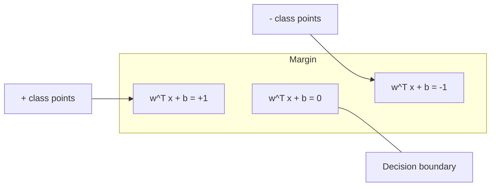
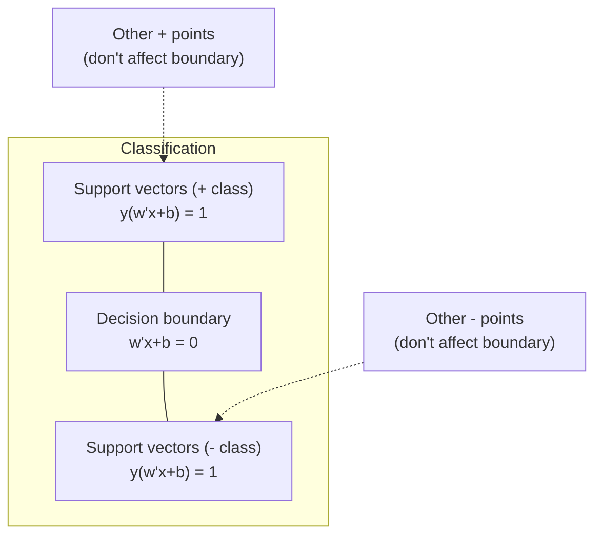
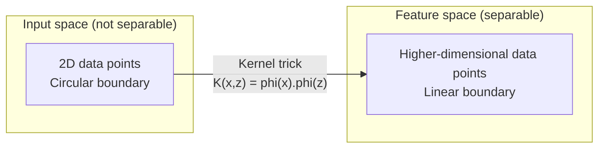

# Support Vector Machines

> Find the widest street between two classes. That's the entire idea.

**Type:** Build
**Languages:** Python
**Prerequisites:** Phase 1 (Lesson 08 Optimization, Lesson 14 Norms & Distances, Lesson 18 Convex Optimization)
**Time:** ~90 minutes

## Learning Objectives

- Implement a linear SVM from scratch using gradient descent on the hinge loss in primal form
- Explain the maximum margin principle and identify support vectors from a trained model
- Compare linear, polynomial, and RBF kernels, explaining how the kernel trick avoids explicit high-dimensional mapping
- Evaluate the tradeoff controlled by the C parameter between margin width and classification errors

## The Problem

You have two classes of data points and need to draw a line (or hyperplane) separating them. There are infinitely many valid lines. Which one should you pick?

Pick the one with the largest margin. The margin is the distance from the decision boundary to the nearest data points on either side. A wider margin means a more confident classifier with better generalization to unseen data.

This intuition leads to support vector machines, one of the most mathematically elegant algorithms in ML. Before deep learning, SVMs were the dominant classification method and remain the best choice for small datasets, high-dimensional data, and problems where you need a model with theoretical guarantees, clear principles, and thorough research backing.

SVMs connect directly to Phase 1: the optimization is convex (Lesson 18), the margin is measured with norms (Lesson 14), and the kernel trick uses dot products to handle nonlinear boundaries without ever computing in the high-dimensional space.

## The Concept

### Maximum Margin Classifier

Given linearly separable data with labels y_i in {-1, +1} and feature vectors x_i, we want a hyperplane w^T x + b = 0 separating the two classes.

The distance from point x_i to the hyperplane is:

```
distance = |w^T x_i + b| / ||w||
```

For correctly classified points: y_i * (w^T x_i + b) > 0. The margin is twice the distance from the hyperplane to the nearest point on either side.



Optimization problem:

```
maximize    2 / ||w||     (margin width)
subject to  y_i * (w^T x_i + b) >= 1  for all i
```

Equivalently (minimizing ||w||^2 is easier to optimize):

```
minimize    (1/2) ||w||^2
subject to  y_i * (w^T x_i + b) >= 1  for all i
```

This is a convex quadratic program with a unique global solution. Data points that lie exactly on the margin boundary (i.e., y_i * (w^T x_i + b) = 1) are the support vectors. They are the only points that determine the decision boundary. Moving or removing any non-support-vector point leaves the boundary unchanged.

### Support Vectors: The Critical Few



Most training points are irrelevant — only the support vectors matter. This is why SVMs are memory-efficient at prediction time: you only need to store the support vectors, not the entire training set.

The number of support vectors also provides a bound on generalization error. Fewer support vectors relative to dataset size means better generalization.

### Soft Margin: Handling Noise with the C Parameter

Real data is rarely perfectly separable. Some points may fall on the wrong side of the boundary or inside the margin. The soft margin formulation introduces slack variables to allow violations.

```
minimize    (1/2) ||w||^2 + C * sum(xi_i)
subject to  y_i * (w^T x_i + b) >= 1 - xi_i
            xi_i >= 0  for all i
```

Slack variable xi_i measures how much point i violates the margin. C controls the tradeoff:

| C value | Behavior |
|---------|----------|
| Large C | Heavily penalizes violations. Narrow margin, fewer misclassifications. Overfitting |
| Small C | Allows more violations. Wide margin, more misclassifications. Underfitting |

C is the inverse of regularization strength. Large C = weak regularization. Small C = strong regularization.

### Hinge Loss: The SVM Loss Function

The soft margin SVM can be rewritten as an unconstrained optimization:

```
minimize    (1/2) ||w||^2 + C * sum(max(0, 1 - y_i * (w^T x_i + b)))
```

The term max(0, 1 - y_i * f(x_i)) is the hinge loss. It is zero when a point is correctly classified and outside the margin. It is linear when a point falls inside the margin or is misclassified.

```
Hinge loss for a single point:

loss
  |
  | \
  |  \
  |   \
  |    \
  |     \_______________
  |
  +-----|-----|-------->  y * f(x)
       0     1

Zero loss when y*f(x) >= 1 (correctly classified, outside margin).
Linear penalty when y*f(x) < 1.
```

Comparison with logistic loss (logistic regression):

```
Hinge:     max(0, 1 - y*f(x))          Hard cutoff at the margin
Logistic:  log(1 + exp(-y*f(x)))        Smooth, never exactly zero
```

Hinge loss produces sparse solutions (only support vectors have nonzero contributions). Logistic loss uses all data points. This makes SVMs more memory-efficient at prediction time.

### Training Linear SVM with Gradient Descent

You can train a linear SVM with gradient descent on hinge loss plus L2 regularization, without solving a constrained QP:

```
L(w, b) = (lambda/2) * ||w||^2 + (1/n) * sum(max(0, 1 - y_i * (w^T x_i + b)))

Gradient with respect to w:
  If y_i * (w^T x_i + b) >= 1:  dL/dw = lambda * w
  If y_i * (w^T x_i + b) < 1:   dL/dw = lambda * w - y_i * x_i

Gradient with respect to b:
  If y_i * (w^T x_i + b) >= 1:  dL/db = 0
  If y_i * (w^T x_i + b) < 1:   dL/db = -y_i
```

This is called the primal formulation. Complexity per epoch is O(n * d), where n is the number of samples and d is the number of features. Fast for large-scale, sparse, high-dimensional data (text classification).

### Dual Formulation and the Kernel Trick

The Lagrangian dual of the SVM problem (from Phase 1 Lesson 18, KKT conditions) is:

```
maximize    sum(alpha_i) - (1/2) * sum_ij(alpha_i * alpha_j * y_i * y_j * (x_i . x_j))
subject to  0 <= alpha_i <= C
            sum(alpha_i * y_i) = 0
```

The dual only involves dot products between data points x_i . x_j. This is the key insight. Replace each dot product with a kernel function K(x_i, x_j), and the SVM can learn nonlinear boundaries without ever explicitly computing the transformation.

```
Linear kernel:      K(x, z) = x . z
Polynomial kernel:  K(x, z) = (x . z + c)^d
RBF (Gaussian):     K(x, z) = exp(-gamma * ||x - z||^2)
```

The RBF kernel maps data to an infinite-dimensional space. Points close together in input space have kernel values near 1; points far apart have values near 0. It can learn arbitrarily smooth decision boundaries.



The kernel trick computes dot products in the high-dimensional feature space without ever entering that space. For a polynomial kernel of degree d in D-dimensional space, the explicit feature space has O(D^d) dimensions. But K(x, z) can be computed in O(D) time.

### SVM for Regression (SVR)

Support vector regression fits a tube of width epsilon around the data. Points inside the tube have zero loss. Points outside the tube are penalized linearly.

```
minimize    (1/2) ||w||^2 + C * sum(xi_i + xi_i*)
subject to  y_i - (w^T x_i + b) <= epsilon + xi_i
            (w^T x_i + b) - y_i <= epsilon + xi_i*
            xi_i, xi_i* >= 0
```

The epsilon parameter controls tube width. Wider tube = fewer support vectors = smoother fit. Narrower tube = more support vectors = tighter fit.

### Why SVM Lost to Deep Learning (and When It Still Wins)

From the late 1990s to early 2010s, SVMs dominated ML. Deep learning surpassed them for several reasons:

| Factor | SVM | Deep Learning |
|--------|------|---------------|
| Feature engineering | Required | Learns features |
| Scalability | Kernel methods are O(n^2) to O(n^3) | O(n) per epoch with SGD |
| Images/text/audio | Requires hand-crafted features | Learns from raw data |
| Large datasets (>100k) | Slow | Scales well |
| GPU acceleration | Limited benefit | Major speedup |

SVMs still win in these scenarios:
- Small datasets (hundreds to thousands of samples)
- High-dimensional sparse data (text with TF-IDF features)
- When you need mathematical guarantees (margin bounds)
- When training time must be extremely short (linear SVMs are very fast)
- Binary classification with clear margin structure
- Anomaly detection (one-class SVM)

## Build It

### Step 1: Hinge Loss and Gradient

The foundation. Compute hinge loss and its gradient for a batch.

```python
def hinge_loss(X, y, w, b):
    n = len(X)
    total_loss = 0.0
    for i in range(n):
        margin = y[i] * (dot(w, X[i]) + b)
        total_loss += max(0.0, 1.0 - margin)
    return total_loss / n
```

### Step 2: Linear SVM with Gradient Descent

Train by minimizing regularized hinge loss. No QP solver needed.

```python
class LinearSVM:
    def __init__(self, lr=0.001, lambda_param=0.01, n_epochs=1000):
        self.lr = lr
        self.lambda_param = lambda_param
        self.n_epochs = n_epochs
        self.w = None
        self.b = 0.0

    def fit(self, X, y):
        n_features = len(X[0])
        self.w = [0.0] * n_features
        self.b = 0.0

        for epoch in range(self.n_epochs):
            for i in range(len(X)):
                margin = y[i] * (dot(self.w, X[i]) + self.b)
                if margin >= 1:
                    self.w = [wj - self.lr * self.lambda_param * wj
                              for wj in self.w]
                else:
                    self.w = [wj - self.lr * (self.lambda_param * wj - y[i] * X[i][j])
                              for j, wj in enumerate(self.w)]
                    self.b -= self.lr * (-y[i])

    def predict(self, X):
        return [1 if dot(self.w, x) + self.b >= 0 else -1 for x in X]
```

### Step 3: Kernel Functions

Implement linear, polynomial, and RBF kernels.

```python
def linear_kernel(x, z):
    return dot(x, z)

def polynomial_kernel(x, z, degree=3, c=1.0):
    return (dot(x, z) + c) ** degree

def rbf_kernel(x, z, gamma=0.5):
    diff = [xi - zi for xi, zi in zip(x, z)]
    return math.exp(-gamma * dot(diff, diff))
```

### Step 4: Margin and Support Vector Identification

After training, identify which points are support vectors and compute margin width.

```python
def find_support_vectors(X, y, w, b, tol=1e-3):
    support_vectors = []
    for i in range(len(X)):
        margin = y[i] * (dot(w, X[i]) + b)
        if abs(margin - 1.0) < tol:
            support_vectors.append(i)
    return support_vectors
```

Full implementation with all demos in `code/svm.py`.

## Use It

With scikit-learn:

```python
from sklearn.svm import SVC, LinearSVC, SVR
from sklearn.preprocessing import StandardScaler
from sklearn.pipeline import Pipeline

clf = Pipeline([
    ("scaler", StandardScaler()),
    ("svm", SVC(kernel="rbf", C=1.0, gamma="scale")),
])
clf.fit(X_train, y_train)
print(f"Accuracy: {clf.score(X_test, y_test):.4f}")
print(f"Support vectors: {clf['svm'].n_support_}")
```

Important: Always scale features before training an SVM. SVMs are sensitive to feature magnitudes because the margin depends on ||w||, and unscaled features distort the geometry.

For large datasets, use `LinearSVC` (primal form, O(n) per epoch) instead of `SVC` (dual form, O(n^2) to O(n^3)):

```python
from sklearn.svm import LinearSVC

clf = Pipeline([
    ("scaler", StandardScaler()),
    ("svm", LinearSVC(C=1.0, max_iter=10000)),
])
```

## Exercises

1. Generate a 2D linearly separable dataset. Train your LinearSVM and identify the support vectors. Verify that the support vectors are exactly the points closest to the decision boundary.

2. Vary C from 0.001 to 1000 on a noisy dataset. Plot the decision boundary for each C value. Observe the transition from wide margin (underfitting) to narrow margin (overfitting).

3. Create a dataset where the class boundary is circular (nonlinear). Show that a linear SVM fails. Compute the RBF kernel matrix and show that the two classes become separable in the kernel-induced feature space.

4. Compare hinge loss and logistic loss on the same dataset. Train a linear SVM and a logistic regression. Count how many training points contribute to each model's decision boundary (support vectors vs all points).

5. Implement SVR (epsilon-insensitive loss). Fit it to y = sin(x) + noise. Plot the epsilon tube around predictions and highlight the support vectors (points outside the tube).

## Key Terms

| Term | What it actually is |
|------|----------------------|
| Support vector | Training points closest to the decision boundary. The only points that determine the hyperplane |
| Margin | Distance from the decision boundary to the nearest support vector. SVM maximizes this |
| Hinge loss | max(0, 1 - y*f(x)). Zero when correctly classified and outside margin, linear penalty otherwise |
| C parameter | Tradeoff between margin width and classification errors. Large C = narrow margin, small C = wide margin |
| Soft margin | SVM formulation that allows margin violations via slack variables. Handles non-separable data |
| Kernel trick | Computes dot products in a high-dimensional feature space without explicitly mapping to that space |
| Linear kernel | K(x, z) = x . z. Equivalent to the standard dot product. Used for linearly separable data |
| RBF kernel | K(x, z) = exp(-gamma * \|\|x-z\|\|^2). Maps to infinite dimensions. Learns arbitrarily smooth boundaries |
| Polynomial kernel | K(x, z) = (x . z + c)^d. Maps to a feature space of polynomial combinations |
| Dual formulation | Reformulation of the SVM problem that depends only on dot products between data points. Makes kernels possible |
| SVR | Support vector regression. Fits an epsilon tube around data. Points inside the tube have zero loss |
| Slack variable | xi_i: measures how much a point violates the margin. Zero for correctly classified points outside the margin |
| Maximum margin | The principle of choosing the hyperplane that maximizes distance to the nearest points of each class |

## Further Reading

- [Vapnik: The Nature of Statistical Learning Theory (1995)](https://link.springer.com/book/10.1007/978-1-4757-3264-1) - Foundational work on SVMs and statistical learning
- [Cortes & Vapnik: Support-vector networks (1995)](https://link.springer.com/article/10.1007/BF00994018) - The original SVM paper
- [Platt: Sequential Minimal Optimization (1998)](https://www.microsoft.com/en-us/research/publication/sequential-minimal-optimization-a-fast-algorithm-for-training-support-vector-machines/) - The SMO algorithm that made SVM training practical
- [scikit-learn SVM documentation](https://scikit-learn.org/stable/modules/svm.html) - Practical guide with implementation details
- [LIBSVM: A Library for Support Vector Machines](https://www.csie.ntu.edu.tw/~cjlin/libsvm/) - The C++ library behind most SVM implementations
