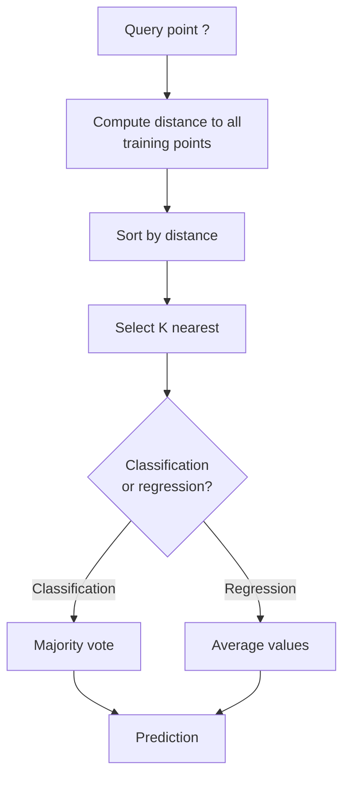
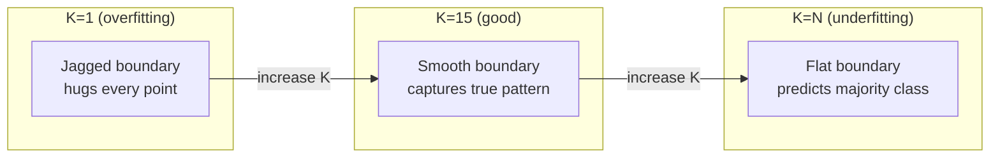
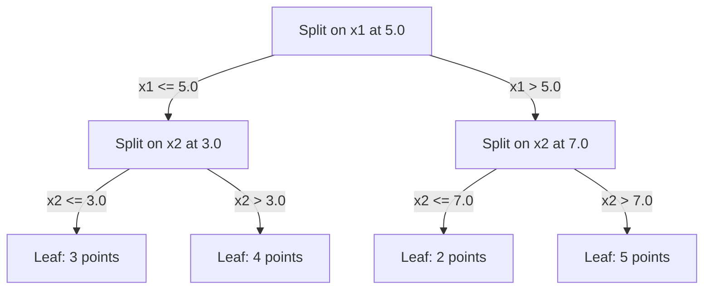

# K-Nearest Neighbors and Distances

> Store everything. Predict by looking at neighbors. The simplest algorithm that actually works.

**Type:** Build
**Languages:** Python
**Prerequisites:** Phase 1 (Lesson 14: Norms and Distances)
**Time:** ~90 minutes

## Learning Objectives

- Implement KNN classification and regression from scratch with configurable K and distance-weighted voting
- Compare L1, L2, cosine, and Minkowski distance metrics, selecting the right one for a given data type
- Explain the curse of dimensionality and demonstrate why KNN degrades in high-dimensional spaces
- Build a KD-tree for efficient nearest neighbor search and analyze when it outperforms brute force

## The Problem

You have a dataset. A new data point arrives. You need to classify it or predict its value. Instead of learning parameters from the data (like linear regression or SVM), you simply find the K closest training points to the new point and let them vote.

That's K-Nearest Neighbors. No training phase. No parameters to learn. No loss function to minimize. You store the entire training set and compute distances at prediction time.

It sounds too simple to work. But KNN is surprisingly competitive on many problems, especially small to medium datasets, and understanding it deeply reveals fundamental concepts: distance metric selection (connecting back to Phase 1 Lesson 14), the curse of dimensionality, and the difference between lazy and eager learning.

KNN is also everywhere in modern AI, just under different names. Vector databases do KNN search over embeddings. Retrieval-Augmented Generation (RAG) finds the K nearest document chunks. Recommendation systems find similar users or items. Same algorithm, different scale and data structures.

## The Concept

### How KNN Works

Given a dataset of labeled points and a new query point:

1. Compute the distance from the query to every point in the dataset
2. Sort by distance
3. Take the K nearest points
4. Classification: majority vote among those K neighbors
5. Regression: average (or weighted average) of those K neighbors' values



That's the entire algorithm. No fitting. No gradient descent. No epochs.

### Choosing K

K is the only hyperparameter. It controls the bias-variance tradeoff:

| K | Behavior |
|---|----------|
| K = 1 | Decision boundary hugs every point. Zero training error. High variance. Overfitting |
| Small K (3-5) | Sensitive to local structure. Captures complex boundaries |
| Large K | Smoother boundaries. More robust to noise. May underfit |
| K = N | Predicts the majority class for every point. Maximum bias |

For a dataset with N points, a common starting point is K = sqrt(N). Use odd K for binary classification to avoid ties.



### Distance Metrics

The distance function defines what "close" means. Different metrics produce different neighbors, different predictions.

**L2 (Euclidean)** is the default. Straight-line distance.

```
d(a, b) = sqrt(sum((a_i - b_i)^2))
```

Sensitive to feature scale. Always standardize features before using L2 with KNN.

**L1 (Manhattan)** sums absolute differences. More robust to outliers than L2 because it doesn't square differences.

```
d(a, b) = sum(|a_i - b_i|)
```

**Cosine distance** measures the angle between vectors, ignoring magnitude. Essential for text and embedding data.

```
d(a, b) = 1 - (a . b) / (||a|| * ||b||)
```

**Minkowski** generalizes L1 and L2 with a parameter p.

```
d(a, b) = (sum(|a_i - b_i|^p))^(1/p)

p=1: Manhattan
p=2: Euclidean
p->inf: Chebyshev (maximum absolute difference)
```

Which metric to use depends on the data:

| Data type | Best metric | Reason |
|-----------|------------|--------|
| Numeric features, similar scales | L2 (Euclidean) | Default, works for spatial data |
| Numeric features, with outliers | L1 (Manhattan) | Robust, doesn't amplify large differences |
| Text embeddings | Cosine | Magnitude is noise, direction is meaning |
| High-dimensional sparse | Cosine or L1 | L2 suffers from the curse of dimensionality |
| Mixed types | Custom distance | Combine metrics by feature type |

### Weighted KNN

Standard KNN gives all K neighbors equal weight. But a neighbor at distance 0.1 should matter more than one at distance 5.0.

**Distance-weighted KNN** weights each neighbor by the inverse of its distance:

```
weight_i = 1 / (distance_i + epsilon)

Classification: weighted vote
Regression: weighted average = sum(w_i * y_i) / sum(w_i)
```

Epsilon prevents division by zero when the query point coincides exactly with a training point.

Weighted KNN is less sensitive to the choice of K because distant neighbors contribute little regardless.

### The Curse of Dimensionality

KNN degrades in high dimensions. This isn't a vague concern — it's a mathematical fact.

**Problem 1: Distance concentration.** As dimensionality increases, the ratio of maximum distance to minimum distance approaches 1. All points become equally "far" from the query.

```
In d dimensions, for uniformly distributed random points:

d=2:    max_dist / min_dist = varies widely
d=100:  max_dist / min_dist ~ 1.01
d=1000: max_dist / min_dist ~ 1.001

When all distances are nearly equal, "nearest" becomes meaningless.
```

**Problem 2: Volume explosion.** To capture K neighbors within a fixed fraction of the data, you must expand the search radius to cover a large chunk of the feature space. A "neighborhood" in high dimensions covers almost the entire space.

**Problem 3: Corners dominate.** In a d-dimensional unit hypercube, most of the volume concentrates near the corners, not the center. As d grows, the fraction of volume inside the inscribed hypersphere vanishes.

Practical consequence: KNN works well up to about 20-50 features. Beyond that, you need dimensionality reduction (PCA, UMAP, t-SNE) before applying KNN, or tree-based search structures that exploit the data's intrinsic low dimensionality.

### KD-Tree: Fast Nearest Neighbor Search

Brute-force KNN computes the distance from the query to every training point. Each query is O(n * d). For large datasets, this is too slow.

A KD-tree recursively partitions the space along feature axes. At each level, it splits along one dimension at the median.



To find the nearest neighbor, traverse the tree to the leaf containing the query point, then backtrack, only checking neighboring partitions when they might contain a closer point.

Average query time: O(log n) in low dimensions. But KD-trees degrade to O(n) in high dimensions (d > 20) because backtracking can eliminate fewer and fewer branches.

### Ball Tree: Better for Moderate Dimensions

Ball trees partition data into nested hyperspheres instead of axis-aligned boxes. Each node defines a ball (center + radius) containing all points in that subtree.

Advantages over KD-trees:
- Better performance in moderate dimensions (up to ~50)
- Handles non-axis-aligned structure
- Tighter bounding volumes mean more pruning during search

Both KD-trees and ball trees are exact algorithms. For truly large-scale search (millions of points, hundreds of dimensions), switch to approximate nearest neighbor methods (HNSW, IVF, product quantization). These were covered in Phase 1 Lesson 14.

### Lazy Learning vs Eager Learning

KNN is a lazy learner: it does nothing at training time and defers all work to prediction time. Most other algorithms (linear regression, SVM, neural networks) are eager learners: they do heavy computation at training time to build a compact model, making prediction fast.

| Dimension | Lazy (KNN) | Eager (SVM, Neural Networks) |
|-----------|------------|------------------------------|
| Training time | O(1) just store data | O(n * epochs) |
| Prediction time | O(n * d) per query | O(d) or O(parameters) |
| Memory at prediction | Store entire training set | Store only model parameters |
| Adapting to new data | Instantly add points | Retrain the model |
| Decision boundary | Implicit, computed on the fly | Explicit, fixed after training |

Lazy learning is ideal when:
- The dataset changes frequently (add/remove points without retraining)
- You only need predictions for very few queries
- You want zero training time
- The dataset is small enough that brute force is fast

### KNN for Regression

KNN regression averages the target values of the K neighbors instead of voting.

```
prediction = (1/K) * sum(y_i for i in K nearest neighbors)

Or with distance weighting:
prediction = sum(w_i * y_i) / sum(w_i)
where w_i = 1 / distance_i
```

KNN regression produces piecewise constant (piecewise smooth when weighted) predictions. It cannot extrapolate beyond the range of training data. If training targets are all between 0 and 100, KNN will never predict 200.

## Build It

### Step 1: Distance Functions

Implement L1, L2, cosine, and Minkowski distances. These connect directly to Phase 1 Lesson 14.

```python
import math

def l2_distance(a, b):
    return math.sqrt(sum((ai - bi) ** 2 for ai, bi in zip(a, b)))

def l1_distance(a, b):
    return sum(abs(ai - bi) for ai, bi in zip(a, b))

def cosine_distance(a, b):
    dot_val = sum(ai * bi for ai, bi in zip(a, b))
    norm_a = math.sqrt(sum(ai ** 2 for ai in a))
    norm_b = math.sqrt(sum(bi ** 2 for bi in b))
    if norm_a == 0 or norm_b == 0:
        return 1.0
    return 1.0 - dot_val / (norm_a * norm_b)

def minkowski_distance(a, b, p=2):
    if p == float('inf'):
        return max(abs(ai - bi) for ai, bi in zip(a, b))
    return sum(abs(ai - bi) ** p for ai, bi in zip(a, b)) ** (1 / p)
```

### Step 2: KNN Classifier and Regressor

Build a complete KNN with configurable K, distance metric, and optional distance weighting.

```python
class KNN:
    def __init__(self, k=5, distance_fn=l2_distance, weighted=False,
                 task="classification"):
        self.k = k
        self.distance_fn = distance_fn
        self.weighted = weighted
        self.task = task
        self.X_train = None
        self.y_train = None

    def fit(self, X, y):
        self.X_train = X
        self.y_train = y

    def predict(self, X):
        return [self._predict_one(x) for x in X]
```

### Step 3: KD-Tree for Efficient Search

Build a KD-tree from scratch, recursively splitting along the median of each dimension.

```python
class KDTree:
    def __init__(self, X, indices=None, depth=0):
        # Recursively partition the data
        self.axis = depth % len(X[0])
        # Split along median of current axis
        ...

    def query(self, point, k=1):
        # Traverse to leaf, then backtrack
        ...
```

The full implementation with all helper methods and demo is in `code/knn.py`.

### Step 4: Feature Scaling

KNN requires feature scaling because distances are sensitive to feature magnitude. A feature ranging from 0 to 1000 will dominate one ranging from 0 to 1.

```python
def standardize(X):
    n = len(X)
    d = len(X[0])
    means = [sum(X[i][j] for i in range(n)) / n for j in range(d)]
    stds = [
        max(1e-10, (sum((X[i][j] - means[j]) ** 2 for i in range(n)) / n) ** 0.5)
        for j in range(d)
    ]
    return [[((X[i][j] - means[j]) / stds[j]) for j in range(d)] for i in range(n)], means, stds
```

## Use It

With scikit-learn:

```python
from sklearn.neighbors import KNeighborsClassifier
from sklearn.preprocessing import StandardScaler
from sklearn.pipeline import Pipeline

clf = Pipeline([
    ("scaler", StandardScaler()),
    ("knn", KNeighborsClassifier(n_neighbors=5, metric="euclidean")),
])
clf.fit(X_train, y_train)
print(f"Accuracy: {clf.score(X_test, y_test):.4f}")
```

When the dataset is large enough and dimensionality low enough, scikit-learn automatically uses KD-trees or ball trees. For high-dimensional data, it falls back to brute force. You can control this with the `algorithm` parameter.

For large-scale nearest neighbor search (millions of vectors), use FAISS, Annoy, or a vector database:

```python
import faiss

index = faiss.IndexFlatL2(dimension)
index.add(embeddings)
distances, indices = index.search(query_vectors, k=5)
```

## Exercises

1. Implement KNN classification on a 2D dataset with 3 classes. Plot decision boundaries for K=1, K=5, K=15, and K=N. Observe the transition from overfitting to underfitting.

2. Generate 1000 random points in 2, 5, 10, 50, 100, and 500 dimensions. For each dimensionality, compute the ratio of maximum pairwise distance to minimum pairwise distance. Plot the ratio vs. dimensionality to visualize the curse of dimensionality.

3. Compare KNN with L1, L2, and cosine distance on a text classification problem (using TF-IDF vectors). Which metric achieves the highest accuracy? Why does cosine tend to win on text?

4. Implement a KD-tree and measure query time for datasets of 1k, 10k, and 100k points in 2D, 10D, and 50D, comparing against brute-force search. At what dimensionality does the KD-tree stop being faster than brute force?

5. Build a weighted KNN regressor for y = sin(x) + noise. Compare against unweighted KNN at K=3, 10, and 30. Show that weighting produces smoother predictions, especially noticeable at large K.

## Key Terms

| Term | What it actually is |
|------|---------------------|
| K-Nearest Neighbors | Non-parametric algorithm that predicts by finding the K closest training points to the query |
| Lazy learning | No computation at training time. All work happens at prediction time. KNN is the canonical example |
| Eager learning | Heavy computation at training time to build a compact model. Most ML algorithms are eager |
| Curse of dimensionality | In high dimensions, distances concentrate, neighborhoods expand to cover most of the space, making KNN fail |
| KD-tree | Binary tree that recursively partitions space along feature axes. O(log n) queries in low dimensions |
| Ball tree | Tree of nested hyperspheres. Better than KD-trees in moderate dimensions (up to ~50) |
| Weighted KNN | Neighbors weighted by inverse distance. Closer neighbors have greater influence on predictions |
| Feature scaling | Normalizing features to comparable ranges. Mandatory for distance-based methods like KNN |
| Majority vote | Classifying by counting which class is most common among the K neighbors |
| Brute-force search | Computing distance to every training point. O(n*d) per query. Exact but slow for large n |
| Approximate nearest neighbor | Family of algorithms (HNSW, LSH, IVF) that find approximately nearest points much faster than exact search |
| Voronoi diagram | Partition of space where each region contains all points closer to a given training point than any other. K=1 KNN produces Voronoi boundaries |

## Further Reading

- [Cover & Hart: Nearest Neighbor Pattern Classification (1967)](https://ieeexplore.ieee.org/document/1053964) - The foundational KNN paper, proving its error rate is at most twice the Bayes optimal
- [Friedman, Bentley, Finkel: An Algorithm for Finding Best Matches in Logarithmic Expected Time (1977)](https://dl.acm.org/doi/10.1145/355744.355745) - The original KD-tree paper
- [Beyer et al.: When Is "Nearest Neighbor" Meaningful? (1999)](https://link.springer.com/chapter/10.1007/3-540-49257-7_15) - Formal analysis of the curse of dimensionality for nearest neighbors
- [scikit-learn Nearest Neighbors documentation](https://scikit-learn.org/stable/modules/neighbors.html) - Practical guide with algorithm selection
- [FAISS: A Library for Efficient Similarity Search](https://github.com/facebookresearch/faiss) - Meta's billion-scale approximate nearest neighbor search library
