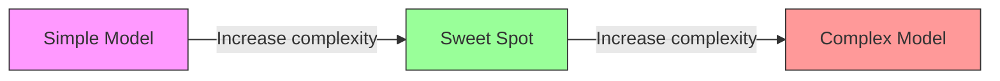
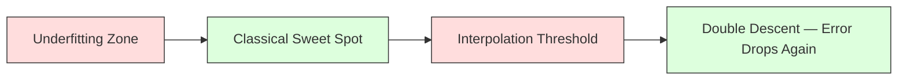
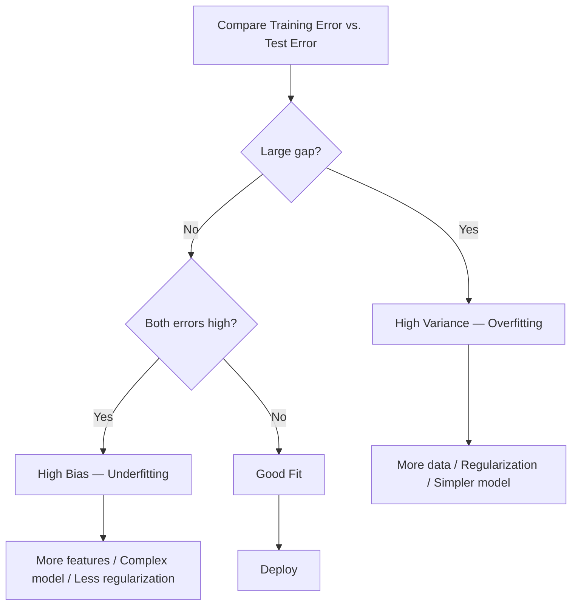
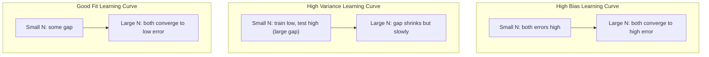
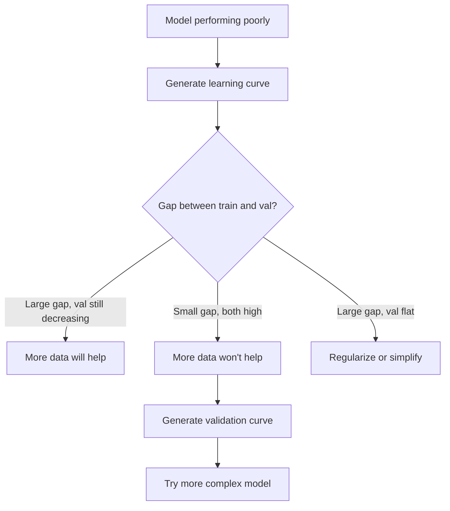

# Bias-Variance Tradeoff

> Every bit of a model's error comes from one of three sources: bias, variance, or noise. You can only control the first two.

**Type:** Learn
**Languages:** Python
**Prerequisites:** Phase 2 Lessons 01-09 (ML Fundamentals, Regression, Classification, Evaluation)
**Time:** ~75 minutes

## Learning Objectives

- Derive the bias-variance decomposition of expected prediction error and explain the role of irreducible noise
- Diagnose whether a model has high bias or high variance using training error and test error patterns
- Explain how regularization techniques (L1, L2, dropout, early stopping) trade bias for variance
- Implement experiments that visualize the bias-variance tradeoff across models of increasing complexity

## The Problem

You train a model. It has some error on test data. Where does that error come from?

If your model is too simple (linear regression on a curved dataset), it will consistently miss the true pattern. That's bias. If your model is too complex (degree-20 polynomial on 15 data points), it will perfectly fit the training data but give wildly different predictions on new data. That's variance.

For a fixed model capacity, you cannot minimize both simultaneously. Push bias down and variance goes up. Push variance down and bias goes up. Understanding this tradeoff is the single most useful diagnostic skill in machine learning. It tells you whether to make the model more complex or simpler, whether to get more data or better features, whether to regularize more or less.

## The Concept

### Bias: Systematic Error

Bias measures how far your model's average prediction is from the true value. If you train the same model on many different training sets drawn from the same distribution, then average the predictions, bias is the gap between that average and the truth.

High bias means the model is too rigid to capture the true pattern. Fitting a straight line to a parabola will miss the curve no matter how much data you provide. This is underfitting.

```
High bias (underfitting):
  The model always predicts roughly the same wrong thing.
  Training error: high
  Test error: high
  Gap between them: small
```

### Variance: Sensitivity to Training Data

Variance measures how much your predictions change when you train on different subsets of data. If small changes to the training set cause large changes in the model, variance is high.

High variance means the model is fitting noise in the training data rather than the underlying signal. A degree-20 polynomial will pass through every training point but oscillate wildly between them. This is overfitting.

```
High variance (overfitting):
  The model fits training data perfectly but fails on new data.
  Training error: low
  Test error: high
  Gap between them: large
```

### The Decomposition

For any point x, the expected prediction error under squared loss decomposes exactly:

```
Expected Error = Bias^2 + Variance + Irreducible Noise

Where:
  Bias^2   = (E[f_hat(x)] - f(x))^2
  Variance = E[(f_hat(x) - E[f_hat(x)])^2]
  Noise    = E[(y - f(x))^2]             (sigma^2)
```

- `f(x)` is the true function
- `f_hat(x)` is your model's prediction
- `E[...]` is expectation over different training sets
- `y` is the observed label (true function plus noise)

The noise term is irreducible. No model can do better than sigma^2 on noisy data. Your job is to find the right balance between bias^2 and variance.

### Model Complexity vs. Error



The classic U-shaped curve:

| Complexity | Bias | Variance | Total Error |
|-----------|------|----------|-------------|
| Too low | High | Low | High (underfitting) |
| Just right | Medium | Medium | Lowest |
| Too high | Low | High | High (overfitting) |

### Regularization as Bias-Variance Control

Regularization deliberately increases bias to reduce variance. It constrains the model so it can't chase noise.

- **L2 (Ridge):** Shrinks all weights toward zero. Keeps all features but dampens their influence.
- **L1 (Lasso):** Drives some weights to exactly zero. Performs feature selection.
- **Dropout:** Randomly disables neurons during training. Forces redundant representations.
- **Early stopping:** Stops training before the model fully fits the training data.

Regularization strength (lambda, dropout rate, number of epochs) directly controls where you sit on the bias-variance curve. More regularization means more bias, less variance.

### Double Descent: The Modern View

Classical theory says: past the sweet spot, more complexity always hurts. But research since 2019 has revealed something surprising. If you push model capacity all the way past the interpolation threshold (the point where the model has enough parameters to perfectly fit the training data), test error can decrease again.



This "double descent" phenomenon explains why massively overparameterized neural networks with far more parameters than training samples still generalize well. The classical bias-variance tradeoff isn't wrong, but it's incomplete for modern settings.

Key observations about double descent:
- It appears in linear models, decision trees, and neural networks
- In the interpolation region, more data can actually hurt (sample-wise double descent)
- More training epochs can also trigger it (epoch-wise double descent)
- Regularization can smooth the peak but not eliminate it

Why it happens: At the interpolation threshold, model capacity is just enough to fit all training points. It's forced into a very specific solution that passes through every point, and small perturbations in the data cause large changes in the fit. This is where variance peaks. Beyond the threshold, the model has many possible solutions that perfectly fit the data. The learning algorithm (e.g., gradient descent with implicit regularization) tends to pick the simplest one. This implicit preference for simple solutions is why overparameterized models generalize.

| Regime | Parameters vs. Samples | Behavior |
|--------|----------------------|----------|
| Underparameterized | p << n | Classical tradeoff applies |
| Interpolation threshold | p ~ n | Variance peaks, test error spikes |
| Overparameterized | p >> n | Implicit regularization kicks in, test error drops |

Practical takeaway: If you're using neural networks or large tree ensembles, don't stop at the interpolation threshold. Either stay well below it (with explicit regularization) or go well above it. The worst place to be is right at the threshold.

### Diagnosing Your Model



| Symptom | Diagnosis | Fix |
|---------|-----------|-----|
| Training error high, test error high | Bias | More features, complex model, less regularization |
| Training error low, test error high | Variance | More data, regularization, simpler model, dropout |
| Training error low, test error low | Good fit | Ship it |
| Training error dropping, test error rising | Actively overfitting | Early stopping |

### Practical Strategies

**When bias is the problem:**
- Add polynomial or interaction features
- Use a more flexible model (tree ensembles instead of linear)
- Reduce regularization strength
- Train longer (if not yet converged)

**When variance is the problem:**
- Get more training data
- Use bagging (random forests)
- Increase regularization (higher lambda, more dropout)
- Feature selection (remove noise features)
- Use cross-validation to catch it early

### Ensemble Methods and Variance Reduction

Ensemble methods are the most practical tool against variance.

**Bagging (bootstrap aggregating)** trains multiple models on different bootstrap samples of the training data and averages their predictions. Each individual model has high variance, but the average has much lower variance. Random forests are bagging applied to decision trees.

Why it works mathematically: If you average N independent predictions each with variance sigma^2, the variance of the average is sigma^2 / N. The models aren't truly independent (they all see similar data), so the reduction is less than 1/N, but still substantial.

**Boosting** reduces bias by sequentially building models that focus on the ensemble's mistakes so far. Gradient boosting and AdaBoost are the main examples. Boosting can overfit if you add too many models, so you need early stopping or regularization.

| Method | Primary Effect | Bias Change | Variance Change |
|--------|---------------|-------------|-----------------|
| Bagging | Reduces variance | Unchanged | Decreases |
| Boosting | Reduces bias | Decreases | May increase |
| Stacking | Reduces both | Depends on meta-learner | Depends on base models |
| Dropout | Implicit bagging | Slightly increases | Decreases |

**Practical rule:** If your base model has high variance (deep trees, high-degree polynomials), use bagging. If your base model has high bias (shallow stumps, simple linear models), use boosting.

### Learning Curves

Learning curves plot training error and validation error as a function of training set size. They are the most practical diagnostic tool available. Unlike a single train/test comparison, learning curves show the model's trajectory and tell you whether more data will help.



How to read them:

| Scenario | Training Error | Validation Error | Gap | What it means | What to do |
|----------|---------------|-----------------|-----|---------------|------------|
| High bias | High | High | Small | Model can't capture the pattern | More features, complex model, less regularization |
| High variance | Low | High | Large | Model is memorizing training data | More data, regularization, simpler model |
| Good fit | Medium | Medium | Small | Model generalizes well | Ship it |
| High variance, improving | Low | Decreasing with more data | Shrinking | Variance problem fixable with data | Collect more data |
| High bias, flat | High | High and flat | Small and flat | More data **won't** help | Change model architecture |

Key insight: If both curves have plateaued, the gap is small but both errors are high, then more data won't help—you need a better model. If the gap is large and still shrinking, more data will help.

### How to Generate Learning Curves

Two approaches:

**Approach 1: Vary training set size, fix model.** Keep the model and hyperparameters constant. Train on progressively larger subsets of training data. Measure training and validation error at each size. This is the standard learning curve.

**Approach 2: Vary model complexity, fix data.** Keep the data constant. Sweep a complexity parameter (polynomial degree, tree depth, number of layers). Measure training and validation error at each complexity. This is the validation curve, directly showing the bias-variance tradeoff.

Both approaches complement each other. The first tells you if more data will help. The second tells you if changing the model will help. Run both before deciding your next step.



## Build It

The code in `code/bias_variance.py` runs a full bias-variance decomposition experiment. Here's how it works step by step.

### Step 1: Generate Synthetic Data from a Known Function

We use `f(x) = sin(1.5x) + 0.5x` with Gaussian noise. Knowing the true function lets us compute exact bias and variance.

```python
def true_function(x):
    return np.sin(1.5 * x) + 0.5 * x

def generate_data(n_samples=30, noise_std=0.5, x_range=(-3, 3), seed=None):
    rng = np.random.RandomState(seed)
    x = rng.uniform(x_range[0], x_range[1], n_samples)
    y = true_function(x) + rng.normal(0, noise_std, n_samples)
    return x, y
```

### Step 2: Bootstrap Sampling and Polynomial Fitting

For each polynomial degree, we draw many bootstrap training sets, fit the polynomial, and record predictions on a fixed test grid. This gives us a distribution of predictions at each test point.

```python
def fit_polynomial(x_train, y_train, degree, lam=0.0):
    X = np.column_stack([x_train ** d for d in range(degree + 1)])
    if lam > 0:
        penalty = lam * np.eye(X.shape[1])
        penalty[0, 0] = 0
        w = np.linalg.solve(X.T @ X + penalty, X.T @ y_train)
    else:
        w = np.linalg.lstsq(X, y_train, rcond=None)[0]
    return w
```

We fit on 200 different bootstrap samples. Each bootstrap sample is drawn from the same underlying distribution but contains different points.

### Step 3: Compute Bias^2, Variance Decomposition

With 200 sets of predictions at each test point, we compute the decomposition directly from definitions:

```python
mean_pred = predictions.mean(axis=0)
bias_sq = np.mean((mean_pred - y_true) ** 2)
variance = np.mean(predictions.var(axis=0))
total_error = np.mean(np.mean((predictions - y_true) ** 2, axis=1))
```

- `mean_pred` is E[f_hat(x)] estimated from bootstrap samples
- `bias_sq` is the squared gap between the average prediction and truth
- `variance` is the average spread of predictions across bootstrap samples
- `total_error` should approximately equal bias^2 + variance + noise

### Step 4: Learning Curves

Learning curves sweep training set size while fixing model complexity. They show whether your model is data-limited or capacity-limited.

```python
def demo_learning_curves():
    sizes = [10, 15, 20, 30, 50, 75, 100, 150, 200, 300]
    degree = 5

    for n in sizes:
        train_errors = []
        test_errors = []
        for seed in range(50):
            x_train, y_train = generate_data(n_samples=n, seed=seed * 100)
            w = fit_polynomial(x_train, y_train, degree)
            train_pred = predict_polynomial(x_train, w)
            train_mse = np.mean((train_pred - y_train) ** 2)
            test_pred = predict_polynomial(x_test, w)
            test_mse = np.mean((test_pred - y_test) ** 2)
            train_errors.append(train_mse)
            test_errors.append(test_mse)
        # Average over runs to get a learning curve point
```

For a high-variance model (degree 5 on small data), you'll see:
- Training error starts low and rises as more data makes memorization harder
- Test error starts high and decreases as the model gets more signal
- The gap shrinks with more data

For a high-bias model (degree 1), both errors quickly converge to the same high value, and more data doesn't help.

### Step 5: Regularization Sweep

The code also includes `demo_regularization_sweep()`, which fixes a high-degree polynomial (degree 15) and sweeps Ridge regularization strength from 0.001 to 100. This demonstrates the bias-variance tradeoff from another angle: instead of changing model complexity, we change constraint strength.

```python
def demo_regularization_sweep():
    alphas = [0.001, 0.005, 0.01, 0.05, 0.1, 0.5, 1.0, 5.0, 10.0, 50.0, 100.0]
    for alpha in alphas:
        results = bias_variance_decomposition([15], lam=alpha)
        r = results[15]
        print(f"alpha={alpha:.3f}  bias={r['bias_sq']:.4f}  var={r['variance']:.4f}")
```

At low alpha, the degree-15 polynomial is nearly unconstrained. Variance dominates because the model chases noise in each bootstrap sample. At high alpha, the penalty is so strong the model becomes nearly constant. Bias dominates. The optimal alpha falls between these extremes.

This is the same U-shaped curve as varying polynomial degree, but controlled by a continuous knob rather than a discrete one. In practice, regularization is the preferred way to control the tradeoff because it allows fine-grained control without changing the feature set.

## Use It

sklearn provides `learning_curve` and `validation_curve` to automate these diagnostics without writing bootstrap loops yourself.

### Validation Curve: Sweep Model Complexity

```python
from sklearn.model_selection import validation_curve
from sklearn.pipeline import make_pipeline
from sklearn.preprocessing import PolynomialFeatures
from sklearn.linear_model import Ridge

degrees = list(range(1, 16))
train_scores_all = []
val_scores_all = []

for d in degrees:
    pipe = make_pipeline(PolynomialFeatures(d), Ridge(alpha=0.01))
    train_scores, val_scores = validation_curve(
        pipe, X, y, param_name="polynomialfeatures__degree",
        param_range=[d], cv=5, scoring="neg_mean_squared_error"
    )
    train_scores_all.append(-train_scores.mean())
    val_scores_all.append(-val_scores.mean())
```

This directly gives you the bias-variance tradeoff curve. Where validation score is worst relative to training score, variance dominates. Where both are poor, bias dominates.

### Learning Curve: Sweep Training Set Size

```python
from sklearn.model_selection import learning_curve

pipe = make_pipeline(PolynomialFeatures(5), Ridge(alpha=0.01))
train_sizes, train_scores, val_scores = learning_curve(
    pipe, X, y, train_sizes=np.linspace(0.1, 1.0, 10),
    cv=5, scoring="neg_mean_squared_error"
)
train_mse = -train_scores.mean(axis=1)
val_mse = -val_scores.mean(axis=1)
```

Plot `train_mse` and `val_mse` against `train_sizes`. The curve shapes tell you everything about your model.

### Cross-Validation with Regularization Sweep

```python
from sklearn.model_selection import cross_val_score

alphas = [0.001, 0.01, 0.1, 1.0, 10.0, 100.0]
for alpha in alphas:
    pipe = make_pipeline(PolynomialFeatures(10), Ridge(alpha=alpha))
    scores = cross_val_score(pipe, X, y, cv=5, scoring="neg_mean_squared_error")
    print(f"alpha={alpha:>7.3f}  MSE={-scores.mean():.4f} +/- {scores.std():.4f}")
```

This sweeps regularization strength for a fixed model complexity. You'll see the same bias-variance tradeoff: low alpha means high variance, high alpha means high bias.

### Putting It All Together: A Complete Diagnostic Workflow

In practice, you run these diagnostics in sequence:

1. Train your model. Compute training and test error.
2. If both are high: you have a bias problem. Jump to step 4.
3. If training is low but test is high: you have a variance problem. Generate a learning curve to see if more data would help. If not, regularize.
4. Generate a validation curve sweeping your main complexity parameter. Find the sweet spot.
5. At the sweet spot, generate a learning curve. If the gap is still large, you need more data or regularization.
6. Use `cross_val_score` with different alpha values for Ridge/Lasso. Pick the alpha with lowest cross-validation error.

For most tabular datasets, this takes 10-15 minutes of compute and saves hours of guessing.

## Ship It

This lesson produces: `outputs/prompt-model-diagnostics.md`

## Exercises

1. Run the decomposition with `noise_std=0` (no noise). What happens to the irreducible error term? Does the optimal complexity change?

2. Increase the training set size from 30 to 300. How does this affect the variance component? Does the optimal polynomial degree shift?

3. Add L2 regularization (Ridge regression) to the experiment. For a fixed high-degree polynomial (degree 15), sweep lambda from 0 to 100. Plot bias^2 and variance as functions of lambda.

4. Change the true function from polynomial to `sin(x)`. How does the bias-variance decomposition change? Is there still a clear optimal degree?

5. Implement a simple bagging wrapper: train 10 models on bootstrap samples and average predictions. Show that this reduces variance without substantially increasing bias.

## Key Terms

| Term | What people say | What it actually is |
|------|----------------|----------------------|
| Bias | "The model is too simple" | Systematic error from wrong assumptions. The gap between the average model prediction and the true value. |
| Variance | "The model is overfitting" | Error from sensitivity to training data. How much predictions change across different training sets. |
| Irreducible error | "Noise in the data" | Error from inherent randomness in the data-generating process. No model can eliminate it. |
| Underfitting | "Not learning enough" | The model has high bias. It can't even capture the true pattern in the training data. |
| Overfitting | "Memorizing the data" | The model has high variance. It fits non-generalizable noise in the training data. |
| Regularization | "Constraining the model" | Adding a penalty to reduce model complexity, trading bias for lower variance. |
| Double descent | "More parameters actually help" | Test error decreases again when model capacity far exceeds the interpolation threshold. |
| Model complexity | "How flexible the model is" | The model's capacity to fit arbitrary patterns. Controlled by architecture, features, or regularization. |

## Further Reading

- [Hastie, Tibshirani, Friedman: Elements of Statistical Learning, Ch. 7](https://hastie.su.domains/ElemStatLearn/) -- The definitive treatment of bias-variance decomposition
- [Belkin et al., Reconciling modern machine learning practice and the bias-variance trade-off (2019)](https://arxiv.org/abs/1812.11118) -- The double descent paper
- [Nakkiran et al., Deep Double Descent (2019)](https://arxiv.org/abs/1912.02292) -- Epoch-wise and sample-wise double descent
- [Scott Fortmann-Roe: Understanding the Bias-Variance Tradeoff](http://scott.fortmann-roe.com/docs/BiasVariance.html) -- Clear visual explanation
