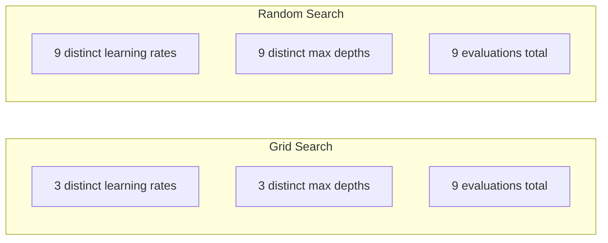
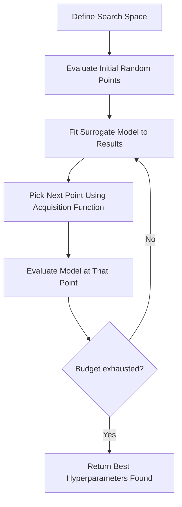
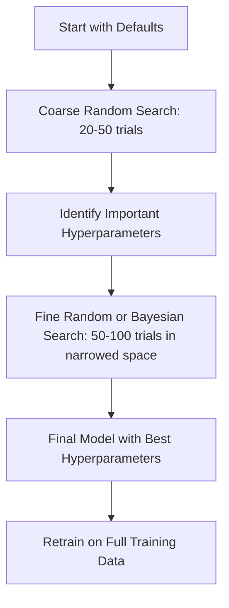
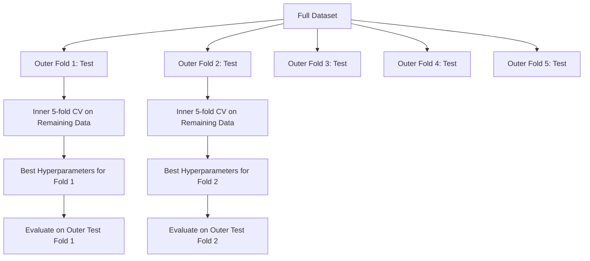

# Hyperparameter Tuning

> Hyperparameters are the knobs you turn before training starts. Turning them well is the difference between a mediocre model and an excellent one.

**Type:** Build
**Languages:** Python
**Prerequisites:** Phase 2 Lesson 11 (Ensemble Methods)
**Time:** ~90 minutes

## Learning Objectives

- Implement grid search, random search, and Bayesian optimization from scratch and compare their sample efficiency
- Explain why random search outperforms grid search when most hyperparameters have low effective dimensionality
- Build a Bayesian optimization loop using a surrogate model and acquisition function to guide the search
- Design a hyperparameter tuning strategy that avoids overfitting the validation set through proper cross-validation

## The Problem

Your gradient boosting model has learning rate, number of trees, max depth, min samples per leaf, subsample ratio, and column sample ratio. That's six hyperparameters. If each has 5 reasonable values, the grid has 5^6 = 15,625 combinations. Each takes 10 seconds to train. Exhaustive search is 43 hours of compute.

Grid search is the most obvious approach and the worst at scale. Random search does better with less compute. Bayesian optimization does better still by learning from past evaluations. Knowing which strategy to use and which hyperparameters actually matter saves days of wasted GPU time.

## The Concept

### Parameters vs. Hyperparameters

Parameters are learned during training (weights, biases, split thresholds). Hyperparameters are set before training begins and control how learning proceeds.

| Hyperparameter | What it controls | Typical range |
|---------------|-----------------|---------------|
| Learning rate | Step size per update | 0.001 to 1.0 |
| Number of trees/epochs | How long to train | 10 to 10,000 |
| Max depth | Model complexity | 1 to 30 |
| Regularization (lambda) | Overfitting prevention | 0.0001 to 100 |
| Batch size | Gradient estimate noise | 16 to 512 |
| Dropout rate | Fraction of neurons dropped | 0.0 to 0.5 |

### Grid Search

Grid search evaluates every combination of specified values. It's exhaustive and easy to understand, but scales exponentially with the number of hyperparameters.

```
Grid for 2 hyperparameters:

  learning_rate: [0.01, 0.1, 1.0]
  max_depth:     [3, 5, 7]

  Evaluations: 3 x 3 = 9 combinations

  (0.01, 3)  (0.01, 5)  (0.01, 7)
  (0.1,  3)  (0.1,  5)  (0.1,  7)
  (1.0,  3)  (1.0,  5)  (1.0,  7)
```

Grid search has a fundamental flaw: if one hyperparameter matters and another doesn't, most evaluations are wasted. Out of 9 evaluations, you only get 3 distinct values for the important parameter.

### Random Search

Random search samples hyperparameters from distributions rather than a grid. With the same budget of 9 evaluations, you get 9 distinct values for each hyperparameter.



Why random beats grid (Bergstra & Bengio, 2012):

- Most hyperparameters have low effective dimensionality. For a given problem, usually only 1-2 out of 6 hyperparameters matter.
- Grid search wastes evaluations on unimportant dimensions.
- Random search covers important dimensions more densely for the same budget.
- With 60 random trials, you have a 95% chance of finding a point within 5% of the optimum (if one exists in the search space).

### Bayesian Optimization

Random search ignores results. It doesn't learn that high learning rates cause divergence, or that depth 3 consistently outperforms depth 10. Bayesian optimization uses past evaluations to decide where to search next.



Two key components:

**Surrogate model:** A cheap-to-evaluate model (typically a Gaussian process) that approximates the expensive objective function. It gives both a prediction and an uncertainty estimate at any point in the search space.

**Acquisition function:** Decides the next evaluation point by balancing exploitation (searching near known good points) and exploration (searching where uncertainty is high). Common choices:

- **Expected Improvement (EI):** How much improvement over the current best do we expect at this point?
- **Upper Confidence Bound (UCB):** Predicted value plus some multiple of uncertainty. High UCB means either promising or unexplored.
- **Probability of Improvement (PI):** How likely is this point to beat the current best?

Bayesian optimization typically finds better hyperparameters than random search in 2-5x fewer evaluations. The overhead of fitting the surrogate model is negligible compared to training the real model.

### Early Stopping

Not every training run needs to finish. If a configuration is clearly bad after 10 epochs, kill it and try the next one. This is early stopping in the hyperparameter search context.

Strategies:
- **Patience-based:** Stop if validation loss hasn't improved for N consecutive epochs
- **Median pruning:** Stop a trial if its intermediate result at the same step is worse than the median of completed trials
- **Hyperband:** Allocate small budgets to many configurations, then progressively increase budget for the best ones

Hyperband is particularly effective. It starts 81 configurations with 1 epoch each, keeps the top third and gives them 3 epochs, keeps the top third again, and so on. This finds good configurations 10-50x faster than running all configurations to full budget.

### Learning Rate Schedulers

Learning rate is almost always the most important hyperparameter. Rather than fixing it, schedulers adjust it during training.

| Scheduler | Formula | When to use |
|-----------|---------|-------------|
| Step decay | Multiply by 0.1 every N epochs | Classic CNN training |
| Cosine annealing | lr * 0.5 * (1 + cos(pi * t / T)) | Modern default |
| Warmup + decay | Linear ramp up then cosine decay | Transformer |
| One-cycle | Ramp up then ramp down in one cycle | Fast convergence |
| Reduce on plateau | Reduce by factor when metric stalls | Safe default |

### Hyperparameter Importance

Not all hyperparameters matter equally. Studies on random forests (Probst et al., 2019) and gradient boosting reveal consistent patterns:

**High importance:**
- Learning rate (always tune first)
- Number of estimators/epochs (use early stopping instead of tuning it)
- Regularization strength

**Medium importance:**
- Max depth / number of layers
- Min samples per leaf / weight decay
- Subsample ratio

**Low importance:**
- Max features (for random forests)
- Specific activation function choice
- Batch size (within reasonable range)

Tune the important ones first. Leave the rest at defaults.

### Practical Strategy



Concrete workflow:

1. **Start with library defaults.** They're chosen by experienced practitioners and often get you 80% of the way.
2. **Coarse random search.** Wide ranges, 20-50 trials. Use early stopping to quickly kill bad runs.
3. **Analyze results.** Which hyperparameters correlate with performance? Narrow the search space.
4. **Fine search.** Bayesian optimization or focused random search in the narrowed space. 50-100 trials.
5. **Retrain on full training data** with the best hyperparameters found.

### Cross-Validation Integration

Tuning hyperparameters on a single validation split is risky. The best hyperparameters may overfit to that particular validation fold. Nested cross-validation solves this with two loops:

- **Outer loop** (evaluation): Splits data into train+val and test. Reports unbiased performance.
- **Inner loop** (tuning): Splits train+val into train and val. Finds best hyperparameters.



Each outer fold independently finds its own best hyperparameters. The outer scores are unbiased estimates of generalization performance.

With sklearn:

```python
from sklearn.model_selection import cross_val_score, GridSearchCV
from sklearn.ensemble import GradientBoostingRegressor

inner_cv = GridSearchCV(
    GradientBoostingRegressor(),
    param_grid={
        "learning_rate": [0.01, 0.05, 0.1],
        "max_depth": [2, 3, 5],
        "n_estimators": [50, 100, 200],
    },
    cv=5,
    scoring="neg_mean_squared_error",
)

outer_scores = cross_val_score(
    inner_cv, X, y, cv=5, scoring="neg_mean_squared_error"
)

print(f"Nested CV MSE: {-outer_scores.mean():.4f} +/- {outer_scores.std():.4f}")
```

This is expensive (5 outer folds x 5 inner folds x 27 grid points = 675 model fits), but it gives you a trustworthy performance estimate. Use it when reporting final results in papers or when the stakes of the decision are high.

### Practical Tips

**Start with learning rate.** For gradient-based methods, it's always the most important hyperparameter. A bad learning rate makes everything else irrelevant. Fix other hyperparameters at defaults and sweep learning rate first.

**Use log-uniform distributions for learning rate and regularization.** The difference between 0.001 and 0.01 is as important as the difference between 0.1 and 1.0. Linear search wastes budget on the high end.

**Use early stopping instead of tuning n_estimators.** For boosting and neural networks, set n_estimators or epochs high and let early stopping decide when to stop. This removes one hyperparameter from the search.

**Budget allocation.** Spend 60% of your tuning budget on the top 2 most important hyperparameters. Spend the remaining 40% on everything else. The top 2 account for most performance variation.

**Scale matters.** Never search batch size on a log scale (16, 32, 64 is fine). Always search learning rate on a log scale. Match the search distribution to how the hyperparameter affects the model.

| Model Type | Top Hyperparameters | Recommended Search | Budget |
|-----------|--------------------|--------------------|--------|
| Random Forest | n_estimators, max_depth, min_samples_leaf | Random search, 50 trials | Low (fast to train) |
| Gradient Boosting | learning_rate, n_estimators, max_depth | Bayesian, 100 trials + early stopping | Medium |
| Neural Network | learning_rate, weight_decay, batch_size | Bayesian or random, 100+ trials | High (slow to train) |
| SVM | C, gamma (RBF kernel) | Log-scale grid, 25-50 trials | Low (2 params) |
| Lasso/Ridge | alpha | Log-scale 1D search, 20 trials | Very low |
| XGBoost | learning_rate, max_depth, subsample, colsample | Bayesian, 100-200 trials + early stopping | Medium |

**When in doubt:** Random search with 2x as many trials as hyperparameters (e.g., 6 hyperparameters = at least 12+ trials). You'd be surprised how often 50 random trials beat a carefully designed grid search.

## Build It

### Step 1: Grid Search from Scratch

The code in `code/tuning.py` implements grid search, random search, and a simple Bayesian optimizer from scratch.

```python
def grid_search(model_fn, param_grid, X_train, y_train, X_val, y_val):
    keys = list(param_grid.keys())
    values = list(param_grid.values())
    best_score = -float("inf")
    best_params = None
    n_evals = 0

    for combo in itertools.product(*values):
        params = dict(zip(keys, combo))
        model = model_fn(**params)
        model.fit(X_train, y_train)
        score = evaluate(model, X_val, y_val)
        n_evals += 1

        if score > best_score:
            best_score = score
            best_params = params

    return best_params, best_score, n_evals
```

### Step 2: Random Search from Scratch

```python
def random_search(model_fn, param_distributions, X_train, y_train,
                  X_val, y_val, n_iter=50, seed=42):
    rng = np.random.RandomState(seed)
    best_score = -float("inf")
    best_params = None

    for _ in range(n_iter):
        params = {k: sample(v, rng) for k, v in param_distributions.items()}
        model = model_fn(**params)
        model.fit(X_train, y_train)
        score = evaluate(model, X_val, y_val)

        if score > best_score:
            best_score = score
            best_params = params

    return best_params, best_score, n_iter
```

### Step 3: Bayesian Optimization (Simplified)

The core idea: fit a Gaussian process to observed (hyperparameter, score) pairs, then use an acquisition function to decide where to look next.

```python
class SimpleBayesianOptimizer:
    def __init__(self, search_space, n_initial=5):
        self.search_space = search_space
        self.n_initial = n_initial
        self.X_observed = []
        self.y_observed = []

    def _kernel(self, x1, x2, length_scale=1.0):
        dists = np.sum((x1[:, None, :] - x2[None, :, :]) ** 2, axis=2)
        return np.exp(-0.5 * dists / length_scale ** 2)

    def _fit_gp(self, X_new):
        X_obs = np.array(self.X_observed)
        y_obs = np.array(self.y_observed)
        y_mean = y_obs.mean()
        y_centered = y_obs - y_mean

        K = self._kernel(X_obs, X_obs) + 1e-4 * np.eye(len(X_obs))
        K_star = self._kernel(X_new, X_obs)

        L = np.linalg.cholesky(K)
        alpha = np.linalg.solve(L.T, np.linalg.solve(L, y_centered))
        mu = K_star @ alpha + y_mean

        v = np.linalg.solve(L, K_star.T)
        var = 1.0 - np.sum(v ** 2, axis=0)
        var = np.maximum(var, 1e-6)

        return mu, var

    def _expected_improvement(self, mu, var, best_y):
        sigma = np.sqrt(var)
        z = (mu - best_y) / (sigma + 1e-10)
        ei = sigma * (z * norm_cdf(z) + norm_pdf(z))
        return ei

    def suggest(self):
        if len(self.X_observed) < self.n_initial:
            return sample_random(self.search_space)

        candidates = [sample_random(self.search_space) for _ in range(500)]
        X_cand = np.array([to_vector(c) for c in candidates])
        mu, var = self._fit_gp(X_cand)
        ei = self._expected_improvement(mu, var, max(self.y_observed))
        return candidates[np.argmax(ei)]

    def observe(self, params, score):
        self.X_observed.append(to_vector(params))
        self.y_observed.append(score)
```

The GP surrogate gives two things at each candidate point: a predicted score (mu) and an uncertainty (var). Expected improvement balances these: it favors points where the model predicts a high score **or** where uncertainty is high. Early on, most points have high uncertainty so the optimizer explores. Later, it focuses on the most promising regions.

### Step 4: Compare All Methods

Run all three methods on the same synthetic objective and compare. This comparison uses a simplified wrapper that calls each optimizer directly with an objective function (no model training), so the API differs from the model-based implementations above:

```python
def synthetic_objective(params):
    lr = params["learning_rate"]
    depth = params["max_depth"]
    return -(np.log10(lr) + 2) ** 2 - (depth - 4) ** 2 + 10

param_grid = {
    "learning_rate": [0.001, 0.01, 0.1, 1.0],
    "max_depth": [2, 3, 4, 5, 6, 7, 8],
}

grid_best = None
grid_score = -float("inf")
grid_history = []
for combo in itertools.product(*param_grid.values()):
    params = dict(zip(param_grid.keys(), combo))
    score = synthetic_objective(params)
    grid_history.append((params, score))
    if score > grid_score:
        grid_score = score
        grid_best = params

param_dist = {
    "learning_rate": ("log_float", 0.001, 1.0),
    "max_depth": ("int", 2, 8),
}

rand_best = None
rand_score = -float("inf")
rand_history = []
rng = np.random.RandomState(42)
for _ in range(28):
    params = {k: sample(v, rng) for k, v in param_dist.items()}
    score = synthetic_objective(params)
    rand_history.append((params, score))
    if score > rand_score:
        rand_score = score
        rand_best = params

optimizer = SimpleBayesianOptimizer(param_dist, n_initial=5)
bayes_history = []
for _ in range(28):
    params = optimizer.suggest()
    score = synthetic_objective(params)
    optimizer.observe(params, score)
    bayes_history.append((params, score))
bayes_score = max(s for _, s in bayes_history)

print(f"{'Method':<20} {'Best Score':>12} {'Evaluations':>12}")
print("-" * 50)
print(f"{'Grid Search':<20} {grid_score:>12.4f} {len(grid_history):>12}")
print(f"{'Random Search':<20} {rand_score:>12.4f} {len(rand_history):>12}")
print(f"{'Bayesian Opt':<20} {bayes_score:>12.4f} {len(bayes_history):>12}")
```

For the same budget, Bayesian optimization typically finds the best score fastest because it doesn't waste evaluations in obviously bad regions. Random search covers a wider range than grid search. Grid search only wins when you have very few hyperparameters and can afford to be exhaustive.

## Use It

### Optuna in Practice

Optuna is the recommended library for serious hyperparameter tuning. It supports pruning, distributed search, and visualization out of the box.

```python
import optuna

def objective(trial):
    lr = trial.suggest_float("learning_rate", 1e-4, 1e-1, log=True)
    n_est = trial.suggest_int("n_estimators", 50, 500)
    max_depth = trial.suggest_int("max_depth", 2, 10)

    model = GradientBoostingRegressor(
        learning_rate=lr,
        n_estimators=n_est,
        max_depth=max_depth,
    )
    model.fit(X_train, y_train)
    return mean_squared_error(y_val, model.predict(X_val))

study = optuna.create_study(direction="minimize")
study.optimize(objective, n_trials=100)

print(f"Best params: {study.best_params}")
print(f"Best MSE: {study.best_value:.4f}")
```

Key Optuna features:
- `suggest_float(..., log=True)` for parameters best searched on log scale (learning rate, regularization)
- `suggest_int` for integer parameters
- `suggest_categorical` for discrete choices
- Built-in MedianPruner for early stopping of bad trials
- `study.trials_dataframe()` for analysis

### Optuna with Pruning

Pruning kills unpromising trials early, saving significant compute. Here's the pattern:

```python
import optuna
from sklearn.model_selection import cross_val_score

def objective(trial):
    params = {
        "learning_rate": trial.suggest_float("lr", 1e-4, 0.5, log=True),
        "max_depth": trial.suggest_int("max_depth", 2, 10),
        "n_estimators": trial.suggest_int("n_estimators", 50, 500),
        "subsample": trial.suggest_float("subsample", 0.5, 1.0),
    }

    model = GradientBoostingRegressor(**params)
    scores = cross_val_score(model, X_train, y_train, cv=3,
                             scoring="neg_mean_squared_error")
    mean_score = -scores.mean()

    trial.report(mean_score, step=0)
    if trial.should_prune():
        raise optuna.TrialPruned()

    return mean_score

pruner = optuna.pruners.MedianPruner(n_startup_trials=10, n_warmup_steps=5)
study = optuna.create_study(direction="minimize", pruner=pruner)
study.optimize(objective, n_trials=200)
```

`MedianPruner` kills a trial when its intermediate value is worse than the median of all completed trials at the same step. Pruning requires calling `trial.report()` to report intermediate metrics and `trial.should_prune()` to check whether to stop. `n_startup_trials=10` ensures at least 10 trials run to completion before pruning kicks in. This typically saves 40-60% of total compute.

### sklearn Built-in Tuners

For quick experiments, sklearn provides `GridSearchCV`, `RandomizedSearchCV`, and `HalvingRandomSearchCV`:

```python
from sklearn.model_selection import RandomizedSearchCV
from scipy.stats import loguniform, randint

param_dist = {
    "learning_rate": loguniform(1e-4, 0.5),
    "max_depth": randint(2, 10),
    "n_estimators": randint(50, 500),
}

search = RandomizedSearchCV(
    GradientBoostingRegressor(),
    param_dist,
    n_iter=100,
    cv=5,
    scoring="neg_mean_squared_error",
    random_state=42,
    n_jobs=-1,
)
search.fit(X_train, y_train)
print(f"Best params: {search.best_params_}")
print(f"Best CV MSE: {-search.best_score_:.4f}")
```

Use scipy's `loguniform` for learning rate and regularization. Use `randint` for integer hyperparameters. The `n_jobs=-1` flag parallelizes across all CPU cores.

### Common Mistakes in Hyperparameter Tuning

**Data leakage from preprocessing.** If you fit a scaler on the entire dataset before cross-validation, validation fold information leaks into training. Always put preprocessing inside a `Pipeline` so it fits only on the training fold.

**Overfitting the validation set.** Running thousands of trials effectively trains on the validation set. Use nested cross-validation for final performance estimates, or hold out a separate test set never touched during tuning.

**Search range too narrow.** If your best value lands at the boundary of the search space, you didn't search wide enough. The optimum may be outside your range. Always check if the best parameters are at the edge.

**Ignoring interaction effects.** Learning rate and number of estimators interact strongly in boosting. Low learning rate requires more estimators. Tuning them independently gives worse results than tuning them together.

**No early stopping for iterative models.** For gradient boosting and neural networks, set n_estimators or epochs high and use early stopping. This is strictly better than tuning the number of iterations as a hyperparameter.

## Exercises

1. Run grid search and random search with the same total budget (e.g., 50 evaluations). Compare the best score found. Run 10 experiments with different random seeds. How often does random search win?

2. Implement Hyperband from scratch. Start with 81 configurations, each trained for 1 epoch. Each round, keep the top 1/3 and triple their budget. Compare total compute (sum of all epochs across all configurations) against running all 81 configurations to full budget.

3. Add a learning rate scheduler (cosine annealing) to the gradient boosting implementation from Lesson 11. Does it help compared to a fixed learning rate?

4. Use Optuna to tune a RandomForestClassifier on a real dataset (e.g., sklearn's breast cancer dataset). Use `optuna.visualization.plot_param_importances(study)` to see which hyperparameters matter most. Does it match the importance ranking in this lesson?

5. Implement a simple acquisition function (expected improvement) and demonstrate exploration vs. exploitation. Plot the surrogate model's mean and uncertainty, and show where EI chooses to evaluate next.

## Key Terms

| Term | What people say | What it actually is |
|------|----------------|----------------------|
| Hyperparameter | "A setting you choose" | A value set before training that controls the learning process and is not learned from data |
| Grid search | "Try every combination" | Exhaustive search over a specified parameter grid. Exponential cost. |
| Random search | "Just sample randomly" | Sampling hyperparameters from distributions. Covers important dimensions better than grid search. |
| Bayesian optimization | "Smart search" | Uses a surrogate model of the objective to decide where to evaluate next, balancing exploration and exploitation |
| Surrogate model | "A cheap approximation" | A model (typically a Gaussian process) that approximates the expensive objective function from observed evaluations |
| Acquisition function | "Where to look next" | Scores candidate points by balancing expected improvement and uncertainty. EI and UCB are common choices. |
| Early stopping | "Don't waste time" | Terminating training early when validation performance stops improving |
| Hyperband | "Tournament bracket for configurations" | Adaptive resource allocation: start many configurations with small budgets, keep the best and increase their budget |
| Learning rate scheduler | "Change lr during training" | A function that adjusts the learning rate throughout training for better convergence |

## Further Reading

- [Bergstra & Bengio: Random Search for Hyper-Parameter Optimization (2012)](https://jmlr.org/papers/v13/bergstra12a.html) -- The paper proving random beats grid
- [Snoek et al., Practical Bayesian Optimization of Machine Learning Algorithms (2012)](https://arxiv.org/abs/1206.2944) -- Bayesian optimization for ML
- [Li et al., Hyperband: A Novel Bandit-Based Approach (2018)](https://jmlr.org/papers/v18/16-558.html) -- The Hyperband paper
- [Optuna: A Next-generation Hyperparameter Optimization Framework](https://arxiv.org/abs/1907.10902) -- The Optuna paper
- [Probst et al., Tunability: Importance of Hyperparameters (2019)](https://jmlr.org/papers/v20/18-444.html) -- Which hyperparameters matter
