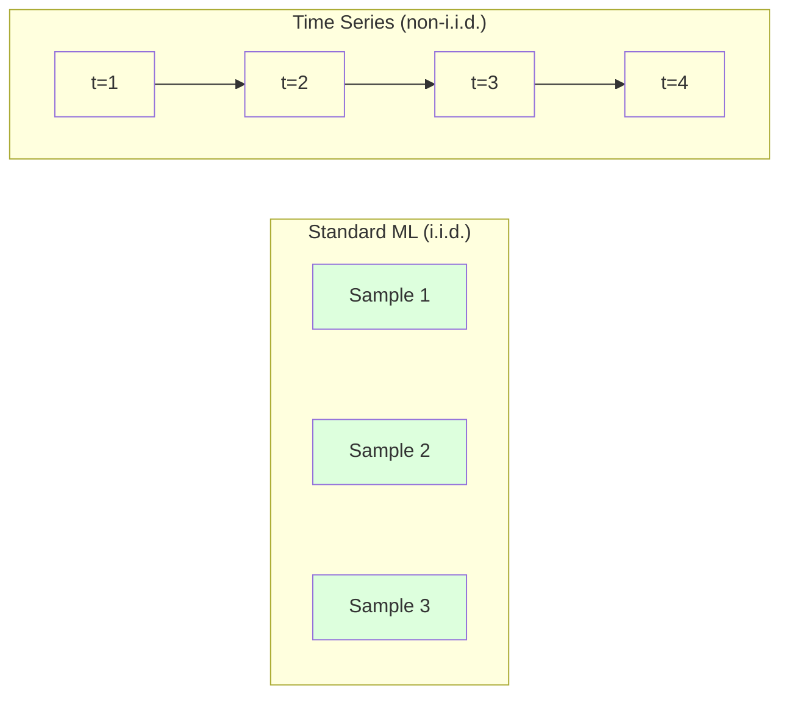
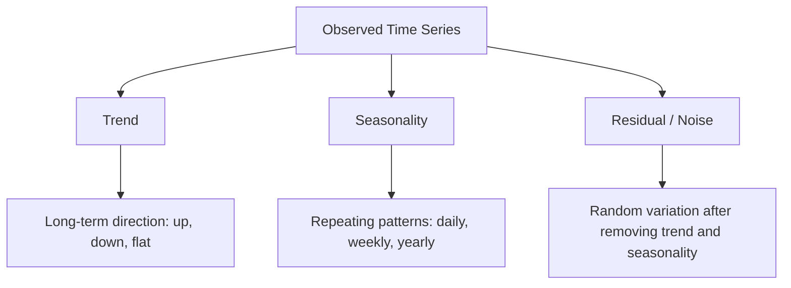
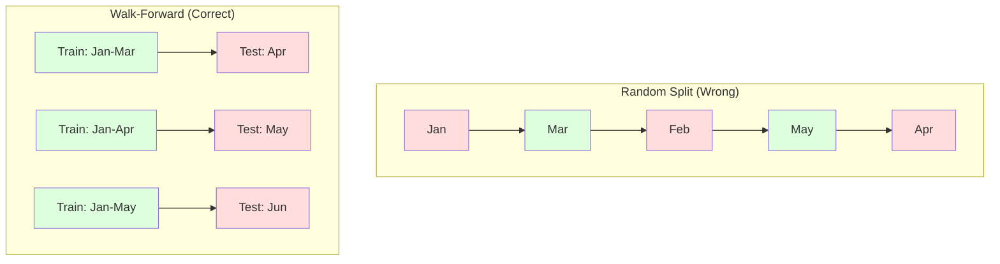

# Time Series Fundamentals

> Past performance does predict future results — as long as you check for stationarity first.

**Type:** Build
**Languages:** Python
**Prerequisites:** Phase 2 Lessons 01-09
**Time:** ~90 minutes

## Learning Objectives

- Decompose a time series into trend, seasonality, and residual components and test for stationarity
- Implement lag features and rolling statistics to convert a time series into a supervised learning problem
- Build a walk-forward validation framework that prevents future data from leaking into training
- Explain why random train/test splits are invalid for time series and demonstrate the performance gap between random splits and proper temporal splits

## The Problem

You have data ordered in time. Daily sales, hourly temperature, per-minute CPU usage, weekly stock prices. You want to predict the next value, the next week, the next quarter.

You reach for the standard ML toolbox: random train/test split, cross-validation, feature matrix in, predictions out. Every step is wrong.

Time series breaks the assumptions that standard ML relies on. Samples aren't independent — today's temperature depends on yesterday's. Random splits leak future information into the past. Features that look great in backtesting fail in production because the patterns they rely on drift over time.

A model that achieves 95% accuracy with random cross-validation might only get 55% with proper time-based evaluation. That gap isn't a technicality — it's the difference between a model that works on paper and one that works in production.

This lesson covers the fundamentals: what makes temporal data different, how to evaluate models honestly, and how to turn time series into features that standard ML models can consume.

## The Concept

### What Makes Time Series Different

Standard ML assumes i.i.d. — independent and identically distributed. Every sample is drawn from the same distribution, independently of every other sample. Time series violates both:

- **Not independent.** Today's stock price depends on yesterday's. This week's sales correlate with last week's.
- **Not identically distributed.** The distribution shifts over time. December sales look nothing like March sales.

These violations aren't minor. They change how you build features, how you evaluate models, and which algorithms work.



In standard ML, samples are interchangeable. Shuffling them changes nothing. In time series, order is everything. Shuffling destroys the signal.

### Components of a Time Series

Every time series is a combination of:



- **Trend**: Long-term direction. Revenue growing 10% per year. Global temperatures rising.
- **Seasonality**: Repeating patterns at fixed intervals. Retail sales spike in December. AC usage peaks in July.
- **Residual**: Everything left after removing trend and seasonality. If residuals look like white noise, the decomposition captured the signal.

### Stationarity

A time series is stationary if its statistical properties (mean, variance, autocorrelation) don't change over time. Most forecasting methods assume stationarity.

**Why it matters:** A non-stationary series has a drifting mean. A model trained on January data learns a mean that's different from what February will exhibit. It will be systematically wrong.

**How to check:** Compute rolling mean and rolling standard deviation over windows. If they drift, the series is non-stationary.

**How to fix:** Differencing. Instead of modeling the raw values, model the changes between consecutive values:

```
diff[t] = value[t] - value[t-1]
```

If one round of differencing doesn't make the series stationary, do another (second-order differencing). Most real-world series need at most two rounds.

**Example:**

Raw series: [100, 102, 106, 112, 120]
First difference: [2, 4, 6, 8] (still trending up)
Second difference: [2, 2, 2] (constant — stationary)

The raw series has a quadratic trend. First differencing turns it into a linear trend. Second differencing flattens it. In practice you rarely need more than two rounds.

**Formal test:** The Augmented Dickey-Fuller (ADF) test is the standard statistical test for stationarity. The null hypothesis is "the series is non-stationary." A p-value below 0.05 means you can reject the null and conclude stationarity. We don't implement ADF from scratch (it requires asymptotic distribution tables), but the rolling statistics approach in our code provides a practical visual check.

### Autocorrelation

Autocorrelation measures how much the value at time t correlates with the value at time t-k (k steps in the past). The autocorrelation function (ACF) plots this correlation for each lag k.

**What ACF tells you:**
- How far back the series remembers. If ACF drops to zero after lag 5, then values more than 5 steps ago are irrelevant.
- Whether seasonality exists. If ACF spikes at lag 12 (monthly data), there's yearly seasonality.
- How many lag features to create. Use up to the lag where ACF becomes negligible.

**PACF (Partial Autocorrelation Function)** removes indirect correlations. If today is correlated with 3 days ago only because both are correlated with yesterday, then the PACF at lag 3 will be zero while the ACF at lag 3 won't.

### Lag Features: Turning Time Series into Supervised Learning

Standard ML models need a feature matrix X and a target y. Time series gives you a single column of values. The bridge is lag features.

Take the series [10, 12, 14, 13, 15] and create lag-1 and lag-2 features:

| lag_2 | lag_1 | target |
|-------|-------|--------|
| 10    | 12    | 14     |
| 12    | 14    | 13     |
| 14    | 13    | 15     |

Now you have a standard regression problem. Any ML model (linear regression, random forest, gradient boosting) can predict the target from lag values.

Additional features you can create:
- **Rolling statistics:** Mean, std, min, max of the last k values
- **Calendar features:** Day of week, month, is_holiday, is_weekend
- **Differenced values:** Change relative to the previous step
- **Expanding statistics:** Cumulative mean, cumulative sum
- **Ratio features:** Current value / rolling mean (how far from recent average)
- **Interaction features:** lag_1 * day_of_week (day-of-week effect on momentum)

**How many lags?** Use the autocorrelation function. If ACF is significant up to lag 10, use at least 10 lags. If there's weekly seasonality, include lag 7 (and maybe 14). More lags give the model more history but also more features to fit, increasing overfitting risk.

**Target alignment trap.** When creating lag features, the target must be the value at time t, and all features must use values from time t-1 or earlier. If you accidentally include the value at time t as a feature, you have a perfect predictor — and a completely useless model. This is the most common bug in time series feature engineering.

### Walk-Forward Validation

This is the most important concept in this lesson. Standard k-fold cross-validation randomly assigns samples to train and test. For time series, this leaks future information.



Walk-forward validation:
1. Train on data before time t
2. Predict time t+1 (or t+1 through t+k for multi-step)
3. Slide the window forward
4. Repeat

Every test fold contains only data that comes after all training data. No future leakage. This gives you an honest estimate of how the model would perform after deployment.

**Expanding window** trains on all historical data (window grows). **Sliding window** trains on a fixed-size training window (window slides). Use expanding when you believe old data is still relevant. Use sliding when the world is changing and old data hurts.

### ARIMA Intuition

ARIMA is the classic time series model. It has three components:

- **AR (Autoregressive):** Predict from past values. AR(p) uses the last p values.
- **I (Integrated):** Differencing to achieve stationarity. I(d) applies d rounds of differencing.
- **MA (Moving Average):** Predict from past forecast errors. MA(q) uses the last q errors.

ARIMA(p, d, q) combines all three. You choose p, d, q based on ACF/PACF analysis or automated search (auto-ARIMA).

We don't implement ARIMA from scratch — it requires numerical optimization beyond this lesson's scope. The key insight is understanding what each component does so you can interpret ARIMA results and know when to use it.

### When to Use What

| Method | Best For | Handles Seasonality | Handles External Features |
|----------|---------|-------------------|------------------------|
| Lag features + ML | Tabular with many external features | Yes, with calendar features | Yes |
| ARIMA | Univariate series, short-term | SARIMA variant | No (ARIMAX limited) |
| Exponential smoothing | Simple trend + seasonality | Yes (Holt-Winters) | No |
| Prophet | Business forecasting, holidays | Yes (Fourier terms) | Limited |
| Neural networks (LSTM, Transformer) | Long sequences, multi-series | Learns on its own | Yes |

For most practical problems, lag features + gradient boosting is the strongest starting point. It handles external features naturally, doesn't require stationarity, and is easy to debug.

### Forecast Horizon and Strategies

Single-step forecasting predicts one time step ahead. Multi-step forecasting predicts multiple time steps ahead. There are three strategies:

**Recursive (iterative):** Predict one step ahead, use the prediction as input for the next step. Simple but errors accumulate — each prediction uses the previous prediction, so mistakes compound.

**Direct:** Train a separate model for each horizon. Model 1 predicts t+1, model 5 predicts t+5. No error accumulation, but each model has fewer training samples and they don't share information.

**Multi-output:** Train one model that outputs all horizons simultaneously. Shares information across horizons but requires models that support multi-output (or a custom loss function).

For most practical problems, start with recursive for short horizons (1-5 steps) and direct for long horizons.

### Common Time Series Mistakes

| Mistake | Why It Happens | How to Fix |
|---------|---------------|-----------|
| Random train/test split | Standard ML habit | Use walk-forward or temporal split |
| Using future features | Value at time t accidentally included | Audit temporal alignment of every feature |
| Overfitting seasonality | Model memorizes calendar patterns | Leave at least one full seasonal cycle in the test set |
| Ignoring scale changes | Revenue doubles but patterns stay | Model percentage changes instead of absolute values |
| Too many lag features | "More history is better" | Use ACF to determine relevant lags |
| Not differencing | "The model will figure it out" | Tree models handle trends; linear models need stationarity |

## Build It

The code in `code/time_series.py` implements the core building blocks from scratch.

### Lag Feature Generator

```python
def make_lag_features(series, n_lags):
    n = len(series)
    X = np.full((n, n_lags), np.nan)
    for lag in range(1, n_lags + 1):
        X[lag:, lag - 1] = series[:-lag]
    valid = ~np.isnan(X).any(axis=1)
    return X[valid], series[valid]
```

This converts a 1D series into a feature matrix where each row uses the most recent `n_lags` values as features and the current value as the target.

### Walk-Forward Cross-Validation

```python
def walk_forward_split(n_samples, n_splits=5, min_train=50):
    assert min_train < n_samples, "min_train must be less than n_samples"
    step = max(1, (n_samples - min_train) // n_splits)
    for i in range(n_splits):
        train_end = min_train + i * step
        test_end = min(train_end + step, n_samples)
        if train_end >= n_samples:
            break
        yield slice(0, train_end), slice(train_end, test_end)
```

Each split ensures training data strictly precedes test data. The training window expands with each fold.

### Simple Autoregressive Model

A pure AR model is just linear regression on lag features:

```python
class SimpleAR:
    def __init__(self, n_lags=5):
        self.n_lags = n_lags
        self.weights = None
        self.bias = None

    def fit(self, series):
        X, y = make_lag_features(series, self.n_lags)
        # Solve with normal equation
        X_b = np.column_stack([np.ones(len(X)), X])
        theta = np.linalg.lstsq(X_b, y, rcond=None)[0]
        self.bias = theta[0]
        self.weights = theta[1:]
        return self
```

This is conceptually identical to the linear regression from Lesson 02, just applied to lagged versions of the same variable.

### Stationarity Check

The code computes rolling statistics to assess stationarity visually and numerically:

```python
def check_stationarity(series, window=50):
    rolling_mean = np.array([
        series[max(0, i - window):i].mean()
        for i in range(1, len(series) + 1)
    ])
    rolling_std = np.array([
        series[max(0, i - window):i].std()
        for i in range(1, len(series) + 1)
    ])
    return rolling_mean, rolling_std
```

If the rolling mean drifts or the rolling standard deviation changes, the series is non-stationary. Difference it and check again.

The code also checks stationarity by comparing the first half and second half of the series. If the means differ by more than half a standard deviation, or the variance ratio exceeds 2x, the series is flagged as non-stationary.

### Autocorrelation

```python
def autocorrelation(series, max_lag=20):
    n = len(series)
    mean = series.mean()
    var = series.var()
    acf = np.zeros(max_lag + 1)
    for k in range(max_lag + 1):
        cov = np.mean((series[:n-k] - mean) * (series[k:] - mean))
        acf[k] = cov / var if var > 0 else 0
    return acf
```

## Use It

With sklearn, you feed lag features directly to any regressor:

```python
from sklearn.linear_model import Ridge
from sklearn.ensemble import GradientBoostingRegressor

X, y = make_lag_features(series, n_lags=10)

for train_idx, test_idx in walk_forward_split(len(X)):
    model = Ridge(alpha=1.0)
    model.fit(X[train_idx], y[train_idx])
    predictions = model.predict(X[test_idx])
```

ARIMA with statsmodels:

```python
from statsmodels.tsa.arima.model import ARIMA

model = ARIMA(train_series, order=(5, 1, 2))
fitted = model.fit()
forecast = fitted.forecast(steps=30)
```

The code in `time_series.py` demonstrates both approaches and compares them using walk-forward validation.

### sklearn TimeSeriesSplit

sklearn provides `TimeSeriesSplit`, which implements walk-forward validation:

```python
from sklearn.model_selection import TimeSeriesSplit

tscv = TimeSeriesSplit(n_splits=5)
for train_index, test_index in tscv.split(X):
    X_train, X_test = X[train_index], X[test_index]
    y_train, y_test = y[train_index], y[test_index]
    model.fit(X_train, y_train)
    score = model.score(X_test, y_test)
```

This is equivalent to our from-scratch `walk_forward_split` but integrated into sklearn's cross-validation framework. You can use it with `cross_val_score`:

```python
from sklearn.model_selection import cross_val_score

scores = cross_val_score(model, X, y, cv=TimeSeriesSplit(n_splits=5))
print(f"Mean score: {scores.mean():.4f} +/- {scores.std():.4f}")
```

### Evaluation Metrics

Time series forecasting uses regression metrics but with time-aware context:

- **MAE (Mean Absolute Error):** Average of |y_true - y_pred|. Interpretable in original units. "On average, the forecast is off by 3.2 degrees."
- **RMSE (Root Mean Squared Error):** Square root of mean squared error. Penalizes large errors more than MAE. Use when big errors are worse than many small ones.
- **MAPE (Mean Absolute Percentage Error):** Average of |error / true_value| * 100. Scale-independent, useful for comparing across different series. Undefined when true values are zero.
- **Naive baseline comparison:** Always compare against a simple baseline. A seasonal naive baseline predicts the value from one period ago (yesterday, last week). If your model can't beat naive, something is wrong.

### Rolling Features

The code demonstrates adding rolling statistics (mean, std, min, max with 7-day and 14-day windows) to the lag features. These provide the model with recent trend and volatility information that individual lag features alone can't capture.

For example, if the rolling mean is increasing, it signals an upward trend. If the rolling standard deviation is growing, it signals increasing volatility. These are the kinds of patterns tree models can learn but linear models cannot.

## Ship It

This lesson produces:
- `outputs/prompt-time-series-advisor.md` -- A prompt for framing time series problems
- `code/time_series.py` -- Lag features, walk-forward validation, AR model, stationarity checks

### Baselines You Must Beat

Before building any model, establish baselines:

1. **Last value (persistence).** Predict tomorrow equals today. For many series, this is surprisingly hard to beat.
2. **Seasonal naive.** Predict today equals the same day last week (or last year). If your model can't beat this, it hasn't learned any useful patterns beyond seasonality.
3. **Moving average.** Predict the average of the last k values. Smooths noise but can't catch sudden changes.

If your fancy ML model loses to the seasonal naive baseline, you have a bug. The most common ones: future leakage in features, wrong evaluation methodology, or the series is truly random and unpredictable.

### Practical Tips

1. **Start by plotting.** Before any modeling, plot the raw series. Look for trends, seasonality, outliers, structural breaks (sudden behavior changes). 30 seconds of visual inspection often tells you more than an hour of automated analysis.

2. **Difference first, model second.** If the series has an obvious trend, difference it before creating lag features. Tree models can handle trends, but linear models can't, and differencing never hurts.

3. **Hold out at least one full seasonal cycle.** If you have weekly seasonality, the test set needs at least one full week. If monthly, at least one full month. Otherwise you can't evaluate whether the model captures seasonal patterns.

4. **Monitor in production.** Time series models degrade as the world changes. Track forecast error on a rolling basis. When error starts increasing, retrain with recent data.

5. **Watch for regime changes.** A model trained on pre-pandemic data can't predict post-pandemic behavior. Include indicators for known regime changes as features, or use a sliding window that forgets old data.

6. **Log-transform skewed series.** Revenue, prices, and counts are often right-skewed. Taking the log stabilizes variance and turns multiplicative patterns into additive ones, which linear models can handle. Predict in log-space, then exponentiate back to original units.

## Exercises

1. **Stationarity experiment.** Generate a series with a linear trend. Check stationarity with rolling statistics. Apply first-order differencing. Check again. How many rounds of differencing does a quadratic trend need?

2. **Lag selection.** Compute the ACF for a seasonal series (period=7). Which lags have the highest autocorrelation? Create lag features using only those lags (not consecutive lags). Does accuracy improve vs using lags 1 through 7?

3. **Walk-forward vs random split.** Train a Ridge regression on lag features. Evaluate with a random 80/20 split and with walk-forward validation. How much does the random split overestimate performance?

4. **Feature engineering.** Add rolling mean (window=7), rolling std (window=7), and day-of-week features to the lag features. Compare accuracy with and without these extra features using walk-forward validation.

5. **Multi-step forecasting.** Modify the AR model to predict 5 steps ahead instead of 1. Compare two strategies: (a) predict one step, use prediction as input for the next step (recursive), (b) train separate models for each horizon (direct). Which is more accurate?

## Key Terms

| Term | What People Say | What It Actually Is |
|------|----------------|----------------------|
| Stationarity | "Statistics don't change over time" | A series whose mean, variance, and autocorrelation structure are constant over time |
| Differencing | "Subtract consecutive values" | Computing y[t] - y[t-1] to remove trends and achieve stationarity |
| Autocorrelation (ACF) | "How much the series correlates with itself" | Correlation between a time series and its lagged copy, as a function of the lag |
| Partial autocorrelation (PACF) | "Only the direct correlation" | Autocorrelation at lag k after removing the influence of all shorter lags |
| Lag features | "Past values as inputs" | Using y[t-1], y[t-2], ..., y[t-k] as features to predict y[t] |
| Walk-forward validation | "Time-respecting cross-validation" | Evaluation where training data always precedes test data in time |
| ARIMA | "Classic time series model" | Autoregressive Integrated Moving Average: combines past values (AR), differencing (I), and past errors (MA) |
| Seasonality | "Repeating calendar patterns" | Regular, predictable cycles in a time series tied to calendar periods (daily, weekly, yearly) |
| Trend | "Long-term direction" | Persistent increase or decrease in the series level over time |
| Expanding window | "Use all history" | Walk-forward validation where the training set grows with each fold |
| Sliding window | "Fixed-size history" | Walk-forward validation where the training set is a fixed-length window that slides forward |

## Further Reading

- [Hyndman and Athanasopoulos, Forecasting: Principles and Practice (3rd ed.)](https://otexts.com/fpp3/) -- The best free textbook on time series forecasting
- [scikit-learn Time Series Split](https://scikit-learn.org/stable/modules/generated/sklearn.model_selection.TimeSeriesSplit.html) -- sklearn's walk-forward splitter
- [statsmodels ARIMA docs](https://www.statsmodels.org/stable/generated/statsmodels.tsa.arima.model.ARIMA.html) -- ARIMA implementation with diagnostics
- [Makridakis et al., The M5 Competition (2022)](https://www.sciencedirect.com/science/article/pii/S0169207021001874) -- Large-scale forecasting competition showing ML methods vs statistical methods
