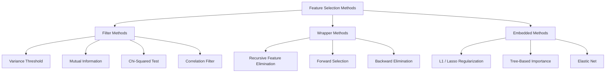
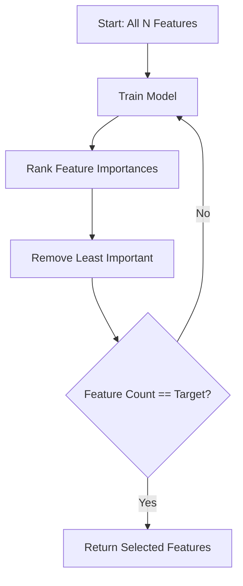
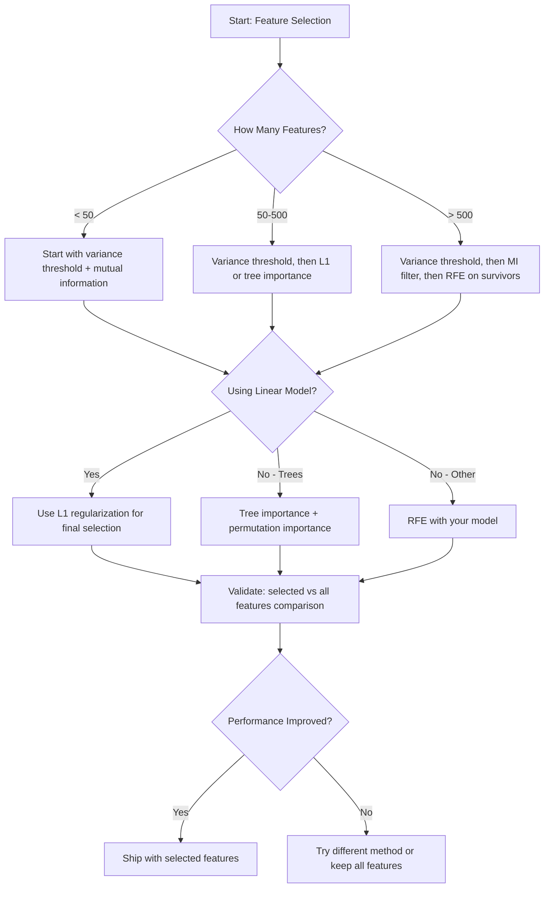

# Feature Selection

> More features isn't better. The right features is better.

**Type:** Build
**Languages:** Python
**Prerequisites:** Phase 2 Lessons 01-09, Lesson 08 (Feature Engineering)
**Time:** ~75 minutes

## Learning Objectives

- Implement filter methods (variance threshold, mutual information, chi-squared) and wrapper methods (RFE, forward selection) from scratch
- Explain why mutual information captures nonlinear feature-target relationships that correlation misses
- Compare L1 regularization (embedded selection) to RFE (wrapper selection), evaluating their computational tradeoffs
- Build a feature selection pipeline combining multiple methods and demonstrate generalization improvement on held-out data

## The Problem

You have 500 features. Your model trains slowly, overfits constantly, and nobody can explain what it learned. You add more features hoping to improve performance. It gets worse.

This is the curse of dimensionality at work. As features grow, the volume of the feature space explodes. Data points become sparse. Distances between points converge. Models need exponentially more data to find real patterns. Noise features drown out signal features. Overfitting becomes the default.

Feature selection is the antidote. Strip away noise. Remove redundancy. Keep the features that actually carry information about the target. The result: faster training, better generalization, and models you can actually explain.

The goal isn't to use all available information — it's to use the right information.

## The Concept

### Three Categories of Feature Selection

Every feature selection method falls into one of three categories:



**Filter methods** score each feature independently using a statistical measure. They don't use a model. Fast, but miss feature interactions.

**Wrapper methods** train a model to evaluate feature subsets. They use model performance as the score. Better results, but expensive because the model is retrained repeatedly.

**Embedded methods** perform feature selection as part of model training. L1 regularization pushes weights to zero. Decision trees split on the most useful features. Selection happens during fitting, not as a separate step.

### Variance Threshold

The simplest filter. If a feature barely varies across samples, it carries almost no information.

Consider a feature that is 0.0 for 999 out of 1000 samples. Its variance is near zero. No model can use it to distinguish classes. Remove it.

```
variance(x) = mean((x - mean(x))^2)
```

Set a threshold (e.g., 0.01). Drop every feature with variance below it. This removes constant or near-constant features without looking at the target variable at all.

When to use: as a preprocessing step before other methods. It catches obviously useless features at near-zero cost.

Limitation: a feature can have high variance and still be pure noise. Variance threshold is necessary but not sufficient.

### Mutual Information

Mutual information measures how much knowing feature X reduces uncertainty about target Y.

```
I(X; Y) = sum_x sum_y p(x, y) * log(p(x, y) / (p(x) * p(y)))
```

If X and Y are independent, p(x, y) = p(x) * p(y), so the log term is zero and I(X; Y) = 0. The more X tells you about Y, the higher the mutual information.

Key advantage over correlation: mutual information captures nonlinear relationships. A feature can have zero correlation with the target but high mutual information because the relationship is quadratic or periodic.

For continuous features, discretize into bins first (histogram-based estimation). The number of bins affects the estimate — too few bins lose information, too many add noise. Common choices: sqrt(n) bins or Sturges' rule (1 + log2(n)).


### Recursive Feature Elimination (RFE)

RFE is a wrapper method. It uses the model's own feature importances to iteratively prune:

1. Train model with all features
2. Rank features by importance (coefficients for linear models, impurity decrease for trees)
3. Remove the least important feature
4. Repeat until the desired number of features remains



RFE accounts for feature interactions because the model sees all remaining features together. Removing one feature changes the importance of others. This makes it more thorough than filter methods.

Cost: you train the model N - target times. With 500 features and a target of 10, that's 490 training runs. For expensive models, this is slow. You can speed it up by removing multiple features per step (e.g., drop the bottom 10% each round).

### L1 (Lasso) Regularization

L1 regularization adds the absolute value of weights to the loss function:

```
loss = prediction_error + alpha * sum(|w_i|)
```

The alpha parameter controls how aggressively features are pruned. Higher alpha means more weights become exactly zero.

Why exactly zero? The L1 penalty creates a diamond-shaped constraint region in weight space. The optimal solution tends to land on the corners of this diamond, where one or more weights are zero. L2 regularization (ridge) creates a circular constraint, and weights shrink but rarely hit exactly zero.

This is embedded feature selection: the model learns which features to ignore during training. Features with zero weight are effectively removed.

Strengths: single training run, handles correlated features (picks one, zeros the rest), built into most linear model implementations.

Limitations: only works for linear models. Can't capture nonlinear feature importance.

### Tree-Based Feature Importance

Decision trees and their ensembles (random forests, gradient boosting) naturally rank features. Every split reduces impurity (Gini or entropy for classification, variance for regression). Features that bring larger impurity decreases are more important.

For a random forest with T trees:

```
importance(feature_j) = (1/T) * sum over all trees of
    sum over all nodes splitting on feature_j of
        (n_samples * impurity_decrease)
```

This gives a normalized importance score for each feature. It automatically handles nonlinear relationships and feature interactions.

Caveat: tree-based importance is biased toward features with many distinct values (high cardinality). A random ID column will appear important because it perfectly separates every sample. Use permutation importance as a sanity check.

### Permutation Importance

A model-agnostic approach:

1. Train the model, record baseline performance on validation data
2. For each feature: shuffle its values randomly, measure the drop in performance
3. Bigger drop means more important feature

If shuffling a feature doesn't hurt performance, the model doesn't rely on it. If performance collapses, that feature is critical.

Permutation importance avoids the cardinality bias of tree-based importance. But it's slow: one full evaluation per feature, repeated multiple times for stability.

### Comparison Table

| Method | Type | Speed | Nonlinear | Feature Interactions |
|--------|------|-------|-----------|---------------------|
| Variance threshold | Filter | Very fast | No | No |
| Mutual information | Filter | Fast | Yes | No |
| Correlation filter | Filter | Fast | No | No |
| RFE | Wrapper | Slow | Depends on model | Yes |
| L1 / Lasso | Embedded | Fast | No (linear) | No |
| Tree importance | Embedded | Medium | Yes | Yes |
| Permutation importance | Model-agnostic | Slow | Yes | Yes |

### Decision Flowchart



## Build It

### Step 1: Generate Synthetic Data with Known Feature Structure

```python
import numpy as np


def make_feature_selection_data(n_samples=500, seed=42):
    rng = np.random.RandomState(seed)

    x1 = rng.randn(n_samples)
    x2 = rng.randn(n_samples)
    x3 = rng.randn(n_samples)
    x4 = x1 + 0.1 * rng.randn(n_samples)
    x5 = x2 + 0.1 * rng.randn(n_samples)

    informative = np.column_stack([x1, x2, x3, x4, x5])

    correlated = np.column_stack([
        x1 * 0.9 + 0.1 * rng.randn(n_samples),
        x2 * 0.8 + 0.2 * rng.randn(n_samples),
        x3 * 0.7 + 0.3 * rng.randn(n_samples),
        x1 * 0.5 + x2 * 0.5 + 0.1 * rng.randn(n_samples),
        x2 * 0.6 + x3 * 0.4 + 0.1 * rng.randn(n_samples),
    ])

    noise = rng.randn(n_samples, 10) * 0.5

    X = np.hstack([informative, correlated, noise])
    y = (2 * x1 - 1.5 * x2 + x3 + 0.5 * rng.randn(n_samples) > 0).astype(int)

    feature_names = (
        [f"info_{i}" for i in range(5)]
        + [f"corr_{i}" for i in range(5)]
        + [f"noise_{i}" for i in range(10)]
    )

    return X, y, feature_names
```

We know the ground truth: features 0-4 are informative (where 3 and 4 are correlated copies of 0 and 1), features 5-9 are correlated with the informative ones, features 10-19 are pure noise. A good selection method should rank 0-4 highest and 10-19 lowest.

### Step 2: Variance Threshold

```python
def variance_threshold(X, threshold=0.01):
    variances = np.var(X, axis=0)
    mask = variances > threshold
    return mask, variances
```

### Step 3: Mutual Information (Discrete)

```python
def discretize(x, n_bins=10):
    min_val, max_val = x.min(), x.max()
    if max_val == min_val:
        return np.zeros_like(x, dtype=int)
    bin_edges = np.linspace(min_val, max_val, n_bins + 1)
    binned = np.digitize(x, bin_edges[1:-1])
    return binned


def mutual_information(X, y, n_bins=10):
    n_samples, n_features = X.shape
    mi_scores = np.zeros(n_features)

    y_vals, y_counts = np.unique(y, return_counts=True)
    p_y = y_counts / n_samples

    for f in range(n_features):
        x_binned = discretize(X[:, f], n_bins)
        x_vals, x_counts = np.unique(x_binned, return_counts=True)
        p_x = dict(zip(x_vals, x_counts / n_samples))

        mi = 0.0
        for xv in x_vals:
            for yi, yv in enumerate(y_vals):
                joint_mask = (x_binned == xv) & (y == yv)
                p_xy = np.sum(joint_mask) / n_samples
                if p_xy > 0:
                    mi += p_xy * np.log(p_xy / (p_x[xv] * p_y[yi]))
        mi_scores[f] = mi

    return mi_scores
```

### Step 4: Recursive Feature Elimination

```python
def simple_logistic_importance(X, y, lr=0.1, epochs=100):
    n_samples, n_features = X.shape
    w = np.zeros(n_features)
    b = 0.0

    for _ in range(epochs):
        z = X @ w + b
        pred = 1.0 / (1.0 + np.exp(-np.clip(z, -500, 500)))
        error = pred - y
        w -= lr * (X.T @ error) / n_samples
        b -= lr * np.mean(error)

    return w, b


def rfe(X, y, n_features_to_select=5, lr=0.1, epochs=100):
    n_total = X.shape[1]
    remaining = list(range(n_total))
    rankings = np.ones(n_total, dtype=int)
    rank = n_total

    while len(remaining) > n_features_to_select:
        X_subset = X[:, remaining]
        w, _ = simple_logistic_importance(X_subset, y, lr, epochs)
        importances = np.abs(w)

        least_idx = np.argmin(importances)
        original_idx = remaining[least_idx]
        rankings[original_idx] = rank
        rank -= 1
        remaining.pop(least_idx)

    for idx in remaining:
        rankings[idx] = 1

    selected_mask = rankings == 1
    return selected_mask, rankings
```

### Step 5: L1 Feature Selection

```python
def soft_threshold(w, alpha):
    return np.sign(w) * np.maximum(np.abs(w) - alpha, 0)


def l1_feature_selection(X, y, alpha=0.1, lr=0.01, epochs=500):
    n_samples, n_features = X.shape
    w = np.zeros(n_features)
    b = 0.0

    for _ in range(epochs):
        z = X @ w + b
        pred = 1.0 / (1.0 + np.exp(-np.clip(z, -500, 500)))
        error = pred - y

        gradient_w = (X.T @ error) / n_samples
        gradient_b = np.mean(error)

        w -= lr * gradient_w
        w = soft_threshold(w, lr * alpha)
        b -= lr * gradient_b

    selected_mask = np.abs(w) > 1e-6
    return selected_mask, w
```

### Step 6: Tree-Based Importance (Simple Decision Tree)

```python
def gini_impurity(y):
    if len(y) == 0:
        return 0.0
    classes, counts = np.unique(y, return_counts=True)
    probs = counts / len(y)
    return 1.0 - np.sum(probs ** 2)


def best_split(X, y, feature_idx):
    values = np.unique(X[:, feature_idx])
    if len(values) <= 1:
        return None, -1.0

    best_threshold = None
    best_gain = -1.0
    parent_gini = gini_impurity(y)
    n = len(y)

    for i in range(len(values) - 1):
        threshold = (values[i] + values[i + 1]) / 2.0
        left_mask = X[:, feature_idx] <= threshold
        right_mask = ~left_mask

        n_left = np.sum(left_mask)
        n_right = np.sum(right_mask)

        if n_left == 0 or n_right == 0:
            continue

        gain = parent_gini - (n_left / n) * gini_impurity(y[left_mask]) - (n_right / n) * gini_impurity(y[right_mask])

        if gain > best_gain:
            best_gain = gain
            best_threshold = threshold

    return best_threshold, best_gain


def tree_importance(X, y, n_trees=50, max_depth=5, seed=42):
    rng = np.random.RandomState(seed)
    n_samples, n_features = X.shape
    importances = np.zeros(n_features)

    for _ in range(n_trees):
        sample_idx = rng.choice(n_samples, size=n_samples, replace=True)
        feature_subset = rng.choice(n_features, size=max(1, int(np.sqrt(n_features))), replace=False)

        X_boot = X[sample_idx]
        y_boot = y[sample_idx]

        tree_imp = _build_tree_importance(X_boot, y_boot, feature_subset, max_depth)
        importances += tree_imp

    total = importances.sum()
    if total > 0:
        importances /= total

    return importances


def _build_tree_importance(X, y, feature_subset, max_depth, depth=0):
    n_features = X.shape[1]
    importances = np.zeros(n_features)

    if depth >= max_depth or len(np.unique(y)) <= 1 or len(y) < 4:
        return importances

    best_feature = None
    best_threshold = None
    best_gain = -1.0

    for f in feature_subset:
        threshold, gain = best_split(X, y, f)
        if gain > best_gain:
            best_gain = gain
            best_feature = f
            best_threshold = threshold

    if best_feature is None or best_gain <= 0:
        return importances

    importances[best_feature] += best_gain * len(y)

    left_mask = X[:, best_feature] <= best_threshold
    right_mask = ~left_mask

    importances += _build_tree_importance(X[left_mask], y[left_mask], feature_subset, max_depth, depth + 1)
    importances += _build_tree_importance(X[right_mask], y[right_mask], feature_subset, max_depth, depth + 1)

    return importances
```

### Step 7: Run All Methods and Compare

The code file runs all five methods on the same synthetic dataset and prints a comparison table showing which features each method selected.

## Use It

With scikit-learn, feature selection is built into the pipeline:

```python
from sklearn.feature_selection import (
    VarianceThreshold,
    mutual_info_classif,
    RFE,
    SelectFromModel,
)
from sklearn.linear_model import Lasso, LogisticRegression
from sklearn.ensemble import RandomForestClassifier

vt = VarianceThreshold(threshold=0.01)
X_filtered = vt.fit_transform(X)

mi_scores = mutual_info_classif(X, y)
top_k = np.argsort(mi_scores)[-10:]

rfe_selector = RFE(LogisticRegression(), n_features_to_select=10)
rfe_selector.fit(X, y)
X_rfe = rfe_selector.transform(X)

lasso_selector = SelectFromModel(Lasso(alpha=0.01))
lasso_selector.fit(X, y)
X_lasso = lasso_selector.transform(X)

rf = RandomForestClassifier(n_estimators=100)
rf.fit(X, y)
importances = rf.feature_importances_
```

The from-scratch implementation shows you exactly what happens inside each method. Variance threshold is `var(X, axis=0)` plus a mask. Mutual information is counting joint and marginal frequencies in a contingency table. RFE is a train-rank-prune loop. L1 is gradient descent with a soft-thresholding step. Tree importance accumulates impurity decreases across splits. No magic — just statistics and loops.

The sklearn versions add robustness (e.g., mutual_info_classif uses k-NN density estimation instead of binning), speed (C implementations), and pipeline integration.

## Ship It

This lesson produces:
- `outputs/skill-feature-selector.md` -- A quick-reference decision tree for choosing the right feature selection method

## Exercises

1. **Forward selection**: Implement the reverse of RFE. Start with zero features. Each step, add the feature that most improves model performance. Stop when adding features no longer helps. Compare selected features against RFE results. Which is faster? Which gives better results?

2. **Stability selection**: Run L1 feature selection 50 times, each on a random 80% subsample of the data with slightly different alpha values. Count how many times each feature is selected. Features selected in more than 80% of runs are "stable." Compare stable features against a single L1 selection. Which is more reliable?

3. **Multicollinearity detection**: Compute the correlation matrix of all features. Implement a function that, given a correlation threshold (e.g., 0.9), removes one feature from each pair of highly correlated features (keeping the one with higher mutual information with the target). Test on the synthetic dataset and verify it removes the redundant correlated features.

4. **Feature selection pipeline**: Chain variance threshold, mutual information filtering, and RFE into a pipeline. First drop near-zero variance features, then keep the top 50% by mutual information, then run RFE on the survivors. Compare this pipeline against running RFE alone on all features. Is the pipeline faster? As accurate?

5. **Permutation importance from scratch**: Implement permutation importance. For each feature, shuffle its values 10 times and measure the average drop in F1 score. Compare the ranking against tree-based importance. Find cases where they disagree and explain why (hint: correlated features).

## Key Terms

| Term | What People Say | What It Actually Is |
|------|----------------|----------------------|
| Filter method | "Score features independently" | A feature selection approach that ranks features using a statistical measure without training a model, evaluating each feature in isolation |
| Wrapper method | "Use a model to pick features" | A feature selection approach that evaluates feature subsets by training a model and using its performance as the selection criterion |
| Embedded method | "Model selects features during training" | Feature selection that occurs as part of model fitting, such as L1 regularization pushing weights to zero |
| Mutual information | "How much one variable tells you about another" | A measure of the reduction in uncertainty about Y given knowledge of X, capturing both linear and nonlinear dependencies |
| Recursive Feature Elimination | "Train, rank, prune, repeat" | An iterative wrapper method that trains a model, removes the least important feature, and repeats until reaching the target count |
| L1 / Lasso regularization | "The penalty that kills features" | Adding the sum of absolute weight values to the loss function, forcing unimportant feature weights to exactly zero |
| Variance threshold | "Remove constant features" | Dropping features whose variance across samples falls below a specified threshold, filtering out features that carry no information |
| Feature importance | "Which features matter most" | Scores representing how much each feature contributes to model predictions, computed from split gains (trees) or coefficient magnitudes (linear) |
| Permutation importance | "Shuffle and measure the damage" | Assessing feature importance by randomly shuffling each feature's values and measuring the resulting drop in model performance |
| Curse of dimensionality | "Too many features, not enough data" | The phenomenon where adding features exponentially increases the volume of feature space, making data sparse and distances meaningless |

## Further Reading

- [An Introduction to Variable and Feature Selection (Guyon & Elisseeff, 2003)](https://jmlr.org/papers/v3/guyon03a.html) -- Foundational survey on feature selection methods, still widely cited
- [scikit-learn Feature Selection Guide](https://scikit-learn.org/stable/modules/feature_selection.html) -- Practical reference for filter, wrapper, and embedded methods with code examples
- [Stability Selection (Meinshausen & Buhlmann, 2010)](https://arxiv.org/abs/0809.2932) -- Combining subsampling with feature selection for robust, reproducible results
- [Beware Default Random Forest Importances (Strobl et al., 2007)](https://bmcbioinformatics.biomedcentral.com/articles/10.1186/1471-2105-8-25) -- Demonstrates cardinality bias in tree-based importance and proposes conditional importance as an alternative
