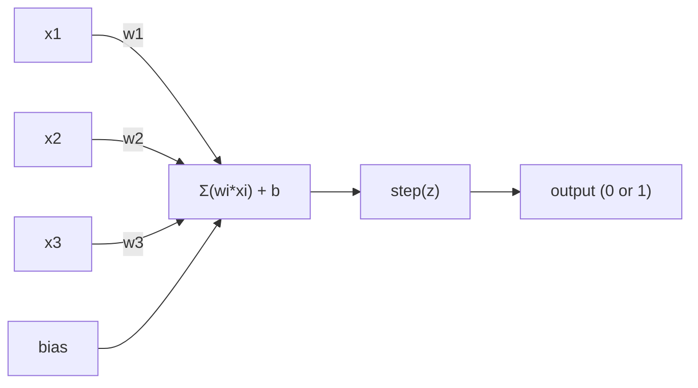
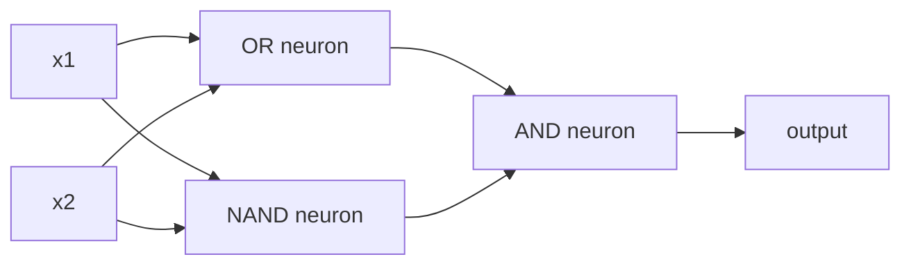

# The Perceptron

> The perceptron is the atom of neural networks. Crack it open, and inside you'll find weights, a bias, and a decision.

**Type:** Build
**Languages:** Python
**Prerequisites:** Phase 1 (Linear Algebra Intuition)
**Time:** ~60 minutes

## Learning Objectives

- Implement a perceptron from scratch in Python, including the weight update rule and step activation function
- Explain why a single perceptron can only solve linearly separable problems, and demonstrate XOR failure
- Combine OR, NAND, and AND gates into a multi-layer perceptron to solve XOR
- Train a two-layer network with sigmoid activation and backpropagation to learn XOR automatically

## The Problem

You understand vectors and dot products. You know matrices transform inputs into outputs. But how does a machine *learn* which transformation to use?

The perceptron answers this. It's the simplest possible learning machine: take inputs, multiply by weights, add a bias, make a binary decision. Then adjust. That's it. Every neural network ever built stacks this idea into layers.

Understanding the perceptron means understanding what "learning" means in code: adjusting numbers until outputs match reality.

## The Concept

### One Neuron, One Decision

A perceptron takes n inputs, multiplies each by a weight, sums them, adds a bias, and passes the result through an activation function.



The step function is blunt: if the weighted sum plus bias >= 0, output 1; otherwise output 0.

```
step(z) = 1  if z >= 0
           0  if z < 0
```

This is a linear classifier. The weights and bias define a line (or hyperplane in higher dimensions) that splits the input space into two regions.

### Decision Boundary

For two inputs, the perceptron draws a line in 2D space:

```
  x2
  ┤
  │  Class 1        /
  │    (0)          /
  │                /
  │               / w1·x1 + w2·x2 + b = 0
  │              /
  │             /     Class 2
  │            /        (1)
  ┼───────────/──────────── x1
```

Everything on one side outputs 0, on the other side outputs 1. Training moves this line until it correctly separates the two classes.

### Learning Rule

The perceptron learning rule is simple:

```
For each training example (x, y_true):
    y_pred = predict(x)
    error = y_true - y_pred

    For each weight:
        w_i = w_i + learning_rate * error * x_i
    bias = bias + learning_rate * error
```

If the prediction is correct, error = 0 and nothing changes. If prediction is 0 but should be 1, weights increase. If prediction is 1 but should be 0, weights decrease. The learning rate controls how much each adjustment moves.

### The XOR Problem

Here's where it breaks. Consider these logic gates:

```
AND gate:           OR gate:            XOR gate:
x1  x2  out         x1  x2  out         x1  x2  out
0   0   0           0   0   0           0   0   0
0   1   0           0   1   1           0   1   1
1   0   0           1   0   1           1   0   1
1   1   1           1   1   1           1   1   0
```

AND and OR are linearly separable: you can draw a line between the 0s and 1s. XOR is not. No single line can separate [0,1] and [1,0] from [0,0] and [1,1].

```
AND (separable):        XOR (not separable):

  x2                      x2
  1 ┤  0     1            1 ┤  1     0
    │     /                 │
  0 ┤  0 / 0              0 ┤  0     1
    ┼──/──────── x1         ┼──────────── x1
       line works!          no single line works!
```

This is a fundamental limitation. A single perceptron can only solve linearly separable problems. Minsky and Papert proved this in 1969, nearly killing neural network research for a decade.

The fix: stack perceptrons into layers. A multi-layer perceptron combines two linear decisions into a nonlinear one, solving XOR.

## Build It

### Step 1: Perceptron Class

```python
class Perceptron:
    def __init__(self, n_inputs, learning_rate=0.1):
        self.weights = [0.0] * n_inputs
        self.bias = 0.0
        self.lr = learning_rate

    def predict(self, inputs):
        total = sum(w * x for w, x in zip(self.weights, inputs))
        total += self.bias
        return 1 if total >= 0 else 0

    def train(self, training_data, epochs=100):
        for epoch in range(epochs):
            errors = 0
            for inputs, target in training_data:
                prediction = self.predict(inputs)
                error = target - prediction
                if error != 0:
                    errors += 1
                    for i in range(len(self.weights)):
                        self.weights[i] += self.lr * error * inputs[i]
                    self.bias += self.lr * error
            if errors == 0:
                print(f"Converged at epoch {epoch + 1}")
                return
        print(f"Did not converge after {epochs} epochs")
```

### Step 2: Train on Logic Gates

```python
and_data = [
    ([0, 0], 0),
    ([0, 1], 0),
    ([1, 0], 0),
    ([1, 1], 1),
]

or_data = [
    ([0, 0], 0),
    ([0, 1], 1),
    ([1, 0], 1),
    ([1, 1], 1),
]

not_data = [
    ([0], 1),
    ([1], 0),
]

print("=== AND Gate ===")
p_and = Perceptron(2)
p_and.train(and_data)
for inputs, _ in and_data:
    print(f"  {inputs} -> {p_and.predict(inputs)}")

print("\n=== OR Gate ===")
p_or = Perceptron(2)
p_or.train(or_data)
for inputs, _ in or_data:
    print(f"  {inputs} -> {p_or.predict(inputs)}")

print("\n=== NOT Gate ===")
p_not = Perceptron(1)
p_not.train(not_data)
for inputs, _ in not_data:
    print(f"  {inputs} -> {p_not.predict(inputs)}")
```

### Step 3: Watch XOR Fail

```python
xor_data = [
    ([0, 0], 0),
    ([0, 1], 1),
    ([1, 0], 1),
    ([1, 1], 0),
]

print("\n=== XOR Gate (single perceptron) ===")
p_xor = Perceptron(2)
p_xor.train(xor_data, epochs=1000)
for inputs, expected in xor_data:
    result = p_xor.predict(inputs)
    status = "OK" if result == expected else "WRONG"
    print(f"  {inputs} -> {result} (expected {expected}) {status}")
```

It never converges. This is hard proof that a single perceptron cannot learn XOR.

### Step 4: Solve XOR with Two Layers

The trick: XOR = (x1 OR x2) AND NOT (x1 AND x2). Combine three perceptrons:



```python
def xor_network(x1, x2):
    or_neuron = Perceptron(2)
    or_neuron.weights = [1.0, 1.0]
    or_neuron.bias = -0.5

    nand_neuron = Perceptron(2)
    nand_neuron.weights = [-1.0, -1.0]
    nand_neuron.bias = 1.5

    and_neuron = Perceptron(2)
    and_neuron.weights = [1.0, 1.0]
    and_neuron.bias = -1.5

    hidden1 = or_neuron.predict([x1, x2])
    hidden2 = nand_neuron.predict([x1, x2])
    output = and_neuron.predict([hidden1, hidden2])
    return output


print("\n=== XOR Gate (multi-layer network) ===")
for inputs, expected in xor_data:
    result = xor_network(inputs[0], inputs[1])
    print(f"  {inputs} -> {result} (expected {expected})")
```

All four cases correct. Stacking perceptrons into layers creates decision boundaries no single perceptron can draw.

### Step 5: Train a Two-Layer Network

Step 4 hardwires weights. That works for XOR, but not for real problems where you don't know the correct weights in advance. The fix: replace step with sigmoid, and learn weights automatically through backpropagation.

```python
class TwoLayerNetwork:
    def __init__(self, learning_rate=0.5):
        import random
        random.seed(0)
        self.w_hidden = [[random.uniform(-1, 1), random.uniform(-1, 1)] for _ in range(2)]
        self.b_hidden = [random.uniform(-1, 1), random.uniform(-1, 1)]
        self.w_output = [random.uniform(-1, 1), random.uniform(-1, 1)]
        self.b_output = random.uniform(-1, 1)
        self.lr = learning_rate

    def sigmoid(self, x):
        import math
        x = max(-500, min(500, x))
        return 1.0 / (1.0 + math.exp(-x))

    def forward(self, inputs):
        self.inputs = inputs
        self.hidden_outputs = []
        for i in range(2):
            z = sum(w * x for w, x in zip(self.w_hidden[i], inputs)) + self.b_hidden[i]
            self.hidden_outputs.append(self.sigmoid(z))
        z_out = sum(w * h for w, h in zip(self.w_output, self.hidden_outputs)) + self.b_output
        self.output = self.sigmoid(z_out)
        return self.output

    def train(self, training_data, epochs=10000):
        for epoch in range(epochs):
            total_error = 0
            for inputs, target in training_data:
                output = self.forward(inputs)
                error = target - output
                total_error += error ** 2

                d_output = error * output * (1 - output)

                saved_w_output = self.w_output[:]
                hidden_deltas = []
                for i in range(2):
                    h = self.hidden_outputs[i]
                    hd = d_output * saved_w_output[i] * h * (1 - h)
                    hidden_deltas.append(hd)

                for i in range(2):
                    self.w_output[i] += self.lr * d_output * self.hidden_outputs[i]
                self.b_output += self.lr * d_output

                for i in range(2):
                    for j in range(len(inputs)):
                        self.w_hidden[i][j] += self.lr * hidden_deltas[i] * inputs[j]
                    self.b_hidden[i] += self.lr * hidden_deltas[i]
```

```python
net = TwoLayerNetwork(learning_rate=2.0)
net.train(xor_data, epochs=10000)
for inputs, expected in xor_data:
    result = net.forward(inputs)
    predicted = 1 if result >= 0.5 else 0
    print(f"  {inputs} -> {result:.4f} (rounded: {predicted}, expected {expected})")
```

Two key differences from Step 4. First, sigmoid replaces step—it's smooth, so gradients exist. Second, the `train` method propagates error backward from output to hidden layer, adjusting each weight proportionally to its contribution to the error. That's backpropagation in 20 lines.

This bridges to Lesson 03. The math behind `d_output` and `hidden_deltas` is the chain rule applied to the network graph. We'll derive it properly there.

## Use It

Everything you just wrote from scratch is available in one import:

```python
from sklearn.linear_model import Perceptron as SkPerceptron
import numpy as np

X = np.array([[0,0],[0,1],[1,0],[1,1]])
y = np.array([0, 0, 0, 1])

clf = SkPerceptron(max_iter=100, tol=1e-3)
clf.fit(X, y)
print([clf.predict([x])[0] for x in X])
```

Five lines. Your 30-line `Perceptron` class does the same thing. The sklearn version adds convergence checks, multiple loss functions, and sparse input support—but the core loop is identical: weighted sum, step function, update weights by error.

The real gap shows at scale. What changes in production networks:

- Step becomes sigmoid, ReLU, or other smooth activations
- Weights are learned through backpropagation (Lesson 03)
- Layers go deep: 3, 10, 100+ layers
- The same principle holds: each layer creates new features from the previous layer's output

A single perceptron draws straight lines. Stack them, and you can draw anything.

## Ship It

This lesson produces:
- `outputs/skill-perceptron.md` — a skill explaining when to use single-layer vs multi-layer architectures

## Exercises

1. Train a perceptron on the NAND gate (universal gate—any logic circuit can be built from NANDs). Verify its weights and bias form a valid decision boundary.
2. Modify the Perceptron class to track the decision boundary (w1*x1 + w2*x2 + b = 0) at each epoch. Print how the line moves during AND gate training.
3. Build a 3-input perceptron that outputs 1 only when at least 2 of 3 inputs are 1 (majority vote function). Is it linearly separable? Why?

## Key Terms

| Term | What people say | What it actually is |
|------|----------------|----------------------|
| Perceptron | "A fake neuron" | A linear classifier: dot product of inputs and weights, plus bias, through a step function |
| Weight | "How important an input is" | A multiplier that scales each input's contribution to the decision |
| Bias | "The threshold" | A constant that shifts the decision boundary, letting the perceptron activate even when all inputs are zero |
| Activation function | "The thing that squishes values" | A function applied after the weighted sum—perceptrons use step, modern networks use sigmoid/ReLU |
| Linearly separable | "You can draw a line between them" | A dataset where a single hyperplane perfectly separates the classes |
| XOR problem | "The thing a perceptron can't do" | Proof that single-layer networks cannot learn non-linearly-separable functions |
| Decision boundary | "Where the classifier switches" | The hyperplane w*x + b = 0 that divides input space into two classes |
| Multi-layer perceptron | "A real neural network" | Perceptrons stacked into layers, where each layer's output feeds the next layer's input |

## Further Reading

- Frank Rosenblatt, "The Perceptron: A Probabilistic Model for Information Storage and Organization in the Brain" (1958) — the original paper that started everything
- Minsky & Papert, "Perceptrons" (1969) — the book that proved XOR cannot be solved by a single-layer network, stalling perceptron research for a decade
- Michael Nielsen, "Neural Networks and Deep Learning" Chapter 1 (http://neuralnetworksanddeeplearning.com/) — free online, the clearest intuitive explanation of how perceptrons compose into networks
