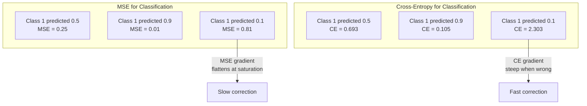
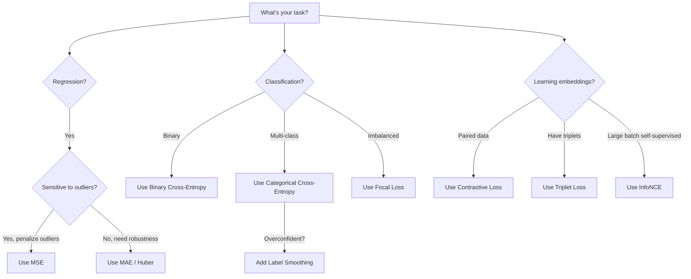
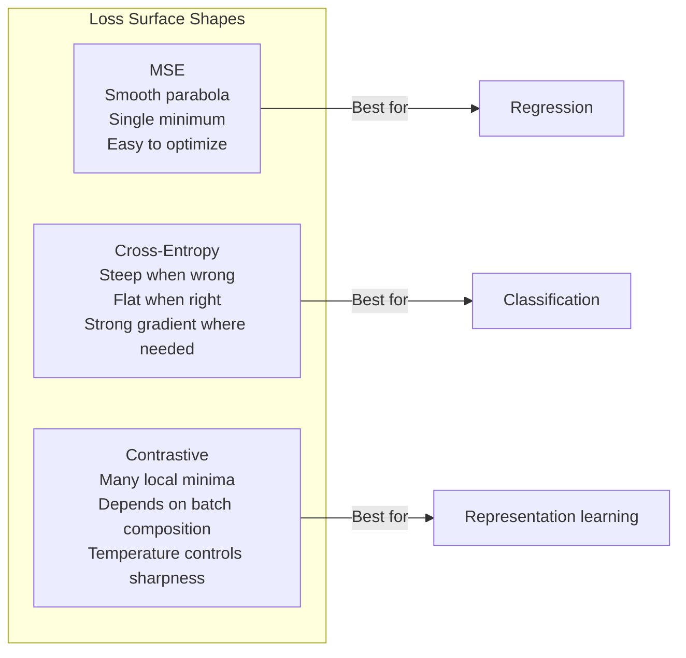

# Loss Functions

> Your network made a prediction. The real answer disagrees. How wrong is it? That number is the loss. Pick the wrong loss function, and your model optimizes toward a completely wrong objective.

**Type:** Build
**Languages:** Python
**Prerequisites:** Lesson 03.04 (Activation Functions)
**Time:** ~75 minutes

## Learning Objectives

- Implement MSE, binary cross-entropy, categorical cross-entropy, contrastive loss (InfoNCE) and their gradients from scratch
- Explain why MSE fails for classification by demonstrating the "predict 0.5 for everything" failure mode
- Apply label smoothing to cross-entropy and describe how it prevents overconfident predictions
- Choose the correct loss function for regression, binary classification, multi-class classification, and embedding learning tasks

## The Problem

A model minimizing MSE on a classification problem will confidently predict 0.5 for everything. It's minimizing the loss. It's also completely useless.

The loss function is the only thing your model truly optimizes. Not accuracy, not F1 score, not the metric you report to your boss. The optimizer takes the loss function's gradient and adjusts weights to make that number smaller. If the loss function doesn't capture what you care about, the model will find the mathematically laziest way to satisfy it, and that way is almost never what you want.

A concrete example. You have a binary classification task. Two classes, balanced 50-50. You use MSE as loss. The model predicts 0.5 for every single input. Average MSE is 0.25 — the minimum achievable without actually learning anything. The model has zero discrimination, but it technically minimized your loss function. Switch to cross-entropy, and the same model is forced to push predictions toward 0 or 1, because -log(0.5) = 0.693 is a bad loss while -log(0.99) = 0.01 rewards confident correct predictions. The loss function choice is the difference between "a model that learns" and "a model that games the metric."

It gets worse. In self-supervised learning, you don't even have labels. Contrastive loss defines the entire learning signal: what counts as similar, what counts as different, how hard the model should push them apart. Get contrastive loss wrong and your embeddings collapse to a single point — every input maps to the same vector. Technically zero loss. Completely useless.

## The Concept

### Mean Squared Error (MSE)

The default for regression. Compute the squared difference between prediction and target, average over all samples.

```
MSE = (1/n) * sum((y_pred - y_true)^2)
```

Why squaring matters: it penalizes large errors quadratically. An error of 2 costs 4x as much as an error of 1. An error of 10 costs 100x. This makes MSE sensitive to outliers — a single wildly wrong prediction dominates the entire loss.

Real numbers: if your model predicts house prices and most houses are off by $10K but one mansion is off by $200K, MSE will obsess over that one mansion, potentially degrading performance on the other 99 houses.

MSE's gradient with respect to the prediction:

```
dMSE/dy_pred = (2/n) * (y_pred - y_true)
```

Linear in the error. Larger errors get larger gradients. This is a feature for regression (big errors need big corrections) but a bug for classification (you want to penalize confident wrong answers exponentially, not linearly).

### Cross-Entropy Loss

The loss function for classification. Rooted in information theory — it measures the divergence between the predicted probability distribution and the true distribution.

**Binary Cross-Entropy (BCE):**

```
BCE = -(y * log(p) + (1 - y) * log(1 - p))
```

Where y is the true label (0 or 1), p is the predicted probability.

Why -log(p) works: when the true label is 1 and you predict p = 0.99, loss is -log(0.99) = 0.01. When you predict p = 0.01, loss is -log(0.01) = 4.6. That 460x difference is why cross-entropy works. It brutally punishes confident wrong predictions while barely penalizing confident correct ones.

The gradient tells the same story:

```
dBCE/dp = -(y/p) + (1-y)/(1-p)
```

When y = 1 and p is near zero, the gradient is -1/p, approaching negative infinity. The model gets a massive signal to correct its mistake. When p is near 1, the gradient is tiny. Already correct, nothing to fix.

**Categorical Cross-Entropy:**

For multi-class with one-hot encoded targets.

```
CCE = -sum(y_i * log(p_i))
```

Only the true class contributes to loss (since all other y_i are zero). If you have 10 classes and the correct class gets probability 0.1 (random guess), loss is -log(0.1) = 2.3. If the correct class gets 0.9, loss is -log(0.9) = 0.105. The model learns to concentrate probability mass on the correct answer.

### Why MSE Fails for Classification



When predictions approach 0 or 1, MSE gradients flatten (because sigmoid saturates). Cross-entropy gradients compensate — the -log cancels sigmoid's flat regions, providing strong gradients exactly where they're needed most.

### Label Smoothing

Standard one-hot labels say "this is 100% class 3, everything else is 0%." That's a strong claim. Label smoothing softens it:

```
smooth_label = (1 - alpha) * one_hot + alpha / num_classes
```

With alpha = 0.1 and 10 classes: the target goes from [0, 0, 1, 0, ...] to [0.01, 0.01, 0.91, 0.01, ...]. The model aims for 0.91 instead of 1.0.

Why it works: a model trying to output exactly 1.0 through softmax needs to push logits to infinity. This causes overconfidence, hurts generalization, and makes the model brittle to distribution shift. Label smoothing caps the target at 0.9 (with alpha=0.1), keeping logits in a reasonable range. GPT and most modern models use label smoothing or equivalents.

### Contrastive Loss

No labels. No classes. Just pairs of inputs and a question: are these similar or different?

**SimCLR-style contrastive loss (NT-Xent / InfoNCE):**

Take an image. Create two augmented views (crop, rotate, color jitter). These are the "positive pair" — they should have similar embeddings. Every other image in the batch forms "negative pairs" — they should have different embeddings.

```
L = -log(exp(sim(z_i, z_j) / tau) / sum(exp(sim(z_i, z_k) / tau)))
```

Where sim() is cosine similarity, z_i and z_j are the positive pair, the sum is over all negatives, and tau (temperature) controls how sharp the distribution is. Lower temperature = harder negatives = more aggressive separation.

Real numbers: batch size 256 means 255 negatives per positive pair. Temperature tau = 0.07 (SimCLR default). This loss looks like softmax over similarity scores — it wants the positive pair's similarity to be the highest among all 256 options.

**Triplet Loss:**

Takes three inputs: anchor, positive (same class), negative (different class).

```
L = max(0, d(anchor, positive) - d(anchor, negative) + margin)
```

The margin (typically 0.2-1.0) enforces a minimum gap between positive and negative distances. If the negative is already far enough away, loss is zero — no gradient, no update. This makes training efficient but requires careful triplet mining (selecting hard negatives that are close to the anchor).

### Focal Loss

For imbalanced datasets. Standard cross-entropy treats all correctly classified samples equally. Focal loss down-weights easy samples:

```
FL = -alpha * (1 - p_t)^gamma * log(p_t)
```

Where p_t is the predicted probability for the true class, and gamma controls focusing. At gamma = 0 this is standard cross-entropy. At gamma = 2 (default):

- Easy sample (p_t = 0.9): weight = (0.1)^2 = 0.01. Essentially ignored.
- Hard sample (p_t = 0.1): weight = (0.9)^2 = 0.81. Full gradient signal.

Focal loss was introduced by Lin et al. for object detection, where 99% of candidate regions are background (easy negatives). Without focal loss, the model drowns in easy background samples and never learns to detect objects. With it, the model concentrates capacity on the hard, ambiguous cases that actually matter.

### Loss Function Decision Tree



### Loss Surface



## Build It

### Step 1: MSE and Its Gradient

```python
def mse(predictions, targets):
    n = len(predictions)
    total = 0.0
    for p, t in zip(predictions, targets):
        total += (p - t) ** 2
    return total / n

def mse_gradient(predictions, targets):
    n = len(predictions)
    grads = []
    for p, t in zip(predictions, targets):
        grads.append(2.0 * (p - t) / n)
    return grads
```

### Step 2: Binary Cross-Entropy

The log(0) problem is real. If the model predicts exactly 0 for a positive sample, log(0) = negative infinity. Clipping prevents this.

```python
import math

def binary_cross_entropy(predictions, targets, eps=1e-15):
    n = len(predictions)
    total = 0.0
    for p, t in zip(predictions, targets):
        p_clipped = max(eps, min(1 - eps, p))
        total += -(t * math.log(p_clipped) + (1 - t) * math.log(1 - p_clipped))
    return total / n

def bce_gradient(predictions, targets, eps=1e-15):
    grads = []
    for p, t in zip(predictions, targets):
        p_clipped = max(eps, min(1 - eps, p))
        grads.append(-(t / p_clipped) + (1 - t) / (1 - p_clipped))
    return grads
```

### Step 3: Categorical Cross-Entropy with Softmax

Softmax converts raw logits to probabilities. Then we compute cross-entropy against one-hot targets.

```python
def softmax(logits):
    max_val = max(logits)
    exps = [math.exp(x - max_val) for x in logits]
    total = sum(exps)
    return [e / total for e in exps]

def categorical_cross_entropy(logits, target_index, eps=1e-15):
    probs = softmax(logits)
    p = max(eps, probs[target_index])
    return -math.log(p)

def cce_gradient(logits, target_index):
    probs = softmax(logits)
    grads = list(probs)
    grads[target_index] -= 1.0
    return grads
```

The softmax + cross-entropy gradient simplifies beautifully: it's (predicted probability - 1) for the true class, and just (predicted probability) for all others. This elegant simplification is not a coincidence — it's precisely why softmax and cross-entropy are paired together.

### Step 4: Label Smoothing

```python
def label_smoothed_cce(logits, target_index, num_classes, alpha=0.1, eps=1e-15):
    probs = softmax(logits)
    loss = 0.0
    for i in range(num_classes):
        if i == target_index:
            smooth_target = 1.0 - alpha + alpha / num_classes
        else:
            smooth_target = alpha / num_classes
        p = max(eps, probs[i])
        loss += -smooth_target * math.log(p)
    return loss
```

### Step 5: Contrastive Loss (Simplified InfoNCE)

```python
def cosine_similarity(a, b):
    dot = sum(x * y for x, y in zip(a, b))
    norm_a = math.sqrt(sum(x * x for x in a))
    norm_b = math.sqrt(sum(x * x for x in b))
    if norm_a < 1e-10 or norm_b < 1e-10:
        return 0.0
    return dot / (norm_a * norm_b)

def contrastive_loss(anchor, positive, negatives, temperature=0.07):
    sim_pos = cosine_similarity(anchor, positive) / temperature
    sim_negs = [cosine_similarity(anchor, neg) / temperature for neg in negatives]

    max_sim = max(sim_pos, max(sim_negs)) if sim_negs else sim_pos
    exp_pos = math.exp(sim_pos - max_sim)
    exp_negs = [math.exp(s - max_sim) for s in sim_negs]
    total_exp = exp_pos + sum(exp_negs)

    return -math.log(max(1e-15, exp_pos / total_exp))
```

### Step 6: MSE vs Cross-Entropy on Classification

Train the same network from Lesson 04 on the circle dataset with both loss functions. Watch cross-entropy converge faster.

```python
import random

def sigmoid(x):
    x = max(-500, min(500, x))
    return 1.0 / (1.0 + math.exp(-x))

def make_circle_data(n=200, seed=42):
    random.seed(seed)
    data = []
    for _ in range(n):
        x = random.uniform(-2, 2)
        y = random.uniform(-2, 2)
        label = 1.0 if x * x + y * y < 1.5 else 0.0
        data.append(([x, y], label))
    return data


class LossComparisonNetwork:
    def __init__(self, loss_type="bce", hidden_size=8, lr=0.1):
        random.seed(0)
        self.loss_type = loss_type
        self.lr = lr
        self.hidden_size = hidden_size

        self.w1 = [[random.gauss(0, 0.5) for _ in range(2)] for _ in range(hidden_size)]
        self.b1 = [0.0] * hidden_size
        self.w2 = [random.gauss(0, 0.5) for _ in range(hidden_size)]
        self.b2 = 0.0

    def forward(self, x):
        self.x = x
        self.z1 = []
        self.h = []
        for i in range(self.hidden_size):
            z = self.w1[i][0] * x[0] + self.w1[i][1] * x[1] + self.b1[i]
            self.z1.append(z)
            self.h.append(max(0.0, z))

        self.z2 = sum(self.w2[i] * self.h[i] for i in range(self.hidden_size)) + self.b2
        self.out = sigmoid(self.z2)
        return self.out

    def backward(self, target):
        if self.loss_type == "mse":
            d_loss = 2.0 * (self.out - target)
        else:
            eps = 1e-15
            p = max(eps, min(1 - eps, self.out))
            d_loss = -(target / p) + (1 - target) / (1 - p)

        d_sigmoid = self.out * (1 - self.out)
        d_out = d_loss * d_sigmoid

        for i in range(self.hidden_size):
            d_relu = 1.0 if self.z1[i] > 0 else 0.0
            d_h = d_out * self.w2[i] * d_relu
            self.w2[i] -= self.lr * d_out * self.h[i]
            for j in range(2):
                self.w1[i][j] -= self.lr * d_h * self.x[j]
            self.b1[i] -= self.lr * d_h
        self.b2 -= self.lr * d_out

    def compute_loss(self, pred, target):
        if self.loss_type == "mse":
            return (pred - target) ** 2
        else:
            eps = 1e-15
            p = max(eps, min(1 - eps, pred))
            return -(target * math.log(p) + (1 - target) * math.log(1 - p))

    def train(self, data, epochs=200):
        losses = []
        for epoch in range(epochs):
            total_loss = 0.0
            correct = 0
            for x, y in data:
                pred = self.forward(x)
                self.backward(y)
                total_loss += self.compute_loss(pred, y)
                if (pred >= 0.5) == (y >= 0.5):
                    correct += 1
            avg_loss = total_loss / len(data)
            accuracy = correct / len(data) * 100
            losses.append((avg_loss, accuracy))
            if epoch % 50 == 0 or epoch == epochs - 1:
                print(f"    Epoch {epoch:3d}: loss={avg_loss:.4f}, accuracy={accuracy:.1f}%")
        return losses
```

## Use It

PyTorch provides all standard loss functions with numerical stability built in:

```python
import torch
import torch.nn as nn
import torch.nn.functional as F

predictions = torch.tensor([0.9, 0.1, 0.7], requires_grad=True)
targets = torch.tensor([1.0, 0.0, 1.0])

mse_loss = F.mse_loss(predictions, targets)
bce_loss = F.binary_cross_entropy(predictions, targets)

logits = torch.randn(4, 10)
labels = torch.tensor([3, 7, 1, 9])
ce_loss = F.cross_entropy(logits, labels)
ce_smooth = F.cross_entropy(logits, labels, label_smoothing=0.1)
```

Use `F.cross_entropy` (not `F.nll_loss` with manual softmax). It fuses log-softmax and negative log-likelihood into one numerically stable operation. Applying softmax separately then taking log is less stable — you lose precision when subtracting large exponentials.

For contrastive learning, most teams use custom implementations or libraries like `lightly` or `pytorch-metric-learning`. The core loop is always the same: compute pairwise similarities, softmax over positives and negatives, backpropagate.

## Ship It

This lesson produces:
- `outputs/prompt-loss-function-selector.md` — A reusable prompt for choosing the right loss function
- `outputs/prompt-loss-debugger.md` — A diagnostic prompt for when your loss curve looks wrong

## Exercises

1. Implement Huber loss (smooth L1 loss) which is MSE for small errors and MAE for large ones. Train a regression network predicting y = sin(x), with 5% of training targets corrupted by random noise (outliers). Compare final test error between MSE and Huber.

2. Add focal loss to the binary classification training loop. Create an imbalanced dataset (90% class 0, 10% class 1). After 200 epochs, compare standard BCE vs focal loss (gamma=2) on minority class recall.

3. Implement triplet loss with semi-hard negative mining. Generate 2D embedding data for 5 classes. For each anchor, find the hardest negative that is still farther than the positive (semi-hard). Compare convergence against random triplet selection.

4. Run the MSE vs cross-entropy comparison but track gradient magnitudes per layer during training. Plot average gradient norms per epoch. Verify that cross-entropy produces larger gradients when the model is most uncertain (early epochs).

5. Implement KL divergence loss and verify that minimizing KL(true || predicted) gives the same gradients as cross-entropy when the true distribution is one-hot. Then try soft targets (like knowledge distillation) where the "true" distribution comes from a teacher model's softmax output.

## Key Terms

| Term | What People Say | What It Actually Is |
|------|----------------|----------------------|
| Loss function | "How wrong the model is" | A differentiable function mapping predictions and targets to a scalar that the optimizer minimizes |
| MSE | "Mean squared error" | Average of squared differences between predictions and targets; penalizes large errors quadratically |
| Cross-entropy | "Classification loss" | Measures divergence between predicted and true probability distributions using -log(p) |
| Binary cross-entropy | "BCE" | Cross-entropy for two classes: -(y*log(p) + (1-y)*log(1-p)) |
| Label smoothing | "Soften the targets" | Replace hard 0/1 targets with soft values (e.g., 0.1/0.9) to prevent overconfidence and improve generalization |
| Contrastive loss | "Pull together, push apart" | A loss that learns representations by bringing similar pairs closer and dissimilar pairs farther in embedding space |
| InfoNCE | "CLIP/SimCLR loss" | Normalized, temperature-scaled cross-entropy over similarity scores; treats contrastive learning as classification |
| Focal loss | "Fix for imbalanced data" | Cross-entropy weighted by (1-p_t)^gamma to down-weight easy samples and focus on hard ones |
| Triplet loss | "Anchor-positive-negative" | Pulls anchor closer to positive than negative in embedding space by at least a margin |
| Temperature | "Sharpness knob" | A scalar divisor applied to logits/similarities controlling how peaked the resulting distribution is; lower = sharper |

## Further Reading

- Lin et al., *Focal Loss for Dense Object Detection* (2017) — Introduced focal loss for handling extreme class imbalance in object detection (RetinaNet)
- Chen et al., *A Simple Framework for Contrastive Learning of Visual Representations* (SimCLR, 2020) — Defined the modern contrastive learning pipeline with NT-Xent loss
- Szegedy et al., *Rethinking the Inception Architecture* (2016) — Introduced label smoothing as a regularization technique, now standard in most large models
- Hinton et al., *Distilling the Knowledge in a Neural Network* (2015) — Knowledge distillation using soft targets and KL divergence, foundational work on model compression
