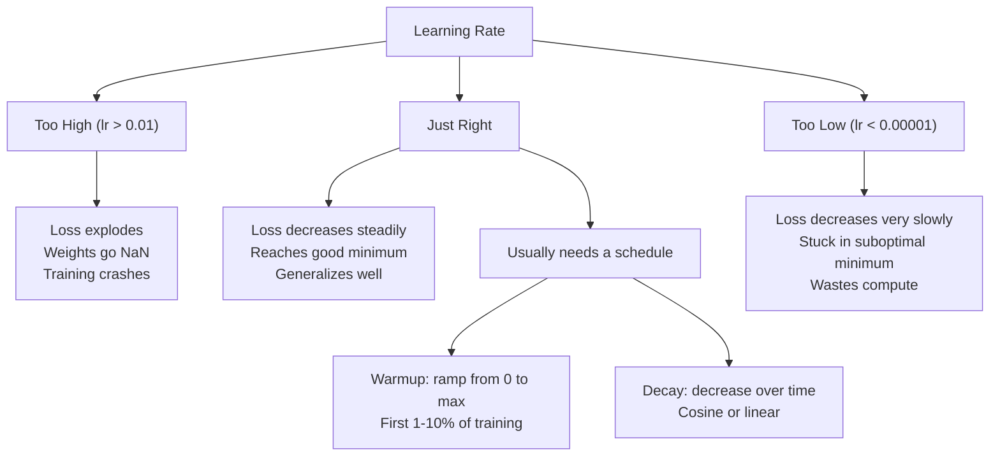
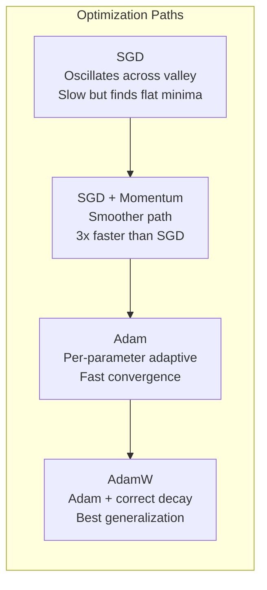
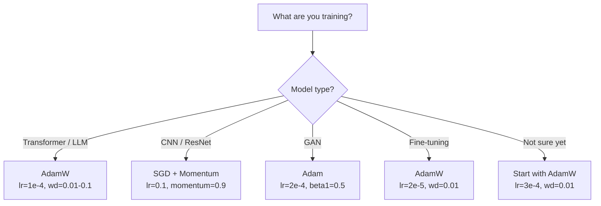

# Optimizers

> Gradient descent tells you which direction to go. It says nothing about how far or how fast. SGD is a compass. Adam is GPS with traffic data.

**Type:** Build
**Languages:** Python
**Prerequisites:** Lesson 03.05 (Loss Functions)
**Time:** ~75 minutes

## Learning Objectives

- Implement SGD, SGD with momentum, Adam, and AdamW optimizers from scratch in Python
- Explain how Adam's bias correction compensates for zero-initialized moment estimates in early training
- Demonstrate why AdamW generalizes better than Adam with L2 regularization on the same task
- Choose the right optimizer and default hyperparameters for transformers, CNNs, GANs, and fine-tuning

## The Problem

You computed the gradient. You know weight #4721 should decrease by 0.003 to reduce the loss. But 0.003 in what units? At what scale? And should step 1 and step 1000 take the same size step?

Vanilla gradient descent applies the same learning rate to every parameter at every step: w = w - lr * gradient. This creates three problems that make training neural networks painful in practice.

First, oscillation. The loss surface is rarely a smooth bowl. It's more like a long narrow valley. The gradient points across the valley (the steep direction), not along it (the gentle direction). Gradient descent bounces back and forth across the narrow dimension while barely moving in the useful direction. You've seen this: loss drops quickly then plateaus, not because the model converged, but because it's oscillating.

Second, one learning rate for all parameters is wrong. Some weights need large updates (they're in early, underfitting territory). Others need tiny updates (they're already near optimal). A learning rate that works for the former destroys the latter, and vice versa.

Third, saddle points. In high dimensions, the loss surface has vast flat regions where gradients are near zero. Vanilla SGD crawls through these at the speed of the gradient, which is effectively zero. The model appears stuck. It isn't — it's on a plateau with usable downhill on the other side. But SGD has no mechanism to push through.

Adam solves all three at once. It maintains two running averages per parameter — the gradient mean (momentum, handles oscillation) and the gradient squared mean (adaptive rate, handles different scales). Combined with bias correction for the first few steps, it gives you an optimizer that works with default hyperparameters on 80% of problems. This lesson builds it from scratch so you understand exactly when and why it fails on the other 20%.

## The Concept

### Stochastic Gradient Descent (SGD)

The simplest optimizer. Compute the gradient on a mini-batch, take a step in the opposite direction.

```
w = w - lr * gradient
```

"Stochastic" means you estimate the gradient from a random subset (mini-batch) of data rather than the full dataset. This noise is actually useful — it helps escape sharp local minima. But it also causes oscillation.

The learning rate is the only knob. Too high: loss diverges. Too low: training takes forever. The optimal value depends on architecture, data, batch size, and current training stage. Typical values for vanilla SGD on modern networks: 0.01 to 0.1. But even within one training run, the ideal learning rate changes.

### Momentum

The ball-rolling-downhill analogy is overused but accurate. Instead of stepping purely by the gradient, you maintain a velocity that accumulates past gradients.

```
m_t = beta * m_{t-1} + gradient
w = w - lr * m_t
```

Beta (typically 0.9) controls how much history to retain. With beta = 0.9, momentum is roughly the average of the last 10 gradients (1 / (1 - 0.9) = 10).

Why it fixes oscillation: gradients that point in the same direction accumulate. Gradients that flip direction cancel out. In that narrow valley, the "across" component reverses every step, getting suppressed; the "along" component is consistent, getting amplified. The result: smooth acceleration in the useful direction.

Real numbers: vanilla SGD on a pathological loss surface might take 10,000 steps. SGD with momentum (beta=0.9) on the same problem typically takes 3,000-5,000 steps. That speedup isn't marginal.

### RMSProp

The first truly effective per-parameter adaptive learning rate method. Proposed by Hinton in a Coursera lecture (never formally published).

```
s_t = beta * s_{t-1} + (1 - beta) * gradient^2
w = w - lr * gradient / (sqrt(s_t) + epsilon)
```

s_t tracks a running average of squared gradients. Parameters whose gradients are consistently large get divided by a large number (smaller effective learning rate). Parameters with small gradients get divided by a small number (larger effective learning rate).

This solves the "one learning rate for all parameters" problem. A weight that's been getting large updates is probably close to its target — slow it down. A weight getting tiny updates may be undertrained — speed it up.

Epsilon (typically 1e-8) prevents division by zero when a parameter hasn't been updated yet.

### Adam: Momentum + RMSProp

Adam combines both ideas. It maintains two exponential moving averages per parameter:

```
m_t = beta1 * m_{t-1} + (1 - beta1) * gradient        (first moment: mean)
v_t = beta2 * v_{t-1} + (1 - beta2) * gradient^2       (second moment: variance)
```

**Bias correction** is the critical detail most explanations skip. At step 1, m_1 = (1 - beta1) * gradient. With beta1 = 0.9, that's 0.1 * gradient — ten times too small. The moving average hasn't warmed up. Bias correction compensates:

```
m_hat = m_t / (1 - beta1^t)
v_hat = v_t / (1 - beta2^t)
```

At step 1 with beta1 = 0.9: m_hat = m_1 / (1 - 0.9) = m_1 / 0.1 = the actual gradient. At step 100: (1 - 0.9^100) is approximately 1.0, so the correction vanishes. Bias correction matters for the first ~10 steps and is irrelevant by ~50 steps.

The update:

```
w = w - lr * m_hat / (sqrt(v_hat) + epsilon)
```

Adam defaults: lr = 0.001, beta1 = 0.9, beta2 = 0.999, epsilon = 1e-8. These defaults work for 80% of problems. When they don't, change lr first. Then beta2. Almost never touch beta1 or epsilon.

### AdamW: Weight Decay Done Right

L2 regularization adds lambda * w^2 to the loss. In vanilla SGD, this is equivalent to weight decay (subtracting lambda * w from the weight each step). In Adam, that equivalence breaks.

Loshchilov & Hutter's insight: when you add L2 to the loss and Adam processes the gradient, the adaptive learning rate also scales the regularization term. Parameters with high gradient variance get less regularization; those with low variance get more. That's not what you want — you want uniform regularization regardless of gradient statistics.

AdamW fixes this by applying weight decay directly to the weights after the Adam update:

```
w = w - lr * m_hat / (sqrt(v_hat) + epsilon) - lr * lambda * w
```

The weight decay term (lr * lambda * w) is not scaled by Adam's adaptive factor. Every parameter gets the same proportional shrinkage.

This looks like a minor detail. It isn't. AdamW converges to better solutions than Adam + L2 regularization on nearly every task. It's the default optimizer in PyTorch for training transformers, diffusion models, and most modern architectures. BERT, GPT, LLaMA, Stable Diffusion — all trained with AdamW.

### Learning Rate: The Most Important Hyperparameter



If you only tune one hyperparameter, tune the learning rate. A 10x change in learning rate matters more than any architectural decision you'll make. Common defaults:

- SGD: lr = 0.01 to 0.1
- Adam/AdamW: lr = 1e-4 to 3e-4
- Fine-tuning pretrained models: lr = 1e-5 to 5e-5
- Learning rate warmup: linear ramp over first 1-10% of steps

### Optimizer Comparison



### When Each Optimizer Wins



## Build It

### Step 1: Vanilla SGD

```python
class SGD:
    def __init__(self, lr=0.01):
        self.lr = lr

    def step(self, params, grads):
        for i in range(len(params)):
            params[i] -= self.lr * grads[i]
```

### Step 2: SGD with Momentum

```python
class SGDMomentum:
    def __init__(self, lr=0.01, beta=0.9):
        self.lr = lr
        self.beta = beta
        self.velocities = None

    def step(self, params, grads):
        if self.velocities is None:
            self.velocities = [0.0] * len(params)
        for i in range(len(params)):
            self.velocities[i] = self.beta * self.velocities[i] + grads[i]
            params[i] -= self.lr * self.velocities[i]
```

### Step 3: Adam

```python
import math

class Adam:
    def __init__(self, lr=0.001, beta1=0.9, beta2=0.999, epsilon=1e-8):
        self.lr = lr
        self.beta1 = beta1
        self.beta2 = beta2
        self.epsilon = epsilon
        self.m = None
        self.v = None
        self.t = 0

    def step(self, params, grads):
        if self.m is None:
            self.m = [0.0] * len(params)
            self.v = [0.0] * len(params)

        self.t += 1

        for i in range(len(params)):
            self.m[i] = self.beta1 * self.m[i] + (1 - self.beta1) * grads[i]
            self.v[i] = self.beta2 * self.v[i] + (1 - self.beta2) * grads[i] ** 2

            m_hat = self.m[i] / (1 - self.beta1 ** self.t)
            v_hat = self.v[i] / (1 - self.beta2 ** self.t)

            params[i] -= self.lr * m_hat / (math.sqrt(v_hat) + self.epsilon)
```

### Step 4: AdamW

```python
class AdamW:
    def __init__(self, lr=0.001, beta1=0.9, beta2=0.999, epsilon=1e-8, weight_decay=0.01):
        self.lr = lr
        self.beta1 = beta1
        self.beta2 = beta2
        self.epsilon = epsilon
        self.weight_decay = weight_decay
        self.m = None
        self.v = None
        self.t = 0

    def step(self, params, grads):
        if self.m is None:
            self.m = [0.0] * len(params)
            self.v = [0.0] * len(params)

        self.t += 1

        for i in range(len(params)):
            self.m[i] = self.beta1 * self.m[i] + (1 - self.beta1) * grads[i]
            self.v[i] = self.beta2 * self.v[i] + (1 - self.beta2) * grads[i] ** 2

            m_hat = self.m[i] / (1 - self.beta1 ** self.t)
            v_hat = self.v[i] / (1 - self.beta2 ** self.t)

            params[i] -= self.lr * m_hat / (math.sqrt(v_hat) + self.epsilon)
            params[i] -= self.lr * self.weight_decay * params[i]
```

### Step 5: Training Comparison

Train the same two-layer network on the circle dataset from Lesson 05 with all four optimizers. Compare convergence.

```python
import random

def sigmoid(x):
    x = max(-500, min(500, x))
    return 1.0 / (1.0 + math.exp(-x))

def make_circle_data(n=200, seed=42):
    random.seed(seed)
    data = []
    for _ in range(n):
        x = random.uniform(-2, 2)
        y = random.uniform(-2, 2)
        label = 1.0 if x * x + y * y < 1.5 else 0.0
        data.append(([x, y], label))
    return data


class OptimizerTestNetwork:
    def __init__(self, optimizer, hidden_size=8):
        random.seed(0)
        self.hidden_size = hidden_size
        self.optimizer = optimizer

        self.w1 = [[random.gauss(0, 0.5) for _ in range(2)] for _ in range(hidden_size)]
        self.b1 = [0.0] * hidden_size
        self.w2 = [random.gauss(0, 0.5) for _ in range(hidden_size)]
        self.b2 = 0.0

    def get_params(self):
        params = []
        for row in self.w1:
            params.extend(row)
        params.extend(self.b1)
        params.extend(self.w2)
        params.append(self.b2)
        return params

    def set_params(self, params):
        idx = 0
        for i in range(self.hidden_size):
            for j in range(2):
                self.w1[i][j] = params[idx]
                idx += 1
        for i in range(self.hidden_size):
            self.b1[i] = params[idx]
            idx += 1
        for i in range(self.hidden_size):
            self.w2[i] = params[idx]
            idx += 1
        self.b2 = params[idx]

    def forward(self, x):
        self.x = x
        self.z1 = []
        self.h = []
        for i in range(self.hidden_size):
            z = self.w1[i][0] * x[0] + self.w1[i][1] * x[1] + self.b1[i]
            self.z1.append(z)
            self.h.append(max(0.0, z))

        self.z2 = sum(self.w2[i] * self.h[i] for i in range(self.hidden_size)) + self.b2
        self.out = sigmoid(self.z2)
        return self.out

    def compute_grads(self, target):
        eps = 1e-15
        p = max(eps, min(1 - eps, self.out))
        d_loss = -(target / p) + (1 - target) / (1 - p)
        d_sigmoid = self.out * (1 - self.out)
        d_out = d_loss * d_sigmoid

        grads = [0.0] * (self.hidden_size * 2 + self.hidden_size + self.hidden_size + 1)
        idx = 0
        for i in range(self.hidden_size):
            d_relu = 1.0 if self.z1[i] > 0 else 0.0
            d_h = d_out * self.w2[i] * d_relu
            grads[idx] = d_h * self.x[0]
            grads[idx + 1] = d_h * self.x[1]
            idx += 2

        for i in range(self.hidden_size):
            d_relu = 1.0 if self.z1[i] > 0 else 0.0
            grads[idx] = d_out * self.w2[i] * d_relu
            idx += 1

        for i in range(self.hidden_size):
            grads[idx] = d_out * self.h[i]
            idx += 1

        grads[idx] = d_out
        return grads

    def train(self, data, epochs=300):
        losses = []
        for epoch in range(epochs):
            total_loss = 0.0
            correct = 0
            for x, y in data:
                pred = self.forward(x)
                grads = self.compute_grads(y)
                params = self.get_params()
                self.optimizer.step(params, grads)
                self.set_params(params)

                eps = 1e-15
                p = max(eps, min(1 - eps, pred))
                total_loss += -(y * math.log(p) + (1 - y) * math.log(1 - p))
                if (pred >= 0.5) == (y >= 0.5):
                    correct += 1
            avg_loss = total_loss / len(data)
            accuracy = correct / len(data) * 100
            losses.append((avg_loss, accuracy))
            if epoch % 75 == 0 or epoch == epochs - 1:
                print(f"    Epoch {epoch:3d}: loss={avg_loss:.4f}, accuracy={accuracy:.1f}%")
        return losses
```

## Use It

PyTorch's optimizers handle parameter groups, gradient clipping, and learning rate scheduling:

```python
import torch
import torch.optim as optim

model = torch.nn.Sequential(
    torch.nn.Linear(784, 256),
    torch.nn.ReLU(),
    torch.nn.Linear(256, 10),
)

optimizer = optim.AdamW(model.parameters(), lr=3e-4, weight_decay=0.01)

scheduler = optim.lr_scheduler.CosineAnnealingLR(optimizer, T_max=100)

for epoch in range(100):
    optimizer.zero_grad()
    output = model(torch.randn(32, 784))
    loss = torch.nn.functional.cross_entropy(output, torch.randint(0, 10, (32,)))
    loss.backward()
    torch.nn.utils.clip_grad_norm_(model.parameters(), max_norm=1.0)
    optimizer.step()
    scheduler.step()
```

The pattern is always: zero_grad, forward, loss, backward, (clip), step, (schedule). Memorize this order. Getting it wrong (e.g., calling scheduler.step() before optimizer.step()) is a common source of subtle bugs.

For CNNs, many practitioners still prefer SGD + momentum (lr=0.1, momentum=0.9, weight_decay=1e-4) with a step or cosine schedule. SGD finds flatter minima and often generalizes better. For transformers and LLMs, AdamW with warmup + cosine decay is the universal default. Don't fight consensus without quantified reasons.

## Ship It

This lesson produces:
- `outputs/prompt-optimizer-selector.md` — A decision prompt for choosing the right optimizer and learning rate for any architecture

## Exercises

1. Implement Nesterov momentum, which computes the gradient at the "lookahead" position (w - lr * beta * v) rather than the current position. Compare convergence with standard momentum on the circle dataset.

2. Implement a learning rate warmup schedule: linearly ramp from 0 to max_lr over the first 10% of training steps, then cosine decay to 0. Train with Adam + warmup vs Adam without warmup. Measure how many epochs it takes to reach 90% accuracy on the circle dataset.

3. Track the effective learning rate for each parameter during Adam training. The effective rate is lr * m_hat / (sqrt(v_hat) + eps). Plot the distribution of effective rates after steps 10, 50, and 200. Are all parameters updating at the same speed?

4. Implement gradient clipping (clip by global norm). Set the max gradient norm to 1.0. Train with a high learning rate (lr=0.01 for Adam) with and without clipping. Count how many runs diverge (loss goes NaN) over 10 random seeds.

5. Compare Adam vs AdamW on a network with large weights. Initialize all weights to random values in [-5, 5] (much larger than normal). Train for 200 epochs with weight_decay=0.1. Plot the L2 norm of weights during training for both optimizers. AdamW should show faster weight shrinkage.

## Key Terms

| Term | What People Say | What It Actually Is |
|------|----------------|----------------------|
| Learning rate | "Step size" | A scalar multiplier on gradient updates; the single most impactful hyperparameter in training |
| SGD | "Basic gradient descent" | Stochastic gradient descent: compute gradient on a mini-batch, update weights by subtracting lr * gradient |
| Momentum | "The rolling ball analogy" | Exponential moving average of past gradients; suppresses oscillation and accelerates consistent directions |
| RMSProp | "Adaptive learning rate" | Divides each parameter's gradient by its running RMS; equalizes learning rates across parameters |
| Adam | "The default optimizer" | Combines momentum (first moment) and RMSProp (second moment) with bias correction for early steps |
| AdamW | "The correct Adam" | Adam with decoupled weight decay; applies regularization directly to weights rather than through the gradient |
| Bias correction | "Warming up the averages" | Dividing by (1 - beta^t) to compensate for zero-initialization of Adam's moment estimates |
| Weight decay | "Shrink the weights" | Subtracting a fraction of the weight value each step; a regularization that penalizes large weights |
| Learning rate schedule | "Changing lr over time" | A function that adjusts learning rate during training; warmup + cosine decay is the modern default |
| Gradient clipping | "Capping the gradient norm" | Rescaling the gradient vector when its norm exceeds a threshold; prevents explosive updates |

## Further Reading

- Kingma & Ba, *Adam: A Method for Stochastic Optimization* (2014) — The original Adam paper with convergence analysis and bias correction derivation
- Loshchilov & Hutter, *Decoupled Weight Decay Regularization* (2017) — Proves L2 regularization and weight decay are not equivalent in Adam and proposes AdamW
- Smith, *Cyclical Learning Rates for Training Neural Networks* (2017) — Introduces the LR range test and cyclical schedules, eliminating the need to tune a fixed learning rate
- Ruder, *An Overview of Gradient Descent Optimization Algorithms* (2016) — The best single-article survey of all optimizer variants with clear comparisons and intuitions
