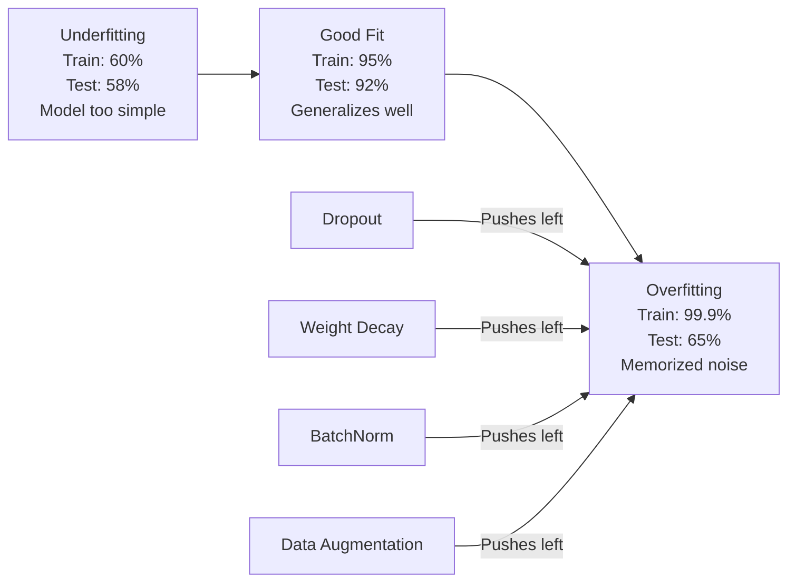
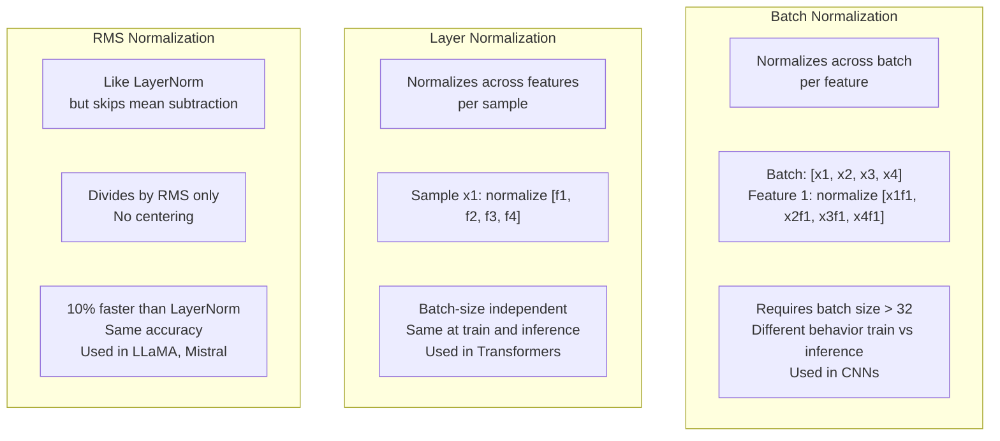
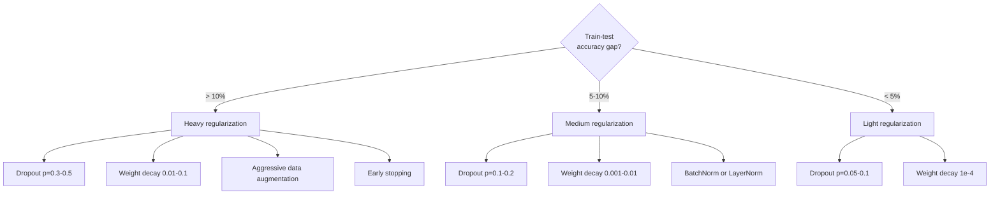

# Regularization

> Your model gets 99% on training data and 60% on test data. It's memorizing, not learning. Regularization is the tax you impose on complexity to force generalization.

**Type:** Build
**Languages:** Python
**Prerequisites:** Lesson 03.06 (Optimizers)
**Time:** ~75 minutes

## Learning Objectives

- Implement dropout with inverted scaling, L2 weight decay, batch normalization, layer normalization, and RMSNorm from scratch
- Measure the train-test accuracy gap through regularization experiments and diagnose overfitting
- Explain why transformers use LayerNorm instead of BatchNorm, and why modern LLMs prefer RMSNorm
- Apply the correct combination of regularization techniques based on overfitting severity

## The Problem

A neural network with enough parameters can memorize any dataset. This isn't a hypothesis — Zhang et al. (2017) proved it by training standard networks on ImageNet with random labels. These networks achieved near-zero training loss on completely random label assignments. They memorized one million random input-output pairs with no pattern to learn. Training loss: perfect. Test accuracy: zero.

This is the overfitting problem, and it gets worse as models get larger. GPT-3 has 175 billion parameters. The training set is roughly 500 billion tokens. With that many parameters, the model has enough capacity to memorize substantial portions of the training data verbatim. Without regularization, it would simply reproduce training examples instead of learning generalizable patterns.

The gap between training performance and test performance is the overfitting gap. Each technique in this lesson attacks this gap from a different angle. Dropout forces the network to not rely on any single neuron. Weight decay prevents any single weight from growing too large. Batch normalization smooths the loss surface so optimizers find flatter, more generalizable minima. Layer normalization does the same but works where batch normalization fails (small batches, variable-length sequences). RMSNorm makes it 10% faster by dropping the mean computation. Each technique is simple. Together, they're the difference between a model that memorizes and one that generalizes.

## The Concept

### The Overfitting Spectrum

Every model falls somewhere on a spectrum from underfitting (too simple, can't capture the pattern) to overfitting (too complex, captures noise too). The sweet spot is in between, and regularization pushes the model from the overfitting side toward the middle.



### Dropout

The simplest regularization technique with the most elegant explanation. During training, randomly zero out each neuron's output with probability p.

```
output = activation(z) * mask    where mask[i] ~ Bernoulli(1 - p)
```

With p = 0.5, half the neurons are zeroed out on every forward pass. The network must learn redundant representations because it can't predict which neurons will be available. This prevents co-adaptation — neurons learning to depend on specific other neurons being present.

Ensemble interpretation: a network with N neurons and dropout creates 2^N possible sub-networks (every combination of neurons on/off). Training with dropout approximates training all 2^N sub-networks simultaneously, each on different mini-batches. At test time, you use all neurons (no dropout) and scale outputs by (1 - p) to match the expected value during training. This is equivalent to averaging predictions from 2^N sub-networks — a massive ensemble in a single model.

In practice, scaling is applied during training rather than testing (inverted dropout):

```
During training:  output = activation(z) * mask / (1 - p)
During testing:   output = activation(z)   (no change needed)
```

This is cleaner because test code doesn't need to know about dropout at all.

Default rates: transformers use p = 0.1, MLPs use p = 0.5, CNNs use p = 0.2-0.3. Higher dropout = stronger regularization = higher risk of underfitting.

### Weight Decay (L2 Regularization)

Add the squared magnitude of all weights to the loss:

```
total_loss = task_loss + (lambda / 2) * sum(w_i^2)
```

The gradient of the regularization term is lambda * w. This means every step, each weight shrinks toward zero by an amount proportional to its magnitude. Large weights are penalized more. The model is pushed toward solutions where no single weight dominates.

Why this helps generalization: overfitting models tend to have large weights that amplify noise in the training data. Weight decay keeps weights small, limiting the model's effective capacity and forcing it to rely on robust, generalizable features rather than memorized quirks.

The lambda hyperparameter controls strength. Typical values:

- AdamW on transformers: 0.01
- SGD on CNNs: 1e-4
- Heavily overfitting models: 0.1

As discussed in Lesson 06: weight decay and L2 regularization are equivalent in SGD but not in Adam. Always use AdamW (decoupled weight decay) when training with Adam.

### Batch Normalization

Normalize each layer's output across the mini-batch before passing it to the next layer.

For a mini-batch of activations at one layer:

```
mu = (1/B) * sum(x_i)           (batch mean)
sigma^2 = (1/B) * sum((x_i - mu)^2)   (batch variance)
x_hat = (x_i - mu) / sqrt(sigma^2 + eps)   (normalize)
y = gamma * x_hat + beta        (scale and shift)
```

Gamma and beta are learnable parameters that can undo the normalization if that's more optimal. Without them, you're forcing every layer's output to be zero-mean unit-variance, which may not be what the network wants.

**Training vs inference difference:** During training, mu and sigma come from the current mini-batch. During inference, you use running averages accumulated during training (exponential moving average with momentum = 0.1, i.e., 90% old + 10% new).

Why BatchNorm works is still debated. The original paper claimed it reduces "internal covariate shift" (layer inputs' distributions changing as earlier layers update). Santurkar et al. (2018) showed this explanation is wrong. The real reason: BatchNorm smooths the loss surface. Gradients become more predictive, the Lipschitz constant is smaller, and the optimizer can safely take larger steps. That's why BatchNorm lets you use higher learning rates and converge faster.

BatchNorm has a fundamental limitation: it depends on batch statistics. With batch size 1, the mean and variance are meaningless. With small batches (< 32), the statistics are noisy and hurt performance. This is fatal for tasks like object detection (where GPU memory limits batch size) and language modeling (where sequence lengths vary).

### Layer Normalization

Normalize across features instead of across the batch. For a single sample:

```
mu = (1/D) * sum(x_j)           (feature mean)
sigma^2 = (1/D) * sum((x_j - mu)^2)   (feature variance)
x_hat = (x_j - mu) / sqrt(sigma^2 + eps)
y = gamma * x_hat + beta
```

D is the feature dimension. Each sample is normalized independently — no dependence on batch size. This is why transformers use LayerNorm instead of BatchNorm. Sequence lengths vary, batch sizes are often small (even 1 during generation), and the computation is identical between training and inference.

LayerNorm in transformers is applied after each self-attention block and each feed-forward block (Post-LN), or before (Pre-LN, which trains more stably).

### RMSNorm

LayerNorm without the mean subtraction. Proposed by Zhang & Sennrich (2019).

```
rms = sqrt((1/D) * sum(x_j^2))
y = gamma * x / rms
```

That's it. No mean computation, no beta parameter. The observation: re-centering (subtracting the mean) in LayerNorm contributes negligibly to model performance but costs compute. Removing it gives the same accuracy with ~10% less overhead.

LLaMA, LLaMA 2, LLaMA 3, Mistral, and most modern LLMs use RMSNorm instead of LayerNorm. At billions of parameters and trillions of tokens, that 10% savings is substantial.

### Normalization Comparison



### Data Augmentation as Regularization

Instead of modifying the model, modify the data. Transform training inputs while preserving labels:

- Images: random crop, flip, rotation, color jitter, cutout
- Text: synonym replacement, back-translation, random deletion
- Audio: time stretch, pitch shift, noise addition

The effect is the same as regularization: it increases the effective size of the training set, making it harder for the model to memorize specific samples. A model that sees each image once in its original form can memorize it. A model that sees 50 augmented versions of each image is forced to learn invariant structure.

### Early Stopping

The simplest regularization: stop training when validation loss starts increasing. At that moment, the model hasn't yet overfit. In practice, you track validation loss each epoch, save the best model, and continue training for a "patience" window (typically 5-20 epochs). If validation loss doesn't improve within the patience window, stop and load the saved best model.

### When to Use What



## Build It

### Step 1: Dropout (Training and Eval Modes)

```python
import random
import math


class Dropout:
    def __init__(self, p=0.5):
        self.p = p
        self.training = True
        self.mask = None

    def forward(self, x):
        if not self.training:
            return list(x)
        self.mask = []
        output = []
        for val in x:
            if random.random() < self.p:
                self.mask.append(0)
                output.append(0.0)
            else:
                self.mask.append(1)
                output.append(val / (1 - self.p))
        return output

    def backward(self, grad_output):
        grads = []
        for g, m in zip(grad_output, self.mask):
            if m == 0:
                grads.append(0.0)
            else:
                grads.append(g / (1 - self.p))
        return grads
```

### Step 2: L2 Weight Decay

```python
def l2_regularization(weights, lambda_reg):
    penalty = 0.0
    for w in weights:
        penalty += w * w
    return lambda_reg * 0.5 * penalty

def l2_gradient(weights, lambda_reg):
    return [lambda_reg * w for w in weights]
```

### Step 3: Batch Normalization

```python
class BatchNorm:
    def __init__(self, num_features, momentum=0.1, eps=1e-5):
        self.gamma = [1.0] * num_features
        self.beta = [0.0] * num_features
        self.eps = eps
        self.momentum = momentum
        self.running_mean = [0.0] * num_features
        self.running_var = [1.0] * num_features
        self.training = True
        self.num_features = num_features

    def forward(self, batch):
        batch_size = len(batch)
        if self.training:
            mean = [0.0] * self.num_features
            for sample in batch:
                for j in range(self.num_features):
                    mean[j] += sample[j]
            mean = [m / batch_size for m in mean]

            var = [0.0] * self.num_features
            for sample in batch:
                for j in range(self.num_features):
                    var[j] += (sample[j] - mean[j]) ** 2
            var = [v / batch_size for v in var]

            for j in range(self.num_features):
                self.running_mean[j] = (1 - self.momentum) * self.running_mean[j] + self.momentum * mean[j]
                self.running_var[j] = (1 - self.momentum) * self.running_var[j] + self.momentum * var[j]
        else:
            mean = list(self.running_mean)
            var = list(self.running_var)

        self.x_hat = []
        output = []
        for sample in batch:
            normalized = []
            out_sample = []
            for j in range(self.num_features):
                x_h = (sample[j] - mean[j]) / math.sqrt(var[j] + self.eps)
                normalized.append(x_h)
                out_sample.append(self.gamma[j] * x_h + self.beta[j])
            self.x_hat.append(normalized)
            output.append(out_sample)
        return output
```

### Step 4: Layer Normalization

```python
class LayerNorm:
    def __init__(self, num_features, eps=1e-5):
        self.gamma = [1.0] * num_features
        self.beta = [0.0] * num_features
        self.eps = eps
        self.num_features = num_features

    def forward(self, x):
        mean = sum(x) / len(x)
        var = sum((xi - mean) ** 2 for xi in x) / len(x)

        self.x_hat = []
        output = []
        for j in range(self.num_features):
            x_h = (x[j] - mean) / math.sqrt(var + self.eps)
            self.x_hat.append(x_h)
            output.append(self.gamma[j] * x_h + self.beta[j])
        return output
```

### Step 5: RMSNorm

```python
class RMSNorm:
    def __init__(self, num_features, eps=1e-6):
        self.gamma = [1.0] * num_features
        self.eps = eps
        self.num_features = num_features

    def forward(self, x):
        rms = math.sqrt(sum(xi * xi for xi in x) / len(x) + self.eps)
        output = []
        for j in range(self.num_features):
            output.append(self.gamma[j] * x[j] / rms)
        return output
```

### Step 6: Training Comparison With and Without Regularization

```python
def sigmoid(x):
    x = max(-500, min(500, x))
    return 1.0 / (1.0 + math.exp(-x))


def make_circle_data(n=200, seed=42):
    random.seed(seed)
    data = []
    for _ in range(n):
        x = random.uniform(-2, 2)
        y = random.uniform(-2, 2)
        label = 1.0 if x * x + y * y < 1.5 else 0.0
        data.append(([x, y], label))
    return data


class RegularizedNetwork:
    def __init__(self, hidden_size=16, lr=0.05, dropout_p=0.0, weight_decay=0.0):
        random.seed(0)
        self.hidden_size = hidden_size
        self.lr = lr
        self.dropout_p = dropout_p
        self.weight_decay = weight_decay
        self.dropout = Dropout(p=dropout_p) if dropout_p > 0 else None

        self.w1 = [[random.gauss(0, 0.5) for _ in range(2)] for _ in range(hidden_size)]
        self.b1 = [0.0] * hidden_size
        self.w2 = [random.gauss(0, 0.5) for _ in range(hidden_size)]
        self.b2 = 0.0

    def forward(self, x, training=True):
        self.x = x
        self.z1 = []
        self.h = []
        for i in range(self.hidden_size):
            z = self.w1[i][0] * x[0] + self.w1[i][1] * x[1] + self.b1[i]
            self.z1.append(z)
            self.h.append(max(0.0, z))

        if self.dropout and training:
            self.dropout.training = True
            self.h = self.dropout.forward(self.h)
        elif self.dropout:
            self.dropout.training = False
            self.h = self.dropout.forward(self.h)

        self.z2 = sum(self.w2[i] * self.h[i] for i in range(self.hidden_size)) + self.b2
        self.out = sigmoid(self.z2)
        return self.out

    def backward(self, target):
        eps = 1e-15
        p = max(eps, min(1 - eps, self.out))
        d_loss = -(target / p) + (1 - target) / (1 - p)
        d_sigmoid = self.out * (1 - self.out)
        d_out = d_loss * d_sigmoid

        for i in range(self.hidden_size):
            d_relu = 1.0 if self.z1[i] > 0 else 0.0
            d_h = d_out * self.w2[i] * d_relu
            self.w2[i] -= self.lr * (d_out * self.h[i] + self.weight_decay * self.w2[i])
            for j in range(2):
                self.w1[i][j] -= self.lr * (d_h * self.x[j] + self.weight_decay * self.w1[i][j])
            self.b1[i] -= self.lr * d_h
        self.b2 -= self.lr * d_out

    def evaluate(self, data):
        correct = 0
        total_loss = 0.0
        for x, y in data:
            pred = self.forward(x, training=False)
            eps = 1e-15
            p = max(eps, min(1 - eps, pred))
            total_loss += -(y * math.log(p) + (1 - y) * math.log(1 - p))
            if (pred >= 0.5) == (y >= 0.5):
                correct += 1
        return total_loss / len(data), correct / len(data) * 100

    def train_model(self, train_data, test_data, epochs=300):
        history = []
        for epoch in range(epochs):
            total_loss = 0.0
            correct = 0
            for x, y in train_data:
                pred = self.forward(x, training=True)
                self.backward(y)
                eps = 1e-15
                p = max(eps, min(1 - eps, pred))
                total_loss += -(y * math.log(p) + (1 - y) * math.log(1 - p))
                if (pred >= 0.5) == (y >= 0.5):
                    correct += 1
            train_loss = total_loss / len(train_data)
            train_acc = correct / len(train_data) * 100
            test_loss, test_acc = self.evaluate(test_data)
            history.append((train_loss, train_acc, test_loss, test_acc))
            if epoch % 75 == 0 or epoch == epochs - 1:
                gap = train_acc - test_acc
                print(f"    Epoch {epoch:3d}: train_acc={train_acc:.1f}%, test_acc={test_acc:.1f}%, gap={gap:.1f}%")
        return history
```

## Use It

PyTorch provides all normalization and regularization as modules:

```python
import torch
import torch.nn as nn

model = nn.Sequential(
    nn.Linear(784, 256),
    nn.BatchNorm1d(256),
    nn.ReLU(),
    nn.Dropout(0.3),
    nn.Linear(256, 128),
    nn.BatchNorm1d(128),
    nn.ReLU(),
    nn.Dropout(0.3),
    nn.Linear(128, 10),
)

model.train()
out_train = model(torch.randn(32, 784))

model.eval()
out_test = model(torch.randn(1, 784))
```

The `model.train()` / `model.eval()` switch is critical. It toggles dropout and tells BatchNorm whether to use batch statistics or running statistics. Forgetting `model.eval()` before inference is one of the most common bugs in deep learning. Your test accuracy will fluctuate randomly because dropout is still active and BatchNorm is using mini-batch statistics.

For transformers, the pattern is different:

```python
class TransformerBlock(nn.Module):
    def __init__(self, d_model=512, nhead=8, dropout=0.1):
        super().__init__()
        self.attention = nn.MultiheadAttention(d_model, nhead, dropout=dropout)
        self.norm1 = nn.LayerNorm(d_model)
        self.ff = nn.Sequential(
            nn.Linear(d_model, d_model * 4),
            nn.GELU(),
            nn.Linear(d_model * 4, d_model),
            nn.Dropout(dropout),
        )
        self.norm2 = nn.LayerNorm(d_model)
        self.dropout = nn.Dropout(dropout)

    def forward(self, x):
        attended, _ = self.attention(x, x, x)
        x = self.norm1(x + self.dropout(attended))
        x = self.norm2(x + self.ff(x))
        return x
```

LayerNorm, not BatchNorm. Dropout p=0.1, not p=0.5. These are the transformer defaults.

## Ship It

This lesson produces:
- `outputs/prompt-regularization-advisor.md` — A prompt that diagnoses overfitting and recommends the right regularization strategy

## Exercises

1. Implement spatial dropout for 2D data: instead of dropping individual neurons, drop entire feature channels. Simulate this by treating groups of consecutive features as channels and dropping them as a group. Compare train-test gap against standard dropout on the circle dataset with hidden_size=32.

2. Combine label smoothing from Lesson 05 with dropout from this lesson. Train with four configurations: neither, dropout only, label smoothing only, both. Measure the final train-test accuracy gap for each. Which combination gives the smallest gap?

3. Add a BatchNorm layer between the hidden layer and activation in your circle dataset network. Train with and without BatchNorm at learning rates 0.01, 0.05, and 0.1. BatchNorm should stabilize training at higher learning rates where the plain network diverges.

4. Implement early stopping: track test loss each epoch, save the best weights, stop if test loss doesn't improve for 20 epochs. Run the regularized network for 1000 epochs. Report which epoch had the best test accuracy and how many epochs of compute you saved.

5. Compare LayerNorm vs RMSNorm on a 4-layer network (not just 2). Initialize both with the same weights. Train for 200 epochs and compare final accuracy, training speed (time per epoch), and gradient magnitude at the first layer. Verify that RMSNorm is faster at the same accuracy.

## Key Terms

| Term | What People Say | What It Actually Is |
|------|----------------|----------------------|
| Overfitting | "The model memorized the data" | Model's training performance significantly exceeds test performance, indicating it learned noise rather than signal |
| Regularization | "Preventing overfitting" | Any technique that constrains model complexity to improve generalization: dropout, weight decay, normalization, data augmentation |
| Dropout | "Randomly killing neurons" | Zeroing random neuron outputs with probability p during training, forcing redundant representations; equivalent to training an ensemble |
| Weight decay | "L2 penalty" | Shrinking all weights toward zero each step by subtracting lambda * w; penalizes complexity through weight magnitude |
| Batch normalization | "Normalize per batch" | Normalizing layer outputs across the batch dimension, using batch statistics during training and running averages during inference |
| Layer normalization | "Normalize per sample" | Normalizing across features within each sample; batch-independent, used in transformers where batch sizes vary |
| RMSNorm | "LayerNorm without the mean" | Root mean square normalization; drops mean subtraction from LayerNorm, same accuracy with 10% speedup |
| Early stopping | "Stop before overfitting" | Halting training when validation loss stops improving; the simplest regularization, often combined with others |
| Data augmentation | "Making more from less" | Transforming training inputs (flips, crops, noise) to increase effective dataset size and force invariance learning |
| Generalization gap | "Train-test difference" | The difference between training and test performance; regularization aims to minimize this gap |

## Further Reading

- Srivastava et al., *Dropout: A Simple Way to Prevent Neural Networks from Overfitting* (2014) — The original dropout paper with ensemble interpretation and extensive experiments
- Ioffe & Szegedy, *Batch Normalization: Accelerating Deep Network Training by Reducing Internal Covariate Shift* (2015) — Introduced BatchNorm and its training procedure, one of the most cited papers in deep learning
- Zhang & Sennrich, *Root Mean Square Layer Normalization* (2019) — Shows RMSNorm matches LayerNorm accuracy with less compute; adopted by LLaMA and Mistral
- Zhang et al., *Understanding Deep Learning Requires Rethinking Generalization* (2017) — Landmark paper showing neural networks can memorize random labels, challenging conventional views on generalization
