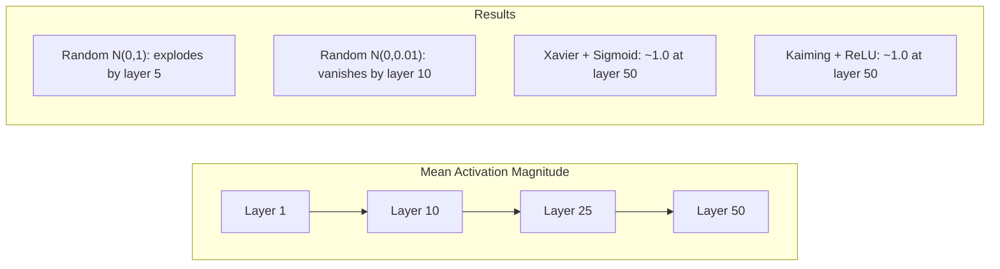
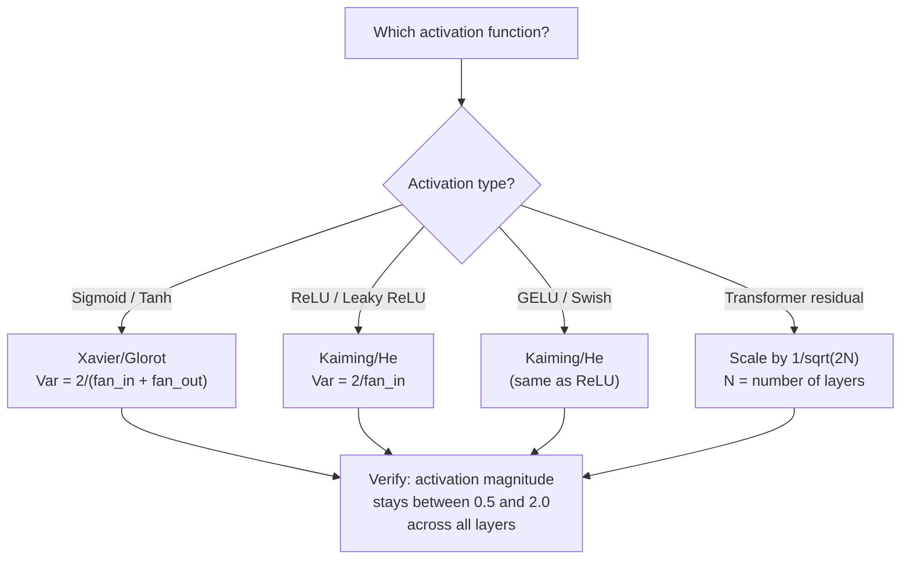

# Weight Initialization and Training Stability

> Initialize wrong and training never starts. Initialize right and 50 layers train as smoothly as 3.

**Type:** Build
**Languages:** Python
**Prerequisites:** Lesson 03.04 (Activation Functions), Lesson 03.07 (Regularization)
**Time:** ~90 minutes

## Learning Objectives

- Implement zero, random, Xavier/Glorot, and Kaiming/He initialization strategies, measuring their effect on activation magnitude after signal passes through 50 layers
- Derive why Xavier initialization uses Var(w) = 2/(fan_in + fan_out) and Kaiming uses Var(w) = 2/fan_in
- Demonstrate the symmetry problem of zero initialization and explain why random scale alone is insufficient
- Match correct initialization strategies to activation functions: Xavier for sigmoid/tanh, Kaiming for ReLU/GELU

## The Problem

Initialize all weights to zero. Nothing learns. Every neuron computes the same function, receives the same gradient, updates identically. After ten thousand epochs, your 512-neuron hidden layer is still 512 copies of one neuron. You paid for 512 parameters and got 1.

Initialize them too large. Activations explode through the network. By layer 10, values hit 1e15. By layer 20, they overflow to infinity. Gradients replay the same trajectory in reverse.

Initialize them randomly from a standard normal. It works for 3 layers. At 50 layers, signal either collapses to zero or detonates to infinity, depending on whether that random scale was slightly too small or slightly too large. The boundary between "works" and "broken" is razor-thin.

Weight initialization is the most underrated decision in deep learning. Architectures get papers. Optimizers get blog posts. Initialization gets a footnote. But get it wrong and nothing else matters—your network is dead before training begins.

## The Concept

### The Symmetry Problem

Every neuron in a layer is structurally identical: inputs multiplied by weights, bias added, activation applied. If all weights start at the same value (zero being the extreme case), every neuron computes the same output. During backpropagation, every neuron receives the same gradient. During update, every neuron changes by the same amount.

You're stuck. The network has hundreds of parameters but they all march in lockstep. This is called symmetry, and random initialization is the brute-force way to break it. Each neuron starts at a different point in weight space, so each learns different features.

But "random" isn't enough. The *scale* of randomness determines whether the network can train.

### Variance Propagation Across Layers

Consider a layer with fan_in inputs:

```
z = w1*x1 + w2*x2 + ... + w_n*x_n
```

If each weight wi is drawn from a distribution with variance Var(w), and each input xi has variance Var(x), then the output variance is:

```
Var(z) = fan_in * Var(w) * Var(x)
```

If Var(w) = 1 and fan_in = 512, output variance is 512x the input variance. After 10 layers: 512^10 = 1.2e27. Your signal explodes.

If Var(w) = 0.001, output variance shrinks by 0.001 * 512 = 0.512 per layer. After 10 layers: 0.512^10 = 0.00013. Your signal vanishes.

The goal: choose Var(w) so that Var(z) = Var(x). Signal magnitude stays constant across layers.

### Xavier/Glorot Initialization

Glorot and Bengio (2010) derived the solution for sigmoid and tanh activations. To preserve variance in both forward and backward passes:

```
Var(w) = 2 / (fan_in + fan_out)
```

In practice, weights are drawn from:

```
w ~ Uniform(-limit, limit)  where limit = sqrt(6 / (fan_in + fan_out))
```

Or:

```
w ~ Normal(0, sqrt(2 / (fan_in + fan_out)))
```

It works because sigmoid and tanh are approximately linear near zero, and properly initialized activations live there. Variance propagates stably through dozens of layers.

### Kaiming/He Initialization

ReLU kills half the outputs (all negatives become zero). The effective fan_in is halved because on average half the inputs are zeroed. Xavier initialization doesn't account for this—it underestimates the required variance.

He et al. (2015) adjusted the formula:

```
Var(w) = 2 / fan_in
```

Weights are drawn from:

```
w ~ Normal(0, sqrt(2 / fan_in))
```

The factor of 2 compensates for ReLU zeroing half the activations. Without it, signal shrinks by ~0.5x per layer. At 50 layers: 0.5^50 = 8.8e-16. Kaiming initialization prevents this.

### Transformer Initialization

GPT-2 introduced a different pattern. Residual connections add each sublayer's output back to its input:

```
x = x + sublayer(x)
```

Each addition increases variance. With N residual layers, variance grows proportionally to N. GPT-2 scales residual layer weights by 1/sqrt(2N), where N is the number of layers. This keeps accumulated signal magnitude stable.

Llama 3 (405B parameters, 126 layers) uses a similar scheme. Without this scaling, the residual stream would grow unboundedly across 126 attention and feed-forward blocks.

```mermaid
flowchart TD
    subgraph "Zero Initialization"
        Z1["Layer 1<br/>all weights = 0"] --> Z2["Layer 2<br/>all neurons identical"]
        Z2 --> Z3["Layer 3<br/>still identical"]
        Z3 --> ZR["Result: 1 effective neuron<br/>regardless of width"]
    end

    subgraph "Xavier Initialization"
        X1["Layer 1<br/>Var = 2/(fan_in+fan_out)"] --> X2["Layer 2<br/>signal stable"]
        X2 --> X3["Layer 50<br/>signal stable"]
        X3 --> XR["Result: trainable<br/>with sigmoid/tanh"]
    end

    subgraph "Kaiming Initialization"
        K1["Layer 1<br/>Var = 2/fan_in"] --> K2["Layer 2<br/>signal stable"]
        K2 --> K3["Layer 50<br/>signal stable"]
        K3 --> KR["Result: trainable<br/>with ReLU/GELU"]
    end
```



### Activation Magnitude Through 50 Layers



### Choosing the Right Initialization



## Build It

### Step 1: Initialization Strategies

Four ways to initialize a weight matrix. Each returns a list of lists (a 2D matrix) with fan_in columns and fan_out rows.

```python
import math
import random


def zero_init(fan_in, fan_out):
    return [[0.0 for _ in range(fan_in)] for _ in range(fan_out)]


def random_init(fan_in, fan_out, scale=1.0):
    return [[random.gauss(0, scale) for _ in range(fan_in)] for _ in range(fan_out)]


def xavier_init(fan_in, fan_out):
    std = math.sqrt(2.0 / (fan_in + fan_out))
    return [[random.gauss(0, std) for _ in range(fan_in)] for _ in range(fan_out)]


def kaiming_init(fan_in, fan_out):
    std = math.sqrt(2.0 / fan_in)
    return [[random.gauss(0, std) for _ in range(fan_in)] for _ in range(fan_out)]
```

### Step 2: Activation Functions

We need sigmoid, tanh, and ReLU to test each initialization strategy with its matching activation.

```python
def sigmoid(x):
    x = max(-500, min(500, x))
    return 1.0 / (1.0 + math.exp(-x))


def tanh_act(x):
    return math.tanh(x)


def relu(x):
    return max(0.0, x)
```

### Step 3: Forward Through 50 Layers

Pass random data through a deep network and measure the mean activation magnitude at each layer.

```python
def forward_deep(init_fn, activation_fn, n_layers=50, width=64, n_samples=100):
    random.seed(42)
    layer_magnitudes = []

    inputs = [[random.gauss(0, 1) for _ in range(width)] for _ in range(n_samples)]

    for layer_idx in range(n_layers):
        weights = init_fn(width, width)
        biases = [0.0] * width

        new_inputs = []
        for sample in inputs:
            output = []
            for neuron_idx in range(width):
                z = sum(weights[neuron_idx][j] * sample[j] for j in range(width)) + biases[neuron_idx]
                output.append(activation_fn(z))
            new_inputs.append(output)
        inputs = new_inputs

        magnitudes = []
        for sample in inputs:
            magnitudes.append(sum(abs(v) for v in sample) / width)
        mean_mag = sum(magnitudes) / len(magnitudes)
        layer_magnitudes.append(mean_mag)

    return layer_magnitudes
```

### Step 4: Experiments

Run all combinations: zero init, random N(0,1), random N(0,0.01), Xavier with sigmoid, Xavier with tanh, Kaiming with ReLU. Print magnitudes at key layers.

```python
def run_experiment():
    configs = [
        ("Zero init + Sigmoid", lambda fi, fo: zero_init(fi, fo), sigmoid),
        ("Random N(0,1) + ReLU", lambda fi, fo: random_init(fi, fo, 1.0), relu),
        ("Random N(0,0.01) + ReLU", lambda fi, fo: random_init(fi, fo, 0.01), relu),
        ("Xavier + Sigmoid", xavier_init, sigmoid),
        ("Xavier + Tanh", xavier_init, tanh_act),
        ("Kaiming + ReLU", kaiming_init, relu),
    ]

    print(f"{'Strategy':<30} {'L1':>10} {'L5':>10} {'L10':>10} {'L25':>10} {'L50':>10}")
    print("-" * 80)

    for name, init_fn, act_fn in configs:
        mags = forward_deep(init_fn, act_fn)
        row = f"{name:<30}"
        for idx in [0, 4, 9, 24, 49]:
            val = mags[idx]
            if val > 1e6:
                row += f" {'EXPLODED':>10}"
            elif val < 1e-6:
                row += f" {'VANISHED':>10}"
            else:
                row += f" {val:>10.4f}"
        print(row)
```

### Step 5: Symmetry Demo

Show that zero initialization produces identical neurons.

```python
def symmetry_demo():
    random.seed(42)
    weights = zero_init(2, 4)
    biases = [0.0] * 4

    inputs = [0.5, -0.3]
    outputs = []
    for neuron_idx in range(4):
        z = sum(weights[neuron_idx][j] * inputs[j] for j in range(2)) + biases[neuron_idx]
        outputs.append(sigmoid(z))

    print("\nSymmetry Demo (4 neurons, zero init):")
    for i, out in enumerate(outputs):
        print(f"  Neuron {i}: output = {out:.6f}")
    all_same = all(abs(outputs[i] - outputs[0]) < 1e-10 for i in range(len(outputs)))
    print(f"  All identical: {all_same}")
    print(f"  Effective parameters: 1 (not {len(weights) * len(weights[0])})")
```

### Step 6: Per-Layer Magnitude Report

Print a text-based bar chart of activation magnitudes through 50 layers.

```python
def magnitude_report(name, magnitudes):
    print(f"\n{name}:")
    for i, mag in enumerate(magnitudes):
        if i % 5 == 0 or i == len(magnitudes) - 1:
            if mag > 1e6:
                bar = "X" * 50 + " EXPLODED"
            elif mag < 1e-6:
                bar = "." + " VANISHED"
            else:
                bar_len = min(50, max(1, int(mag * 10)))
                bar = "#" * bar_len
            print(f"  Layer {i+1:3d}: {bar} ({mag:.6f})")
```

## Use It

PyTorch provides all of these as built-in functions:

```python
import torch
import torch.nn as nn

layer = nn.Linear(512, 256)

nn.init.xavier_uniform_(layer.weight)
nn.init.xavier_normal_(layer.weight)

nn.init.kaiming_uniform_(layer.weight, nonlinearity='relu')
nn.init.kaiming_normal_(layer.weight, nonlinearity='relu')

nn.init.zeros_(layer.bias)
```

When you call `nn.Linear(512, 256)`, PyTorch defaults to Kaiming uniform initialization. That's why most simple networks "just work"—PyTorch already made the right choice for you. But when you build custom architectures, or go deeper than 20 layers, you need to understand what's happening and may need to override defaults.

For transformers, HuggingFace models typically handle initialization in their `_init_weights` method. GPT-2's implementation scales residual projections by 1/sqrt(N). If you're building a transformer from scratch, you need to add this yourself.

## Ship It

This lesson produces:
- `outputs/prompt-init-strategy.md` — a prompt for diagnosing weight initialization problems and recommending the correct strategy

## Exercises

1. Add LeCun initialization (Var = 1/fan_in, designed for SELU activation). Run the 50-layer experiment with LeCun init + tanh and compare against Xavier + tanh.

2. Implement GPT-2's residual scaling: multiply each layer's output by 1/sqrt(2*N) before adding it back to the residual stream. Run 50 layers with and without scaling and measure how fast residual magnitude grows.

3. Write an "initialization health check" function that takes a network's layer dimensions and activation types, then recommends the correct initialization and warns if the current one would cause problems.

4. Run the experiment comparing fan_in = 16 vs fan_in = 1024. Xavier and Kaiming adapt to fan_in, but random init doesn't. Show how the gap between "works" and "broken" widens as layers get larger.

5. Implement orthogonal initialization (generate a random matrix, compute its SVD, use the orthogonal matrix U). Compare against Kaiming on a 50-layer ReLU network.

## Key Terms

| Term | What people say | What it actually is |
|------|----------------|----------------------|
| Weight initialization | "Randomly set starting weights" | The strategy for choosing initial weight values that determines whether a network can train at all |
| Symmetry breaking | "Make neurons different" | Using random initialization to ensure neurons learn different features rather than computing the same function |
| fan-in | "Number of inputs to a neuron" | The number of incoming connections, determining how input variance accumulates in the weighted sum |
| fan-out | "Number of outputs from a neuron" | The number of outgoing connections, relevant for maintaining gradient variance during backpropagation |
| Xavier/Glorot initialization | "The init for sigmoid" | Var(w) = 2/(fan_in + fan_out), designed to keep variance stable through sigmoid and tanh activations |
| Kaiming/He initialization | "The init for ReLU" | Var(w) = 2/fan_in, accounting for ReLU zeroing half the activations |
| Variance propagation | "How signal grows or shrinks through layers" | Mathematical analysis of how activation variance changes layer-by-layer based on weight scale |
| Residual scaling | "GPT-2's init trick" | Scaling residual connection weights by 1/sqrt(2N) to prevent variance growth through N transformer layers |
| Dead network | "Nothing trains" | A network where bad initialization causes all gradients to be zero or all activations to saturate |
| Exploding activations | "Values going to infinity" | Weight variance too high, causing activation magnitude to grow exponentially through layers |

## Further Reading

- Glorot & Bengio, "Understanding the difficulty of training deep feedforward neural networks" (2010) — The original Xavier initialization paper with variance analysis
- He et al., "Delving Deep into Rectifiers" (2015) — Introduces Kaiming initialization for ReLU networks
- Radford et al., "Language Models are Unsupervised Multitask Learners" (2019) — The GPT-2 paper with residual scaling initialization
- Mishkin & Matas, "All You Need is a Good Init" (2016) — Layer-wise unit variance initialization, an empirical alternative to analytical formulas
