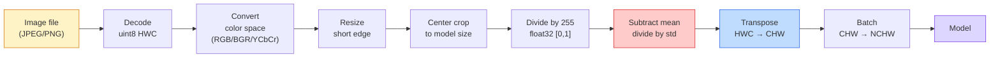
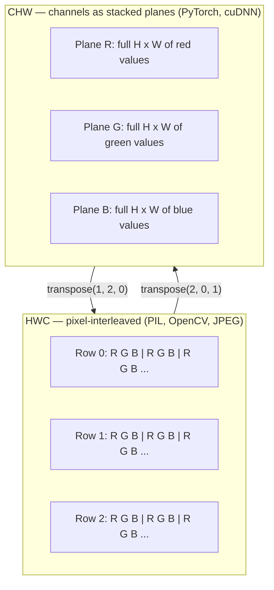

# Image Fundamentals — Pixels, Channels, Color Spaces

> An image is a tensor of light samples. Every vision model you will ever use starts from this single fact.

**Type:** Build
**Languages:** Python
**Prerequisites:** Phase 1 Lesson 12 (tensor operations), Phase 3 Lesson 11 (PyTorch intro)
**Time:** ~45 minutes

## Learning Objectives

- Explain how a continuous scene gets discretized into pixels, and why sampling/quantization decisions set the ceiling for every downstream model
- Read, slice, and inspect images as NumPy arrays, switching fluently between HWC and CHW layouts
- Convert between RGB, grayscale, HSV, and YCbCr, and explain why each color space exists
- Perform pixel-level preprocessing exactly as torchvision expects (normalization, standardization, resize, channels-first)

## The Problem

Every paper you read, every set of pretrained weights you download, every vision API you call assumes the input has a specific encoding. Feed a `uint8` image to a model expecting `float32` and it runs fine — then silently produces garbage. Feed BGR to a network trained on RGB and accuracy drops ten points. Feed channels-last input to a model expecting channels-first and the first convolution treats height as feature channels. None of these throw errors. They just destroy your metrics, and you spend a week hunting a bug that lives in how the file was loaded.

Convolutions themselves are not complicated, as long as you know what they slide over. The hard part: "an image" means different things to a camera, a JPEG decoder, PIL, OpenCV, torchvision, and a CUDA kernel. Each stack has its own axis order, byte range, and channel convention. Vision engineers who cannot keep these straight ship broken pipelines.

This lesson builds the foundation so everything later in this phase can stand on it. By the end you will know: what a pixel is, why each pixel is three numbers instead of one, what "normalize with ImageNet stats" actually does, and how to convert between the two or three layouts every subsequent lesson assumes.

## The Concept

### The Full Preprocessing Pipeline

Every production vision system is the same chain of reversible transforms. Get any step wrong and the model sees input that differs from what it was trained on.



The red and blue boxes are where 80% of silent failures hide: missing standardization, wrong layout.

### A Pixel Is a Sample, Not a Square

A camera sensor counts photons hitting tiny detectors arranged in a grid. Each detector integrates light over a fraction of a second and outputs a voltage proportional to the photon count. The sensor then discretizes that voltage into an integer. One detector becomes one pixel.

```
Continuous scene                  Sensor grid                     Digital image
(infinite detail)                 (H x W detectors)               (H x W integers)

    ~~~~~                        +--+--+--+--+--+                 210 198 180 155 120
   ~   ~   ~                     |  |  |  |  |  |                 205 195 178 152 118
  ~ light ~      ---->           +--+--+--+--+--+     ---->       200 190 175 150 115
   ~~~~~                         |  |  |  |  |  |                 195 185 170 148 112
                                 +--+--+--+--+--+                 188 180 165 145 108
```

Two choices at this stage set the ceiling for everything downstream:

- **Spatial sampling** determines how many detectors cover each degree of the scene. Too few and edges alias. Too many and storage and compute explode.
- **Intensity quantization** determines how finely voltage is divided. 8 bits gives 256 levels — the display standard. 10, 12, 16 bits give smoother gradients, critical for medical imaging, HDR, and raw sensor pipelines.

A pixel is not a colored square with area. It is a single measurement. When you resize or rotate, you are resampling this measurement grid.

### Why Three Channels

A single detector counts photons across the visible spectrum — that gives grayscale. To get color, the sensor overlays a mosaic of red, green, and blue filters on the grid. After demosaicing, each spatial location has three integers: the responses of nearby red-filtered, green-filtered, and blue-filtered detectors. Those three integers are a pixel's RGB triplet.

```
A pixel in memory:

    (R, G, B) = (210, 140, 30)   <- reddish orange

An H x W RGB image:

    shape (H, W, 3)     stored as      H rows, each W pixels, each pixel 3 values
                                        uint8: each value in [0, 255]
```

Three is not a magic number. Depth cameras add a Z channel. Satellites add infrared and ultraviolet bands. Medical scans are often single-channel (X-ray, CT) or many-channel (hyperspectral). Channel count is the last axis; convolution layers learn to mix across it.

### Two Layout Conventions: HWC and CHW

The same tensor, two orderings. Every library picks one.

```
HWC (height, width, channels)           CHW (channels, height, width)

   W ->                                    H ->
  +-----+-----+-----+                     +-----+-----+
H |R G B|R G B|R G B|                   C |R R R R R R|
| +-----+-----+-----+                   | +-----+-----+
v |R G B|R G B|R G B|                   v |G G G G G G|
  +-----+-----+-----+                     +-----+-----+
                                          |B B B B B B|
                                          +-----+-----+

   PIL, OpenCV, matplotlib,              PyTorch, most deep learning
   nearly every image file on disk       frameworks, cuDNN kernels
```

CHW exists because convolution kernels slide over H and W. Putting the channel axis first means each kernel sees a contiguous 2D plane per channel, which vectorizes cleanly. Disk formats keep HWC because it matches scanline order as it comes off the sensor.

The line you will type a thousand times:

```
img_chw = img_hwc.transpose(2, 0, 1)      # NumPy
img_chw = img_hwc.permute(2, 0, 1)        # PyTorch tensor
```

Memory layout visualization:



### Byte Range and dtype

Three conventions dominate:

| Convention | dtype | Range | Where you see it |
|------------|-------|-------|------------------|
| Raw | `uint8` | [0, 255] | Files on disk, PIL, OpenCV output |
| Normalized | `float32` | [0.0, 1.0] | After `img.astype('float32') / 255` |
| Standardized | `float32` | roughly [-2, +2] | After subtracting mean and dividing by std |

CNNs train on standardized input. The ImageNet stats `mean=[0.485, 0.456, 0.406]`, `std=[0.229, 0.224, 0.225]` are the arithmetic mean and standard deviation computed per channel over all [0, 1]-normalized pixels in the ImageNet training set. Feeding raw `uint8` to a model expecting standardized floats is the single most common silent failure in applied vision.

### Color Spaces and Why They Exist

RGB is the capture format, but it is not always the most useful representation for models.

```
 RGB               HSV                       YCbCr / YUV

 R red              H hue (angle 0-360)       Y luminance (brightness)
 G green            S saturation (0-1)        Cb blue-yellow chrominance
 B blue             V value (0-1)             Cr red-green chrominance

 Linear, matches    Separates color from      Separates brightness from color.
 sensor output      brightness. Good for      JPEG and most video codecs compress
                    color-based thresholding,  chrominance channels harder because
                    UI sliders, simple         the eye is less sensitive to chroma
                    filters                    detail than to Y.
```

Most modern CNNs take RGB. You encounter other spaces in these scenarios:

- **HSV** — classical CV code, color-based segmentation, white balance.
- **YCbCr** — reading JPEG internals, video pipelines, super-resolution models operating on Y only.
- **Grayscale** — OCR, document models, and any task where color is a confound rather than signal.

RGB to grayscale is a weighted sum, not an average, because the eye is more sensitive to green than to red or blue:

```
Y = 0.299 R + 0.587 G + 0.114 B       (ITU-R BT.601, classic weights)
```

### Aspect Ratio, Resize, and Interpolation

Every model has a fixed input size (224x224 for most ImageNet classifiers, 384x384 or 512x512 for modern detectors). Your images rarely match. Three resize strategies matter:

- **Resize short edge, then center crop** — the standard ImageNet recipe. Preserves aspect ratio, discards a strip of pixels at the edges.
- **Resize with padding** — preserves aspect ratio and every pixel, adds black bars. Standard for detection and OCR.
- **Resize directly to target** — stretches the image. Cheap, distorts geometry, sufficient for many classification tasks.

Interpolation method determines how intermediate pixels are computed when the new grid does not align with the old:

```
Nearest neighbor    Fastest, blocky, the only option for masks/labels
Bilinear            Fast, smooth, default for most image resizing
Bicubic             Slower, sharper on upscale
Lanczos             Slowest, highest quality, for final display
```

Rule of thumb: bilinear for training, bicubic or lanczos for human-facing assets, nearest neighbor for anything containing integer class IDs.

## Build It

### Step 1: Load an image and inspect its shape

Load any JPEG or PNG with Pillow, convert to NumPy, print what you get. For a deterministic, offline-runnable example, synthesize one.

```python
import numpy as np
from PIL import Image

def synthetic_rgb(h=128, w=192, seed=0):
    rng = np.random.default_rng(seed)
    yy, xx = np.meshgrid(np.linspace(0, 1, h), np.linspace(0, 1, w), indexing="ij")
    r = (np.sin(xx * 6) * 0.5 + 0.5) * 255
    g = yy * 255
    b = (1 - yy) * xx * 255
    rgb = np.stack([r, g, b], axis=-1) + rng.normal(0, 6, (h, w, 3))
    return np.clip(rgb, 0, 255).astype(np.uint8)

arr = synthetic_rgb()
# Or load from disk:
# arr = np.asarray(Image.open("your_image.jpg").convert("RGB"))

print(f"type:   {type(arr).__name__}")
print(f"dtype:  {arr.dtype}")
print(f"shape:  {arr.shape}     # (H, W, C)")
print(f"min:    {arr.min()}")
print(f"max:    {arr.max()}")
print(f"pixel at (0, 0): {arr[0, 0]}")
```

Expected output: `shape: (H, W, 3)`, `dtype: uint8`, range `[0, 255]`. This is the canonical on-disk representation regardless of whether the bytes came from a camera, JPEG decoder, or synthetic generator.

### Step 2: Split channels and rearrange layout

Extract R, G, B separately, then convert from HWC to PyTorch's CHW.

```python
R = arr[:, :, 0]
G = arr[:, :, 1]
B = arr[:, :, 2]
print(f"R shape: {R.shape}, mean: {R.mean():.1f}")
print(f"G shape: {G.shape}, mean: {G.mean():.1f}")
print(f"B shape: {B.shape}, mean: {B.mean():.1f}")

arr_chw = arr.transpose(2, 0, 1)
print(f"\nHWC shape: {arr.shape}")
print(f"CHW shape: {arr_chw.shape}")
```

Three grayscale planes, one per channel. CHW is just a reordering of axes; when memory layout permits, no data copy is strictly needed.

### Step 3: Grayscale and HSV conversion

Weighted-sum grayscale, then a hand-rolled RGB-to-HSV.

```python
def rgb_to_grayscale(rgb):
    weights = np.array([0.299, 0.587, 0.114], dtype=np.float32)
    return (rgb.astype(np.float32) @ weights).astype(np.uint8)

def rgb_to_hsv(rgb):
    rgb_f = rgb.astype(np.float32) / 255.0
    r, g, b = rgb_f[..., 0], rgb_f[..., 1], rgb_f[..., 2]
    cmax = np.max(rgb_f, axis=-1)
    cmin = np.min(rgb_f, axis=-1)
    delta = cmax - cmin

    h = np.zeros_like(cmax)
    mask = delta > 0
    rmax = mask & (cmax == r)
    gmax = mask & (cmax == g)
    bmax = mask & (cmax == b)
    h[rmax] = ((g[rmax] - b[rmax]) / delta[rmax]) % 6
    h[gmax] = ((b[gmax] - r[gmax]) / delta[gmax]) + 2
    h[bmax] = ((r[bmax] - g[bmax]) / delta[bmax]) + 4
    h = h * 60.0

    s = np.where(cmax > 0, delta / cmax, 0)
    v = cmax
    return np.stack([h, s, v], axis=-1)

gray = rgb_to_grayscale(arr)
hsv = rgb_to_hsv(arr)
print(f"gray shape: {gray.shape}, range: [{gray.min()}, {gray.max()}]")
print(f"hsv   shape: {hsv.shape}")
print(f"hue range: [{hsv[..., 0].min():.1f}, {hsv[..., 0].max():.1f}] degrees")
print(f"sat range: [{hsv[..., 1].min():.2f}, {hsv[..., 1].max():.2f}]")
print(f"val range: [{hsv[..., 2].min():.2f}, {hsv[..., 2].max():.2f}]")
```

Hue outputs in degrees, saturation and value in [0, 1]. This matches OpenCV's `hsv_full` convention.

### Step 4: Normalize, standardize, and reverse

Go from raw bytes to the exact tensor a pretrained ImageNet model expects, then back again.

```python
mean = np.array([0.485, 0.456, 0.406], dtype=np.float32)
std = np.array([0.229, 0.224, 0.225], dtype=np.float32)

def preprocess_imagenet(rgb_uint8):
    x = rgb_uint8.astype(np.float32) / 255.0
    x = (x - mean) / std
    x = x.transpose(2, 0, 1)
    return x

def deprocess_imagenet(chw_float32):
    x = chw_float32.transpose(1, 2, 0)
    x = x * std + mean
    x = np.clip(x * 255.0, 0, 255).astype(np.uint8)
    return x

x = preprocess_imagenet(arr)
print(f"preprocessed shape: {x.shape}     # (C, H, W)")
print(f"preprocessed dtype: {x.dtype}")
print(f"preprocessed mean per channel:  {x.mean(axis=(1, 2)).round(3)}")
print(f"preprocessed std  per channel:  {x.std(axis=(1, 2)).round(3)}")

roundtrip = deprocess_imagenet(x)
max_diff = np.abs(roundtrip.astype(int) - arr.astype(int)).max()
print(f"roundtrip max pixel diff: {max_diff}    # should be 0 or 1")
```

Per-channel mean should be close to zero, std close to one. This preprocess/deprocess pair is exactly what each `torchvision transforms.Normalize` call does under the hood.

### Step 5: Resize with three interpolation methods

Compare nearest, bilinear, and bicubic on an upscale to make differences visible.

```python
target = (arr.shape[0] * 3, arr.shape[1] * 3)

nearest = np.asarray(Image.fromarray(arr).resize(target[::-1], Image.NEAREST))
bilinear = np.asarray(Image.fromarray(arr).resize(target[::-1], Image.BILINEAR))
bicubic = np.asarray(Image.fromarray(arr).resize(target[::-1], Image.BICUBIC))

def local_roughness(x):
    gy = np.diff(x.astype(float), axis=0)
    gx = np.diff(x.astype(float), axis=1)
    return float(np.abs(gy).mean() + np.abs(gx).mean())

for name, out in [("nearest", nearest), ("bilinear", bilinear), ("bicubic", bicubic)]:
    print(f"{name:>8}  shape={out.shape}  roughness={local_roughness(out):6.2f}")
```

Nearest scores highest on roughness because it preserves hard edges. Bilinear is the smoothest. Bicubic sits in between — retaining perceptual sharpness without introducing staircase artifacts.

## Use It

`torchvision.transforms` wraps all of the above into a composable pipeline. The code below exactly reproduces what `preprocess_imagenet` does, plus resize and crop.

```python
import torch
from torchvision import transforms
from PIL import Image

img = Image.fromarray(synthetic_rgb(256, 256))

pipeline = transforms.Compose([
    transforms.Resize(256),
    transforms.CenterCrop(224),
    transforms.ToTensor(),
    transforms.Normalize(mean=[0.485, 0.456, 0.406], std=[0.229, 0.224, 0.225]),
])

x = pipeline(img)
print(f"tensor type:  {type(x).__name__}")
print(f"tensor dtype: {x.dtype}")
print(f"tensor shape: {tuple(x.shape)}      # (C, H, W)")
print(f"per-channel mean: {x.mean(dim=(1, 2)).tolist()}")
print(f"per-channel std:  {x.std(dim=(1, 2)).tolist()}")

batch = x.unsqueeze(0)
print(f"\nbatched shape: {tuple(batch.shape)}   # (N, C, H, W) — ready for the model")
```

Four steps, strictly in this order: `Resize(256)` scales the short edge to 256; `CenterCrop(224)` takes a 224x224 patch from the center; `ToTensor()` divides by 255 and converts HWC to CHW; `Normalize` subtracts ImageNet mean and divides by std. Reverse this order and you silently change what reaches the model.

## Ship It

This lesson produces:

- `outputs/prompt-vision-preprocessing-audit.md` — a prompt that turns any model card or dataset card into a checklist of the exact preprocessing invariants a team must follow.
- `outputs/skill-image-tensor-inspector.md` — a skill that takes any image-shaped tensor or array and reports dtype, layout, range, and whether it appears raw, normalized, or standardized.

## Exercises

1. **(Easy)** Load a JPEG with both OpenCV (`cv2.imread`) and Pillow. Print the shape and pixel at `(0, 0)` from both. Explain the channel-order difference, then write a one-liner that makes the OpenCV array match Pillow's exactly.
2. **(Medium)** Write `standardize(img, mean, std)` and its inverse such that the roundtrip passes `max_diff <= 1` for any uint8 image. Your functions must handle both a single HWC image and an NCHW batch with the same calling convention.
3. **(Hard)** Take a 3-channel, ImageNet-standardized tensor and pass it through a 1x1 convolution that learns to blend RGB into a single grayscale channel. Initialize weights to `[0.299, 0.587, 0.114]`, freeze them, and verify the output matches your hand-rolled `rgb_to_grayscale` within floating-point tolerance. What other classic color-space transforms can be expressed as 1x1 convolutions?

## Key Terms

| Term | How people say it | What it actually is |
|------|-------------------|---------------------|
| Pixel | "a colored square" | A single measurement of light intensity at a grid location — three numbers for color, one for grayscale |
| Channel | "color" | One of several parallel spatial grids stacked into an image tensor; last axis in HWC, first in CHW |
| HWC / CHW | "the shape" | Axis ordering of an image tensor; disk and PIL use HWC, PyTorch and cuDNN use CHW |
| Normalization | "scaling the image" | Dividing by 255 to put pixels in [0, 1] — necessary but not sufficient |
| Standardization | "zero-centering" | Per-channel mean subtraction and std division so the input distribution matches what the model saw during training |
| Grayscale conversion | "averaging channels" | A weighted sum with coefficients 0.299/0.587/0.114 matching human luminance perception |
| Interpolation | "how resize picks pixels" | The rule deciding output values when the new grid does not align with the old — nearest for labels, bilinear for training, bicubic for display |
| Aspect ratio | "width over height" | The ratio that distinguishes "resize + pad" from "resize + stretch" |

## Further Reading

- [Charles Poynton — A Guided Tour of Color Space](https://poynton.ca/PDFs/Guided_tour.pdf) — the clearest technical explanation of why so many color spaces exist and when each matters
- [PyTorch Vision Transforms Docs](https://pytorch.org/vision/stable/transforms.html) — the full transform pipeline you will actually compose in production
- [How JPEG Works (Colt McAnlis)](https://www.youtube.com/watch?v=F1kYBnY6mwg) — a sharp visual explanation of chroma subsampling, DCT, and why JPEG encodes YCbCr instead of RGB
- [ImageNet Preprocessing Conventions (torchvision models)](https://pytorch.org/vision/stable/models.html) — the authoritative source for `mean=[0.485, 0.456, 0.406]` and why every model in the zoo expects it
