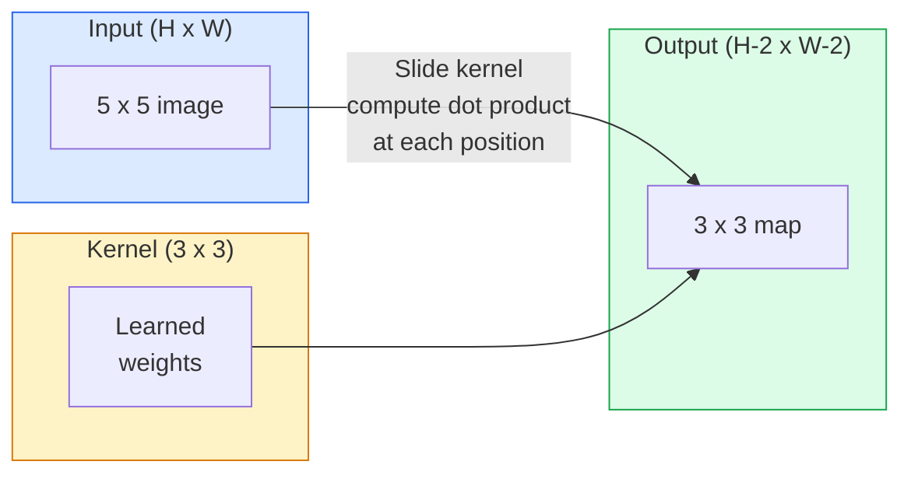
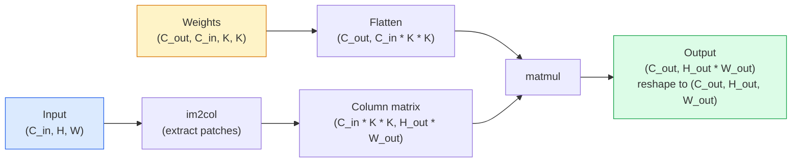

# Convolutions from Scratch

> A convolution is a tiny fully-connected layer that you slide across the image, sharing the same weights at every position.

**Type:** Build
**Languages:** Python
**Prerequisites:** Phase 3 (deep learning core), Phase 4 Lesson 01 (image fundamentals)
**Time:** ~75 minutes

## Learning Objectives

- Implement 2D convolution from scratch using only NumPy, both a nested-loop version and a vectorized `im2col` version
- Compute output spatial size for any combination of input size, kernel size, padding, and stride, and explain where `(H - K + 2P) / S + 1` comes from
- Hand-design kernels (edge, blur, sharpen, Sobel) and explain why each produces the activation pattern it does
- Stack convolutions into a feature extractor and connect stack depth to receptive field size

## The Problem

For a 224x224 RGB image, a fully-connected layer needs 224 * 224 * 3 = 150,528 input weights per neuron. A single 1,000-unit hidden layer is already 150 million parameters — and you have learned nothing useful yet. Worse, that layer has no idea that the dog in the top-left and the dog in the bottom-right are the same pattern. It treats every pixel position as independent, which is exactly wrong for images: shifting a cat by three pixels should not force the network to relearn the concept.

Image models need two properties: **translation equivariance** (output moves when input moves) and **parameter sharing** (the same feature detector runs everywhere). A fully-connected layer gives you neither. Convolution gives you both for free.

Convolution was not invented for deep learning. The same operation powers JPEG compression, Gaussian blur in Photoshop, edge detection in industrial vision, and every audio filter ever shipped. CNNs dominated ImageNet from 2012 to 2020 because for data where neighboring values are correlated and the same pattern can appear anywhere, convolution is the right prior.

## The Concept

### One Kernel, Sliding

A 2D convolution takes a small weight matrix called a kernel (or filter) and slides it over the input, computing the element-wise product sum at each position. That sum is one output pixel.



A concrete example of 3x3 convolution on a 5x5 input (no padding, stride 1):

```
Input X (5 x 5):                Kernel W (3 x 3):

  1  2  0  1  2                   1  0 -1
  0  1  3  1  0                   2  0 -2
  2  1  0  2  1                   1  0 -1
  1  0  2  1  3
  2  1  1  0  1

The kernel slides over every valid 3 x 3 window. Output Y is 3 x 3:

 Y[0,0] = sum( W * X[0:3, 0:3] )
 Y[0,1] = sum( W * X[0:3, 1:4] )
 Y[0,2] = sum( W * X[0:3, 2:5] )
 Y[1,0] = sum( W * X[1:4, 0:3] )
 ... and so on
```

That one formula — **shared weights, locality, sliding window** — is the entire idea. The rest is bookkeeping.

### Output Size Formula

Given input spatial size `H`, kernel size `K`, padding `P`, stride `S`:

```
H_out = floor( (H - K + 2P) / S ) + 1
```

Memorize it. You will compute it dozens of times per architecture design.

| Scenario | H | K | P | S | H_out |
|----------|---|---|---|---|-------|
| Valid convolution, no padding | 32 | 3 | 0 | 1 | 30 |
| Same convolution (preserve size) | 32 | 3 | 1 | 1 | 32 |
| Downsample 2x | 32 | 3 | 1 | 2 | 16 |
| 2x2 pooling | 32 | 2 | 0 | 2 | 16 |
| Large receptive field | 32 | 7 | 3 | 2 | 16 |

"Same padding" means choosing P so that H_out == H when S == 1. For odd K, that is P = (K - 1) / 2. This is why 3x3 kernels dominate — they are the smallest odd kernel that still has a center.

### Padding

Without padding, every convolution shrinks the feature map. Stack 20 and your 224x224 image becomes 184x184, wasting compute at the boundary and complicating residual connections that need matching shapes.

```
Zero padding (P = 1) on a 5 x 5 input:

  0  0  0  0  0  0  0
  0  1  2  0  1  2  0
  0  0  1  3  1  0  0
  0  2  1  0  2  1  0       Now the kernel can center on pixel (0, 0)
  0  1  0  2  1  3  0       and still have three rows and columns to multiply.
  0  2  1  1  0  1  0
  0  0  0  0  0  0  0
```

Patterns you encounter in practice: `zero` (most common), `reflect` (mirrors the edge, avoids hard boundaries in generative models), `replicate` (copies edge values), `circular` (wraps around, for toroidal problems).

### Stride

Stride is the step size of the slide. `stride=1` is the default. `stride=2` halves spatial dimensions — the classic way to downsample inside a CNN without a separate pooling layer. Every modern architecture (ResNet, ConvNeXt, MobileNet) uses strided convolutions somewhere in place of max-pool.

```
Stride 1 on a 5 x 5 input, 3 x 3 kernel:

  Start positions: (0,0) (0,1) (0,2)        -> output row 0
                   (1,0) (1,1) (1,2)        -> output row 1
                   (2,0) (2,1) (2,2)        -> output row 2

  Output: 3 x 3

Stride 2 on same input:

  Start positions: (0,0) (0,2)              -> output row 0
                   (2,0) (2,2)              -> output row 1

  Output: 2 x 2
```

### Multiple Input Channels

Real images have three channels. A 3x3 convolution on RGB input is actually a 3x3x3 volume: one 3x3 slice per input channel. At each spatial position, you multiply-and-sum across all three slices, then add a bias.

```
Input:   (C_in,  H,  W)        3 x 5 x 5
Kernel:  (C_in,  K,  K)        3 x 3 x 3 (one kernel)
Output:  (1,     H', W')       2D map

For a layer producing C_out output channels, you stack C_out kernels:

Weights: (C_out, C_in, K, K)   e.g. 64 x 3 x 3 x 3
Output:  (C_out, H', W')       64 x 3 x 3

Param count: C_out * C_in * K * K + C_out   (+ C_out for bias)
```

That last line is what you compute when planning a model. A 64-channel 3x3 conv on 3-channel input has `64 * 3 * 3 * 3 + 64 = 1,792` parameters. Cheap.

### The im2col Trick

Nested loops are readable but slow. GPUs want large matrix multiplies. The trick: flatten each receptive-field window of the input into a column of a large matrix, flatten the kernel into a row, and the entire convolution becomes a single matmul.



Every production convolution implementation is some variant of this plus cache-tiling tricks (direct conv, Winograd, FFT conv for large kernels). Understanding im2col gives you the core.

### Receptive Field

One 3x3 convolution sees 9 input pixels. Stack two 3x3 convolutions and a neuron in the second layer sees 5x5 input pixels. Three 3x3 convolutions give 7x7. In general:

```
RF after L stacked K x K convolutions (stride 1) = 1 + L * (K - 1)

With stride:   RF grows multiplicatively along each layer with stride.
```

The entire reason "3x3 all the way down" (VGG, ResNet, ConvNeXt) works is that two 3x3 convolutions see the same input area as one 5x5, with fewer parameters and an extra nonlinearity in between.

## Build It

### Step 1: Pad an array

Start from the smallest primitive: a function that adds zeros around an H x W array.

```python
import numpy as np

def pad2d(x, p):
    if p == 0:
        return x
    h, w = x.shape[-2:]
    out = np.zeros(x.shape[:-2] + (h + 2 * p, w + 2 * p), dtype=x.dtype)
    out[..., p:p + h, p:p + w] = x
    return out

x = np.arange(9).reshape(3, 3)
print(x)
print()
print(pad2d(x, 1))
```

The trailing-axis trick `x.shape[:-2]` means the same function works on `(H, W)`, `(C, H, W)`, or `(N, C, H, W)` without modification.

### Step 2: 2D convolution with nested loops

Reference implementation — slow but unambiguous. This is what `torch.nn.functional.conv2d` does in principle.

```python
def conv2d_naive(x, w, b=None, stride=1, padding=0):
    c_in, h, w_in = x.shape
    c_out, c_in_w, kh, kw = w.shape
    assert c_in == c_in_w

    x_pad = pad2d(x, padding)
    h_out = (h + 2 * padding - kh) // stride + 1
    w_out = (w_in + 2 * padding - kw) // stride + 1

    out = np.zeros((c_out, h_out, w_out), dtype=np.float32)
    for oc in range(c_out):
        for i in range(h_out):
            for j in range(w_out):
                hs = i * stride
                ws = j * stride
                patch = x_pad[:, hs:hs + kh, ws:ws + kw]
                out[oc, i, j] = np.sum(patch * w[oc])
        if b is not None:
            out[oc] += b[oc]
    return out
```

Four nested loops (output channel, row, column, plus the implicit summation over C_in, kh, kw). This is the ground truth you verify every faster implementation against.

### Step 3: Verify with hand-designed kernels

Construct a vertical Sobel kernel, apply it to a synthetic step image, and watch vertical edges light up.

```python
def synthetic_step_image():
    img = np.zeros((1, 16, 16), dtype=np.float32)
    img[:, :, 8:] = 1.0
    return img

sobel_x = np.array([
    [[-1, 0, 1],
     [-2, 0, 2],
     [-1, 0, 1]]
], dtype=np.float32)[None]

x = synthetic_step_image()
y = conv2d_naive(x, sobel_x, padding=1)
print(y[0].round(1))
```

Column 7 (the left-to-right brightness transition) should show large positive values, with zeros everywhere else. That single print is the sanity check that proves the math is correct.

### Step 4: im2col

Convert each kernel-sized window of the input into a column of a matrix. For `C_in=3, K=3`, each column is 27 numbers.

```python
def im2col(x, kh, kw, stride=1, padding=0):
    c_in, h, w = x.shape
    x_pad = pad2d(x, padding)
    h_out = (h + 2 * padding - kh) // stride + 1
    w_out = (w + 2 * padding - kw) // stride + 1

    cols = np.zeros((c_in * kh * kw, h_out * w_out), dtype=x.dtype)
    col = 0
    for i in range(h_out):
        for j in range(w_out):
            hs = i * stride
            ws = j * stride
            patch = x_pad[:, hs:hs + kh, ws:ws + kw]
            cols[:, col] = patch.reshape(-1)
            col += 1
    return cols, h_out, w_out
```

This is still a Python loop, but the heavy lifting now falls to a single vectorized matmul.

### Step 5: Fast convolution via im2col + matmul

Replace the four nested loops with one matrix multiplication.

```python
def conv2d_im2col(x, w, b=None, stride=1, padding=0):
    c_out, c_in, kh, kw = w.shape
    cols, h_out, w_out = im2col(x, kh, kw, stride, padding)
    w_flat = w.reshape(c_out, -1)
    out = w_flat @ cols
    if b is not None:
        out += b[:, None]
    return out.reshape(c_out, h_out, w_out)
```

Correctness check: run both implementations and compare.

```python
rng = np.random.default_rng(0)
x = rng.normal(0, 1, (3, 16, 16)).astype(np.float32)
w = rng.normal(0, 1, (8, 3, 3, 3)).astype(np.float32)
b = rng.normal(0, 1, (8,)).astype(np.float32)

y_naive = conv2d_naive(x, w, b, padding=1)
y_im2col = conv2d_im2col(x, w, b, padding=1)

print(f"max abs diff: {np.max(np.abs(y_naive - y_im2col)):.2e}")
```

`max abs diff` should be around `1e-5` — the difference comes from floating-point accumulation order, not bugs.

### Step 6: A gallery of hand-designed kernels

Five filters showing what a convolutional layer can express before any training.

```python
KERNELS = {
    "identity": np.array([[0, 0, 0], [0, 1, 0], [0, 0, 0]], dtype=np.float32),
    "blur_3x3": np.ones((3, 3), dtype=np.float32) / 9.0,
    "sharpen": np.array([[0, -1, 0], [-1, 5, -1], [0, -1, 0]], dtype=np.float32),
    "sobel_x": np.array([[-1, 0, 1], [-2, 0, 2], [-1, 0, 1]], dtype=np.float32),
    "sobel_y": np.array([[-1, -2, -1], [0, 0, 0], [1, 2, 1]], dtype=np.float32),
}

def apply_kernel(img2d, kernel):
    x = img2d[None].astype(np.float32)
    w = kernel[None, None]
    return conv2d_im2col(x, w, padding=1)[0]
```

Applied to any grayscale image: blur softens it, sharpen crisps edges, Sobel-x lights up vertical edges, Sobel-y lights up horizontal edges. These are exactly the patterns the *first* trained conv layer in AlexNet and VGG ends up learning — because a good image model needs edge and blob detectors regardless of the downstream task.

## Use It

PyTorch's `nn.Conv2d` wraps the same operation with autograd, CUDA kernels, and cuDNN optimization. The shape semantics are identical.

```python
import torch
import torch.nn as nn

conv = nn.Conv2d(in_channels=3, out_channels=64, kernel_size=3, stride=1, padding=1)
print(conv)
print(f"weight shape: {tuple(conv.weight.shape)}   # (C_out, C_in, K, K)")
print(f"bias shape:   {tuple(conv.bias.shape)}")
print(f"param count:  {sum(p.numel() for p in conv.parameters())}")

x = torch.randn(8, 3, 224, 224)
y = conv(x)
print(f"\ninput  shape: {tuple(x.shape)}")
print(f"output shape: {tuple(y.shape)}")
```

Change `padding=1` to `padding=0` and the output drops to 222x222. Change `stride=1` to `stride=2` and it drops to 112x112. Same formula you memorized above.

## Ship It

This lesson produces:

- `outputs/prompt-cnn-architect.md` — a prompt that, given input size, parameter budget, and target receptive field, designs a stack of `Conv2d` layers with correct K/S/P at each step.
- `outputs/skill-conv-shape-calculator.md` — a skill that walks a network spec layer-by-layer and returns output shape, receptive field, and param count per block.

## Exercises

1. **(Easy)** Given a 128x128 grayscale input and a stack `[Conv3x3(s=1,p=1), Conv3x3(s=2,p=1), Conv3x3(s=1,p=1), Conv3x3(s=2,p=1)]`, hand-compute output spatial size and receptive field at each layer. Verify with a PyTorch `nn.Sequential` of placeholder convolutions.
2. **(Medium)** Extend `conv2d_naive` and `conv2d_im2col` to accept a `groups` parameter. Prove that `groups=C_in=C_out` reproduces depthwise convolution with parameter count `C * K * K` instead of `C * C * K * K`.
3. **(Hard)** Hand-write the backward pass of `conv2d_im2col`: given the gradient of the output, compute gradients for `x` and `w`. Verify against `torch.autograd.grad` on the same inputs and weights. The trick: the gradient of im2col is `col2im`, which must accumulate overlapping windows.

## Key Terms

| Term | How people say it | What it actually is |
|------|-------------------|---------------------|
| Convolution | "sliding a filter" | A learnable dot product with shared weights at every spatial position; mathematically cross-correlation, but everyone calls it convolution |
| Kernel / Filter | "feature detector" | A small (C_in, K, K) weight tensor whose dot product with an input window produces one output pixel |
| Stride | "how far you jump" | Step size between adjacent kernel positions; stride 2 halves each spatial dimension |
| Padding | "zeros at the edge" | Extra values added around the input so the kernel can center on boundary pixels; `same` padding keeps output size equal to input size |
| Receptive field | "how much the neuron sees" | The patch of original input an output activation depends on, growing with depth and stride |
| im2col | "the GEMM trick" | Rearranging each receptive window into a column so convolution becomes a single large matrix multiply — the core of every fast convolution kernel |
| Depthwise convolution | "one kernel per channel" | Convolution with `groups == C_in`, where each output channel computes from only its corresponding input channel; the backbone of MobileNet and ConvNeXt |
| Translation equivariance | "shift in, shift out" | The property that shifting input by k pixels shifts output by k pixels; weight sharing gives it to you for free |

## Further Reading

- [A guide to convolution arithmetic for deep learning (Dumoulin & Visin, 2016)](https://arxiv.org/abs/1603.07285) — the authoritative diagrams for padding/stride/dilation that every course quietly copies
- [CS231n: Convolutional Neural Networks for Visual Recognition](https://cs231n.github.io/convolutional-networks/) — the classic lecture notes including the original im2col explanation
- [The Annotated ConvNet (fast.ai)](https://nbviewer.org/github/fastai/fastbook/blob/master/13_convolutions.ipynb) — a notebook going from manual convolution all the way to a trained digit classifier
- [Receptive Field Arithmetic for CNNs (Dang Ha The Hien)](https://distill.pub/2019/computing-receptive-fields/) — publication-quality interactive explanation of receptive field computation
