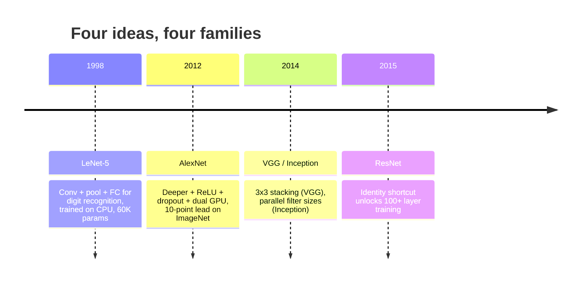
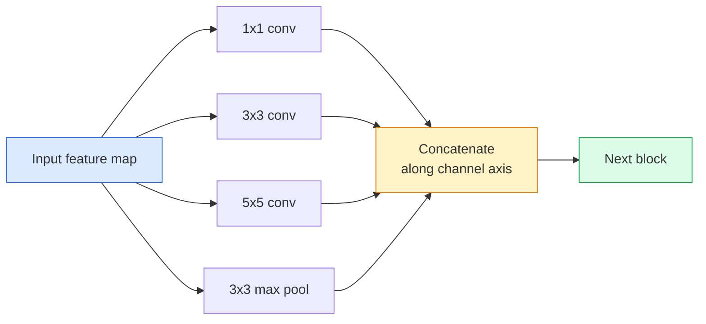
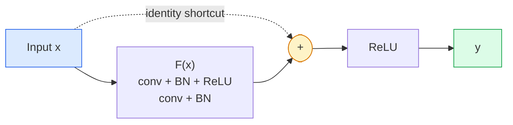

# CNNs — From LeNet to ResNet

> Every mainstream CNN of the past three decades is the same "conv–nonlinearity–downsample" recipe, with one new idea bolted on. Learn those ideas in order.

**Type:** Learn + Build
**Languages:** Python
**Prerequisites:** Phase 3 Lesson 11 (PyTorch), Phase 4 Lesson 01 (image fundamentals), Phase 4 Lesson 02 (convolutions from scratch)
**Time:** ~75 minutes

## Learning Objectives

- Trace the architecture lineage LeNet-5 -> AlexNet -> VGG -> Inception -> ResNet and name the single new idea each family contributed
- Implement LeNet-5, a VGG-style block, and a ResNet BasicBlock in PyTorch, each in under 40 lines
- Explain why residual connections turn a 1,000-layer network from untrainable into state-of-the-art
- Read a modern backbone (ResNet-18, ResNet-50) and predict its output shapes, receptive field, and parameter count before looking at the source

## The Problem

In 2011, the best ImageNet classifier hit about 74% top-5 accuracy. In 2012, AlexNet reached 85%. In 2015, ResNet reached 96%. No new data, no next-generation GPUs. The gains came from architectural ideas. A working vision engineer must know which idea came from which paper, because every production backbone you ship in 2026 is a recombination of those same components — and the ideas keep migrating: grouped convolutions moved from CNNs into transformers, residual connections moved from ResNet into every LLM on earth, batch normalization lives inside diffusion models.

Studying these networks in order also immunizes you against a common mistake: reaching for the largest model available when a LeNet-sized network would solve the problem. MNIST does not need ResNet. Knowing each family's scaling curve tells you where on the curve you should sit.

## The Concept

### Four Ideas That Changed Vision



Nothing else in classical vision matters more than these four jumps.

### LeNet-5 (1998)

Yann LeCun's digit recognizer. 60K parameters. Two conv-pool blocks, two FC layers, tanh activations. It defined the template every CNN inherits:

```
input (1, 32, 32)
  conv 5x5 -> (6, 28, 28)
  avg pool 2x2 -> (6, 14, 14)
  conv 5x5 -> (16, 10, 10)
  avg pool 2x2 -> (16, 5, 5)
  flatten -> 400
  dense -> 120
  dense -> 84
  dense -> 10
```

Everything the modern world calls a CNN — alternating convolution and downsampling, feeding into a small classification head — is LeNet with more layers, wider channels, and better activations.

### AlexNet (2012)

Three changes together cracked ImageNet:

1. **ReLU** replacing tanh. Gradients stop vanishing. Training is 6x faster.
2. **Dropout** in the FC head. Regularization becomes a layer, not a trick.
3. **Depth and width**. Five conv layers, three FC layers, 60M parameters, trained on two GPUs with the model split across cards.

The paper's Figure 2 still draws the GPU split as two parallel streams. That parallelism was a hardware workaround, not an architectural insight — but the three ideas above live in every model you use.

### VGG (2014)

VGG asked: what if you use only 3x3 convolutions and go deep?

```
Block:    conv 3x3 -> conv 3x3 -> pool 2x2
Repeat:   16 or 19 conv layers
```

Two 3x3 convolutions see the same 5x5 input area as one 5x5 conv, with fewer parameters (2*9*C^2 = 18C^2 vs. 25*C^2) and an extra ReLU in between. VGG turned this observation into an entire architecture. Its simplicity — one block type, repeated — made it the reference point for everything that followed.

Cost: 138M parameters, slow to train, expensive to infer.

### Inception (2014, same year)

Google's answer to "what kernel size should I use" was: all of them, in parallel.



Each branch specializes — 1x1 for channel mixing, 3x3 for local texture, 5x5 for larger patterns, pooling for shift-invariant features — and concatenation lets the next layer pick which branch was useful. Inception v1 uses 1x1 convolutions as bottlenecks inside each branch to keep parameter count reasonable.

### The Degradation Problem

By 2015, VGG-19 worked but VGG-32 did not. Depth should help, but past ~20 layers both training loss and test loss got worse. This is not overfitting. The optimizer cannot find useful weights because gradients shrink multiplicatively through each layer.

```
Naive deep network:
  y = f_L( f_{L-1}( ... f_1(x) ... ) )

Gradient to early layers:
  dL/dW_1 = dL/dy * df_L/df_{L-1} * ... * df_2/df_1 * df_1/dW_1

Each multiplicative term is on the order of (weight magnitude) * (activation gain).
Stack 100 of these with gain < 1 and the gradient is effectively zero.
```

VGG survived at 19 layers because batch normalization (published concurrently) kept activations well-scaled. But even BN could not rescue depths beyond roughly 30 layers.

### ResNet (2015)

He, Zhang, Ren, and Sun proposed one change that fixed everything:

```
Standard block:   y = F(x)
Residual block:   y = F(x) + x
```

That `+ x` means the layer can always choose to "do nothing" by driving `F(x)` to zero. A 1,000-layer ResNet is now at worst as good as a 1-layer network, because each extra block has an easy escape hatch. With that guarantee, the optimizer is willing to let each block be *slightly* useful — and slightly useful, stacked 100 times, is state-of-the-art.



Two variants of this block appear everywhere:

- **BasicBlock** (ResNet-18, ResNet-34): two 3x3 convolutions, skip across both.
- **Bottleneck** (ResNet-50, -101, -152): 1x1 reduce, 3x3 middle, 1x1 expand, skip across all three. Cheaper at high channel counts.

When the shortcut must cross a downsample (stride=2), the identity path is replaced by a 1x1 stride=2 convolution to match shapes.

### Why Residuals Matter Beyond Vision

The idea is not really about image classification. It is about turning deep networks from "pray that gradients survive" into a reliable, scalable engineering tool. Every transformer you will read in the next phase has the exact same skip connection in every block. No ResNet, no GPT.

## Build It

### Step 1: LeNet-5

A minimal, faithful LeNet. Tanh activations, average pooling. The only modern concession is that we use `nn.CrossEntropyLoss` downstream rather than the original Gaussian connections.

```python
import torch
import torch.nn as nn
import torch.nn.functional as F

class LeNet5(nn.Module):
    def __init__(self, num_classes=10):
        super().__init__()
        self.conv1 = nn.Conv2d(1, 6, kernel_size=5)
        self.conv2 = nn.Conv2d(6, 16, kernel_size=5)
        self.pool = nn.AvgPool2d(2)
        self.fc1 = nn.Linear(16 * 5 * 5, 120)
        self.fc2 = nn.Linear(120, 84)
        self.fc3 = nn.Linear(84, num_classes)

    def forward(self, x):
        x = self.pool(torch.tanh(self.conv1(x)))
        x = self.pool(torch.tanh(self.conv2(x)))
        x = torch.flatten(x, 1)
        x = torch.tanh(self.fc1(x))
        x = torch.tanh(self.fc2(x))
        return self.fc3(x)

net = LeNet5()
x = torch.randn(1, 1, 32, 32)
print(f"output: {net(x).shape}")
print(f"params: {sum(p.numel() for p in net.parameters()):,}")
```

Expected output: `output: torch.Size([1, 10])`, `params: 61,706`. This is the entire digit classifier that started modern vision.

### Step 2: A VGG block

A reusable block: two 3x3 convolutions, ReLU, batch norm, max pool.

```python
class VGGBlock(nn.Module):
    def __init__(self, in_c, out_c):
        super().__init__()
        self.conv1 = nn.Conv2d(in_c, out_c, kernel_size=3, padding=1)
        self.bn1 = nn.BatchNorm2d(out_c)
        self.conv2 = nn.Conv2d(out_c, out_c, kernel_size=3, padding=1)
        self.bn2 = nn.BatchNorm2d(out_c)
        self.pool = nn.MaxPool2d(2)

    def forward(self, x):
        x = F.relu(self.bn1(self.conv1(x)))
        x = F.relu(self.bn2(self.conv2(x)))
        return self.pool(x)

class MiniVGG(nn.Module):
    def __init__(self, num_classes=10):
        super().__init__()
        self.stack = nn.Sequential(
            VGGBlock(3, 32),
            VGGBlock(32, 64),
            VGGBlock(64, 128),
        )
        self.head = nn.Sequential(
            nn.AdaptiveAvgPool2d(1),
            nn.Flatten(),
            nn.Linear(128, num_classes),
        )

    def forward(self, x):
        return self.head(self.stack(x))

net = MiniVGG()
x = torch.randn(1, 3, 32, 32)
print(f"output: {net(x).shape}")
print(f"params: {sum(p.numel() for p in net.parameters()):,}")
```

Three VGG blocks on CIFAR-sized input, one adaptive pool, one linear layer. ~290K parameters. More than enough for CIFAR-10.

### Step 3: A ResNet BasicBlock

The core building block of ResNet-18 and ResNet-34.

```python
class BasicBlock(nn.Module):
    def __init__(self, in_c, out_c, stride=1):
        super().__init__()
        self.conv1 = nn.Conv2d(in_c, out_c, kernel_size=3, stride=stride, padding=1, bias=False)
        self.bn1 = nn.BatchNorm2d(out_c)
        self.conv2 = nn.Conv2d(out_c, out_c, kernel_size=3, stride=1, padding=1, bias=False)
        self.bn2 = nn.BatchNorm2d(out_c)
        if stride != 1 or in_c != out_c:
            self.shortcut = nn.Sequential(
                nn.Conv2d(in_c, out_c, kernel_size=1, stride=stride, bias=False),
                nn.BatchNorm2d(out_c),
            )
        else:
            self.shortcut = nn.Identity()

    def forward(self, x):
        out = F.relu(self.bn1(self.conv1(x)))
        out = self.bn2(self.conv2(out))
        out = out + self.shortcut(x)
        return F.relu(out)
```

`bias=False` on conv layers is the batch norm convention — BN's beta parameter already handles the bias, so a separate conv bias is waste. The `shortcut` only needs a real convolution when stride or channel count changes; otherwise it is an identity no-op.

### Step 4: A mini ResNet

Stack four groups of BasicBlocks for a working CIFAR-sized ResNet.

```python
class TinyResNet(nn.Module):
    def __init__(self, num_classes=10):
        super().__init__()
        self.stem = nn.Sequential(
            nn.Conv2d(3, 32, kernel_size=3, stride=1, padding=1, bias=False),
            nn.BatchNorm2d(32),
            nn.ReLU(inplace=True),
        )
        self.layer1 = self._make_group(32, 32, num_blocks=2, stride=1)
        self.layer2 = self._make_group(32, 64, num_blocks=2, stride=2)
        self.layer3 = self._make_group(64, 128, num_blocks=2, stride=2)
        self.layer4 = self._make_group(128, 256, num_blocks=2, stride=2)
        self.head = nn.Sequential(
            nn.AdaptiveAvgPool2d(1),
            nn.Flatten(),
            nn.Linear(256, num_classes),
        )

    def _make_group(self, in_c, out_c, num_blocks, stride):
        blocks = [BasicBlock(in_c, out_c, stride=stride)]
        for _ in range(num_blocks - 1):
            blocks.append(BasicBlock(out_c, out_c, stride=1))
        return nn.Sequential(*blocks)

    def forward(self, x):
        x = self.stem(x)
        x = self.layer1(x)
        x = self.layer2(x)
        x = self.layer3(x)
        x = self.layer4(x)
        return self.head(x)

net = TinyResNet()
x = torch.randn(1, 3, 32, 32)
print(f"output: {net(x).shape}")
print(f"params: {sum(p.numel() for p in net.parameters()):,}")
```

Four groups, two blocks each. Groups 2, 3, 4 start with stride 2. Channels double at each downsample. ~2.8M parameters. This is the standard recipe that scales cleanly up to ResNet-152.

### Step 5: Compare parameter-to-feature efficiency

Run the same input through all three networks and compare parameter counts.

```python
def summary(name, net, x):
    y = net(x)
    params = sum(p.numel() for p in net.parameters())
    print(f"{name:12s}  input {tuple(x.shape)} -> output {tuple(y.shape)}  params {params:>10,}")

x = torch.randn(1, 3, 32, 32)
summary("LeNet5",     LeNet5(),       torch.randn(1, 1, 32, 32))
summary("MiniVGG",    MiniVGG(),      x)
summary("TinyResNet", TinyResNet(),   x)
```

Three models, three eras, three orders of magnitude in parameter count. After a few epochs of training on CIFAR-10, accuracy is roughly: LeNet 60%, MiniVGG 89%, TinyResNet 93%.

## Use It

`torchvision.models` gives you pretrained versions of all of the above. The calling convention is identical across families, which is the entire point of the backbone abstraction.

```python
from torchvision.models import resnet18, ResNet18_Weights, vgg16, VGG16_Weights

r18 = resnet18(weights=ResNet18_Weights.IMAGENET1K_V1)
r18.eval()

print(f"ResNet-18 params: {sum(p.numel() for p in r18.parameters()):,}")
print(r18.layer1[0])
print()

v16 = vgg16(weights=VGG16_Weights.IMAGENET1K_V1)
v16.eval()
print(f"VGG-16   params: {sum(p.numel() for p in v16.parameters()):,}")
```

ResNet-18 has 11.7M parameters. VGG-16 has 138M. ImageNet top-1 accuracy is similar (69.8% vs. 71.6%). Residual connections buy you 12x parameter efficiency. This is why ResNet variants dominated from 2016 until ViT appeared in 2021 — and still dominate in real deployments where compute is the constraint.

For transfer learning, the recipe is always the same: load pretrained, freeze backbone, replace the classification head.

```python
for p in r18.parameters():
    p.requires_grad = False
r18.fc = nn.Linear(r18.fc.in_features, 10)
```

Three lines. You now have a 10-class CIFAR classifier that inherits the representation ImageNet paid for.

## Ship It

This lesson produces:

- `outputs/prompt-backbone-selector.md` — a prompt that, given a task, dataset size, and compute budget, picks the appropriate CNN family (LeNet/VGG/ResNet/MobileNet/ConvNeXt).
- `outputs/skill-residual-block-reviewer.md` — a skill that reads a PyTorch module and flags skip-connection errors (missing shortcut on stride change, activation ordering in shortcut, BN placement relative to addition).

## Exercises

1. **(Easy)** Hand-compute per-layer parameter counts for `TinyResNet`. Compare against `sum(p.numel() for p in net.parameters())`. Where does the bulk of the parameter budget go — convolutions, BN, or the classification head?
2. **(Medium)** Implement the Bottleneck block (1x1 -> 3x3 -> 1x1 with skip) and build a ResNet-50-style network for CIFAR. Compare parameter count against `TinyResNet`.
3. **(Hard)** Remove the skip connection from `BasicBlock` and train both a 34-block "plain" network and a 34-block ResNet on CIFAR-10 for 10 epochs each. Plot training loss vs. epoch for both. Reproduce the result from He et al. Figure 1: the plain deep network converges to a higher loss than its shallower twin.

## Key Terms

| Term | How people say it | What it actually is |
|------|-------------------|---------------------|
| Backbone | "the model" | The stack of conv blocks that produces feature maps fed to a task head |
| Residual connection | "skip connection" | `y = F(x) + x`; lets the optimizer learn identity by setting F to zero, making arbitrary depth trainable |
| BasicBlock | "two 3x3 convs with a skip" | The building block of ResNet-18/34: conv-BN-ReLU-conv-BN-add-ReLU |
| Bottleneck | "1x1 down, 3x3, 1x1 up" | The ResNet-50/101/152 block; cheaper at high channel counts because the 3x3 runs on reduced width |
| Degradation problem | "deeper is worse" | Beyond ~20 plain conv layers, both train and test error increase; solved by residual connections, not more data |
| Stem | "the first layer" | The initial conv that converts 3-channel input to the base feature width; typically 7x7 stride 2 on ImageNet, 3x3 stride 1 on CIFAR |
| Head | "the classifier" | The layers after the last backbone block: adaptive pool, flatten, linear |
| Transfer learning | "pretrained weights" | Loading a backbone trained on ImageNet and fine-tuning only the head on your task |

## Further Reading

- [Deep Residual Learning for Image Recognition (He et al., 2015)](https://arxiv.org/abs/1512.03385) — the ResNet paper; every figure is worth studying
- [Very Deep Convolutional Networks (Simonyan & Zisserman, 2014)](https://arxiv.org/abs/1409.1556) — the VGG paper; still the best reference for "why 3x3"
- [ImageNet Classification with Deep CNNs (Krizhevsky et al., 2012)](https://papers.nips.cc/paper_files/paper/2012/hash/c399862d3b9d6b76c8436e924a68c45b-Abstract.html) — AlexNet; the paper that ended the era of hand-crafted features
- [Going Deeper with Convolutions (Szegedy et al., 2014)](https://arxiv.org/abs/1409.4842) — Inception v1; the parallel-filter idea that still appears in vision transformers
