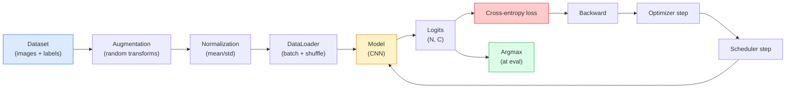

# Image Classification

> A classifier is a function from pixels to a probability distribution over classes. Everything else is plumbing.

**Type:** Build
**Languages:** Python
**Prerequisites:** Phase 2 Lesson 09 (model evaluation), Phase 3 Lesson 10 (mini-framework), Phase 4 Lesson 03 (CNNs)
**Time:** ~75 minutes

## Learning Objectives

- Build an end-to-end image classification pipeline on CIFAR-10: dataset, augmentation, model, training loop, evaluation
- Explain the role of each component (dataloader, loss, optimizer, scheduler, augmentation) and predict how breaking any one of them shows up in the loss curve
- Implement mixup, cutout, and label smoothing from scratch, and explain when each is worth adding
- Read a confusion matrix and per-class precision/recall table, diagnosing dataset and model failures beyond aggregate accuracy

## The Problem

Every vision task that ships to production reduces to image classification at some level. Detection classifies regions. Segmentation classifies pixels. Retrieval ranks by similarity to class centroids. Getting classification right — data loop, augmentation strategy, loss, evaluation — is a craft that transfers to every other task in this phase.

Most classification bugs are not in the model. They live in the pipeline: broken normalization, unshuffled training set, augmentation that distorts labels, a validation split contaminated by training data, a learning rate that quietly diverges after epoch 30. A CNN that reaches 93% on CIFAR-10 with correct configuration often scores only 70-75% with a broken one, and the loss curve looks plausible the entire time.

This lesson wires the entire pipeline by hand so every part is inspectable. You will not use anything from `torchvision.datasets` that could hide a bug.

## The Concept

### The Classification Pipeline



Every line in this loop can harbor a bug. Cross-entropy takes raw logits, not softmax outputs, so any `model(x).softmax()` before the loss silently computes wrong gradients. Augmentation applies to inputs only, not to labels — except mixup, which blends both. `optimizer.zero_grad()` must happen every step; missing it accumulates gradients, mimicking a wildly unstable learning rate. Each of these bugs flattens the learning curve without raising an error.

### Cross-Entropy, Logits, and Softmax

A classifier produces `C` numbers per image, called logits. Applying softmax converts them to a probability distribution:

```
softmax(z)_i = exp(z_i) / sum_j exp(z_j)
```

Cross-entropy measures the negative log probability of the correct class:

```
CE(z, y) = -log( softmax(z)_y )
        = -z_y + log( sum_j exp(z_j) )
```

The right-hand form is the numerically stable version (log-sum-exp). PyTorch's `nn.CrossEntropyLoss` fuses softmax + NLL into a single op that takes raw logits. Applying softmax yourself first is almost always a bug — you compute log(softmax(softmax(z))), a meaningless quantity.

### Why Augmentation Works

CNNs have inductive bias for translation (from weight sharing) but no built-in invariance to cropping, flipping, color jitter, or occlusion. The only way to teach these invariances is to show pixels that exercise them. Each random transform at training time says: "these two images share a label; learn features that ignore the difference."

```
Original crop:   "dog facing left"
Flip:            "dog facing right"              <- same label, different pixels
Rotate(+15):     "dog, slightly tilted"
Color jitter:    "dog in warm light"
RandomErasing:   "dog with a chunk missing"
```

Rule: augmentation must preserve the label. Applying cutout and rotation to a digit can turn "6" into "9"; for such datasets you use smaller rotation ranges and pick augmentations that respect digit-specific invariances.

### Mixup and Cutmix

Standard augmentation transforms pixels but keeps labels one-hot. **Mixup** and **cutmix** break this by interpolating both.

```
Mixup:
  lambda ~ Beta(a, a)
  x = lambda * x_i + (1 - lambda) * x_j
  y = lambda * y_i + (1 - lambda) * y_j

Cutmix:
  Paste a random rectangle from x_j into x_i
  y = area-weighted blend of y_i and y_j
```

Why it helps: the model no longer memorizes sharp one-hot targets, but learns to interpolate between classes. Training loss goes up, test accuracy goes up. It is the cheapest robustness upgrade for any classifier.

### Label Smoothing

Mixup's cousin. Instead of training against `[0, 0, 1, 0, 0]`, train against `[eps/C, eps/C, 1-eps, eps/C, eps/C]` with a small `eps` like 0.1. It prevents the model from producing arbitrarily sharp logits and improves calibration at nearly zero cost. Built into `nn.CrossEntropyLoss(label_smoothing=0.1)` since PyTorch 1.10.

### Evaluation Beyond Accuracy

Aggregate accuracy masks imbalance. A 90-10 binary classifier predicting the majority class always gets 90%. The tools that actually tell you what is happening:

- **Per-class accuracy** — one number per class; instantly exposes underperforming classes.
- **Confusion matrix** — C x C grid where row i, column j = count of true class i predicted as class j; diagonal is correct, off-diagonal is where your model actually lives.
- **Top-1 / Top-5** — whether the correct class is in the top 1 or top 5 predictions; Top-5 matters for ImageNet because classes like "Norwich terrier" and "Norfolk terrier" are genuinely ambiguous.
- **Calibration (ECE)** — does a 0.8-confidence prediction actually come true 80% of the time? Modern networks are systematically overconfident; fix with temperature scaling or label smoothing.

## Build It

### Step 1: A deterministic synthetic dataset

CIFAR-10 lives on disk. For reproducibility and speed, we create a synthetic dataset that looks like CIFAR — 32x32 RGB images with class-specific structure the model must learn. The exact same pipeline runs on real CIFAR-10 unchanged.

```python
import numpy as np
import torch
from torch.utils.data import Dataset


def synthetic_cifar(num_per_class=1000, num_classes=10, seed=0):
    rng = np.random.default_rng(seed)
    X = []
    Y = []
    for c in range(num_classes):
        centre = rng.uniform(0, 1, (3,))
        freq = 2 + c
        for _ in range(num_per_class):
            yy, xx = np.meshgrid(np.linspace(0, 1, 32), np.linspace(0, 1, 32), indexing="ij")
            r = np.sin(xx * freq) * 0.5 + centre[0]
            g = np.cos(yy * freq) * 0.5 + centre[1]
            b = (xx + yy) * 0.5 * centre[2]
            img = np.stack([r, g, b], axis=-1)
            img += rng.normal(0, 0.08, img.shape)
            img = np.clip(img, 0, 1)
            X.append(img.astype(np.float32))
            Y.append(c)
    X = np.stack(X)
    Y = np.array(Y)
    idx = rng.permutation(len(X))
    return X[idx], Y[idx]


class ArrayDataset(Dataset):
    def __init__(self, X, Y, transform=None):
        self.X = X
        self.Y = Y
        self.transform = transform

    def __len__(self):
        return len(self.X)

    def __getitem__(self, i):
        img = self.X[i]
        if self.transform is not None:
            img = self.transform(img)
        img = torch.from_numpy(img).permute(2, 0, 1)
        return img, int(self.Y[i])
```

Each class has its own palette and frequency pattern, plus Gaussian noise, forcing the model to learn signal rather than memorize pixels. Ten classes, one thousand images each, shuffled.

### Step 2: Normalization and augmentation

The two transforms present in every vision pipeline.

```python
def standardize(mean, std):
    mean = np.array(mean, dtype=np.float32)
    std = np.array(std, dtype=np.float32)
    def _fn(img):
        return (img - mean) / std
    return _fn


def random_hflip(p=0.5):
    def _fn(img):
        if np.random.random() < p:
            return img[:, ::-1, :].copy()
        return img
    return _fn


def random_crop(pad=4):
    def _fn(img):
        h, w = img.shape[:2]
        padded = np.pad(img, ((pad, pad), (pad, pad), (0, 0)), mode="reflect")
        y = np.random.randint(0, 2 * pad)
        x = np.random.randint(0, 2 * pad)
        return padded[y:y + h, x:x + w, :]
    return _fn


def compose(*fns):
    def _fn(img):
        for fn in fns:
            img = fn(img)
        return img
    return _fn
```

Reflect-pad before cropping, not zero-pad, because black borders are a signal the model learns to ignore in a useless way.

### Step 3: Mixup

Blend two images and two labels inside the training step. Implemented as a batch transform placed right before the forward pass rather than in the dataset.

```python
def mixup_batch(x, y, num_classes, alpha=0.2):
    if alpha <= 0:
        return x, torch.nn.functional.one_hot(y, num_classes).float()
    lam = float(np.random.beta(alpha, alpha))
    idx = torch.randperm(x.size(0), device=x.device)
    x_mixed = lam * x + (1 - lam) * x[idx]
    y_onehot = torch.nn.functional.one_hot(y, num_classes).float()
    y_mixed = lam * y_onehot + (1 - lam) * y_onehot[idx]
    return x_mixed, y_mixed


def soft_cross_entropy(logits, soft_targets):
    log_probs = torch.log_softmax(logits, dim=-1)
    return -(soft_targets * log_probs).sum(dim=-1).mean()
```

`soft_cross_entropy` is cross-entropy against a soft label distribution. When targets happen to be one-hot, it degenerates to the standard case.

### Step 4: Training loop

The full recipe: iterate over data, compute one gradient per batch, step the scheduler once per epoch.

```python
import torch
import torch.nn as nn
from torch.utils.data import DataLoader
from torch.optim import SGD
from torch.optim.lr_scheduler import CosineAnnealingLR

def train_one_epoch(model, loader, optimizer, device, num_classes, use_mixup=True):
    model.train()
    total, correct, loss_sum = 0, 0, 0.0
    for x, y in loader:
        x, y = x.to(device), y.to(device)
        if use_mixup:
            x_m, y_soft = mixup_batch(x, y, num_classes)
            logits = model(x_m)
            loss = soft_cross_entropy(logits, y_soft)
        else:
            logits = model(x)
            loss = nn.functional.cross_entropy(logits, y, label_smoothing=0.1)
        optimizer.zero_grad()
        loss.backward()
        optimizer.step()
        loss_sum += loss.item() * x.size(0)
        total += x.size(0)
        # With mixup on, training accuracy computed against unmixed labels `y`
        # is only an approximation (the model sees soft targets, not y).
        # Treat it as a rough progress signal; real performance comes from
        # validation accuracy.
        with torch.no_grad():
            pred = logits.argmax(dim=-1)
            correct += (pred == y).sum().item()
    return loss_sum / total, correct / total


@torch.no_grad()
def evaluate(model, loader, device, num_classes):
    model.eval()
    total, correct = 0, 0
    loss_sum = 0.0
    cm = torch.zeros(num_classes, num_classes, dtype=torch.long)
    for x, y in loader:
        x, y = x.to(device), y.to(device)
        logits = model(x)
        loss = nn.functional.cross_entropy(logits, y)
        pred = logits.argmax(dim=-1)
        for t, p in zip(y.cpu(), pred.cpu()):
            cm[t, p] += 1
        loss_sum += loss.item() * x.size(0)
        total += x.size(0)
        correct += (pred == y).sum().item()
    return loss_sum / total, correct / total, cm
```

Five invariants to check every time you write a training loop:

1. `model.train()` before training, `model.eval()` before evaluation — toggles dropout and batchnorm behavior.
2. `.zero_grad()` before `.backward()`.
3. Use `.item()` when accumulating metrics to avoid keeping the computation graph alive.
4. `@torch.no_grad()` for evaluation — saves memory and time, prevents subtle accidents.
5. Argmax on raw logits, not softmax — same result, one fewer op.

### Step 5: Putting it together

Use `TinyResNet` from the previous lesson, train for a few epochs, evaluate.

```python
from main import synthetic_cifar, ArrayDataset
from main import standardize, random_hflip, random_crop, compose
from main import mixup_batch, soft_cross_entropy
from main import train_one_epoch, evaluate
# TinyResNet from the previous lesson (03-cnns-lenet-to-resnet).
# Adjust the import path to wherever you stored the previous lesson's code.
from cnns_lenet_to_resnet import TinyResNet  # example placeholder

X, Y = synthetic_cifar(num_per_class=500)
split = int(0.9 * len(X))
X_train, Y_train = X[:split], Y[:split]
X_val, Y_val = X[split:], Y[split:]

mean = [0.5, 0.5, 0.5]
std = [0.25, 0.25, 0.25]
train_tf = compose(random_hflip(), random_crop(pad=4), standardize(mean, std))
eval_tf = standardize(mean, std)

train_ds = ArrayDataset(X_train, Y_train, transform=train_tf)
val_ds = ArrayDataset(X_val, Y_val, transform=eval_tf)

train_loader = DataLoader(train_ds, batch_size=128, shuffle=True, num_workers=0)
val_loader = DataLoader(val_ds, batch_size=256, shuffle=False, num_workers=0)

device = "cuda" if torch.cuda.is_available() else "cpu"
model = TinyResNet(num_classes=10).to(device)
optimizer = SGD(model.parameters(), lr=0.1, momentum=0.9, weight_decay=5e-4, nesterov=True)
scheduler = CosineAnnealingLR(optimizer, T_max=10)

for epoch in range(10):
    tr_loss, tr_acc = train_one_epoch(model, train_loader, optimizer, device, 10, use_mixup=True)
    va_loss, va_acc, _ = evaluate(model, val_loader, device, 10)
    scheduler.step()
    print(f"epoch {epoch:2d}  lr {scheduler.get_last_lr()[0]:.4f}  "
          f"train {tr_loss:.3f}/{tr_acc:.3f}  val {va_loss:.3f}/{va_acc:.3f}")
```

On the synthetic dataset this reaches near-perfect validation accuracy within five epochs, and that is the point: the pipeline is correct, the model can learn what is learnable. Swap the dataset for real CIFAR-10 and the same loop trains to ~90% without changing a line.

### Step 6: Reading a confusion matrix

Accuracy alone never tells you where the model fails. A confusion matrix does.

```python
def print_confusion(cm, labels=None):
    c = cm.shape[0]
    labels = labels or [str(i) for i in range(c)]
    print(f"{'':>6}" + "".join(f"{l:>5}" for l in labels))
    for i in range(c):
        row = cm[i].tolist()
        print(f"{labels[i]:>6}" + "".join(f"{v:>5}" for v in row))
    print()
    tp = cm.diag().float()
    fp = cm.sum(dim=0).float() - tp
    fn = cm.sum(dim=1).float() - tp
    prec = tp / (tp + fp).clamp_min(1)
    rec = tp / (tp + fn).clamp_min(1)
    f1 = 2 * prec * rec / (prec + rec).clamp_min(1e-9)
    for i in range(c):
        print(f"{labels[i]:>6}  prec {prec[i]:.3f}  rec {rec[i]:.3f}  f1 {f1[i]:.3f}")

_, _, cm = evaluate(model, val_loader, device, 10)
print_confusion(cm)
```

Rows are true classes, columns are predictions. A cluster of off-diagonal counts between classes 3 and 5 means the model confuses those two, giving you a starting point for targeted data collection or class-specific augmentation.

## Use It

`torchvision` wraps all of the above into idiomatic components. For real CIFAR-10, the full pipeline is four lines plus a training loop.

```python
from torchvision.datasets import CIFAR10
from torchvision.transforms import Compose, RandomCrop, RandomHorizontalFlip, ToTensor, Normalize

mean = (0.4914, 0.4822, 0.4465)
std = (0.2470, 0.2435, 0.2616)
train_tf = Compose([
    RandomCrop(32, padding=4, padding_mode="reflect"),
    RandomHorizontalFlip(),
    ToTensor(),
    Normalize(mean, std),
])
eval_tf = Compose([ToTensor(), Normalize(mean, std)])

train_ds = CIFAR10(root="./data", train=True,  download=True, transform=train_tf)
val_ds   = CIFAR10(root="./data", train=False, download=True, transform=eval_tf)
```

Note two things: mean/std are **dataset-specific** — computed on the CIFAR-10 training set, not ImageNet — and reflect padding is the community-default crop strategy. Copy-pasting ImageNet stats here is a ~1% accuracy leak that nobody notices until someone profiles the model.

## Ship It

This lesson produces:

- `outputs/prompt-classifier-pipeline-auditor.md` — a prompt that audits a training script for the five invariants above and exposes the first violation.
- `outputs/skill-classification-diagnostics.md` — a skill that, given a confusion matrix and a list of class names, summarizes per-class failures and proposes the single highest-impact fix.

## Exercises

1. **(Easy)** Train the same model with and without mixup for five epochs on the synthetic dataset. Plot training and validation loss for both. Explain why training loss is higher with mixup, yet validation accuracy is similar or better.
2. **(Medium)** Implement Cutout — zero out a random 8x8 square in each training image — and run an ablation: no augmentation, hflip+crop, hflip+crop+cutout, hflip+crop+mixup. Report validation accuracy for each.
3. **(Hard)** Build a CIFAR-100 pipeline (100 classes, same input size) and reproduce a ResNet-34 training to within 1% of published accuracy. Bonus: sweep three learning rates and two weight decays, log to a local CSV, and produce a final "confusion matrix top confusions" table.

## Key Terms

| Term | How people say it | What it actually is |
|------|-------------------|---------------------|
| Logits | "raw output" | The C-dimensional vector per image before softmax; cross-entropy takes this, not the softmax result |
| Cross-entropy | "the loss" | Negative log probability of the correct class; fuses log-softmax and NLL into one stable op |
| DataLoader | "the batcher" | Wraps a dataset with shuffling, batching, and (optional) multi-worker loading; half of training bugs trace back to it |
| Augmentation | "random transforms" | Any label-preserving pixel transform at training time; teaches the CNN invariances it does not have natively |
| Mixup / Cutmix | "blend two images" | Mixes both inputs and labels, making the classifier learn smooth interpolation instead of hard boundaries |
| Label smoothing | "softer targets" | Replacing one-hot with (1-eps, eps/(C-1), ...); improves calibration and slightly boosts accuracy |
| Top-k accuracy | "Top-5" | Whether the correct class is in the top k predictions by probability; used on datasets where classes are genuinely ambiguous |
| Confusion matrix | "where errors hide" | C x C table whose entry (i, j) counts images of true class i predicted as j; diagonal is correct, off-diagonal tells you what to fix |

## Further Reading

- [CS231n: Training Neural Networks](https://cs231n.github.io/neural-networks-3/) — still the clearest single-page explanation of the training pipeline
- [Bag of Tricks for Image Classification (He et al., 2019)](https://arxiv.org/abs/1812.01187) — the small tweaks that together add 3-4% to ResNet accuracy on ImageNet
- [mixup: Beyond Empirical Risk Minimization (Zhang et al., 2017)](https://arxiv.org/abs/1710.09412) — the original mixup paper; three pages of theory plus convincing experiments
- [Why temperature scaling matters (Guo et al., 2017)](https://arxiv.org/abs/1706.04599) — the paper proving modern networks are miscalibrated and fixing it with a single scalar
