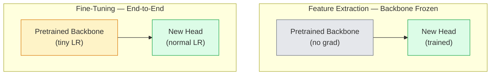

# Transfer Learning and Fine-Tuning

> Someone else spent a million GPU-hours teaching a network what edges, textures, and object parts look like. Before training your own, you should borrow those features.

**Type:** Build
**Languages:** Python
**Prerequisites:** Phase 4 Lesson 03 (CNN), Phase 4 Lesson 04 (Image Classification)
**Time:** ~75 minutes

## Learning Objectives

- Distinguish feature extraction from fine-tuning, and pick the right one based on dataset size, domain distance, and compute budget
- Load a pretrained backbone, replace its classification head, train only the head, and reach a usable baseline in under 20 lines
- Progressively unfreeze layers with discriminative learning rates so early general features update less than later task-specific ones
- Diagnose three common failures: feature drift from excessive LR on unfrozen blocks, BN statistics collapse on small datasets, catastrophic forgetting

## The Problem

Training a ResNet-50 on ImageNet takes roughly 2,000 GPU-hours. Few teams can afford that budget for every task they ship. What nearly every team actually ships is a pretrained backbone with a new head trained on a few hundred or thousand task-specific images.

This isn't a shortcut. Any ImageNet-trained CNN's first conv block learns edges and Gabor-like filters. The next few blocks learn textures and simple patterns. Middle blocks learn object parts. Final blocks learn combinations that start resembling the 1,000 ImageNet classes. The first 90% of this hierarchy transfers almost unchanged to medical imaging, industrial inspection, satellite data, and every other vision task — because nature's vocabulary of edges and textures is finite. The last 10% is what you actually need to train.

Getting transfer right, three bugs lie in wait: destroying pretrained features with too-high learning rates, freezing too much and starving the model of information, and letting BatchNorm's running statistics drift toward a small dataset the rest of the network never learned from. This lesson walks through each one deliberately.

## The Concept

### Feature Extraction vs Fine-Tuning

Two modes, chosen by how much you trust the pretrained features and how much data you have.



Rules of thumb:

| Dataset Size | Domain Distance | Recipe |
|--------------|-----------------|--------|
| < 1k images | Close to ImageNet | Freeze backbone, train head only |
| 1k–10k | Close | Freeze first 2–3 stages, fine-tune the rest |
| 10k–100k | Any | End-to-end fine-tuning with discriminative LR |
| 100k+ | Far | Fine-tune everything; consider training from scratch if the domain is far enough |

"Close to ImageNet" roughly means natural RGB photos with object content. Medical CT scans, overhead satellite imagery, and microscopy are far domains — features still help, but you need more layers to adapt.

### Why Freezing Works

The ImageNet features a CNN learns aren't specialized for those 1,000 classes. They're specialized for natural image statistics: oriented edges, textures, contrast patterns, shape primitives. These statistics are stable across nearly every visual domain humans can name. That's why a model trained on ImageNet, evaluated zero-shot on CIFAR-10 with only a new linear head (no backbone fine-tuning), hits 80%+ accuracy. The head is learning: which of the already-learned features to weight for this task.

### Discriminative Learning Rates

When you do unfreeze, early layers should train slower than later ones. Early layers encode general features you want to preserve; later layers encode task-specific structure you need to move significantly.

```
Typical recipe:

  stage 0 (stem + first group):    lr = base_lr / 100    (nearly frozen)
  stage 1:                          lr = base_lr / 10
  stage 2:                          lr = base_lr / 3
  stage 3 (last backbone group):    lr = base_lr
  head:                             lr = base_lr  (or slightly higher)
```

In PyTorch, this is just a list of parameter groups passed to the optimizer. One model, five learning rates, zero extra code.

### The BatchNorm Problem

BN layers hold `running_mean` and `running_var` buffers computed on ImageNet. If your task has a different pixel distribution — different lighting, different sensor, different color space — those buffers are wrong. Three options in preference order:

1. **Fine-tune with BN in train mode.** Let BN update its running stats alongside everything else. Default when the task dataset is medium-sized (>= 5k samples).
2. **Freeze BN in eval mode.** Keep ImageNet stats, train weights only. Correct when your dataset is small enough that BN's moving average would be noisy.
3. **Replace BN with GroupNorm.** Removes the moving-average problem entirely. Used for detection and segmentation backbones with very small per-GPU batch sizes.

Get this wrong and you silently lose 5–15% accuracy.

### Head Design

The classification head is 1–3 linear layers with optional dropout. Every torchvision backbone ships with a default head that you replace:

```
backbone.fc = nn.Linear(backbone.fc.in_features, num_classes)          # ResNet
backbone.classifier[1] = nn.Linear(..., num_classes)                    # EfficientNet, MobileNet
backbone.heads.head = nn.Linear(..., num_classes)                       # torchvision ViT
```

For small datasets, a single linear layer usually suffices. Adding a hidden layer (Linear -> ReLU -> Dropout -> Linear) helps when the task distribution is farther from the backbone's training distribution.

### Layer-wise LR Decay

A smoother version of discriminative LR used in modern fine-tuning (BEiT, DINOv2, ViT-B fine-tuning). Instead of grouping layers into stages, give each layer an LR slightly smaller than the one above it:

```
lr_layer_k = base_lr * decay^(L - k)
```

With decay = 0.75 and L = 12 transformer blocks, the first block trains at `0.75^11 ≈ 0.04x` the head LR. More important for transformer fine-tuning than for CNNs, where per-stage grouping usually suffices.

### What to Evaluate

Transfer learning runs need two numbers you wouldn't track when training from scratch:

- **Pretrained-only accuracy** — the head's accuracy with a frozen backbone. This is your floor.
- **Fine-tuned accuracy** — the same model after end-to-end training. This is your ceiling.

If fine-tuned is worse than pretrained-only, you have a learning rate or BN bug. Always print both.

## Build It

### Step 1: Load a Pretrained Backbone and Inspect It

```python
import torch
import torch.nn as nn
from torchvision.models import resnet18, ResNet18_Weights

backbone = resnet18(weights=ResNet18_Weights.IMAGENET1K_V1)
print(backbone)
print()
print("classifier head:", backbone.fc)
print("feature dim:", backbone.fc.in_features)
```

`ResNet18` has four stages (`layer1..layer4`), plus a stem and an `fc` head. Every torchvision classification backbone follows a similar structure.

### Step 2: Feature Extraction — Freeze Everything, Replace the Head

```python
def make_feature_extractor(num_classes=10):
    model = resnet18(weights=ResNet18_Weights.IMAGENET1K_V1)
    for p in model.parameters():
        p.requires_grad = False
    model.fc = nn.Linear(model.fc.in_features, num_classes)
    return model

model = make_feature_extractor(num_classes=10)
trainable = sum(p.numel() for p in model.parameters() if p.requires_grad)
frozen = sum(p.numel() for p in model.parameters() if not p.requires_grad)
print(f"trainable: {trainable:>10,}")
print(f"frozen:    {frozen:>10,}")
```

Only `model.fc` is trainable. The backbone is a frozen feature extractor.

### Step 3: Discriminative Fine-Tuning

A utility function that builds parameter groups with stage-specific learning rates.

```python
def discriminative_param_groups(model, base_lr=1e-3, decay=0.3):
    stages = [
        ["conv1", "bn1"],
        ["layer1"],
        ["layer2"],
        ["layer3"],
        ["layer4"],
        ["fc"],
    ]
    groups = []
    for i, names in enumerate(stages):
        lr = base_lr * (decay ** (len(stages) - 1 - i))
        params = [p for n, p in model.named_parameters()
                  if any(n.startswith(k) for k in names)]
        if params:
            groups.append({"params": params, "lr": lr, "name": "_".join(names)})
    return groups

model = resnet18(weights=ResNet18_Weights.IMAGENET1K_V1)
model.fc = nn.Linear(model.fc.in_features, 10)
for p in model.parameters():
    p.requires_grad = True

groups = discriminative_param_groups(model)
for g in groups:
    print(f"{g['name']:>10s}  lr={g['lr']:.2e}  params={sum(p.numel() for p in g['params']):>8,}")
```

`decay=0.3` means each stage trains at 30% the rate of the next one. `fc` gets `base_lr`, `layer4` gets `0.3 * base_lr`, `conv1` gets `0.3^5 * base_lr ≈ 0.00243 * base_lr`. Sounds extreme; empirically it works.

### Step 4: BatchNorm Handling

A helper that freezes BN running statistics without freezing its weights.

```python
def freeze_bn_stats(model):
    for m in model.modules():
        if isinstance(m, (nn.BatchNorm1d, nn.BatchNorm2d, nn.BatchNorm3d)):
            m.eval()
            for p in m.parameters():
                p.requires_grad = False
    return model
```

Call it after `model.train()` at the start of each epoch. `model.train()` flips everything to training mode; this flips just the BN layers back.

### Step 5: A Minimal End-to-End Fine-Tuning Loop

```python
from torch.optim import SGD
from torch.utils.data import DataLoader
from torch.optim.lr_scheduler import CosineAnnealingLR
import torch.nn.functional as F

def fine_tune(model, train_loader, val_loader, device, epochs=5, base_lr=1e-3, freeze_bn=False):
    model = model.to(device)
    groups = discriminative_param_groups(model, base_lr=base_lr)
    optimizer = SGD(groups, momentum=0.9, weight_decay=1e-4, nesterov=True)
    scheduler = CosineAnnealingLR(optimizer, T_max=epochs)

    for epoch in range(epochs):
        model.train()
        if freeze_bn:
            freeze_bn_stats(model)
        tr_loss, tr_correct, tr_total = 0.0, 0, 0
        for x, y in train_loader:
            x, y = x.to(device), y.to(device)
            logits = model(x)
            loss = F.cross_entropy(logits, y, label_smoothing=0.1)
            optimizer.zero_grad()
            loss.backward()
            optimizer.step()
            tr_loss += loss.item() * x.size(0)
            tr_total += x.size(0)
            tr_correct += (logits.argmax(-1) == y).sum().item()
        scheduler.step()

        model.eval()
        va_total, va_correct = 0, 0
        with torch.no_grad():
            for x, y in val_loader:
                x, y = x.to(device), y.to(device)
                pred = model(x).argmax(-1)
                va_total += x.size(0)
                va_correct += (pred == y).sum().item()
        print(f"epoch {epoch}  train {tr_loss/tr_total:.3f}/{tr_correct/tr_total:.3f}  "
              f"val {va_correct/va_total:.3f}")
    return model
```

On CIFAR-10 with this recipe for five epochs, you can take `ResNet18-IMAGENET1K_V1` from ~70% zero-shot linear-probe accuracy to ~93% fine-tuned accuracy. Head-only, never touching the backbone, plateaus around 86%.

### Step 6: Progressive Unfreezing

A schedule that unfreezes one stage per epoch from the end toward the beginning. Mitigates feature drift at the cost of a few extra epochs.

```python
def progressive_unfreeze_schedule(model):
    stages = ["layer4", "layer3", "layer2", "layer1"]
    yielded = set()

    def start():
        for p in model.parameters():
            p.requires_grad = False
        for p in model.fc.parameters():
            p.requires_grad = True

    def unfreeze(epoch):
        if epoch < len(stages):
            name = stages[epoch]
            yielded.add(name)
            for n, p in model.named_parameters():
                if n.startswith(name):
                    p.requires_grad = True
            return name
        return None

    return start, unfreeze
```

Call `start()` once before the first epoch. Call `unfreeze(epoch)` at the start of each epoch. Rebuild the optimizer whenever the set of trainable parameters changes — otherwise frozen parameters still hold cached momentum that confuses it.

## Use It

For most real tasks, `torchvision.models` + three lines is enough. The heavier machinery above matters when you hit problems the library defaults can't fix.

```python
from torchvision.models import resnet50, ResNet50_Weights

model = resnet50(weights=ResNet50_Weights.IMAGENET1K_V2)
model.fc = nn.Linear(model.fc.in_features, num_classes)
optimizer = torch.optim.AdamW(model.parameters(), lr=1e-4, weight_decay=1e-4)
```

Two other production-grade defaults:

- `timm` offers ~800 pretrained vision backbones with a consistent API (`timm.create_model("resnet50", pretrained=True, num_classes=10)`). The standard for any fine-tuning beyond torchvision's model zoo.
- For transformers, `transformers.AutoModelForImageClassification.from_pretrained(name, num_labels=N)` gives you ViT / BEiT / DeiT, loaded the same way as text models.

## Ship It

This lesson produces:

- `outputs/prompt-fine-tune-planner.md` — a prompt that chooses between feature extraction, progressive, and end-to-end fine-tuning based on dataset size, domain distance, and compute budget.
- `outputs/skill-freeze-inspector.md` — a skill that, given a PyTorch model, reports which parameters are trainable, which BatchNorm layers are in eval mode, and whether the optimizer actually received those trainable parameters.

## Exercises

1. **(Easy)** Train a `ResNet18` on the same synthetic CIFAR dataset as both a linear probe (frozen backbone) and a full fine-tune. Report both accuracies side by side. Explain which gap tells you features transfer well and which tells you they don't.
2. **(Medium)** Deliberately introduce a bug: set `base_lr` to `1e-1` for backbone stages instead of the head. Show training loss exploding, then apply the `discriminative_param_groups` helper to recover. Log the LR at which each stage begins to diverge.
3. **(Hard)** Take a medical imaging dataset (e.g., CheXpert-small, PatchCamelyon, or HAM10000) and compare three modes: (a) ImageNet-pretrained frozen backbone + linear head; (b) ImageNet-pretrained end-to-end fine-tuning; (c) training from scratch. Report accuracy and compute cost for each. At what dataset size does training from scratch become competitive?

## Key Terms

| Term | What people say | What it actually is |
|------|----------------|----------------------|
| Feature extraction | "Freeze and train the head" | Backbone parameters frozen, only the new classification head receives gradients |
| Fine-tuning | "End-to-end retraining" | All parameters trainable, usually with a much smaller LR than training from scratch |
| Discriminative LR | "Smaller LR for early layers" | Optimizer parameter groups where early stages get a fraction of later stages' LR |
| Layer-wise LR decay | "Smooth LR gradient" | Each layer's LR multiplied by decay^(L - k); common in transformer fine-tuning |
| Catastrophic forgetting | "Model lost ImageNet" | Excessive LR overwrites pretrained features before new task signal is learned |
| BN statistics drift | "Wrong running mean" | BatchNorm's running_mean/var was computed on a different distribution than the current task, silently reducing accuracy |
| Linear probe | "Frozen backbone + linear head" | An evaluation of pretrained features — the accuracy of the best linear classifier on top of frozen representations |
| Catastrophic collapse | "Predicts one class for everything" | Happens when fine-tuning with LR high enough to destroy features before head gradients stabilize |

## Further Reading

- [How transferable are features in deep neural networks? (Yosinski et al., 2014)](https://arxiv.org/abs/1411.1792) — the paper that quantified cross-layer feature transferability
- [Universal Language Model Fine-tuning (ULMFiT, Howard & Ruder, 2018)](https://arxiv.org/abs/1801.06146) — the original discriminative LR / progressive unfreezing recipe; these ideas transfer directly to vision
- [timm documentation](https://huggingface.co/docs/timm) — reference for modern vision backbones and the exact fine-tuning defaults used to train them
- [A Simple Framework for Linear-Probe Evaluation (Kornblith et al., 2019)](https://arxiv.org/abs/1805.08974) — why linear-probe accuracy matters and how to report it correctly
