# Object Detection — YOLO from Scratch

> Detection is classification plus regression, run at every position on the feature map, then cleaned up with non-maximum suppression.

**Type:** Build
**Languages:** Python
**Prerequisites:** Phase 4 Lesson 03 (CNN), Phase 4 Lesson 04 (Image Classification), Phase 4 Lesson 05 (Transfer Learning)
**Time:** ~75 minutes

## Learning Objectives

- Explain the "grid + anchor" design that turns detection into a dense prediction problem, and name every number in the output tensor
- Compute Intersection over Union (IoU) between two boxes and implement non-maximum suppression from scratch
- Build a minimal YOLO-style head on top of a pretrained backbone, including classification, objectness, and box regression losses
- Read a line of detection metrics (precision@0.5, recall, mAP@0.5, mAP@0.5:0.95) and decide which knob to turn next

## The Problem

Classification says "this image is a dog." Detection says "there's a dog at pixel (112, 40, 280, 210), a cat at (400, 180, 560, 310), and nothing else in the frame." This one structural change — predicting a variable number of labeled boxes instead of one label per image — is what every self-driving system, every surveillance product, every document layout parser, and every factory vision line depends on.

Detection is also where every engineering tradeoff in vision surfaces at once. You want accurate boxes (regression head), you want correct classes per box (classification head), you want the model to know when there's nothing to detect (objectness score), and you want exactly one prediction per ground-truth object (non-maximum suppression). Miss any one of these and the pipeline either drops objects, hallucinates boxes, or predicts the same thing fifteen times at slightly different locations.

YOLO (You Only Look Once, Redmon et al. 2016) is the design that made all of this run in real time — in a single forward pass of one convolutional network — and the same structural decisions remain the backbone of modern detectors (YOLOv8, YOLOv9, YOLO-NAS, RT-DETR). Learn the core and every variant becomes a rearrangement of the same parts.

## The Concept

### Detection as Dense Prediction

A classifier outputs C numbers per image. A YOLO-style detector outputs `(S x S x (5 + C))` numbers per image, where S is the spatial grid size.

```mermaid
flowchart LR
    IMG["Input 416x416 RGB"] --> BB["Backbone<br/>(ResNet, DarkNet, ...)"]
    BB --> FM["Feature Map<br/>(C_feat, 13, 13)"]
    FM --> HEAD["Detection Head<br/>(1x1 conv)"]
    HEAD --> OUT["Output Tensor<br/>(13, 13, B * (5 + C))"]
    OUT --> DEC["Decode<br/>(grid + sigmoid + exp)"]
    DEC --> NMS["Non-Maximum Suppression"]
    NMS --> RESULT["Final Boxes"]

    style IMG fill:#dbeafe,stroke:#2563eb
    style HEAD fill:#fef3c7,stroke:#d97706
    style NMS fill:#fecaca,stroke:#dc2626
    style RESULT fill:#dcfce7,stroke:#16a34a
```



`S * S` grid cells each predict `B` boxes. For each box:

- 4 numbers describe geometry: `tx, ty, tw, th`.
- 1 number is the objectness score: "is there an object centered in this cell?"
- C numbers are class probabilities.

Total per cell: `B * (5 + C)`. For VOC, `S=13, B=2, C=20`, each cell is 50 numbers.

### Why Grids and Anchors

Naive regression would predict each object's `(x, y, w, h)` as absolute coordinates. This is hard for a convolutional network because translating the image shouldn't translate all predictions by the same amount — each object is spatially anchored. The grid answers this: assign each ground-truth box to the grid cell its center falls into; only that cell is responsible for that object.

Anchors solve the second problem. A 3x3 conv struggles to regress a 500-pixel-wide box from a feature cell with a 16-pixel receptive field. So we predefine `B` prior box shapes (anchors) per cell and predict small offsets relative to each anchor. The model learns to pick the right anchor and refine it, rather than regressing from zero.

```
Anchor box priors (example for 416x416 input):

  small:   (30,  60)
  medium:  (75,  170)
  large:   (200, 380)

At each grid cell, each anchor emits (tx, ty, tw, th, obj, c_1, ..., c_C).
```

Modern detectors commonly use FPN with different anchor sets per resolution — small anchors on shallow high-res feature maps, large anchors on deep low-res maps. Same idea, more scales.

### Decoding Predictions

The raw `tx, ty, tw, th` aren't box coordinates; they're regression targets that need transformation before drawing:

```
center_x = (sigmoid(tx) + cell_x) * stride
center_y = (sigmoid(ty) + cell_y) * stride
width    = anchor_w * exp(tw)
height   = anchor_h * exp(th)
```

`sigmoid` constrains the center offset within the cell. `exp` lets the width scale freely from the anchor without going negative. `stride` scales grid coordinates back to pixels. This decoding step is identical in every YOLO version since v2.

### IoU

The universal similarity measure between two boxes in detection:

```
IoU(A, B) = area(A ∩ B) / area(A ∪ B)
```

IoU = 1 means identical; IoU = 0 means no overlap. IoU between a prediction and a ground-truth box determines whether a prediction counts as a true positive (typically IoU >= 0.5). IoU between two predictions is what NMS uses to deduplicate.

### Non-Maximum Suppression

A convolutional network trained on neighboring anchors often predicts overlapping boxes for the same object. NMS keeps the highest-confidence prediction and removes any others whose IoU with it exceeds a threshold.

```
NMS(boxes, scores, iou_threshold):
    sort boxes by score descending
    keep = []
    while boxes is not empty:
        take the highest-scored box, add to keep
        remove every box with IoU > iou_threshold against the taken box
    return keep
```

Typical threshold: 0.45 for object detection. Recent detectors replace standard NMS with `soft-NMS`, `DIoU-NMS`, or learned suppression (RT-DETR), but the structural purpose is the same.

### Loss

The YOLO loss is a weighted sum of three losses:

```
L = lambda_coord * L_box(pred, target, where obj=1)
  + lambda_obj   * L_obj(pred, 1,     where obj=1)
  + lambda_noobj * L_obj(pred, 0,     where obj=0)
  + lambda_cls   * L_cls(pred, target, where obj=1)
```

Only cells containing objects contribute to box regression and classification loss. Empty cells contribute only to objectness loss (teaching the model to stay quiet). `lambda_noobj` is typically small (~0.5) because the vast majority of cells are empty and would otherwise dominate the total loss.

Modern variants replace the MSE box loss with CIoU / DIoU (optimizing IoU directly), use focal loss for class imbalance, and quality focal loss to balance objectness. The three-component structure remains.

### Detection Metrics

Accuracy doesn't transfer to detection. Four numbers that do:

- **Precision@IoU=0.5** — of predictions counted as positives, how many are actually correct.
- **Recall@IoU=0.5** — of ground-truth objects, how many did we find.
- **AP@0.5** — area under the precision-recall curve at IoU threshold 0.5; one number per class.
- **mAP@0.5:0.95** — AP averaged over IoU thresholds 0.5, 0.55, ..., 0.95. COCO metric; strictest and most informative.

Report all four. A detector strong at mAP@0.5 but weak at mAP@0.5:0.95 has roughly correct but loose localization; fix with better box regression loss. A detector with high precision and low recall is too conservative; lower the confidence threshold or increase objectness weight.

## Build It

### Step 1: IoU

The workhorse of the entire lesson. Operates on two arrays of `(x1, y1, x2, y2)` boxes.

```python
import numpy as np

def box_iou(boxes_a, boxes_b):
    ax1, ay1, ax2, ay2 = boxes_a[:, 0], boxes_a[:, 1], boxes_a[:, 2], boxes_a[:, 3]
    bx1, by1, bx2, by2 = boxes_b[:, 0], boxes_b[:, 1], boxes_b[:, 2], boxes_b[:, 3]

    inter_x1 = np.maximum(ax1[:, None], bx1[None, :])
    inter_y1 = np.maximum(ay1[:, None], by1[None, :])
    inter_x2 = np.minimum(ax2[:, None], bx2[None, :])
    inter_y2 = np.minimum(ay2[:, None], by2[None, :])

    inter_w = np.clip(inter_x2 - inter_x1, 0, None)
    inter_h = np.clip(inter_y2 - inter_y1, 0, None)
    inter = inter_w * inter_h

    area_a = (ax2 - ax1) * (ay2 - ay1)
    area_b = (bx2 - bx1) * (by2 - by1)
    union = area_a[:, None] + area_b[None, :] - inter
    return inter / np.clip(union, 1e-8, None)
```

Returns an `(N_a, N_b)` pairwise IoU matrix. To use it against a single ground-truth box, make one of the arrays `(1, 4)`.

### Step 2: Non-Maximum Suppression

```python
def nms(boxes, scores, iou_threshold=0.45):
    order = np.argsort(-scores)
    keep = []
    while len(order) > 0:
        i = order[0]
        keep.append(i)
        if len(order) == 1:
            break
        rest = order[1:]
        ious = box_iou(boxes[[i]], boxes[rest])[0]
        order = rest[ious <= iou_threshold]
    return np.array(keep, dtype=np.int64)
```

Deterministic, `O(N log N)` from the sort, matches `torchvision.ops.nms` behavior on identical inputs.

### Step 3: Box Encoding and Decoding

Convert between pixel coordinates and the `(tx, ty, tw, th)` targets the network actually regresses.

```python
def encode(box_xyxy, cell_x, cell_y, stride, anchor_wh):
    x1, y1, x2, y2 = box_xyxy
    cx = 0.5 * (x1 + x2)
    cy = 0.5 * (y1 + y2)
    w = x2 - x1
    h = y2 - y1
    tx = cx / stride - cell_x
    ty = cy / stride - cell_y
    tw = np.log(w / anchor_wh[0] + 1e-8)
    th = np.log(h / anchor_wh[1] + 1e-8)
    return np.array([tx, ty, tw, th])


def decode(tx_ty_tw_th, cell_x, cell_y, stride, anchor_wh):
    tx, ty, tw, th = tx_ty_tw_th
    cx = (sigmoid(tx) + cell_x) * stride
    cy = (sigmoid(ty) + cell_y) * stride
    w = anchor_wh[0] * np.exp(tw)
    h = anchor_wh[1] * np.exp(th)
    return np.array([cx - w / 2, cy - h / 2, cx + w / 2, cy + h / 2])


def sigmoid(x):
    return 1.0 / (1.0 + np.exp(-x))
```

Test: encode a box then decode — you should get back something very close to the original (unless `tx` falls outside the range where the sigmoid inverse is accurate).

### Step 4: A Minimal YOLO Head

A single 1x1 conv on a feature map, reshaped to `(B, S, S, num_anchors, 5 + C)`.

```python
import torch
import torch.nn as nn

class YOLOHead(nn.Module):
    def __init__(self, in_c, num_anchors, num_classes):
        super().__init__()
        self.num_anchors = num_anchors
        self.num_classes = num_classes
        self.conv = nn.Conv2d(in_c, num_anchors * (5 + num_classes), kernel_size=1)

    def forward(self, x):
        n, _, h, w = x.shape
        y = self.conv(x)
        y = y.view(n, self.num_anchors, 5 + self.num_classes, h, w)
        y = y.permute(0, 3, 4, 1, 2).contiguous()
        return y
```

Output shape: `(N, H, W, num_anchors, 5 + C)`. The last dimension stores `[tx, ty, tw, th, obj, cls_0, ..., cls_{C-1}]`.

### Step 5: Target Assignment

For each ground-truth box, decide which `(cell, anchor)` is responsible.

```python
def assign_targets(boxes_xyxy, classes, anchors, stride, grid_size, num_classes):
    num_anchors = len(anchors)
    target = np.zeros((grid_size, grid_size, num_anchors, 5 + num_classes), dtype=np.float32)
    has_obj = np.zeros((grid_size, grid_size, num_anchors), dtype=bool)

    for box, cls in zip(boxes_xyxy, classes):
        x1, y1, x2, y2 = box
        cx, cy = 0.5 * (x1 + x2), 0.5 * (y1 + y2)
        gx, gy = int(cx / stride), int(cy / stride)
        bw, bh = x2 - x1, y2 - y1

        ious = np.array([
            (min(bw, aw) * min(bh, ah)) / (bw * bh + aw * ah - min(bw, aw) * min(bh, ah))
            for aw, ah in anchors
        ])
        best = int(np.argmax(ious))
        aw, ah = anchors[best]

        target[gy, gx, best, 0] = cx / stride - gx
        target[gy, gx, best, 1] = cy / stride - gy
        target[gy, gx, best, 2] = np.log(bw / aw + 1e-8)
        target[gy, gx, best, 3] = np.log(bh / ah + 1e-8)
        target[gy, gx, best, 4] = 1.0
        target[gy, gx, best, 5 + cls] = 1.0
        has_obj[gy, gx, best] = True
    return target, has_obj
```

Anchor selection is "best shape IoU with the ground truth" — a cheap proxy consistent with YOLOv2/v3 assignment. v5 and later use more complex strategies (task-aligned matching, dynamic k) that refine the same idea.

### Step 6: The Three Losses

```python
def yolo_loss(pred, target, has_obj, lambda_coord=5.0, lambda_obj=1.0, lambda_noobj=0.5, lambda_cls=1.0):
    has_obj_t = torch.from_numpy(has_obj).bool()
    target_t = torch.from_numpy(target).float()

    # Box regression loss: only on cells with objects
    box_pred = pred[..., :4][has_obj_t]
    box_true = target_t[..., :4][has_obj_t]
    loss_box = torch.nn.functional.mse_loss(box_pred, box_true, reduction="sum")

    # Objectness loss
    obj_pred = pred[..., 4]
    obj_true = target_t[..., 4]
    loss_obj_pos = torch.nn.functional.binary_cross_entropy_with_logits(
        obj_pred[has_obj_t], obj_true[has_obj_t], reduction="sum")
    loss_obj_neg = torch.nn.functional.binary_cross_entropy_with_logits(
        obj_pred[~has_obj_t], obj_true[~has_obj_t], reduction="sum")

    # Classification loss on cells with objects
    cls_pred = pred[..., 5:][has_obj_t]
    cls_true = target_t[..., 5:][has_obj_t]
    loss_cls = torch.nn.functional.binary_cross_entropy_with_logits(
        cls_pred, cls_true, reduction="sum")

    total = (lambda_coord * loss_box
             + lambda_obj * loss_obj_pos
             + lambda_noobj * loss_obj_neg
             + lambda_cls * loss_cls)
    return total, {"box": loss_box.item(), "obj_pos": loss_obj_pos.item(),
                   "obj_neg": loss_obj_neg.item(), "cls": loss_cls.item()}
```

Five hyperparameters that every YOLO tutorial either hardcodes or sweeps. The ratios matter: `lambda_coord=5, lambda_noobj=0.5` dates back to the original YOLOv1 paper and remains a reasonable default.

### Step 7: Inference Pipeline

Decode raw head output, apply sigmoid/exp, filter by objectness threshold, then NMS.

```python
def postprocess(pred_tensor, anchors, stride, img_size, conf_threshold=0.25, iou_threshold=0.45):
    pred = pred_tensor.detach().cpu().numpy()
    grid_h, grid_w = pred.shape[1], pred.shape[2]
    num_anchors = len(anchors)

    boxes, scores, classes = [], [], []
    for gy in range(grid_h):
        for gx in range(grid_w):
            for a in range(num_anchors):
                tx, ty, tw, th, obj, *cls = pred[0, gy, gx, a]
                score = sigmoid(obj) * sigmoid(np.array(cls)).max()
                if score < conf_threshold:
                    continue
                cls_idx = int(np.argmax(cls))
                cx = (sigmoid(tx) + gx) * stride
                cy = (sigmoid(ty) + gy) * stride
                w = anchors[a][0] * np.exp(tw)
                h = anchors[a][1] * np.exp(th)
                boxes.append([cx - w / 2, cy - h / 2, cx + w / 2, cy + h / 2])
                scores.append(float(score))
                classes.append(cls_idx)

    if not boxes:
        return np.zeros((0, 4)), np.zeros((0,)), np.zeros((0,), dtype=int)
    boxes = np.array(boxes)
    scores = np.array(scores)
    classes = np.array(classes)
    keep = nms(boxes, scores, iou_threshold)
    return boxes[keep], scores[keep], classes[keep]
```

That's the complete eval path: head -> decode -> threshold -> NMS.

## Use It

`torchvision.models.detection` provides production-grade detectors with the same conceptual structure. Loading a pretrained model takes three lines.

```python
import torch
from torchvision.models.detection import fasterrcnn_resnet50_fpn_v2

model = fasterrcnn_resnet50_fpn_v2(weights="DEFAULT")
model.eval()
with torch.no_grad():
    predictions = model([torch.randn(3, 400, 600)])
print(predictions[0].keys())
print(f"boxes:  {predictions[0]['boxes'].shape}")
print(f"scores: {predictions[0]['scores'].shape}")
print(f"labels: {predictions[0]['labels'].shape}")
```

For real-time inference pipelines, `ultralytics` (YOLOv8/v9) is the standard: `from ultralytics import YOLO; model = YOLO('yolov8n.pt'); model(img)`. The model handles decoding and NMS internally, returning the same `boxes / scores / labels` triplet you built above.

## Ship It

This lesson produces:

- `outputs/prompt-detection-metric-reader.md` — a prompt that turns a line of `precision, recall, AP, mAP@0.5:0.95` into a one-sentence diagnosis and the most useful next experiment.
- `outputs/skill-anchor-designer.md` — a skill that, given a ground-truth box dataset, runs k-means on `(w, h)` and returns anchor sets per FPN level, plus the coverage statistics you need to pick the right anchor count.

## Exercises

1. **(Easy)** Implement `box_iou` and compare against `torchvision.ops.box_iou` on 1,000 random box pairs. Verify the max absolute difference is below `1e-6`.
2. **(Medium)** Port `yolo_loss` to use `CIoU` box loss instead of MSE. Show on a 100-image synthetic dataset that CIoU converges to better final mAP@0.5:0.95 in the same number of epochs.
3. **(Hard)** Implement multi-scale inference: feed the same image at three resolutions, merge box predictions, then run a single NMS pass. Measure mAP improvement relative to single-scale inference on a holdout set.

## Key Terms

| Term | What people say | What it actually is |
|------|----------------|----------------------|
| Anchor | "Box prior" | A predefined box shape at each grid cell from which the network predicts offsets instead of absolute coordinates |
| IoU | "Overlap" | Intersection over Union of two boxes; the universal similarity measure in detection |
| NMS | "Deduplication" | Greedy algorithm that keeps the highest-scored prediction and removes others overlapping above a threshold |
| Objectness | "Is there something here" | Per-anchor, per-cell scalar predicting whether an object is centered at that cell |
| Grid stride | "Downsampling factor" | Number of pixels per grid cell; a 416-pixel input with a 13-grid head has stride 32 |
| mAP | "Mean average precision" | Area under the precision-recall curve, averaged across classes (COCO also averages across IoU thresholds) |
| AP@0.5 | "PASCAL VOC AP" | Average precision at IoU threshold 0.5; the lenient version of this metric |
| mAP@0.5:0.95 | "COCO AP" | Averaged over IoU thresholds 0.5..0.95 in steps of 0.05; the strict version and current community standard |

## Further Reading

- [YOLOv1: You Only Look Once (Redmon et al., 2016)](https://arxiv.org/abs/1506.02640) — the foundational paper; every YOLO since is a refinement of this structure
- [YOLOv3 (Redmon & Farhadi, 2018)](https://arxiv.org/abs/1804.02767) — the paper that introduced the multi-scale FPN-style head; still the clearest diagram
- [Ultralytics YOLOv8 docs](https://docs.ultralytics.com) — the current production reference; covers dataset formats, augmentation, and training recipes
- [The Illustrated Guide to Object Detection (Jonathan Hui)](https://jonathan-hui.medium.com/object-detection-series-24d03a12f904) — the best plain-language walkthrough of the entire detector family; invaluable for understanding the relationships between DETR, RetinaNet, FCOS, and YOLO
