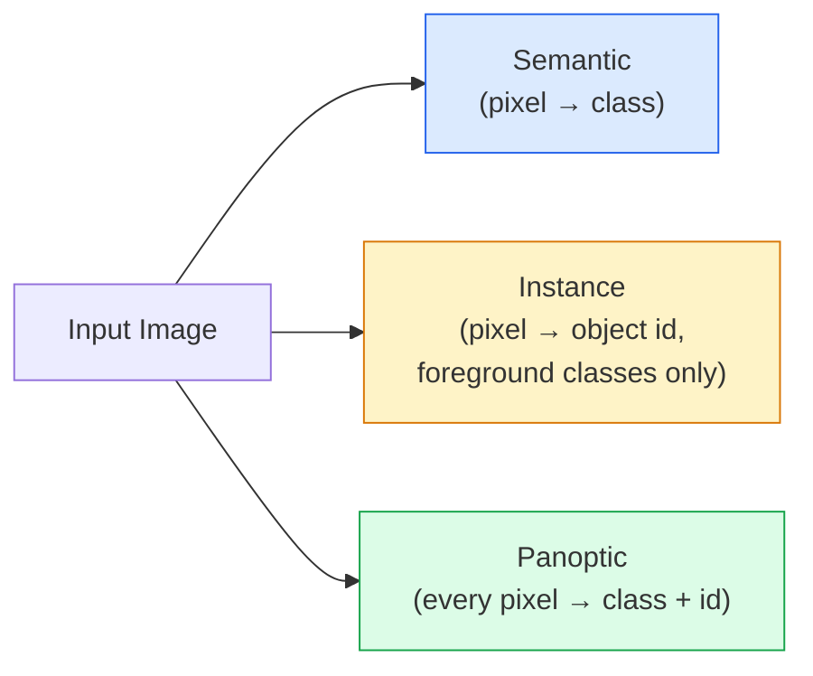
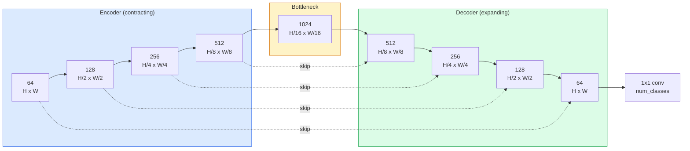

# Semantic Segmentation — U-Net

> Segmentation is classification at every pixel. U-Net makes it work by pairing a downsampling encoder with an upsampling decoder and connecting them with skip connections.

**Type:** Build
**Languages:** Python
**Prerequisites:** Phase 4 Lesson 03 (CNN), Phase 4 Lesson 04 (Image Classification)
**Time:** ~75 minutes

## Learning Objectives

- Distinguish semantic segmentation, instance segmentation, and panoptic segmentation, and pick the right task for a given problem
- Build a U-Net from scratch in PyTorch with encoder blocks, bottleneck, decoder with transposed convolutions, and skip connections
- Implement per-pixel cross-entropy, Dice loss, and the combined loss that is currently the default for medical and industrial segmentation
- Read per-class IoU and Dice metrics and diagnose whether a poor score comes from small-object recall, boundary precision, or class imbalance

## The Problem

Classification outputs one label per image. Detection outputs a set of boxes per image. Segmentation outputs one label per pixel. For an `H x W` input, the output is a tensor of shape `H x W` (semantic) or `H x W x N_instances` (instance). That's millions of predictions per image, not one.

This structure is exactly what makes segmentation the backbone of nearly every dense-prediction vision product: medical imaging (tumor masks), autonomous driving (road, lanes, obstacles), satellite (building footprints, crop boundaries), document parsing (layout regions), and robotics (graspable areas). None of these tasks can be solved by drawing a box around an object; they need precise contours.

The architectural problem is simple to state, hard to solve: you need the network to see both global context (what kind of scene is this) and local pixel detail (which exact pixel is road vs. sidewalk). A standard CNN compresses spatially to gain context, throwing away detail in the process. U-Net is the design that gets both.

## The Concept

### Semantic vs Instance vs Panoptic



- **Semantic** says "this pixel is road, that pixel is car." Two cars next to each other merge into one blob.
- **Instance** says "this pixel is car #3, that pixel is car #5." Ignores background stuff (stuff = sky, road, grass).
- **Panoptic** unifies both: every pixel gets a class label, every instance gets a unique id, and both stuff and things are segmented.

This lesson covers semantic. The next lesson (Mask R-CNN) covers instance.

### The U-Net Shape



The encoder halves spatial resolution four times and doubles channels. The decoder reverses: doubles spatial resolution four times and halves channels. Skip connections concatenate corresponding encoder features with decoder features at each resolution. The final 1x1 conv maps `64 -> num_classes` at full resolution.

Why skip connections are necessary: by the time the decoder tries to output pixel-level predictions, it has only seen small feature maps. Without skips it cannot localize edges accurately because that information was compressed away in the encoder. Skips hand it the high-resolution feature maps the encoder computed along the way.

### Transposed vs Bilinear Upsampling

The decoder must expand spatial dimensions. Two options:

- **Transposed convolution** (`nn.ConvTranspose2d`) — learnable upsampling. The historical U-Net default. Can produce checkerboard artifacts if stride and kernel size don't divide evenly.
- **Bilinear upsample + 3x3 conv** — smooth upsample followed by a convolution. Fewer artifacts, fewer parameters, the modern default.

Both are seen in the wild. For a first U-Net, bilinear is safer.

### Cross-Entropy on a Pixel Grid

For C-class semantic segmentation, model output is `(N, C, H, W)`. Target is `(N, H, W)` with integer class IDs. Cross-entropy is identical to the classification case, just applied at every spatial location:

```
Loss = average over (n, h, w) of -log( softmax(logits[n, :, h, w])[target[n, h, w]] )
```

PyTorch's `F.cross_entropy` handles this shape natively. No reshape needed.

### Dice Loss, and Why You Need It

Cross-entropy treats every pixel equally. When one class dominates the image (medical imaging: 99% background, 1% tumor), this is wrong. The network can achieve 99% accuracy by predicting background everywhere and still be useless.

Dice loss fixes this by directly optimizing the overlap between predicted and ground-truth masks:

```
Dice(p, y) = 2 * sum(p * y) / (sum(p) + sum(y) + epsilon)
Dice_loss = 1 - Dice
```

Where `p` is the sigmoid/softmax probability map for a class and `y` is the binary ground-truth mask. Loss is zero only when overlap is perfect. Because it's ratio-based, class imbalance doesn't matter.

In practice, use the **combined loss**:

```
L = L_cross_entropy + lambda * L_dice       (lambda ≈ 1)
```

Cross-entropy gives stable gradients early in training; Dice focuses the tail end of training on actually matching the mask shape. This combination is the default in medical imaging and hard to beat on any class-imbalanced dataset.

### Evaluation Metrics

- **Pixel accuracy** — percentage of pixels predicted correctly. Cheap. Fails on imbalanced data for the same reason accuracy fails in classification.
- **Per-class IoU** — intersection over union of each class mask; averaged across classes = mIoU.
- **Dice (pixel-level F1)** — similar to IoU; `Dice = 2 * IoU / (1 + IoU)`. Medical imaging prefers Dice, driving prefers IoU; they're monotonically related.
- **Boundary F1** — measures how close predicted boundaries are to ground-truth boundaries, penalizing even small shifts. Important for high-precision tasks like semiconductor inspection.

Report per-class IoU, not just mIoU. Averaged IoU can hide a 15% class when the other nine are at 85%.

### Input Resolution Tradeoffs

U-Net's encoder halves resolution four times, so input must be divisible by 16. Medical images are commonly 512x512 or 1024x1024. Driving crops are 2048x1024. U-Net's memory cost scales with `H * W * C_max`, and at 1024x1024 with 1024 bottleneck channels, a single forward pass already uses several GB of VRAM.

Two standard workarounds:
1. Tile the input — process overlapping 256x256 patches and stitch.
2. Replace the bottleneck with dilated convolutions, maintaining higher spatial resolution while expanding the receptive field (DeepLab family).

For a first model, a U-Net with 256x256 input and 64-channel base trains comfortably on 8 GB VRAM.

## Build It

### Step 1: Encoder Block

Two 3x3 convolutions with batch normalization and ReLU. The first conv changes channel count; the second keeps it the same.

```python
import torch
import torch.nn as nn
import torch.nn.functional as F

class DoubleConv(nn.Module):
    def __init__(self, in_c, out_c):
        super().__init__()
        self.net = nn.Sequential(
            nn.Conv2d(in_c, out_c, kernel_size=3, padding=1, bias=False),
            nn.BatchNorm2d(out_c),
            nn.ReLU(inplace=True),
            nn.Conv2d(out_c, out_c, kernel_size=3, padding=1, bias=False),
            nn.BatchNorm2d(out_c),
            nn.ReLU(inplace=True),
        )

    def forward(self, x):
        return self.net(x)
```

This block is reused throughout. `bias=False` because BN's beta handles the bias.

### Step 2: Down Block and Up Block

```python
class Down(nn.Module):
    def __init__(self, in_c, out_c):
        super().__init__()
        self.net = nn.Sequential(
            nn.MaxPool2d(2),
            DoubleConv(in_c, out_c),
        )

    def forward(self, x):
        return self.net(x)


class Up(nn.Module):
    def __init__(self, in_c, out_c):
        super().__init__()
        self.up = nn.Upsample(scale_factor=2, mode="bilinear", align_corners=False)
        self.conv = DoubleConv(in_c, out_c)

    def forward(self, x, skip):
        x = self.up(x)
        if x.shape[-2:] != skip.shape[-2:]:
            x = F.interpolate(x, size=skip.shape[-2:], mode="bilinear", align_corners=False)
        x = torch.cat([skip, x], dim=1)
        return self.conv(x)
```

Only the spatial shape (`shape[-2:]`) is checked, handling inputs whose dimensions aren't divisible by 16; a safe `F.interpolate` aligns the tensors before concatenation. Comparing the full shape would also trigger on channel mismatches, which should be a loud error rather than a silent interpolation.

### Step 3: U-Net

```python
class UNet(nn.Module):
    def __init__(self, in_channels=3, num_classes=2, base=64):
        super().__init__()
        self.inc = DoubleConv(in_channels, base)
        self.d1 = Down(base, base * 2)
        self.d2 = Down(base * 2, base * 4)
        self.d3 = Down(base * 4, base * 8)
        self.d4 = Down(base * 8, base * 16)
        self.u1 = Up(base * 16 + base * 8, base * 8)
        self.u2 = Up(base * 8 + base * 4, base * 4)
        self.u3 = Up(base * 4 + base * 2, base * 2)
        self.u4 = Up(base * 2 + base, base)
        self.outc = nn.Conv2d(base, num_classes, kernel_size=1)

    def forward(self, x):
        x1 = self.inc(x)
        x2 = self.d1(x1)
        x3 = self.d2(x2)
        x4 = self.d3(x3)
        x5 = self.d4(x4)
        x = self.u1(x5, x4)
        x = self.u2(x, x3)
        x = self.u3(x, x2)
        x = self.u4(x, x1)
        return self.outc(x)

net = UNet(in_channels=3, num_classes=2, base=32)
x = torch.randn(1, 3, 256, 256)
print(f"output: {net(x).shape}")
print(f"params: {sum(p.numel() for p in net.parameters()):,}")
```

Output shape `(1, 2, 256, 256)` — same spatial size as input, `num_classes` channels. ~7.7M parameters with `base=32`.

### Step 4: Loss

```python
def dice_loss(logits, targets, num_classes, eps=1e-6):
    probs = F.softmax(logits, dim=1)
    targets_one_hot = F.one_hot(targets, num_classes).permute(0, 3, 1, 2).float()
    dims = (0, 2, 3)
    intersection = (probs * targets_one_hot).sum(dim=dims)
    denom = probs.sum(dim=dims) + targets_one_hot.sum(dim=dims)
    dice = (2 * intersection + eps) / (denom + eps)
    return 1 - dice.mean()


def combined_loss(logits, targets, num_classes, lam=1.0):
    ce = F.cross_entropy(logits, targets)
    dc = dice_loss(logits, targets, num_classes)
    return ce + lam * dc, {"ce": ce.item(), "dice": dc.item()}
```

Dice is computed per-class then averaged (macro Dice). `eps` prevents division by zero for classes absent from the batch.

### Step 5: IoU Metric

```python
@torch.no_grad()
def iou_per_class(logits, targets, num_classes):
    preds = logits.argmax(dim=1)
    ious = torch.zeros(num_classes)
    for c in range(num_classes):
        pred_c = (preds == c)
        true_c = (targets == c)
        inter = (pred_c & true_c).sum().float()
        union = (pred_c | true_c).sum().float()
        ious[c] = (inter / union) if union > 0 else torch.tensor(float("nan"))
    return ious
```

Returns a length-C vector. `nan` marks classes absent from the batch — don't count those when computing mIoU.

### Step 6: Synthetic Dataset for End-to-End Verification

Generates shapes on colored backgrounds, forcing the network to learn shape rather than pixel color.

```python
import numpy as np
from torch.utils.data import Dataset, DataLoader

def synthetic_segmentation(num_samples=200, size=64, seed=0):
    rng = np.random.default_rng(seed)
    images = np.zeros((num_samples, size, size, 3), dtype=np.float32)
    masks = np.zeros((num_samples, size, size), dtype=np.int64)
    for i in range(num_samples):
        bg = rng.uniform(0, 1, (3,))
        images[i] = bg
        masks[i] = 0
        num_shapes = rng.integers(1, 4)
        for _ in range(num_shapes):
            cls = int(rng.integers(1, 3))
            color = rng.uniform(0, 1, (3,))
            cx, cy = rng.integers(10, size - 10, size=2)
            r = int(rng.integers(4, 12))
            yy, xx = np.meshgrid(np.arange(size), np.arange(size), indexing="ij")
            if cls == 1:
                mask = (xx - cx) ** 2 + (yy - cy) ** 2 < r ** 2
            else:
                mask = (np.abs(xx - cx) < r) & (np.abs(yy - cy) < r)
            images[i][mask] = color
            masks[i][mask] = cls
        images[i] += rng.normal(0, 0.02, images[i].shape)
        images[i] = np.clip(images[i], 0, 1)
    return images, masks


class SegDataset(Dataset):
    def __init__(self, images, masks):
        self.images = images
        self.masks = masks

    def __len__(self):
        return len(self.images)

    def __getitem__(self, i):
        img = torch.from_numpy(self.images[i]).permute(2, 0, 1).float()
        mask = torch.from_numpy(self.masks[i]).long()
        return img, mask
```

Three classes: background (0), circle (1), square (2). The network must learn to distinguish shapes.

### Step 7: Training Loop

```python
def train_one_epoch(model, loader, optimizer, device, num_classes):
    model.train()
    loss_sum, total = 0.0, 0
    iou_sum = torch.zeros(num_classes)
    for x, y in loader:
        x, y = x.to(device), y.to(device)
        logits = model(x)
        loss, _ = combined_loss(logits, y, num_classes)
        optimizer.zero_grad()
        loss.backward()
        optimizer.step()
        loss_sum += loss.item() * x.size(0)
        total += x.size(0)
        iou_sum += iou_per_class(logits, y, num_classes).nan_to_num(0)
    return loss_sum / total, iou_sum / len(loader)
```

Run for 10–30 epochs on the synthetic dataset and watch shape-class mIoU climb past 0.9. Note that `nan_to_num(0)` treats classes absent from the batch as zero; for accurate per-class IoU, mask by presence and use `torch.nanmean` across batches at evaluation time rather than averaging here.

## Use It

In production, `segmentation_models_pytorch` ("smp") wraps every standard segmentation architecture with any torchvision or timm backbone. Three lines:

```python
import segmentation_models_pytorch as smp

model = smp.Unet(
    encoder_name="resnet34",
    encoder_weights="imagenet",
    in_channels=3,
    classes=3,
)
```

Other things worth knowing for real work:
- **DeepLabV3+** replaces max-pool-based downsampling with dilated convolutions, keeping the bottleneck at higher resolution; faster and better boundaries on satellite and driving data.
- **SegFormer** replaces the convolutional encoder with a hierarchical transformer; current SOTA on many benchmarks.
- **Mask2Former** / **OneFormer** unify semantic, instance, and panoptic segmentation in a single architecture.

All three are drop-in replacements in `smp` or `transformers`, using the same data loader.

## Ship It

This lesson produces:

- `outputs/prompt-segmentation-task-picker.md` — a prompt that chooses between semantic, instance, and panoptic segmentation and names the architecture for a given task.
- `outputs/skill-segmentation-mask-inspector.md` — a skill that reports class distribution, predicted mask statistics, and classes being under-predicted or blurry at boundaries.

## Exercises

1. **(Easy)** Implement `bce_dice_loss` for a binary segmentation task (foreground vs background). Verify on a synthetic two-class dataset: the combined loss converges faster than BCE alone when foreground is 5% of pixels.
2. **(Medium)** Replace the `nn.Upsample + conv` up block with an `nn.ConvTranspose2d` up block. Train both on the synthetic dataset and compare mIoU. Observe where checkerboard artifacts appear in the transposed-conv version.
3. **(Hard)** Take a real segmentation dataset (Oxford-IIIT Pets, Cityscapes mini split, or a medical subset) and train U-Net to within 2 IoU points of the `smp.Unet` reference. Report per-class IoU and identify which classes benefit most from adding Dice to the loss.

## Key Terms

| Term | What people say | What it actually is |
|------|----------------|----------------------|
| Semantic segmentation | "Label every pixel" | Classify each pixel into C classes; same-class instances merge |
| Instance segmentation | "Label every object" | Distinguish different instances of the same class; foreground only |
| Panoptic segmentation | "Semantic + instance" | Every pixel gets a class; every thing instance also gets a unique id |
| Skip connection | "U-Net bridge" | Concatenates encoder features into the decoder at corresponding resolutions; preserves high-frequency detail |
| Transposed convolution | "Deconvolution" | Learnable upsampling; can produce checkerboard artifacts |
| Dice loss | "Overlap loss" | 1 - 2|A ∩ B| / (|A| + |B|); directly optimizes mask overlap, robust to class imbalance |
| mIoU | "Mean intersection over union" | Per-class IoU averaged across classes; the community standard metric for segmentation |
| Boundary F1 | "Boundary precision" | F1 score computed only on boundary pixels; important for precision-critical tasks |

## Further Reading

- [U-Net: Convolutional Networks for Biomedical Image Segmentation (Ronneberger et al., 2015)](https://arxiv.org/abs/1505.04597) — the original paper; the figure everyone copies is on page 2
- [Fully Convolutional Networks (Long et al., 2015)](https://arxiv.org/abs/1411.4038) — the paper that first made segmentation an end-to-end convolutional problem
- [segmentation_models_pytorch](https://github.com/qubvel/segmentation_models.pytorch) — the production segmentation reference; every standard architecture plus every standard loss
- [Lessons learned from training SOTA segmentation (kaggle.com competitions)](https://www.kaggle.com/code/iafoss/carvana-unet-pytorch) — explains why TTA, pseudo-labels, and class weights matter on real data
