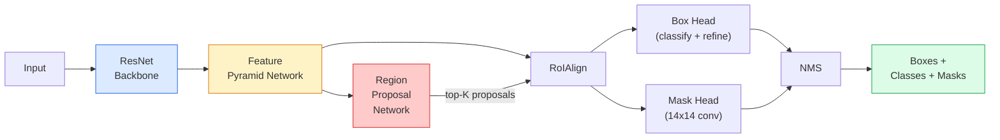

# Instance Segmentation — Mask R-CNN

> Add a small mask branch to a Faster R-CNN detector and you have instance segmentation. The hard part is RoIAlign, and it's trickier than it looks.

**Type:** Build + Learn
**Languages:** Python
**Prerequisites:** Phase 4 Lesson 06 (YOLO), Phase 4 Lesson 07 (U-Net)
**Time:** ~75 minutes

## Learning Objectives

- Walk through the Mask R-CNN architecture end-to-end: backbone, FPN, RPN, RoIAlign, box head, mask head
- Implement RoIAlign from scratch and explain why RoIPool is no longer used
- Use torchvision's `maskrcnn_resnet50_fpn_v2` pretrained model to produce production-quality instance masks and correctly read its output format
- Fine-tune Mask R-CNN on a small custom dataset by replacing the box head and mask head while keeping the backbone frozen

## The Problem

Semantic segmentation gives you one mask per class. Instance segmentation gives you one mask per object, even when two objects share a class. Counting individuals, tracking across frames, measuring things (the bounding box of each brick on a wall, each cell in a microscopy image) — all require instance segmentation.

Mask R-CNN (He et al., 2017) solved this by reframing instance segmentation as "detection plus masking." The design is so clean that nearly every instance segmentation paper for the next five years was a Mask R-CNN variant, and the torchvision implementation remains the production default for small-to-medium datasets.

The tricky engineering problem is sampling: when a proposal box's corners don't align with pixel boundaries, how do you crop a fixed-size feature region from it? Get this wrong and you lose fractions of a mAP point everywhere. RoIAlign is the answer.

## The Concept

### Architecture



Five components to understand:

1. **Backbone** — a ResNet-50 or ResNet-101 trained on ImageNet. Produces feature map levels at strides 4, 8, 16, 32.
2. **FPN (Feature Pyramid Network)** — top-down + lateral connections giving each level C-channel semantically rich features. Detection queries the FPN level matched to the object's size.
3. **RPN (Region Proposal Network)** — a small conv head predicting "is there an object here?" and "how should I refine this box?" at every anchor location. Produces ~1,000 proposals per image.
4. **RoIAlign** — samples a fixed-size (e.g., 7x7) feature patch from an arbitrary box on any FPN level. Bilinear sampling, no quantization.
5. **Heads** — a two-layer box head that refines boxes and picks classes, plus a small conv head that outputs a `28x28` binary mask per proposal.

### Why RoIAlign, Not RoIPool

The original Fast R-CNN used RoIPool, which splits a proposal box into a grid, takes the max feature in each cell, and rounds all coordinates to integers. That rounding misaligns the feature map from input pixel coordinates by up to an entire feature-map pixel — negligible on 224x224 images, catastrophic at feature-map stride 32.

```
RoIPool:
  box (34.7, 51.3, 98.2, 142.9)
  round -> (34, 51, 98, 142)
  split grid -> each cell boundary rounded individually
  misalignment accumulates at every step

RoIAlign:
  box (34.7, 51.3, 98.2, 142.9)
  sample with bilinear interpolation at exact float coordinates
  no rounding anywhere
```

RoIAlign gives 3–4 free mask AP points on COCO. Every modern detector that cares about localization uses it — YOLOv7 seg, RT-DETR, Mask2Former all included.

### RPN in One Paragraph

At every position on the feature map, place K anchor boxes of varying sizes and aspect ratios. For each anchor, predict an objectness score and a regression offset that transforms the anchor into a tighter box. Keep the top ~1,000 boxes by score, apply NMS at IoU 0.7, and pass survivors to the heads. The RPN trains with its own small loss — structurally identical to the YOLO loss from Lesson 6, just with two classes (object / not-object).

### The Mask Head

For each proposal (after RoIAlign), the mask head is a small FCN: four 3x3 convs, one 2x deconv, and a final 1x1 conv producing `num_classes` output channels at `28x28` resolution. Only the channel corresponding to the predicted class is kept; the rest are ignored. This decouples mask prediction from classification.

Upsample the 28x28 mask to the proposal's original pixel size to produce the final binary mask.

### Loss

Mask R-CNN has four losses summed together:

```
L = L_rpn_cls + L_rpn_box + L_box_cls + L_box_reg + L_mask
```

- `L_rpn_cls`, `L_rpn_box` — objectness + box regression for RPN proposals.
- `L_box_cls` — cross-entropy on (C+1) classes (including background) at the head classifier.
- `L_box_reg` — smooth L1 on the head's box refinement.
- `L_mask` — per-pixel binary cross-entropy on the 28x28 mask output.

Each loss has its own default weight; the torchvision implementation exposes them as constructor parameters.

### Output Format

`torchvision.models.detection.maskrcnn_resnet50_fpn_v2` returns a list of dicts, one per image:

```
{
    "boxes":  (N, 4), (x1, y1, x2, y2) pixel coordinates,
    "labels": (N,) class IDs, 0 = background so indices start at 1,
    "scores": (N,) confidence scores,
    "masks":  (N, 1, H, W) float masks in [0, 1] — threshold at 0.5 to binarize,
}
```

Masks are already at full image resolution. The 28x28 head output is upsampled internally.

## Build It

### Step 1: Implement RoIAlign from Scratch

This is the only component in Mask R-CNN that's easier to understand from code than from prose.

```python
import torch
import torch.nn.functional as F

def roi_align_single(feature, box, output_size=7, spatial_scale=1 / 16.0):
    """
    feature: (C, H, W) single-image feature map
    box: (x1, y1, x2, y2), original image pixel coordinates
    output_size: grid side length (7 for box head, 14 for mask head)
    spatial_scale: reciprocal of feature map stride
    """
    C, H, W = feature.shape
    x1, y1, x2, y2 = [c * spatial_scale - 0.5 for c in box]
    bin_w = (x2 - x1) / output_size
    bin_h = (y2 - y1) / output_size

    grid_y = torch.linspace(y1 + bin_h / 2, y2 - bin_h / 2, output_size)
    grid_x = torch.linspace(x1 + bin_w / 2, x2 - bin_w / 2, output_size)
    yy, xx = torch.meshgrid(grid_y, grid_x, indexing="ij")

    gx = 2 * (xx + 0.5) / W - 1
    gy = 2 * (yy + 0.5) / H - 1
    grid = torch.stack([gx, gy], dim=-1).unsqueeze(0)
    sampled = F.grid_sample(feature.unsqueeze(0), grid, mode="bilinear",
                            align_corners=False)
    return sampled.squeeze(0)
```

Every number lands on a bilinearly-sampled position. No rounding, no quantization, no lost gradients.

### Step 2: Compare Against torchvision's RoIAlign

```python
from torchvision.ops import roi_align

feature = torch.randn(1, 16, 50, 50)
boxes = torch.tensor([[0, 10, 20, 100, 90]], dtype=torch.float32)  # (batch_idx, x1, y1, x2, y2)

ours = roi_align_single(feature[0], boxes[0, 1:].tolist(), output_size=7, spatial_scale=1/4)
theirs = roi_align(feature, boxes, output_size=(7, 7), spatial_scale=1/4, sampling_ratio=1, aligned=True)[0]

print(f"shape ours:   {tuple(ours.shape)}")
print(f"shape theirs: {tuple(theirs.shape)}")
print(f"max|diff|:    {(ours - theirs).abs().max().item():.3e}")
```

With `sampling_ratio=1` and `aligned=True`, both agree within `1e-5`.

### Step 3: Load a Pretrained Mask R-CNN

```python
import torch
from torchvision.models.detection import maskrcnn_resnet50_fpn_v2, MaskRCNN_ResNet50_FPN_V2_Weights

model = maskrcnn_resnet50_fpn_v2(weights=MaskRCNN_ResNet50_FPN_V2_Weights.DEFAULT)
model.eval()
print(f"params: {sum(p.numel() for p in model.parameters()):,}")
print(f"classes (including background): {len(model.roi_heads.box_predictor.cls_score.out_features * [0])}")
```

46M parameters, 91 classes (COCO). The first class (id 0) is background; everything the model actually detects starts at id 1.

### Step 4: Run Inference

```python
with torch.no_grad():
    x = torch.randn(3, 400, 600)
    predictions = model([x])
p = predictions[0]
print(f"boxes:  {tuple(p['boxes'].shape)}")
print(f"labels: {tuple(p['labels'].shape)}")
print(f"scores: {tuple(p['scores'].shape)}")
print(f"masks:  {tuple(p['masks'].shape)}")
```

The mask tensor shape is `(N, 1, H, W)`. Threshold at 0.5 to get per-object binary masks:

```python
binary_masks = (p['masks'] > 0.5).squeeze(1)  # (N, H, W) bool
```

### Step 5: Replace Heads for a Custom Number of Classes

Common fine-tuning recipe: reuse backbone, FPN, and RPN; replace the two classification heads.

```python
from torchvision.models.detection.faster_rcnn import FastRCNNPredictor
from torchvision.models.detection.mask_rcnn import MaskRCNNPredictor

def build_custom_maskrcnn(num_classes):
    model = maskrcnn_resnet50_fpn_v2(weights=MaskRCNN_ResNet50_FPN_V2_Weights.DEFAULT)
    in_features = model.roi_heads.box_predictor.cls_score.in_features
    model.roi_heads.box_predictor = FastRCNNPredictor(in_features, num_classes)
    in_features_mask = model.roi_heads.mask_predictor.conv5_mask.in_channels
    hidden_layer = 256
    model.roi_heads.mask_predictor = MaskRCNNPredictor(in_features_mask, hidden_layer, num_classes)
    return model

custom = build_custom_maskrcnn(num_classes=5)
print(f"custom cls_score.out_features: {custom.roi_heads.box_predictor.cls_score.out_features}")
```

`num_classes` must include the background class, so a dataset with 4 object classes uses `num_classes=5`.

### Step 6: Freeze Parts That Don't Need Training

On small datasets, freeze the backbone and FPN. Only the RPN's objectness + regression and the two heads learn.

```python
def freeze_backbone_and_fpn(model):
    # torchvision Mask R-CNN packages the FPN inside `model.backbone`
    # (as `model.backbone.fpn`), so iterating `model.backbone.parameters()`
    # covers both ResNet feature layers and FPN lateral/output convs.
    for p in model.backbone.parameters():
        p.requires_grad = False
    return model

custom = freeze_backbone_and_fpn(custom)
trainable = sum(p.numel() for p in custom.parameters() if p.requires_grad)
print(f"trainable after freeze: {trainable:,}")
```

On a 500-image dataset, this is the difference between convergence and overfitting.

## Use It

The full training loop for Mask R-CNN in torchvision is 40 lines and barely changes between tasks — swap datasets and go.

```python
def train_step(model, images, targets, optimizer):
    model.train()
    loss_dict = model(images, targets)
    losses = sum(loss for loss in loss_dict.values())
    optimizer.zero_grad()
    losses.backward()
    optimizer.step()
    return {k: v.item() for k, v in loss_dict.items()}
```

Each image in the `targets` list must have a dict with `boxes`, `labels`, and `masks` (as `(num_instances, H, W)` binary tensors). The model returns a four-loss dict during training and a predictions list during eval, controlled by `model.training`.

The `pycocotools` evaluator produces mAP@IoU=0.5:0.95 for both boxes and masks; you need both numbers to know whether the bottleneck is the box head or the mask head.

## Ship It

This lesson produces:

- `outputs/prompt-instance-vs-semantic-router.md` — a prompt that asks three questions to choose between instance/semantic/panoptic, plus the exact starting model.
- `outputs/skill-mask-rcnn-head-swapper.md` — a skill that, given a new `num_classes`, generates the 10-line head-swap code for any torchvision detection model.

## Exercises

1. **(Easy)** Compare your RoIAlign against `torchvision.ops.roi_align` on 100 random boxes. Report the max absolute difference. Run it again with RoIPool (pre-2017 behavior) and show it deviates by ~1–2 feature-map pixels on boxes near boundaries.
2. **(Medium)** Fine-tune `maskrcnn_resnet50_fpn_v2` on a 50-image custom dataset (any two classes: balloons, fish, potholes, logos). Freeze backbone, train for 20 epochs, report mask AP@0.5.
3. **(Hard)** Replace Mask R-CNN's mask head to predict at 56x56 instead of 28x28. Measure mAP@IoU=0.75 before and after the replacement. Explain why the improvement (or lack thereof) is consistent with the expected boundary-precision / memory tradeoff.

## Key Terms

| Term | What people say | What it actually is |
|------|----------------|----------------------|
| Mask R-CNN | "Detection plus masking" | Faster R-CNN + a small FCN head that predicts a 28x28 mask per proposal per class |
| FPN | "Feature pyramid" | Top-down + lateral connections giving each stride level C-channel semantically rich features |
| RPN | "Region proposer" | A small conv head producing ~1,000 object/not-object proposals per image |
| RoIAlign | "No-rounding crop" | Bilinearly samples a fixed-size feature grid from an arbitrary float-coordinate box |
| RoIPool | "Pre-2017 crop" | Same purpose as RoIAlign but rounds box coordinates to integers; deprecated |
| Mask AP | "Instance mAP" | Average precision computed with mask IoU instead of box IoU; COCO instance segmentation metric |
| Binary mask head | "Per-class mask" | Predicts one binary mask per class per proposal; only the predicted-class channel is kept |
| Background class | "Class 0" | The catch-all "no object" class; real class indices start at 1 |

## Further Reading

- [Mask R-CNN (He et al., 2017)](https://arxiv.org/abs/1703.06870) — the paper; Section 3 on RoIAlign is the key reading
- [FPN: Feature Pyramid Networks (Lin et al., 2017)](https://arxiv.org/abs/1612.03144) — the FPN paper; every modern detector uses it
- [torchvision Mask R-CNN tutorial](https://pytorch.org/tutorials/intermediate/torchvision_tutorial.html) — the reference for the fine-tuning loop
- [Detectron2 model zoo](https://github.com/facebookresearch/detectron2/blob/main/MODEL_ZOO.md) — production implementation with trained weights for nearly every detection and segmentation variant
