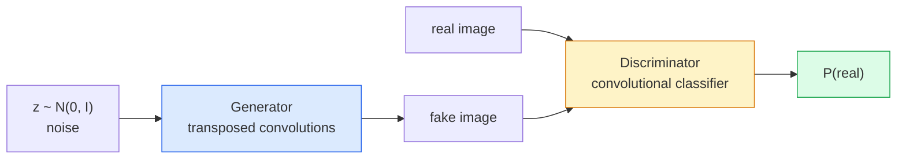
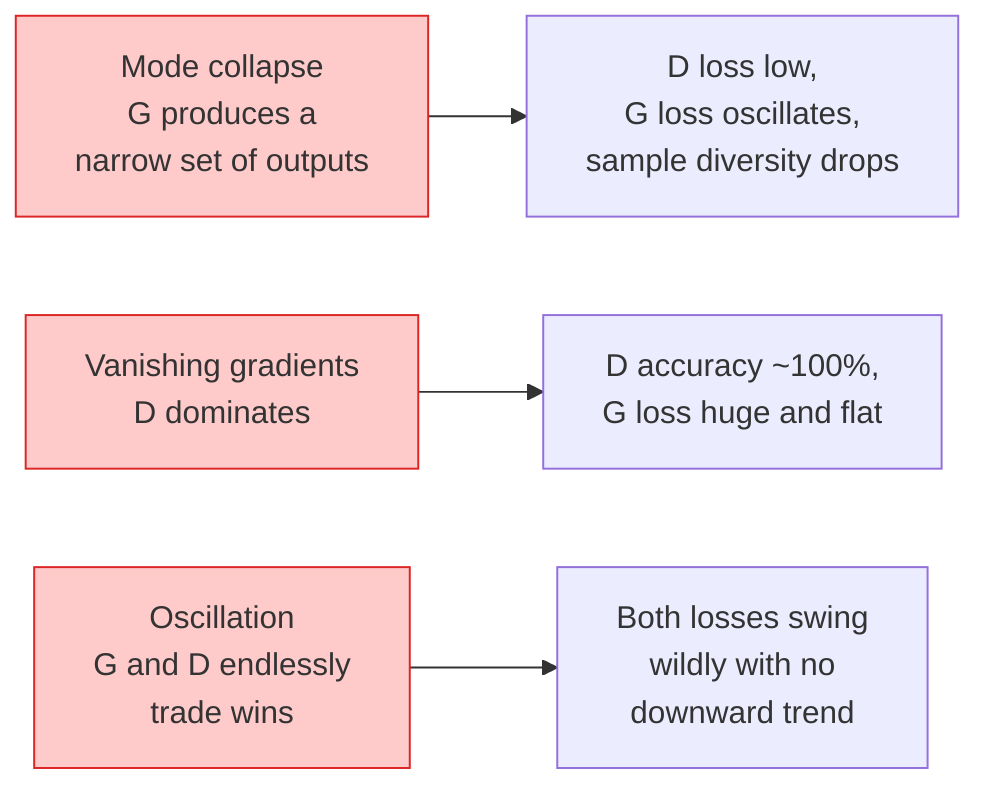

# Image Generation — GANs

> A GAN is two neural networks in a fixed game. One paints, one critiques. They improve together until the paintings fool the judge.

**Type:** Build
**Languages:** Python
**Prerequisites:** Phase 4 Lesson 03 (CNN), Phase 3 Lesson 06 (Optimizers), Phase 3 Lesson 07 (Regularization)
**Time:** ~75 minutes

## Learning Objectives

- Explain the minimax game between generator and discriminator, and why equilibrium corresponds to p_model = p_data
- Implement a DCGAN in PyTorch that generates coherent 32x32 synthetic images in under 60 lines
- Stabilize GAN training with three standard tricks: non-saturating loss, spectral normalization, TTUR (Two Time-Scale Update Rule)
- Read training curves and distinguish healthy convergence from mode collapse, oscillation, and discriminator domination

## The Problem

Classification teaches networks to map images to labels. Generation reverses the problem: sample new images that look like they came from the same distribution. There is no "correct" output to diff against — only a distribution you want to mimic.

Standard loss functions (MSE, cross-entropy) cannot measure "is this sample from the real distribution." Minimizing per-pixel error produces blurry averages, not realistic samples. The breakthrough was to learn the loss: train a second network whose job is to distinguish real from fake, and use its judgment to push the generator.

GANs (Goodfellow et al., 2014) defined that framework. By 2018, StyleGAN was producing 1024x1024 faces indistinguishable from photos. Since then, diffusion models have taken the crown in quality and controllability, but every trick that makes diffusion practical — normalization choices, latent spaces, feature losses — was understood on GANs first.

## The Concept

### Two Networks



**Generator** G takes a noise vector `z` and outputs an image. **Discriminator** D takes an image and outputs a scalar: the probability that the image is real.

### The Game

G wants D to be wrong. D wants to be right. Formally:

```
min_G max_D  E_x[log D(x)] + E_z[log(1 - D(G(z)))]
```

Read right to left: D maximizes accuracy on both real (`log D(real)`) and fake (`log (1 - D(fake))`) images. G minimizes D's accuracy on fakes — it wants `D(G(z))` to be high.

Goodfellow proved this minimax has a global equilibrium where `p_G = p_data`, D outputs 0.5 everywhere, and the Jensen-Shannon divergence between the generated and real distributions is zero. The hard part is getting there.

### Non-Saturating Loss

The formulation above is numerically unstable. Early in training, `D(G(z))` is near zero for every fake, so gradients of `log(1 - D(G(z)))` with respect to G vanish. The fix: flip G's loss.

```
L_D = -E_x[log D(x)] - E_z[log(1 - D(G(z)))]
L_G = -E_z[log D(G(z))]                          # non-saturating
```

Now when `D(G(z))` is near zero, G's loss is large and its gradient is informative. Every modern GAN trains with this variant.

### DCGAN Architecture Rules

Radford, Metz, and Chintala (2015) distilled years of failed experiments into five rules that stabilize GAN training:

1. Replace pooling with strided convolutions (both networks).
2. Use batch normalization in both generator and discriminator, except G's output and D's input.
3. Remove fully connected layers in deeper architectures.
4. G uses ReLU in all layers except output (output uses tanh to map to [-1, 1]).
5. D uses LeakyReLU in all layers (negative_slope=0.2).

Every modern convolution-based GAN (StyleGAN, BigGAN, GigaGAN) still starts from these rules, then swaps components one by one.

### Failure Modes and Their Signatures



- **Mode collapse**: G finds one image that fools D and only produces that. Fix: add minibatch discrimination, spectral normalization, or label conditioning.
- **Discriminator domination**: D gets too strong too fast, G's gradients vanish. Fix: smaller D, lower D learning rate, or label smoothing on real labels.
- **Oscillation**: the two networks trade wins back and forth, never approaching equilibrium. Fix: TTUR (D learns 2-4x faster than G), or switch to Wasserstein loss.

### Evaluation

GANs have no ground truth — so how do you know it's working?

- **Sample inspection** — look at 64 samples at the end of every epoch. Non-negotiable.
- **FID (Fréchet Inception Distance)** — distance between Inception-v3 feature distributions of real and generated sets. Lower is better. Community standard.
- **Inception Score** — older, more brittle; prefer FID.
- **Precision/Recall for generative models** — measures quality (precision) and coverage (recall) separately. More informative than FID alone.

For small synthetic-data runs, sample inspection is enough.

## Build It

### Step 1: Generator

A small DCGAN generator that takes 64-dim noise and produces a 32x32 image.

```python
import torch
import torch.nn as nn

class Generator(nn.Module):
    def __init__(self, z_dim=64, img_channels=3, feat=64):
        super().__init__()
        self.net = nn.Sequential(
            nn.ConvTranspose2d(z_dim, feat * 4, kernel_size=4, stride=1, padding=0, bias=False),
            nn.BatchNorm2d(feat * 4),
            nn.ReLU(inplace=True),
            nn.ConvTranspose2d(feat * 4, feat * 2, kernel_size=4, stride=2, padding=1, bias=False),
            nn.BatchNorm2d(feat * 2),
            nn.ReLU(inplace=True),
            nn.ConvTranspose2d(feat * 2, feat, kernel_size=4, stride=2, padding=1, bias=False),
            nn.BatchNorm2d(feat),
            nn.ReLU(inplace=True),
            nn.ConvTranspose2d(feat, img_channels, kernel_size=4, stride=2, padding=1, bias=False),
            nn.Tanh(),
        )

    def forward(self, z):
        return self.net(z.view(z.size(0), -1, 1, 1))
```

Four transposed convolutions, each with `kernel_size=4, stride=2, padding=1`, cleanly doubling spatial dimensions. Outputs [-1, 1] activations via tanh.

### Step 2: Discriminator

Mirror of the generator. LeakyReLU, strided convolutions, ending in a scalar logit.

```python
class Discriminator(nn.Module):
    def __init__(self, img_channels=3, feat=64):
        super().__init__()
        self.net = nn.Sequential(
            nn.Conv2d(img_channels, feat, kernel_size=4, stride=2, padding=1),
            nn.LeakyReLU(0.2, inplace=True),
            nn.Conv2d(feat, feat * 2, kernel_size=4, stride=2, padding=1, bias=False),
            nn.BatchNorm2d(feat * 2),
            nn.LeakyReLU(0.2, inplace=True),
            nn.Conv2d(feat * 2, feat * 4, kernel_size=4, stride=2, padding=1, bias=False),
            nn.BatchNorm2d(feat * 4),
            nn.LeakyReLU(0.2, inplace=True),
            nn.Conv2d(feat * 4, 1, kernel_size=4, stride=1, padding=0),
        )

    def forward(self, x):
        return self.net(x).view(-1)
```

The final convolution reduces the `4x4` feature map to `1x1`. One scalar per image; sigmoid is applied only when computing the loss.

### Step 3: Training Step

Alternating: update D once per batch, then update G once.

```python
import torch.nn.functional as F

def train_step(G, D, real, z, opt_g, opt_d, device):
    real = real.to(device)
    bs = real.size(0)

    # D step
    opt_d.zero_grad()
    d_real = D(real)
    d_fake = D(G(z).detach())
    loss_d = (F.binary_cross_entropy_with_logits(d_real, torch.ones_like(d_real))
              + F.binary_cross_entropy_with_logits(d_fake, torch.zeros_like(d_fake)))
    loss_d.backward()
    opt_d.step()

    # G step
    opt_g.zero_grad()
    d_fake = D(G(z))
    loss_g = F.binary_cross_entropy_with_logits(d_fake, torch.ones_like(d_fake))
    loss_g.backward()
    opt_g.step()

    return loss_d.item(), loss_g.item()
```

`G(z).detach()` in the D step is critical: we don't want gradients flowing into G when updating D. Forgetting it is a classic beginner bug.

### Step 4: Full Training Loop on Synthetic Shapes

```python
from torch.utils.data import DataLoader, TensorDataset
import numpy as np

def synthetic_images(num=2000, size=32, seed=0):
    rng = np.random.default_rng(seed)
    imgs = np.zeros((num, 3, size, size), dtype=np.float32) - 1.0
    for i in range(num):
        r = rng.uniform(6, 12)
        cx, cy = rng.uniform(r, size - r, size=2)
        yy, xx = np.meshgrid(np.arange(size), np.arange(size), indexing="ij")
        mask = (xx - cx) ** 2 + (yy - cy) ** 2 < r ** 2
        color = rng.uniform(-0.5, 1.0, size=3)
        for c in range(3):
            imgs[i, c][mask] = color[c]
    return torch.from_numpy(imgs)

device = "cuda" if torch.cuda.is_available() else "cpu"
data = synthetic_images()
loader = DataLoader(TensorDataset(data), batch_size=64, shuffle=True)

G = Generator(z_dim=64, img_channels=3, feat=32).to(device)
D = Discriminator(img_channels=3, feat=32).to(device)
opt_g = torch.optim.Adam(G.parameters(), lr=2e-4, betas=(0.5, 0.999))
opt_d = torch.optim.Adam(D.parameters(), lr=2e-4, betas=(0.5, 0.999))

for epoch in range(10):
    for (batch,) in loader:
        z = torch.randn(batch.size(0), 64, device=device)
        ld, lg = train_step(G, D, batch, z, opt_g, opt_d, device)
    print(f"epoch {epoch}  D {ld:.3f}  G {lg:.3f}")
```

`Adam(lr=2e-4, betas=(0.5, 0.999))` is the DCGAN default — low beta1 prevents the momentum term from over-stabilizing the adversarial game.

### Step 5: Sampling

```python
@torch.no_grad()
def sample(G, n=16, z_dim=64, device="cpu"):
    G.eval()
    z = torch.randn(n, z_dim, device=device)
    imgs = G(z)
    imgs = (imgs + 1) / 2
    return imgs.clamp(0, 1)
```

Always switch to eval mode before sampling. For DCGAN this matters because batch normalization uses running statistics instead of the current batch statistics.

### Step 6: Spectral Normalization

A drop-in replacement for batch normalization in the discriminator that guarantees the network is 1-Lipschitz. Fixes most "D wins too hard" failures.

```python
from torch.nn.utils import spectral_norm

def build_sn_discriminator(img_channels=3, feat=64):
    return nn.Sequential(
        spectral_norm(nn.Conv2d(img_channels, feat, 4, 2, 1)),
        nn.LeakyReLU(0.2, inplace=True),
        spectral_norm(nn.Conv2d(feat, feat * 2, 4, 2, 1)),
        nn.LeakyReLU(0.2, inplace=True),
        spectral_norm(nn.Conv2d(feat * 2, feat * 4, 4, 2, 1)),
        nn.LeakyReLU(0.2, inplace=True),
        spectral_norm(nn.Conv2d(feat * 4, 1, 4, 1, 0)),
    )
```

Swap `Discriminator` for `build_sn_discriminator()` and you usually no longer need the TTUR trick. Spectral normalization is the easiest single robustness upgrade you can make.

## Use It

For serious generation work, use pretrained weights or switch to diffusion. Two standard libraries:

- `torch_fidelity` computes FID / IS on your generator without writing custom evaluation code.
- `pytorch-gan-zoo` (legacy) and `StudioGAN` provide tested implementations of DCGAN, WGAN-GP, SN-GAN, StyleGAN, and BigGAN.

In 2026, GANs remain the best choice for: real-time image generation (latency <10 ms), style transfer, and image-to-image translation with precise control (Pix2Pix, CycleGAN). Diffusion wins on photorealism and text conditioning.

## Ship It

This lesson produces:

- `outputs/prompt-gan-training-triage.md` — a prompt that reads a training curve description, identifies the failure mode (mode collapse, D domination, oscillation), and recommends the single best fix.
- `outputs/skill-dcgan-scaffold.md` — a skill that generates a DCGAN scaffold from `z_dim`, target `image_size`, and `num_channels`, including training loop and sample saver.

## Exercises

1. **(Easy)** Train the DCGAN above on the synthetic circle dataset, saving a grid of 16 samples at the end of each epoch. By which epoch do the generated circles become clearly circular?
2. **(Medium)** Replace batch normalization in the discriminator with spectral normalization. Train both versions side by side. Which converges faster? Which has lower variance across three seeds?
3. **(Hard)** Implement a conditional DCGAN: feed class labels into G and D (concatenate a one-hot to the noise in G; concatenate a class embedding channel in D). Train on the synthetic "circles vs squares" dataset from Lesson 7, and demonstrate class conditioning works by sampling with specific labels.

## Key Terms

| Term | What people say | What it actually is |
|------|----------------|----------------------|
| Generator (G) | "the network that draws" | Maps noise to images; trained to fool the discriminator |
| Discriminator (D) | "the judge" | Binary classifier; trained to distinguish real from generated images |
| Minimax | "the game" | An adversarial loss minimized over G, maximized over D; equilibrium is p_G = p_data |
| Non-saturating loss | "the numerically sane version" | G's loss is -log(D(G(z))) instead of log(1 - D(G(z))), avoiding vanishing gradients early in training |
| Mode collapse | "generator only makes one thing" | G produces only a tiny subset of the data distribution; fix with SN, minibatch discrimination, or larger batches |
| TTUR | "two learning rates" | D learns faster than G, typically 2-4x; stabilizes training |
| Spectral normalization | "1-Lipschitz layers" | A weight normalization constraining each layer's Lipschitz constant; prevents D from becoming arbitrarily steep |
| FID | "Fréchet Inception Distance" | Distance between Inception-v3 feature distributions of real and generated sets; standard evaluation metric |

## Further Reading

- [Generative Adversarial Networks (Goodfellow et al., 2014)](https://arxiv.org/abs/1406.2661) — the paper that started it all
- [DCGAN (Radford, Metz, Chintala, 2015)](https://arxiv.org/abs/1511.06434) — the architecture rules that made GANs trainable
- [Spectral Normalization for GANs (Miyato et al., 2018)](https://arxiv.org/abs/1802.05957) — the single most useful stabilization trick
- [StyleGAN3 (Karras et al., 2021)](https://arxiv.org/abs/2106.12423) — SOTA GAN; reads like a greatest-hits of every trick from the past decade
