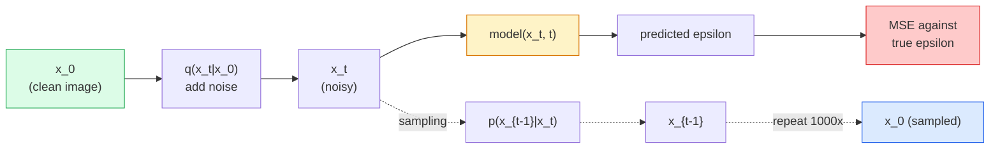

# Image Generation — Diffusion Models

> Diffusion models learn to denoise. Train one to remove a tiny bit of noise from a noisy image, repeat that process backwards a thousand times, and you have an image generator.

**Type:** Build
**Languages:** Python
**Prerequisites:** Phase 4 Lesson 07 (U-Net), Phase 1 Lesson 06 (Probability), Phase 3 Lesson 06 (Optimizers)
**Time:** ~75 minutes

## Learning Objectives

- Derive the forward noising process `x_0 -> x_1 -> ... -> x_T` and explain why the closed-form `q(x_t | x_0)` holds for arbitrary t
- Implement a DDPM-style training objective that regresses the noise added at each step, plus a sampler that walks from pure noise back to an image
- Build a time-conditioned U-Net (small enough to train on CPU) that predicts noise for any timestep
- Explain the difference between DDPM and DDIM sampling, and when each is appropriate (Lesson 23 covers flow matching and rectified flow in depth)

## The Problem

GANs generate in one shot: noise in, image out, single forward pass. They're fast but hard to train. Diffusion models generate iteratively: start from pure noise, denoise in small steps, image emerges. They're slow but easy to train. Over the past five years, the latter property has won: any small team can train a diffusion model and get decent samples, while GAN training is a craft learned through years of failed runs.

Beyond training stability, diffusion's iterative structure unlocks everything modern image generation does: text conditioning, inpainting, image editing, super-resolution, controllable style. Every step of the sampling loop is a place to inject new constraints. This hook is why Stable Diffusion, Imagen, DALL-E 3, Midjourney, and every controllable image model you'll use are diffusion-based.

This lesson builds a minimal DDPM: forward noising, reverse denoising, training loop. The next lesson (Stable Diffusion) plugs it into a production system with a VAE, text encoder, and classifier-free guidance.

## The Concept

### Forward Process

Take an image `x_0`. Add a tiny bit of Gaussian noise to get `x_1`. Add a bit more to get `x_2`. Continue for T steps until `x_T` is nearly indistinguishable from pure Gaussian noise.

```
q(x_t | x_{t-1}) = N(x_t; sqrt(1 - beta_t) * x_{t-1},  beta_t * I)
```

`beta_t` is a small variance schedule, typically ramping linearly from 0.0001 to 0.02 over T=1000 steps. Each step slightly shrinks the signal and injects fresh noise.

### Closed-Form Skip

Step-by-step noising is a Markov chain, but the math collapses: you can sample `x_t` from `x_0` directly in one step.

```
Define alpha_t = 1 - beta_t
Define alpha_bar_t = prod_{s=1..t} alpha_s

Then:
  q(x_t | x_0) = N(x_t; sqrt(alpha_bar_t) * x_0,  (1 - alpha_bar_t) * I)

Equivalently:
  x_t = sqrt(alpha_bar_t) * x_0 + sqrt(1 - alpha_bar_t) * epsilon
  where epsilon ~ N(0, I)
```

This single equation is what makes diffusion practical. During training you pick a random `t`, sample `x_t` from `x_0` directly, and train in one step — no need to simulate the full Markov chain.

### Reverse Process

The forward process is fixed. The reverse process `p(x_{t-1} | x_t)` is what the neural network learns. Diffusion models don't directly predict `x_{t-1}`; they predict the noise `epsilon` added at step t, and the math derives `x_{t-1}` from that.



### Training Loss

Each training step:

1. Sample a real image `x_0`.
2. Sample a timestep `t` uniformly from [1, T].
3. Sample noise `epsilon ~ N(0, I)`.
4. Compute `x_t = sqrt(alpha_bar_t) * x_0 + sqrt(1 - alpha_bar_t) * epsilon`.
5. Predict `epsilon_theta(x_t, t)` with the network.
6. Minimize `|| epsilon - epsilon_theta(x_t, t) ||^2`.

That's it. The network learns to predict noise at any timestep. The loss is MSE. No adversarial game, no collapse, no oscillation.

### Sampler (DDPM)

To generate: start from `x_T ~ N(0, I)` and step backwards.

```
for t = T, T-1, ..., 1:
    eps = model(x_t, t)
    x_{t-1} = (1 / sqrt(alpha_t)) * (x_t - (beta_t / sqrt(1 - alpha_bar_t)) * eps) + sqrt(beta_t) * z
    where z ~ N(0, I) if t > 1, else 0
return x_0
```

The key insight: while the reverse conditional distribution generally has no closed-form solution, for this specific Gaussian forward process, it does. Those ugly coefficients are what Bayes' rule gives you.

### Why 1000 Steps

The forward noise schedule is chosen so that each step adds just enough noise to make the reverse step approximately Gaussian. Too few steps and the reverse step is far from Gaussian — the network can't model it well. Too many and sampling gets expensive with diminishing returns. T=1000 with a linear schedule is the DDPM default.

### DDIM: 20x Faster Sampling

Same training. Different sampling. DDIM (Song et al., 2020) defines a deterministic reverse process that can skip timesteps without retraining. Using DDIM with 50 steps gives quality close to 1000-step DDPM. Every production system uses DDIM or faster variants (DPM-Solver, Euler ancestral).

### Time Conditioning

The network `epsilon_theta(x_t, t)` needs to know which timestep it's denoising. Modern diffusion models inject `t` via sinusoidal time embeddings (same idea as positional encoding in transformers), which get added to feature maps at every layer of the U-Net.

```
t_embedding = sinusoidal(t)
feature_map += MLP(t_embedding)
```

Without time conditioning, the network must guess noise level from the image itself — it works, but is far less sample-efficient.

## Build It

### Step 1: Noise Schedule

```python
import torch

def linear_beta_schedule(T=1000, beta_start=1e-4, beta_end=2e-2):
    return torch.linspace(beta_start, beta_end, T)


def precompute_schedule(betas):
    alphas = 1.0 - betas
    alphas_cumprod = torch.cumprod(alphas, dim=0)
    return {
        "betas": betas,
        "alphas": alphas,
        "alphas_cumprod": alphas_cumprod,
        "sqrt_alphas_cumprod": torch.sqrt(alphas_cumprod),
        "sqrt_one_minus_alphas_cumprod": torch.sqrt(1.0 - alphas_cumprod),
        "sqrt_recip_alphas": torch.sqrt(1.0 / alphas),
    }

schedule = precompute_schedule(linear_beta_schedule(T=1000))
```

Precompute once, gather by index during training and sampling.

### Step 2: Forward Diffusion (q_sample)

```python
def q_sample(x0, t, noise, schedule):
    sqrt_a = schedule["sqrt_alphas_cumprod"][t].view(-1, 1, 1, 1)
    sqrt_one_minus_a = schedule["sqrt_one_minus_alphas_cumprod"][t].view(-1, 1, 1, 1)
    return sqrt_a * x0 + sqrt_one_minus_a * noise
```

One-line closed form. `t` is a batch of timesteps, one per image in the batch.

### Step 3: A Tiny Time-Conditioned U-Net

```python
import torch.nn as nn
import torch.nn.functional as F
import math

def timestep_embedding(t, dim=64):
    half = dim // 2
    freqs = torch.exp(-math.log(10000) * torch.arange(half, device=t.device) / half)
    args = t[:, None].float() * freqs[None]
    emb = torch.cat([args.sin(), args.cos()], dim=-1)
    return emb


class TinyUNet(nn.Module):
    def __init__(self, img_channels=3, base=32, t_dim=64):
        super().__init__()
        self.t_mlp = nn.Sequential(
            nn.Linear(t_dim, base * 4),
            nn.SiLU(),
            nn.Linear(base * 4, base * 4),
        )
        self.t_dim = t_dim
        self.enc1 = nn.Conv2d(img_channels, base, 3, padding=1)
        self.enc2 = nn.Conv2d(base, base * 2, 4, stride=2, padding=1)
        self.mid = nn.Conv2d(base * 2, base * 2, 3, padding=1)
        self.dec1 = nn.ConvTranspose2d(base * 2, base, 4, stride=2, padding=1)
        self.dec2 = nn.Conv2d(base * 2, img_channels, 3, padding=1)
        self.time_proj = nn.Linear(base * 4, base * 2)

    def forward(self, x, t):
        t_emb = timestep_embedding(t, self.t_dim)
        t_emb = self.t_mlp(t_emb)
        t_proj = self.time_proj(t_emb)[:, :, None, None]

        h1 = F.silu(self.enc1(x))
        h2 = F.silu(self.enc2(h1)) + t_proj
        h3 = F.silu(self.mid(h2))
        d1 = F.silu(self.dec1(h3))
        d2 = torch.cat([d1, h1], dim=1)
        return self.dec2(d2)
```

Two-level U-Net with time conditioning injected at the bottleneck. Scale up depth and width for real images.

### Step 4: Training Loop

```python
def train_step(model, x0, schedule, optimizer, device, T=1000):
    model.train()
    x0 = x0.to(device)
    bs = x0.size(0)
    t = torch.randint(0, T, (bs,), device=device)
    noise = torch.randn_like(x0)
    x_t = q_sample(x0, t, noise, schedule)
    pred = model(x_t, t)
    loss = F.mse_loss(pred, noise)
    optimizer.zero_grad()
    loss.backward()
    optimizer.step()
    return loss.item()
```

That's the entire training loop. No GAN game, no specialized loss — a single MSE call.

### Step 5: Sampler (DDPM)

```python
@torch.no_grad()
def sample(model, schedule, shape, T=1000, device="cpu"):
    model.eval()
    x = torch.randn(shape, device=device)
    betas = schedule["betas"].to(device)
    sqrt_one_minus_a = schedule["sqrt_one_minus_alphas_cumprod"].to(device)
    sqrt_recip_alphas = schedule["sqrt_recip_alphas"].to(device)

    for t in reversed(range(T)):
        t_batch = torch.full((shape[0],), t, dtype=torch.long, device=device)
        eps = model(x, t_batch)
        coef = betas[t] / sqrt_one_minus_a[t]
        mean = sqrt_recip_alphas[t] * (x - coef * eps)
        if t > 0:
            x = mean + torch.sqrt(betas[t]) * torch.randn_like(x)
        else:
            x = mean
    return x
```

1000 forward passes produce a batch of samples. In real code you'd swap this for a 50-step DDIM sampler.

### Step 6: DDIM Sampler (Deterministic, ~20x Faster)

```python
@torch.no_grad()
def sample_ddim(model, schedule, shape, steps=50, T=1000, device="cpu", eta=0.0):
    model.eval()
    x = torch.randn(shape, device=device)
    alphas_cumprod = schedule["alphas_cumprod"].to(device)

    ts = torch.linspace(T - 1, 0, steps + 1).long()
    for i in range(steps):
        t = ts[i]
        t_prev = ts[i + 1]
        t_batch = torch.full((shape[0],), t, dtype=torch.long, device=device)
        eps = model(x, t_batch)
        a_t = alphas_cumprod[t]
        a_prev = alphas_cumprod[t_prev] if t_prev >= 0 else torch.tensor(1.0, device=device)
        x0_pred = (x - torch.sqrt(1 - a_t) * eps) / torch.sqrt(a_t)
        sigma = eta * torch.sqrt((1 - a_prev) / (1 - a_t) * (1 - a_t / a_prev))
        dir_xt = torch.sqrt(1 - a_prev - sigma ** 2) * eps
        noise = sigma * torch.randn_like(x) if eta > 0 else 0
        x = torch.sqrt(a_prev) * x0_pred + dir_xt + noise
    return x
```

`eta=0` is fully deterministic (same noise input always produces same output). `eta=1` recovers DDPM.

## Use It

For production work, use `diffusers`:

```python
from diffusers import DDPMScheduler, UNet2DModel

unet = UNet2DModel(sample_size=32, in_channels=3, out_channels=3, layers_per_block=2)
scheduler = DDPMScheduler(num_train_timesteps=1000)
```

This library provides ready-made schedulers (DDPM, DDIM, DPM-Solver, Euler, Heun), configurable U-Nets, text-to-image and image-to-image pipelines, and LoRA fine-tuning helpers.

For research, `k-diffusion` (Katherine Crowson) has the most faithful reference implementations and the best sampling variants.

## Ship It

This lesson produces:

- `outputs/prompt-diffusion-sampler-picker.md` — a prompt that picks between DDPM / DDIM / DPM-Solver / Euler based on quality target, latency budget, and conditioning type.
- `outputs/skill-noise-schedule-designer.md` — a skill that produces a linear, cosine, or sigmoid beta schedule given T and target corruption level, plus a diagnostic plot of signal-to-noise ratio over time.

## Exercises

1. **(Easy)** Visualize the forward process: take one image and plot `x_t` at `t in [0, 100, 250, 500, 750, 1000]`. Verify that `x_1000` looks like pure Gaussian noise.
2. **(Medium)** Train TinyUNet on the synthetic circle dataset for 20 epochs, sample 16 circles. Compare DDPM (1000 steps) and DDIM (50 steps) sampling — starting from the same noise seed, do they produce similar images?
3. **(Hard)** Implement a cosine noise schedule (Nichol & Dhariwal, 2021): `alpha_bar_t = cos^2((t/T + s) / (1 + s) * pi / 2)`. Train the same model with linear and cosine schedules, and show that cosine gives better samples at low step counts.

## Key Terms

| Term | What people say | What it actually is |
|------|----------------|----------------------|
| Forward process | "adding noise over time" | A fixed Markov chain that corrupts an image into Gaussian noise over T steps |
| Reverse process | "denoising step by step" | A learned distribution that walks from noise back to an image |
| Epsilon prediction | "predict the noise" | Training objective: `epsilon_theta(x_t, t)` predicts the noise added at step t |
| Beta schedule | "noise amount" | A sequence of T small variances defining how much noise enters at each step |
| alpha_bar_t | "cumulative retention factor" | Product of (1 - beta_s) up to time t; larger t means less signal remains |
| DDPM sampler | "ancestral, stochastic" | Samples each x_{t-1} from a conditional Gaussian; 1000 steps |
| DDIM sampler | "deterministic, fast" | Rewrites sampling as a deterministic ODE; 20-100 steps, similar quality |
| Time conditioning | "telling the model which t" | Sinusoidal embedding of t injected into U-Net so it knows the noise level |

## Further Reading

- [Denoising Diffusion Probabilistic Models (Ho et al., 2020)](https://arxiv.org/abs/2006.11239) — the paper that made diffusion practical and beat GANs on FID
- [Improved DDPM (Nichol & Dhariwal, 2021)](https://arxiv.org/abs/2102.09672) — cosine schedule and v-parameterisation
- [DDIM (Song, Meng, Ermon, 2020)](https://arxiv.org/abs/2010.02502) — the deterministic sampler that made real-time inference possible
- [Elucidating the Design Space of Diffusion (Karras et al., 2022)](https://arxiv.org/abs/2206.00364) — a unified view of every diffusion design choice; current best reference
