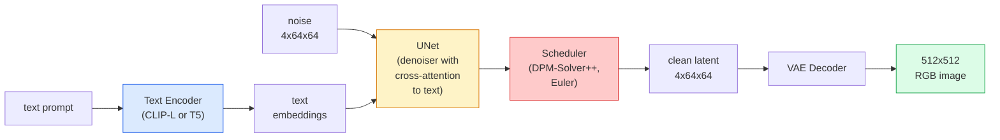

# Stable Diffusion — Architecture and Fine-Tuning

> Stable Diffusion is a DDPM running in a pretrained VAE's latent space, conditioned on text via cross-attention, sampled with a fast deterministic ODE solver, and steered by classifier-free guidance.

**Type:** Learn + Use
**Languages:** Python
**Prerequisites:** Phase 4 Lesson 10 (Diffusion), Phase 7 Lesson 02 (Self-Attention)
**Time:** ~75 minutes

## Learning Objectives

- Trace the five components of a Stable Diffusion pipeline: VAE, text encoder, U-Net, scheduler, safety checker — and what each one actually does
- Explain latent diffusion and why training in a 4x64x64 latent space (instead of 3x512x512 images) reduces compute by 48x without quality loss
- Use `diffusers` to generate images, run img2img, inpainting, and ControlNet-guided generation
- Fine-tune Stable Diffusion on a small custom dataset with LoRA and load LoRA adapters at inference

## The Problem

Training DDPM directly on 512x512 RGB images is expensive. Each training step backpropagates through a U-Net that sees 3x512x512 = 786,432 input values, and sampling requires 50+ forward passes through the same U-Net. At the quality level of Stable Diffusion 1.5 (released 2022), pixel-space diffusion would take roughly 256 GPU-months of training and 10-30 seconds per image on consumer GPUs.

The trick that made open-weight text-to-image practical is **latent diffusion** (Rombach et al., CVPR 2022). Train a VAE that maps a 3x512x512 image to a 4x64x64 latent tensor and back, then run diffusion in that latent space. Compute drops `(3*512*512)/(4*64*64) = 48x`. On the same GPU, sampling goes from tens of seconds to under two seconds.

Nearly every modern image generation model — SDXL, SD3, FLUX, HunyuanDiT, Wan-Video — is a latent diffusion model varying only the autoencoder, denoiser (U-Net or DiT), and text conditioning. Learn Stable Diffusion and you learn the template.

## The Concept

### Pipeline



- **VAE** — frozen autoencoder. Encoder converts images to latents (used for img2img and training). Decoder converts latents back to images.
- **Text encoder** — CLIP text encoder (SD 1.x/2.x), CLIP-L + CLIP-G (SDXL), or T5-XXL (SD3/FLUX). Produces a sequence of token embeddings.
- **U-Net** — the denoiser. Contains cross-attention layers that attend from latents to text embeddings at each resolution.
- **Scheduler** — the sampling algorithm (DDIM, Euler, DPM-Solver++). Picks sigmas, mixes predicted noise back into the latent.
- **Safety checker** — optional NSFW / illegal-content filter on the output image.

### Classifier-Free Guidance (CFG)

Naive text conditioning learns `epsilon_theta(x_t, t, c)` for each prompt `c`. CFG trains with the same network but drops `c` 10% of the time (replaces with null embedding), yielding a single model that predicts both conditional and unconditional noise. At inference:

```
eps = eps_uncond + w * (eps_cond - eps_uncond)
```

`w` is the guidance scale. `w=0` is unconditional, `w=1` is naive conditioning, `w>1` pushes output toward "more constrained by the prompt" at the cost of diversity. SD defaults to `w=7.5`.

CFG is why text-to-image reaches production quality. Without it, the prompt's bias on the output is weak; with it, the prompt dominates.

### Latent Space Geometry

The VAE's 4-channel latent is not just a compressed image. It's a manifold where arithmetic roughly corresponds to semantic edits (prompt engineering + interpolation live here), and the diffusion U-Net is trained to spend its entire modeling budget here. Decoding a random 4x64x64 latent doesn't produce a random-looking image — it produces garbage, because only a specific sub-manifold of latents decodes to valid images.

Two consequences:

1. **Img2img** = encode the image to a latent, add partial noise, run the denoiser, decode. Image structure is preserved because encoding is approximately invertible; content changes according to the prompt.
2. **Inpainting** = same as img2img, but the denoiser only updates masked regions; unmasked regions stay pinned to the encoded latent.

### U-Net Architecture

SD's U-Net is the scaled-up version of Lesson 10's TinyUNet with three additions:

- **Transformer blocks** at each spatial resolution containing self-attention + cross-attention to text embeddings.
- **Time embeddings** via MLP on sinusoidal encoding.
- **Skip connections** between encoder and decoder at matching resolutions.

SD 1.5 total parameters: ~860M. SDXL: ~2.6B. FLUX: ~12B. The jump is mostly in attention layers.

### LoRA Fine-Tuning

Full fine-tuning of Stable Diffusion requires 20+ GB VRAM and updates 860M parameters. LoRA (Low-Rank Adaptation) keeps the base model frozen and injects small rank-decomposed matrices into attention layers. A LoRA adapter for SD is typically 10-50 MB, trains in 10-60 minutes on a single consumer GPU, and loads as a plug-and-play modifier at inference.

```
Original: W_q : (d_in, d_out)   frozen
LoRA: W_q + alpha * (A @ B)   where A : (d_in, r), B : (r, d_out)

r is typically 4-32.
```

LoRA is how nearly every community fine-tune is distributed. CivitAI and Hugging Face host millions.

### Schedulers You'll Encounter

- **DDIM** — deterministic, ~50 steps, simple.
- **Euler ancestral** — stochastic, 30-50 steps, slightly more creative samples.
- **DPM-Solver++ 2M Karras** — deterministic, 20-30 steps, production default.
- **LCM / TCD / Turbo** — consistency model and distillation variants; 1-4 steps at the cost of some quality.

Switching schedulers is a one-line change in `diffusers` and can sometimes fix sample issues without any retraining.

## Build It

This lesson uses `diffusers` end-to-end rather than rebuilding Stable Diffusion from scratch. The components you'd rebuild (VAE, text encoder, U-Net, scheduler) are each the subject of separate lessons; the goal here is fluency with the production API.

### Step 1: Text-to-Image

```python
import torch
from diffusers import StableDiffusionPipeline

pipe = StableDiffusionPipeline.from_pretrained(
    "runwayml/stable-diffusion-v1-5",
    torch_dtype=torch.float16,
).to("cuda")

image = pipe(
    prompt="a dog riding a skateboard in tokyo, studio ghibli style",
    guidance_scale=7.5,
    num_inference_steps=25,
    generator=torch.Generator("cuda").manual_seed(42),
).images[0]
image.save("dog.png")
```

`float16` halves VRAM with no visible quality loss. `num_inference_steps=25` with the default DPM-Solver++ is comparable to `num_inference_steps=50` with DDIM.

### Step 2: Switching Schedulers

```python
from diffusers import DPMSolverMultistepScheduler, EulerAncestralDiscreteScheduler

pipe.scheduler = DPMSolverMultistepScheduler.from_config(pipe.scheduler.config)
pipe.scheduler = EulerAncestralDiscreteScheduler.from_config(pipe.scheduler.config)
```

Scheduler state is decoupled from U-Net weights. You can train on DDPM and sample with any scheduler.

### Step 3: Image-to-Image

```python
from diffusers import StableDiffusionImg2ImgPipeline
from PIL import Image

img2img = StableDiffusionImg2ImgPipeline.from_pretrained(
    "runwayml/stable-diffusion-v1-5",
    torch_dtype=torch.float16,
).to("cuda")

init_image = Image.open("dog.png").convert("RGB").resize((512, 512))
out = img2img(
    prompt="a dog riding a skateboard, oil painting",
    image=init_image,
    strength=0.6,
    guidance_scale=7.5,
).images[0]
```

`strength` controls how much noise is added before denoising (0.0 = unchanged, 1.0 = full regeneration). 0.5-0.7 is the standard range for style transfer.

### Step 4: Inpainting

```python
from diffusers import StableDiffusionInpaintPipeline

inpaint = StableDiffusionInpaintPipeline.from_pretrained(
    "runwayml/stable-diffusion-inpainting",
    torch_dtype=torch.float16,
).to("cuda")

image = Image.open("dog.png").convert("RGB").resize((512, 512))
mask = Image.open("dog_mask.png").convert("L").resize((512, 512))

out = inpaint(
    prompt="a cat",
    image=image,
    mask_image=mask,
    guidance_scale=7.5,
).images[0]
```

White pixels in the mask are regions to regenerate. Black pixels are preserved.

### Step 5: LoRA Loading

```python
pipe.load_lora_weights("sayakpaul/sd-lora-ghibli")
pipe.fuse_lora(lora_scale=0.8)

image = pipe(prompt="a village square in ghibli style").images[0]
```

`lora_scale` controls strength; 0.0 = no effect, 1.0 = full effect. `fuse_lora` bakes the adapter into weights in-place for speed, but it can't be swapped afterwards. Call `pipe.unfuse_lora()` before loading another adapter.

### Step 6: LoRA Training (Sketch)

Real LoRA training lives in `peft` or `diffusers.training`. The outline:

```python
# pseudocode
for step, batch in enumerate(dataloader):
    images, prompts = batch
    latents = vae.encode(images).latent_dist.sample() * 0.18215

    t = torch.randint(0, num_train_timesteps, (batch_size,))
    noise = torch.randn_like(latents)
    noisy_latents = scheduler.add_noise(latents, noise, t)

    text_emb = text_encoder(tokenizer(prompts))

    pred_noise = unet(noisy_latents, t, text_emb)  # LoRA weights injected here

    loss = F.mse_loss(pred_noise, noise)
    loss.backward()
    optimizer.step()
```

Only LoRA matrices receive gradients; the base U-Net, VAE, and text encoder stay frozen. With batch size 1 and gradient checkpointing, this fits in 8 GB VRAM.

## Use It

In production, the real decisions you make:

- **Model family**: SD 1.5 for open-source community fine-tunes, SDXL for higher fidelity, SD3 / FLUX for state-of-the-art and strict licensing requirements.
- **Scheduler**: DPM-Solver++ 2M Karras for 20-30 steps, LCM-LoRA when latency must be under 1s.
- **Precision**: `float16` on 4080/4090, `bfloat16` on A100 and newer, `int8` (via `bitsandbytes` or `compel`) when VRAM is tight.
- **Conditioning**: plain text works; for stronger control, add ControlNet (canny, depth, pose) on top of the base pipeline.

For batch generation use community tools `AUTO1111` / `ComfyUI`; for production APIs use `diffusers` + `accelerate`, or `optimum-nvidia` with TensorRT compilation.

## Ship It

This lesson produces:

- `outputs/prompt-sd-pipeline-planner.md` — a prompt that picks SD 1.5 / SDXL / SD3 / FLUX plus scheduler and precision given a latency budget, fidelity target, and licensing constraints.
- `outputs/skill-lora-training-setup.md` — a skill that writes a complete LoRA training configuration for a custom dataset, including captions, rank, batch size, and learning rate.

## Exercises

1. **(Easy)** Generate the same prompt with `guidance_scale` values of `[1, 3, 5, 7.5, 10, 15]`. Describe how the images change. At which guidance value do artifacts start appearing?
2. **(Medium)** Take any real photo and run it through `StableDiffusionImg2ImgPipeline` at `strength` values of `[0.2, 0.4, 0.6, 0.8, 1.0]`. Which strength changes style while preserving composition? Why does 1.0 completely ignore the input?
3. **(Hard)** Train a LoRA on 10-20 images of a single subject (pet, logo, character) and generate novel scenes with that subject. Report the LoRA rank and training steps that produce the best identity preservation without overfitting to the input images.

## Key Terms

| Term | What people say | What it actually is |
|------|----------------|----------------------|
| Latent diffusion | "diffusion in latent space" | Running the entire DDPM in a VAE latent space (4x64x64) instead of pixel space (3x512x512); saves 48x compute |
| VAE scaling factor | "0.18215" | A constant that rescales raw VAE latents to roughly unit variance; hardcoded in every SD pipeline |
| Classifier-free guidance | "CFG" | Blending conditional and unconditional noise predictions; the single most impactful inference knob |
| Scheduler | "sampler" | The algorithm that turns noise + model predictions into a denoised latent trajectory |
| LoRA | "low-rank adapter" | Small rank-decomposed matrices that fine-tune attention layers without touching base weights |
| Cross-attention | "text-image attention" | Attention from latent tokens to text tokens; injects prompt information at every U-Net layer |
| ControlNet | "structural conditioning" | A separately trained adapter that steers SD with additional inputs (canny, depth, pose, segmentation) |
| DPM-Solver++ | "default scheduler" | Second-order deterministic ODE solver; best quality at low step counts (20-30) as of 2026 |

## Further Reading

- [High-Resolution Image Synthesis with Latent Diffusion (Rombach et al., 2022)](https://arxiv.org/abs/2112.10752) — the Stable Diffusion paper; contains every ablation justifying the design
- [Classifier-Free Diffusion Guidance (Ho & Salimans, 2022)](https://arxiv.org/abs/2207.12598) — the CFG paper
- [LoRA: Low-Rank Adaptation of Large Language Models (Hu et al., 2021)](https://arxiv.org/abs/2106.09685) — LoRA was originally for NLP; transferred to SD with almost no changes
- [diffusers documentation](https://huggingface.co/docs/diffusers) — reference for every SD / SDXL / SD3 / FLUX pipeline
