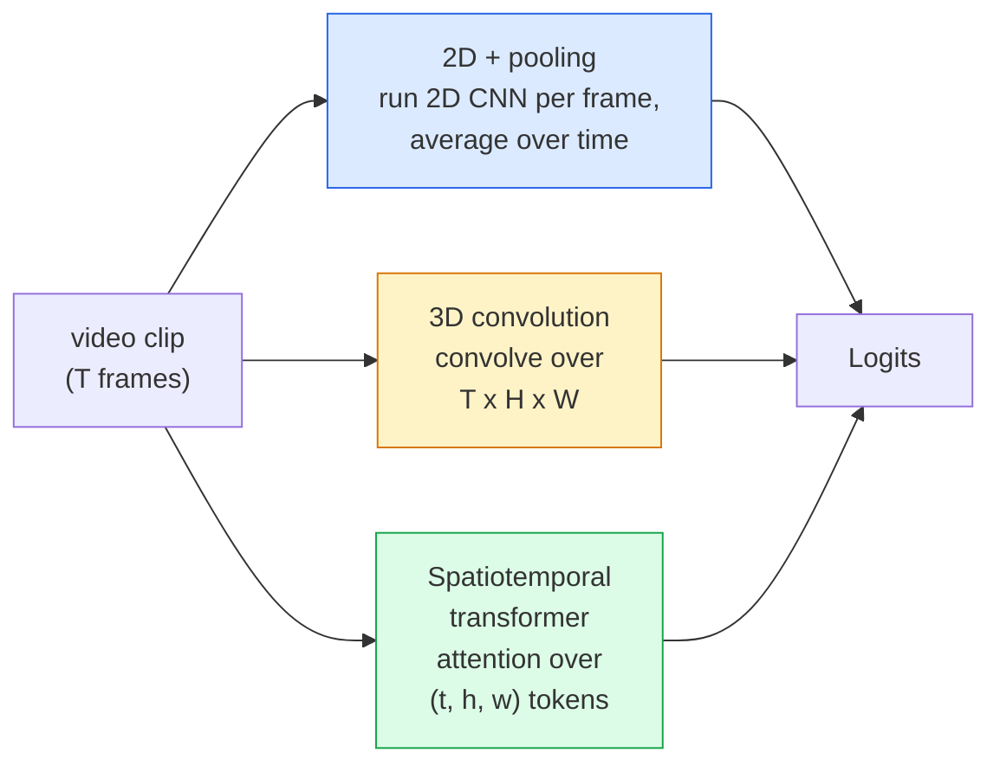

# Video Understanding — Temporal Modeling

> A video is a sequence of images plus the physics that ties them together. Every video model either treats time as an extra axis (3D convolution), an attendable sequence (transformer), or a feature to extract once and pool (2D+pooling).

**Type:** Learn + Build
**Languages:** Python
**Prerequisites:** Phase 4 Lesson 03 (CNN), Phase 4 Lesson 04 (Image Classification)
**Time:** ~45 minutes

## Learning Objectives

- Distinguish the three main video modeling approaches (2D+pooling, 3D convolution, spatiotemporal transformer) and predict their cost vs. accuracy tradeoffs
- Implement frame sampling, temporal pooling, and a 2D+pooling baseline classifier in PyTorch
- Explain why I3D's "inflated" 3D kernels transfer well from ImageNet weights, and how factorized (2+1)D convolutions differ
- Read standard action recognition datasets and metrics: Kinetics-400/600, UCF101, Something-Something V2; clip-level and video-level top-1 accuracy

## The Problem

A 30-second, 30 fps video is 900 images. Naively, video classification is running image classification 900 times and aggregating. This works when the action is visible in nearly every frame (sports, cooking, fitness videos); it fails badly when the action is defined by motion itself: "pushing something from left to right" looks like two stationary objects in every single frame.

The core question every video architecture answers: when and how is temporal structure modeled? The answer drives everything else — compute cost, pretraining strategy, whether ImageNet weights can be reused, what datasets the model trains on.

This lesson is intentionally shorter than the static image lessons. The core image machinery is already in place; video understanding is mostly about the temporal thread: sampling, modeling, aggregation.

## The Concept

### Three Architecture Families



### 2D + Pooling

Take a 2D CNN (ResNet, EfficientNet, ViT). Run it on each sampled frame independently. Average (or max-pool, or attention-pool) the per-frame embeddings. Feed the pooled vector to a classifier.

Pros:
- ImageNet pretraining transfers directly.
- Simplest implementation.
- Cheap: T frames * single-image inference cost.

Cons:
- Cannot model motion. Action = aggregate of appearance.
- Temporal pooling is order-invariant; "opening a door" and "closing a door" look the same.

When to use: appearance-dominated tasks, transfer learning on small video datasets, initial baseline.

### 3D Convolution

Replace 2D (H, W) kernels with 3D (T, H, W) kernels. The network convolves over both space and time. Early families: C3D, I3D, SlowFast.

The I3D trick: take a pretrained 2D ImageNet model and "inflate" each 2D kernel by repeating it along a new temporal axis. A 3x3 2D convolution becomes a 3x3x3 3D convolution. This gives the 3D model strong pretrained weights without training from scratch.

Pros:
- Directly models motion.
- I3D inflation gives free transfer learning.

Cons:
- T/8 more FLOPs than the 2D counterpart (with temporal kernel of 3, stacked 3 times).
- Temporal kernels are small; long-range motion needs pyramids or two-stream approaches.

When to use: action recognition where motion is the signal (Something-Something V2, motion-heavy classes in Kinetics).

### Spatiotemporal Transformer

Tokenize the video into a grid of spatiotemporal patches, attend over all patches. TimeSformer, ViViT, Video Swin, VideoMAE.

Attention patterns that matter:
- **Joint** — one big attention over (t, h, w). Quadratic in `T*H*W`; expensive.
- **Divided** — two attentions per block: one over time, one over space. Approximately linear scaling.
- **Factorised** — temporal and spatial attention alternate across blocks.

Pros:
- SOTA accuracy on every major benchmark.
- Transfers from image transformers (ViT) via patch inflation.
- Supports long-context video via sparse attention.

Cons:
- Compute-hungry.
- Requires careful attention pattern selection or runtime blows up.

When to use: large datasets, high-fidelity video understanding, multimodal video+text tasks.

### Frame Sampling

A 10-second, 30 fps clip is 300 frames; feeding all 300 to any model is wasteful. Standard strategies:

- **Uniform sampling** — pick T frames uniformly across the clip. Default for 2D+pooling.
- **Dense sampling** — a random contiguous window of T frames. Common for 3D convolutions since motion needs adjacent frames.
- **Multi-clip** — sample multiple T-frame windows from the same video, classify each, average predictions at test time.

T is typically 8, 16, 32, or 64. Higher T = more temporal signal, more compute.

### Evaluation

Two levels:
- **Clip-level accuracy** — the model sees one T-frame clip and reports top-k.
- **Video-level accuracy** — average clip-level predictions across multiple clips per video; higher and more stable.

Always report both. A model at 78% clip / 82% video relies heavily on test-time averaging; one at 80% / 81% is more robust on a single clip.

### Datasets You'll Encounter

- **Kinetics-400 / 600 / 700** — general action dataset. 400K clips; YouTube URLs (many now dead).
- **Something-Something V2** — motion-defined actions ("moving X from left to right"). Cannot be solved with 2D+pooling.
- **UCF-101**, **HMDB-51** — older, smaller, still reported.
- **AVA** — action *localization* in space and time; harder than classification.

## Build It

### Step 1: Frame Sampler

Uniform and dense samplers that operate on a list of frames (or a video tensor).

```python
import numpy as np

def sample_uniform(num_frames_total, T):
    if num_frames_total <= T:
        return list(range(num_frames_total)) + [num_frames_total - 1] * (T - num_frames_total)
    step = num_frames_total / T
    return [int(i * step) for i in range(T)]


def sample_dense(num_frames_total, T, rng=None):
    rng = rng or np.random.default_rng()
    if num_frames_total <= T:
        return list(range(num_frames_total)) + [num_frames_total - 1] * (T - num_frames_total)
    start = int(rng.integers(0, num_frames_total - T + 1))
    return list(range(start, start + T))
```

Both return `T` indices that you use to slice the video tensor.

### Step 2: A 2D+Pooling Baseline

Run a 2D ResNet-18 on each frame, average-pool features, classify.

```python
import torch
import torch.nn as nn
from torchvision.models import resnet18, ResNet18_Weights

class FramePool(nn.Module):
    def __init__(self, num_classes=400, pretrained=True):
        super().__init__()
        weights = ResNet18_Weights.IMAGENET1K_V1 if pretrained else None
        backbone = resnet18(weights=weights)
        self.features = nn.Sequential(*(list(backbone.children())[:-1]))  # keep global avg pool
        self.head = nn.Linear(512, num_classes)

    def forward(self, x):
        # x: (N, T, 3, H, W)
        N, T = x.shape[:2]
        x = x.view(N * T, *x.shape[2:])
        feats = self.features(x).view(N, T, -1)
        pooled = feats.mean(dim=1)
        return self.head(pooled)

model = FramePool(num_classes=10)
x = torch.randn(2, 8, 3, 224, 224)
print(f"output: {model(x).shape}")
print(f"params: {sum(p.numel() for p in model.parameters()):,}")
```

11 million parameters, ImageNet-pretrained, per-frame forward, average, classify. On appearance-heavy tasks this baseline is often within 5-10 points of proper 3D models — sometimes better, because it reuses a stronger ImageNet backbone.

### Step 3: An I3D-Style Inflated 3D Convolution

Repeat the weights of a single 2D convolution along a new temporal axis to turn it into a 3D convolution.

```python
def inflate_2d_to_3d(conv2d, time_kernel=3):
    out_c, in_c, kh, kw = conv2d.weight.shape
    weight_3d = conv2d.weight.data.unsqueeze(2)  # (out, in, 1, kh, kw)
    weight_3d = weight_3d.repeat(1, 1, time_kernel, 1, 1) / time_kernel
    conv3d = nn.Conv3d(in_c, out_c, kernel_size=(time_kernel, kh, kw),
                        padding=(time_kernel // 2, conv2d.padding[0], conv2d.padding[1]),
                        stride=(1, conv2d.stride[0], conv2d.stride[1]),
                        bias=False)
    conv3d.weight.data = weight_3d
    return conv3d

conv2d = nn.Conv2d(3, 64, kernel_size=3, padding=1, bias=False)
conv3d = inflate_2d_to_3d(conv2d, time_kernel=3)
print(f"2D weight shape:  {tuple(conv2d.weight.shape)}")
print(f"3D weight shape:  {tuple(conv3d.weight.shape)}")
x = torch.randn(1, 3, 8, 56, 56)
print(f"3D output shape:  {tuple(conv3d(x).shape)}")
```

Dividing by `time_kernel` keeps activation magnitudes roughly the same — important for not breaking batch normalization statistics on the first pass.

### Step 4: Factorized (2+1)D Convolution

Split a 3D convolution into a 2D (spatial) and a 1D (temporal) convolution. Same receptive field, fewer parameters, better accuracy on some benchmarks.

```python
class Conv2Plus1D(nn.Module):
    def __init__(self, in_c, out_c, kernel_size=3):
        super().__init__()
        mid_c = (in_c * out_c * kernel_size * kernel_size * kernel_size) \
                // (in_c * kernel_size * kernel_size + out_c * kernel_size)
        self.spatial = nn.Conv3d(in_c, mid_c, kernel_size=(1, kernel_size, kernel_size),
                                 padding=(0, kernel_size // 2, kernel_size // 2), bias=False)
        self.bn = nn.BatchNorm3d(mid_c)
        self.act = nn.ReLU(inplace=True)
        self.temporal = nn.Conv3d(mid_c, out_c, kernel_size=(kernel_size, 1, 1),
                                  padding=(kernel_size // 2, 0, 0), bias=False)

    def forward(self, x):
        return self.temporal(self.act(self.bn(self.spatial(x))))

c = Conv2Plus1D(3, 64)
x = torch.randn(1, 3, 8, 56, 56)
print(f"(2+1)D output: {tuple(c(x).shape)}")
```

A full R(2+1)D network is a ResNet-18 with every 3x3 convolution replaced by `Conv2Plus1D`.

## Use It

Two libraries cover production video work:

- `torchvision.models.video` — R(2+1)D, MViT, Swin3D with pretrained Kinetics weights. Same API as image models.
- `pytorchvideo` (Meta) — model zoo, data loaders for Kinetics / SSv2 / AVA, standard transforms.

For vision-language video models (video captioning, video QA), use `transformers` (`VideoMAE`, `VideoLLaMA`, `InternVideo`).

## Ship It

This lesson produces:

- `outputs/prompt-video-architecture-picker.md` — a prompt that picks 2D+pooling / I3D / (2+1)D / transformer based on "appearance vs motion," dataset size, and compute budget.
- `outputs/skill-frame-sampler-auditor.md` — a skill that inspects a video pipeline's sampler and flags common bugs: off-by-one indices, non-uniform sampling when `num_frames < T`, missing aspect-ratio-preserving crops, etc.

## Exercises

1. **(Easy)** Compute the (approximate) FLOPs for FramePool (T=8) vs. an I3D-style 3D ResNet (T=8). Argue why 2D+pooling is 3-5x cheaper.
2. **(Medium)** Generate a synthetic video dataset: random balls moving in random directions, labeled by motion direction ("left-to-right," "right-to-left," "diagonal-up"). Train FramePool on it. Show it achieves near-random accuracy, proving appearance alone isn't enough for motion tasks.
3. **(Hard)** Replace every Conv2d in ResNet-18 with `Conv2Plus1D` to build an R(2+1)D-18. Inflate the first convolution's weights from an ImageNet-pretrained ResNet-18. Train on the motion dataset from Exercise 2 and beat FramePool.

## Key Terms

| Term | What people say | What it actually is |
|------|----------------|----------------------|
| 2D + pooling | "per-frame classifier" | Run a 2D CNN on each sampled frame, average-pool features over time, classify |
| 3D convolution | "spatiotemporal kernel" | A kernel that convolves over (T, H, W); natively models motion |
| Inflation | "lifting 2D weights to 3D" | Repeating a 2D convolution's weights along a new temporal axis to initialize 3D convolution weights, divided by kernel_T to preserve activation scale |
| (2+1)D | "factorized convolution" | Splitting 3D into 2D spatial + 1D temporal; fewer parameters with an extra nonlinearity in between |
| Divided attention | "time-first then space" | A transformer block with two attentions per layer: one over tokens at the same frame, one over tokens at the same position |
| Clip | "T-frame window" | A sampled subsequence of T frames; the unit consumed by video models |
| Clip vs video accuracy | "two evaluation settings" | Clip = one sample per video, video = average across multiple sampled clips |
| Kinetics | "ImageNet for video" | 400-700 action classes, 300K+ YouTube clips, the standard video pretraining corpus |

## Further Reading

- [I3D: Quo Vadis, Action Recognition (Carreira & Zisserman, 2017)](https://arxiv.org/abs/1705.07750) — introduced inflation and the Kinetics dataset
- [R(2+1)D: A Closer Look at Spatiotemporal Convolutions (Tran et al., 2018)](https://arxiv.org/abs/1711.11248) — factorized convolutions, still a strong baseline today
- [TimeSformer: Is Space-Time Attention All You Need? (Bertasius et al., 2021)](https://arxiv.org/abs/2102.05095) — the first strong video transformer
- [VideoMAE (Tong et al., 2022)](https://arxiv.org/abs/2203.12602) — masked autoencoder pretraining for video; the currently dominant pretraining recipe
