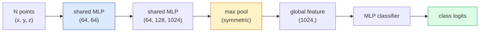

# 3D Vision — Point Clouds and NeRF

> 3D vision comes in two flavors. Point clouds are raw sensor output. NeRFs are learned volumetric fields. Both answer "what is where in space."

**Type:** Learn + Build
**Languages:** Python
**Prerequisites:** Phase 4 Lesson 03 (CNN), Phase 1 Lesson 12 (Tensor Operations)
**Time:** ~45 minutes

## Learning Objectives

- Distinguish explicit (point cloud, mesh, voxel) and implicit (signed distance field, NeRF) 3D representations, and when to use each
- Understand PointNet's symmetric function trick that gives neural networks permutation invariance over an unordered point set
- Trace a single NeRF forward pass: ray casting, volumetric rendering, positional encoding, MLP density+color heads
- Use `nerfstudio` or `instant-ngp` to do pretrained 3D reconstruction from a small set of posed images

## The Problem

A camera produces a 2D image. LIDAR produces an unordered set of 3D points. Structure-from-motion pipelines produce a sparse 3D keypoint cloud. NeRF reconstructs an entire 3D scene from a handful of posed images. These are all "vision," but none looks like the dense tensor a CNN expects.

3D vision matters because nearly every high-value robotics task runs in 3D: grasping, obstacle avoidance, navigation, AR occlusion, 3D content capture. A vision engineer who only knows 2D images is locked out of the fastest-growing segment of the field (AR/VR content, robotics, autonomous driving stacks, NeRF-based 3D reconstruction for real estate or architecture).

These two representations dominate for different reasons. Point clouds are what sensors give you for free. NeRFs and their successors (3D Gaussian Splatting, neural SDFs) are what you get when you ask a neural network to learn a scene.

## The Concept

### Point Clouds

A point cloud is an unordered set of N points in R^3, each optionally carrying features (color, intensity, normal).

```
cloud = [
  (x1, y1, z1, r1, g1, b1),
  (x2, y2, z2, r2, g2, b2),
  ...
  (xN, yN, zN, rN, gN, bN),
]
```

No grid, no connectivity. Two properties make this hard for neural networks:

- **Permutation invariance** — the output must not depend on point ordering.
- **Variable N** — a single model must handle point clouds of different sizes.

PointNet (Qi et al., 2017) solves both with one idea: apply a shared MLP to every point, then aggregate with a symmetric function (max pool). The result is a fixed-size vector independent of ordering.

```
f(P) = max_{p in P} MLP(p)
```

That's the entirety of PointNet's core. Deeper variants (PointNet++, Point Transformer) add hierarchical sampling and local aggregation, but the symmetric function trick is unchanged.

### PointNet Architecture



"Shared MLP" means the same MLP runs independently on every point. Implemented as 1x1 convolutions over the point dimension for efficiency.

### Neural Radiance Fields (NeRF)

NeRF (Mildenhall et al., 2020) takes the question "can we reconstruct a 3D scene from N photos?" and answers it with a neural network that *is* the scene. The network maps `(x, y, z, viewing_direction)` to `(density, colour)`. Rendering a novel view is a ray-casting loop over this network.

```
NeRF MLP:  (x, y, z, theta, phi) -> (sigma, r, g, b)

To render one pixel (u, v) of a novel view:
  1. Cast a ray from the camera through pixel (u, v)
  2. Sample points along the ray at distances t_1, t_2, ..., t_N
  3. Query the MLP at each point
  4. Composite colors weighted by (1 - exp(-sigma * dt))
  5. Sum to get the rendered pixel color
```

A loss compares rendered pixels to ground-truth pixels from training photos. Backpropagation through the rendering step updates the MLP. No 3D ground truth, no explicit geometry — the scene lives in the MLP weights.

### Positional Encoding in NeRF

A naive MLP eating raw `(x, y, z)` cannot represent high-frequency detail because MLPs are spectrally biased toward low frequencies. NeRF fixes this by encoding each coordinate into a Fourier feature vector before the MLP:

```
gamma(p) = (sin(2^0 pi p), cos(2^0 pi p), sin(2^1 pi p), cos(2^1 pi p), ...)
```

Up to L=10 frequency levels. This is the same trick transformers use for positions and that reappears in diffusion's time conditioning (Lesson 10). Without it, NeRF looks blurry.

### Volumetric Rendering

```
C(r) = sum_i T_i * (1 - exp(-sigma_i * delta_i)) * c_i

T_i  = exp(- sum_{j<i} sigma_j * delta_j)
delta_i = t_{i+1} - t_i
```

`T_i` is transmittance — how much light survives to point i. `(1 - exp(-sigma_i * delta_i))` is opacity at point i. `c_i` is color. The final pixel is a weighted sum along the ray.

### What Replaced NeRF

Pure NeRF is slow to train (hours) and slow to render (seconds per image). The lineage since:

- **Instant-NGP** (2022) — hash-grid encoding replaces the MLP's positional input; trains in seconds.
- **Mip-NeRF 360** — handles unbounded scenes and anti-aliasing.
- **3D Gaussian Splatting** (2023) — replaces the volumetric field with millions of 3D Gaussians; trains in minutes, renders in real time. Current production default.

In 2026, nearly every real NeRF product is actually 3D Gaussian Splatting. The mental model is still NeRF.

### Datasets and Benchmarks

- **ShapeNet** — 3D CAD models treated as point clouds for classification and segmentation.
- **ScanNet** — real indoor scans for segmentation.
- **KITTI** — outdoor LIDAR point clouds for autonomous driving.
- **NeRF Synthetic** / **Blended MVS** — posed image datasets for novel view synthesis.
- **Mip-NeRF 360** dataset — unbounded real-world scenes.

## Build It

### Step 1: PointNet Classifier

```python
import torch
import torch.nn as nn

class PointNet(nn.Module):
    def __init__(self, num_classes=10):
        super().__init__()
        self.mlp1 = nn.Sequential(
            nn.Conv1d(3, 64, 1),    nn.BatchNorm1d(64),   nn.ReLU(inplace=True),
            nn.Conv1d(64, 64, 1),   nn.BatchNorm1d(64),   nn.ReLU(inplace=True),
        )
        self.mlp2 = nn.Sequential(
            nn.Conv1d(64, 128, 1),  nn.BatchNorm1d(128),  nn.ReLU(inplace=True),
            nn.Conv1d(128, 1024, 1), nn.BatchNorm1d(1024), nn.ReLU(inplace=True),
        )
        self.head = nn.Sequential(
            nn.Linear(1024, 512),   nn.BatchNorm1d(512),  nn.ReLU(inplace=True),
            nn.Dropout(0.3),
            nn.Linear(512, 256),    nn.BatchNorm1d(256),  nn.ReLU(inplace=True),
            nn.Dropout(0.3),
            nn.Linear(256, num_classes),
        )

    def forward(self, x):
        # x: (N, 3, num_points) — transposed for Conv1d
        x = self.mlp1(x)
        x = self.mlp2(x)
        x = torch.max(x, dim=-1)[0]       # (N, 1024)
        return self.head(x)

pts = torch.randn(4, 3, 1024)
net = PointNet(num_classes=10)
print(f"output: {net(pts).shape}")
print(f"params: {sum(p.numel() for p in net.parameters()):,}")
```

About 1.6M parameters. Runs 1,024 points per point cloud.

### Step 2: Positional Encoding

```python
def positional_encoding(x, L=10):
    """
    x: (..., D) -> (..., D * 2 * L)
    """
    freqs = 2.0 ** torch.arange(L, dtype=x.dtype, device=x.device)
    args = x.unsqueeze(-1) * freqs * 3.141592653589793
    sinc = torch.cat([args.sin(), args.cos()], dim=-1)
    return sinc.reshape(*x.shape[:-1], -1)

x = torch.randn(5, 3)
y = positional_encoding(x, L=10)
print(f"input:  {x.shape}")
print(f"encoded: {y.shape}     # (5, 60)")
```

Multiplying by `2^l * pi` gives progressively higher frequencies.

### Step 3: Mini NeRF MLP

```python
class TinyNeRF(nn.Module):
    def __init__(self, L_pos=10, L_dir=4, hidden=128):
        super().__init__()
        self.L_pos = L_pos
        self.L_dir = L_dir
        pos_dim = 3 * 2 * L_pos
        dir_dim = 3 * 2 * L_dir
        self.trunk = nn.Sequential(
            nn.Linear(pos_dim, hidden), nn.ReLU(inplace=True),
            nn.Linear(hidden, hidden),  nn.ReLU(inplace=True),
            nn.Linear(hidden, hidden),  nn.ReLU(inplace=True),
            nn.Linear(hidden, hidden),  nn.ReLU(inplace=True),
        )
        self.sigma = nn.Linear(hidden, 1)
        self.color = nn.Sequential(
            nn.Linear(hidden + dir_dim, hidden // 2), nn.ReLU(inplace=True),
            nn.Linear(hidden // 2, 3), nn.Sigmoid(),
        )

    def forward(self, x, d):
        x_enc = positional_encoding(x, self.L_pos)
        d_enc = positional_encoding(d, self.L_dir)
        h = self.trunk(x_enc)
        sigma = torch.relu(self.sigma(h)).squeeze(-1)
        rgb = self.color(torch.cat([h, d_enc], dim=-1))
        return sigma, rgb

nerf = TinyNeRF()
x = torch.randn(128, 3)
d = torch.randn(128, 3)
s, c = nerf(x, d)
print(f"sigma: {s.shape}   rgb: {c.shape}")
```

Much smaller than the original NeRF (which has two depth-8 MLP trunks). Sufficient to demonstrate the architecture.

### Step 4: Volumetric Rendering Along a Ray

```python
def volumetric_render(sigma, rgb, t_vals):
    """
    sigma: (..., N_samples)
    rgb:   (..., N_samples, 3)
    t_vals: (N_samples,) distances along the ray
    """
    delta = torch.cat([t_vals[1:] - t_vals[:-1], torch.full_like(t_vals[:1], 1e10)])
    alpha = 1.0 - torch.exp(-sigma * delta)
    trans = torch.cumprod(torch.cat([torch.ones_like(alpha[..., :1]), 1.0 - alpha + 1e-10], dim=-1), dim=-1)[..., :-1]
    weights = alpha * trans
    rendered = (weights.unsqueeze(-1) * rgb).sum(dim=-2)
    depth = (weights * t_vals).sum(dim=-1)
    return rendered, depth, weights


N = 64
t_vals = torch.linspace(2.0, 6.0, N)
sigma = torch.rand(N) * 0.5
rgb = torch.rand(N, 3)
rendered, depth, weights = volumetric_render(sigma, rgb, t_vals)
print(f"rendered colour: {rendered.tolist()}")
print(f"depth:           {depth.item():.2f}")
```

One ray, 64 samples, composited into a single RGB pixel and a depth value.

## Use It

For real work:

- `nerfstudio` (Tancik et al.) — the current reference library for NeRF / Instant-NGP / Gaussian Splatting. CLI plus a web viewer.
- `pytorch3d` (Meta) — differentiable rendering, point cloud utilities, mesh operations.
- `open3d` — point cloud processing, registration, visualization.

In deployment, 3D Gaussian Splatting has largely replaced pure NeRF because it renders 100x faster. Reconstruction quality is comparable.

## Ship It

This lesson produces:

- `outputs/prompt-3d-task-router.md` — a prompt that routes to the appropriate 3D representation (point cloud, mesh, voxel, NeRF, Gaussian Splatting) based on task and input data.
- `outputs/skill-point-cloud-loader.md` — a skill that writes a PyTorch `Dataset` for .ply / .pcd / .xyz files with correct normalization, centering, and point sampling.

## Exercises

1. **(Easy)** Prove PointNet is permutation-invariant: run the same point cloud through twice, shuffling points the second time. Verify outputs match within floating-point noise.
2. **(Medium)** Implement a minimal ray-generation function that, given camera intrinsics and pose, produces ray origins and directions for every pixel of an H x W image.
3. **(Hard)** Train a TinyNeRF on a novel-view-synthesis dataset of rendered views of a colored cube (generated with a differentiable renderer or simple ray tracer). Report rendering loss at epochs 1, 10, and 100. By which epoch does the model produce recognizable views?

## Key Terms

| Term | What people say | What it actually is |
|------|----------------|----------------------|
| Point cloud | "3D points from LIDAR" | An unordered set of (x, y, z), each optionally carrying features |
| PointNet | "first neural network on point clouds" | Per-point shared MLP + symmetric (max) pooling; inherently permutation-invariant |
| NeRF | "an MLP that is the scene" | A network mapping (x, y, z, dir) to (density, color); rendered via ray casting |
| Positional encoding | "Fourier features" | Encoding each coordinate into sin/cos at multiple frequencies to overcome MLP low-frequency bias |
| Volumetric rendering | "ray integration" | Compositing samples along a ray using transmittance and alpha into a single pixel |
| Instant-NGP | "hash-grid NeRF" | Replaces NeRF's coordinate MLP with a multi-resolution hash grid; 100-1000x faster |
| 3D Gaussian Splatting | "millions of Gaussians" | Scene = a set of 3D Gaussians; real-time rendering, trains in minutes |
| SDF | "signed distance field" | A function returning the signed distance to the nearest surface; another implicit representation |

## Further Reading

- [PointNet (Qi et al., 2017)](https://arxiv.org/abs/1612.00593) — the permutation-invariant classifier
- [NeRF (Mildenhall et al., 2020)](https://arxiv.org/abs/2003.08934) — the paper that turned "3D reconstruction from photos" into a neural network problem
- [Instant-NGP (Müller et al., 2022)](https://arxiv.org/abs/2201.05989) — hash grids, 1000x speedup
- [3D Gaussian Splatting (Kerbl et al., 2023)](https://arxiv.org/abs/2308.04079) — the architecture replacing NeRF in production
