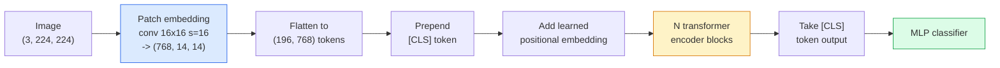

# Vision Transformers (ViT)

> Cut an image into patches, treat each patch as a word, run a standard transformer. Don't look back.

**Type:** Build
**Languages:** Python
**Prerequisites:** Phase 7 Lesson 02 (Self-Attention), Phase 4 Lesson 04 (Image Classification)
**Time:** ~45 min

## Learning Objectives

- Implement patch embedding, learned positional embedding, class token, and transformer encoder block from scratch to build a minimal ViT
- Explain why ViT was thought to require massive pretraining data until DeiT and MAE proved otherwise
- Compare ViT, Swin, and ConvNeXt on architectural priors (no priors, local window attention, convolutional backbone)
- Fine-tune a pretrained ViT on a small dataset using `timm` and standard linear-probe / fine-tuning recipes

## The Problem

For a decade, convolutions were nearly synonymous with computer vision. CNNs have strong inductive biases — locality, translation equivariance — and nobody thought you could replace them. Then Dosovitskiy et al. (2020) showed that a plain transformer operating on flattened image patches, with no convolutional machinery at all, matches or beats the best CNNs at scale.

The catch was "at scale." ViT lost to ResNet on ImageNet-1k. ViT pretrained on ImageNet-21k or JFT-300M and fine-tuned on ImageNet-1k won. The takeaway: transformers lack useful priors but can learn them from enough data. Follow-up work (DeiT, MAE, DINO) showed that with the right training recipe — heavy augmentation, self-supervised pretraining, distillation — ViT trains well on small data too.

By 2026, pure CNNs remain competitive on edge devices (ConvNeXt leads), but transformers dominate everything else: segmentation (Mask2Former, SegFormer), detection (DETR, RT-DETR), multimodal (CLIP, SigLIP), video (VideoMAE, VJEPA). The ViT block is the structure to master.

## The Concept

### Pipeline



Seven steps. Patch -> token -> attention -> classifier. Every variant (DeiT, Swin, ConvNeXt, MAE pretraining) changes one or two of these steps; the rest stays the same.

### Patch Embedding

The first convolution is the trick. Kernel size 16, stride 16, so a 224×224 image becomes a 14×14 grid of 16×16 patches, each projected to a 768-d embedding. That single convolution both cuts patches and applies the linear projection.

```
Input:  (3, 224, 224)
Conv (3 -> 768, k=16, s=16, no padding):
Output: (768, 14, 14)
Flatten spatial: (196, 768)
```

196 patches = 196 tokens. Feature dimension per token is 768 (ViT-B), 1024 (ViT-L), or 1280 (ViT-H).

### Class Token

A learned vector prepended to the sequence:

```
tokens = [CLS; patch_1; patch_2; ...; patch_196]   shape (197, 768)
```

After N transformer blocks, the `[CLS]` output is the global image representation. The classification head reads only this one vector.

### Positional Embedding

Transformers have no built-in notion of spatial position. Add a learned vector to each token:

```
tokens = tokens + learned_pos_embedding   (also shape (197, 768))
```

This embedding is a model parameter; gradient-based training adapts it to 2D image structure. Sinusoidal 2D alternatives exist but are rarely used in practice.

### Transformer Encoder Block

Standard. Multi-head self-attention, MLP, residual connections, pre-LayerNorm.

```
x = x + MSA(LN(x))
x = x + MLP(LN(x))

MLP is two layers with GELU: Linear(d -> 4d) -> GELU -> Linear(4d -> d)
```

ViT-B/16 stacks 12 such blocks, each with 12 attention heads, totaling ~86M parameters.

### Why Pre-LN

Early transformers used post-LN (`x = LN(x + sublayer(x))`), which was hard to train beyond 6–8 layers without warmup. Pre-LN (`x = x + sublayer(LN(x))`) trains deeper networks stably without warmup. Every ViT and every modern LLM uses pre-LN.

### Patch Size Tradeoffs

- 16×16 patches -> 196 tokens, standard.
- 32×32 patches -> 49 tokens, faster but lower resolution.
- 8×8 patches -> 784 tokens, finer-grained but O(n²) attention cost scales poorly.

Larger patches = fewer tokens = faster but less spatial detail. SwinV2 uses 4×4 patches in hierarchical windows.

### DeiT Recipe for Training ViT on ImageNet-1k

The original ViT needed JFT-300M to beat CNNs. DeiT (Touvron et al., 2020) trained ViT-B to 81.8% top-1 on ImageNet-1k alone with four changes:

1. Heavy augmentation: RandAugment, Mixup, CutMix, Random Erasing.
2. Stochastic depth (randomly drop entire blocks during training).
3. Repeated augmentation (sample the same image 3 times per batch).
4. Distillation from a CNN teacher (optional, further boosts accuracy).

Every modern ViT training recipe descends from DeiT.

### Swin vs ConvNeXt

- **Swin** (Liu et al., 2021) — window-based attention. Each block computes attention within a local window; alternating blocks shift the window to mix information across windows. Recovers CNN-like locality priors while keeping the attention operator.
- **ConvNeXt** (Liu et al., 2022) — a redesigned CNN that matches Swin's architectural choices (depthwise separable convolutions, LayerNorm, GELU, inverted bottleneck). It shows the gap isn't "attention vs convolution" but "modern training recipe + architecture."

In 2026, ConvNeXt-V2 and Swin-V2 are both production-grade; the right choice depends on your inference stack (ConvNeXt compiles better on edge) and pretraining corpus.

### MAE Pretraining

Masked Autoencoders (He et al., 2022): randomly mask 75% of patches, train the encoder to process only the visible 25%, train a small decoder to reconstruct the masked patches from encoder outputs. Discard the decoder after pretraining; fine-tune the encoder.

MAE makes ViT trainable on ImageNet-1k alone to SOTA — the current default self-supervised recipe.

## Build It

### Step 1: Patch Embedding

```python
import torch
import torch.nn as nn

class PatchEmbedding(nn.Module):
    def __init__(self, in_channels=3, patch_size=16, dim=192, image_size=64):
        super().__init__()
        assert image_size % patch_size == 0
        self.proj = nn.Conv2d(in_channels, dim, kernel_size=patch_size, stride=patch_size)
        num_patches = (image_size // patch_size) ** 2
        self.num_patches = num_patches

    def forward(self, x):
        x = self.proj(x)
        return x.flatten(2).transpose(1, 2)
```

One convolution, one flatten, one transpose. That's the entire "image to tokens" step.

### Step 2: Transformer Block

Pre-LN, multi-head self-attention, MLP with GELU, residual connections.

```python
class Block(nn.Module):
    def __init__(self, dim, num_heads, mlp_ratio=4, dropout=0.0):
        super().__init__()
        self.ln1 = nn.LayerNorm(dim)
        self.attn = nn.MultiheadAttention(dim, num_heads, dropout=dropout, batch_first=True)
        self.ln2 = nn.LayerNorm(dim)
        self.mlp = nn.Sequential(
            nn.Linear(dim, dim * mlp_ratio),
            nn.GELU(),
            nn.Dropout(dropout),
            nn.Linear(dim * mlp_ratio, dim),
            nn.Dropout(dropout),
        )

    def forward(self, x):
        a, _ = self.attn(self.ln1(x), self.ln1(x), self.ln1(x), need_weights=False)
        x = x + a
        x = x + self.mlp(self.ln2(x))
        return x
```

`nn.MultiheadAttention` handles head splitting, scaled dot-product, and output projection. `batch_first=True`, so shapes are `(N, seq, dim)`.

### Step 3: ViT

```python
class ViT(nn.Module):
    def __init__(self, image_size=64, patch_size=16, in_channels=3,
                 num_classes=10, dim=192, depth=6, num_heads=3, mlp_ratio=4):
        super().__init__()
        self.patch = PatchEmbedding(in_channels, patch_size, dim, image_size)
        num_patches = self.patch.num_patches
        self.cls_token = nn.Parameter(torch.zeros(1, 1, dim))
        self.pos_embed = nn.Parameter(torch.zeros(1, num_patches + 1, dim))
        self.blocks = nn.ModuleList([
            Block(dim, num_heads, mlp_ratio) for _ in range(depth)
        ])
        self.ln = nn.LayerNorm(dim)
        self.head = nn.Linear(dim, num_classes)
        nn.init.trunc_normal_(self.pos_embed, std=0.02)
        nn.init.trunc_normal_(self.cls_token, std=0.02)

    def forward(self, x):
        x = self.patch(x)
        cls = self.cls_token.expand(x.size(0), -1, -1)
        x = torch.cat([cls, x], dim=1)
        x = x + self.pos_embed
        for blk in self.blocks:
            x = blk(x)
        x = self.ln(x[:, 0])
        return self.head(x)

vit = ViT(image_size=64, patch_size=16, num_classes=10, dim=192, depth=6, num_heads=3)
x = torch.randn(2, 3, 64, 64)
print(f"output: {vit(x).shape}")
print(f"params: {sum(p.numel() for p in vit.parameters()):,}")
```

~2.8M parameters — a small ViT that runs on CPU. A real ViT-B is 86M; same class definition with `dim=768, depth=12, num_heads=12`.

### Step 4: Sanity Check — Single-Image Inference

```python
logits = vit(torch.randn(1, 3, 64, 64))
print(f"logits: {logits}")
print(f"probs:  {logits.softmax(-1)}")
```

Should run without errors. Probabilities sum to 1.

## Use It

`timm` provides ImageNet-pretrained weights for every ViT variant. One line:

```python
import timm

model = timm.create_model("vit_base_patch16_224", pretrained=True, num_classes=10)
```

In 2026 `timm` is the production default for vision transformers. It supports ViT, DeiT, Swin, Swin-V2, ConvNeXt, ConvNeXt-V2, MaxViT, MViT, EfficientFormer, and dozens more under the same API.

For multimodal (image + text), `transformers` provides CLIP, SigLIP, BLIP-2, LLaVA. The image encoder inside all of these is some ViT variant.

## Ship It

This lesson produces:

- `outputs/prompt-vit-vs-cnn-picker.md` — a prompt that picks between ViT, ConvNeXt, and Swin given dataset size, compute, and inference stack.
- `outputs/skill-vit-patch-and-pos-embed-inspector.md` — a skill that verifies a ViT's patch embedding and positional embedding shapes match the model's expected sequence length, catching the most common porting bugs.

## Exercises

1. **(Easy)** Print the shape of every intermediate tensor in one forward pass of the small ViT above. Confirm: input `(N, 3, 64, 64)` -> patches `(N, 16, 192)` -> with CLS `(N, 17, 192)` -> classifier input `(N, 192)` -> output `(N, num_classes)`.
2. **(Medium)** Fine-tune a pretrained `timm` ViT-S/16 on Lesson 04's synthetic CIFAR dataset. Compare against fine-tuning ResNet-18 on the same data. Report training time and final accuracy.
3. **(Hard)** Implement MAE pretraining for this small ViT: mask 75% of patches, train encoder + a small decoder to reconstruct masked patches. Evaluate linear-probe accuracy on synthetic data before and after pretraining.

## Key Terms

| Term | What people say | What it actually is |
|------|-----------------|---------------------|
| Patch embedding | "the first conv" | Convolution with kernel size = stride = patch size; turns an image into a grid of token embeddings |
| Class token | "[CLS]" | Learned vector prepended to the token sequence; its final output is the global image representation |
| Positional embedding | "learned positions" | Learned vector added to each token so the transformer knows where each patch came from |
| Pre-LN | "LayerNorm before sublayer" | Stable transformer variant: `x + sublayer(LN(x))` instead of `LN(x + sublayer(x))` |
| Multi-head attention | "parallel attention" | Standard transformer attention split into num_heads independent subspaces, concatenated afterward |
| ViT-B/16 | "Base, patch 16" | Classic size: dim=768, depth=12, heads=12, patch_size=16, image=224; ~86M params |
| DeiT | "data-efficient ViT" | ViT trained on ImageNet-1k alone with heavy augmentation; proves massive pretraining data isn't strictly required |
| MAE | "masked autoencoder" | Self-supervised pretraining: mask 75% of patches, reconstruct; the dominant ViT pretraining recipe |

## Further Reading

- [An Image is Worth 16x16 Words (Dosovitskiy et al., 2020)](https://arxiv.org/abs/2010.11929) — the ViT paper
- [DeiT: Data-efficient Image Transformers (Touvron et al., 2020)](https://arxiv.org/abs/2012.12877) — how to train ViT on ImageNet-1k alone
- [Masked Autoencoders are Scalable Vision Learners (He et al., 2022)](https://arxiv.org/abs/2111.06377) — MAE pretraining
- [timm documentation](https://huggingface.co/docs/timm) — reference for every vision transformer you'll use in production
