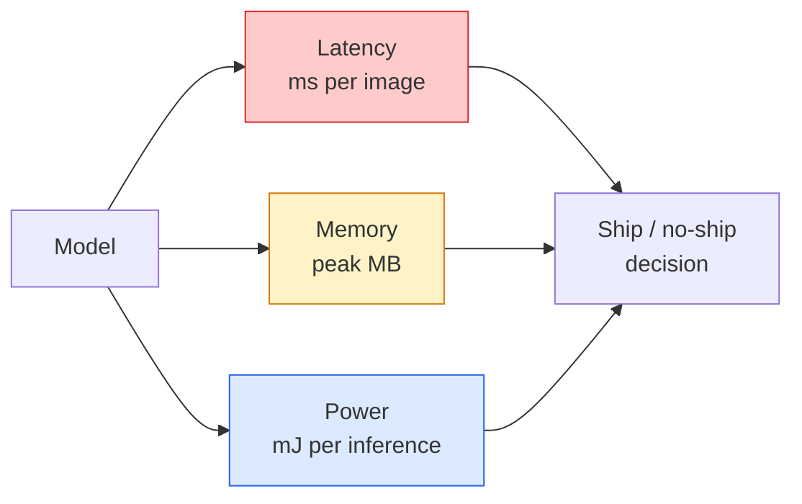

# Real-Time Vision — Edge Deployment

> Edge inference is the craft of running a 90% accuracy model at 30 fps on a device with 2 GB of memory. Every percentage point of accuracy trades against a few milliseconds of latency.

**Type:** Learn + Build
**Languages:** Python
**Prerequisites:** Phase 4 Lesson 04 (Image Classification), Phase 10 Lesson 11 (Quantization)
**Time:** ~75 min

## Learning Objectives

- Measure inference latency, peak memory, and throughput for any PyTorch model; read the FLOPs / parameters / latency tradeoff
- Quantize a vision model to INT8 with PyTorch post-training quantization; verify accuracy loss < 1%
- Export to ONNX and compile with ONNX Runtime or TensorRT; name the three most common export failures and their fixes
- Explain when to pick MobileNetV3, EfficientNet-Lite, ConvNeXt-Tiny, or MobileViT under edge constraints

## The Problem

A vision model at training time is a floating-point beast. 100M parameters, 10 GFLOPs per forward pass, 2 GB of VRAM. None of that fits in a phone, a car infotainment unit, an industrial camera, or a drone. Shipping a vision system means fitting the same predictions into a budget 100× smaller.

Three knobs do most of the work: model selection (smaller architecture under the same recipe), quantization (INT8 instead of FP32), and inference runtime (ONNX Runtime, TensorRT, Core ML, TFLite). Getting them right is the difference between "a demo running on a workstation" and "a product shipping on a $30 camera module."

This lesson sets up measurement discipline (can't optimize what you can't measure) then walks through each knob. The goal isn't learning every edge runtime — it's knowing what levers exist and how to verify each one does what you think.

## The Concept

### Three Budgets



- **Latency**: p50, p95, p99. Averages hide tail behavior, and tails matter for real-time systems.
- **Peak memory**: the maximum the device has ever seen, not the steady-state average. Matters because OOM is fatal on embedded targets.
- **Power / energy**: millijoules per inference on battery-powered devices. Often proxied by CPU/GPU utilization × time.

A table of (model, latency, memory, accuracy) is what edge decisions are based on. Every cell is measured on the target device, not on a workstation.

### Measurement Discipline

Three rules every edge profiling session should follow:

1. **Warm up** the model with 5–10 dummy forward passes before measuring. Cold caches and JIT compilation produce unrepresentative initial numbers.
2. **Synchronize** GPU workloads with `torch.cuda.synchronize()` before and after the timing block. Without it, you're timing kernel dispatch, not kernel execution.
3. **Fix** input size to the production resolution. Latency at 224×224 is not latency at 512×512.

### FLOPs as a Proxy

FLOPs (floating-point operations per inference) are a cheap, device-independent proxy for latency. Useful for architecture comparisons when absolute wall-clock time would mislead. A model with 10% more FLOPs can be 2× faster in practice because it uses hardware-friendly ops (depthwise separable convolutions compile well; large 7×7 convolutions don't).

Rule: use FLOPs for architecture search; use on-device latency for deployment decisions.

### Quantization in One Paragraph

Replace FP32 weights and activations with INT8. Model size drops 4×, memory bandwidth drops 4×, compute drops 2–4× on hardware with INT8 kernels (every modern mobile SoC, every NVIDIA GPU with Tensor Cores). Post-training static quantization on vision tasks typically loses 0.1–1 percentage point of accuracy.

Types:

- **Dynamic** — weights quantized to INT8, activations computed in FP. Simple, small speedup.
- **Static (post-training)** — quantize weights + calibrate activation ranges on a small calibration set. Much faster than dynamic.
- **Quantization-Aware Training (QAT)** — simulate quantization during training so the model learns around it. Best accuracy, requires labeled data.

For vision, post-training static quantization gets 95% of the benefit with 5% of the effort. Use QAT only when PTQ accuracy loss is unacceptable.

### Pruning and Distillation

- **Pruning** — remove unimportant weights (magnitude-based) or channels (structured). Works well on over-parameterized models; less useful on already-compact architectures.
- **Distillation** — train a small student to mimic the logits of a large teacher. Often recovers most accuracy lost from shrinking the model. Standard practice for production edge models.

### Inference Runtimes

- **PyTorch eager** — slow, not for deployment. Development only.
- **TorchScript** — legacy. Superseded by `torch.compile` and ONNX export.
- **ONNX Runtime** — neutral runtime. CPU, CUDA, CoreML, TensorRT, OpenVINO all have ONNX providers. Start here.
- **TensorRT** — NVIDIA's compiler. Best latency on NVIDIA GPUs (workstation and Jetson). Integrates with ONNX Runtime or standalone.
- **Core ML** — Apple's iOS/macOS runtime. Requires `.mlmodel` or `.mlpackage`.
- **TFLite** — Google's Android/ARM runtime. Requires `.tflite`.
- **OpenVINO** — Intel's CPU/VPU runtime. Requires `.xml` + `.bin`.

In practice: export PyTorch -> ONNX -> pick runtime for target. ONNX is the lingua franca.

### Edge Architecture Selector

| Budget | Model | Why |
|--------|-------|-----|
| < 3M params | MobileNetV3-Small | Compiles everywhere, solid baseline |
| 3–10M | EfficientNet-Lite-B0 | Best accuracy per param on TFLite |
| 10–20M | ConvNeXt-Tiny | Best accuracy per param, CPU-friendly |
| 20–30M | MobileViT-S or EfficientViT | Transformer with ImageNet accuracy |
| 30–80M | Swin-V2-Tiny | If the stack supports window attention |

Quantize all of these to INT8 unless you have a specific reason not to.

## Build It

### Step 1: Measuring Latency Correctly

```python
import time
import torch

def measure_latency(model, input_shape, device="cpu", warmup=10, iters=50):
    model = model.to(device).eval()
    x = torch.randn(input_shape, device=device)
    with torch.no_grad():
        for _ in range(warmup):
            model(x)
        if device == "cuda":
            torch.cuda.synchronize()
        times = []
        for _ in range(iters):
            if device == "cuda":
                torch.cuda.synchronize()
            t0 = time.perf_counter()
            model(x)
            if device == "cuda":
                torch.cuda.synchronize()
            times.append((time.perf_counter() - t0) * 1000)
    times.sort()
    return {
        "p50_ms": times[len(times) // 2],
        "p95_ms": times[int(len(times) * 0.95)],
        "p99_ms": times[int(len(times) * 0.99)],
        "mean_ms": sum(times) / len(times),
    }
```

Warm up, synchronize, use `time.perf_counter()`. Report percentiles, not just mean.

### Step 2: Parameter and FLOP Count

```python
def parameter_count(model):
    return sum(p.numel() for p in model.parameters())

def flops_estimate(model, input_shape):
    """
    Rough FLOP count for conv/linear-only models. Use `fvcore` or `ptflops` in production.
    """
    total = 0
    def conv_hook(m, inp, out):
        nonlocal total
        c_out, c_in, kh, kw = m.weight.shape
        h, w = out.shape[-2:]
        total += 2 * c_in * c_out * kh * kw * h * w
    def linear_hook(m, inp, out):
        nonlocal total
        total += 2 * m.in_features * m.out_features
    hooks = []
    for m in model.modules():
        if isinstance(m, torch.nn.Conv2d):
            hooks.append(m.register_forward_hook(conv_hook))
        elif isinstance(m, torch.nn.Linear):
            hooks.append(m.register_forward_hook(linear_hook))
    model.eval()
    with torch.no_grad():
        model(torch.randn(input_shape))
    for h in hooks:
        h.remove()
    return total
```

Real projects use `fvcore.nn.FlopCountAnalysis` or `ptflops`; they handle every module type correctly.

### Step 3: Post-Training Static Quantization

```python
def quantise_ptq(model, calibration_loader, backend="x86"):
    import torch.ao.quantization as tq
    model = model.eval().cpu()
    model.qconfig = tq.get_default_qconfig(backend)
    tq.prepare(model, inplace=True)
    with torch.no_grad():
        for x, _ in calibration_loader:
            model(x)
    tq.convert(model, inplace=True)
    return model
```

Three steps: configure, prepare (insert observers), calibrate with real data, convert (fuse + quantize). Requires the model to be fused first (`Conv -> BN -> ReLU` -> `ConvBnReLU`), handled by `torch.ao.quantization.fuse_modules`.

### Step 4: Export to ONNX

```python
def export_onnx(model, sample_input, path="model.onnx"):
    model = model.eval()
    torch.onnx.export(
        model,
        sample_input,
        path,
        input_names=["input"],
        output_names=["output"],
        dynamic_axes={"input": {0: "batch"}, "output": {0: "batch"}},
        opset_version=17,
    )
    return path
```

`opset_version=17` is the safe default in 2026. `dynamic_axes` lets you run the ONNX model at any batch size.

### Step 5: Benchmark and Compare Regimes

```python
import torch.nn as nn
from torchvision.models import mobilenet_v3_small

def compare_regimes():
    model = mobilenet_v3_small(weights=None, num_classes=10)
    params = parameter_count(model)
    flops = flops_estimate(model, (1, 3, 224, 224))
    lat_fp32 = measure_latency(model, (1, 3, 224, 224), device="cpu")
    print(f"FP32 MobileNetV3-Small: {params:,} params  {flops/1e9:.2f} GFLOPs  "
          f"p50={lat_fp32['p50_ms']:.2f}ms  p95={lat_fp32['p95_ms']:.2f}ms")
```

Run the same function for `resnet50`, `efficientnet_v2_s`, and `convnext_tiny`, and you have the comparison table needed for deployment decisions.

## Use It

Production stacks converge on one of three paths:

- **Web / serverless**: PyTorch -> ONNX -> ONNX Runtime (CPU or CUDA provider). Easiest, good enough for most scenarios.
- **NVIDIA edge (Jetson, GPU servers)**: PyTorch -> ONNX -> TensorRT. Best latency, most engineering effort.
- **Mobile**: PyTorch -> ONNX -> Core ML (iOS) or TFLite (Android). Quantize before exporting.

For measurement, `torch-tb-profiler`, `nvprof` / `nsys`, and Instruments on macOS give per-layer breakdowns. `benchmark_app` (OpenVINO) and `trtexec` (TensorRT) give standalone CLI numbers.

## Ship It

This lesson produces:

- `outputs/prompt-edge-deployment-planner.md` — a prompt that picks backbone, quantization strategy, and runtime given a target device and latency SLA.
- `outputs/skill-latency-profiler.md` — a skill that writes a complete latency benchmarking script with warmup, synchronization, percentiles, and memory tracking.

## Exercises

1. **(Easy)** Measure p50 latency of `resnet18`, `mobilenet_v3_small`, `efficientnet_v2_s`, and `convnext_tiny` at 224×224 on CPU. Report the table and identify which architecture has the best "accuracy per millisecond."
2. **(Medium)** Apply post-training static quantization to `mobilenet_v3_small`. Report latency and accuracy loss for FP32 vs INT8 on a held-out subset of CIFAR-10 or similar dataset.
3. **(Hard)** Export `convnext_tiny` to ONNX, run it with `onnxruntime` using `CPUExecutionProvider`, and compare latency against the PyTorch eager baseline. Identify the first layer where ONNX Runtime becomes faster and explain why.

## Key Terms

| Term | What people say | What it actually is |
|------|-----------------|---------------------|
| Latency | "how fast" | Time from input to output; p50/p95/p99 percentiles, not mean |
| FLOPs | "model size" | Floating-point operations per forward pass; rough proxy for compute cost |
| INT8 quantization | "8-bit" | Replace FP32 weights/activations with 8-bit integers; ~4× smaller, 2–4× faster |
| PTQ | "post-training quantization" | Quantize a trained model without retraining; simple, usually sufficient |
| QAT | "quantization-aware training" | Simulate quantization during training; best accuracy, requires labeled data |
| ONNX | "neutral format" | Model interchange format supported by every major inference runtime |
| TensorRT | "NVIDIA compiler" | Compiles ONNX into an optimized engine for NVIDIA GPUs |
| Distillation | "teacher -> student" | Train a small model to mimic a large model's logits; recovers most lost accuracy |

## Further Reading

- [EfficientNet (Tan & Le, 2019)](https://arxiv.org/abs/1905.11946) — compound scaling for efficient architectures
- [MobileNetV3 (Howard et al., 2019)](https://arxiv.org/abs/1905.02244) — mobile-first architecture with h-swish and squeeze-excite
- [A Practical Guide to TensorRT Optimization (NVIDIA)](https://developer.nvidia.com/blog/accelerating-model-inference-with-tensorrt-tips-and-best-practices-for-pytorch-users/) — how to actually hit the throughput numbers from papers
- [ONNX Runtime docs](https://onnxruntime.ai/docs/) — quantization, graph optimization, provider selection
