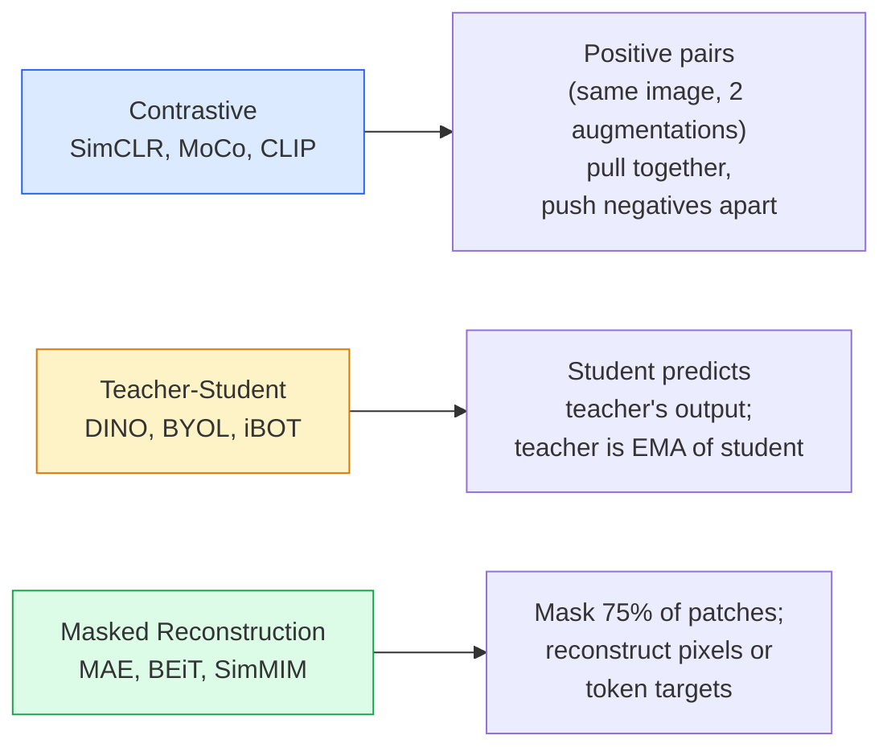

# Self-Supervised Vision — SimCLR, DINO, MAE

> Labels are the bottleneck of supervised vision. Self-supervised pretraining removes it: learn visual features from 100M unlabeled images, then fine-tune on 10K labeled ones.

**Type:** Learn + Build
**Languages:** Python
**Prerequisites:** Phase 4 Lesson 04 (Image Classification), Phase 4 Lesson 14 (ViT)
**Time:** ~75 min

## Learning Objectives

- Survey the three self-supervised families — contrastive (SimCLR), teacher-student (DINO), masked reconstruction (MAE) — and state what each optimizes
- Implement InfoNCE loss from scratch; explain why batch size 512 works but 32 doesn't
- Explain why MAE's 75% mask ratio isn't arbitrary, and how it differs from BERT's 15% for text
- Run linear probe and zero-shot retrieval using a DINOv2 or MAE ImageNet checkpoint

## The Problem

Supervised ImageNet has 1.3M labeled images, estimated at $10M to annotate. Medical and industrial datasets are smaller and even more expensive to label. Every vision team asks: can we pretrain on cheap unlabeled data — YouTube frames, web crawls, camera feeds, satellite scans — then fine-tune on a small labeled set?

Self-supervised learning is the answer. A modern self-supervised ViT trained on LAION or JFT matches or exceeds supervised ImageNet accuracy after fine-tuning. It transfers to downstream tasks (detection, segmentation, depth) better than supervised pretraining too. DINOv2 (Meta, 2023) and MAE (Meta, 2022) are the current production defaults for transferable visual features.

The conceptual shift: the pretext task — the thing the model is trained to do — doesn't have to be the downstream task. What matters is that it forces the model to learn useful features. Predicting color from grayscale, rotating images and classifying rotation angles, masking patches and reconstructing them — all have worked. The three methods that scale are contrastive learning, teacher-student distillation, and masked reconstruction.

## The Concept

### Three Families



### Contrastive Learning (SimCLR)

Take an image, apply two random augmentations, get two views. Pass both through the same encoder plus a projection head. Minimize a loss that says "these two embeddings should be close" and "this embedding should be far from every other image's embedding in the batch."

```
Loss for positive pair (z_i, z_j) among 2N views in the batch:

   L_ij = -log( exp(sim(z_i, z_j) / tau) / sum_k in batch \ {i} exp(sim(z_i, z_k) / tau) )

sim = cosine similarity
tau = temperature (0.1 standard)
```

This is the InfoNCE loss. It requires many negatives per positive, so batch size matters — SimCLR needs 512–8192. MoCo introduced a momentum queue of past batches, decoupling negative count from batch size.

### Teacher-Student (DINO)

Two networks with the same architecture: student and teacher. The teacher is an exponential moving average (EMA) of the student weights. Both see augmented views of the image. The student's output is trained to match the teacher's — no explicit negatives.

```
loss = CE( student_output(view_1),  teacher_output(view_2) )
     + CE( student_output(view_2),  teacher_output(view_1) )

teacher_weights = m * teacher_weights + (1 - m) * student_weights   (m ≈ 0.996)
```

Why it doesn't collapse to "predict a constant": the teacher's output is centered (subtract per-dimension mean) and sharpened (divide by a small temperature). Centering prevents one dimension from dominating; sharpening prevents the output from collapsing to uniform.

DINO is what DINOv2 scaled up, trained on 142M curated images. The resulting features are current SOTA for zero-shot visual retrieval and dense prediction.

### Masked Reconstruction (MAE)

Mask 75% of a ViT input's patches. Pass only the visible 25% through the encoder. A small decoder receives encoder outputs plus mask tokens at masked positions and is trained to reconstruct the masked patches' pixels.

```
Encoder:  visible 25% patches -> features
Decoder:  features + mask tokens at masked positions -> reconstructed pixels
Loss:     MSE between reconstructed and original pixels, only on masked patches
```

Key design choices that make MAE work:

- **75% mask ratio** — high. Forces the encoder to learn semantic features; reconstructing 25% would be nearly trivial (adjacent pixels are too correlated, even a CNN can do it).
- **Asymmetric encoder/decoder** — large ViT encoder sees only visible patches; a small decoder (8 layers, dim 512) does reconstruction. 3× faster than naïve BEiT pretraining.
- **Pixel-space reconstruction target** — simpler than BEiT's tokenized target and works better on ViTs.

Discard the decoder after pretraining. The encoder is the feature extractor.

### Why 75% and Not 15%

BERT masks 15% of tokens. MAE masks 75%. The difference is information density.

- Natural language has high entropy per token. Predicting 15% of tokens is still hard because each masked position has many plausible completions.
- Image patches have low entropy — an unmasked neighborhood often nearly exactly determines the masked patch's pixels. To make prediction require semantic understanding, you must mask aggressively.

75% is high enough that simple spatial extrapolation can't solve the task; the encoder must represent image content.

### Linear Probe Evaluation

After self-supervised pretraining, the standard evaluation is a **linear probe**: freeze the encoder and train a linear classifier on top with ImageNet labels. Report top-1 accuracy.

- SimCLR ResNet-50: ~71% (2020)
- DINO ViT-S/16: ~77% (2021)
- MAE ViT-L/16: ~76% (2022)
- DINOv2 ViT-g/14: ~86% (2023)

Linear probe is a pure measure of feature quality; fine-tuning typically adds 2–5 points but also mixes in head retraining effects.

## Build It

### Step 1: Two-View Augmentation Pipeline

```python
import torch
import torchvision.transforms as T

two_view_train = lambda: T.Compose([
    T.RandomResizedCrop(96, scale=(0.2, 1.0)),
    T.RandomHorizontalFlip(),
    T.ColorJitter(0.4, 0.4, 0.4, 0.1),
    T.RandomGrayscale(p=0.2),
    T.ToTensor(),
])


class TwoViewDataset(torch.utils.data.Dataset):
    def __init__(self, base):
        self.base = base
        self.aug = two_view_train()

    def __len__(self):
        return len(self.base)

    def __getitem__(self, i):
        img, _ = self.base[i]
        v1 = self.aug(img)
        v2 = self.aug(img)
        return v1, v2
```

Each __getitem__ returns two augmented views of the same image; no labels needed.

### Step 2: InfoNCE Loss

```python
import torch.nn.functional as F

def info_nce(z1, z2, tau=0.1):
    """
    z1, z2: (N, D) L2-normalized embeddings of paired views
    """
    N, D = z1.shape
    z = torch.cat([z1, z2], dim=0)  # (2N, D)
    sim = z @ z.T / tau              # (2N, 2N)

    mask = torch.eye(2 * N, dtype=torch.bool, device=z.device)
    sim = sim.masked_fill(mask, float("-inf"))

    targets = torch.cat([torch.arange(N, 2 * N), torch.arange(0, N)]).to(z.device)
    return F.cross_entropy(sim, targets)
```

L2-normalize embeddings before calling. `tau=0.1` is the SimCLR default; lower makes the loss sharper, requiring more negatives.

### Step 3: InfoNCE Sanity Check

```python
z1 = F.normalize(torch.randn(16, 32), dim=-1)
z2 = z1.clone()
loss_same = info_nce(z1, z2, tau=0.1).item()
z2_random = F.normalize(torch.randn(16, 32), dim=-1)
loss_random = info_nce(z1, z2_random, tau=0.1).item()
print(f"InfoNCE with identical pairs:  {loss_same:.3f}")
print(f"InfoNCE with random pairs:     {loss_random:.3f}")
```

Identical pairs should give low loss (near 0 with large batch and cold temperature). Random pairs at batch size 16 should give ~log(2N-1) = ~log(31) ≈ 3.4.

### Step 4: MAE-Style Masking

```python
def random_mask_indices(num_patches, mask_ratio=0.75, seed=0):
    g = torch.Generator().manual_seed(seed)
    n_keep = int(num_patches * (1 - mask_ratio))
    perm = torch.randperm(num_patches, generator=g)
    visible = perm[:n_keep]
    masked = perm[n_keep:]
    return visible.sort().values, masked.sort().values


num_patches = 196
visible, masked = random_mask_indices(num_patches, mask_ratio=0.75)
print(f"visible: {len(visible)} / {num_patches}")
print(f"masked:  {len(masked)} / {num_patches}")
```

Simple, fast, deterministic for a given seed. Real MAE implementations batch this and keep per-sample masks.

## Use It

In 2026 DINOv2 is the production standard:

```python
import torch
from transformers import AutoImageProcessor, AutoModel

processor = AutoImageProcessor.from_pretrained("facebook/dinov2-base")
model = AutoModel.from_pretrained("facebook/dinov2-base")
model.eval()

# Per-image embedding for zero-shot retrieval
with torch.no_grad():
    inputs = processor(images=[pil_image], return_tensors="pt")
    outputs = model(**inputs)
    embedding = outputs.last_hidden_state[:, 0]  # CLS token
```

The resulting 768-d embedding is the backbone of modern image retrieval, dense correspondence, and zero-shot transfer pipelines. Fine-tuning on downstream tasks rarely requires more than a linear head.

For image-text embeddings, SigLIP or OpenCLIP are the equivalents; for MAE-style fine-tuning, the `timm` repo provides every MAE checkpoint.

## Ship It

This lesson produces:

- `outputs/prompt-ssl-pretraining-picker.md` — a prompt that picks SimCLR / MAE / DINOv2 given dataset size, compute, and downstream task.
- `outputs/skill-linear-probe-runner.md` — a skill that writes a linear probe evaluation for any frozen encoder + labeled dataset.

## Exercises

1. **(Easy)** Verify that InfoNCE loss decreases with lower temperature for well-aligned embeddings and increases for random embeddings. Plot loss vs `tau in [0.05, 0.1, 0.2, 0.5]`.
2. **(Medium)** Implement a DINO-style centering buffer. Show that without centering, the student collapses to a constant vector within a few epochs.
3. **(Hard)** Train MAE on CIFAR-100 using Lesson 10's TinyUNet as backbone. Report linear probe accuracy at epoch 10, 50, and 200. Show that MAE-pretrained linear probe beats supervised-from-scratch linear probe on the same 1,000-image subset.

## Key Terms

| Term | What people say | What it actually is |
|------|-----------------|---------------------|
| Self-supervised | "no labels" | A pretext task that produces useful representations from unlabeled data |
| Pretext task | "fake task" | Objective used during SSL (reconstruct patches, match views); discarded after pretraining |
| Linear probe | "frozen encoder + linear head" | Standard SSL evaluation: train only a linear classifier on top of frozen features |
| InfoNCE | "contrastive loss" | Softmax over cosine similarities; positive pair is the target class, everything else is negative |
| EMA teacher | "momentum teacher" | Teacher whose weights are exponential moving average of the student; used by BYOL, MoCo, DINO |
| Mask ratio | "fraction of patches hidden" | Proportion of patches masked during MAE; 75% for vision, 15% for text |
| Representation collapse | "constant output" | SSL failure where the encoder outputs a constant vector for all inputs; prevented by centering, sharpening, or negatives |
| DINOv2 | "production SSL backbone" | Meta's 2023 self-supervised ViT; strongest general-purpose image features in 2026 |

## Further Reading

- [SimCLR (Chen et al., 2020)](https://arxiv.org/abs/2002.05709) — contrastive learning reference
- [DINO (Caron et al., 2021)](https://arxiv.org/abs/2104.14294) — teacher-student with momentum, centering, sharpening
- [MAE (He et al., 2022)](https://arxiv.org/abs/2111.06377) — masked autoencoder pretraining for ViTs
- [DINOv2 (Oquab et al., 2023)](https://arxiv.org/abs/2304.07193) — scaling self-supervised ViTs to production-grade features
