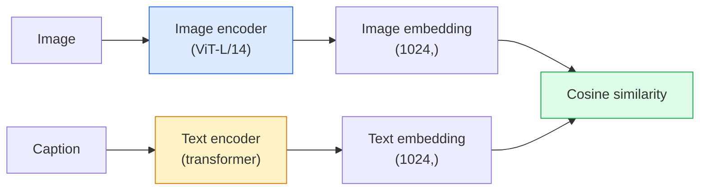

# Open-Vocabulary Vision — CLIP

> Train an image encoder and a text encoder together so that matching (image, caption) pairs land on the same point in a shared space. That's the entire trick.

**Type:** Build + Use
**Languages:** Python
**Prerequisites:** Phase 4 Lesson 14 (ViT), Phase 4 Lesson 17 (Self-Supervised)
**Time:** ~45 min

## Learning Objectives

- Explain CLIP's two-tower architecture and contrastive training objective
- Perform zero-shot classification with a pretrained CLIP (or SigLIP) without any task-specific training
- Implement zero-shot classification from scratch: encode class prompts, compute cosine similarity, take argmax
- Distinguish CLIP, SigLIP, OpenCLIP, and LLaVA/LLaMA-vision models — what each is used for in 2026

## The Problem

Traditional classifiers are closed-vocabulary: a 1000-class ImageNet model can only predict 1000 labels. Every new class requires labeled data and a retrained head.

CLIP (Radford et al., OpenAI 2021) showed that training on 400M (image, caption) pairs crawled from the web produces a model that can classify into any set of classes at inference time, described purely in natural language. You write a sentence and you've given it a new class.

That capability — zero-shot transfer — is why every modern vision system starts from a CLIP-family checkpoint. Detection (Grounding DINO, OWL-ViT), segmentation (CLIPSeg, SAM), retrieval, content moderation, VLMs, and text-to-image generation all build on CLIP-style joint embeddings.

## The Concept

### Two Towers



Both encoders end with a linear projection to the same embedding dimension (512 for CLIP-B/32, 1024 for CLIP-L/14). L2-normalize, compute cosine similarity.

### Objective

Given a batch of N (image, caption) pairs, build an N×N similarity matrix. Train both encoders so the diagonal (matching pairs) has high similarity and off-diagonal (non-matching) has low similarity.

```
sim_matrix = image_embeddings @ text_embeddings.T / tau

loss_i2t = cross_entropy(sim_matrix,       targets=arange(N))
loss_t2i = cross_entropy(sim_matrix.T,     targets=arange(N))
loss = (loss_i2t + loss_t2i) / 2
```

Symmetric, because image-to-text and text-to-image retrieval should both work. `tau` (temperature) is typically learned as a scalar parameter, initialized to 0.07.

### SigLIP: A Better Loss

SigLIP (Zhai et al., 2023) replaces the softmax with pairwise sigmoid:

```
loss = mean over all pairs of log(1 + exp(-y_ij * sim_ij))
y_ij = +1 if match, -1 otherwise
```

The pairwise loss removes the batch-level normalization CLIP needs. SigLIP trains better with small batches and matches or exceeds CLIP on equivalent data.

### Zero-Shot Classification

Given a trained CLIP:

1. Compose a prompt for each class: "a photo of a {class}".
2. Encode all class prompts with the text encoder -> `T`, shape (C, d).
3. Encode the test image -> `I`, shape (1, d).
4. Similarity = `I @ T.T`, shape (1, C).
5. Argmax -> predicted class.

Prompt engineering matters. OpenAI released 80 prompt templates for ImageNet ("a photo of a {}", "a blurry photo of a {}", "a sketch of a {}", …). Averaging embeddings across all templates per class yields an extra 1–3% top-1 accuracy.

### Where CLIP-Style Models Are Used in 2026

- **Zero-shot classification** — directly.
- **Image retrieval** — encode all images once, embed the query at inference.
- **Text-conditioned detection** — Grounding DINO, OWL-ViT wrap a CLIP text tower around a detector.
- **Text-conditioned segmentation** — CLIPSeg; SAM uses text prompt input via CLIP.
- **VLMs** — LLaVA, Qwen-VL, InternVL plug a CLIP-family vision encoder into an LLM.
- **Text-to-image generation** — Stable Diffusion, DALL-E 3 condition on CLIP text embeddings.

Once you have a shared embedding space, every vision+language task becomes a distance computation.

## Build It

### Step 1: A Tiny Two-Tower Model

Real CLIP is ViT + transformer. This lesson's towers are small MLPs on pre-extracted features so training signal is visible on CPU.

```python
import torch
import torch.nn as nn
import torch.nn.functional as F


class TwoTower(nn.Module):
    def __init__(self, img_in=128, txt_in=64, emb=64):
        super().__init__()
        self.image_proj = nn.Sequential(nn.Linear(img_in, 128), nn.ReLU(), nn.Linear(128, emb))
        self.text_proj = nn.Sequential(nn.Linear(txt_in, 128), nn.ReLU(), nn.Linear(128, emb))
        self.logit_scale = nn.Parameter(torch.ones([]) * 2.6592)  # ln(1/0.07)

    def forward(self, img_feats, txt_feats):
        i = F.normalize(self.image_proj(img_feats), dim=-1)
        t = F.normalize(self.text_proj(txt_feats), dim=-1)
        return i, t, self.logit_scale.exp()
```

Two projections, shared-dimension output, learned temperature. Same shape as real CLIP's API.

### Step 2: Contrastive Loss

```python
def clip_loss(image_emb, text_emb, logit_scale):
    N = image_emb.size(0)
    sim = logit_scale * image_emb @ text_emb.T
    targets = torch.arange(N, device=sim.device)
    l_i = F.cross_entropy(sim, targets)
    l_t = F.cross_entropy(sim.T, targets)
    return (l_i + l_t) / 2
```

Symmetric. Higher logit_scale = sharper softmax = more confident but risk of instability.

### Step 3: Zero-Shot Classifier

```python
@torch.no_grad()
def zero_shot_classify(model, image_feats, class_text_feats, class_names):
    """
    image_feats:      (N, img_in)
    class_text_feats: (C, txt_in)   one averaged embedding per class
    """
    i = F.normalize(model.image_proj(image_feats), dim=-1)
    t = F.normalize(model.text_proj(class_text_feats), dim=-1)
    sim = i @ t.T
    pred = sim.argmax(dim=-1)
    return [class_names[p] for p in pred.tolist()]
```

One line per step. This is the exact zero-shot flow used with production CLIP checkpoints.

### Step 4: Sanity Check

```python
torch.manual_seed(0)
model = TwoTower()

img = torch.randn(8, 128)
txt = torch.randn(8, 64)
i, t, scale = model(img, txt)
loss = clip_loss(i, t, scale)
print(f"batch size: {i.size(0)}   loss: {loss.item():.3f}")
```

For a randomly initialized model, loss should be near `log(N) = log(8) = 2.08` — the expected value of symmetric cross-entropy when no structure has been learned.

## Use It

In 2026 OpenCLIP is the community default:

```python
import open_clip
import torch
from PIL import Image

model, _, preprocess = open_clip.create_model_and_transforms("ViT-B-32", pretrained="laion2b_s34b_b79k")
tokenizer = open_clip.get_tokenizer("ViT-B-32")

image = preprocess(Image.open("dog.jpg")).unsqueeze(0)
text = tokenizer(["a photo of a dog", "a photo of a cat", "a photo of a car"])

with torch.no_grad():
    image_features = model.encode_image(image)
    text_features = model.encode_text(text)
    image_features = image_features / image_features.norm(dim=-1, keepdim=True)
    text_features = text_features / text_features.norm(dim=-1, keepdim=True)
    probs = (100.0 * image_features @ text_features.T).softmax(dim=-1)

print(probs)
```

SigLIP is newer, trains better at smaller scale, and is recommended for new work: `google/siglip-base-patch16-224`. Hugging Face hosts both.

## Ship It

This lesson produces:

- `outputs/prompt-zero-shot-class-picker.md` — a prompt that designs class templates for zero-shot CLIP given a list of classes and a domain.
- `outputs/skill-image-text-retriever.md` — a skill that builds an image embedding index using any CLIP checkpoint, supporting text-to-image and image-to-image queries.

## Exercises

1. **(Easy)** Use a pretrained OpenCLIP ViT-B/32 with the 80-template prompt set to do zero-shot classification on CIFAR-10. Report top-1 accuracy; expect 85–90%.
2. **(Medium)** Compare single-template ("a photo of a {}") vs 80-template averaged embeddings on the same CIFAR-10 task. Quantify the gap and explain why templates help.
3. **(Hard)** Build a zero-shot image retrieval index: embed 1,000 images with CLIP, build a FAISS index, query with natural-language descriptions. Report retrieval recall@5 on 20 hand-written held-out queries.

## Key Terms

| Term | What people say | What it actually is |
|------|-----------------|---------------------|
| Two-tower | "dual encoder" | Separate image and text encoders, both ending with a projection head to a shared dimension |
| Zero-shot | "no task-specific training" | Classifying at inference into classes described only by text; no labels touched |
| Temperature / logit_scale | "tau" | Learned scalar that scales the similarity matrix before softmax |
| Prompt template | "A photo of a {}" | Natural-language wrapper around class names; averaging multiple templates improves zero-shot accuracy |
| CLIP | "image+text model" | OpenAI's 2021 model; the lingua franca of the field in 2026 |
| SigLIP | "Sigmoid CLIP" | Replaces softmax with pairwise sigmoid; trains better with small batches |
| OpenCLIP | "open reproduction" | Community-trained CLIP variants on LAION; production default for open-source pipelines |
| VLM | "vision-language model" | A CLIP-family encoder plus an LLM, trained to answer questions about images |

## Further Reading

- [CLIP: Learning Transferable Visual Models from Natural Language Supervision (Radford et al., 2021)](https://arxiv.org/abs/2103.00020)
- [SigLIP: Sigmoid Loss for Language-Image Pre-Training (Zhai et al., 2023)](https://arxiv.org/abs/2303.15343)
- [OpenCLIP](https://github.com/mlfoundations/open_clip) — community codebase
- [DINOv2 vs CLIP vs MAE: a features comparison](https://huggingface.co/blog/dinov2) — HF guide listing use cases side by side
