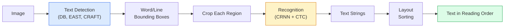

# OCR and Document Understanding

> OCR is a three-stage pipeline — detect text boxes, recognize characters, then lay them out. Every modern OCR system is reshuffling or merging these stages.

**Type:** Learn + Use
**Languages:** Python
**Prerequisites:** Phase 4 Lesson 06 (Detection), Phase 7 Lesson 02 (Self-Attention)
**Time:** ~45 min

## Learning Objectives

- Trace the classic OCR pipeline (detection -> recognition -> layout) and modern end-to-end alternatives (Donut, Qwen-VL-OCR)
- Implement CTC (Connectionist Temporal Classification) loss for sequence-to-sequence OCR training
- Use PaddleOCR or EasyOCR for production document parsing without training
- Distinguish OCR, layout parsing, and document understanding — pick the right tool for each task

## The Problem

Images full of text are everywhere: receipts, invoices, ID cards, scanned books, forms, whiteboards, signs, screenshots. Extracting structured data from them — not just characters, but "this is the total amount" — is one of the highest-value applied vision problems.

The field splits into three skill layers:

1. **OCR itself**: Turn pixels into text.
2. **Layout parsing**: Group OCR output into regions (title, body, table, header).
3. **Document understanding**: Extract structured fields from the layout ("invoice_total = $42.50").

Each layer has classic and modern approaches, and the gap between "I want text from an image" and "I want the total from this receipt" is wider than most teams realize.

## The Concept

### Classic Pipeline



- **Text detection** outputs per-line or per-word quadrilaterals.
- **Recognition** crops each region to a fixed height, runs a CNN + BiLSTM + CTC to produce character sequences.
- **Layout** reconstructs reading order (Latin: top-to-bottom, left-to-right; Arabic, Japanese differ).

### CTC in One Paragraph

OCR recognition produces a variable-length sequence from a fixed-length feature map. CTC (Graves et al., 2006) lets you train it without character-level alignment. The model outputs a distribution over (vocabulary + blank) at each time step; CTC loss marginalizes over all alignments that collapse to the target text after merging repeats and removing blanks.

```
Raw output: "h h h _ _ e e l l _ l l o _ _"
After merging repeats and removing blanks: "hello"
```

CTC is why CRNN worked in 2015 and is still training most production OCR models in 2026.

### Modern End-to-End Models

- **Donut** (Kim et al., 2022) — a ViT encoder + a text decoder; reads an image and directly outputs JSON. No text detector, no layout module.
- **TrOCR** — ViT + transformer decoder for line-level OCR.
- **Qwen-VL-OCR / InternVL** — full vision-language models fine-tuned for OCR tasks; best accuracy on complex documents in 2026.
- **PaddleOCR** — classic DB + CRNN pipeline in a mature production package; still the open-source workhorse.

End-to-end models need more data and compute but skip the error accumulation of multi-stage pipelines.

### Layout Parsing

For structured documents, run a layout detector (LayoutLMv3, DocLayNet) to label each region: Title, Paragraph, Figure, Table, Footnote. Reading order then becomes "traverse regions in layout order, concatenate."

For forms, use **key-value extraction** models (Donut for visually-rich documents, LayoutLMv3 for plain scans). They take image + detected text + positions and predict structured key-value pairs.

### Evaluation Metrics

- **Character Error Rate (CER)** — Levenshtein distance / reference length. Lower is better. Production target: < 2% on clean scans.
- **Word Error Rate (WER)** — same thing at word level.
- **F1 on structured fields** — for key-value tasks; measures whether `{invoice_total: 42.50}` appears correctly.
- **Edit distance on JSON** — for end-to-end document parsing; the Donut paper introduced a normalized tree edit distance.

## Build It

### Step 1: CTC Loss + Greedy Decoder

```python
import torch
import torch.nn as nn
import torch.nn.functional as F


def ctc_loss(log_probs, targets, input_lengths, target_lengths, blank=0):
    """
    log_probs:      (T, N, C) log-softmax over vocabulary including blank (index 0)
    targets:        (N, S) integer targets (no blank)
    input_lengths:  (N,) number of time steps used per sample
    target_lengths: (N,) target length per sample
    """
    return F.ctc_loss(log_probs, targets, input_lengths, target_lengths,
                      blank=blank, reduction="mean", zero_infinity=True)


def greedy_ctc_decode(log_probs, blank=0):
    """
    log_probs: (T, N, C) log-softmax
    Returns: list of index sequences (blanks removed, repeats merged)
    """
    preds = log_probs.argmax(dim=-1).transpose(0, 1).cpu().tolist()
    out = []
    for seq in preds:
        decoded = []
        prev = None
        for idx in seq:
            if idx != prev and idx != blank:
                decoded.append(idx)
            prev = idx
        out.append(decoded)
    return out
```

`F.ctc_loss` uses the efficient CuDNN implementation when available. The greedy decoder is simpler than beam search and typically within 1% CER of beam search.

### Step 2: Tiny CRNN Recognizer

Minimal CNN + BiLSTM for line-level OCR.

```python
class TinyCRNN(nn.Module):
    def __init__(self, vocab_size=40, hidden=128, feat=32):
        super().__init__()
        self.cnn = nn.Sequential(
            nn.Conv2d(1, feat, 3, 1, 1), nn.BatchNorm2d(feat), nn.ReLU(inplace=True),
            nn.MaxPool2d(2),
            nn.Conv2d(feat, feat * 2, 3, 1, 1), nn.BatchNorm2d(feat * 2), nn.ReLU(inplace=True),
            nn.MaxPool2d(2),
            nn.Conv2d(feat * 2, feat * 4, 3, 1, 1), nn.BatchNorm2d(feat * 4), nn.ReLU(inplace=True),
            nn.MaxPool2d((2, 1)),
            nn.Conv2d(feat * 4, feat * 4, 3, 1, 1), nn.BatchNorm2d(feat * 4), nn.ReLU(inplace=True),
            nn.MaxPool2d((2, 1)),
        )
        self.rnn = nn.LSTM(feat * 4, hidden, bidirectional=True, batch_first=True)
        self.head = nn.Linear(hidden * 2, vocab_size)

    def forward(self, x):
        # x: (N, 1, H, W)
        f = self.cnn(x)                # (N, C, H', W')
        f = f.mean(dim=2).transpose(1, 2)  # (N, W', C)
        h, _ = self.rnn(f)
        return F.log_softmax(self.head(h).transpose(0, 1), dim=-1)  # (W', N, vocab)
```

Fixed-height input (CNN max-pools height down to 1). Width is CTC's time dimension.

### Step 3: Synthetic OCR

Generate black-on-white digit strings for an end-to-end smoke test.

```python
import numpy as np

def synthetic_line(text, height=32, char_width=16):
    W = char_width * len(text)
    img = np.ones((height, W), dtype=np.float32)
    for i, c in enumerate(text):
        x = i * char_width
        shade = 0.0 if c.isalnum() else 0.5
        img[6:height - 6, x + 2:x + char_width - 2] = shade
    return img


def build_batch(strings, vocab):
    H = 32
    W = 16 * max(len(s) for s in strings)
    imgs = np.ones((len(strings), 1, H, W), dtype=np.float32)
    target_lengths = []
    targets = []
    for i, s in enumerate(strings):
        imgs[i, 0, :, :16 * len(s)] = synthetic_line(s)
        ids = [vocab.index(c) for c in s]
        targets.extend(ids)
        target_lengths.append(len(ids))
    return torch.from_numpy(imgs), torch.tensor(targets), torch.tensor(target_lengths)


vocab = ["_"] + list("0123456789abcdefghijklmnopqrstuvwxyz")
imgs, targets, lengths = build_batch(["hello", "world"], vocab)
print(f"images: {imgs.shape}   targets: {targets.shape}   lengths: {lengths.tolist()}")
```

Real OCR datasets add fonts, noise, rotation, blur, and color. The pipeline above remains identical.

### Step 4: Training Sketch

```python
model = TinyCRNN(vocab_size=len(vocab))
opt = torch.optim.Adam(model.parameters(), lr=1e-3)

for step in range(200):
    strings = ["abc" + str(step % 10)] * 4 + ["xyz" + str((step + 1) % 10)] * 4
    imgs, targets, target_lens = build_batch(strings, vocab)
    log_probs = model(imgs)  # (W', 8, vocab)
    input_lens = torch.full((8,), log_probs.size(0), dtype=torch.long)
    loss = ctc_loss(log_probs, targets, input_lens, target_lens, blank=0)
    opt.zero_grad(); loss.backward(); opt.step()
```

On this trivial synthetic data, loss should drop from ~3 to ~0.2 within 200 steps.

## Use It

Three production paths:

- **PaddleOCR** — mature, fast, multilingual. One-liner: `paddleocr.PaddleOCR(lang="en").ocr(image_path)`.
- **EasyOCR** — Python-native, multilingual, PyTorch backbone.
- **Tesseract** — classic; still useful for legacy scanned documents when models fall short.

For end-to-end document parsing, use Donut or a VLM:

```python
from transformers import DonutProcessor, VisionEncoderDecoderModel

processor = DonutProcessor.from_pretrained("naver-clova-ix/donut-base-finetuned-cord-v2")
model = VisionEncoderDecoderModel.from_pretrained("naver-clova-ix/donut-base-finetuned-cord-v2")
```

For receipts, invoices, and forms with reusable structure, fine-tune Donut. For arbitrary documents or OCR requiring reasoning, a VLM like Qwen-VL-OCR is the current default.

## Ship It

This lesson produces:

- `outputs/prompt-ocr-stack-picker.md` — a prompt that picks Tesseract / PaddleOCR / Donut / VLM-OCR given document type, language, and structure.
- `outputs/skill-ctc-decoder.md` — a skill that writes greedy and beam-search CTC decoders from scratch, with length normalization.

## Exercises

1. **(Easy)** Train TinyCRNN on 5-digit random number strings for 500 steps. Report CER on a held-out set.
2. **(Medium)** Replace greedy decoding with beam search (beam_width=5). Report CER difference. On which inputs does beam search win?
3. **(Hard)** Run PaddleOCR on a set of 20 receipts, extract line items, and compute F1 on {item_name, price} pairs against hand-labeled ground truth.

## Key Terms

| Term | What people say | What it actually is |
|------|----------------|----------------------|
| OCR | "get text from pixels" | Convert image regions into character sequences |
| CTC | "alignment-free loss" | A loss that trains sequence models without per-timestep labels; marginalizes over alignments |
| CRNN | "classic OCR model" | Convolutional feature extractor + BiLSTM + CTC; 2015 baseline still used in production |
| Donut | "end-to-end OCR" | ViT encoder + text decoder; outputs JSON directly from an image |
| Layout parsing | "find regions" | Detect and label Title/Table/Figure/Paragraph regions in a document |
| Reading order | "text sequence" | The order to arrange recognized regions into sentences; trivial for Latin, non-trivial for mixed layouts |
| CER / WER | "error rate" | Levenshtein distance at character or word granularity / reference length |
| VLM-OCR | "LLM that reads text" | A vision-language model trained or prompted for OCR tasks; current SOTA on complex documents |

## Further Reading

- [CRNN (Shi et al., 2015)](https://arxiv.org/abs/1507.05717) — the original CNN+RNN+CTC architecture
- [CTC (Graves et al., 2006)](https://www.cs.toronto.edu/~graves/icml_2006.pdf) — the original CTC paper; densely packed with algorithmic ideas
- [Donut (Kim et al., 2022)](https://arxiv.org/abs/2111.15664) — OCR-free document understanding transformer
- [PaddleOCR](https://github.com/PaddlePaddle/PaddleOCR) — open-source production OCR stack

