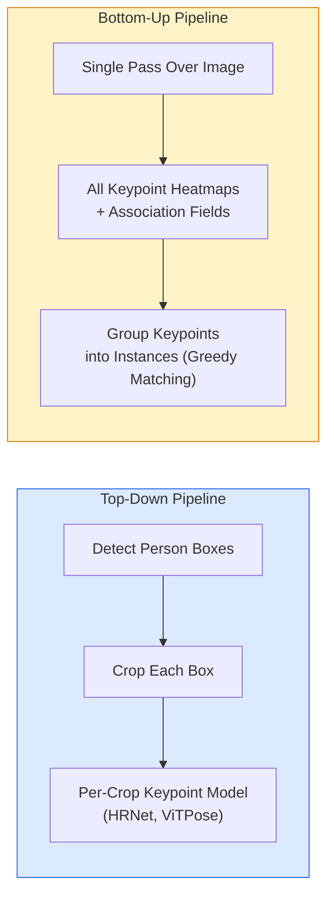

# Keypoint Detection and Pose Estimation

> A pose is an ordered set of keypoints. A keypoint detector is a heatmap regressor. Everything else is bookkeeping.

**Type:** Build
**Languages:** Python
**Prerequisites:** Phase 4 Lesson 06 (Detection), Phase 4 Lesson 07 (U-Net)
**Time:** ~45 min

## Learning Objectives

- Distinguish top-down and bottom-up pose estimation; state when to use each
- Regress heatmaps for K keypoints using a "one Gaussian per keypoint" target; extract keypoint coordinates at inference
- Explain Part Affinity Fields (PAFs) and how bottom-up pipelines associate keypoints to instances
- Use MediaPipe Pose or MMPose for production keypoint estimation; understand their output formats

## The Problem

Keypoint tasks hide under many names: body pose (17 body joints), face landmarks (68 or 478 points), hand (21 points), animal pose, robotic object pose, medical anatomical landmarks. All share the same structure: detect K discrete points on an object and output their (x, y) coordinates.

Pose estimation underpins motion capture, fitness apps, sports analysis, gesture control, animation, AR try-on, and robotic grasping. The 2D case is mature; 3D pose (estimating joint positions in world coordinates from a single camera) is the current research frontier.

The engineering problem is scale. Single-person pose on a single image is a 20ms problem. Multi-person pose at 30 fps in a crowd is a different problem with a different architecture.

## The Concept

### Top-Down vs Bottom-Up



- **Top-down** — detect people first, then run a per-person keypoint model on each crop. Highest accuracy; scales linearly with person count.
- **Bottom-up** — one forward pass predicts all keypoints plus an association field; then group. Constant time regardless of crowd size.

Top-down (HRNet, ViTPose) leads on accuracy; bottom-up (OpenPose, HigherHRNet) leads on throughput in crowded scenes.

### Heatmap Regression

Instead of directly regressing `(x, y)`, predict an `H x W` heatmap per keypoint with a Gaussian blob centered at the ground-truth location.

```
target[k, y, x] = exp(-((x - cx_k)^2 + (y - cy_k)^2) / (2 sigma^2))
```

At inference, the argmax of each heatmap is the predicted keypoint position.

Why heatmaps beat direct regression: the network's spatial structure (convolutional feature maps) naturally aligns with spatial outputs. The Gaussian target also regularizes — small localization errors produce small loss, not zero.

### Sub-Pixel Localization

Argmax gives integer coordinates. For sub-pixel accuracy, refine by fitting a parabola to the argmax and its neighbors, or use the famous offset `(dx, dy) = 0.25 * (heatmap[y, x+1] - heatmap[y, x-1], ...)` direction.

### Part Affinity Fields (PAFs)

OpenPose's trick for bottom-up association. For each pair of connected keypoints (e.g., left shoulder to left elbow), predict a 2-channel field encoding the unit vector pointing from one to the other. To associate a shoulder with its elbow, integrate the PAF along the line connecting candidate pairs; the pair with the highest integral is matched.

```
For each connection (limb):
  PAF channels: 2 (unit vector x, y)
  Line integral: sum of (PAF . line_direction) at sampled points
  Higher integral = stronger match
```

Elegant, and scales to arbitrary crowd sizes without per-person crops.

### COCO Keypoints

The standard body-pose dataset: 17 keypoints per person, metrics are PCK (Percentage of Correct Keypoints) and OKS (Object Keypoint Similarity). OKS is the keypoint equivalent of IoU, and is what COCO mAP@OKS reports.

### 2D vs 3D

- **2D pose** — image coordinates; production-quality (MediaPipe, HRNet, ViTPose).
- **3D pose** — world / camera coordinates; still active research. Common approaches:
  - Lift 2D predictions to 3D with a small MLP (VideoPose3D).
  - Regress 3D directly from images (PyMAF, MHFormer).
  - Multi-view setups (CMU Panoptic) provide ground truth.

## Build It

### Step 1: Gaussian Heatmap Target

```python
import numpy as np
import torch

def gaussian_heatmap(size, cx, cy, sigma=2.0):
    yy, xx = np.meshgrid(np.arange(size), np.arange(size), indexing="ij")
    return np.exp(-((xx - cx) ** 2 + (yy - cy) ** 2) / (2 * sigma ** 2)).astype(np.float32)

hm = gaussian_heatmap(64, 32, 32, sigma=2.0)
print(f"peak: {hm.max():.3f} at ({hm.argmax() % 64}, {hm.argmax() // 64})")
```

Per-keypoint heatmaps stacked along the channel axis give the full target tensor.

### Step 2: Tiny Keypoint Head

A U-Net-style model that outputs K heatmap channels.

```python
import torch.nn as nn
import torch.nn.functional as F

class TinyKeypointNet(nn.Module):
    def __init__(self, num_keypoints=4, base=16):
        super().__init__()
        self.down1 = nn.Sequential(nn.Conv2d(3, base, 3, 2, 1), nn.ReLU(inplace=True))
        self.down2 = nn.Sequential(nn.Conv2d(base, base * 2, 3, 2, 1), nn.ReLU(inplace=True))
        self.mid = nn.Sequential(nn.Conv2d(base * 2, base * 2, 3, 1, 1), nn.ReLU(inplace=True))
        self.up1 = nn.ConvTranspose2d(base * 2, base, 2, 2)
        self.up2 = nn.ConvTranspose2d(base, num_keypoints, 2, 2)

    def forward(self, x):
        h1 = self.down1(x)
        h2 = self.down2(h1)
        h3 = self.mid(h2)
        u1 = self.up1(h3)
        return self.up2(u1)
```

Input `(N, 3, H, W)`, output `(N, K, H, W)`. Loss is per-pixel MSE against the Gaussian target.

### Step 3: Inference — Extracting Keypoint Coordinates

```python
def heatmap_to_coords(heatmaps):
    """
    heatmaps: (N, K, H, W)
    Returns:  (N, K, 2) float coordinates in image pixels
    """
    N, K, H, W = heatmaps.shape
    hm = heatmaps.reshape(N, K, -1)
    idx = hm.argmax(dim=-1)
    ys = (idx // W).float()
    xs = (idx % W).float()
    return torch.stack([xs, ys], dim=-1)

coords = heatmap_to_coords(torch.randn(2, 4, 32, 32))
print(f"coords: {coords.shape}")  # (2, 4, 2)
```

One line at inference. For sub-pixel refinement, interpolate around the argmax.

### Step 4: Synthetic Keypoint Dataset

Simple: draw four dots on a white canvas and learn to predict them.

```python
def make_synthetic_sample(size=64):
    img = np.ones((3, size, size), dtype=np.float32)
    rng = np.random.default_rng()
    kps = rng.integers(8, size - 8, size=(4, 2))
    for cx, cy in kps:
        img[:, cy - 2:cy + 2, cx - 2:cx + 2] = 0.0
    hms = np.stack([gaussian_heatmap(size, cx, cy) for cx, cy in kps])
    return img, hms, kps
```

Simple enough that a small model learns it in one minute.

### Step 5: Training

```python
model = TinyKeypointNet(num_keypoints=4)
opt = torch.optim.Adam(model.parameters(), lr=3e-3)

for step in range(200):
    batch = [make_synthetic_sample() for _ in range(16)]
    imgs = torch.from_numpy(np.stack([b[0] for b in batch]))
    hms = torch.from_numpy(np.stack([b[1] for b in batch]))
    pred = model(imgs)
    # Upsample pred to full resolution
    pred = F.interpolate(pred, size=hms.shape[-2:], mode="bilinear", align_corners=False)
    loss = F.mse_loss(pred, hms)
    opt.zero_grad(); loss.backward(); opt.step()
```

## Use It

- **MediaPipe Pose** — Google's production pose estimator; offers WebGL + mobile runtimes with latency under 10ms.
- **MMPose** (OpenMMLab) — comprehensive research codebase; every SOTA architecture with pretrained weights.
- **YOLOv8-pose** — fastest real-time multi-person pose in a single forward pass.
- **transformers HumanDPT / PoseAnything** — newer vision-language approaches for open-vocabulary pose (any object, any keypoint set).

## Ship It

This lesson produces:

- `outputs/prompt-pose-stack-picker.md` — a prompt that picks MediaPipe / YOLOv8-pose / HRNet / ViTPose given latency, crowd size, and 2D vs 3D requirements.
- `outputs/skill-heatmap-to-coords.md` — a skill that writes the sub-pixel "heatmap to coordinates" routine used by every production pose model.

## Exercises

1. **(Easy)** Train the tiny keypoint model on the synthetic 4-point dataset. Report average L2 error between predicted and ground-truth keypoints after 200 steps.
2. **(Medium)** Add sub-pixel refinement: given the argmax position, fit a 1D parabola along x and y from neighboring pixels. Report accuracy improvement over integer argmax.
3. **(Hard)** Build a 2-person synthetic dataset where each image shows two instances of the 4-keypoint pattern. Train a bottom-up pipeline with PAFs predicting which keypoint belongs to which instance, and evaluate OKS.

## Key Terms

| Term | What people say | What it actually is |
|------|----------------|----------------------|
| Keypoint | "a landmark" | A specific ordered point on an object (joint, corner, feature) |
| Pose | "skeleton" | An ordered set of keypoints belonging to one instance |
| Top-down | "detect then pose" | Two-stage pipeline: person detector + per-crop keypoint model; highest accuracy |
| Bottom-up | "pose then group" | Single pass predicts all keypoints + grouping; constant time over crowd size |
| Heatmap | "Gaussian target" | An H x W tensor per keypoint with peak at the ground-truth location; the preferred regression target |
| PAF | "Part Affinity Field" | A 2-channel unit-vector field encoding limb direction; used to group keypoints into instances |
| OKS | "keypoint IoU" | Object Keypoint Similarity; the COCO metric for pose |
| HRNet | "high-resolution net" | The dominant top-down keypoint architecture; maintains high-resolution features throughout |

## Further Reading

- [OpenPose (Cao et al., 2017)](https://arxiv.org/abs/1812.08008) — bottom-up with PAFs; still the best explanation of the approach
- [HRNet (Sun et al., 2019)](https://arxiv.org/abs/1902.09212) — the reference top-down architecture
- [ViTPose (Xu et al., 2022)](https://arxiv.org/abs/2204.12484) — plain ViT as a pose backbone; current SOTA on many benchmarks
- [MediaPipe Pose](https://developers.google.com/mediapipe/solutions/vision/pose_landmarker) — production real-time pose; the fastest stack to deploy in 2026

